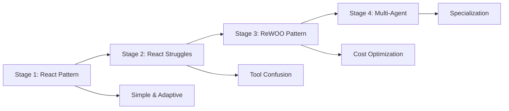
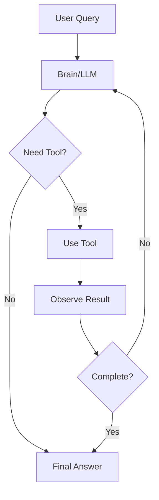
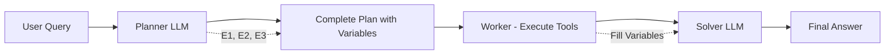
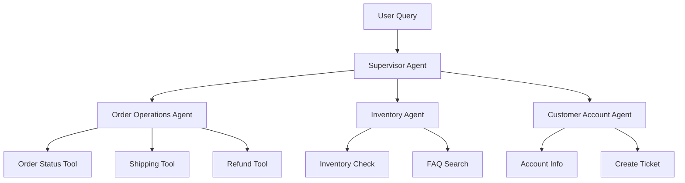
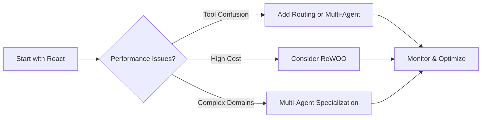

# Comprehensive Study Guide: Agentic AI Masterclass

## Table of Contents
1. [Introduction to Agentic AI](#introduction-to-agentic-ai)
2. [The Four-Stage Evolution Framework](#the-four-stage-evolution-framework)
3. [Stage 1: React Pattern](#stage-1-react-pattern)
4. [Stage 2: React Pattern Struggles](#stage-2-react-pattern-struggles)
5. [Stage 3: Reasoning Without Observation (ReWOO)](#stage-3-reasoning-without-observation-rewoo)
6. [Stage 4: Multi-Agent Specialization](#stage-4-multi-agent-specialization)
7. [Operational Constraints & Decision Framework](#operational-constraints--decision-framework)
8. [Real-World Case Studies](#real-world-case-studies)
9. [Interview Questions & Answers](#interview-questions--answers)
10. [Key Takeaways](#key-takeaways)

---

## Introduction to Agentic AI

### What is Agentic AI?
Think of Agentic AI like having a super-smart digital assistant that can think, plan, and use tools to solve problems - just like how you might use different apps on your phone to complete different tasks. But instead of you deciding which app to use when, the AI agent figures it out by itself!

### The Engineering Challenge
Building AI agents is primarily an **engineering problem** (80-85%), not a machine learning problem. According to Google's recent research, 80% of effort is spent on infrastructure, security, and validation - not on the agent's core intelligence.

### Common Problems in Production
- **Non-deterministic behavior**: Agents acting unpredictably
- **Tool confusion**: Calling wrong APIs frequently  
- **Latency spikes**: Slow response times
- **Security vulnerabilities**: Potential security risks
- **Unstable costs**: Unpredictable expenses
- **Infinite loops**: Agents getting stuck in cycles

---

## The Four-Stage Evolution Framework

This masterclass follows a journey through four stages of agent development, each addressing specific challenges:



---

## Stage 1: React Pattern

### Understanding React (Reason + Act)
The React pattern is like teaching someone to solve problems step by step:
1. **Think** about what to do
2. **Act** by using a tool
3. **Observe** the result
4. **Decide** if more action is needed

### How React Works


### Technical Implementation
- **State Management**: All messages and thought processes stored
- **Workflow**: Graph-based nodes and edges
- **Tools**: API methods wrapped with @tool annotation
- **System Prompt**: Detailed instructions and guardrails

### When to Use React Pattern
✅ **Good for:**
- Fewer tools (2-5 tools)
- Dynamic, human-like conversations
- Error tolerance acceptable
- Latency tolerance (few seconds)
- Few LLM calls per query acceptable

❌ **Avoid when:**
- Many tools (10+ tools)
- Strict latency requirements
- Cost is primary concern
- Highly predictable workflows

### Real-World Example: HubSpot
HubSpot used React pattern for their ChatSpot/Breeze agent to help users:
- Update records naturally
- Draft emails through conversation
- Generate reports via chat
- Navigate platform features intuitively

---

## Stage 2: React Pattern Struggles

### The Tool Confusion Problem
Imagine trying to choose the right tool from a toolbox with 40+ tools while blindfolded - that's what happens when agents have too many tools!

### Symptoms of Struggling React Agents
1. **Tool Confusion** (most noticeable first)
2. **High Iterations** (agent loops repeatedly)
3. **Latency Issues** (>10 seconds response time)
4. **Hallucinations** (incorrect tool parameters)
5. **Cost Spikes** (excessive LLM calls)

### Cost Impact Example
- **Simple Agent** (few tools): 5K tokens = $0.02 per query
- **Complex Agent** (many tools): 20K+ tokens = $0.15 per query
- **Daily Impact**: 10K queries = $200 vs $1,500 daily cost difference!

### GitHub Copilot Case Study
GitHub initially enabled 40+ tools for Copilot, causing:
- Tool confusion and distractions
- Parameter hallucinations
- Incorrect tool usage

**Solution**: Implemented embedding-based router to dynamically select top 6-10 most relevant tools based on query similarity.

---

## Stage 3: Reasoning Without Observation (ReWOO)

### The Planning Approach
ReWOO is like making a detailed shopping list before going to the store, then executing the list without changing it:

1. **Planner**: Creates complete plan with all steps
2. **Worker**: Executes tools (no LLM needed)
3. **Solver**: Packages final answer

### How ReWOO Works


### Plan Structure Example
```
Step 1: Check order status for order 12345 → Store in E1
Step 2: Analyze if E1 is delayed → Store in E2  
Step 3: Check inventory for E1 item → Store in E3
```

### Cost Comparison: React vs ReWOO
**React Pattern:**
- 5+ LLM calls (thinking between each tool)
- ~15,000 tokens
- Higher cost per query

**ReWOO Pattern:**
- 2 LLM calls (planner + solver)
- ~6,000 tokens  
- 60-70% token reduction

### When to Use ReWOO
✅ **Good for:**
- Many tool calls needed
- Predictable, linear workflows
- Independent, parallelizable tasks
- High volume, cost-sensitive operations
- Batch processing scenarios

❌ **Avoid when:**
- Dynamic, conversational interactions
- Unpredictable user inputs
- Need for mid-execution adaptations
- Customer service scenarios

### Real-World Example: Nutrient.io
Document processing platform used ReWOO for contract analysis:
- **Challenge**: Automate compliance checking across many documents
- **Solution**: Plan-then-execute approach for document analysis
- **Results**: 80% token reduction, better accuracy, parallel processing

---

## Stage 4: Multi-Agent Specialization

### The Supervisor Pattern
Think of this like a restaurant kitchen where:
- **Head Chef** (Supervisor): Coordinates everything
- **Specialized Cooks** (Sub-agents): Each expert in specific dishes
- **No Direct Communication**: All coordination through head chef

### Architecture Overview


### Implementation Approaches
1. **LangGraph's create_supervisor()**: Built-in abstraction
2. **Custom Implementation**: Agents as tools for supervisor

### Specialization Benefits
- **Domain Expertise**: Each agent focused on specific area
- **Reduced Cognitive Load**: Smaller tool sets per agent
- **Parallel Execution**: Multiple agents can work simultaneously
- **Security Boundaries**: Different access levels per domain

### When to Use Multi-Agent
✅ **Good for:**
- Naturally divided domains (orders, inventory, accounts)
- Different security requirements per domain
- Parallelism benefits outweigh coordination costs
- Complex workflows with clear specializations

❌ **Avoid when:**
- Simple, single-domain problems
- Cost is primary concern
- Maintenance complexity is prohibitive
- Tool count alone (not domain separation)

### Real-World Example: Uber's Agent Finch
Uber created a multi-agent system for financial analysts:

**Problem**: Complex SQL queries across multiple databases
**Solution**: Supervisor pattern with specialized agents:
- SQL Writing Agent
- Data Retrieval Agents (per database)
- Schema-Specific Agents
- Data Visualization Agent
- Validation Agent

**Interface**: Slack integration with natural language queries
**Results**: 
- Reduced SQL writing time
- Accessible to non-technical users
- Improved query accuracy
- Better data-driven decisions

---

## Operational Constraints & Decision Framework

### Three Key Constraints

#### 1. Latency (Response Time)
- **Sub-second**: Critical real-time applications
- **Few seconds**: Interactive applications  
- **Minutes**: Batch processing acceptable

#### 2. Cost (Token Consumption)
- **LLM Calls**: Each reasoning step costs money
- **Context Size**: Larger context = higher cost
- **Parallelism Trade-off**: Speed vs cost

#### 3. Complexity (Development & Maintenance)
- **Single Agent**: Simple to build and debug
- **Multi-Agent**: Complex coordination and monitoring
- **ReWOO**: Moderate complexity, rigid structure

### Decision Matrix

| Pattern | Latency | Cost | Complexity | Best Use Case |
|---------|---------|------|------------|---------------|
| React | Medium | Medium | Low | Interactive, adaptive |
| ReWOO | Low | Low | Medium | Batch, predictable |
| Multi-Agent | Variable | High | High | Domain specialization |

### Evolution Triggers
- **High Tool Count**: Consider routing or multi-agent
- **High Iterations**: Need better planning (ReWOO)
- **Large Context**: Implement summarization
- **Multiple Subtasks**: Consider parallelization

---

## Real-World Case Studies

### 1. Klarna's Customer Service Evolution
**Initial Approach**: Single agent trying to automate all support
**Problem**: Struggled with complexity, tried to "boil the ocean"
**Solution**: Combined AI + human agents with routing
**Result**: Equivalent workload of 700 full-time agents
**Recent Update**: Doubled down on human agents (reduced AI reliance)

### 2. GitHub Copilot's Tool Management
**Problem**: 40+ tools causing confusion and hallucinations
**Solution**: Embedding-based router for dynamic tool selection
**Result**: Reduced latency, fewer hallucinations, better accuracy

### 3. HubSpot's ChatSpot/Breeze
**Use Case**: Natural language interface for CRM operations
**Pattern**: React agent for adaptive conversations
**Success**: Integrated into main HubSpot platform

### 4. Nutrient.io's Document Processing
**Use Case**: Contract analysis and compliance checking
**Pattern**: ReWOO for predictable document workflows
**Result**: 80% cost reduction, improved accuracy

### 5. Uber's Agent Finch
**Use Case**: SQL query generation for financial analysts
**Pattern**: Multi-agent supervisor with domain specialists
**Interface**: Slack integration with natural language
**Impact**: Democratized data access, improved accuracy

---

## Interview Questions & Answers

### For Machine Learning Engineer (MLE) Roles

#### Q1: "Explain the trade-offs between React and ReWOO patterns for a production AI agent."

**Answer**: 
React offers adaptability and dynamic conversation flow but comes with higher cost due to multiple LLM calls and potential tool confusion with many tools. ReWOO optimizes for cost (60-70% token reduction) and works well for predictable workflows, but lacks adaptability since planning is decoupled from execution. Choose React for customer service scenarios requiring flexibility, ReWOO for batch processing or document analysis where workflows are linear and predictable.

#### Q2: "How would you detect and mitigate tool confusion in a React agent?"

**Answer**:
**Detection metrics:**
- High iteration count (>5 per query)
- Repeated tool calls to same tool
- Increased latency and cost per query

**Mitigation strategies:**
1. Reduce tool count (start with <5 tools)
2. Improve tool descriptions and reduce overlap
3. Implement embedding-based tool routing
4. Add better prompt engineering with examples
5. Consider multi-agent specialization for domain separation

#### Q3: "Design a multi-agent system for an e-commerce platform handling orders, inventory, and customer accounts."

**Answer**:
```
Supervisor Agent (customer-facing)
├── Order Operations Agent
│   ├── Get Order Status
│   ├── Modify Shipping  
│   └── Process Refunds
├── Inventory Agent
│   ├── Check Stock
│   └── Search Products
└── Account Agent
    ├── Account Info
    └── Create Support Ticket
```

**Considerations:**
- Each specialist has 2-4 domain-specific tools
- Supervisor handles routing and final response formatting
- Parallel execution where possible (order + inventory checks)
- Different security boundaries per domain

### For Software Development Engineer (SDE) in ML Roles

#### Q4: "How would you implement cost monitoring and optimization for an agent system?"

**Answer**:
**Monitoring:**
- Track token consumption per query/session
- Monitor LLM call frequency and patterns
- Measure iteration counts and tool usage
- Set up alerts for cost spikes

**Optimization:**
- Context summarization for long conversations
- Caching for repeated queries
- Model selection (smaller models for simple tasks)
- Pattern switching based on usage metrics

#### Q5: "Explain the engineering challenges in building production-ready AI agents."

**Answer**:
**Key challenges (80% of effort):**
1. **State Management**: Persistent conversation context
2. **Error Handling**: Graceful failures and retries
3. **Security**: Input validation, output sanitization
4. **Monitoring**: Observability and debugging
5. **Scalability**: Handling concurrent users
6. **Cost Control**: Token usage optimization

**Solutions:**
- Use frameworks like LangGraph for state management
- Implement comprehensive logging and tracing
- Add input/output validation layers
- Design for horizontal scaling
- Implement circuit breakers for external APIs

#### Q6: "How would you evaluate the performance of different agent patterns?"

**Answer**:
**Metrics to track:**
- **Accuracy**: Task completion rate, correct tool usage
- **Latency**: Response time distribution
- **Cost**: Token consumption, LLM calls per query
- **Reliability**: Error rates, timeout frequency
- **User Satisfaction**: Feedback scores, conversation quality

**Evaluation framework:**
1. A/B testing between patterns
2. Synthetic benchmarks for consistent comparison
3. Production monitoring with real user data
4. Cost-benefit analysis including maintenance overhead

### General AI/ML Interview Questions

#### Q7: "When would you choose a single agent vs multi-agent architecture?"

**Answer**:
**Single Agent when:**
- Problem fits single domain
- <10 tools needed
- Cost optimization is critical
- Simple maintenance preferred

**Multi-Agent when:**
- Naturally divided domains (orders, inventory, support)
- Different security requirements per domain
- Parallelism benefits justify coordination overhead
- Team specialization mirrors agent specialization

#### Q8: "Explain how you would handle context management in long conversations."

**Answer**:
**Strategies:**
1. **Summarization**: Periodically summarize conversation history
2. **Sliding Window**: Keep only recent N messages
3. **Hierarchical Context**: Different detail levels for different timeframes
4. **Checkpointing**: Persist state for session continuity
5. **Context Compression**: Extract key entities and relationships

**Implementation:**
- Use separate summarization model for cost efficiency
- Implement context size monitoring
- Design graceful degradation when context limits reached

#### Q9: "How do you ensure security in agentic AI systems?"

**Answer**:
**Security layers:**
1. **Input Validation**: Sanitize user inputs, prevent injection attacks
2. **Output Filtering**: Screen agent responses for sensitive information
3. **Tool Access Control**: Limit agent permissions per domain
4. **Audit Logging**: Track all agent actions and decisions
5. **Rate Limiting**: Prevent abuse and cost attacks

**Best practices:**
- Principle of least privilege for tool access
- Regular security audits of agent behavior
- Implement human-in-the-loop for sensitive operations
- Use secure API authentication for external tools

#### Q10: "Describe your approach to debugging a malfunctioning AI agent in production."

**Answer**:
**Debugging methodology:**
1. **Reproduce Issue**: Capture exact input and context
2. **Trace Execution**: Follow agent's thought process step-by-step
3. **Analyze Metrics**: Check iteration counts, tool usage patterns
4. **Review Logs**: Examine LLM calls and responses
5. **Test Isolation**: Isolate specific components (tools, prompts)

**Tools and techniques:**
- Comprehensive logging of agent state transitions
- LangSmith or similar for agent observability
- A/B testing for prompt modifications
- Synthetic test cases for regression testing
- Gradual rollback capabilities

---

## Key Takeaways

### 1. Architecture Drives Success
Production failures stem from architectural mismatch, not insufficient model intelligence. The right pattern for the problem is more important than using the largest, most capable model.

### 2. No Universal Solution
Each problem may require a different pattern. Even within the same pattern, implementation details matter significantly for optimization.

### 3. Complexity Has a Cost
Don't jump to complex patterns immediately. Start simple with React, monitor performance, and evolve based on actual needs and constraints.

### 4. Monitor Everything
Always track:
- **Cost**: Token consumption and LLM calls
- **Performance**: Iteration counts and latency
- **Quality**: Tool usage accuracy and user satisfaction
- **Reliability**: Error rates and system stability

### 5. Evolution Path


### 6. Business Impact Focus
Remember that technical elegance should serve business objectives:
- **Customer satisfaction** over architectural purity
- **Cost efficiency** balanced with capability
- **Maintainability** for long-term success
- **Scalability** for growth requirements

### 7. Team Considerations
- **Skills**: Match complexity to team capabilities
- **Resources**: Consider maintenance overhead
- **Timeline**: Simple solutions ship faster
- **Learning**: Build expertise incrementally

---

## Recommended Next Steps

1. **Hands-on Practice**: Implement each pattern with the provided code repository
2. **Experimentation**: Try different patterns on the same problem
3. **Monitoring Setup**: Implement comprehensive observability
4. **Cost Analysis**: Track and optimize token usage
5. **Security Review**: Implement proper security measures
6. **Team Training**: Ensure team understands trade-offs and maintenance requirements

---

*This study guide synthesizes the key concepts from the Agentic AI Masterclass, providing both theoretical understanding and practical implementation guidance for building production-ready AI agent systems.*