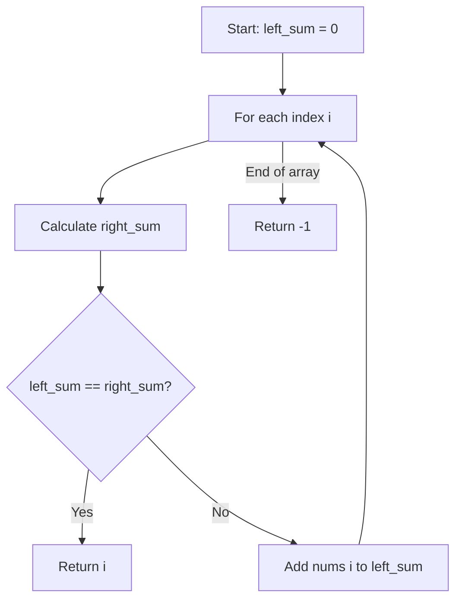
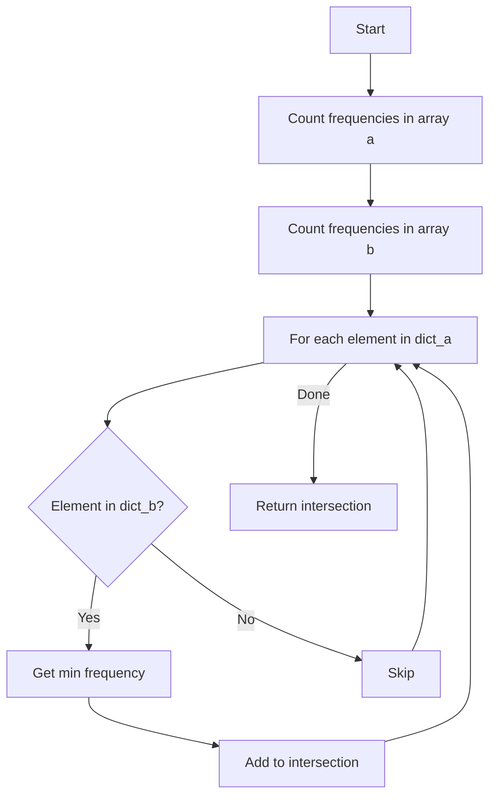

# IK Week 1 - Coding Guide

## Overview
This notebook contains practice exercises and coding problems from Week 1 of the Interview Kickstart course. It covers basic Python concepts and algorithmic problem-solving.

---

## Step-by-Step Code Analysis

### Step 1: Basic Print Statement

```python
# this is a time pass
print("My name is Shubham Varshney")
```

**Purpose**: Display text output to console.

**Key Points**:
- `print()` function outputs text to the screen
- Comments start with `#` and are ignored by Python

---

### Step 2: Variable Assignment and Type Checking

```python
a = 10
b = 6.2
```

**Purpose**: Store values in variables.

**Key Points**:
- `a` stores an integer (whole number)
- `b` stores a float (decimal number)
- No need to declare variable types in Python

```python
type(a)  # Returns: <class 'int'>
```

**Purpose**: Check the data type of a variable.

**Function**: `type(variable)` returns the class/type of the variable

---

### Step 3: Equality vs Identity Operators

```python
a = 5
b = 5.0

print(a == b)  # True
print(a is b)  # False
```

**Key Difference**:
- `==` (Equality): Compares **values** - checks if values are equal
- `is` (Identity): Compares **object identity** - checks if they're the same object in memory

**Why the difference?**
- `a == b` is `True` because 5 equals 5.0 in value
- `a is b` is `False` because they're different types (int vs float) stored in different memory locations

```python
a = 5
b = 5
print(a == b)  # True
print(a is b)  # True
```

**Why both True here?**
- Python caches small integers (-5 to 256) for efficiency
- Both `a` and `b` point to the same cached integer object

---

### Step 4: For Loop with Range

```python
for i in range(5):
    print("The value of i is :", i)
```

**Purpose**: Iterate a specific number of times.

**Arguments**:
- `range(5)`: Generates numbers from 0 to 4 (5 numbers total)
- Loop variable `i` takes each value in sequence

**Output**:
```
The value of i is : 0
The value of i is : 1
The value of i is : 2
The value of i is : 3
The value of i is : 4
```

---

### Step 5: Print with Custom End Character

```python
print("My name is Shubham", end='')
print("Varshney")
```

**Purpose**: Control what appears at the end of print statements.

**Arguments**:
- `end=''`: Changes the default newline (`\n`) to empty string
- This makes the next print continue on the same line

**Output**: `My name is ShubhamVarshney`

---

### Step 6: F-Strings (Formatted String Literals)

```python
a = 12
b = 1994
print(f"My birth month is {a} and year is {b}")
```

**Purpose**: Embed variables directly into strings.

**Syntax**:
- `f"..."` or `F"..."` prefix before the string
- `{variable}` to insert variable values
- More readable than concatenation or `.format()`

**Output**: `My birth month is 12 and year is 1994`

---

### Step 7: Type Hints in Functions

```python
def func(x: int) -> int:
    return x

print(func(2))        # 2
print(func(2.1))      # 2.1
print(func('Shubham')) # Shubham
```

**Purpose**: Document expected types (but not enforced).

**Type Hints**:
- `x: int`: Suggests parameter should be an integer
- `-> int`: Suggests function returns an integer
- **Important**: Python doesn't enforce these - they're just documentation

**Key Point**: The function accepts any type and returns it unchanged, despite the type hints.

---

### Step 8: List Indexing

```python
list = [1, 2, 'shubham']
print(list[2])  # 'shubham'
```

**Purpose**: Access elements by position.

**Key Points**:
- Lists can contain mixed types (heterogeneous)
- Index starts at 0
- `list[2]` accesses the third element

---

### Step 9: Leftmost Pivot Index Problem

```python
def leftmost_pivot(nums):
    left_sum = 0
    for i in range(len(nums)):
        right_sum = 0
        for j in range(i+1, len(nums)):
            right_sum += nums[j]
        if left_sum == right_sum:
            return i
        left_sum += nums[i]
    return -1

nums = [1,7,3,6,5,6]
print(leftmost_pivot(nums))  # Output: 3
```

**Purpose**: Find the index where sum of left elements equals sum of right elements.

**Algorithm**:
1. Track `left_sum` starting at 0
2. For each index `i`:
   - Calculate `right_sum` of all elements after `i`
   - If `left_sum == right_sum`, return `i`
   - Add current element to `left_sum`
3. Return -1 if no pivot found

**Arguments**:
- `nums`: List of integers to search

**Time Complexity**: O(n²) - nested loops

**Example**: `[1,7,3,6,5,6]`
- At index 3: left = [1,7,3] (sum=11), right = [5,6] (sum=11) ✓



---

### Step 10: Find First Occurrence in String

```python
def index_first_occurrence(needle, haystack):
    return haystack.find(needle)

print(index_first_occurrence("shu", "shshubhamsakshi"))  # Output: 2
```

**Purpose**: Find the starting index of a substring.

**Arguments**:
- `needle`: The substring to search for
- `haystack`: The string to search in

**Method**: `str.find(substring)`
- Returns the index of first occurrence
- Returns -1 if not found

**Example**: "shu" first appears at index 2 in "shshubhamsakshi"

---

### Step 11: Array Intersection with Frequency

```python
def get_intersection_with_maintained_frequency(a, b):
    """
    Args:
     a(list_int32)
     b(list_int32)
    Returns:
     list_int32
    """
    dict_a = {}
    dict_b = {}
    
    # Count frequencies in array a
    for value in a:
        if value in dict_a:
            dict_a[value] += 1
        else:
            dict_a[value] = 1
    
    # Count frequencies in array b
    for value in b:
        if value in dict_b:
            dict_b[value] += 1
        else:
            dict_b[value] = 1
    
    # Build intersection
    intersection = []
    for value, count in dict_a.items():
        if value in dict_b:
            intersection_count = min(count, dict_b[value])
            intersection.extend([value] * intersection_count)
    
    return intersection

print(get_intersection_with_maintained_frequency([2,3,3,4], [2,2,3,3,3,4]))
# Output: [2, 3, 3, 4]
```

**Purpose**: Find common elements between two arrays, maintaining their frequency.

**Algorithm**:
1. **Count frequencies**: Create dictionaries to count occurrences in both arrays
2. **Find intersection**: For each element in first array:
   - If it exists in second array
   - Take minimum frequency from both arrays
   - Add that many copies to result

**Key Methods**:
- `dict.items()`: Returns key-value pairs from dictionary
- `min(count1, count2)`: Takes the smaller frequency
- `list.extend([value] * count)`: Adds multiple copies of value

**Example**:
- Array a: [2,3,3,4] → {2:1, 3:2, 4:1}
- Array b: [2,2,3,3,3,4] → {2:2, 3:3, 4:1}
- Intersection: 2 appears min(1,2)=1 time, 3 appears min(2,3)=2 times, 4 appears min(1,1)=1 time
- Result: [2, 3, 3, 4]

**Time Complexity**: O(n + m) where n and m are array lengths



---

## Key Concepts Covered

### 1. Operators
- **Equality (`==`)**: Compares values
- **Identity (`is`)**: Compares object identity

### 2. String Formatting
- **F-strings**: Modern, readable way to format strings
- **Syntax**: `f"text {variable} more text"`

### 3. Type Hints
- Document expected types: `def func(x: int) -> int:`
- Not enforced by Python runtime
- Helpful for code documentation and IDE support

### 4. Dictionary Operations
- **Creating**: `dict = {}`
- **Checking existence**: `if key in dict:`
- **Adding/Updating**: `dict[key] = value` or `dict[key] += 1`
- **Iterating**: `for key, value in dict.items():`

### 5. List Methods
- **extend()**: Add multiple elements to list
- **Multiplication**: `[value] * count` creates list with repeated values

### 6. String Methods
- **find()**: Returns index of substring or -1 if not found

---

## Problem-Solving Patterns

### Pattern 1: Frequency Counting
Use dictionaries to count occurrences:
```python
freq = {}
for item in array:
    if item in freq:
        freq[item] += 1
    else:
        freq[item] = 1
```

### Pattern 2: Two-Pointer / Nested Loop
For comparing elements or finding pairs:
```python
for i in range(len(array)):
    for j in range(i+1, len(array)):
        # Compare array[i] and array[j]
```

### Pattern 3: Prefix Sum
Track cumulative sum while iterating:
```python
left_sum = 0
for i in range(len(array)):
    # Use left_sum
    left_sum += array[i]
```

---

## Key Takeaways

1. **`==` vs `is`**: Use `==` for value comparison, `is` for identity
2. **F-strings**: Modern, readable string formatting
3. **Type hints**: Documentation only, not enforced
4. **Dictionaries**: Excellent for frequency counting and lookups
5. **List operations**: `extend()` for adding multiple elements
6. **Algorithm design**: Break problems into steps (count, compare, build result)

This coding guide covers all major concepts and algorithms in the IK Week 1 notebook!
