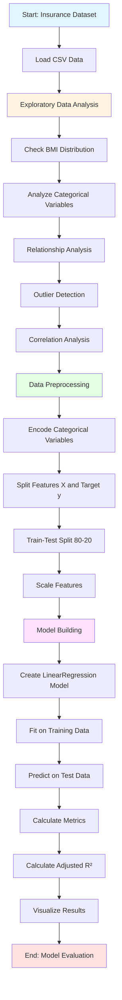
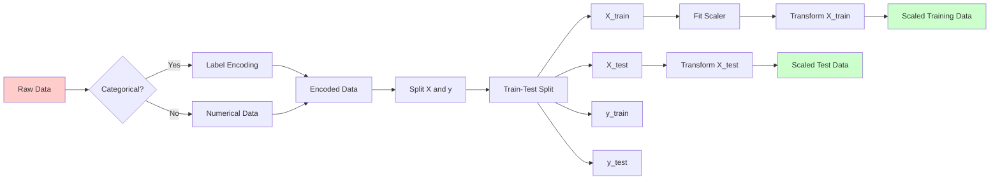
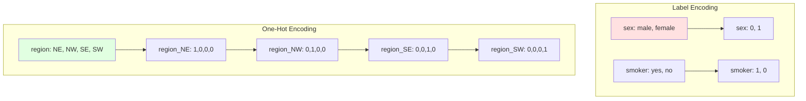
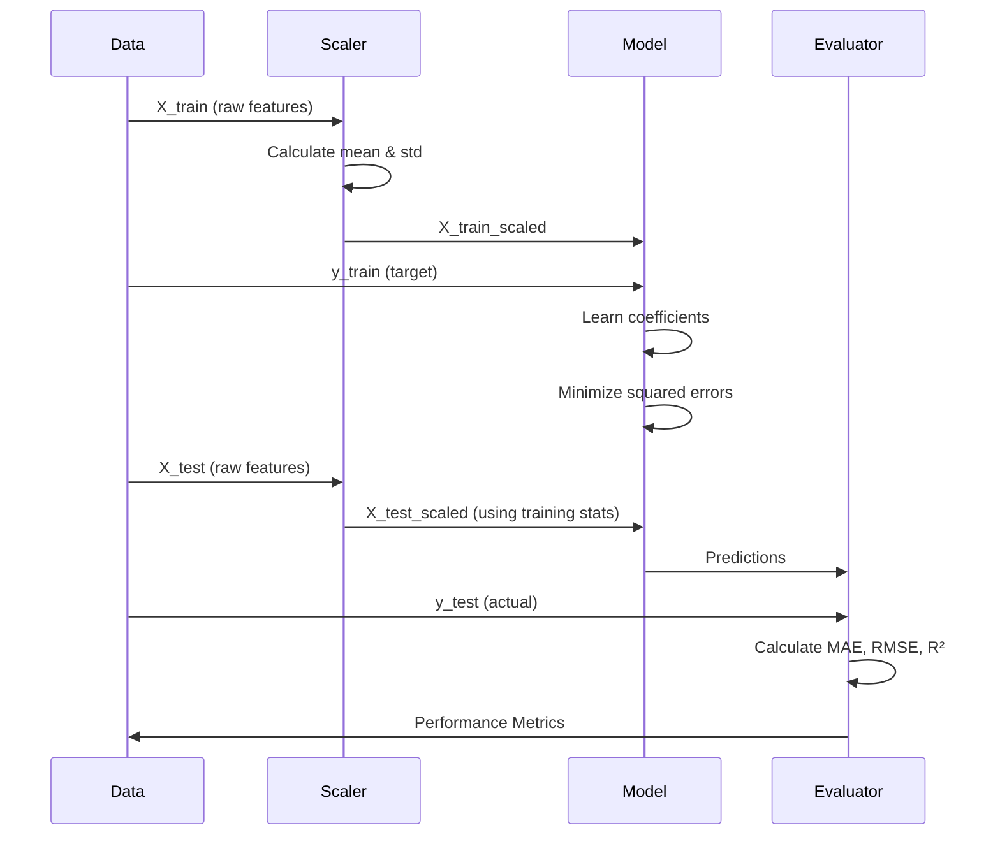
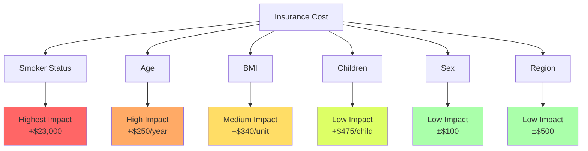
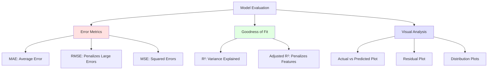
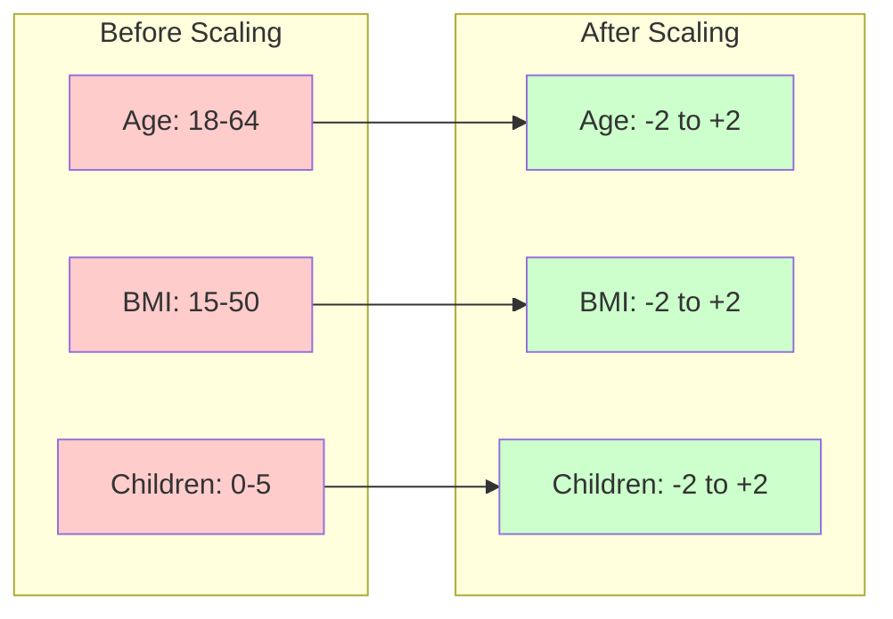

# Regression Assignment Solution - Coding Guide
## Insurance Cost Prediction using Linear Regression

## Overview
This notebook builds a regression model to predict insurance costs based on customer demographics and lifestyle attributes. The dataset includes age, BMI, children, smoking status, gender, and region.

---

## Step 1: Library Imports

```python
import numpy as np
import pandas as pd
import seaborn as sns
import matplotlib.pyplot as plt
from sklearn.linear_model import LinearRegression
from sklearn.metrics import mean_squared_error, mean_absolute_error, r2_score
from sklearn.preprocessing import StandardScaler, OneHotEncoder
from sklearn.model_selection import train_test_split
import os
```

### Why These Libraries?

- **numpy**: Numerical computations and array operations
- **pandas**: Data manipulation and analysis
- **seaborn & matplotlib**: Data visualization
- **sklearn.linear_model.LinearRegression**: Linear regression model implementation
- **sklearn.metrics**: Model evaluation metrics (MSE, MAE, R²)
- **sklearn.preprocessing.StandardScaler**: Feature scaling (normalize features)
- **sklearn.preprocessing.OneHotEncoder**: Convert categorical variables to numerical
- **sklearn.model_selection.train_test_split**: Split data into train/test sets
- **os**: Operating system operations (file paths)

---

## Step 2: Data Loading

```python
data = pd.read_csv("Insurance.csv")
data.head()
```

**Dataset Columns:**
- `age`: Customer age (numerical)
- `sex`: Gender (Male/Female)
- `bmi`: Body Mass Index (numerical)
- `children`: Number of children (numerical)
- `smoker`: Smoking status (Yes/No)
- `region`: Geographic location (southeast, southwest, northeast, northwest)
- `expenses`: Medical expenses (TARGET VARIABLE)

---

## Step 3: Exploratory Data Analysis (EDA)

### 3.1 Distribution Analysis - BMI

```python
plt.figure(figsize=(10, 6))
plt.hist(data['bmi'], bins=30, edgecolor='black', alpha=0.7)
plt.xlabel('BMI')
plt.ylabel('Frequency')
plt.title('Distribution of BMI')
plt.show()
```

**Key Arguments:**
- `bins=30`: Number of histogram bars (controls granularity)
- `edgecolor='black'`: Border color for bars
- `alpha=0.7`: Transparency (0=invisible, 1=opaque)

**What to Look For:**
- Is the distribution normal (bell-shaped)?
- Are there outliers (extreme values)?
- What's the typical BMI range?

### 3.2 Categorical Variable Distribution

```python
categorical_cols = ['sex', 'smoker', 'region']

fig, axes = plt.subplots(1, 3, figsize=(15, 5))

for i, col in enumerate(categorical_cols):
    data[col].value_counts().plot(kind='bar', ax=axes[i])
    axes[i].set_title(f'Distribution of {col}')
    axes[i].set_xlabel(col)
    axes[i].set_ylabel('Count')

plt.tight_layout()
plt.show()
```

**Key Concepts:**
- `value_counts()`: Counts occurrences of each category
- `plot(kind='bar')`: Creates bar chart
- `plt.subplots(1, 3)`: Creates 1 row, 3 columns of plots
- `enumerate()`: Gets both index and value in loop

**Purpose:** Understand the balance of categorical variables (e.g., are there equal males/females?)

### 3.3 Relationship Analysis - Smoker, Age, Expenses

```python
plt.figure(figsize=(12, 6))
sns.scatterplot(data=data, x='age', y='expenses', hue='smoker', alpha=0.6)
plt.title('Relationship between Age, Expenses, and Smoking Status')
plt.xlabel('Age')
plt.ylabel('Expenses')
plt.legend(title='Smoker')
plt.show()
```

**Key Arguments:**
- `hue='smoker'`: Colors points by smoking status
- `alpha=0.6`: Transparency to see overlapping points
- `sns.scatterplot()`: Creates scatter plot with seaborn

**Interpretation:**
- Do smokers have higher expenses?
- Does age correlate with expenses?
- Are there distinct clusters?

### 3.4 Outlier Detection

```python
numerical_cols = ['age', 'bmi', 'children', 'expenses']

fig, axes = plt.subplots(1, 4, figsize=(20, 5))

for i, col in enumerate(numerical_cols):
    axes[i].boxplot(data[col])
    axes[i].set_title(f'Boxplot of {col}')
    axes[i].set_ylabel(col)

plt.tight_layout()
plt.show()
```

**Understanding Boxplots:**
- **Box**: Contains middle 50% of data (Q1 to Q3)
- **Line in box**: Median (50th percentile)
- **Whiskers**: Extend to 1.5 × IQR from box
- **Dots beyond whiskers**: Outliers

**Why Detect Outliers?**
- Outliers can skew model predictions
- May indicate data errors or special cases
- Decision: Remove, transform, or keep them

### 3.5 Correlation Analysis

```python
plt.figure(figsize=(10, 8))
correlation_matrix = data.corr()
sns.heatmap(correlation_matrix, annot=True, cmap='coolwarm', 
            fmt='.2f', square=True, linewidths=1)
plt.title('Correlation Heatmap')
plt.show()
```

**Key Arguments:**
- `annot=True`: Show correlation values
- `cmap='coolwarm'`: Color scheme
- `fmt='.2f'`: Format to 2 decimal places
- `square=True`: Make cells square-shaped
- `linewidths=1`: Add borders between cells

**Interpretation:**
- Values close to +1: Strong positive correlation
- Values close to -1: Strong negative correlation
- Values close to 0: No linear relationship

---

## Step 4: Data Preprocessing

### Encoding Categorical Variables

```python
from sklearn.preprocessing import LabelEncoder

label_encoders = {}
categorical_columns = ['sex', 'smoker', 'region']

for col in categorical_columns:
    le = LabelEncoder()
    data[col] = le.fit_transform(data[col])
    label_encoders[col] = le
```

**What's Happening:**
- `LabelEncoder()`: Converts categories to numbers
  - Example: 'male' → 0, 'female' → 1
  - Example: 'yes' → 1, 'no' → 0
- `fit_transform()`: Learns categories and transforms in one step
- Stores encoders in dictionary for potential inverse transformation

**Alternative: One-Hot Encoding**
```python
# For nominal categories (no order)
data_encoded = pd.get_dummies(data, columns=['region'], drop_first=True)
```
- Creates binary columns for each category
- `drop_first=True`: Avoids multicollinearity

### Splitting Features and Target

```python
X = data.drop('expenses', axis=1)
y = data['expenses']
```

**What's Happening:**
- `X`: All features (independent variables)
- `y`: Target variable (what we're predicting)
- `axis=1`: Drop column (axis=0 would drop row)

### Train-Test Split

```python
X_train, X_test, y_train, y_test = train_test_split(
    X, y, test_size=0.2, random_state=42
)
```

**Arguments:**
- `test_size=0.2`: 20% for testing, 80% for training
- `random_state=42`: Ensures reproducibility

---

## Step 5: Model Building

### 5.1 Feature Scaling

```python
scaler = StandardScaler()
X_train_scaled = scaler.fit_transform(X_train)
X_test_scaled = scaler.transform(X_test)
```

**Why Scale Features?**
- Different features have different ranges (age: 18-64, BMI: 15-50)
- Scaling puts all features on same scale (mean=0, std=1)
- Improves model convergence and performance

**Critical Distinction:**
- `fit_transform()` on training data: Learns mean and std, then transforms
- `transform()` on test data: Uses training mean/std (prevents data leakage)

**Formula:**
```
scaled_value = (original_value - mean) / standard_deviation
```

### 5.2 Training the Model

```python
model = LinearRegression()
model.fit(X_train_scaled, y_train)
```

**What Happens:**
- Model learns coefficients (weights) for each feature
- Finds best-fit hyperplane in multi-dimensional space
- Minimizes sum of squared errors

### 5.3 Examining Coefficients

```python
coefficients = pd.DataFrame({
    'Feature': X.columns,
    'Coefficient': model.coef_
})
print(coefficients.sort_values('Coefficient', ascending=False))
print(f"\nIntercept: {model.intercept_}")
```

**Interpretation:**
- **Positive coefficient**: Feature increases expenses
- **Negative coefficient**: Feature decreases expenses
- **Magnitude**: Strength of effect
- **Intercept**: Baseline expense when all features = 0

**Example:**
```
smoker coefficient = 23,000
→ Smokers pay $23,000 more on average (all else equal)
```

### 5.4 Making Predictions

```python
y_pred = model.predict(X_test_scaled)
```

**What It Does:**
Uses learned equation:
```
expenses = intercept + (coef₁ × age) + (coef₂ × bmi) + ... + (coef₆ × region)
```

### 5.5 Model Evaluation

```python
mae = mean_absolute_error(y_test, y_pred)
mse = mean_squared_error(y_test, y_pred)
rmse = np.sqrt(mse)
r2 = r2_score(y_test, y_pred)

print(f"Mean Absolute Error (MAE): ${mae:.2f}")
print(f"Mean Squared Error (MSE): ${mse:.2f}")
print(f"Root Mean Squared Error (RMSE): ${rmse:.2f}")
print(f"R² Score: {r2:.4f}")
```

**Metrics Explained:**

1. **MAE (Mean Absolute Error)**
   - Average absolute difference between actual and predicted
   - Easy to interpret: "On average, predictions are off by $X"
   - Less sensitive to outliers

2. **MSE (Mean Squared Error)**
   - Average of squared errors
   - Penalizes large errors heavily
   - Unit: squared dollars (hard to interpret)

3. **RMSE (Root Mean Squared Error)**
   - Square root of MSE
   - Same unit as target (dollars)
   - More sensitive to outliers than MAE

4. **R² Score**
   - Proportion of variance explained
   - Range: 0 to 1 (higher is better)
   - 0.75 = model explains 75% of variance

### 5.6 Adjusted R²

```python
n = len(y_test)  # Number of samples
p = X_test.shape[1]  # Number of features

adjusted_r2 = 1 - (1 - r2) * (n - 1) / (n - p - 1)
print(f"Adjusted R²: {adjusted_r2:.4f}")
```

**Why Adjusted R²?**
- Regular R² always increases when adding features (even irrelevant ones)
- Adjusted R² penalizes adding features that don't improve model
- Better for comparing models with different numbers of features

**Formula:**
```
Adj R² = 1 - [(1 - R²) × (n - 1) / (n - p - 1)]
```
Where:
- n = number of samples
- p = number of features

### 5.7 Visualizing Predictions

```python
plt.figure(figsize=(10, 6))
plt.scatter(y_test, y_pred, alpha=0.5)
plt.plot([y_test.min(), y_test.max()], 
         [y_test.min(), y_test.max()], 
         'r--', lw=2)
plt.xlabel('Actual Expenses')
plt.ylabel('Predicted Expenses')
plt.title('Actual vs Predicted Expenses')
plt.show()
```

**Key Elements:**
- **Scatter plot**: Each point is one prediction
- **Red diagonal line**: Perfect predictions (y = x)
- **Points close to line**: Good predictions
- **Points far from line**: Poor predictions

**What to Look For:**
- Are points clustered around diagonal?
- Is there a pattern in errors (systematic bias)?
- Are errors larger for high or low values?

---

## Key Concepts Summary

### 1. Data Preprocessing Pipeline
1. Load data
2. Explore distributions and relationships
3. Handle missing values
4. Encode categorical variables
5. Scale numerical features
6. Split into train/test sets

### 2. Feature Engineering
- **Label Encoding**: For ordinal categories (has order)
- **One-Hot Encoding**: For nominal categories (no order)
- **Scaling**: Standardize features to same scale

### 3. Model Training
- Fit model on training data only
- Use learned parameters to predict on test data
- Never train on test data (data leakage)

### 4. Model Evaluation
- Use multiple metrics (MAE, RMSE, R²)
- Visualize predictions vs actual
- Check for patterns in errors

### 5. Interpretation
- Coefficients show feature importance
- Positive/negative indicates direction of effect
- Magnitude indicates strength of effect

---


## Workflow Diagrams

### Complete ML Pipeline



### Data Preprocessing Flow



### Feature Encoding Comparison



### Model Training Process



### Feature Impact on Insurance Cost



### Evaluation Metrics Hierarchy



### Scaling Impact Visualization



---

## Common Pitfalls and Solutions

### 1. Data Leakage
**Problem:** Using test data information during training
```python
# WRONG: Fit scaler on all data
scaler.fit(X)  # Includes test data!

# CORRECT: Fit only on training data
scaler.fit(X_train)
```

### 2. Forgetting to Scale Test Data
**Problem:** Scaling train but not test
```python
# WRONG
X_train_scaled = scaler.fit_transform(X_train)
model.fit(X_train_scaled, y_train)
y_pred = model.predict(X_test)  # Not scaled!

# CORRECT
X_train_scaled = scaler.fit_transform(X_train)
X_test_scaled = scaler.transform(X_test)
model.fit(X_train_scaled, y_train)
y_pred = model.predict(X_test_scaled)
```

### 3. Incorrect Encoding Choice
**Problem:** Using label encoding for nominal categories
```python
# WRONG: Region has no order
le = LabelEncoder()
data['region'] = le.fit_transform(data['region'])
# Creates false ordering: NE(0) < NW(1) < SE(2) < SW(3)

# CORRECT: Use one-hot encoding
data = pd.get_dummies(data, columns=['region'], drop_first=True)
```

### 4. Not Checking for Missing Values
```python
# Always check first
print(data.isnull().sum())

# Handle missing values
data = data.dropna()  # Remove rows
# OR
data['column'].fillna(data['column'].mean(), inplace=True)  # Impute
```

### 5. Overfitting with Too Many Features
**Solution:** Use Adjusted R² and feature selection
```python
# Check if adding feature improves Adjusted R²
# Remove features with low coefficients
# Use regularization (Ridge/Lasso)
```

---

## Interview Questions

### Q1: Why do we need to scale features in linear regression?
**Answer:** 
- Features have different scales (age: 18-64, expenses: 1000-60000)
- Without scaling, features with larger ranges dominate the model
- Gradient descent converges faster with scaled features
- Coefficients become comparable in magnitude
- Example: Age coefficient of 250 means $250 per year increase

### Q2: What's the difference between Label Encoding and One-Hot Encoding?
**Answer:**
- **Label Encoding**: Assigns integers to categories (male=0, female=1)
  - Use for: Ordinal data (low, medium, high)
  - Problem: Creates false ordering for nominal data
  
- **One-Hot Encoding**: Creates binary column for each category
  - Use for: Nominal data (region, color)
  - Creates: region_NE, region_NW, region_SE, region_SW
  - `drop_first=True`: Avoids multicollinearity

### Q3: Why is Adjusted R² better than R² for model comparison?
**Answer:**
- R² always increases when adding features (even random ones)
- Adjusted R² penalizes adding features that don't improve model
- Formula accounts for number of features and samples
- Use when comparing models with different feature counts
- Example: R²=0.85 with 20 features vs R²=0.83 with 5 features
  - Adjusted R² might favor the simpler model

### Q4: How do you interpret a coefficient in linear regression?
**Answer:**
- Coefficient represents change in target per unit change in feature
- Example: smoker coefficient = 23,000
  - Smokers pay $23,000 more (all else equal)
- Sign indicates direction (positive = increases, negative = decreases)
- Magnitude indicates strength of effect
- Only valid when features are scaled consistently

### Q5: What's the difference between MAE and RMSE?
**Answer:**
- **MAE**: Average absolute error
  - Less sensitive to outliers
  - Easy to interpret: "Average error is $X"
  - All errors weighted equally
  
- **RMSE**: Root mean squared error
  - More sensitive to outliers (squares errors)
  - Penalizes large errors more heavily
  - Same unit as target
  - Use when large errors are particularly bad

### Q6: Why split data into train and test sets?
**Answer:**
- Training data: Model learns patterns
- Test data: Evaluates generalization to unseen data
- Prevents overfitting (memorizing training data)
- Simulates real-world performance
- Typical split: 80% train, 20% test
- Never use test data during training (data leakage)

---

## Practice Exercises

1. **Feature Engineering**: Create interaction terms (age × smoker) and test if they improve R²

2. **Outlier Handling**: Remove outliers using IQR method and compare model performance

3. **Feature Selection**: Remove one feature at a time and observe impact on Adjusted R²

4. **Encoding Comparison**: Try both label encoding and one-hot encoding for region, compare results

5. **Scaling Methods**: Compare StandardScaler vs MinMaxScaler performance

6. **Residual Analysis**: Plot residuals and check for patterns indicating model violations

---

## Additional Resources

- [sklearn StandardScaler Documentation](https://scikit-learn.org/stable/modules/generated/sklearn.preprocessing.StandardScaler.html)
- [sklearn LabelEncoder Documentation](https://scikit-learn.org/stable/modules/generated/sklearn.preprocessing.LabelEncoder.html)
- [Understanding Adjusted R²](https://www.statisticshowto.com/probability-and-statistics/statistics-definitions/adjusted-r2/)
- [Feature Scaling Guide](https://scikit-learn.org/stable/modules/preprocessing.html)

---

**Created for:** Students learning Machine Learning  
**Difficulty Level:** Beginner to Intermediate  
**Prerequisites:** Python basics, pandas, basic statistics  
**Dataset:** Insurance cost prediction
