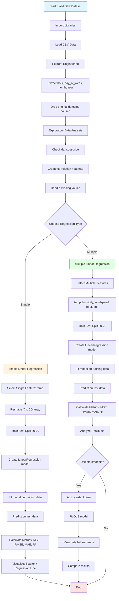
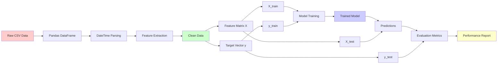
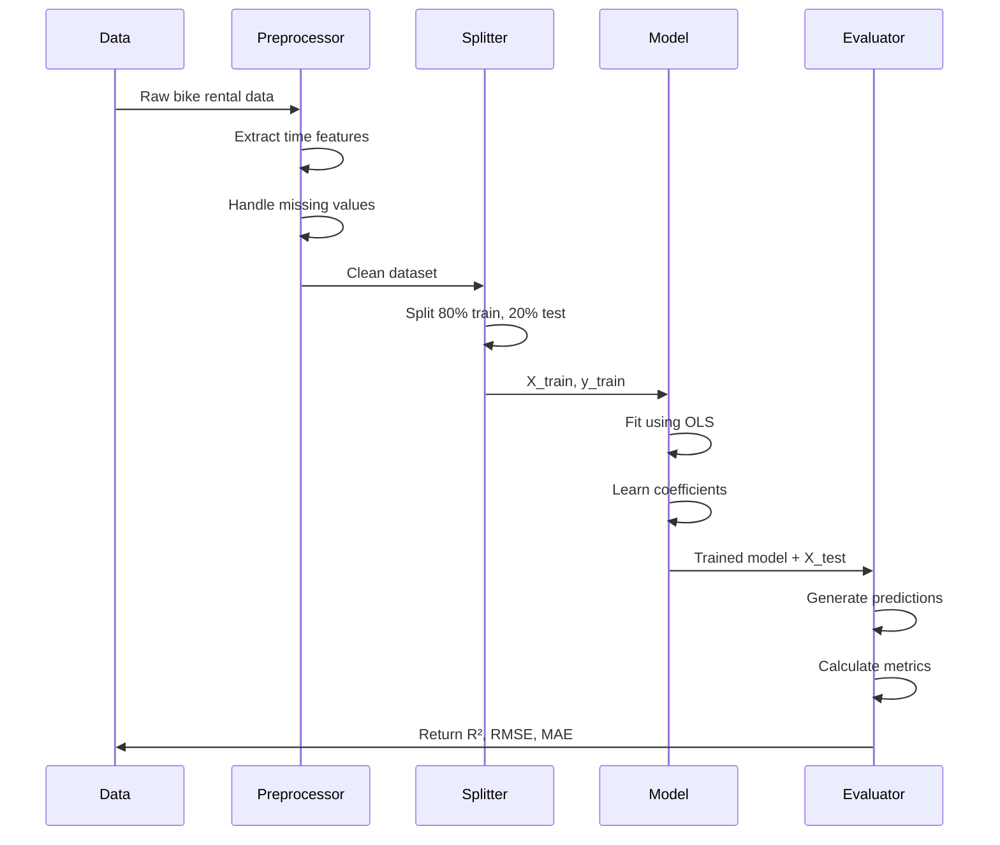
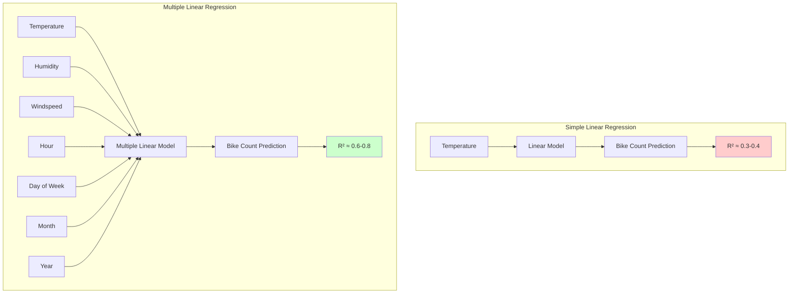
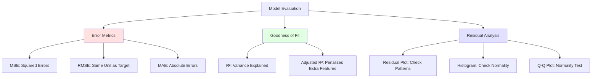

# Student Regression Algorithm Notebook - Coding Guide

## Overview
This notebook demonstrates Linear Regression (both Simple and Multiple) using the Bike Sharing dataset. You'll learn how to predict bike rental demand based on weather and temporal features.

---

## Section 1: Library Imports

```python
import numpy as np
import pandas as pd
import seaborn as sns
import matplotlib.pyplot as plt
import warnings
from sklearn.exceptions import ConvergenceWarning
warnings.filterwarnings("ignore", category=ConvergenceWarning)
```

### Why These Libraries?

- **numpy**: Mathematical operations and array manipulations
- **pandas**: Data loading, manipulation, and analysis (DataFrames)
- **seaborn**: Statistical data visualization (built on matplotlib)
- **matplotlib.pyplot**: Creating plots and charts
- **warnings**: Suppress convergence warnings that might clutter output
- **sklearn.exceptions.ConvergenceWarning**: Specific warning type to ignore

---

## Section 2: Data Loading and Preprocessing

### Loading Data
```python
data = pd.read_csv("BikeDataset.csv", header=0)
```

**Arguments:**
- `header=0`: First row contains column names

### DateTime Feature Engineering
```python
data["datetime"] = pd.to_datetime(data["datetime"])
data["hour"] = data["datetime"].dt.hour
data["day_of_week"] = data["datetime"].dt.dayofweek
data["month"] = data["datetime"].dt.month
data["year"] = data["datetime"].dt.year
data.drop(columns=["datetime"], inplace=True)
```

**What's Happening:**
- `pd.to_datetime()`: Converts string to datetime object for time-based operations
- `.dt.hour`: Extracts hour (0-23) from datetime
- `.dt.dayofweek`: Extracts day of week (0=Monday, 6=Sunday)
- `.dt.month`: Extracts month (1-12)
- `.dt.year`: Extracts year
- `drop()`: Removes original datetime column after extracting features
- `inplace=True`: Modifies the DataFrame directly without creating a copy

**Why Extract These Features?**
Time-based patterns affect bike rentals (rush hours, weekends, seasons). Breaking datetime into components helps the model learn these patterns.

---

## Section 3: Simple Linear Regression

### Understanding the Data
```python
data.describe()
```
**Purpose:** Shows statistical summary (count, mean, std, min, max, quartiles) for all numeric columns.

### Correlation Analysis
```python
plt.figure(figsize=(12, 10))
correlation_matrix = data.corr()
sns.heatmap(correlation_matrix, annot=True, cmap='coolwarm', fmt='.2f')
plt.title('Correlation Heatmap')
plt.show()
```

**Key Arguments:**
- `figsize=(12, 10)`: Sets plot size in inches (width, height)
- `annot=True`: Displays correlation values on heatmap
- `cmap='coolwarm'`: Color scheme (blue=negative, red=positive correlation)
- `fmt='.2f'`: Format numbers to 2 decimal places

**What to Look For:**
- Values close to +1: Strong positive correlation
- Values close to -1: Strong negative correlation
- Values close to 0: No linear relationship

### Handling Missing Values
```python
data = data.dropna()
data.isna().sum()
```

**What's Happening:**
- `dropna()`: Removes rows with any missing values
- `isna().sum()`: Counts missing values per column (should be 0 after dropna)

### Preparing Data for Simple Linear Regression
```python
X = data['temp'].values.reshape(-1, 1)
y = data['count'].values
```

**Critical Concept:**
- `values`: Converts pandas Series to numpy array
- `reshape(-1, 1)`: Converts 1D array to 2D column vector
  - `-1`: Automatically calculates rows based on data length
  - `1`: One column
  - **Why?** sklearn requires 2D input for features (even with one feature)

### Train-Test Split
```python
from sklearn.model_selection import train_test_split

X_train, X_test, y_train, y_test = train_test_split(
    X, y, test_size=0.2, random_state=42
)
```

**Arguments:**
- `test_size=0.2`: 20% data for testing, 80% for training
- `random_state=42`: Seed for reproducibility (same split every time)

**Returns:** 4 arrays
- `X_train`: Training features
- `X_test`: Testing features
- `y_train`: Training target values
- `y_test`: Testing target values

### Training the Model
```python
from sklearn.linear_model import LinearRegression

model = LinearRegression()
model.fit(X_train, y_train)
```

**What's Happening:**
- `LinearRegression()`: Creates model object using Ordinary Least Squares (OLS)
- `fit()`: Trains model by finding best-fit line (minimizes squared errors)
  - Calculates: `y = mx + b` where m=slope, b=intercept

### Model Coefficients
```python
print(f"Coefficient (slope): {model.coef_[0]}")
print(f"Intercept: {model.intercept_}")
```

**Interpretation:**
- **Coefficient**: Change in bike count per 1°C temperature increase
- **Intercept**: Predicted bike count when temperature = 0°C

### Making Predictions
```python
y_pred = model.predict(X_test)
```

**What It Does:** Uses learned equation to predict bike counts for test temperatures.

### Visualization
```python
plt.figure(figsize=(10, 6))
plt.scatter(X_test, y_test, color='blue', alpha=0.5, label='Actual')
plt.plot(X_test, y_pred, color='red', linewidth=2, label='Predicted')
plt.xlabel('Temperature (°C)')
plt.ylabel('Bike Count')
plt.title('Simple Linear Regression: Temperature vs Bike Count')
plt.legend()
plt.show()
```

**Key Arguments:**
- `alpha=0.5`: Transparency (0=invisible, 1=opaque)
- `linewidth=2`: Thickness of regression line
- `plt.legend()`: Shows label box

### Model Evaluation
```python
from sklearn.metrics import mean_squared_error, r2_score, mean_absolute_error

mse = mean_squared_error(y_test, y_pred)
rmse = np.sqrt(mse)
mae = mean_absolute_error(y_test, y_pred)
r2 = r2_score(y_test, y_pred)

print(f"Mean Squared Error (MSE): {mse:.2f}")
print(f"Root Mean Squared Error (RMSE): {rmse:.2f}")
print(f"Mean Absolute Error (MAE): {mae:.2f}")
print(f"R² Score: {r2:.4f}")
```

**Metrics Explained:**

1. **MSE (Mean Squared Error)**
   - Average of squared differences between actual and predicted
   - Formula: `Σ(actual - predicted)² / n`
   - Penalizes large errors heavily
   - Unit: squared units (bikes²)

2. **RMSE (Root Mean Squared Error)**
   - Square root of MSE
   - Same unit as target variable (bikes)
   - Easier to interpret than MSE
   - Lower is better

3. **MAE (Mean Absolute Error)**
   - Average of absolute differences
   - Formula: `Σ|actual - predicted| / n`
   - Less sensitive to outliers than RMSE
   - Unit: same as target (bikes)

4. **R² Score (Coefficient of Determination)**
   - Proportion of variance explained by model
   - Range: 0 to 1 (can be negative for bad models)
   - 0.7 = model explains 70% of variance
   - Higher is better

---

## Section 4: Multiple Linear Regression

### Selecting Multiple Features
```python
feature_columns = ['temp', 'humidity', 'windspeed', 'hour', 'day_of_week', 'month', 'year']
X = data[feature_columns].values
y = data['count'].values
```

**Why Multiple Features?**
Bike demand depends on multiple factors, not just temperature. Using more relevant features improves predictions.

### Train-Test Split
```python
X_train, X_test, y_train, y_test = train_test_split(
    X, y, test_size=0.2, random_state=42
)
```
Same as before, but now X has multiple columns.

### Training Multiple Linear Regression
```python
model_multi = LinearRegression()
model_multi.fit(X_train, y_train)
```

**Model Equation:**
`count = b₀ + b₁×temp + b₂×humidity + b₃×windspeed + b₄×hour + b₅×day_of_week + b₆×month + b₇×year`

### Examining Coefficients
```python
coefficients = pd.DataFrame({
    'Feature': feature_columns,
    'Coefficient': model_multi.coef_
})
print(coefficients)
print(f"\nIntercept: {model_multi.intercept_}")
```

**Interpretation:**
- Each coefficient shows the effect of that feature on bike count
- Positive coefficient: Feature increases bike count
- Negative coefficient: Feature decreases bike count
- Magnitude: Strength of the effect

### Predictions and Evaluation
```python
y_pred_multi = model_multi.predict(X_test)

mse_multi = mean_squared_error(y_test, y_pred_multi)
rmse_multi = np.sqrt(mse_multi)
mae_multi = mean_absolute_error(y_test, y_pred_multi)
r2_multi = r2_score(y_test, y_pred_multi)
```

**Expected Result:** Multiple regression should have better R² and lower errors than simple regression.

### Residual Analysis
```python
residuals = y_test - y_pred_multi

plt.figure(figsize=(12, 5))

# Residual plot
plt.subplot(1, 2, 1)
plt.scatter(y_pred_multi, residuals, alpha=0.5)
plt.axhline(y=0, color='r', linestyle='--')
plt.xlabel('Predicted Values')
plt.ylabel('Residuals')
plt.title('Residual Plot')

# Residual distribution
plt.subplot(1, 2, 2)
plt.hist(residuals, bins=50, edgecolor='black')
plt.xlabel('Residuals')
plt.ylabel('Frequency')
plt.title('Distribution of Residuals')

plt.tight_layout()
plt.show()
```

**What to Look For:**

1. **Residual Plot:**
   - Should show random scatter around y=0
   - No patterns = good model
   - Funnel shape = heteroscedasticity (variance changes)
   - Curve = non-linear relationship

2. **Residual Distribution:**
   - Should be approximately normal (bell-shaped)
   - Centered at 0
   - Validates regression assumptions

**Key Arguments:**
- `plt.subplot(1, 2, 1)`: Creates grid (1 row, 2 columns, position 1)
- `plt.axhline(y=0)`: Horizontal line at y=0
- `bins=50`: Number of histogram bars
- `edgecolor='black'`: Border color for bars
- `plt.tight_layout()`: Adjusts spacing to prevent overlap

---

## Section 5: Alternative Implementation (statsmodels)

### Why statsmodels?
Provides detailed statistical information (p-values, confidence intervals, statistical tests) that sklearn doesn't offer.

### Adding Constant Term
```python
import statsmodels.api as sm

X_train_sm = sm.add_constant(X_train)
X_test_sm = sm.add_constant(X_test)
```

**Why add_constant?**
- sklearn automatically includes intercept
- statsmodels requires explicit constant column for intercept
- Adds column of 1s to feature matrix

### Training with OLS
```python
model_sm = sm.OLS(y_train, X_train_sm)
results = model_sm.fit()
print(results.summary())
```

**Arguments:**
- `OLS`: Ordinary Least Squares regression
- Order: `(y, X)` - opposite of sklearn!

**Summary Output Includes:**
- **R-squared**: Model fit quality
- **Adj. R-squared**: R² adjusted for number of features
- **F-statistic**: Overall model significance
- **Coefficients**: Feature effects
- **P-values**: Statistical significance (p < 0.05 = significant)
- **Confidence Intervals**: Range of likely coefficient values

### Making Predictions
```python
y_pred_sm = results.predict(X_test_sm)
```

### Evaluation
```python
mse_sm = mean_squared_error(y_test, y_pred_sm)
rmse_sm = np.sqrt(mse_sm)
r2_sm = r2_score(y_test, y_pred_sm)
```

**Note:** Results should match sklearn's LinearRegression (both use OLS).

---

## Key Concepts Summary

### 1. Simple vs Multiple Linear Regression
- **Simple**: One feature → One target
- **Multiple**: Many features → One target

### 2. Model Training Process
1. Load and preprocess data
2. Split into train/test sets
3. Fit model on training data
4. Predict on test data
5. Evaluate performance

### 3. Feature Engineering
- Extract meaningful features from raw data
- Time-based features capture temporal patterns
- More relevant features → better predictions

### 4. Model Evaluation
- Use multiple metrics (RMSE, MAE, R²)
- Visualize predictions vs actual
- Analyze residuals for model assumptions

### 5. Assumptions of Linear Regression
- **Linearity**: Relationship between X and y is linear
- **Independence**: Observations are independent
- **Homoscedasticity**: Constant variance of residuals
- **Normality**: Residuals are normally distributed

---

## Common Pitfalls to Avoid

1. **Forgetting reshape(-1, 1)** for single feature
2. **Not splitting data** before training (data leakage)
3. **Using training data for evaluation** (overfitting illusion)
4. **Ignoring missing values** (causes errors)
5. **Not checking residuals** (violates assumptions)

---

## Practice Exercises

1. Try different features for simple linear regression (humidity, hour)
2. Add interaction terms (temp × humidity)
3. Compare R² scores across different feature combinations
4. Identify which features have strongest impact (largest coefficients)
5. Check if residuals meet normality assumption

---


## Workflow Diagram



## Data Flow Diagram



## Model Training Process



## Simple vs Multiple Regression Comparison



## Evaluation Metrics Hierarchy



---

## Interview Questions Based on This Notebook

### Question 1: Why do we reshape X to (-1, 1) for simple linear regression?
**Answer:** sklearn's `fit()` method expects a 2D array where rows are samples and columns are features. Even with one feature, we need a 2D array with shape (n_samples, 1). The `-1` tells numpy to automatically calculate the number of rows based on the data length.

### Question 2: What's the difference between MSE and RMSE?
**Answer:** 
- MSE (Mean Squared Error) is in squared units, making it hard to interpret
- RMSE (Root Mean Squared Error) is the square root of MSE, returning to original units
- RMSE is more interpretable (e.g., "average error of 50 bikes" vs "2500 bikes²")
- Both penalize large errors more than MAE

### Question 3: Why is R² better for multiple regression than simple regression?
**Answer:** Multiple regression typically has higher R² because:
- More features capture more variance in the target
- Each relevant feature explains additional patterns
- However, watch for overfitting - use Adjusted R² which penalizes adding too many features

### Question 4: What does a residual plot tell you?
**Answer:** A residual plot shows prediction errors vs predicted values:
- Random scatter around 0 = good model
- Patterns/curves = model missing non-linear relationships
- Funnel shape = heteroscedasticity (variance changes with prediction level)
- Outliers = unusual observations that don't fit the pattern

### Question 5: When would you use statsmodels instead of sklearn?
**Answer:** Use statsmodels when you need:
- P-values for statistical significance testing
- Confidence intervals for coefficients
- Detailed statistical diagnostics
- Hypothesis testing (F-test, t-test)
- sklearn is better for prediction-focused machine learning workflows

---

## Additional Resources

- [sklearn LinearRegression Documentation](https://scikit-learn.org/stable/modules/generated/sklearn.linear_model.LinearRegression.html)
- [statsmodels OLS Documentation](https://www.statsmodels.org/stable/generated/statsmodels.regression.linear_model.OLS.html)
- [Understanding R² Score](https://scikit-learn.org/stable/modules/model_evaluation.html#r2-score)
- [Regression Assumptions](https://www.statisticssolutions.com/free-resources/directory-of-statistical-analyses/assumptions-of-linear-regression/)

---

**Created for:** Students learning Python and Machine Learning  
**Difficulty Level:** Beginner to Intermediate  
**Prerequisites:** Basic Python, pandas, numpy knowledge
