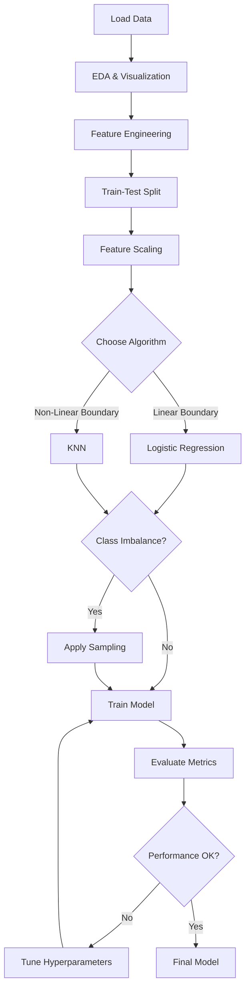

# Coding Guide: Student Classification Algorithms 1

## Overview
This notebook demonstrates classification algorithms (Logistic Regression and KNN) applied to credit card default prediction. The goal is to predict whether a credit card client will default on their payment next month.

---

## Section 1: Library Imports

```python
import pandas as pd
import numpy as np
import seaborn as sns
import matplotlib.pyplot as plt

from sklearn.model_selection import train_test_split, GridSearchCV
from sklearn.metrics import accuracy_score, confusion_matrix, classification_report
from sklearn.metrics import precision_score, recall_score, f1_score, roc_auc_score, roc_curve

pd.set_option('display.max_columns', 30)
```

### Why These Libraries?

**pandas (pd)**: Data manipulation and analysis
- Used for reading Excel files, creating DataFrames, data cleaning, and transformation
- Essential for handling tabular data

**numpy (np)**: Numerical computing
- Provides support for arrays and mathematical operations
- Used for numerical calculations and array manipulations

**seaborn (sns) & matplotlib.pyplot (plt)**: Data visualization
- seaborn: High-level interface for statistical graphics
- matplotlib: Low-level plotting library for creating visualizations
- Used together to create informative plots about data distribution and model performance

**sklearn.model_selection**:
- `train_test_split`: Splits dataset into training and testing sets
  - Syntax: `train_test_split(X, y, test_size=0.3, random_state=42)`
  - `test_size`: Proportion of data for testing (0.3 = 30%)
  - `random_state`: Ensures reproducible splits
  
- `GridSearchCV`: Automated hyperparameter tuning
  - Tries different parameter combinations to find the best model
  - Uses cross-validation to evaluate each combination

**sklearn.metrics**: Model evaluation tools
- `accuracy_score`: Percentage of correct predictions
- `confusion_matrix`: Shows true positives, false positives, true negatives, false negatives
- `classification_report`: Comprehensive report with precision, recall, F1-score
- `precision_score`: How many predicted positives are actually positive
- `recall_score`: How many actual positives were correctly identified
- `f1_score`: Harmonic mean of precision and recall
- `roc_auc_score`: Area under ROC curve (measures model's ability to distinguish classes)
- `roc_curve`: Data for plotting ROC curve

**pd.set_option('display.max_columns', 30)**: 
- Configures pandas to display up to 30 columns when printing DataFrames
- Prevents column truncation in output

---

## Section 2: Data Loading

```python
data = pd.read_excel("credit_card_clients.xls", skiprows=1, header=0)
data.head()
```

### Key Functions:

**pd.read_excel()**:
- `filename`: Path to Excel file
- `skiprows=1`: Skips the first row (often contains metadata)
- `header=0`: Uses row 0 (after skipping) as column names

**data.head()**:
- Displays first 5 rows of the DataFrame
- Useful for quick data inspection

### Dataset Features:
- **ID**: Unique identifier for each client
- **LIMIT_BAL**: Credit limit in NT dollars
- **SEX**: Gender (1=male, 2=female)
- **EDUCATION**: Education level (1=graduate school, 2=university, 3=high school, 4=others)
- **MARRIAGE**: Marital status (1=married, 2=single, 3=others)
- **AGE**: Age in years
- **PAY_0 to PAY_6**: Repayment status for 6 months (-1=pay duly, 1-9=months of delay)
- **BILL_AMT1 to BILL_AMT6**: Bill amounts for 6 months
- **PAY_AMT1 to PAY_AMT6**: Payment amounts for 6 months
- **default payment next month**: Target variable (1=yes, 0=no)

---

## Section 3: Data Exploration

```python
data.info()
```

### What data.info() Shows:
- **RangeIndex**: Number of rows (30,000 entries)
- **Column names**: All 25 columns
- **Non-Null Count**: Number of non-missing values per column
- **Dtype**: Data type of each column (all int64 here)
- **Memory usage**: How much RAM the DataFrame uses

### Key Observations:
- No missing values (all columns have 30,000 non-null entries)
- All columns are integers (int64)
- ID column may not be useful for prediction
- Target variable name is long and should be renamed

---

## Section 4: Data Preprocessing

```python
# Drop ID column
data = data.drop('ID', axis=1)

# Rename target variable
data = data.rename(columns={'default payment next month': 'default'})
```

### Key Functions:

**data.drop()**:
- `'ID'`: Column name to drop
- `axis=1`: Specifies dropping a column (axis=0 would drop rows)
- ID is removed because it's just an identifier with no predictive value

**data.rename()**:
- `columns={'old_name': 'new_name'}`: Dictionary mapping old to new names
- Makes the target variable name shorter and easier to work with

---

## Section 5: Exploratory Data Analysis (EDA)

### 5.1 Target Variable Distribution

```python
data['default'].value_counts()
sns.countplot(x='default', data=data)
plt.title('Distribution of Default')
plt.show()
```

### Key Functions:

**value_counts()**:
- Counts occurrences of each unique value
- Shows class imbalance (if any)

**sns.countplot()**:
- `x='default'`: Variable to plot on x-axis
- `data=data`: DataFrame containing the data
- Creates a bar chart showing count of each category

**plt.title()**: Adds title to the plot
**plt.show()**: Displays the plot

### Why This Matters:
- Reveals class imbalance (important for model evaluation)
- If classes are imbalanced, accuracy alone may be misleading
- May need techniques like SMOTE, class weights, or different metrics

---

### 5.2 Feature Distribution Analysis

```python
fig, axes = plt.subplots(2, 2, figsize=(22, 10))
sns.countplot(ax=axes[0, 0], x='AGE', data=data)
sns.countplot(ax=axes[0, 1], x='SEX', data=data)
sns.countplot(ax=axes[0, 2], x='EDUCATION', data=data)
sns.countplot(ax=axes[1, 0], x='MARRIAGE', data=data)
```

### Key Functions:

**plt.subplots()**:
- `2, 2`: Creates a 2x2 grid of subplots (4 plots total)
- `figsize=(22, 10)`: Sets figure size in inches (width, height)
- Returns `fig` (figure object) and `axes` (array of subplot axes)

**sns.countplot()**:
- `ax=axes[0, 0]`: Specifies which subplot to use
- `x='AGE'`: Variable to plot
- `data=data`: Source DataFrame

### Why This Matters:
- Visualizes distribution of categorical features
- Helps identify patterns or anomalies
- Reveals if certain categories dominate the dataset

---

### 5.3 Grouped Analysis by Target Variable

```python
new_data = data.copy()
new_data['AGE_GROUP'] = pd.cut(new_data['AGE'], bins=[20, 30, 40, 50, 60, 70, 80], include_lowest=True)
```

### Key Functions:

**data.copy()**:
- Creates a deep copy of the DataFrame
- Changes to `new_data` won't affect original `data`
- Important for preserving original data

**pd.cut()**:
- Bins continuous data into discrete intervals
- `new_data['AGE']`: Column to bin
- `bins=[20, 30, 40, 50, 60, 70, 80]`: Bin edges
  - Creates bins: [20-30), [30-40), [40-50), [50-60), [60-70), [70-80]
- `include_lowest=True`: Includes the lowest edge (20) in the first bin
- Returns categorical data with interval labels

### Why Binning?
- Reduces noise in continuous variables
- Makes patterns easier to visualize
- Can improve model performance by grouping similar values

---

### 5.4 Correlation Analysis

```python
corr = data.corr()
plt.figure(figsize=(20, 20))
sns.heatmap(corr, annot=True, cmap='coolwarm')
plt.show()
```

### Key Functions:

**data.corr()**:
- Computes pairwise correlation of columns
- Returns correlation matrix (values between -1 and 1)
- 1 = perfect positive correlation
- -1 = perfect negative correlation
- 0 = no correlation

**plt.figure()**:
- `figsize=(20, 20)`: Creates large figure for readability

**sns.heatmap()**:
- `corr`: Correlation matrix to visualize
- `annot=True`: Shows correlation values in each cell
- `cmap='coolwarm'`: Color scheme (blue=negative, red=positive)

### Why This Matters:
- Identifies highly correlated features (multicollinearity)
- Helps in feature selection
- Shows which features relate to the target variable

---

## Section 6: Feature Engineering

### 6.1 Age Binning

```python
data['AGE_GROUP'] = pd.cut(data['AGE'], bins=[20, 30, 40, 50, 60, 70, 80], include_lowest=True)
data = data.drop("AGE", axis=1)
```

### Why Drop AGE?
- After creating AGE_GROUP bins, the original AGE column is redundant
- Prevents the model from using both (which could cause issues)
- Binned version often works better for classification

---

### 6.2 One-Hot Encoding

```python
categorical_features = ['SEX', 'EDUCATION', 'MARRIAGE', 'AGE_GROUP']
data = pd.get_dummies(data, columns=categorical_features)
```

### Key Functions:

**pd.get_dummies()**:
- Converts categorical variables into binary (0/1) columns
- `data`: DataFrame to encode
- `columns=categorical_features`: Which columns to encode

### Example:
If SEX has values [1, 2]:
- Creates: SEX_1 and SEX_2 columns
- If SEX=1: SEX_1=1, SEX_2=0
- If SEX=2: SEX_1=0, SEX_2=1

### Why One-Hot Encoding?
- Machine learning algorithms work with numbers, not categories
- Prevents the model from assuming ordinal relationships (e.g., 2 > 1)
- Each category becomes its own binary feature

---

## Section 7: Train-Test Split

```python
target = data["is_default"]
features = data.drop(["is_default"], axis=1)

X_train, X_test, y_train, y_test = train_test_split(features, target, test_size=0.2, random_state=42)
```

### Key Concepts:

**Separating Features and Target**:
- `target`: What we want to predict (is_default)
- `features`: All other columns used for prediction

**train_test_split()**:
- `features, target`: Data to split
- `test_size=0.2`: 20% for testing, 80% for training
- `random_state=42`: Ensures reproducible split (same split every time)
- Returns 4 arrays:
  - `X_train`: Training features
  - `X_test`: Testing features
  - `y_train`: Training target
  - `y_test`: Testing target

### Why Split Data?
- Training set: Used to train the model
- Testing set: Used to evaluate model on unseen data
- Prevents overfitting (model memorizing training data)
- Gives realistic estimate of model performance

---

## Section 8: Feature Scaling

```python
from sklearn.preprocessing import StandardScaler

scaler = StandardScaler()
X_train = scaler.fit_transform(X_train)
X_test = scaler.transform(X_test)
```

### Key Functions:

**StandardScaler()**:
- Standardizes features by removing mean and scaling to unit variance
- Formula: z = (x - mean) / standard_deviation
- Result: Features have mean=0 and std=1

**fit_transform()**:
- `fit`: Calculates mean and std from training data
- `transform`: Applies the transformation
- Used ONLY on training data

**transform()**:
- Applies the same transformation (using training mean/std)
- Used on test data
- NEVER use fit_transform on test data (causes data leakage)

### Why Scaling?
- Features have different ranges (e.g., AGE: 20-80, LIMIT_BAL: 10,000-1,000,000)
- Many algorithms (Logistic Regression, KNN) are sensitive to scale
- Ensures all features contribute equally
- Improves model convergence and performance

### Critical Rule:
- Always fit scaler on training data only
- Apply same transformation to test data
- This prevents "data leakage" (test data influencing training)

---

## Section 9: Logistic Regression Model

### 9.1 Basic Logistic Regression

```python
from sklearn.linear_model import LogisticRegression

logistic_model = LogisticRegression(random_state=42, max_iter=2000)
logistic_model.fit(X_train, y_train)
y_pred = logistic_model.predict(X_test)
```

### Key Functions:

**LogisticRegression()**:
- `random_state=42`: Ensures reproducible results
- `max_iter=2000`: Maximum iterations for optimization
  - Default is 100, may not converge for complex data
  - Increase if you see convergence warnings

**fit()**:
- `X_train, y_train`: Training data
- Trains the model by finding optimal weights
- Model learns the relationship between features and target

**predict()**:
- `X_test`: Test features
- Returns predicted class labels (0 or 1)
- Uses learned weights to make predictions

### How Logistic Regression Works:
1. Calculates: z = w₀ + w₁x₁ + w₂x₂ + ... + wₙxₙ
2. Applies sigmoid function: p = 1 / (1 + e^(-z))
3. If p > 0.5: predicts class 1, else class 0

---

### 9.2 Model Evaluation

```python
accuracy = accuracy_score(y_test, y_pred)
conf_matrix = confusion_matrix(y_test, y_pred)
class_report = classification_report(y_test, y_pred)
```

### Key Metrics:

**accuracy_score()**:
- `y_test`: True labels
- `y_pred`: Predicted labels
- Returns: (Correct Predictions) / (Total Predictions)
- Range: 0 to 1 (higher is better)

**confusion_matrix()**:
- Returns 2x2 matrix:
  ```
  [[TN, FP],
   [FN, TP]]
  ```
- TN (True Negative): Correctly predicted 0
- FP (False Positive): Predicted 1, actually 0
- FN (False Negative): Predicted 0, actually 1
- TP (True Positive): Correctly predicted 1

**classification_report()**:
- Provides comprehensive metrics:
  - **Precision**: TP / (TP + FP) - Of predicted positives, how many are correct?
  - **Recall**: TP / (TP + FN) - Of actual positives, how many did we find?
  - **F1-Score**: 2 * (Precision * Recall) / (Precision + Recall) - Harmonic mean
  - **Support**: Number of samples in each class

### Why Multiple Metrics?
- Accuracy can be misleading with imbalanced data
- Precision important when false positives are costly
- Recall important when false negatives are costly
- F1-score balances precision and recall

---

## Section 10: Handling Class Imbalance

### 10.1 SMOTE (Synthetic Minority Over-sampling Technique)

```python
from imblearn.over_sampling import SMOTE

smote = SMOTE(random_state=42)
X_train_smote, y_train_smote = smote.fit_resample(X_train, y_train)
```

### Key Functions:

**SMOTE()**:
- Creates synthetic samples of minority class
- `random_state=42`: Reproducible results

**fit_resample()**:
- `X_train, y_train`: Training data
- Returns balanced dataset with synthetic samples
- Only applied to training data, never test data

### How SMOTE Works:
1. Finds k-nearest neighbors of minority class samples
2. Creates synthetic samples between original and neighbors
3. Balances class distribution

### Why Use SMOTE?
- Original data: 78% class 0, 22% class 1 (imbalanced)
- Model may bias toward majority class
- SMOTE creates balanced training set
- Improves model's ability to detect minority class

---

### 10.2 Class Weights

```python
logistic_model = LogisticRegression(class_weight='balanced', random_state=42, max_iter=2000)
```

### Key Parameter:

**class_weight='balanced'**:
- Automatically adjusts weights inversely proportional to class frequencies
- Formula: n_samples / (n_classes * np.bincount(y))
- Penalizes misclassification of minority class more
- Alternative to SMOTE (doesn't create synthetic data)

### SMOTE vs Class Weights:
- SMOTE: Creates more training samples
- Class Weights: Adjusts loss function
- Both can be used together or separately
- Experiment to see which works better

---

## Section 11: K-Nearest Neighbors (KNN) Algorithm

### 11.1 Basic KNN Implementation

```python
from sklearn.neighbors import KNeighborsClassifier

knn = KNeighborsClassifier()  # default n_neighbors=5
knn.fit(X_train_smote, y_train_smote)
y_pred = knn.predict(X_test)
```

### Key Functions:

**KNeighborsClassifier()**:
- `n_neighbors=5`: Default number of neighbors to consider
- Creates a KNN classifier instance

**How KNN Works**:
1. Stores all training data points
2. For a new point, finds k nearest neighbors
3. Takes majority vote of neighbors' classes
4. Assigns the most common class

### Key Characteristics:
- **Non-parametric**: Doesn't assume data distribution
- **Lazy learner**: No training phase, all work done during prediction
- **Distance-based**: Uses distance metrics (usually Euclidean)
- **Non-linear**: Can create complex decision boundaries

### Why KNN is Different from Logistic Regression:
- Logistic Regression: Linear boundary, learns weights
- KNN: Non-linear boundary, memorizes data points

---

### 11.2 Hyperparameter Tuning for KNN

```python
train_score = {}
test_score = {}
n_neighbors = np.arange(2, 30, 1)

for neighbor in n_neighbors:
    knn = KNeighborsClassifier(n_neighbors=neighbor)
    knn.fit(X_train, y_train)
    
    train_score[neighbor] = knn.score(X_train, y_train)
    test_score[neighbor] = knn.score(X_test, y_test)
```

### Key Concepts:

**Hyperparameter Tuning**:
- Finding the best value for n_neighbors
- Too small k: Overfitting (sensitive to noise)
- Too large k: Underfitting (too smooth boundary)

**np.arange(2, 30, 1)**:
- Creates array: [2, 3, 4, ..., 29]
- Tests different values of k

**knn.score()**:
- Returns accuracy on given data
- Shortcut for accuracy_score(y_true, knn.predict(X))

### Why Store Both Train and Test Scores?
- **Training score**: How well model fits training data
- **Testing score**: How well model generalizes
- Gap between them indicates overfitting
- Best k: High test score, small train-test gap

---

### 11.3 Visualizing Model Performance

```python
plt.plot(n_neighbors, train_score.values(), label="Train Accuracy")
plt.plot(n_neighbors, test_score.values(), label="Test Accuracy")
plt.xlabel("Number Of Neighbors")
plt.ylabel("Accuracy")
plt.title("KNN: Neighbours vs Score")
plt.legend()
plt.xlim(0, 33)
plt.ylim(0.60, 0.90)
plt.grid()
plt.show()
```

### Key Functions:

**plt.plot()**:
- `n_neighbors`: x-axis values
- `train_score.values()`: y-axis values
- `label`: Legend label

**plt.xlabel() / plt.ylabel()**:
- Adds axis labels

**plt.legend()**:
- Shows legend with labels

**plt.xlim() / plt.ylim()**:
- Sets axis limits for better visualization

**plt.grid()**:
- Adds grid lines for easier reading

### What to Look For:
- **Overfitting**: Large gap between train and test curves
- **Optimal k**: Where test accuracy is highest
- **Underfitting**: Both curves have low accuracy

---

### 11.4 Optimal KNN Model

```python
knn = KNeighborsClassifier(n_neighbors=10)
knn.fit(X_train_smote, y_train_smote)
y_pred = knn.predict(X_test)
print(classification_report(y_test, y_pred))
```

### Why n_neighbors=10?
- Determined from the tuning plot
- Balances bias and variance
- Provides good test accuracy
- Not too sensitive to noise

---

## Section 12: Additional Sampling Techniques

### 12.1 Random Over-Sampling

```python
from imblearn.over_sampling import RandomOverSampler

ros = RandomOverSampler(random_state=42)
X_train_resampled, y_train_resampled = ros.fit_resample(X_train, y_train)
```

### Key Concepts:

**RandomOverSampler()**:
- Randomly duplicates minority class samples
- Simpler than SMOTE (no synthetic samples)
- `random_state=42`: Reproducible sampling

### How It Works:
1. Identifies minority class
2. Randomly selects samples from minority class
3. Duplicates them until classes are balanced

### RandomOverSampler vs SMOTE:
- **RandomOverSampler**: Exact duplicates
  - Pros: Simple, preserves original data
  - Cons: May cause overfitting (same samples repeated)
  
- **SMOTE**: Synthetic samples
  - Pros: Creates new variations, reduces overfitting
  - Cons: More complex, may create unrealistic samples

---

### 12.2 Random Under-Sampling

```python
from imblearn.under_sampling import RandomUnderSampler

rus = RandomUnderSampler(random_state=42)
X_train_resampled, y_train_resampled = rus.fit_resample(X_train, y_train)
```

### Key Concepts:

**RandomUnderSampler()**:
- Randomly removes majority class samples
- Balances by reducing majority class
- `random_state=42`: Reproducible sampling

### How It Works:
1. Identifies majority class
2. Randomly removes samples from majority class
3. Continues until classes are balanced

### Pros and Cons:
- **Pros**: 
  - Fast (smaller dataset)
  - No risk of overfitting from duplicates
  - Works well with large datasets
  
- **Cons**:
  - Loses information (discards data)
  - May underfit if too much data removed
  - Not ideal for small datasets

---

## Section 13: Comparison of Techniques

### Sampling Techniques Summary:

| Technique | Method | Pros | Cons | Best For |
|-----------|--------|------|------|----------|
| **SMOTE** | Creates synthetic minority samples | Reduces overfitting, adds diversity | May create unrealistic samples | Medium to large datasets |
| **RandomOverSampler** | Duplicates minority samples | Simple, preserves original data | Risk of overfitting | Quick baseline |
| **RandomUnderSampler** | Removes majority samples | Fast, prevents overfitting | Loses information | Very large datasets |
| **Class Weights** | Adjusts loss function | No data modification, fast | May not work for severe imbalance | Any size dataset |

### When to Use Each:
1. **Start with Class Weights**: Fastest, no data modification
2. **Try SMOTE**: If class weights insufficient
3. **Use RandomOverSampler**: For quick experiments
4. **Use RandomUnderSampler**: If dataset is very large and training is slow

---

## Section 14: Model Comparison Flow



---

## Section 15: Key Takeaways

### Logistic Regression:
- **Type**: Linear classifier
- **Best for**: Linearly separable data, interpretability needed
- **Hyperparameters**: max_iter, C (regularization), class_weight
- **Output**: Probabilities (can set custom threshold)
- **Speed**: Fast training and prediction

### KNN:
- **Type**: Non-linear, instance-based classifier
- **Best for**: Non-linear boundaries, small to medium datasets
- **Hyperparameters**: n_neighbors, metric (distance), weights
- **Output**: Class labels (based on majority vote)
- **Speed**: Fast training (none), slow prediction (computes distances)

### Feature Scaling:
- **Critical for**: KNN (distance-based), Logistic Regression (convergence)
- **Method**: StandardScaler (mean=0, std=1)
- **Rule**: Fit on train, transform on test

### Class Imbalance:
- **Problem**: Model biases toward majority class
- **Solutions**: SMOTE, RandomOverSampler, RandomUnderSampler, class_weight
- **Evaluation**: Use precision, recall, F1-score (not just accuracy)

### Model Evaluation:
- **Accuracy**: Overall correctness (misleading with imbalance)
- **Precision**: Minimize false positives
- **Recall**: Minimize false negatives
- **F1-Score**: Balance precision and recall
- **Confusion Matrix**: Detailed breakdown of predictions

---

## Section 16: Common Pitfalls to Avoid

1. **Data Leakage**:
   - ❌ Fitting scaler on entire dataset
   - ✅ Fit scaler only on training data

2. **Applying Sampling to Test Data**:
   - ❌ Applying SMOTE to test set
   - ✅ Apply sampling only to training set

3. **Not Scaling for KNN**:
   - ❌ Using raw features with different scales
   - ✅ Always scale features for distance-based algorithms

4. **Ignoring Class Imbalance**:
   - ❌ Using only accuracy metric
   - ✅ Check class distribution, use appropriate metrics

5. **Overfitting with KNN**:
   - ❌ Using k=1 (too sensitive to noise)
   - ✅ Tune k using validation set

6. **Not Tuning Hyperparameters**:
   - ❌ Using default parameters without testing
   - ✅ Use GridSearchCV or manual tuning

---

## Section 17: Interview Questions

### Q1: Why is Logistic Regression called "regression" when it's a classification algorithm?
**Answer**: Logistic Regression uses a regression approach (linear combination of features) but applies a sigmoid function to convert the output to probabilities for classification. The name comes from the regression component, but the sigmoid transformation makes it a classifier.

### Q2: What's the difference between StandardScaler and MinMaxScaler?
**Answer**: 
- **StandardScaler**: Transforms to mean=0, std=1. Formula: (x - mean) / std. Not bounded.
- **MinMaxScaler**: Transforms to range [0, 1]. Formula: (x - min) / (max - min). Bounded.
- StandardScaler is preferred when data has outliers; MinMaxScaler when you need bounded values.

### Q3: Why do we need to scale features for KNN but not for Decision Trees?
**Answer**: KNN uses distance calculations (Euclidean distance), so features with larger scales dominate the distance metric. Decision Trees use splitting rules based on individual feature values, not distances, so scaling doesn't affect them.

### Q4: What happens if we use a very small k (like k=1) in KNN?
**Answer**: The model becomes very sensitive to noise and outliers, leading to overfitting. It creates a very complex decision boundary that fits the training data too closely but generalizes poorly to new data.

### Q5: How do you choose between SMOTE and class_weight for handling imbalance?
**Answer**: 
- Use **class_weight** first (faster, no data modification)
- Use **SMOTE** if class_weight doesn't improve minority class recall
- SMOTE works better with severe imbalance
- class_weight is simpler and less prone to overfitting

---

## Conclusion

This notebook demonstrates a complete machine learning pipeline for binary classification:
1. Data loading and exploration
2. Feature engineering and encoding
3. Handling class imbalance
4. Training multiple models (Logistic Regression, KNN)
5. Hyperparameter tuning
6. Comprehensive evaluation

The key is understanding when to use each technique and how they complement each other in building robust classification models.
