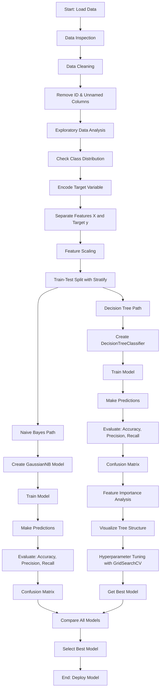
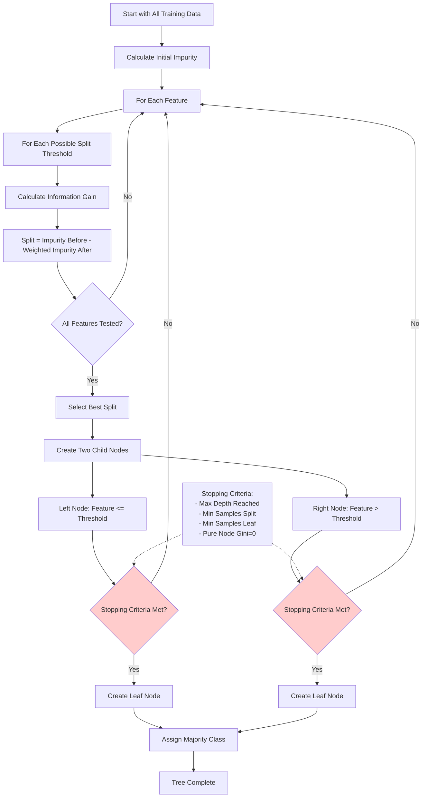
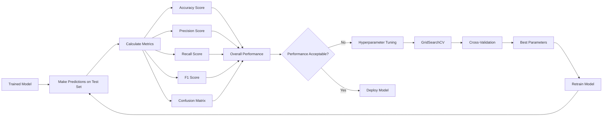
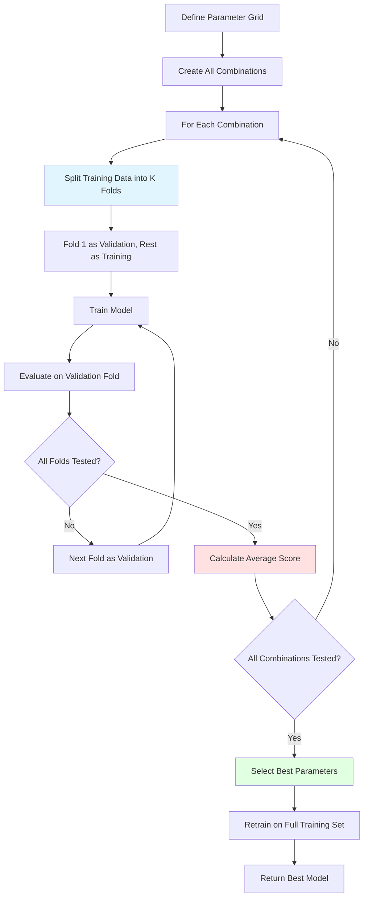
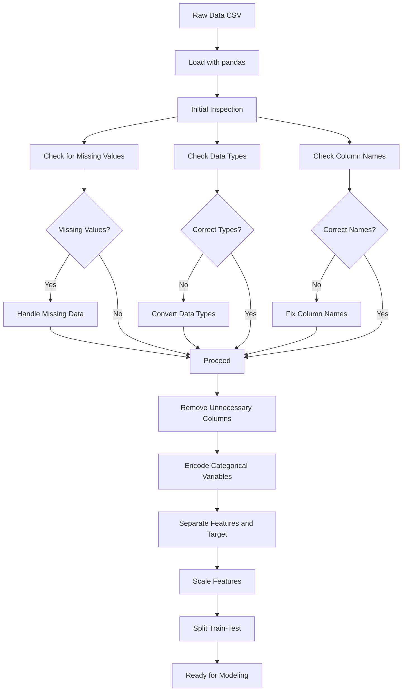
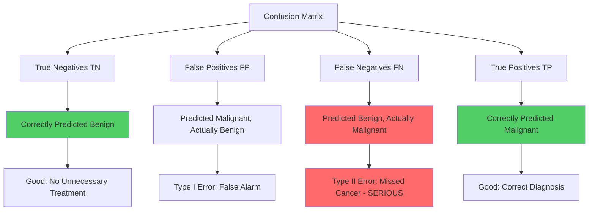
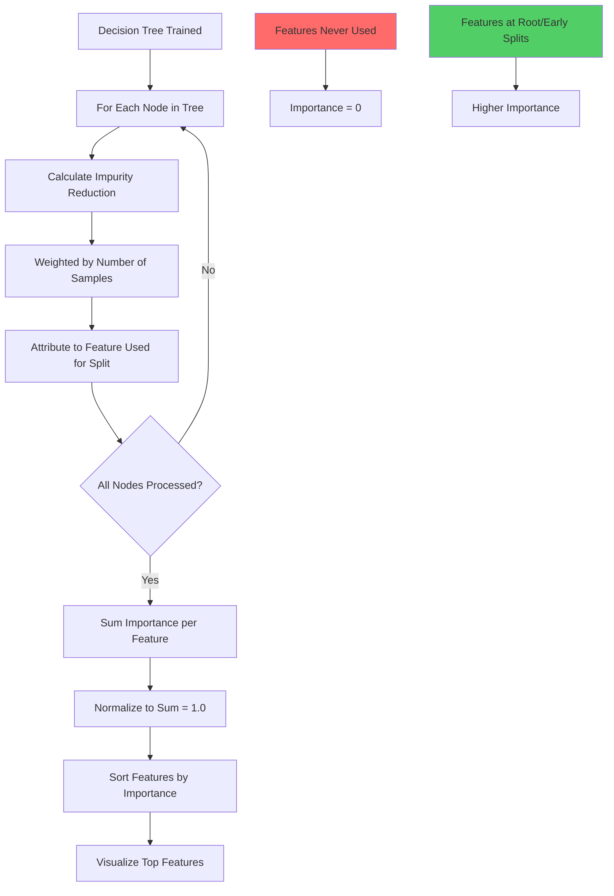

# Classification Algorithms 2 - Coding Guide 📘

## Overview
This notebook demonstrates Naive Bayes and Decision Tree classifiers for breast cancer diagnosis using the Wisconsin Breast Cancer Dataset. You'll learn how to build, evaluate, and compare these classification algorithms.

---

## Section 1: Library Imports

```python
import pandas as pd
import numpy as np
import seaborn as sns
import matplotlib.pyplot as plt
from sklearn.model_selection import train_test_split, GridSearchCV
from sklearn.metrics import (accuracy_score, classification_report,
                             precision_score, recall_score, f1_score,
                             confusion_matrix)
pd.set_option('display.max_columns', 30)
```

### What's Happening Here:

**pandas (pd)**: Data manipulation library
- Used for loading CSV files and working with tabular data
- Provides DataFrame structure for organizing data

**numpy (np)**: Numerical computing library
- Handles arrays and mathematical operations
- Essential for numerical computations in machine learning

**seaborn (sns)**: Statistical data visualization
- Built on top of matplotlib
- Creates attractive and informative statistical graphics
- Great for correlation heatmaps, distribution plots

**matplotlib.pyplot (plt)**: Plotting library
- Creates various types of charts and graphs
- Used for customizing visualizations

**sklearn.model_selection**:
- `train_test_split`: Splits data into training and testing sets
  - Syntax: `train_test_split(X, y, test_size=0.2, random_state=42)`
  - `test_size=0.2` means 20% for testing, 80% for training
  - `random_state=42` ensures reproducible splits
  
- `GridSearchCV`: Automated hyperparameter tuning
  - Tries different parameter combinations
  - Uses cross-validation to find best parameters

**sklearn.metrics**: Model evaluation tools
- `accuracy_score`: Overall correctness (correct predictions / total predictions)
- `classification_report`: Detailed metrics (precision, recall, F1-score)
- `precision_score`: How many predicted positives are actually positive
- `recall_score`: How many actual positives were correctly identified
- `f1_score`: Harmonic mean of precision and recall
- `confusion_matrix`: Shows true positives, false positives, true negatives, false negatives

**pd.set_option('display.max_columns', 30)**:
- Allows pandas to display up to 30 columns when printing DataFrames
- Without this, pandas truncates column display with "..."

---

## Section 2: Loading and Initial Data Inspection

```python
data = pd.read_csv('data.csv')
data.head()
```

### What's Happening:

**pd.read_csv('data.csv')**:
- Reads CSV file into a pandas DataFrame
- Automatically detects column names from first row
- Returns a DataFrame object

**data.head()**:
- Displays first 5 rows of the dataset
- Useful for quick inspection of data structure
- Can specify number: `data.head(10)` for 10 rows

### Key Observations:
- Dataset has 32 columns initially
- First column appears to be an ID
- Second column is diagnosis (M = Malignant, B = Benign)
- Remaining columns are numerical features about cell nuclei
- Column names are currently the first row values (needs fixing)

---

## Section 3: Data Cleaning

### Step 1: Fixing Column Names
The data was loaded incorrectly with the first row as column names. This needs to be corrected by:
1. Setting proper column names
2. Removing unnecessary columns (ID, unnamed columns)

```python
# Typical cleaning steps would include:
data.columns = ['id', 'diagnosis', 'radius_mean', 'texture_mean', ...]
data = data.drop(['id', 'Unnamed: 32'], axis=1)
```

### What's Happening:

**data.columns**: 
- Assigns new names to DataFrame columns
- Must provide a list with exact number of columns

**data.drop()**:
- Removes specified columns or rows
- `axis=1`: Drop columns (axis=0 would drop rows)
- Returns new DataFrame (or modifies in-place with `inplace=True`)

---

## Section 4: Exploratory Data Analysis (EDA)

### Understanding the Target Variable

```python
data['diagnosis'].value_counts()
```

### What's Happening:

**value_counts()**:
- Counts occurrences of each unique value
- Returns a Series with counts
- Useful for understanding class distribution
- Shows if dataset is balanced or imbalanced

**Expected Output**:
- B (Benign): 357 samples
- M (Malignant): 212 samples
- This is a slightly imbalanced dataset

---

## Section 5: Data Preprocessing

### Encoding Categorical Variables

```python
from sklearn.preprocessing import LabelEncoder
le = LabelEncoder()
data['diagnosis'] = le.fit_transform(data['diagnosis'])
```

### What's Happening:

**LabelEncoder**:
- Converts categorical labels to numerical values
- M (Malignant) → 1
- B (Benign) → 0
- Machine learning algorithms require numerical inputs

**fit_transform()**:
- `fit`: Learns the unique categories
- `transform`: Converts categories to numbers
- Combined into one operation

### Separating Features and Target

```python
X = data.drop('diagnosis', axis=1)
y = data['diagnosis']
```

### What's Happening:

**X (Features)**:
- All columns except the target variable
- Independent variables used for prediction
- Shape: (569, 30) - 569 samples, 30 features

**y (Target)**:
- The diagnosis column we want to predict
- Dependent variable
- Shape: (569,) - 569 labels

---

## Section 6: Feature Scaling

```python
from sklearn.preprocessing import StandardScaler
scaler = StandardScaler()
X_scaled = scaler.fit_transform(X)
```

### What's Happening:

**StandardScaler**:
- Standardizes features by removing mean and scaling to unit variance
- Formula: z = (x - μ) / σ
  - x: original value
  - μ: mean of feature
  - σ: standard deviation
- Results in mean=0, std=1 for each feature

**Why Scaling Matters**:
- Features have different ranges (e.g., area: 143-2501, smoothness: 0.05-0.16)
- Some algorithms (like KNN, SVM) are sensitive to feature scales
- Naive Bayes with Gaussian distribution benefits from scaling
- Decision Trees don't require scaling but it doesn't hurt

**fit_transform() vs transform()**:
- `fit_transform()`: Use on training data (learns parameters)
- `transform()`: Use on test data (applies learned parameters)

---

## Section 7: Train-Test Split

```python
X_train, X_test, y_train, y_test = train_test_split(
    X_scaled, y, test_size=0.2, random_state=42, stratify=y
)
```

### What's Happening:

**Arguments Explained**:

**X_scaled, y**: 
- Data to split (features and target)

**test_size=0.2**:
- 20% of data for testing
- 80% of data for training
- Common split ratios: 70-30, 80-20, 90-10

**random_state=42**:
- Seed for random number generator
- Ensures reproducible splits
- Any number works; 42 is a convention

**stratify=y**:
- Maintains class distribution in both train and test sets
- Important for imbalanced datasets
- Ensures both sets have similar ratio of M and B

**Returns**:
- X_train: Training features
- X_test: Testing features
- y_train: Training labels
- y_test: Testing labels

---

## Section 8: Naive Bayes Classifier

### Building the Model

```python
from sklearn.naive_bayes import GaussianNB
nb_model = GaussianNB()
nb_model.fit(X_train, y_train)
```

### What's Happening:

**GaussianNB**:
- Assumes features follow a Gaussian (normal) distribution
- Uses Bayes' theorem: P(y|X) = P(X|y) * P(y) / P(X)
- "Naive" because it assumes features are independent
- Fast training and prediction

**fit(X_train, y_train)**:
- Trains the model on training data
- Calculates mean and variance for each feature per class
- Computes prior probabilities P(y)

### Making Predictions

```python
y_pred_nb = nb_model.predict(X_test)
y_pred_proba_nb = nb_model.predict_proba(X_test)
```

### What's Happening:

**predict()**:
- Returns class labels (0 or 1)
- Chooses class with highest probability

**predict_proba()**:
- Returns probability estimates for each class
- Shape: (n_samples, n_classes)
- Example: [[0.85, 0.15], [0.23, 0.77]]
  - First sample: 85% probability of class 0, 15% of class 1
  - Second sample: 23% probability of class 0, 77% of class 1

---

## Section 9: Model Evaluation - Naive Bayes

### Accuracy Score

```python
accuracy_nb = accuracy_score(y_test, y_pred_nb)
print(f"Naive Bayes Accuracy: {accuracy_nb:.4f}")
```

### What's Happening:

**accuracy_score()**:
- Compares predicted labels with actual labels
- Formula: (TP + TN) / (TP + TN + FP + FN)
- Returns value between 0 and 1
- Multiply by 100 for percentage

### Classification Report

```python
print(classification_report(y_test, y_pred_nb))
```

### What's Happening:

**classification_report()**:
- Provides detailed metrics for each class
- Shows precision, recall, F1-score, and support

**Metrics Explained**:

**Precision**: Of all predicted positives, how many are actually positive?
- Formula: TP / (TP + FP)
- High precision = few false positives

**Recall (Sensitivity)**: Of all actual positives, how many did we catch?
- Formula: TP / (TP + FN)
- High recall = few false negatives

**F1-Score**: Harmonic mean of precision and recall
- Formula: 2 * (Precision * Recall) / (Precision + Recall)
- Balances precision and recall

**Support**: Number of actual occurrences of each class

### Confusion Matrix

```python
cm_nb = confusion_matrix(y_test, y_pred_nb)
sns.heatmap(cm_nb, annot=True, fmt='d', cmap='Blues')
plt.xlabel('Predicted')
plt.ylabel('Actual')
plt.title('Naive Bayes Confusion Matrix')
plt.show()
```

### What's Happening:

**confusion_matrix()**:
- Creates 2x2 matrix for binary classification
- Layout:
  ```
  [[TN  FP]
   [FN  TP]]
  ```
- TN: True Negatives (correctly predicted benign)
- FP: False Positives (predicted malignant, actually benign)
- FN: False Negatives (predicted benign, actually malignant)
- TP: True Positives (correctly predicted malignant)

**sns.heatmap()**:
- Visualizes confusion matrix as colored grid
- `annot=True`: Shows numbers in cells
- `fmt='d'`: Formats numbers as integers
- `cmap='Blues'`: Color scheme

**Why Confusion Matrix Matters**:
- In medical diagnosis, FN (missing cancer) is more serious than FP
- Helps understand types of errors the model makes

---

## Section 10: Decision Tree Classifier

### Building the Model

```python
from sklearn.tree import DecisionTreeClassifier
dt_model = DecisionTreeClassifier(random_state=42)
dt_model.fit(X_train, y_train)
```

### What's Happening:

**DecisionTreeClassifier**:
- Creates a tree of if-else decisions
- Splits data based on feature values
- Each node asks a question about a feature
- Leaves contain class predictions

**Key Parameters**:

**random_state=42**:
- Ensures reproducible results
- Tree building involves random choices

**Other Important Parameters** (not shown but useful):
- `max_depth`: Maximum depth of tree (prevents overfitting)
- `min_samples_split`: Minimum samples required to split a node
- `min_samples_leaf`: Minimum samples required in a leaf node
- `criterion`: 'gini' or 'entropy' (splitting strategy)

### How Decision Trees Work:

1. **Start at root**: All data at top
2. **Find best split**: Test all features and thresholds
3. **Split data**: Create two child nodes
4. **Repeat**: Continue splitting until stopping criterion
5. **Assign class**: Majority class in each leaf

**Splitting Criteria**:

**Gini Impurity** (default):
- Measures how often a randomly chosen element would be incorrectly labeled
- Formula: 1 - Σ(p_i²)
- Range: 0 (pure) to 0.5 (impure for binary)

**Entropy** (Information Gain):
- Measures disorder or uncertainty
- Formula: -Σ(p_i * log2(p_i))
- Range: 0 (pure) to 1 (impure for binary)

---

## Section 11: Making Predictions - Decision Tree

```python
y_pred_dt = dt_model.predict(X_test)
```

### What's Happening:

**predict()**:
- Traverses tree for each sample
- Follows decision path based on feature values
- Returns class at leaf node
- Fast prediction (O(log n) for balanced tree)

---

## Section 12: Model Evaluation - Decision Tree

```python
accuracy_dt = accuracy_score(y_test, y_pred_dt)
print(f"Decision Tree Accuracy: {accuracy_dt:.4f}")
print(classification_report(y_test, y_pred_dt))
```

### What's Happening:
Same evaluation metrics as Naive Bayes, allowing direct comparison.

### Confusion Matrix Visualization

```python
cm_dt = confusion_matrix(y_test, y_pred_dt)
sns.heatmap(cm_dt, annot=True, fmt='d', cmap='Greens')
plt.xlabel('Predicted')
plt.ylabel('Actual')
plt.title('Decision Tree Confusion Matrix')
plt.show()
```

---

## Section 13: Feature Importance

```python
feature_importance = pd.DataFrame({
    'feature': X.columns,
    'importance': dt_model.feature_importances_
}).sort_values('importance', ascending=False)

plt.figure(figsize=(10, 6))
sns.barplot(data=feature_importance.head(10), x='importance', y='feature')
plt.title('Top 10 Important Features')
plt.show()
```

### What's Happening:

**feature_importances_**:
- Attribute of trained decision tree
- Shows how much each feature contributes to predictions
- Values sum to 1.0
- Higher value = more important feature

**How It's Calculated**:
- Based on how much each feature reduces impurity
- Features used for early splits typically more important
- Features never used have importance = 0

**Why This Matters**:
- Identifies most predictive features
- Can reduce dimensionality by keeping only important features
- Provides interpretability (which features drive predictions)
- Helps domain experts validate model logic

---

## Section 14: Visualizing the Decision Tree

```python
from sklearn.tree import plot_tree
plt.figure(figsize=(20, 10))
plot_tree(dt_model, feature_names=X.columns, class_names=['Benign', 'Malignant'],
          filled=True, max_depth=3)
plt.show()
```

### What's Happening:

**plot_tree()**:
- Visualizes the decision tree structure
- Shows decision rules at each node

**Arguments**:
- `feature_names`: Labels for features
- `class_names`: Labels for classes
- `filled=True`: Colors nodes by majority class
- `max_depth=3`: Only shows first 3 levels (full tree too large)

**Reading the Tree**:
- Each box is a node
- Top line: Decision rule (e.g., "worst_perimeter <= 105.95")
- `gini`: Impurity measure
- `samples`: Number of samples at this node
- `value`: [benign_count, malignant_count]
- `class`: Majority class at this node

---

## Section 15: Hyperparameter Tuning with GridSearchCV

```python
param_grid = {
    'max_depth': [3, 5, 7, 10, None],
    'min_samples_split': [2, 5, 10],
    'min_samples_leaf': [1, 2, 4],
    'criterion': ['gini', 'entropy']
}

grid_search = GridSearchCV(
    DecisionTreeClassifier(random_state=42),
    param_grid,
    cv=5,
    scoring='accuracy',
    n_jobs=-1
)

grid_search.fit(X_train, y_train)
```

### What's Happening:

**param_grid**:
- Dictionary of parameters to try
- GridSearchCV tests all combinations
- Example: 5 * 3 * 3 * 2 = 90 combinations

**GridSearchCV Arguments**:

**estimator**: Model to tune (DecisionTreeClassifier)

**param_grid**: Parameters to search

**cv=5**: 5-fold cross-validation
- Splits training data into 5 parts
- Trains on 4 parts, validates on 1
- Repeats 5 times, averages results
- More reliable than single train-test split

**scoring='accuracy'**: Metric to optimize
- Other options: 'precision', 'recall', 'f1', 'roc_auc'

**n_jobs=-1**: Use all CPU cores
- Speeds up search by parallel processing

### Getting Best Parameters

```python
print("Best parameters:", grid_search.best_params_)
print("Best cross-validation score:", grid_search.best_score_)
best_dt_model = grid_search.best_estimator_
```

### What's Happening:

**best_params_**:
- Dictionary of best parameter combination
- Example: {'criterion': 'gini', 'max_depth': 5, ...}

**best_score_**:
- Best cross-validation score achieved
- Average across all folds

**best_estimator_**:
- Trained model with best parameters
- Ready to use for predictions

---

## Section 16: Comparing Models

```python
models_comparison = pd.DataFrame({
    'Model': ['Naive Bayes', 'Decision Tree', 'Tuned Decision Tree'],
    'Accuracy': [accuracy_nb, accuracy_dt, accuracy_best_dt],
    'Precision': [precision_nb, precision_dt, precision_best_dt],
    'Recall': [recall_nb, recall_dt, recall_best_dt],
    'F1-Score': [f1_nb, f1_dt, f1_best_dt]
})

print(models_comparison)
```

### What's Happening:
- Creates comparison table of all models
- Shows which model performs best on each metric
- Helps make informed decision about model selection

---

## Key Takeaways

### Naive Bayes:
✅ Fast training and prediction
✅ Works well with high-dimensional data
✅ Good for text classification
✅ Provides probability estimates
❌ Assumes feature independence (rarely true)
❌ Sensitive to feature scaling

### Decision Trees:
✅ Easy to interpret and visualize
✅ Handles non-linear relationships
✅ No feature scaling needed
✅ Automatic feature selection
❌ Prone to overfitting
❌ Unstable (small data changes = different tree)
❌ Biased toward features with more levels

### When to Use Which:
- **Naive Bayes**: Text classification, real-time prediction, baseline model
- **Decision Tree**: Need interpretability, mixed data types, feature importance analysis

### Best Practices:
1. Always split data before any preprocessing
2. Use stratified split for imbalanced data
3. Scale features for Naive Bayes
4. Tune hyperparameters to prevent overfitting
5. Use cross-validation for reliable evaluation
6. Consider domain knowledge (FN vs FP costs)
7. Visualize results (confusion matrix, feature importance)


---

## Workflow Diagram



---

## Naive Bayes Algorithm Flow

```mermaid
flowchart TD
    A[Training Phase] --> B[Calculate Prior Probabilities]
    B --> C[P Benign = Count Benign / Total]
    B --> D[P Malignant = Count Malignant / Total]
    
    C --> E[For Each Feature]
    D --> E
    E --> F[Calculate Mean and Variance]
    F --> G[Mean and Variance for Benign Class]
    F --> H[Mean and Variance for Malignant Class]
    
    G --> I[Prediction Phase]
    H --> I
    I --> J[New Sample Arrives]
    J --> K[Calculate Likelihood for Benign]
    J --> L[Calculate Likelihood for Malignant]
    
    K --> M[Apply Bayes Theorem]
    L --> M
    M --> N[P Benign | Features = P Features | Benign × P Benign]
    M --> O[P Malignant | Features = P Features | Malignant × P Malignant]
    
    N --> P{Compare Probabilities}
    O --> P
    P -->|Higher| Q[Predict Benign]
    P -->|Higher| R[Predict Malignant]
```

---

## Decision Tree Building Process



---

## Model Evaluation Pipeline



---

## GridSearchCV Process



---

## Data Preprocessing Flow



---

## Confusion Matrix Interpretation



---

## Feature Importance Calculation



