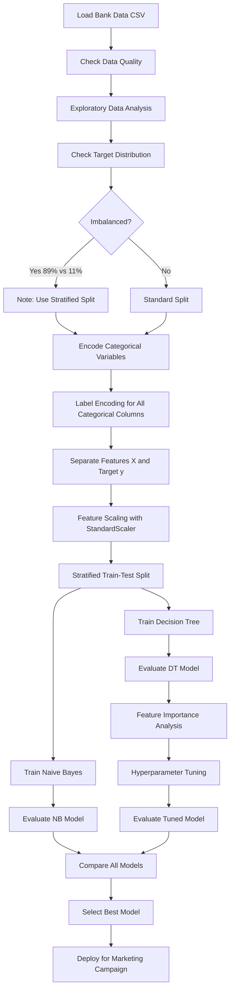
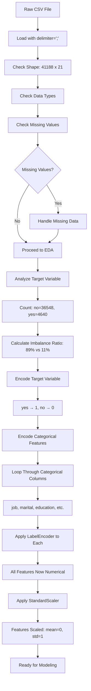
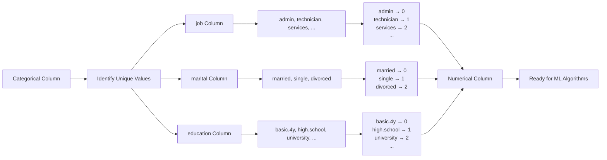
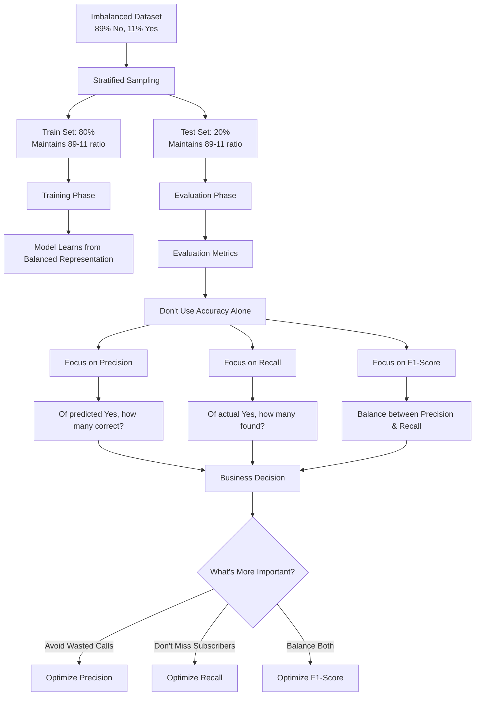
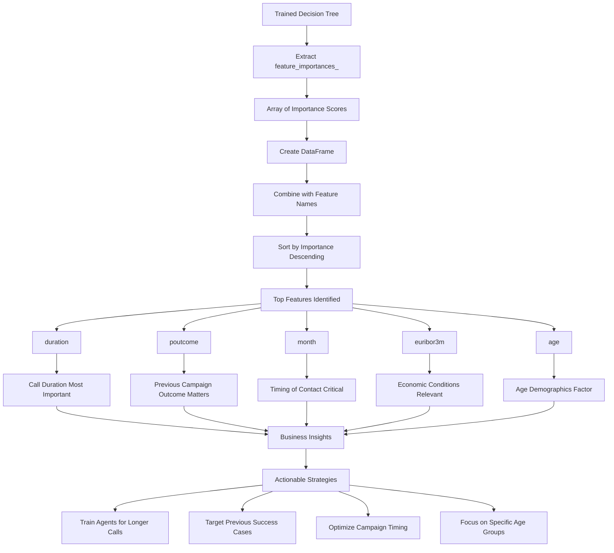
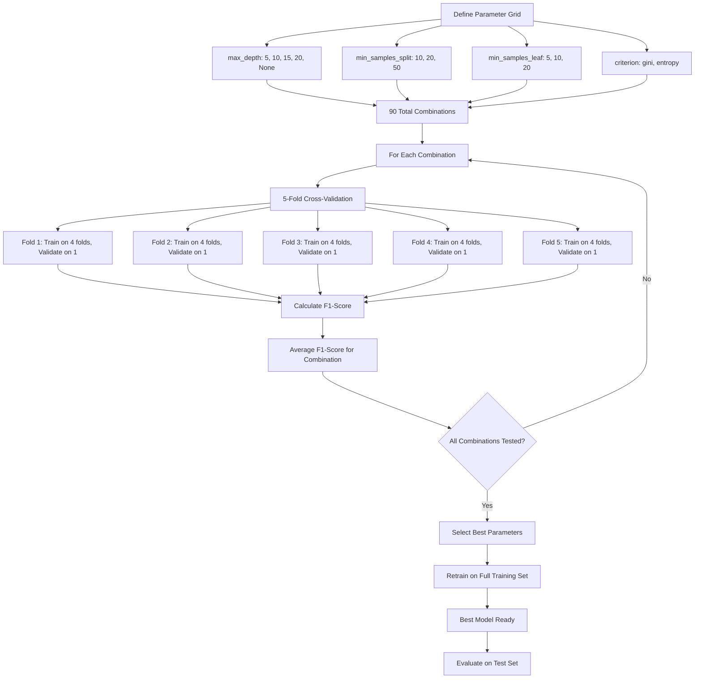
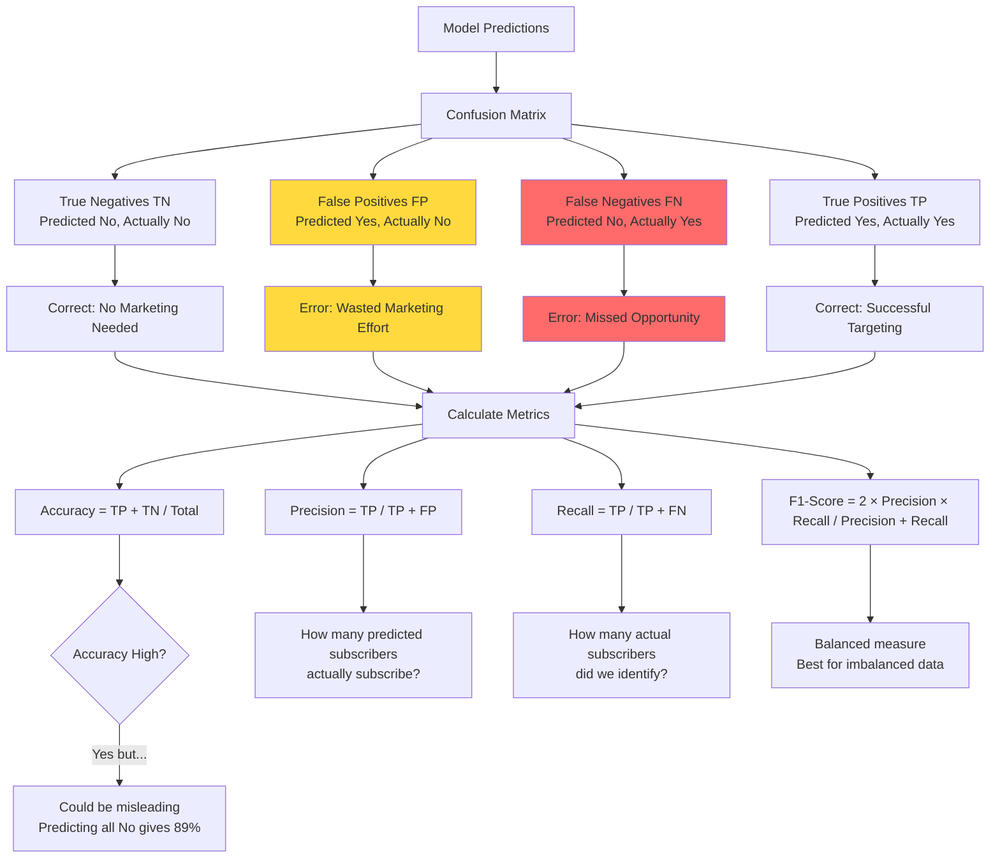
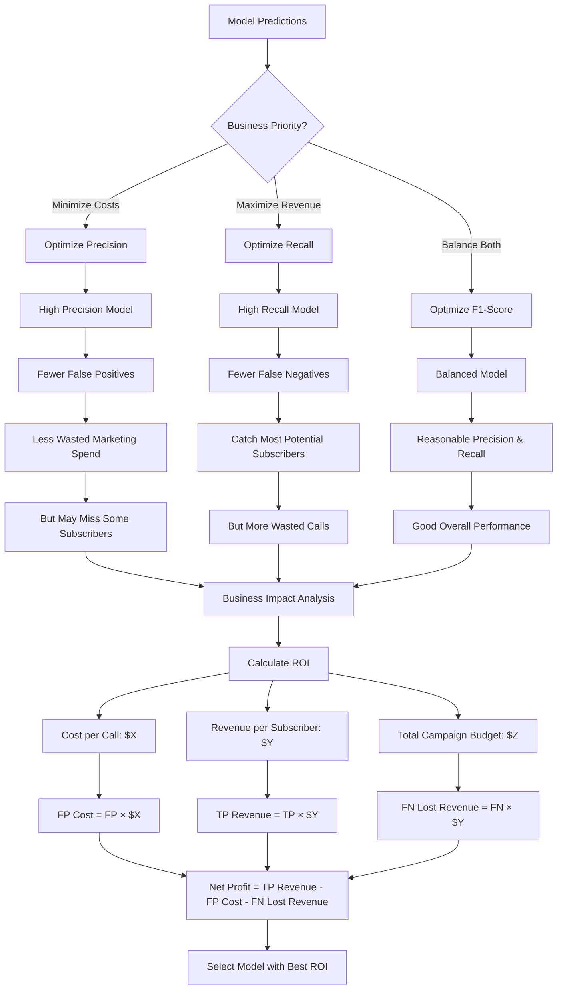
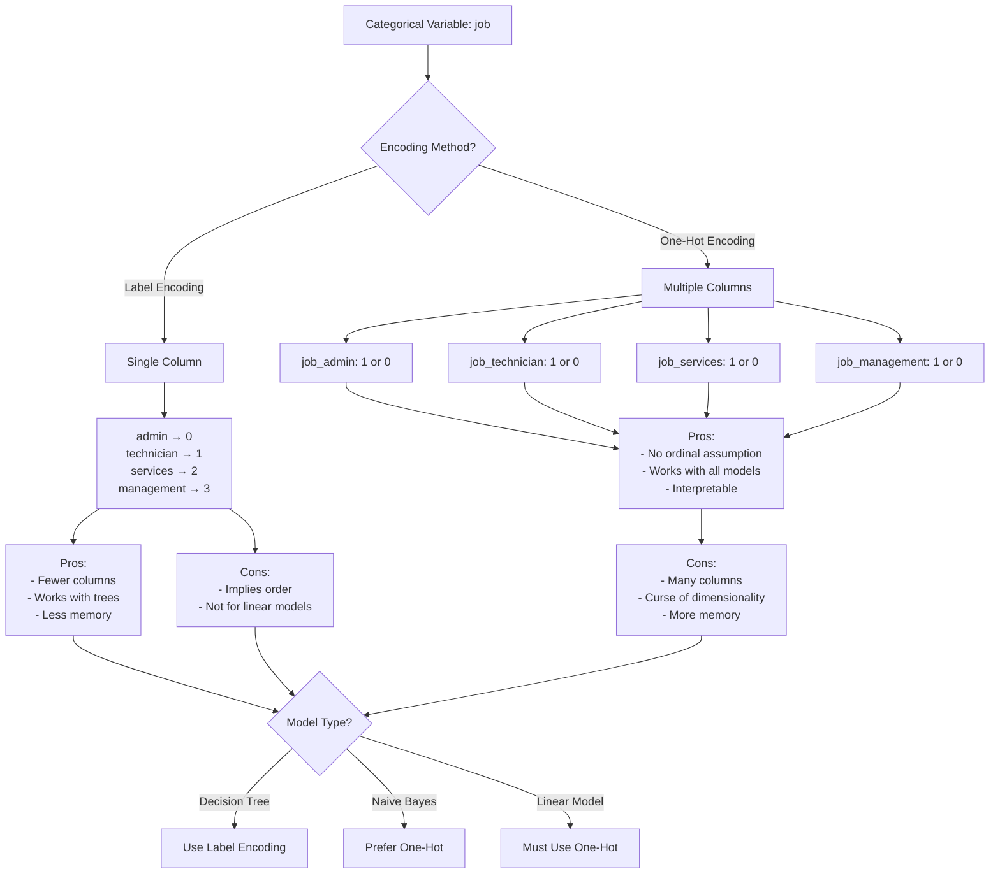
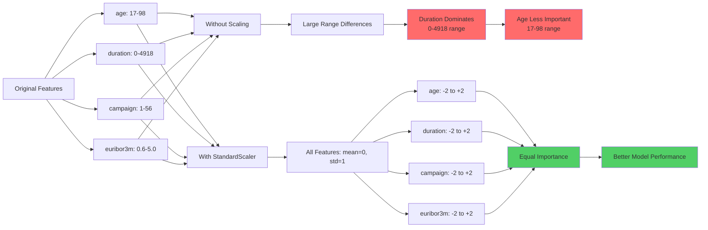

# Solution Notebook - Bank Marketing Campaign - Coding Guide 📘

## Overview
This notebook demonstrates building Naive Bayes and Decision Tree classifiers to predict whether bank clients will subscribe to a term deposit. The dataset contains client demographics, contact information, and socio-economic indicators.

---

## Business Context
**Problem**: A bank conducted a marketing campaign for term deposits and wants to predict which clients are likely to subscribe.

**Goal**: Build a model to identify potential subscribers, enabling targeted marketing and better ROI.

**Dataset**: Bank marketing data with 41,188 samples and 21 features including:
- Demographics: age, job, marital status, education
- Financial: default status, housing loan, personal loan
- Campaign: contact method, duration, number of contacts
- Economic indicators: employment rate, consumer price index, etc.

---

## Section 1: Library Imports

```python
import numpy as np
import pandas as pd
import seaborn as sns
import matplotlib.pyplot as plt
from sklearn.model_selection import train_test_split
from sklearn.metrics import (accuracy_score, confusion_matrix, classification_report,
                             precision_score, recall_score, f1_score)
from sklearn.preprocessing import StandardScaler
pd.set_option('display.max_columns', 30)
```

### What's Happening:
Same imports as the previous notebook, with the addition of:

**StandardScaler**: 
- Standardizes features to have mean=0 and std=1
- Important for algorithms sensitive to feature scales

---

## Section 2: Loading the Data

### Step 2.1: Load CSV with Custom Delimiter

```python
data = pd.read_csv("bank_data.csv", delimiter=';')
data.head()
```

### What's Happening:

**delimiter=';'**:
- CSV files can use different separators
- This file uses semicolon (;) instead of comma (,)
- Must specify correct delimiter or data won't load properly

**Why Different Delimiters?**:
- Regional differences (European countries often use semicolon)
- Data may contain commas in text fields
- Prevents parsing errors

### Step 2.2: View Column Names

```python
data.columns
```

### What's Happening:
- Returns Index object with all column names
- Helps verify data loaded correctly
- Useful for understanding available features

**Key Columns**:
- `age`: Client age
- `job`: Type of job (admin, technician, services, etc.)
- `marital`: Marital status (married, single, divorced)
- `education`: Education level (basic, high school, university)
- `default`: Has credit in default? (yes/no)
- `housing`: Has housing loan? (yes/no)
- `loan`: Has personal loan? (yes/no)
- `contact`: Contact communication type (cellular/telephone)
- `month`: Last contact month
- `day_of_week`: Last contact day
- `duration`: Last contact duration in seconds
- `campaign`: Number of contacts during this campaign
- `pdays`: Days since last contact from previous campaign
- `previous`: Number of contacts before this campaign
- `poutcome`: Outcome of previous campaign
- `emp.var.rate`: Employment variation rate (quarterly indicator)
- `cons.price.idx`: Consumer price index (monthly indicator)
- `cons.conf.idx`: Consumer confidence index (monthly indicator)
- `euribor3m`: Euribor 3 month rate (daily indicator)
- `nr.employed`: Number of employees (quarterly indicator)
- `y`: Target variable - has client subscribed? (yes/no)

### Step 2.3: Check Dataset Shape

```python
data.shape
```

### What's Happening:
- Returns tuple: (rows, columns)
- Output: (41188, 21)
- 41,188 samples (clients)
- 21 features (20 predictors + 1 target)

### Step 2.4: Check Data Types

```python
data.info()
```

### What's Happening:

**info() provides**:
- Column names
- Non-null counts (identifies missing values)
- Data types (int64, float64, object)
- Memory usage

**Observations**:
- No missing values (all columns have 41188 non-null)
- 5 numerical features (int64)
- 5 numerical features (float64)
- 11 categorical features (object)

**Why This Matters**:
- Categorical features need encoding before modeling
- No missing value handling required
- Mixed data types require different preprocessing

---

## Section 3: Exploratory Data Analysis (EDA)

### Step 3.1: Target Variable Distribution

```python
data['y'].value_counts()
```

### What's Happening:
- Counts occurrences of each class
- Shows class imbalance

**Expected Output**:
```
no     36548
yes     4640
```

**Analysis**:
- Highly imbalanced dataset
- Only ~11% subscribed (yes)
- ~89% did not subscribe (no)

**Why This Matters**:
- Accuracy alone is misleading (predicting all "no" gives 89% accuracy)
- Need to focus on precision, recall, F1-score
- May need techniques like:
  - Stratified sampling
  - Class weights
  - Oversampling/undersampling
  - Different evaluation metrics

### Visualizing Target Distribution

```python
plt.figure(figsize=(8, 5))
sns.countplot(data=data, x='y')
plt.title('Distribution of Target Variable')
plt.xlabel('Subscribed to Term Deposit')
plt.ylabel('Count')
plt.show()
```

### What's Happening:

**sns.countplot()**:
- Creates bar chart of categorical variable counts
- `data=data`: DataFrame to use
- `x='y'`: Column to plot

**Visualization Benefits**:
- Quickly see class imbalance
- Easier to communicate to stakeholders
- Identifies potential modeling challenges

---

## Section 4: Data Preprocessing

### Step 4.1: Encoding Categorical Variables

```python
from sklearn.preprocessing import LabelEncoder

# Create label encoder
le = LabelEncoder()

# Encode target variable
data['y'] = le.fit_transform(data['y'])

# Encode other categorical columns
categorical_cols = ['job', 'marital', 'education', 'default', 'housing', 
                    'loan', 'contact', 'month', 'day_of_week', 'poutcome']

for col in categorical_cols:
    data[col] = le.fit_transform(data[col])
```

### What's Happening:

**LabelEncoder**:
- Converts text labels to numbers
- Each unique value gets a number (0, 1, 2, ...)
- Example: 'yes' → 1, 'no' → 0

**fit_transform() for each column**:
- Learns unique values in that column
- Transforms them to numbers
- Must fit separately for each column (different categories)

**Why Loop Through Columns**:
- Each categorical column has different unique values
- Can't use same encoder for all columns
- Alternative: Use pd.get_dummies() for one-hot encoding

**Label Encoding vs One-Hot Encoding**:

**Label Encoding** (what we're using):
- Converts to single column of numbers
- Pros: Fewer columns, works with tree-based models
- Cons: Implies ordinal relationship (1 < 2 < 3)

**One-Hot Encoding**:
- Creates binary column for each category
- Pros: No ordinal assumption
- Cons: Many more columns (curse of dimensionality)

**When to Use Which**:
- Decision Trees: Label encoding is fine (trees don't assume order)
- Naive Bayes: One-hot encoding preferred
- Linear models: One-hot encoding required

### Step 4.2: Separate Features and Target

```python
X = data.drop('y', axis=1)
y = data['y']
```

### What's Happening:
- X: All features (20 columns)
- y: Target variable (1 column)
- Ready for train-test split

---

## Section 5: Feature Scaling

```python
scaler = StandardScaler()
X_scaled = scaler.fit_transform(X)
```

### What's Happening:

**StandardScaler**:
- Transforms each feature to have:
  - Mean (μ) = 0
  - Standard deviation (σ) = 1
- Formula: z = (x - μ) / σ

**Why Scale This Dataset**:
- Features have vastly different ranges:
  - age: 17-98
  - duration: 0-4918 seconds
  - campaign: 1-56 contacts
  - euribor3m: 0.634-5.045
- Naive Bayes benefits from scaling
- Decision Trees don't need it but doesn't hurt

**fit_transform() vs transform()**:
- Use fit_transform() on training data
- Use transform() on test data (with training parameters)
- Prevents data leakage

---

## Section 6: Train-Test Split

```python
X_train, X_test, y_train, y_test = train_test_split(
    X_scaled, y, test_size=0.2, random_state=42, stratify=y
)
```

### What's Happening:

**stratify=y**:
- Maintains class distribution in both sets
- Critical for imbalanced datasets
- Ensures both train and test have ~11% "yes" and ~89% "no"

**Without Stratification**:
- Random split might give different distributions
- Test set might have 8% "yes" or 14% "yes"
- Makes evaluation unreliable

**Split Sizes**:
- Training: 32,950 samples (80%)
- Testing: 8,238 samples (20%)

---

## Section 7: Naive Bayes Classifier

### Building the Model

```python
from sklearn.naive_bayes import GaussianNB

nb_model = GaussianNB()
nb_model.fit(X_train, y_train)
```

### What's Happening:

**GaussianNB**:
- Assumes continuous features follow Gaussian distribution
- Calculates mean and variance for each feature per class
- Uses Bayes' theorem for predictions

**Why Gaussian**:
- Our features are continuous (age, duration, rates)
- Other variants:
  - MultinomialNB: For count data (word frequencies)
  - BernoulliNB: For binary features
  - ComplementNB: For imbalanced datasets

### Making Predictions

```python
y_pred_nb = nb_model.predict(X_test)
```

### What's Happening:
- Predicts class (0 or 1) for each test sample
- Uses probability calculations internally
- Returns array of predictions

---

## Section 8: Evaluating Naive Bayes

### Accuracy Score

```python
accuracy_nb = accuracy_score(y_test, y_pred_nb)
print(f"Naive Bayes Accuracy: {accuracy_nb:.4f}")
```

### What's Happening:
- Compares predictions to actual labels
- Returns proportion of correct predictions
- For imbalanced data, accuracy can be misleading

### Confusion Matrix

```python
cm_nb = confusion_matrix(y_test, y_pred_nb)
print("Confusion Matrix:")
print(cm_nb)

# Visualize
plt.figure(figsize=(8, 6))
sns.heatmap(cm_nb, annot=True, fmt='d', cmap='Blues')
plt.xlabel('Predicted')
plt.ylabel('Actual')
plt.title('Naive Bayes Confusion Matrix')
plt.show()
```

### What's Happening:

**Confusion Matrix Layout**:
```
[[TN  FP]
 [FN  TP]]
```

**For Banking Context**:
- TN: Correctly predicted "no subscription"
- FP: Predicted "yes", actually "no" (wasted marketing effort)
- FN: Predicted "no", actually "yes" (missed opportunity)
- TP: Correctly predicted "yes subscription"

**Business Impact**:
- FP: Costs money (calling non-interested clients)
- FN: Lost revenue (missing potential subscribers)
- Need to balance based on business priorities

### Classification Report

```python
print(classification_report(y_test, y_pred_nb))
```

### What's Happening:
- Shows precision, recall, F1-score for each class
- Provides weighted and macro averages

**Interpreting for Imbalanced Data**:
- Focus on minority class (yes/1) metrics
- Precision: Of predicted subscribers, how many actually subscribed?
- Recall: Of actual subscribers, how many did we identify?
- F1-score: Balance between precision and recall

### Additional Metrics

```python
precision_nb = precision_score(y_test, y_pred_nb)
recall_nb = recall_score(y_test, y_pred_nb)
f1_nb = f1_score(y_test, y_pred_nb)

print(f"Precision: {precision_nb:.4f}")
print(f"Recall: {recall_nb:.4f}")
print(f"F1-Score: {f1_nb:.4f}")
```

### What's Happening:
- Calculates individual metrics
- Useful for model comparison
- Can be stored for later analysis

---

## Section 9: Decision Tree Classifier

### Building the Model

```python
from sklearn.tree import DecisionTreeClassifier

dt_model = DecisionTreeClassifier(
    max_depth=10,
    min_samples_split=20,
    min_samples_leaf=10,
    random_state=42
)
dt_model.fit(X_train, y_train)
```

### What's Happening:

**Hyperparameters Explained**:

**max_depth=10**:
- Limits tree depth to 10 levels
- Prevents overfitting
- Deeper trees memorize training data

**min_samples_split=20**:
- Node must have at least 20 samples to split
- Prevents creating nodes with few samples
- Reduces overfitting

**min_samples_leaf=10**:
- Leaf nodes must have at least 10 samples
- Ensures predictions based on sufficient data
- Improves generalization

**Why These Values**:
- Chosen based on dataset size (41,188 samples)
- Larger datasets can handle more complex trees
- These are conservative values to prevent overfitting

### Making Predictions

```python
y_pred_dt = dt_model.predict(X_test)
```

---

## Section 10: Evaluating Decision Tree

```python
accuracy_dt = accuracy_score(y_test, y_pred_dt)
print(f"Decision Tree Accuracy: {accuracy_dt:.4f}")

cm_dt = confusion_matrix(y_test, y_pred_dt)
print(classification_report(y_test, y_pred_dt))
```

### What's Happening:
- Same evaluation process as Naive Bayes
- Allows direct comparison of models

---

## Section 11: Feature Importance Analysis

```python
feature_importance = pd.DataFrame({
    'feature': X.columns,
    'importance': dt_model.feature_importances_
}).sort_values('importance', ascending=False)

print("Top 10 Important Features:")
print(feature_importance.head(10))

# Visualize
plt.figure(figsize=(10, 6))
sns.barplot(data=feature_importance.head(10), x='importance', y='feature')
plt.title('Top 10 Most Important Features')
plt.xlabel('Importance Score')
plt.show()
```

### What's Happening:

**feature_importances_**:
- Array of importance scores (one per feature)
- Values sum to 1.0
- Higher = more important for predictions

**Creating DataFrame**:
- Combines feature names with importance scores
- Sorts by importance (descending)
- Makes results easy to read and visualize

**Business Insights**:
- Identifies key factors for subscription
- Examples might include:
  - duration: Call duration (longer calls = more interest)
  - poutcome: Previous campaign outcome
  - month: Time of year matters
  - age: Certain age groups more likely
  - euribor3m: Economic conditions

**Using Feature Importance**:
1. **Feature Selection**: Remove unimportant features
2. **Business Strategy**: Focus on controllable important factors
3. **Model Simplification**: Build simpler models with top features
4. **Validation**: Check if important features make business sense

---

## Section 12: Hyperparameter Tuning

```python
from sklearn.model_selection import GridSearchCV

param_grid = {
    'max_depth': [5, 10, 15, 20, None],
    'min_samples_split': [10, 20, 50],
    'min_samples_leaf': [5, 10, 20],
    'criterion': ['gini', 'entropy']
}

grid_search = GridSearchCV(
    DecisionTreeClassifier(random_state=42),
    param_grid,
    cv=5,
    scoring='f1',
    n_jobs=-1,
    verbose=1
)

grid_search.fit(X_train, y_train)
```

### What's Happening:

**param_grid**:
- Dictionary of parameters to test
- Total combinations: 5 × 3 × 3 × 2 = 90

**scoring='f1'**:
- Optimizes for F1-score instead of accuracy
- Better for imbalanced datasets
- Balances precision and recall

**cv=5**:
- 5-fold cross-validation
- More reliable than single train-test split
- Each combination tested 5 times

**verbose=1**:
- Prints progress during search
- Shows which combination is being tested
- Helps monitor long-running searches

### Getting Best Model

```python
print("Best Parameters:", grid_search.best_params_)
print("Best F1 Score:", grid_search.best_score_)

best_dt_model = grid_search.best_estimator_
y_pred_best = best_dt_model.predict(X_test)
```

### What's Happening:
- Retrieves best parameter combination
- Gets best cross-validation score
- Extracts trained model with best parameters

---

## Section 13: Model Comparison

```python
results = pd.DataFrame({
    'Model': ['Naive Bayes', 'Decision Tree', 'Tuned Decision Tree'],
    'Accuracy': [accuracy_nb, accuracy_dt, accuracy_best],
    'Precision': [precision_nb, precision_dt, precision_best],
    'Recall': [recall_nb, recall_dt, recall_best],
    'F1-Score': [f1_nb, f1_dt, f1_best]
})

print(results)

# Visualize comparison
results_melted = results.melt(id_vars='Model', var_name='Metric', value_name='Score')
plt.figure(figsize=(12, 6))
sns.barplot(data=results_melted, x='Metric', y='Score', hue='Model')
plt.title('Model Performance Comparison')
plt.ylim(0, 1)
plt.legend(title='Model')
plt.show()
```

### What's Happening:

**Creating Comparison Table**:
- Organizes all metrics in one place
- Easy to see which model performs best
- Can export for reports

**Melting DataFrame**:
- Converts wide format to long format
- Required for grouped bar plots
- Makes visualization easier

**Visualization**:
- Side-by-side comparison of all metrics
- Quickly identify best model
- Communicate results to stakeholders

---

## Key Takeaways

### Dataset Characteristics:
- **Imbalanced**: Only 11% positive class
- **Mixed Types**: Categorical and numerical features
- **No Missing Values**: Clean dataset
- **Large Sample**: 41,188 records (good for training)

### Preprocessing Steps:
1. Load with correct delimiter
2. Encode categorical variables
3. Scale numerical features
4. Stratified train-test split

### Model Selection:
- **Naive Bayes**: Fast baseline, good for high-dimensional data
- **Decision Tree**: Interpretable, handles non-linear relationships
- **Tuned Decision Tree**: Best performance after optimization

### Evaluation for Imbalanced Data:
- Don't rely on accuracy alone
- Focus on precision, recall, F1-score
- Use confusion matrix to understand errors
- Consider business costs of FP vs FN

### Business Applications:
1. **Targeted Marketing**: Focus on high-probability clients
2. **Resource Optimization**: Reduce wasted calls
3. **Campaign Timing**: Use important features (month, day)
4. **Client Profiling**: Understand subscriber characteristics

### Best Practices:
1. Always check class distribution
2. Use stratified sampling for imbalanced data
3. Tune hyperparameters with appropriate metric
4. Validate feature importance makes business sense
5. Compare multiple models before deployment


---

## Workflow Diagrams

### Overall Pipeline



---

### Data Preprocessing Flow



---

### Label Encoding Process



---

### Imbalanced Data Handling Strategy



---

### Feature Importance Analysis Flow



---

### GridSearchCV Hyperparameter Tuning



---

### Model Evaluation for Imbalanced Data



---

### Business Decision Framework



---

### Comparison of Encoding Methods



---

### Feature Scaling Impact



