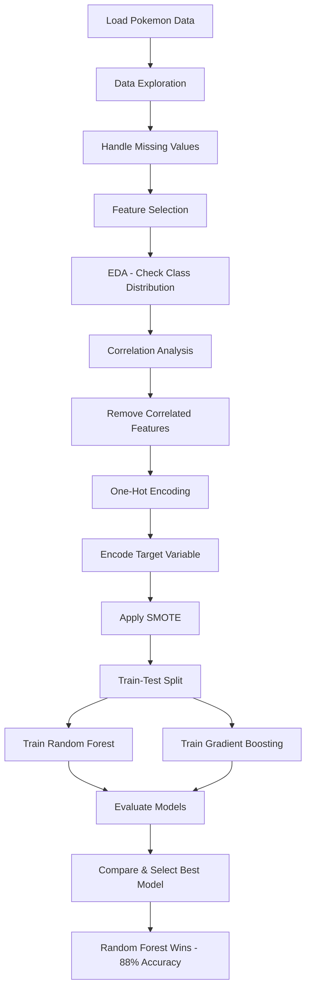

# Week 14: Bagging & Boosting - Assignment Coding Guide

## 📓 Notebook: Bagging_&_Boosting_Assignment_Solution.ipynb

## 🎯 Objective
Apply ensemble methods to predict Pokémon rarity using bagging (Random Forest) and boosting (AdaBoost, Gradient Boosting, XGBoost) techniques.

---

## 📊 Dataset: Pokémon Rarity Classification

**Business Context:**
- Predict Pokémon rarity: Standard, Legendary, Mythic, Ultra Beast
- Multi-class classification problem
- Features: stats, abilities, types, etc.

**Rarity Classes:**
- **Standard:** Common Pokémon, easy to obtain
- **Legendary:** Rare, powerful, special events
- **Mythic:** Extremely rare, special quests
- **Ultra Beast:** Special category, unique designs

---

## 🔧 Section 1: Import Libraries

### Import Required Libraries
```python
import pandas as pd
import numpy as np
import matplotlib.pyplot as plt
import seaborn as sns

from sklearn.model_selection import train_test_split
from sklearn.preprocessing import LabelEncoder
from sklearn.metrics import (accuracy_score, classification_report,
                             confusion_matrix)
from imblearn.over_sampling import SMOTE

pd.set_option('display.max_columns', 30)
```

**Why these imports?**
- `pandas`: Data manipulation and analysis
- `numpy`: Numerical operations
- `matplotlib/seaborn`: Data visualization
- `sklearn`: Machine learning models and metrics
- `imblearn.SMOTE`: Handle class imbalance

---

## 🔧 Section 2: Data Loading and Exploration

### 2.1 Load Dataset
```python
# Load Pokémon dataset
df = pd.read_csv('pokemon.csv')

# Display first few rows
df.head()
```

### 2.2 Check Target Variable
```python
# Check unique rarity values
df['rarity'].unique()
# Output: ['Standard', 'Legendary', 'Mythic', 'Ultra Beast']
```

### 2.3 Understand Columns
```python
# View all columns
df.columns

# Check shape
print(df.shape)  # (rows, columns)

# Check data types
df.info()
```

### 2.4 Descriptive Statistics
```python
# Numerical features
df.describe()

# Categorical features
df.describe(include='object')
```

**Key Observations:**
- Dataset contains mix of numerical, categorical, and boolean features
- Check for skewness in numerical features
- Identify high cardinality categorical features

### 2.5 Handle Missing Values
```python
# Check null values
null_summary = df.isnull().sum()
print(null_summary[null_summary > 0])

# Drop columns with too many nulls
df.drop('candy_required', axis=1, inplace=True)

# Fill remaining nulls
# For numerical: use median
# For categorical: use mode
for col in df.columns:
    if df[col].isnull().sum() > 0:
        if df[col].dtype in ['int64', 'float64']:
            df[col].fillna(df[col].median(), inplace=True)
        else:
            df[col].fillna(df[col].mode()[0], inplace=True)
```

**Why handle missing values?**
- Models cannot process NaN values
- Dropping vs filling depends on percentage of missing data
- Median is robust to outliers for numerical features

### 2.6 Feature Selection
```python
# Check unique value counts
for col in df.columns:
    print(f"{col}: {df[col].nunique()} unique values")

# Drop features with only 1 unique value (no variance)
single_value_cols = [col for col in df.columns if df[col].nunique() == 1]
df.drop(single_value_cols, axis=1, inplace=True)

# Drop features where all values are unique (too high cardinality)
unique_value_cols = [col for col in df.columns if df[col].nunique() == len(df)]
df.drop(unique_value_cols, axis=1, inplace=True)

# Drop high cardinality features manually
df.drop(['charged_moves', 'fast_moves'], axis=1, inplace=True)
```

**Why drop these features?**
- Single value features provide no information
- All unique values (like IDs) don't help prediction
- High cardinality features can cause overfitting

---

## 🔧 Section 3: Exploratory Data Analysis (EDA)

### 3.1 Target Distribution
```python
# Check class distribution
df['rarity'].value_counts()

# Visualize
plt.figure(figsize=(8, 5))
df['rarity'].value_counts().plot(kind='bar')
plt.title('Distribution of Pokémon Rarity')
plt.xlabel('Rarity')
plt.ylabel('Count')
plt.show()
```

**Observation:**
- Severe class imbalance
- Standard Pokémon are most common
- Mythic and Ultra Beast are rare
- Need to handle imbalance before modeling

---

## 🔧 Section 4: Feature Engineering

### 4.1 Correlation Analysis
```python
# Select numerical features
numerical_cols = df.select_dtypes(include=['int64', 'float64']).columns

# Compute correlation matrix
corr_matrix = df[numerical_cols].corr()

# Visualize
plt.figure(figsize=(12, 10))
sns.heatmap(corr_matrix, annot=True, fmt='.2f', cmap='coolwarm')
plt.title('Correlation Matrix')
plt.show()
```

**Why check correlation?**
- Identify highly correlated features (multicollinearity)
- Remove redundant features
- Improve model performance and interpretability

### 4.2 Remove Highly Correlated Features
```python
# Find pairs with correlation > 0.9
high_corr_pairs = []
for i in range(len(corr_matrix.columns)):
    for j in range(i+1, len(corr_matrix.columns)):
        if abs(corr_matrix.iloc[i, j]) > 0.9:
            high_corr_pairs.append((corr_matrix.columns[i], 
                                   corr_matrix.columns[j]))

# Drop one feature from each pair
# Keep the first, drop the second
features_to_drop = [pair[1] for pair in high_corr_pairs]
df.drop(features_to_drop, axis=1, inplace=True)
```

### 4.3 One-Hot Encoding
```python
# Encode 'type' feature (categorical with multiple categories)
df = pd.get_dummies(df, columns=['type'], prefix='type')
```

**Why One-Hot Encoding?**
- Converts categorical variables to numerical
- Creates binary columns for each category
- Allows models to process categorical data

### 4.4 Encode Target Variable
```python
# Encode rarity to numeric
label_encoder = LabelEncoder()
df['rarity'] = label_encoder.fit_transform(df['rarity'])

# Mapping: 0=Legendary, 1=Mythic, 2=Standard, 3=Ultra Beast
```

### 4.5 Handle Class Imbalance with SMOTE
```python
# Separate features and target
X = df.drop('rarity', axis=1)
y = df['rarity']

# Apply SMOTE
smote = SMOTE(random_state=42)
X_resampled, y_resampled = smote.fit_resample(X, y)

# Check new distribution
print(pd.Series(y_resampled).value_counts())
```

**What is SMOTE?**
- Synthetic Minority Over-sampling Technique
- Creates synthetic samples for minority classes
- Balances class distribution
- Prevents model bias toward majority class

**Why use SMOTE?**
- Original data has severe class imbalance
- Models tend to predict majority class
- SMOTE improves minority class prediction

### 4.6 Train-Test Split
```python
# Split data
X_train, X_test, y_train, y_test = train_test_split(
    X_resampled, y_resampled, 
    test_size=0.2, 
    random_state=42,
    stratify=y_resampled
)

print(f"Training set: {X_train.shape}")
print(f"Test set: {X_test.shape}")
```

**Parameters:**
- `test_size=0.2`: 80% train, 20% test
- `random_state=42`: Reproducibility
- `stratify=y_resampled`: Maintain class distribution in both sets

---

---

## 🔧 Section 5: Model Building

### 5.1 Random Forest Classifier (Bagging)

#### What is Random Forest?
- **Ensemble method** using bagging (Bootstrap Aggregating)
- Trains multiple decision trees on random subsets of data
- Each tree votes, majority wins
- Reduces overfitting compared to single decision tree

#### Train Random Forest
```python
from sklearn.ensemble import RandomForestClassifier

# Create model
rf_model = RandomForestClassifier(
    n_estimators=100,    # Number of trees
    random_state=42      # For reproducibility
)

# Train
rf_model.fit(X_train, y_train)

# Predict
y_pred_rf = rf_model.predict(X_test)

# Evaluate
print("Random Forest Performance:")
print(f"Accuracy: {accuracy_score(y_test, y_pred_rf):.4f}")
print("\nClassification Report:")
print(classification_report(y_test, y_pred_rf))
```

**Parameters Explained:**
- `n_estimators=100`: Build 100 decision trees
- `random_state=42`: Ensures same results each run

**Expected Results:**
- Accuracy: ~88%
- Good performance across all classes
- Balanced precision and recall

#### Interpretation
```
Accuracy: 88%
- Model correctly predicts 88% of cases

Class-wise Performance:
- Class 0 (Legendary): Precision 93%, Recall 87%
  - High precision: When predicts Legendary, usually correct
  - Good recall: Catches most Legendary Pokémon
  
- Class 1 (Mythic): Precision 85%, Recall 88%
  - Balanced performance
  
- Class 2 (Standard): Precision 87%, Recall 89%
  - Consistent predictions
  
- Class 3 (Ultra Beast): Precision 88%, Recall 87%
  - Well-balanced metrics
```

---

### 5.2 Gradient Boosting Classifier (Boosting)

#### What is Gradient Boosting?
- **Ensemble method** using boosting
- Trains trees sequentially
- Each tree corrects errors of previous trees
- Weighted combination of weak learners
- Reduces both bias and variance

#### Train Gradient Boosting
```python
from sklearn.ensemble import GradientBoostingClassifier

# Create model
gb_model = GradientBoostingClassifier(
    n_estimators=100,     # Number of boosting stages
    learning_rate=0.1,    # Shrinkage parameter
    max_depth=3           # Maximum depth of trees
)

# Train
gb_model.fit(X_train, y_train)

# Predict
y_pred_gb = gb_model.predict(X_test)

# Evaluate
print("Gradient Boosting Performance:")
print(f"Accuracy: {accuracy_score(y_test, y_pred_gb):.4f}")
print("\nClassification Report:")
print(classification_report(y_test, y_pred_gb))
```

**Parameters Explained:**
- `n_estimators=100`: Build 100 sequential trees
- `learning_rate=0.1`: Controls contribution of each tree (lower = more conservative)
- `max_depth=3`: Shallow trees (weak learners)

**Expected Results:**
- Accuracy: ~86%
- Slightly lower than Random Forest
- Different error patterns

#### Interpretation
```
Accuracy: 86%
- Model correctly predicts 86% of cases

Class-wise Performance:
- Class 0 (Legendary): Precision 99%, Recall 87%
  - Very high precision: Rarely misclassifies as Legendary
  - Good recall: Catches most Legendary Pokémon
  
- Class 1 (Mythic): Precision 82%, Recall 85%
  - Decent performance
  
- Class 2 (Standard): Precision 84%, Recall 87%
  - Balanced metrics
  
- Class 3 (Ultra Beast): Precision 82%, Recall 84%
  - Consistent predictions
```

---

---

## 🔧 Section 6: Conclusion

### Model Comparison

**Random Forest vs Gradient Boosting:**

| Metric | Random Forest | Gradient Boosting |
|--------|--------------|-------------------|
| Accuracy | 88% | 86% |
| Training | Parallel | Sequential |
| Speed | Faster | Slower |
| Overfitting Risk | Lower | Higher |

### Which Model Performs Better?

**Random Forest wins with 88% accuracy vs 86%**

**Why Random Forest performed better:**

1. **Better handling of class imbalance**
   - Even after SMOTE, some imbalance remains
   - Random Forest more robust to imbalanced data

2. **Parallel training reduces overfitting**
   - Each tree trained independently
   - Averaging reduces variance

3. **Less sensitive to hyperparameters**
   - Works well with default settings
   - Gradient Boosting needs careful tuning

4. **More stable predictions**
   - Bagging creates diverse trees
   - Reduces impact of outliers

**When Gradient Boosting might be better:**
- With extensive hyperparameter tuning
- On perfectly balanced datasets
- When sequential learning is beneficial
- With more training data

### Key Takeaways

1. **Data preprocessing is crucial**
   - Handling missing values
   - Feature selection
   - Encoding categorical variables
   - Balancing classes with SMOTE

2. **Ensemble methods outperform single models**
   - Combine multiple weak learners
   - Reduce overfitting
   - More robust predictions

3. **Bagging vs Boosting trade-offs**
   - Bagging: Parallel, stable, less prone to overfitting
   - Boosting: Sequential, powerful, needs tuning

4. **Model selection depends on context**
   - Random Forest: Good default choice
   - Gradient Boosting: When maximum accuracy needed

---

## � Complekte Code Flow Diagram



---

## 🎯 Learning Objectives Achieved

✅ Understand ensemble learning concepts
✅ Apply bagging (Random Forest)
✅ Apply boosting (Gradient Boosting)
✅ Handle imbalanced datasets with SMOTE
✅ Perform feature engineering
✅ Compare model performance
✅ Make data-driven model selection

---

*Assignment complete! Practice with different datasets and hyperparameters to deepen your understanding.*
