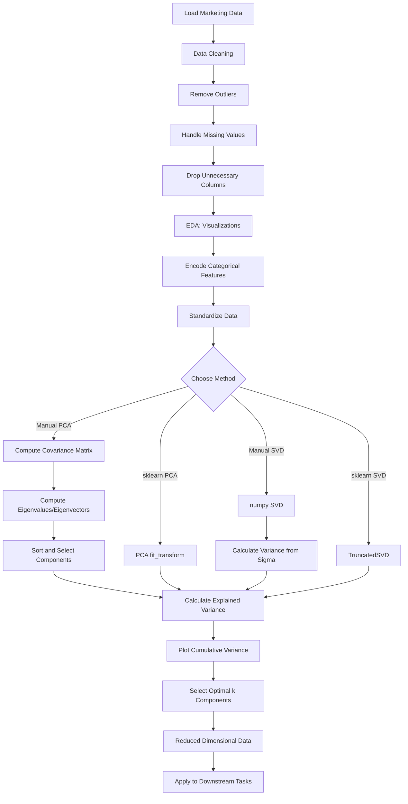

# Coding Guide: Unsupervised Machine Learning Assignment - Marketing Campaign Analysis

## Overview
This assignment demonstrates a complete workflow for applying dimensionality reduction techniques (PCA and SVD) to a real-world marketing campaign dataset. You'll learn data preprocessing, exploratory data analysis, and how to reduce high-dimensional customer data for better analysis.

**Target Audience:** Users with basic Python programming knowledge who are new to machine learning.

**Dataset:** Marketing Campaign Data - Customer information including demographics, purchasing behavior, and campaign responses.

---

## Table of Contents
1. [Library Imports](#library-imports)
2. [Data Loading and Understanding](#data-loading)
3. [Data Cleaning](#data-cleaning)
4. [Exploratory Data Analysis](#eda)
5. [Data Preprocessing](#data-preprocessing)
6. [PCA Implementation](#pca-implementation)
7. [SVD Implementation](#svd-implementation)
8. [Comparison and Conclusions](#comparison)

---

## 1. Library Imports

### Code:
```python
import numpy as np
import pandas as pd
import seaborn as sns
import matplotlib.pyplot as plt
from sklearn.preprocessing import StandardScaler
import warnings
warnings.filterwarnings("ignore")
```

### Explanation:
- **numpy (np)**: Numerical operations, array manipulations, and linear algebra functions
  - Used for: eigenvalue computation, matrix operations
- **pandas (pd)**: Data manipulation and analysis with DataFrames
  - Used for: loading CSV, data cleaning, feature selection
- **seaborn (sns)**: Statistical data visualization library
  - Used for: heatmaps, distribution plots
- **matplotlib.pyplot (plt)**: Basic plotting and visualization
  - Used for: creating custom plots, histograms
- **StandardScaler**: Standardizes features by removing mean and scaling to unit variance
  - Formula: z = (x - μ) / σ
  - Critical for PCA as it's sensitive to feature scales
- **warnings.filterwarnings("ignore")**: Suppresses warning messages for cleaner output


---

## 2. Data Loading and Understanding

### Step 2.1: Load the Dataset

#### Code:
```python
df = pd.read_csv("marketing_campaign.csv", sep="\t")
pd.set_option('display.max_columns', 30)
df.head()
```

#### Explanation:
- **pd.read_csv()**: Reads data from a CSV file
  - **sep="\t"**: Specifies tab-separated values (TSV format)
  - Different from default comma-separated (CSV)
- **pd.set_option('display.max_columns', 30)**: Sets pandas display option
  - Shows up to 30 columns in output (default is 20)
  - Ensures all columns are visible when printing DataFrame
- **df.head()**: Displays first 5 rows
  - Quick preview of data structure and values

### Step 2.2: View Column Names

#### Code:
```python
df.columns
```

#### Explanation:
- **df.columns**: Returns Index object containing all column names
- **Purpose**: Understand what features are available
- **Dataset columns include**:
  - Demographics: Year_Birth, Education, Marital_Status
  - Economic: Income
  - Purchases: MntWines, MntFruits, MntMeatProducts, etc.
  - Campaign responses: AcceptedCmp1-5, Response
  - Website activity: NumWebVisitsMonth

### Step 2.3: Check Dataset Shape

#### Code:
```python
df.shape
```

#### Explanation:
- **df.shape**: Returns tuple (rows, columns)
- **Purpose**: Understand dataset size
- **Example output**: (2240, 29) means 2240 customers and 29 features
- **Important for**: Memory estimation, processing time, dimensionality assessment


### Step 2.4: Check Data Types

#### Code:
```python
df.info()
```

#### Explanation:
- **df.info()**: Provides concise summary of DataFrame
- **Information displayed**:
  - Column names and count
  - Non-null count (identifies missing values)
  - Data type of each column (int64, float64, object)
  - Memory usage
- **Purpose**: 
  - Identify data types for appropriate processing
  - Spot missing values
  - Understand memory requirements
- **Common data types**:
  - **int64**: Integer numbers (e.g., Year_Birth, NumWebVisitsMonth)
  - **float64**: Decimal numbers (e.g., Income, MntWines)
  - **object**: Text/strings (e.g., Education, Marital_Status)

### Step 2.5: Generate Descriptive Statistics

#### Code:
```python
df.describe()
```

#### Explanation:
- **df.describe()**: Generates descriptive statistics for numeric columns
- **Statistics provided**:
  - **count**: Number of non-null values
  - **mean**: Average value
  - **std**: Standard deviation (measure of spread)
  - **min**: Minimum value
  - **25%**: First quartile (25th percentile)
  - **50%**: Median (50th percentile)
  - **75%**: Third quartile (75th percentile)
  - **max**: Maximum value
- **Purpose**: 
  - Understand data distribution
  - Identify outliers (values far from mean)
  - Check feature scales (important for PCA)
  - Spot data quality issues

**Key Observations to Look For**:
- Large differences in scales (e.g., Income: 1730-666666 vs NumWebVisitsMonth: 0-20)
- Outliers (max values much larger than 75th percentile)
- Negative values where they shouldn't exist
- Unrealistic values (e.g., Year_Birth: 1893 seems too old)


---

## 3. Data Cleaning

### Step 2.6.1: Remove Income Outliers

#### Code:
```python
df = df[df["Income"] <= 600000]
```

#### Explanation:
- **Boolean indexing**: Filters DataFrame based on condition
- **df["Income"] <= 600000**: Creates boolean mask (True/False for each row)
- **df[mask]**: Keeps only rows where mask is True
- **Purpose**: Remove unrealistic income values
  - Income > 600,000 is likely data entry error or extreme outlier
  - Outliers can distort PCA results
- **Alternative syntax**: `df = df.query("Income <= 600000")`

### Step 2.6.2: Remove Birth Year Outliers

#### Code:
```python
df = df[df['Year_Birth'] >= 1940]
```

#### Explanation:
- **Filters out customers born before 1940**
- **Reasoning**: 
  - People born before 1940 would be 80+ years old
  - Unlikely to be active customers in marketing campaigns
  - May be data entry errors
- **Impact**: Improves data quality and model reliability

### Step 2.7: Check for Null Values

#### Code:
```python
df.isna().sum()
```

#### Explanation:
- **df.isna()**: Returns DataFrame of same shape with True for missing values
- **.sum()**: Counts True values (missing values) per column
- **Purpose**: Identify columns with missing data
- **Common handling strategies**:
  - Drop rows: `df.dropna()`
  - Fill with mean: `df.fillna(df.mean())`
  - Fill with median: `df.fillna(df.median())`
  - Fill with mode: `df.fillna(df.mode().iloc[0])`
- **Note**: PCA cannot handle missing values, must be addressed

### Step 2.8: Check for Duplicates

#### Code:
```python
df.duplicated().sum()
```

#### Explanation:
- **df.duplicated()**: Returns boolean Series marking duplicate rows
  - First occurrence: False
  - Subsequent occurrences: True
- **.sum()**: Counts number of duplicate rows
- **Purpose**: Identify redundant data
- **To remove duplicates**: `df = df.drop_duplicates()`
- **Why remove**: Duplicates can bias analysis and inflate importance of certain patterns


### Step 2.9: Check Unique Values

#### Code:
```python
df.nunique()
```

#### Explanation:
- **df.nunique()**: Returns count of unique values per column
- **Purpose**: Understand data cardinality
- **Insights**:
  - **High cardinality** (many unique values): Continuous features (Income, MntWines)
  - **Low cardinality** (few unique values): Categorical features (Education, Marital_Status)
  - **All unique**: Potential ID columns (should be dropped)
  - **Single value**: Constant columns (no information, should be dropped)
- **Example interpretation**:
  - ID: 2240 unique → Every row is unique (identifier column)
  - Education: 5 unique → 5 education levels
  - AcceptedCmp1: 2 unique → Binary (0 or 1)

### Step 2.10: Drop Unnecessary Columns

#### Code:
```python
df = df.drop(['ID', 'Dt_Customer'], axis=1)
```

#### Explanation:
- **df.drop()**: Removes specified columns or rows
  - **columns**: List of column names to drop
  - **axis=1**: Specifies column-wise operation (axis=0 for rows)
- **Why drop ID**: 
  - Unique identifier, no predictive value
  - Would create noise in PCA
- **Why drop Dt_Customer**: 
  - Date customer enrolled
  - Would need feature engineering to be useful
  - As-is, it's just a timestamp with no direct value
- **Alternative**: `df = df[['col1', 'col2', ...]]` to keep only specific columns

---

## 4. Exploratory Data Analysis (EDA)

### Step 3.1: Create Histograms for Numeric Features

#### Code:
```python
numeric_features = df.select_dtypes(include=['int64', 'float64'])
numeric_features.hist(figsize=(20, 15), bins=30)
plt.tight_layout()
plt.show()
```

#### Explanation:
- **df.select_dtypes()**: Selects columns by data type
  - **include=['int64', 'float64']**: Keeps only numeric columns
  - Excludes categorical columns (object type)
- **numeric_features.hist()**: Creates histogram for each numeric column
  - **figsize=(20, 15)**: Sets figure size in inches (width, height)
  - **bins=30**: Number of bins (bars) in each histogram
  - More bins = more granular distribution view
- **plt.tight_layout()**: Adjusts subplot spacing to prevent overlap
- **Purpose**: 
  - Visualize distribution of each feature
  - Identify skewness (left/right tailed)
  - Spot outliers
  - Check for normal distribution


### Step 3.2: Create Correlation Heatmap

#### Code:
```python
correlation_matrix = df.select_dtypes(include=['int64', 'float64']).corr()
plt.figure(figsize=(15, 12))
sns.heatmap(correlation_matrix, annot=True, cmap='coolwarm', fmt='.2f', linewidths=0.5)
plt.title('Correlation Heatmap')
plt.show()
```

#### Explanation:
- **df.corr()**: Computes pairwise correlation of numeric columns
  - Values range from -1 to 1
  - **1**: Perfect positive correlation (both increase together)
  - **-1**: Perfect negative correlation (one increases, other decreases)
  - **0**: No linear correlation
- **plt.figure(figsize=(15, 12))**: Creates new figure with specified size
- **sns.heatmap()**: Creates color-coded matrix visualization
  - **annot=True**: Shows correlation values in cells
  - **cmap='coolwarm'**: Color scheme (blue=negative, red=positive)
  - **fmt='.2f'**: Formats numbers to 2 decimal places
  - **linewidths=0.5**: Adds thin lines between cells
- **Purpose**:
  - Identify highly correlated features (redundant information)
  - Understand feature relationships
  - Guide feature selection
  - High correlation → PCA will combine these features

### Step 3.3: Create Bar Plots for Categorical Features

#### Code:
```python
categorical_features = ['Education', 'Marital_Status']
fig, axes = plt.subplots(1, 2, figsize=(15, 5))

for i, col in enumerate(categorical_features):
    df[col].value_counts().plot(kind='bar', ax=axes[i])
    axes[i].set_title(f'Distribution of {col}')
    axes[i].set_xlabel(col)
    axes[i].set_ylabel('Count')

plt.tight_layout()
plt.show()
```

#### Explanation:
- **fig, axes = plt.subplots(1, 2, ...)**: Creates subplot grid
  - **1, 2**: 1 row, 2 columns
  - **figsize=(15, 5)**: Overall figure size
  - Returns figure object and array of axes
- **enumerate(categorical_features)**: Loops with index and value
  - **i**: Index (0, 1)
  - **col**: Column name ('Education', 'Marital_Status')
- **df[col].value_counts()**: Counts occurrences of each unique value
  - Returns Series sorted by count (descending)
- **.plot(kind='bar', ax=axes[i])**: Creates bar chart
  - **kind='bar'**: Vertical bar chart
  - **ax=axes[i]**: Plots on specific subplot
- **Purpose**:
  - Visualize distribution of categorical variables
  - Check for class imbalance
  - Understand customer demographics


---

## 5. Data Preprocessing

### Step 4.1: Encode Categorical Columns

#### Code:
```python
from sklearn.preprocessing import LabelEncoder

label_encoder = LabelEncoder()
df['Education'] = label_encoder.fit_transform(df['Education'])
df['Marital_Status'] = label_encoder.fit_transform(df['Marital_Status'])
```

#### Explanation:
- **LabelEncoder**: Converts categorical text labels to numeric values
  - Example: ['Basic', 'Graduation', 'PhD'] → [0, 1, 2]
- **label_encoder.fit_transform()**: Two-step process
  - **fit()**: Learns unique categories and assigns numbers
  - **transform()**: Converts categories to numbers
- **Why encode**: 
  - PCA requires numeric input
  - Machine learning algorithms work with numbers, not text
- **Important Note**: 
  - LabelEncoder creates ordinal relationship (0 < 1 < 2)
  - For non-ordinal categories, consider OneHotEncoder instead
  - Here it's acceptable as we're doing dimensionality reduction

### Step 4.2: Standardize the Data

#### Code:
```python
scaler = StandardScaler()
df_scaled = scaler.fit_transform(df)
```

#### Explanation:
- **StandardScaler**: Standardizes features to have mean=0 and std=1
  - **Formula**: z = (x - μ) / σ
  - **μ**: Mean of feature
  - **σ**: Standard deviation of feature
- **Why standardize for PCA**:
  - PCA is sensitive to feature scales
  - Features with larger scales dominate principal components
  - Example: Income (0-600,000) vs NumWebVisitsMonth (0-20)
  - Without scaling, Income would dominate PCA results
- **fit_transform()**: 
  - **fit()**: Computes mean and std for each feature
  - **transform()**: Applies standardization
- **Result**: All features have comparable scales
  - Mean = 0
  - Standard deviation = 1
  - Values typically range from -3 to +3

### Step 4.3: View Scaled Data

#### Code:
```python
df_scaled = pd.DataFrame(df_scaled, columns=df.columns)
df_scaled.head()
```

#### Explanation:
- **pd.DataFrame()**: Converts numpy array back to DataFrame
  - **df_scaled**: Numpy array from StandardScaler
  - **columns=df.columns**: Preserves original column names
- **Purpose**: 
  - Makes data easier to inspect
  - Preserves column names for interpretation
  - Allows pandas operations on scaled data
- **Verification**: Check that values are centered around 0


---

## 6. PCA Implementation (Manual)

### Why Perform PCA?
- **Reduce dimensionality**: 27 features → fewer components
- **Remove multicollinearity**: Combine correlated features
- **Improve visualization**: Project to 2D/3D
- **Speed up algorithms**: Fewer features = faster training
- **Reduce overfitting**: Less features = simpler models

### Step 4.4.1: Compute Covariance Matrix

#### Code:
```python
covariance_matrix = np.cov(df_scaled.T)
covariance_matrix
```

#### Explanation:
- **np.cov()**: Computes covariance matrix
  - **df_scaled.T**: Transpose required (features as rows)
  - Without transpose: computes covariance between samples
  - With transpose: computes covariance between features
- **Covariance Matrix Properties**:
  - **Shape**: (n_features, n_features) = (27, 27)
  - **Symmetric**: cov(X, Y) = cov(Y, X)
  - **Diagonal**: Variance of each feature
  - **Off-diagonal**: Covariance between feature pairs
- **Interpretation**:
  - **Positive covariance**: Features increase together
  - **Negative covariance**: One increases, other decreases
  - **Zero covariance**: No linear relationship
- **Purpose**: Foundation for finding principal components

### Step 4.4.2: Compute Eigenvalues and Eigenvectors

#### Code:
```python
eigenvalues, eigenvectors = np.linalg.eig(covariance_matrix)
print("Eigen values:\n", eigenvalues)
print("Eigen vectors:\n", eigenvectors)
```

#### Explanation:
- **np.linalg.eig()**: Computes eigenvalues and eigenvectors
  - **Input**: Square matrix (covariance matrix)
  - **Returns**: Tuple (eigenvalues, eigenvectors)
- **Eigenvalues**:
  - Array of length n_features (27 values)
  - Represents variance captured by each principal component
  - Larger eigenvalue = more important component
- **Eigenvectors**:
  - Matrix of shape (n_features, n_features) = (27, 27)
  - Each column is an eigenvector (principal component direction)
  - Eigenvectors are orthogonal (perpendicular to each other)
- **Mathematical Relationship**:
  - Covariance_Matrix × eigenvector = eigenvalue × eigenvector
  - Eigenvector: Direction that doesn't change under transformation
  - Eigenvalue: How much the eigenvector is scaled
- **In PCA Context**:
  - Eigenvectors = Principal component directions
  - Eigenvalues = Amount of variance in each direction


### Step 4.4.3: Sort Eigenvalues and Select Principal Components

#### Code:
```python
sorted_indices = np.argsort(eigenvalues)[::-1]
sorted_eigenvalues = eigenvalues[sorted_indices]
sorted_eigenvectors = eigenvectors[:, sorted_indices]
```

#### Explanation:
- **np.argsort(eigenvalues)**: Returns indices that would sort array
  - Example: [3, 1, 2] → [1, 2, 0] (indices in ascending order)
- **[::-1]**: Reverses array (descending order)
  - We want largest eigenvalues first (most important components)
- **eigenvalues[sorted_indices]**: Reorders eigenvalues
- **eigenvectors[:, sorted_indices]**: Reorders eigenvector columns
  - **[:,** : All rows (all features)
  - **sorted_indices]**: Reordered columns
- **Result**: 
  - First principal component has highest variance
  - Last principal component has lowest variance
- **Purpose**: Prioritize components by importance

### Step 4.4.4: Calculate Explained Variance Ratio

#### Code:
```python
total_variance = np.sum(eigenvalues)
explained_variance_ratio = sorted_eigenvalues / total_variance
print("Explained Variance Ratio:", explained_variance_ratio)
```

#### Explanation:
- **total_variance**: Sum of all eigenvalues
  - Equals total variance in original data
  - For standardized data, equals number of features
- **explained_variance_ratio**: Proportion of variance per component
  - **Formula**: eigenvalue_i / sum(all eigenvalues)
  - Values between 0 and 1
  - Sum of all ratios = 1.0 (100%)
- **Interpretation**:
  - **PC1 = 0.25**: First component explains 25% of variance
  - **PC2 = 0.15**: Second component explains 15% of variance
  - Together: 40% of total variance
- **Purpose**: Decide how many components to keep
  - Common threshold: Keep components explaining 95% variance

### Step 4.4.5: Calculate Cumulative Explained Variance

#### Code:
```python
cumulative_variance = np.cumsum(explained_variance_ratio)
print("Cumulative Explained Variance:", cumulative_variance)
```

#### Explanation:
- **np.cumsum()**: Computes cumulative sum
  - **Example**: [0.25, 0.15, 0.10] → [0.25, 0.40, 0.50]
- **cumulative_variance**: Running total of explained variance
  - Shows total variance captured by first k components
- **Interpretation**:
  - **cumulative_variance[0] = 0.25**: First PC explains 25%
  - **cumulative_variance[1] = 0.40**: First 2 PCs explain 40%
  - **cumulative_variance[4] = 0.95**: First 5 PCs explain 95%
- **Purpose**: Determine optimal number of components
  - Find where cumulative variance reaches desired threshold (e.g., 95%)


### Step 4.4.6: Plot Cumulative Explained Variance

#### Code:
```python
plt.figure(figsize=(10, 6))
plt.plot(range(1, len(cumulative_variance) + 1), cumulative_variance, marker='o')
plt.xlabel('Number of Components')
plt.ylabel('Cumulative Explained Variance')
plt.title('Cumulative Explained Variance vs Number of Components')
plt.axhline(y=0.95, color='r', linestyle='--', label='95% Variance')
plt.legend()
plt.grid(True)
plt.show()
```

#### Explanation:
- **plt.plot()**: Creates line plot
  - **range(1, len(...) + 1)**: X-axis (1, 2, 3, ..., 27 components)
  - **cumulative_variance**: Y-axis (cumulative variance values)
  - **marker='o'**: Adds circle markers at data points
- **plt.axhline(y=0.95, ...)**: Adds horizontal line at y=0.95
  - **color='r'**: Red color
  - **linestyle='--'**: Dashed line
  - **label**: Legend label
- **Purpose**: Visual tool to select number of components
  - Find where curve crosses 95% line
  - Shows diminishing returns (curve flattens)
- **Decision**: Choose k where cumulative variance ≥ 95%

### Step 4.4.7: Using sklearn PCA (Alternate Method)

#### Code:
```python
from sklearn.decomposition import PCA

pca = PCA(n_components=18)
X_pca = pca.fit_transform(df_scaled)

explained_variance_ratio = pca.explained_variance_ratio_
print("Explained variance ratio:", explained_variance_ratio)
print("Cumulative variance:", np.cumsum(explained_variance_ratio))
```

#### Explanation:
- **PCA(n_components=18)**: Creates PCA object
  - **n_components**: Number of components to keep
  - Can also use float (e.g., 0.95 for 95% variance)
- **pca.fit_transform()**: Fits PCA and transforms data
  - **fit()**: Computes principal components
  - **transform()**: Projects data onto components
- **pca.explained_variance_ratio_**: Variance explained by each component
  - Same as manual calculation
  - Automatically sorted by importance
- **Advantages of sklearn**:
  - Simpler, less code
  - Optimized implementation
  - Additional features (inverse_transform, etc.)
- **Result**: X_pca has shape (n_samples, 18)
  - Reduced from 27 to 18 dimensions


---

## 7. SVD Implementation

### Why Perform SVD?
- **Alternative to PCA**: Achieves same dimensionality reduction
- **More numerically stable**: Better for ill-conditioned matrices
- **Works with non-square matrices**: PCA requires square covariance matrix
- **Foundation for many algorithms**: Recommender systems, NLP (LSA)
- **No covariance computation**: Works directly with data matrix

### Step 4.5.1: Perform SVD Manually

#### Code:
```python
from numpy.linalg import svd

U, Sigma, Vt = svd(df_scaled)

print("Shape of U:", U.shape)
print("Shape of Sigma:", Sigma.shape)
print("Shape of Vt:", Vt.shape)
print("Singular Values:", Sigma[:10])
```

#### Explanation:
- **svd()**: Performs Singular Value Decomposition
  - **Formula**: X = U × Σ × V^T
- **U**: Left singular vectors
  - **Shape**: (n_samples, n_samples) = (2238, 2238)
  - Represents samples in component space
- **Sigma**: Singular values (diagonal matrix)
  - **Shape**: (n_features,) = (27,)
  - Returned as 1D array (diagonal values only)
  - Sorted in descending order
  - Related to eigenvalues: σ² = λ
- **Vt**: Right singular vectors (transposed)
  - **Shape**: (n_features, n_features) = (27, 27)
  - Rows are principal component directions
  - Same as eigenvectors from PCA
- **Mathematical Relationship**:
  - **V**: Principal components (same as PCA eigenvectors)
  - **Sigma²**: Eigenvalues of covariance matrix
  - **U**: Projection of data onto components

### Step 4.5.2: Calculate Explained Variance Using SVD

#### Code:
```python
explained_variance = (Sigma ** 2) / (len(df_scaled) - 1)
total_variance = explained_variance.sum()
explained_variance_ratio_svd = explained_variance / total_variance

print("Explained Variance Ratio (SVD):", explained_variance_ratio_svd)
```

#### Explanation:
- **Sigma ** 2**: Squares singular values
  - Converts singular values to variance
  - **Relationship**: variance = σ² / (n - 1)
- **(len(df_scaled) - 1)**: Degrees of freedom
  - n - 1 for sample variance
  - Same as covariance matrix calculation
- **explained_variance_ratio_svd**: Proportion of variance per component
  - **Should match PCA results exactly**
  - Validates that SVD and PCA are equivalent
- **Verification**: Compare with PCA explained_variance_ratio
  - Values should be identical (within floating-point precision)


### Step 4.5.3: Plot Cumulative Explained Variance (SVD)

#### Code:
```python
cumulative_variance_svd = np.cumsum(explained_variance_ratio_svd)

plt.figure(figsize=(10, 6))
plt.plot(range(1, len(cumulative_variance_svd) + 1), cumulative_variance_svd, marker='o')
plt.xlabel('Number of Components')
plt.ylabel('Cumulative Explained Variance')
plt.title('SVD: Cumulative Explained Variance vs Number of Components')
plt.axhline(y=0.95, color='r', linestyle='--', label='95% Variance')
plt.legend()
plt.grid(True)
plt.show()
```

#### Explanation:
- **Same visualization as PCA**
- **Purpose**: Verify SVD gives same results as PCA
- **Expected**: Plot should be identical to PCA plot
- **Interpretation**: Same number of components needed for 95% variance

### Step 4.5.4: Using sklearn TruncatedSVD

#### Code:
```python
from sklearn.decomposition import TruncatedSVD

svd_model = TruncatedSVD(n_components=18)
X_svd = svd_model.fit_transform(df_scaled)

print("Explained Variance Ratio:", svd_model.explained_variance_ratio_)
print("Cumulative Variance:", np.cumsum(svd_model.explained_variance_ratio_))
```

#### Explanation:
- **TruncatedSVD**: sklearn's SVD implementation
  - **"Truncated"**: Computes only k components (not all)
  - More efficient than full SVD
- **n_components=18**: Number of components to keep
  - Same as PCA for comparison
- **fit_transform()**: Computes SVD and projects data
- **Advantages**:
  - Faster for large datasets
  - Memory efficient
  - Can work with sparse matrices
- **Difference from PCA**:
  - TruncatedSVD doesn't center data (no mean subtraction)
  - For centered data, results are identical to PCA
- **Result**: X_svd has shape (n_samples, 18)

---

## 8. Comparison and Conclusions

### PCA vs SVD Summary

| Aspect | PCA | SVD |
|--------|-----|-----|
| **Method** | Eigendecomposition of covariance matrix | Direct decomposition of data matrix |
| **Centering** | Requires mean-centered data | Works with or without centering |
| **Computation** | Computes covariance matrix first | Works directly on data |
| **Numerical Stability** | Can be unstable | More stable |
| **Results** | Identical to SVD (when data is centered) | Identical to PCA (when data is centered) |
| **Use Case** | Statistical interpretation | Large-scale applications |

### Key Takeaways

1. **Both methods achieve same goal**: Dimensionality reduction
2. **Results are equivalent**: When data is properly preprocessed
3. **Choose based on context**:
   - **PCA**: When you need statistical interpretation
   - **SVD**: When you need numerical stability or work with sparse data
4. **Preprocessing is critical**: Standardization is essential for both
5. **Component selection**: Use cumulative variance plot to decide
6. **Typical threshold**: 95% variance retention is common

### What to Do After Dimensionality Reduction?

1. **Clustering**: Apply K-means, DBSCAN on reduced data
2. **Visualization**: Plot first 2-3 components
3. **Classification**: Use as features for supervised learning
4. **Anomaly Detection**: Identify outliers in reduced space
5. **Feature Engineering**: Create new features from components

---

## Flow Diagram



---

## Summary

This assignment covered:
- ✅ Complete data preprocessing pipeline
- ✅ Handling outliers and missing values
- ✅ Exploratory data analysis with visualizations
- ✅ Manual PCA implementation (understanding the math)
- ✅ sklearn PCA (practical implementation)
- ✅ Manual SVD implementation
- ✅ sklearn SVD (TruncatedSVD)
- ✅ Comparison of methods
- ✅ Selecting optimal number of components

**Next Steps**: Apply these techniques to your own datasets and experiment with different numbers of components!
