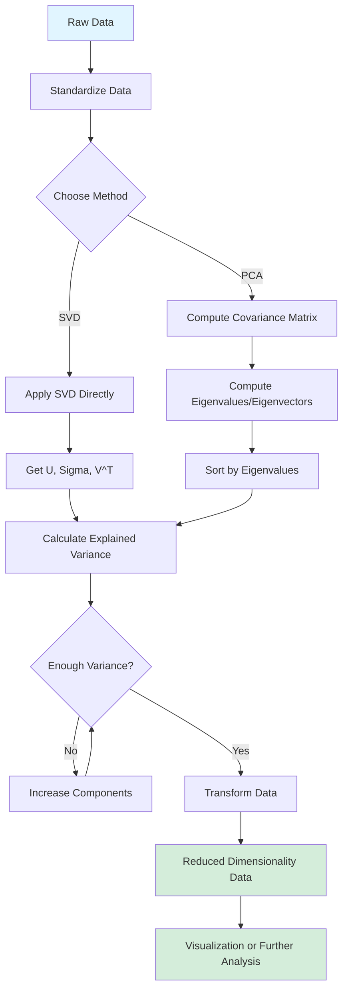
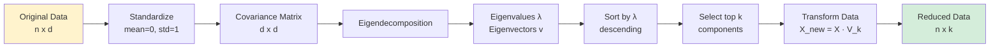
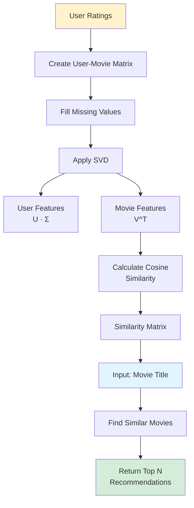

# Coding Guide: Unsupervised Machine Learning

## Overview
This notebook demonstrates unsupervised machine learning techniques, specifically focusing on dimensionality reduction using PCA (Principal Component Analysis) and SVD (Singular Value Decomposition), with a practical application in building a movie recommender system.

**Target Audience:** Users with basic Python programming knowledge who are new to machine learning.

---

## Table of Contents
1. [Library Imports](#library-imports)
2. [Section 1: Principal Component Analysis (PCA)](#section-1-pca)
3. [Section 2: Singular Value Decomposition (SVD)](#section-2-svd)
4. [Section 3: Movie Recommender System](#section-3-recommender-system)

---

## Library Imports

### Code:
```python
import numpy as np
import pandas as pd
import matplotlib.pyplot as plt
import seaborn as sns
%matplotlib inline
```

### Explanation:
- **numpy (np)**: Numerical computing library for array operations and mathematical functions
- **pandas (pd)**: Data manipulation library for working with structured data (DataFrames)
- **matplotlib.pyplot (plt)**: Plotting library for creating visualizations
- **seaborn (sns)**: Statistical data visualization library built on matplotlib, provides better-looking plots
- **%matplotlib inline**: Jupyter magic command that displays plots directly in the notebook

---

## Section 1: Principal Component Analysis (PCA)

### What is PCA?
PCA is a dimensionality reduction technique that transforms high-dimensional data into a lower-dimensional space while preserving as much variance (information) as possible.

### Dataset
**Country Socioeconomic Data** - Contains various economic and health indicators for different countries.

### Step 1: Loading the Data

#### Code:
```python
country_data = pd.read_csv("https://raw.githubusercontent.com/curlsloth/IK_teaching/main/Country_socioeconomic-data.csv")
country_data.head()
```

#### Explanation:
- **pd.read_csv()**: Reads CSV data from a URL and creates a DataFrame
- **country_data.head()**: Displays the first 5 rows to preview the data
- **Dataset features**: child_mort, exports, health, imports, income, inflation, life_expec, total_fer, gdpp

### Step 2: Understanding the Data

#### Code 1: Basic Statistics
```python
country_data.describe()
```

#### Explanation:
- **describe()**: Generates descriptive statistics (count, mean, std, min, 25%, 50%, 75%, max)
- Helps understand the distribution and scale of each feature
- Notice the different scales: income ranges from 609 to 125,000, while child_mort ranges from 2.6 to 208

#### Code 2: Check Data Shape
```python
country_data.shape
```

#### Explanation:
- **shape**: Returns tuple (rows, columns)
- Shows we have 167 countries and 10 columns (1 country name + 9 features)

#### Code 3: Check for Missing Values
```python
country_data.isnull().sum()
```

#### Explanation:
- **isnull()**: Returns boolean DataFrame where True indicates missing values
- **sum()**: Counts True values (missing values) for each column
- Important to check before applying PCA as it doesn't handle missing values

#### Code 4: Visualize Correlations
```python
plt.figure(figsize=(12, 8))
sns.heatmap(country_data.drop('country', axis=1).corr(), annot=True, cmap='coolwarm', fmt='.2f')
plt.title('Correlation Matrix of Country Features')
plt.show()
```

#### Explanation:
- **plt.figure(figsize=(12, 8))**: Creates figure with specified size in inches
- **country_data.drop('country', axis=1)**: Removes non-numeric 'country' column
  - **axis=1**: Specifies column-wise operation
- **corr()**: Computes pairwise correlation of columns
- **sns.heatmap()**: Creates color-coded matrix visualization
  - **annot=True**: Shows correlation values in cells
  - **cmap='coolwarm'**: Color scheme (blue=negative, red=positive correlation)
  - **fmt='.2f'**: Formats numbers to 2 decimal places
- **Purpose**: Identifies which features are highly correlated (redundant information)

### Step 3: Step-by-Step PCA Implementation

#### Step 3.1: Standardize the Data

##### Code:
```python
from sklearn.preprocessing import StandardScaler

# Select only numeric columns
X = country_data.drop('country', axis=1)

# Standardize the features
scaler = StandardScaler()
X_scaled = scaler.fit_transform(X)
```

##### Explanation:
- **StandardScaler**: Standardizes features by removing mean and scaling to unit variance
  - Formula: z = (x - μ) / σ
  - μ = mean, σ = standard deviation
- **Why standardize?**: PCA is sensitive to feature scales. Features with larger scales would dominate the principal components
- **fit_transform()**: Computes mean/std (fit) and applies transformation (transform) in one step
- **Result**: X_scaled has mean=0 and std=1 for each feature

#### Step 3.2: Compute the Covariance Matrix

##### Code:
```python
# Compute covariance matrix
cov_matrix = np.cov(X_scaled.T)
print("Covariance Matrix Shape:", cov_matrix.shape)
print("\nCovariance Matrix:\n", cov_matrix)
```

##### Explanation:
- **np.cov()**: Computes covariance matrix
  - **X_scaled.T**: Transpose required because np.cov expects features as rows
- **Covariance Matrix**: Shows how features vary together
  - Diagonal elements: Variance of each feature
  - Off-diagonal elements: Covariance between feature pairs
- **Shape**: (9, 9) for 9 features
- **Purpose**: Covariance matrix is the foundation for finding principal components

#### Step 3.3: Compute Eigenvalues and Eigenvectors

##### Code:
```python
# Compute eigenvalues and eigenvectors
eigenvalues, eigenvectors = np.linalg.eig(cov_matrix)

print("Eigenvalues:\n", eigenvalues)
print("\nEigenvectors:\n", eigenvectors)
```

##### Explanation:
- **np.linalg.eig()**: Computes eigenvalues and eigenvectors of a square matrix
- **Eigenvalues**: Represent the amount of variance explained by each principal component
  - Larger eigenvalue = more important component
- **Eigenvectors**: Represent the direction of each principal component
  - Each column is one eigenvector (principal component direction)
- **Mathematical concept**: For covariance matrix C and eigenvector v: C·v = λ·v
  - λ (lambda) is the eigenvalue

#### Step 3.4: Sort Eigenvalues and Select Principal Components

##### Code:
```python
# Sort eigenvalues and eigenvectors in descending order
sorted_indices = np.argsort(eigenvalues)[::-1]
sorted_eigenvalues = eigenvalues[sorted_indices]
sorted_eigenvectors = eigenvectors[:, sorted_indices]

print("Sorted Eigenvalues:\n", sorted_eigenvalues)
```

##### Explanation:
- **np.argsort()**: Returns indices that would sort the array
- **[::-1]**: Reverses the order (descending instead of ascending)
- **sorted_eigenvectors[:, sorted_indices]**: Reorders eigenvector columns to match sorted eigenvalues
- **Purpose**: We want principal components ordered by importance (highest variance first)

#### Step 3.5: Calculate Explained Variance Ratio

##### Code:
```python
# Calculate explained variance ratio
explained_variance_ratio = sorted_eigenvalues / np.sum(sorted_eigenvalues)

print("Explained Variance Ratio:\n", explained_variance_ratio)
```

##### Explanation:
- **Explained Variance Ratio**: Proportion of total variance explained by each component
  - Formula: λᵢ / Σλⱼ (eigenvalue / sum of all eigenvalues)
- **Interpretation**: 
  - First PC might explain 60% of variance
  - Second PC might explain 20% of variance
  - Together they explain 80% of total variance
- **Purpose**: Helps decide how many components to keep

#### Step 3.6: Calculate Cumulative Explained Variance

##### Code:
```python
# Calculate cumulative explained variance
cumulative_variance = np.cumsum(explained_variance_ratio)

print("Cumulative Explained Variance:\n", cumulative_variance)

# Plot cumulative explained variance
plt.figure(figsize=(10, 6))
plt.plot(range(1, len(cumulative_variance) + 1), cumulative_variance, marker='o')
plt.xlabel('Number of Principal Components')
plt.ylabel('Cumulative Explained Variance')
plt.title('Cumulative Explained Variance by Principal Components')
plt.grid(True)
plt.axhline(y=0.95, color='r', linestyle='--', label='95% Variance')
plt.legend()
plt.show()
```

##### Explanation:
- **np.cumsum()**: Computes cumulative sum
  - Example: [0.6, 0.2, 0.1] → [0.6, 0.8, 0.9]
- **Plot components**:
  - **range(1, len(...) + 1)**: X-axis (component numbers starting from 1)
  - **marker='o'**: Adds circular markers at data points
  - **plt.axhline(y=0.95, ...)**: Horizontal line at 95% threshold
- **Purpose**: Visual tool to decide how many components to keep
  - Common threshold: Keep components that explain 95% of variance

#### Step 3.7: Transform Data to Principal Components

##### Code:
```python
# Select number of components (e.g., 2 for visualization)
n_components = 2
selected_eigenvectors = sorted_eigenvectors[:, :n_components]

# Transform data
X_pca = X_scaled.dot(selected_eigenvectors)

print("Transformed Data Shape:", X_pca.shape)
print("\nFirst 5 rows of transformed data:\n", X_pca[:5])
```

##### Explanation:
- **n_components = 2**: Choosing 2 components for 2D visualization
- **selected_eigenvectors[:, :n_components]**: Selects first n columns (top n components)
- **X_scaled.dot(selected_eigenvectors)**: Matrix multiplication to project data onto new axes
  - **dot()**: Performs matrix multiplication
  - Projects original 9D data onto 2D space defined by principal components
- **Result**: Each country now represented by 2 numbers instead of 9

### Alternate Way: Using sklearn's PCA

#### Code:
```python
from sklearn.decomposition import PCA

# Create PCA object
pca = PCA(n_components=2)

# Fit and transform
X_pca_sklearn = pca.fit_transform(X_scaled)

print("Explained Variance Ratio:", pca.explained_variance_ratio_)
print("Cumulative Variance:", np.cumsum(pca.explained_variance_ratio_))
print("\nTransformed Data Shape:", X_pca_sklearn.shape)
```

#### Explanation:
- **PCA(n_components=2)**: Creates PCA object that will keep 2 components
- **fit_transform()**: Performs entire PCA process in one step
  - Computes covariance matrix
  - Finds eigenvalues/eigenvectors
  - Transforms data
- **pca.explained_variance_ratio_**: Directly gives variance explained by each component
- **Advantage**: Much simpler than manual implementation, optimized for performance

### Visualization of PCA Results

#### Code:
```python
# Create DataFrame for easier plotting
pca_df = pd.DataFrame(data=X_pca_sklearn, columns=['PC1', 'PC2'])
pca_df['country'] = country_data['country'].values

# Scatter plot
plt.figure(figsize=(12, 8))
plt.scatter(pca_df['PC1'], pca_df['PC2'], alpha=0.5)

# Annotate some points
for i in range(0, len(pca_df), 10):  # Annotate every 10th country
    plt.annotate(pca_df['country'].iloc[i], 
                 (pca_df['PC1'].iloc[i], pca_df['PC2'].iloc[i]),
                 fontsize=8)

plt.xlabel(f'PC1 ({pca.explained_variance_ratio_[0]:.2%} variance)')
plt.ylabel(f'PC2 ({pca.explained_variance_ratio_[1]:.2%} variance)')
plt.title('Countries in PCA Space')
plt.grid(True, alpha=0.3)
plt.show()
```

#### Explanation:
- **pd.DataFrame()**: Creates DataFrame for easier manipulation
- **alpha=0.5**: Sets transparency (0=transparent, 1=opaque)
- **plt.annotate()**: Adds text labels to points
  - **iloc[i]**: Accesses row by integer position
- **f-string formatting**: 
  - **{...:.2%}**: Formats as percentage with 2 decimal places
- **Purpose**: Visualizes how countries cluster in reduced 2D space

---

## Section 2: Singular Value Decomposition (SVD)

### What is SVD?
SVD decomposes a matrix into three matrices: U, Σ (Sigma), and V^T. It's closely related to PCA but works directly on the data matrix without computing covariance.

### Mathematical Relationship
- **SVD**: X = U Σ V^T
- **PCA**: Uses eigenvectors of X^T X (which equals V from SVD)
- **Connection**: Singular values (Σ) are square roots of eigenvalues

### Step 1: Apply SVD Manually

#### Code:
```python
# Apply SVD
U, S, Vt = np.linalg.svd(X_scaled, full_matrices=False)

print("U shape:", U.shape)
print("S shape:", S.shape)
print("Vt shape:", Vt.shape)
print("\nSingular values:", S)
```

#### Explanation:
- **np.linalg.svd()**: Performs Singular Value Decomposition
  - **full_matrices=False**: Returns reduced SVD (more efficient)
- **U**: Left singular vectors (167 x 9)
  - Rows correspond to countries in new space
- **S**: Singular values (9,) - returned as 1D array
  - Related to eigenvalues: eigenvalue = singular_value²
- **Vt**: Right singular vectors transposed (9 x 9)
  - Rows are principal component directions (same as eigenvectors from PCA)

### Step 2: Calculate Explained Variance Using SVD

#### Code:
```python
# Calculate explained variance from singular values
explained_variance_svd = (S ** 2) / (len(X_scaled) - 1)
explained_variance_ratio_svd = explained_variance_svd / np.sum(explained_variance_svd)

print("Explained Variance Ratio (SVD):", explained_variance_ratio_svd)
print("Cumulative Variance (SVD):", np.cumsum(explained_variance_ratio_svd))
```

#### Explanation:
- **S ** 2**: Squares singular values to get eigenvalues
- **(len(X_scaled) - 1)**: Divides by (n-1) for sample variance
- **Result**: Same explained variance ratios as PCA
- **Verification**: SVD and PCA give identical results for dimensionality reduction

### Step 3: Transform Data Using SVD

#### Code:
```python
# Transform data using first 2 components
n_components = 2
X_svd = U[:, :n_components] * S[:n_components]

print("Transformed Data Shape:", X_svd.shape)
print("\nFirst 5 rows:\n", X_svd[:5])
```

#### Explanation:
- **U[:, :n_components]**: Selects first n columns of U
- **S[:n_components]**: Selects first n singular values
- **U * S**: Element-wise multiplication (broadcasting)
  - Scales each column of U by corresponding singular value
- **Result**: Same as PCA transformation (possibly with sign differences)

### Step 4: Using sklearn's TruncatedSVD

#### Code:
```python
from sklearn.decomposition import TruncatedSVD

# Create SVD object
svd = TruncatedSVD(n_components=2, random_state=42)

# Fit and transform
X_svd_sklearn = svd.fit_transform(X_scaled)

print("Explained Variance Ratio:", svd.explained_variance_ratio_)
print("Singular Values:", svd.singular_values_)
```

#### Explanation:
- **TruncatedSVD**: sklearn's SVD implementation
  - **random_state=42**: Sets random seed for reproducibility
- **Difference from PCA**: 
  - TruncatedSVD doesn't center data (no mean subtraction)
  - More efficient for sparse matrices
- **Use case**: Often used for text data and recommender systems

---

## Section 3: Movie Recommender System

### Application Overview
Building a content-based recommender system using SVD to find similar movies based on user ratings.

### Step 1: Import Additional Libraries

#### Code:
```python
from sklearn.metrics.pairwise import cosine_similarity
```

#### Explanation:
- **cosine_similarity**: Measures similarity between vectors
  - Formula: cos(θ) = (A·B) / (||A|| ||B||)
  - Range: -1 (opposite) to 1 (identical)
  - Used to find similar movies

### Step 2: Load Movie Datasets

#### Code:
```python
# Load movies metadata
movies = pd.read_csv('Week 16 - Unsupervised Learning -1/movies_metadata.csv', low_memory=False)

# Load ratings
ratings = pd.read_csv('Week 16 - Unsupervised Learning -1/ratings_small.csv')

print("Movies shape:", movies.shape)
print("Ratings shape:", ratings.shape)
```

#### Explanation:
- **low_memory=False**: Prevents dtype guessing issues with large files
- **movies_metadata.csv**: Contains movie information (title, genres, etc.)
- **ratings_small.csv**: Contains user ratings (userId, movieId, rating)
- **Purpose**: Need both datasets to build user-movie matrix

### Step 3: Merge Datasets

#### Code:
```python
# Keep only necessary columns
movies_subset = movies[['id', 'title', 'genres']].copy()

# Convert id to numeric
movies_subset['id'] = pd.to_numeric(movies_subset['id'], errors='coerce')

# Merge with ratings
ratings_with_titles = ratings.merge(movies_subset, left_on='movieId', right_on='id', how='left')

print("Merged data shape:", ratings_with_titles.shape)
print("\nSample data:")
print(ratings_with_titles.head())
```

#### Explanation:
- **movies[['id', 'title', 'genres']]**: Selects specific columns
- **.copy()**: Creates independent copy (avoids SettingWithCopyWarning)
- **pd.to_numeric(..., errors='coerce')**: Converts to numeric, invalid values become NaN
- **merge()**: Joins DataFrames
  - **left_on='movieId'**: Column from left DataFrame (ratings)
  - **right_on='id'**: Column from right DataFrame (movies)
  - **how='left'**: Keeps all ratings, even if movie not found
- **Purpose**: Combines rating information with movie titles

### Step 4: Create User-Movie Matrix

#### Code:
```python
# Create pivot table
user_movie_matrix = ratings_with_titles.pivot_table(
    index='userId',
    columns='title',
    values='rating'
)

print("User-Movie Matrix Shape:", user_movie_matrix.shape)
print("\nMatrix sparsity:", (user_movie_matrix.isna().sum().sum() / user_movie_matrix.size) * 100, "%")
```

#### Explanation:
- **pivot_table()**: Reshapes data from long to wide format
  - **index='userId'**: Rows are users
  - **columns='title'**: Columns are movie titles
  - **values='rating'**: Cell values are ratings
- **Result**: Matrix where entry (i,j) is user i's rating of movie j
- **Sparsity**: Most cells are NaN (users haven't rated most movies)
  - Typical sparsity: >99% for real recommender systems

### Step 5: Handle Missing Values

#### Code:
```python
# Fill NaN with 0 (no rating)
user_movie_matrix_filled = user_movie_matrix.fillna(0)

print("Filled Matrix Shape:", user_movie_matrix_filled.shape)
print("\nSample of filled matrix:")
print(user_movie_matrix_filled.iloc[:5, :5])
```

#### Explanation:
- **fillna(0)**: Replaces NaN with 0
  - Assumption: Missing rating = user hasn't seen movie (not a rating of 0)
- **Alternative approaches**:
  - Fill with user's mean rating
  - Fill with movie's mean rating
  - Use matrix factorization to predict missing values
- **iloc[:5, :5]**: Shows first 5 rows and 5 columns

### Step 6: Apply SVD to User-Movie Matrix

#### Code:
```python
# Apply SVD
svd_model = TruncatedSVD(n_components=50, random_state=42)
user_movie_svd = svd_model.fit_transform(user_movie_matrix_filled)

print("SVD Matrix Shape:", user_movie_svd.shape)
print("Explained Variance Ratio:", svd_model.explained_variance_ratio_[:10])
print("Total Variance Explained:", np.sum(svd_model.explained_variance_ratio_))
```

#### Explanation:
- **n_components=50**: Reduces from thousands of movies to 50 latent features
  - Latent features: Hidden patterns (e.g., genre preferences, actor preferences)
- **user_movie_svd**: Users represented in 50-dimensional latent space
- **Purpose**: 
  - Dimensionality reduction
  - Noise reduction
  - Captures underlying patterns in user preferences

### Step 7: Transpose for Movie-Based Recommendations

#### Code:
```python
# Transpose to get movie representations
movie_features = svd_model.components_.T

print("Movie Features Shape:", movie_features.shape)
```

#### Explanation:
- **svd_model.components_**: Right singular vectors (V^T)
  - Shape: (50, n_movies)
- **.T**: Transpose to get (n_movies, 50)
- **Result**: Each movie represented by 50 features
- **Purpose**: Can now compare movies in latent space

### Step 8: Calculate Cosine Similarity

#### Code:
```python
# Calculate similarity between all movies
movie_similarity = cosine_similarity(movie_features)

print("Similarity Matrix Shape:", movie_similarity.shape)
print("\nSample similarities:")
print(movie_similarity[:5, :5])
```

#### Explanation:
- **cosine_similarity(movie_features)**: Computes pairwise similarities
  - Input: (n_movies, 50)
  - Output: (n_movies, n_movies)
- **movie_similarity[i, j]**: Similarity between movie i and movie j
  - Diagonal: 1.0 (movie is identical to itself)
  - Off-diagonal: 0 to 1 (higher = more similar)
- **Purpose**: Foundation for finding similar movies

### Step 9: Create Recommendation Function

#### Code:
```python
def recommend_movies(movie_title, n_recommendations=5):
    """
    Recommend similar movies based on a given movie title.
    
    Parameters:
    -----------
    movie_title : str
        Title of the movie to base recommendations on
    n_recommendations : int
        Number of recommendations to return
        
    Returns:
    --------
    list : Recommended movie titles
    """
    # Check if movie exists
    if movie_title not in user_movie_matrix.columns:
        return f"Movie '{movie_title}' not found in database"
    
    # Get movie index
    movie_idx = user_movie_matrix.columns.get_loc(movie_title)
    
    # Get similarity scores for this movie
    similarity_scores = movie_similarity[movie_idx]
    
    # Get indices of most similar movies (excluding the movie itself)
    similar_indices = similarity_scores.argsort()[::-1][1:n_recommendations+1]
    
    # Get movie titles
    similar_movies = user_movie_matrix.columns[similar_indices].tolist()
    
    # Get similarity scores
    scores = similarity_scores[similar_indices]
    
    # Create results DataFrame
    results = pd.DataFrame({
        'Movie': similar_movies,
        'Similarity Score': scores
    })
    
    return results

# Test the function
print("Recommendations for 'Toy Story (1995)':")
print(recommend_movies('Toy Story (1995)', n_recommendations=10))
```

#### Explanation:
- **Function parameters**:
  - **movie_title**: Input movie name
  - **n_recommendations**: How many similar movies to return
- **Key steps**:
  1. **get_loc()**: Finds column index of movie title
  2. **movie_similarity[movie_idx]**: Gets similarity scores for all movies
  3. **argsort()[::-1]**: Sorts indices by similarity (descending)
  4. **[1:n_recommendations+1]**: Skips first (the movie itself), takes next n
  5. **columns[similar_indices]**: Converts indices back to movie titles
- **Return**: DataFrame with recommended movies and their similarity scores

### Step 10: Test with Different Movies

#### Code:
```python
# Test with different genres
test_movies = [
    'Toy Story (1995)',
    'Jurassic Park (1993)',
    'Pulp Fiction (1994)',
    'The Matrix (1999)'
]

for movie in test_movies:
    print(f"\n{'='*60}")
    print(f"Recommendations for '{movie}':")
    print('='*60)
    recommendations = recommend_movies(movie, n_recommendations=5)
    print(recommendations)
```

#### Explanation:
- **Purpose**: Validates that recommendations make sense
- **Expected behavior**:
  - Toy Story → Other animated/family movies
  - Jurassic Park → Other action/adventure movies
  - Pulp Fiction → Other crime/drama movies
  - The Matrix → Other sci-fi movies
- **Quality check**: Similar genres/themes indicate good recommendations

---

## Key Takeaways

### PCA vs SVD
1. **PCA**: Works on covariance matrix, explicitly computes eigenvalues/eigenvectors
2. **SVD**: Works directly on data matrix, more numerically stable
3. **Result**: Both give same dimensionality reduction for centered data

### When to Use Each
- **PCA**: When you want to understand variance explained, statistical interpretation
- **SVD**: When working with sparse matrices, recommender systems, text analysis

### Recommender System Insights
1. **Matrix Factorization**: Decomposes user-movie matrix into latent features
2. **Dimensionality Reduction**: Reduces noise, captures underlying patterns
3. **Similarity Metrics**: Cosine similarity works well for sparse, high-dimensional data

### Best Practices
1. **Always standardize** data before PCA (unless using TruncatedSVD)
2. **Check explained variance** to decide number of components
3. **Visualize results** to validate dimensionality reduction
4. **Handle missing values** appropriately for your use case
5. **Validate recommendations** to ensure they make sense

---

## Common Pitfalls and Solutions

### Pitfall 1: Not Standardizing Data
**Problem**: Features with larger scales dominate principal components
**Solution**: Always use StandardScaler before PCA

### Pitfall 2: Keeping Too Few Components
**Problem**: Lose important information
**Solution**: Check cumulative explained variance, aim for 90-95%

### Pitfall 3: Interpreting Components Directly
**Problem**: Principal components are linear combinations, hard to interpret
**Solution**: Focus on variance explained, use visualization

### Pitfall 4: Sparse Matrix Memory Issues
**Problem**: Large user-movie matrices consume too much memory
**Solution**: Use TruncatedSVD, work with sparse matrix formats

### Pitfall 5: Cold Start Problem
**Problem**: Can't recommend for new users/movies with no ratings
**Solution**: Combine with content-based features, use hybrid approaches

---

## Flow Diagram



## PCA Process Flow



## Recommender System Flow



---

## Additional Resources

### Further Reading
1. **PCA**: "Principal Component Analysis" by I.T. Jolliffe
2. **SVD**: "Matrix Computations" by Golub & Van Loan
3. **Recommender Systems**: "Recommender Systems Handbook" by Ricci et al.

### Practice Exercises
1. Apply PCA to Iris dataset, visualize in 2D
2. Compare PCA vs SVD performance on large datasets
3. Build recommender system for different domains (books, music)
4. Experiment with different numbers of components
5. Try different similarity metrics (Euclidean, Pearson correlation)

---

**End of Coding Guide**
