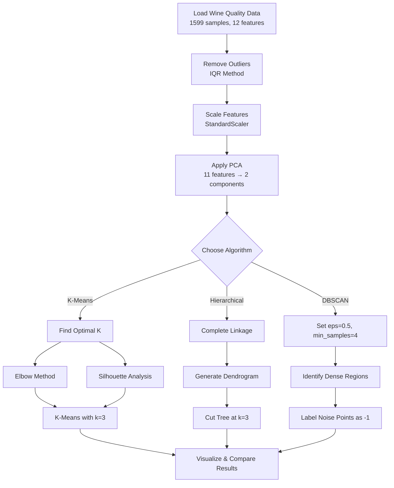
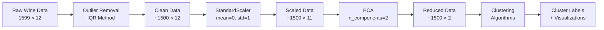

# Coding Guide: Assignment Solution - Wine Data Clustering

## Overview
This assignment applies clustering techniques to the **Wine Quality Dataset** (Red Wine). The goal is to group wines based on their chemical properties using unsupervised learning algorithms.

**Dataset**: Wine Quality - Red Wine (winequality-red.csv)
**Features**: 11 chemical properties + 1 quality rating
**Algorithms Used**: k-Means, Hierarchical Clustering, DBSCAN

---

## Section 1: Library Imports and Data Loading

### Code:
```python
import numpy as np
import pandas as pd
import matplotlib.pyplot as plt
import seaborn as sns
from sklearn.decomposition import PCA
from sklearn.preprocessing import StandardScaler
%matplotlib inline

data = pd.read_csv("winequality-red.csv")
data.head()
```

### Dataset Features:
- **fixed_acidity**: Non-volatile acids (tartaric acid)
- **volatile_acidity**: Acetic acid content (high = vinegar taste)
- **citric_acid**: Adds freshness and flavor
- **residual_sugar**: Sugar remaining after fermentation
- **chlorides**: Salt content
- **free_sulfur_dioxide**: Free form of SO₂ (prevents microbial growth)
- **total_sulfur_dioxide**: Total SO₂ (free + bound)
- **density**: Density of wine (depends on alcohol and sugar)
- **pH**: Acidity level (0-14 scale)
- **sulphates**: Wine additive (antimicrobial and antioxidant)
- **alcohol**: Alcohol percentage
- **quality**: Quality rating (3-8, target variable but not used in clustering)

---

## Section 2: Data Preprocessing

### Step 2.1: Summary Statistics
```python
data.describe()
```

**Key Observations**:
- 1599 wine samples
- Different features have vastly different scales
- Some features show large ranges (e.g., residual_sugar: 0.9 to 15.5)
- Scaling will be essential for distance-based clustering

### Step 2.2: Remove Outliers Using IQR Method
```python
def detect_outliers_iqr(df, columns):
    """Detect outliers using the Interquartile Range (IQR) method"""
    outlier_indices = []
    
    for col in columns:
        Q1 = df[col].quantile(0.25)  # 25th percentile
        Q3 = df[col].quantile(0.75)  # 75th percentile
        IQR = Q3 - Q1  # Interquartile Range
        
        lower_bound = Q1 - 1.5 * IQR
        upper_bound = Q3 + 1.5 * IQR
        
        outlier_list = df[(df[col] < lower_bound) | (df[col] > upper_bound)].index
        outlier_indices.extend(outlier_list)
    
    return list(set(outlier_indices))

numeric_cols = data.select_dtypes(include=[np.number]).columns.tolist()
outlier_indices = detect_outliers_iqr(data, numeric_cols)
data_clean = data.drop(outlier_indices).reset_index(drop=True)
```

### Explanation:
- **IQR Method**: Alternative to Z-score for outlier detection
  - **Q1 (25th percentile)**: 25% of data is below this value
  - **Q3 (75th percentile)**: 75% of data is below this value
  - **IQR = Q3 - Q1**: Range containing middle 50% of data
  - **Lower Bound = Q1 - 1.5 × IQR**: Values below are outliers
  - **Upper Bound = Q3 + 1.5 × IQR**: Values above are outliers
- **Why 1.5?**: Standard multiplier (Tukey's method), more conservative than Z-score
- **select_dtypes(include=[np.number])**: Selects only numeric columns
- **set()**: Removes duplicate indices
- **reset_index(drop=True)**: Resets row indices after dropping rows

### Step 2.3: Feature Scaling
```python
from sklearn.preprocessing import StandardScaler

X = outliers_removed.drop('quality', axis=1)

scaler = StandardScaler()
X_scaled = scaler.fit_transform(X)
```

### Explanation:
- **drop('quality', axis=1)**: Removes quality column (target variable not used in clustering)
- **StandardScaler()**: Standardizes features to mean=0, std=1
- **fit_transform()**: Learns scaling parameters and applies transformation
- **Why scaling?**: Wine features have different units and scales (pH: 2-4, alcohol: 8-15%, sulfur dioxide: 1-289)
  - Without scaling, features with larger values dominate distance calculations
  - Clustering algorithms are distance-based and sensitive to feature scales

### Step 2.4: Dimensionality Reduction with PCA
```python
from sklearn.decomposition import PCA
import matplotlib.pyplot as plt

pca = PCA(n_components=2)
X_pca = pca.fit_transform(X_scaled)

plt.scatter(X_pca[:, 0], X_pca[:, 1], alpha=0.5)
plt.title("PCA-Reduced Wine Data")
plt.xlabel("PCA Component 1")
plt.ylabel("PCA Component 2")
plt.show()
```

### Explanation:
- **PCA(n_components=2)**: Reduces 11 features to 2 principal components
- **Why 2 components?**: Allows visualization in 2D scatter plot
- **fit_transform()**: Learns PCA transformation and applies it
- **alpha=0.5**: Sets transparency for overlapping points
- **Purpose**: 
  - Visualize high-dimensional data in 2D
  - Reduce computational complexity
  - Remove correlated features

---

## Section 3: K-Means Clustering

### Step 3.1: Initial K-Means with Arbitrary K
```python
from sklearn.cluster import KMeans
from sklearn.metrics import silhouette_score

kmeans = KMeans(n_clusters=5, max_iter=1000, random_state=123)
kmeans.fit(X_pca)
```

### Explanation:
- **n_clusters=5**: Arbitrary choice of 5 clusters (will optimize later)
- **max_iter=1000**: Maximum iterations before stopping (prevents infinite loops)
- **random_state=123**: Sets random seed for reproducible results
- **fit()**: Trains k-means on PCA-transformed data
- **labels_**: Array of cluster assignments (0, 1, 2, 3, 4)

### Step 3.2: Finding Optimal K - Elbow Method
```python
inertia = []
K_range = range(1, 11)

for k in K_range:
    kmeans = KMeans(n_clusters=k, random_state=42)
    kmeans.fit(X_scaled)
    inertia.append(kmeans.inertia_)

plt.plot(K_range, inertia, marker='o')
plt.title('Elbow Method')
plt.xlabel('Number of Clusters')
plt.ylabel('Inertia')
plt.show()
```

### Explanation:
- **inertia_**: Sum of squared distances from points to their cluster centroids
  - Formula: Σ(distance from point to its centroid)²
  - Lower inertia = tighter clusters
- **Elbow Method**: Look for point where inertia decrease slows (forms an "elbow")
- **Note**: Uses X_scaled (not X_pca) for more accurate inertia calculation
- **Interpretation**: From the plot, k=3 appears to be the elbow point

### Step 3.3: Finding Optimal K - Silhouette Analysis
```python
range_n_clusters = [2, 3, 4, 5, 6, 7, 8, 9, 10]

for num_clusters in range_n_clusters:
    kmeans = KMeans(n_clusters=num_clusters, max_iter=1000)
    kmeans.fit(X_pca)
    
    cluster_labels = kmeans.labels_
    silhouette_avg = silhouette_score(X_pca, cluster_labels)
    
    print(f"For n_clusters={num_clusters}, the silhouette score is {silhouette_avg}")
```

### Explanation:
- **silhouette_score()**: Measures cluster quality
  - Range: -1 to 1 (higher is better)
  - Measures how similar points are to their own cluster vs other clusters
- **Why start from 2?**: Need at least 2 clusters for silhouette score
- **Interpretation**: k=3 shows highest silhouette score, confirming elbow method

### Step 3.4: Final K-Means Model
```python
kmeans = KMeans(n_clusters=3, max_iter=1000, random_state=123)
kmeans.fit(X_pca)

X_pca_df = pd.DataFrame(X_pca, columns=['PC1', 'PC2'])
X_pca_df['K_Means_Cluster_ID'] = kmeans.labels_
```

### Explanation:
- **n_clusters=3**: Optimal k determined from elbow and silhouette analysis
- **Creating DataFrame**: Combines PCA components with cluster labels for visualization
- **Purpose**: Easier to plot and analyze results

### Step 3.5: Visualization
```python
plt.figure(figsize=(12, 6), dpi=100)
sns.scatterplot(x='PC1', y='PC2', data=X_pca_df, hue='K_Means_Cluster_ID')
plt.show()
```

### Explanation:
- **figsize=(12, 6)**: Sets plot size in inches
- **dpi=100**: Dots per inch (resolution)
- **hue='K_Means_Cluster_ID'**: Colors points by cluster assignment
- **Interpretation**:
  - Clusters are fairly well-separated along PC1 and PC2
  - Roughly spherical clusters (expected for k-means)
  - Some overlap between Cluster 0 and Cluster 1
  - Similar cluster sizes

---

## Section 4: Hierarchical Clustering

### Step 4.1: Complete Linkage Clustering
```python
from scipy.cluster.hierarchy import linkage, dendrogram, cut_tree

cl_mergings = linkage(X_scaled, method="complete", metric='euclidean')

dendrogram(cl_mergings)
plt.show()
```

### Explanation:
- **linkage()**: Performs hierarchical clustering
  - **X_scaled**: Uses scaled original features (not PCA)
  - **method="complete"**: Uses complete linkage (maximum distance between clusters)
  - **metric='euclidean'**: Distance metric
- **dendrogram()**: Visualizes hierarchical clustering as tree
  - Height = distance at which clusters merge
  - Horizontal cuts = different cluster counts
- **Complete Linkage**: Distance between clusters = maximum distance between any two points
  - Creates compact, spherical clusters
  - Less sensitive to outliers than single linkage

### Step 4.2: Cutting the Dendrogram
```python
cl_cluster_labels = cut_tree(cl_mergings, n_clusters=3).reshape(-1, )
```

### Explanation:
- **cut_tree()**: Cuts dendrogram to create fixed number of clusters
  - **n_clusters=3**: Matches k-means for comparison
- **reshape(-1, )**: Flattens 2D array to 1D array of cluster labels
  - -1 means "infer dimension automatically"
  - Result: [0, 1, 2, 0, 1, ...] for each wine sample

### Step 4.3: Visualization
```python
X_pca_df = pd.DataFrame(X_pca, columns=['PC1', 'PC2'])
X_pca_df['Hierarchical_Cluster_Labels'] = cl_cluster_labels

plt.figure(figsize=(12, 6), dpi=100)
sns.scatterplot(x='PC1', y='PC2', data=X_pca_df, hue='Hierarchical_Cluster_Labels')
plt.show()
```

### Explanation:
- **Interpretation**:
  - Clusters are more elongated and less compact than k-means
  - More overlap between clusters (especially in center)
  - Less spherical boundaries
  - Hierarchical clustering merges based on linkage criteria, not centroid distance
  - May identify different cluster structures than k-means

---

## Section 5: DBSCAN (Density-Based Clustering)

### Step 5.1: Applying DBSCAN
```python
from sklearn.cluster import DBSCAN

dbscan = DBSCAN(eps=0.5, min_samples=4)
dbscan.fit(X_pca)
```

### Explanation:
- **eps=0.5**: Maximum distance between two points to be neighbors
  - Critical parameter: too small = many noise points, too large = everything in one cluster
  - Requires experimentation or domain knowledge
- **min_samples=4**: Minimum points needed to form dense region
  - Rule of thumb: min_samples ≥ dimensions + 1
  - Here: 2 dimensions (PCA) + 1 = 3, so 4 is reasonable
- **fit()**: Applies DBSCAN algorithm
- **labels_**: Cluster assignments
  - **-1**: Noise/outlier points (not in any cluster)
  - **0, 1, 2, ...**: Cluster IDs

### Step 5.2: Evaluation
```python
silhouette_avg = silhouette_score(X_pca, dbscan.labels_)
print(silhouette_avg)
```

### Explanation:
- **Note**: Silhouette score may be affected by noise points (-1 labels)
- Some implementations exclude noise points from calculation
- Lower score doesn't necessarily mean bad clustering if outliers are correctly identified

### Step 5.3: Visualization
```python
X_pca_final_df = pd.DataFrame(X_pca, columns=['PC1', 'PC2'])
X_pca_final_df['DBSCAN_Cluster_ID'] = dbscan.labels_

plt.figure(figsize=(12, 6), dpi=100)
sns.scatterplot(x='PC1', y='PC2', data=X_pca_final_df, hue='DBSCAN_Cluster_ID')
plt.show()
```

### Explanation:
- **Interpretation**:
  - Points labeled -1 are noise/outliers (shown in different color)
  - Main cluster (cluster 0) forms dense core
  - Scattered outliers around edges
  - DBSCAN successfully filters noise
  - Fewer distinct clusters than k-means or hierarchical
  - Good for identifying core dense regions and anomalies

---

## Key Differences Between Algorithms on Wine Data

### K-Means Results:
- **Clusters**: 3 well-separated, spherical clusters
- **Strengths**: Clear boundaries, balanced cluster sizes
- **Weaknesses**: Some overlap between clusters 0 and 1
- **Best for**: When you know number of wine quality groups

### Hierarchical Clustering Results:
- **Clusters**: 3 elongated, overlapping clusters
- **Strengths**: Shows hierarchical relationships between wines
- **Weaknesses**: Less compact, more overlap
- **Best for**: Understanding wine similarity hierarchy

### DBSCAN Results:
- **Clusters**: 1-2 main dense clusters + noise points
- **Strengths**: Identifies outlier wines, arbitrary shapes
- **Weaknesses**: Sensitive to eps parameter, fewer distinct groups
- **Best for**: Finding typical wines and detecting unusual samples

---

## Algorithm Comparison Summary

| Aspect | K-Means | Hierarchical | DBSCAN |
|--------|---------|--------------|--------|
| Number of Clusters | Must specify (k=3) | Must specify (k=3) | Automatic |
| Cluster Shape | Spherical | Flexible | Arbitrary |
| Outlier Handling | Assigns all points | Assigns all points | Labels as noise (-1) |
| Computational Cost | Fast | Slower | Medium |
| Best Use Case | Known wine categories | Wine similarity tree | Outlier detection |

---

## Workflow Diagram



---

## Data Flow Diagram



---

## Key Takeaways

1. **Data Preprocessing is Critical**:
   - Outlier removal improves cluster quality
   - Scaling ensures all features contribute equally
   - PCA enables visualization and reduces noise

2. **Multiple Methods for Optimal K**:
   - Elbow method: Visual inspection of inertia
   - Silhouette analysis: Quantitative cluster quality
   - Both suggested k=3 for wine data

3. **Algorithm Selection Matters**:
   - K-means: Fast, requires k, spherical clusters
   - Hierarchical: Shows relationships, flexible shapes
   - DBSCAN: Finds outliers, no k needed, density-based

4. **Wine Quality Insights**:
   - Wines naturally group into 3 quality categories
   - Some wines are outliers (unusual chemical properties)
   - Chemical properties correlate with quality groupings

5. **Practical Considerations**:
   - Always validate with multiple metrics
   - Visualize results when possible
   - Consider domain knowledge (wine experts' input)
   - Different algorithms reveal different patterns

---

This coding guide provides a comprehensive understanding of applying clustering techniques to real-world wine quality data, with detailed explanations suitable for someone new to Python and machine learning.

