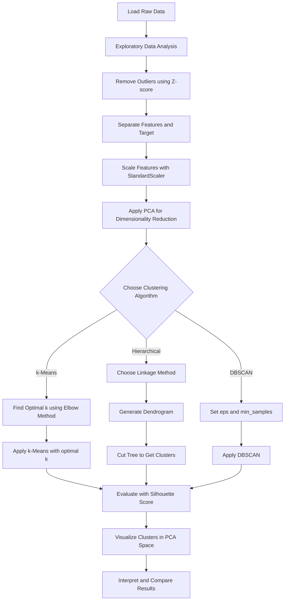
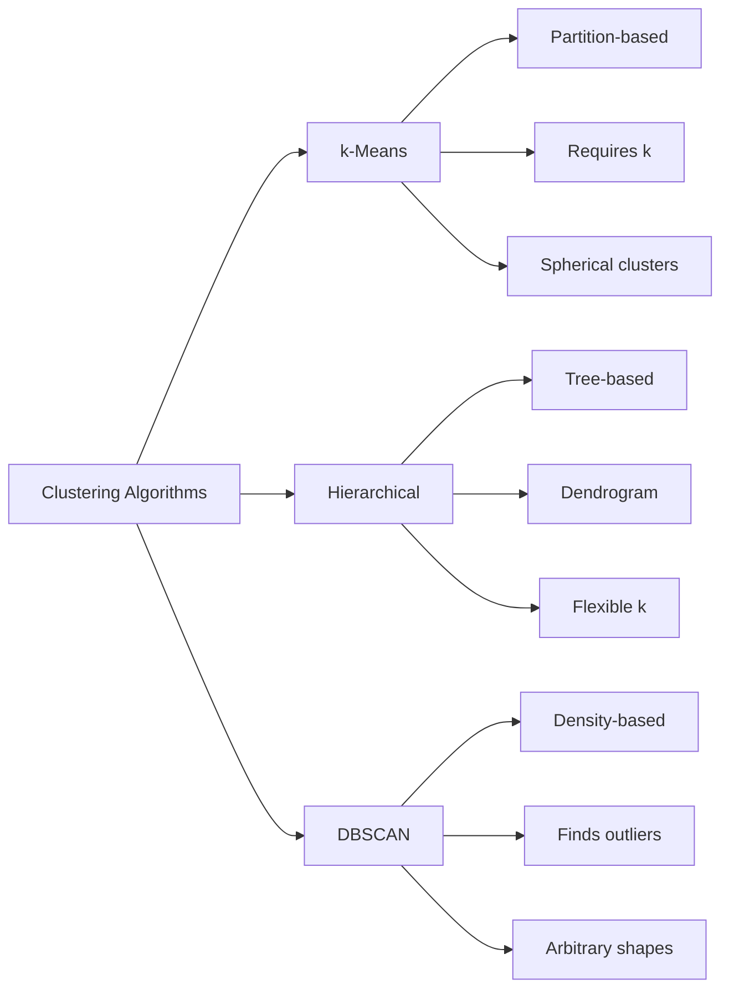
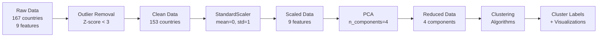

# Coding Guide: Week 17 - Unsupervised Machine Learning - 2

## Overview
This notebook covers advanced clustering techniques in unsupervised machine learning, specifically:
- **k-Means Clustering** - Partition-based clustering
- **Hierarchical Clustering** - Tree-based nested clustering
- **DBSCAN** - Density-based clustering with outlier detection

**Dataset**: Socio-Economic Data from various countries with features like child mortality, exports, health spending, GDP, etc.

---

## Section 1: Library Imports and Setup

### Code:
```python
import numpy as np
import pandas as pd
import matplotlib.pyplot as plt
import seaborn as sns
from sklearn.decomposition import PCA
from sklearn.preprocessing import StandardScaler
%matplotlib inline
```

### Explanation:
- **numpy (np)**: Numerical computing library for array operations and mathematical functions
- **pandas (pd)**: Data manipulation library for working with DataFrames (tabular data)
- **matplotlib.pyplot (plt)**: Plotting library for creating visualizations
- **seaborn (sns)**: Statistical visualization library built on matplotlib, provides better-looking plots
- **PCA (Principal Component Analysis)**: Dimensionality reduction technique from sklearn to reduce features while preserving variance
- **StandardScaler**: Scales features to have mean=0 and standard deviation=1, important for distance-based algorithms
- **%matplotlib inline**: Jupyter magic command to display plots directly in the notebook

### Warning Suppression:
```python
import warnings
warnings.filterwarnings("ignore")
```
- Suppresses warning messages to keep output clean during execution

---

## Section 2: Data Loading

### Code:
```python
country_data = pd.read_csv("https://raw.githubusercontent.com/curlsloth/IK_teaching/main/Country_socioeconomic-data.csv")
country_data.head()
```

### Explanation:
- **pd.read_csv()**: Reads CSV file from URL and creates a DataFrame
- **head()**: Displays first 5 rows to preview the data
- **Dataset columns**: country, child_mort, exports, health, imports, income, inflation, life_expec, total_fer, gdpp

---

## Section 3: Data Preprocessing

### Step 3.1: Exploratory Data Analysis
```python
country_data.describe()
```
- **describe()**: Shows statistical summary (count, mean, std, min, max, quartiles) for all numeric columns
- **Key Observation**: Large differences between max and 75th percentile indicate presence of outliers

### Step 3.2: Outlier Detection and Removal
```python
from scipy import stats

z = np.abs(stats.zscore(country_data[['child_mort', 'exports', 'health', 'imports', 
                                       'income', 'inflation', 'life_expec', 'total_fer', 'gdpp']]))

country_data_outliers_removed = country_data[(z<3).all(axis=1)]
```

### Explanation:
- **scipy.stats**: Statistical functions library
- **stats.zscore()**: Calculates Z-score (how many standard deviations away from mean)
  - Formula: z = (x - mean) / std
  - Z-score > 3 or < -3 typically indicates outliers
- **np.abs()**: Takes absolute value (we care about distance from mean, not direction)
- **(z<3).all(axis=1)**: 
  - Creates boolean mask where ALL columns have z-score < 3
  - axis=1 means check across columns for each row
  - Keeps only rows where all features are within 3 standard deviations
- **Result**: Reduced from 167 to 153 countries after removing extreme outliers

### Step 3.3: Feature Scaling
```python
X = country_data_outliers_removed.drop('country', axis=1)
y = country_data_outliers_removed['country']

scaler = StandardScaler()
X_scaled = scaler.fit_transform(X)
X_scaled_df = pd.DataFrame(X_scaled, columns=X.columns)
```

### Explanation:
- **drop('country', axis=1)**: Removes country name column (axis=1 means column)
  - X contains only numeric features for clustering
  - y contains country names for reference
- **StandardScaler()**: Creates scaler object
- **fit_transform()**: 
  - Calculates mean and std from data (fit)
  - Transforms data to have mean=0, std=1 (transform)
  - Formula: scaled_value = (value - mean) / std
- **Why scaling?**: Clustering algorithms use distance metrics. Features with larger scales (like GDP) would dominate smaller scales (like fertility rate) without scaling
- **pd.DataFrame()**: Converts scaled numpy array back to DataFrame with column names

### Step 3.4: Dimensionality Reduction with PCA
```python
pca_final = PCA(n_components=4)
X_pca_final = pca_final.fit_transform(X_scaled)
```

### Explanation:
- **PCA(n_components=4)**: Reduces 9 features to 4 principal components
- **Principal Components**: New features that are linear combinations of original features
  - PC1 captures most variance in data
  - PC2 captures second most variance (orthogonal to PC1)
  - And so on...
- **fit_transform()**: Learns PCA transformation and applies it
- **Why PCA?**: 
  - Reduces computational complexity
  - Removes multicollinearity (correlated features)
  - Helps visualize high-dimensional data
  - Can improve clustering by focusing on most important patterns

---

## Section 4: k-Means Clustering

### Algorithm Overview:
k-Means partitions data into k clusters by:
1. Randomly initializing k centroids
2. Assigning each point to nearest centroid
3. Recalculating centroids as mean of assigned points
4. Repeating steps 2-3 until convergence

### Step 4.1: Finding Optimal Number of Clusters (Elbow Method)
```python
from sklearn.cluster import KMeans

inertia = []
for k in range(2, 11):
    kmeans = KMeans(n_clusters=k, random_state=42, n_init=10)
    kmeans.fit(X_pca_final)
    inertia.append(kmeans.inertia_)

plt.plot(range(2, 11), inertia, marker='o')
plt.xlabel('Number of Clusters')
plt.ylabel('Inertia')
plt.title('Elbow Method')
plt.show()
```

### Explanation:
- **KMeans**: k-Means clustering algorithm from sklearn
- **n_clusters=k**: Number of clusters to form
- **random_state=42**: Sets random seed for reproducibility
- **n_init=10**: Number of times algorithm runs with different centroid initializations (best result is kept)
- **inertia_**: Sum of squared distances from each point to its assigned centroid
  - Lower inertia = tighter clusters
  - Formula: Σ(distance from point to its centroid)²
- **Elbow Method**: Plot inertia vs number of clusters
  - Look for "elbow" where inertia decrease slows down
  - That k value is optimal balance between cluster count and tightness

### Step 4.2: Applying k-Means
```python
kmeans_final = KMeans(n_clusters=4, random_state=42, n_init=10)
kmeans_final.fit(X_pca_final)
kmeans_labels = kmeans_final.labels_
```

### Explanation:
- **fit()**: Trains k-Means model on data
- **labels_**: Array of cluster assignments (0, 1, 2, 3) for each data point
- Each country is now assigned to one of 4 clusters

### Step 4.3: Evaluating with Silhouette Score
```python
from sklearn.metrics import silhouette_score

silhouette_avg = silhouette_score(X_pca_final, kmeans_labels)
print(f"Silhouette Score: {silhouette_avg}")
```

### Explanation:
- **silhouette_score()**: Measures how well-separated clusters are
  - Range: -1 to 1
  - **> 0.7**: Strong clustering
  - **0.5 to 0.7**: Reasonable clustering
  - **< 0.5**: Weak clustering, overlapping clusters
  - **Negative**: Points may be in wrong clusters
- **Formula**: (b - a) / max(a, b)
  - a = average distance to points in same cluster
  - b = average distance to points in nearest different cluster

### Step 4.4: Visualization
```python
X_pca_final_df = pd.DataFrame(X_pca_final, columns=['PC1', 'PC2', 'PC3', 'PC4'])
X_pca_final_df['KMeans_Cluster'] = kmeans_labels

plt.figure(figsize=(10, 6))
sns.scatterplot(x='PC1', y='PC2', data=X_pca_final_df, hue='KMeans_Cluster', palette='viridis')
plt.title('k-Means Clustering Results')
plt.show()
```

### Explanation:
- Creates DataFrame with PCA components and cluster labels
- **scatterplot()**: Plots PC1 vs PC2 with different colors for each cluster
- **hue='KMeans_Cluster'**: Colors points by cluster assignment
- **palette='viridis'**: Color scheme for clusters
- Visualizes cluster separation in 2D space (first two principal components)

---

## Section 5: Hierarchical Clustering

### Algorithm Overview:
Hierarchical clustering builds a tree (dendrogram) of clusters:
- **Agglomerative (Bottom-up)**: Starts with each point as a cluster, merges closest pairs
- **Divisive (Top-down)**: Starts with one cluster, recursively splits

### Step 5.1: Understanding Linkage Methods
```python
from scipy.cluster.hierarchy import linkage, dendrogram, cut_tree
```

### Linkage Methods:
- **Single Linkage**: Distance between closest points of two clusters
  - Tends to create long, chain-like clusters
- **Complete Linkage**: Distance between farthest points of two clusters
  - Creates more compact, spherical clusters
- **Average Linkage**: Average distance between all pairs of points
- **Ward Linkage**: Minimizes variance within clusters (most commonly used)

### Step 5.2: Single Linkage Clustering
```python
sl_mergings = linkage(X_scaled_df, method="single", metric='euclidean')

plt.figure(figsize=(15, 8))
dendrogram(sl_mergings)
plt.title('Dendrogram - Single Linkage')
plt.xlabel('Data Points')
plt.ylabel('Distance')
plt.show()
```

### Explanation:
- **linkage()**: Performs hierarchical clustering
  - **X_scaled_df**: Uses scaled original features (not PCA)
  - **method="single"**: Uses single linkage
  - **metric='euclidean'**: Uses Euclidean distance formula: √(Σ(x₁-x₂)²)
- **Returns**: Linkage matrix showing merge history
- **dendrogram()**: Visualizes hierarchical clustering as tree
  - Height of branches = distance at which clusters merge
  - Horizontal line cuts = different cluster counts
  - Longer vertical lines = more distinct clusters

### Step 5.3: Complete Linkage Clustering
```python
cl_mergings = linkage(X_scaled_df, method="complete", metric='euclidean')

plt.figure(figsize=(15, 8))
dendrogram(cl_mergings)
plt.title('Dendrogram - Complete Linkage')
plt.show()
```

### Explanation:
- Same as single linkage but uses **complete** method
- Complete linkage typically produces more balanced, compact clusters
- Dendrogram will look different - shows different merge patterns

### Step 5.4: Extracting Cluster Labels
```python
sl_cluster_labels = cut_tree(sl_mergings, n_clusters=4).reshape(-1, )
cl_cluster_labels = cut_tree(cl_mergings, n_clusters=4).reshape(-1, )
```

### Explanation:
- **cut_tree()**: Cuts dendrogram to create fixed number of clusters
  - **n_clusters=4**: Specifies we want 4 clusters
  - Finds horizontal cut line that produces exactly 4 clusters
- **reshape(-1, )**: Flattens 2D array to 1D array of cluster labels
  - -1 means "infer this dimension"
  - Result: [0, 1, 2, 3, 1, 0, ...] for each data point

### Step 5.5: Visualization and Comparison
```python
X_pca_final_df = pd.DataFrame(X_pca_final, columns=['PC1', 'PC2', 'PC3', 'PC4'])
X_pca_final_df['Hierarchical_Cluster_Labels'] = cl_cluster_labels

plt.figure(figsize=(10, 4), dpi=100)
sns.scatterplot(x='PC1', y='PC2', data=X_pca_final_df, hue='Hierarchical_Cluster_Labels')
plt.title('Hierarchical Clustering - Complete Linkage')
plt.show()
```

### Explanation:
- Visualizes hierarchical clustering results in PCA space
- Can compare with k-Means results to see differences in cluster assignments
- Different linkage methods may produce different cluster structures

---

## Section 6: DBSCAN (Density-Based Clustering)

### Algorithm Overview:
DBSCAN identifies clusters based on density:
- **Core Points**: Points with at least MinPts neighbors within radius ε
- **Border Points**: Within ε of core point but have fewer than MinPts neighbors
- **Noise Points**: Not core or border points (labeled as -1)

### Key Advantages:
- No need to specify number of clusters beforehand
- Can find arbitrarily shaped clusters
- Automatically identifies outliers as noise

### Step 6.1: Import and Initialize
```python
from sklearn.cluster import DBSCAN
from sklearn.metrics import silhouette_score

dbscan = DBSCAN(eps=1.2, min_samples=4)
dbscan.fit(X_pca_final)
```

### Explanation:
- **eps=1.2**: Maximum distance between two points to be considered neighbors
  - Smaller eps = smaller, denser clusters
  - Larger eps = larger clusters, more points included
  - **Critical parameter**: Needs tuning based on data
- **min_samples=4**: Minimum points needed to form a dense region (cluster)
  - Higher value = denser clusters required
  - Lower value = more lenient cluster formation
  - Rule of thumb: min_samples ≥ dimensions + 1
- **fit()**: Applies DBSCAN algorithm to find clusters

### Step 6.2: Examining Cluster Labels
```python
dbscan.labels_
```

### Explanation:
- **labels_**: Array of cluster assignments
  - **-1**: Noise/outlier points (not assigned to any cluster)
  - **0, 1, 2, ...**: Cluster IDs
- Unlike k-Means, DBSCAN can have varying number of clusters
- Number of clusters is determined by data density, not pre-specified

### Step 6.3: Evaluation
```python
silhouette_avg = silhouette_score(X_pca_final, dbscan.labels_)
print(silhouette_avg)
```

### Explanation:
- Calculates silhouette score for DBSCAN clusters
- **Note**: Silhouette score may be lower if many noise points exist
- Noise points (-1) are excluded from silhouette calculation in some implementations

### Step 6.4: Visualization
```python
X_pca_final_df = pd.DataFrame(X_pca_final, columns=['PC1', 'PC2', 'PC3', 'PC4'])
X_pca_final_df['DBSCAN_Cluster_ID'] = dbscan.labels_

plt.figure(figsize=(10, 4), dpi=100)
sns.scatterplot(x='PC1', y='PC2', data=X_pca_final_df, hue='DBSCAN_Cluster_ID', palette='viridis')
plt.title('DBSCAN Clustering Results')
plt.show()
```

### Explanation:
- Visualizes DBSCAN results
- Points labeled -1 (noise) will appear in different color
- Can see which countries are considered outliers
- Cluster shapes may be non-spherical (unlike k-Means)

---

## Key Concepts Summary

### 1. When to Use Each Algorithm:

**k-Means**:
- ✅ When you know number of clusters
- ✅ Clusters are roughly spherical and similar size
- ✅ Large datasets (computationally efficient)
- ❌ Sensitive to outliers
- ❌ Assumes clusters are convex and isotropic

**Hierarchical Clustering**:
- ✅ Want to see cluster hierarchy
- ✅ Don't know number of clusters (can decide later)
- ✅ Small to medium datasets
- ❌ Computationally expensive for large datasets
- ❌ Sensitive to noise and outliers

**DBSCAN**:
- ✅ Clusters have arbitrary shapes
- ✅ Need to identify outliers
- ✅ Don't know number of clusters
- ❌ Sensitive to parameter selection (eps, min_samples)
- ❌ Struggles with varying density clusters

### 2. Important Parameters:

| Algorithm | Key Parameters | How to Choose |
|-----------|---------------|---------------|
| k-Means | n_clusters | Elbow method, Silhouette analysis |
| Hierarchical | linkage method, n_clusters | Dendrogram analysis |
| DBSCAN | eps, min_samples | k-distance graph, domain knowledge |

### 3. Evaluation Metrics:

- **Inertia**: Lower is better (k-Means specific)
- **Silhouette Score**: -1 to 1, higher is better
- **Visual Inspection**: Always plot results!

---

## Common Pitfalls and Tips

1. **Always scale your data** before clustering (except for tree-based methods)
2. **Remove outliers** before k-Means and Hierarchical clustering
3. **Try multiple algorithms** and compare results
4. **Validate clusters** with domain knowledge
5. **PCA helps** with visualization but may lose some information
6. **Random state** ensures reproducibility in k-Means
7. **DBSCAN parameters** require experimentation - no one-size-fits-all

---

## Workflow Diagram



---

## Algorithm Comparison Diagram



---

## Data Flow Diagram



This coding guide provides a comprehensive understanding of the clustering techniques covered in Week 17, with detailed explanations of each step, parameter, and concept.
