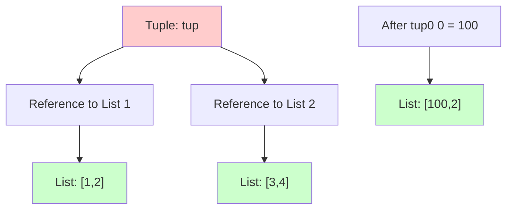
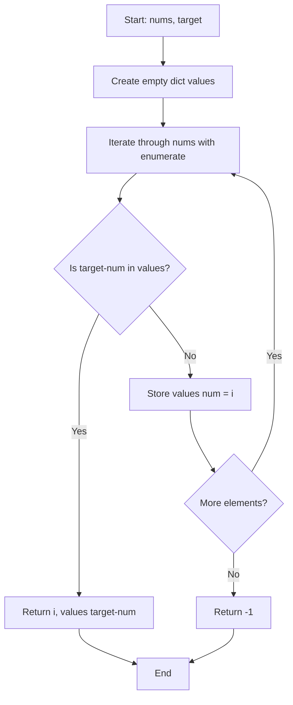
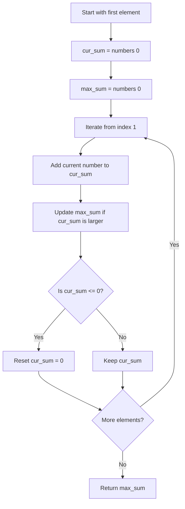

# IK Week 2 - Python Fundamentals Coding Guide

## Overview
This notebook covers intermediate Python concepts focusing on tuples, sets, dictionaries, and their practical applications in solving common programming problems. It demonstrates immutability, memory efficiency, and algorithmic problem-solving techniques.

---

## Table of Contents
1. [Tuples - Immutability Demonstration](#tuples---immutability-demonstration)
2. [Tuple Packing and Unpacking](#tuple-packing-and-unpacking)
3. [Nested Mutable Objects in Tuples](#nested-mutable-objects-in-tuples)
4. [Memory Comparison: Tuple vs List vs Set](#memory-comparison-tuple-vs-list-vs-set)
5. [Sets and Hashability](#sets-and-hashability)
6. [Problem Solving with Dictionaries and Sets](#problem-solving-with-dictionaries-and-sets)

---

## 1. Tuples - Immutability Demonstration

### Code Block 1: Tuple Immutability
```python
tuple_a = (1,2,3,"hello",3,4)
print(tuple_a)
tuple_a[2] = "sakshi"  # This will raise TypeError
```

**What's Happening:**
- **Tuple Creation**: `tuple_a` is created with mixed data types (integers and string)
- **Immutability**: Attempting to modify `tuple_a[2]` raises a `TypeError` because tuples are immutable
- **Key Concept**: Once a tuple is created, you cannot change, add, or remove its elements

**Why This Matters:**
- Tuples are used when you want to ensure data integrity
- They're safer for storing constants or configuration values
- They can be used as dictionary keys (unlike lists)

---

## 2. Tuple Packing and Unpacking

### Code Block 2: Packing and Unpacking
```python
t = (1,2,3)  # packing
x,y,z = t    # unpacking
print(t)
print(x,y,z)
```

**What's Happening:**
- **Packing**: Creating a tuple by grouping values together: `t = (1,2,3)`
- **Unpacking**: Extracting tuple values into separate variables: `x,y,z = t`
- **Result**: `x=1`, `y=2`, `z=3`

**Syntax Details:**
- Number of variables on the left must match the number of elements in the tuple
- This is a Pythonic way to assign multiple variables in one line

**Common Use Cases:**
- Returning multiple values from a function
- Swapping variables: `a, b = b, a`
- Iterating with enumerate: `for index, value in enumerate(list)`

---

## 3. Nested Mutable Objects in Tuples

### Code Block 3: Tuple with Lists
```python
tup = ([1,2],[3,4])
tup[0][0] = 100  # works - modifying list inside tuple
tup[0] = [5,6]   # throws error - trying to reassign tuple element
```

**What's Happening:**
- **Tuple Structure**: Contains two lists as elements
- **Line 2 Works**: `tup[0][0] = 100` modifies the content of the list (which is mutable)
  - The tuple still points to the same list object
  - We're changing the list's internal data, not the tuple's reference
- **Line 3 Fails**: `tup[0] = [5,6]` tries to change what the tuple points to
  - This violates tuple immutability

**Key Concept:**
- Tuples store references to objects, not the objects themselves
- If the referenced object is mutable (like a list), its contents can change
- But you cannot change which object the tuple references



---

## 4. Memory Comparison: Tuple vs List vs Set

### Code Block 4 & 5: Memory Size Comparison
```python
import sys
a_tuple = (1,2,3,4,5)
a_list = [1,2,3,4,5]
a_set = {1,2,3,4,5}
print(sys.getsizeof(a_tuple))  # 80 bytes
print(sys.getsizeof(a_list))   # 104 bytes
print(sys.getsizeof(a_set))    # 472 bytes
```

**Import Explanation:**
- **`sys` module**: Provides access to system-specific parameters and functions
- **`sys.getsizeof()`**: Returns the size of an object in bytes (memory footprint)

**What's Happening:**
- Tuples are most memory-efficient (80 bytes)
- Lists use more memory (104 bytes) due to dynamic resizing capabilities
- Sets use significantly more memory (472 bytes) due to hash table implementation

**Why These Differences:**
- **Tuples**: Fixed size, no overhead for growth
- **Lists**: Need extra space for potential growth (over-allocation)
- **Sets**: Use hash tables for O(1) lookup, requiring more memory

**When to Use Each:**
- **Tuple**: When data won't change and memory is a concern
- **List**: When you need to modify data frequently
- **Set**: When you need fast membership testing and uniqueness

---

## 5. Sets and Hashability

### Code Block 6 & 7: Hashable vs Unhashable Types
```python
# This fails
b_set = {[1,2], 3, 4}  # TypeError: unhashable type: 'list'

# This works
c_set = {(1,2), 3, 4}  # Works fine with tuple
```

**What's Happening:**
- **Hashable Requirement**: Set elements must be hashable (immutable)
- **Lists are Unhashable**: Lists can change, so they can't be hashed
- **Tuples are Hashable**: Tuples are immutable, so they can be hashed

**Key Concept - Hashing:**
- Hash function converts an object to a fixed-size integer (hash value)
- Mutable objects can't be hashed because their hash would change if modified
- Sets use hash values for fast O(1) lookup

**Hashable Types:**
- ✅ int, float, str, tuple (if all elements are hashable)
- ❌ list, dict, set

---

## 6. Problem Solving with Dictionaries and Sets

### Problem 1: Two Sum
```python
def two_sum(nums, target):
    values = {}
    for i, num in enumerate(nums):
        if target - num in values:
            return i, values[target-num]
        values[num] = i
    return -1
```

**Function Breakdown:**
- **Purpose**: Find two numbers in array that sum to target
- **Parameters**:
  - `nums`: List of integers
  - `target`: Target sum value
- **Returns**: Tuple of indices (current index, previous index)

**Algorithm Steps:**
1. Create empty dictionary `values` to store {number: index}
2. **`enumerate(nums)`**: Returns pairs of (index, value) while iterating
3. For each number, check if `target - num` exists in dictionary
4. If found: return current index and stored index
5. If not found: store current number and its index
6. Return -1 if no pair found

**Time Complexity**: O(n) - single pass through array
**Space Complexity**: O(n) - dictionary storage

**Example Walkthrough:**
```
nums = [2,7,11,15], target = 9

Iteration 1: i=0, num=2
  - Check: 9-2=7 in values? No
  - Store: values = {2: 0}

Iteration 2: i=1, num=7
  - Check: 9-7=2 in values? Yes!
  - Return: (1, 0)
```



---

### Problem 2: Majority Element
```python
def majority_element(nums):
    counts = {}
    target = int(len(nums)/2)
    for num in nums:
        if num in counts:
            counts[num] += 1
        else:
            counts[num] = 1
        if counts[num] >= target:
            return num
    return 0
```

**Function Breakdown:**
- **Purpose**: Find element that appears more than n/2 times
- **Parameters**: `nums` - list of integers
- **Returns**: The majority element

**Algorithm Steps:**
1. Create dictionary `counts` to track frequency of each number
2. Calculate `target` as half the array length
3. For each number:
   - Increment its count (or initialize to 1)
   - Check if count reaches target threshold
   - Return immediately if majority found
4. Return 0 if no majority element

**Optimization**: Early return when majority is found (no need to process remaining elements)

**Example:**
```
nums = [3, 3, 3, 2, 2, 2, 3]
target = 7/2 = 3

After processing:
counts = {3: 4, 2: 3}
Returns: 3 (appears 4 times >= 3)
```

---

### Problem 3: Array Intersection
```python
def get_intersection(numbers1, numbers2):
    sorted_intersection = []
    included_set = set()
    pointer1, pointer2 = 0, 0
    
    while pointer1 < len(numbers1) and pointer2 < len(numbers2):
        if numbers1[pointer1] == numbers2[pointer2]:
            if numbers1[pointer1] not in included_set:
                included_set.add(numbers1[pointer1])
                sorted_intersection.append(numbers1[pointer1])
            pointer1 += 1
            pointer2 += 1
        elif numbers1[pointer1] < numbers2[pointer2]:
            pointer1 += 1
        else:
            pointer2 += 1
    
    if len(sorted_intersection) == 0:
        return [-1]
    
    return sorted_intersection
```

**Function Breakdown:**
- **Purpose**: Find common elements in two sorted arrays (without duplicates)
- **Parameters**: Two sorted lists of integers
- **Returns**: List of common elements or [-1] if none

**Algorithm - Two Pointer Technique:**
1. Initialize two pointers at start of each array
2. **`included_set`**: Tracks elements already added (prevents duplicates)
3. Compare elements at both pointers:
   - **Equal**: Add to result (if not already included), move both pointers
   - **First smaller**: Move pointer1 forward
   - **Second smaller**: Move pointer2 forward

**Why Two Pointers Work:**
- Arrays are sorted, so we can skip elements efficiently
- Time Complexity: O(n + m) where n, m are array lengths
- Space Complexity: O(k) where k is number of unique intersections

**Example:**
```
numbers1 = [1, 2, 2, 6, 7]
numbers2 = [2, 2, 7, 7]

Step-by-step:
p1=0, p2=0: 1 < 2 → p1++
p1=1, p2=0: 2 == 2 → add 2, p1++, p2++
p1=2, p2=1: 2 == 2 → already in set, p1++, p2++
p1=3, p2=2: 6 < 7 → p1++
p1=4, p2=2: 7 == 7 → add 7, p1++, p2++

Result: [2, 7]
```

---

### Problem 4: Single Number
```python
def single_number(arr):
    visited = set()
    for num in arr:
        if num in visited:
            visited.remove(num)
        else:
            visited.add(num)
    return visited.pop()
```

**Function Breakdown:**
- **Purpose**: Find the element that appears only once (all others appear twice)
- **Parameters**: `arr` - list where every element appears twice except one
- **Returns**: The unique element

**Algorithm - Set Toggle:**
1. Use set to track "currently unpaired" numbers
2. For each number:
   - If in set: remove it (found its pair)
   - If not in set: add it (first occurrence)
3. At the end, only the unpaired number remains
4. **`pop()`**: Removes and returns an arbitrary element from the set

**Why This Works:**
- Paired numbers cancel each other out
- Only the single number remains in the set

**Example:**
```
arr = [2, 3, 2, 4, 4]

Process:
num=2: visited = {2}
num=3: visited = {2, 3}
num=2: visited = {3}      (removed 2)
num=4: visited = {3, 4}
num=4: visited = {3}      (removed 4)

Return: 3
```

---

### Problem 5: Sorted Array of Squares
```python
def generate_sorted_array_of_squares(numbers):
    return list(map(lambda x: x*x, numbers))
```

**Function Breakdown:**
- **Purpose**: Square each element in the array
- **Parameters**: `numbers` - list of integers
- **Returns**: List of squared values

**Key Concepts:**
- **`map(function, iterable)`**: Applies function to every item in iterable
- **`lambda x: x*x`**: Anonymous function that squares input
  - Syntax: `lambda arguments: expression`
  - Equivalent to: `def square(x): return x*x`
- **`list()`**: Converts map object to list

**Why Use Lambda:**
- Concise for simple operations
- No need to define a separate function
- Functional programming style

**Alternative Approaches:**
```python
# List comprehension (more Pythonic)
[x*x for x in numbers]

# Using ** operator
[x**2 for x in numbers]

# Regular function
def square(x):
    return x*x
list(map(square, numbers))
```

---

### Problem 6: Maximum Sum Subarray (Kadane's Algorithm)
```python
def find_maximum_sum_subarray(numbers):
    cur_sum, max_sum = numbers[0], numbers[0]
    current_end = 1
    
    while current_end < len(numbers):
        cur_sum += numbers[current_end]
        max_sum = max(cur_sum, max_sum)
        if cur_sum <= 0:
            cur_sum = 0
        current_end += 1
    
    return max_sum
```

**Function Breakdown:**
- **Purpose**: Find the contiguous subarray with the largest sum
- **Parameters**: `numbers` - list of integers (can be negative)
- **Returns**: Maximum sum value

**Algorithm - Kadane's Algorithm:**
1. Initialize `cur_sum` and `max_sum` with first element
2. Iterate through remaining elements:
   - Add current element to `cur_sum`
   - Update `max_sum` if `cur_sum` is larger
   - **Key Logic**: If `cur_sum` becomes negative or zero, reset to 0
     - Negative sums won't help future subarrays
3. Return the maximum sum found

**Why Reset to 0:**
- A negative running sum will only decrease future sums
- Better to start fresh from the next element

**Time Complexity**: O(n) - single pass
**Space Complexity**: O(1) - only two variables

**Example:**
```
numbers = [2, -6, 3, 4, -5]

Step-by-step:
Start: cur_sum=2, max_sum=2

i=1, num=-6:
  cur_sum = 2 + (-6) = -4
  max_sum = max(-4, 2) = 2
  cur_sum <= 0, reset: cur_sum = 0

i=2, num=3:
  cur_sum = 0 + 3 = 3
  max_sum = max(3, 2) = 3

i=3, num=4:
  cur_sum = 3 + 4 = 7
  max_sum = max(7, 3) = 7

i=4, num=-5:
  cur_sum = 7 + (-5) = 2
  max_sum = max(2, 7) = 7

Return: 7 (subarray [3, 4])
```



---

### Problem 7: Find Election Winner
```python
def find_winner(votes):
    voter_count = {}
    max_vote_count = 0
    max_voter = None
    
    for vote in votes:
        if vote in voter_count:
            voter_count[vote] += 1
        else:
            voter_count[vote] = 1
        
        max_vote_count = max(voter_count[vote], max_vote_count)
        
        if voter_count[vote] == max_vote_count:
            if max_voter is None or vote < max_voter:
                max_voter = vote
    
    return max_voter
```

**Function Breakdown:**
- **Purpose**: Find the winner of an election (with tie-breaking by lexicographic order)
- **Parameters**: `votes` - list of candidate names (strings)
- **Returns**: Name of the winning candidate

**Algorithm Steps:**
1. Track vote counts in dictionary
2. For each vote:
   - Increment candidate's count
   - Update maximum vote count
   - **Tie-Breaking Logic**: If current candidate has max votes:
     - Update winner if no winner yet OR current name is lexicographically smaller
3. Return the winner

**Lexicographic Comparison:**
- **`vote < max_voter`**: Compares strings alphabetically
- "john" < "sam" → True (j comes before s)
- Ensures consistent tie-breaking

**Example:**
```
votes = ["sam", "john", "sam", "john"]

Process:
vote="sam": voter_count={"sam":1}, max_vote_count=1, max_voter="sam"
vote="john": voter_count={"sam":1,"john":1}, max_vote_count=1
  - "john" < "sam" → max_voter="john"
vote="sam": voter_count={"sam":2,"john":1}, max_vote_count=2, max_voter="sam"
vote="john": voter_count={"sam":2,"john":2}, max_vote_count=2
  - "john" < "sam" → max_voter="john"

Return: "john"
```

**Why This Approach:**
- Handles ties elegantly with lexicographic ordering
- Single pass through votes (O(n) time)
- Maintains running winner (no need to sort at the end)

---

## Summary of Key Concepts

### Data Structures Covered:
1. **Tuples**: Immutable, memory-efficient, hashable
2. **Sets**: Unordered, unique elements, fast lookup, requires hashable elements
3. **Dictionaries**: Key-value pairs, O(1) lookup, perfect for counting/mapping

### Algorithms Covered:
1. **Two Pointer Technique**: Efficient for sorted arrays
2. **Hash Map Pattern**: Fast lookup for pair/frequency problems
3. **Kadane's Algorithm**: Dynamic programming for maximum subarray
4. **Set Toggle**: Elegant solution for finding unique elements

### Python Features Used:
- `enumerate()`: Get index and value while iterating
- `map()` and `lambda`: Functional programming
- `sys.getsizeof()`: Memory profiling
- Dictionary operations: `in`, `get()`, increment patterns
- Set operations: `add()`, `remove()`, `pop()`

---

## Practice Tips

1. **Understand Immutability**: Know when to use tuples vs lists
2. **Master Dictionary Patterns**: Counting, mapping, caching
3. **Learn Set Operations**: Membership testing, uniqueness
4. **Practice Two Pointers**: Common in array problems
5. **Recognize Patterns**: Many problems use similar dictionary/set techniques

