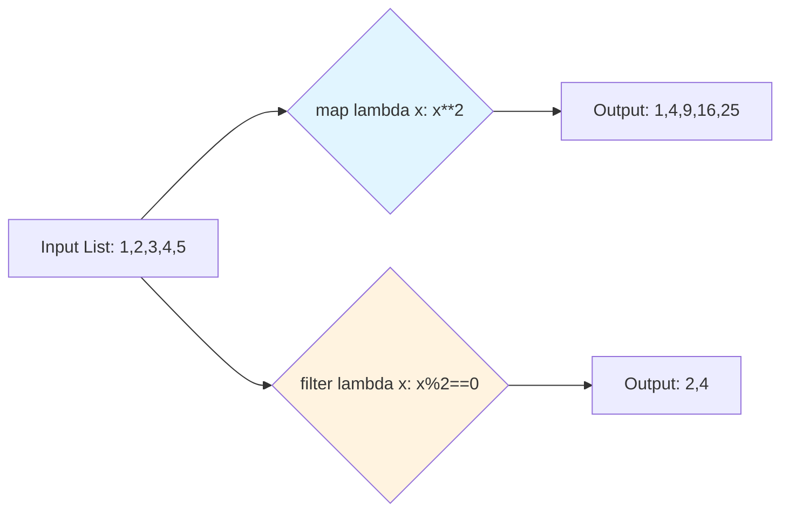
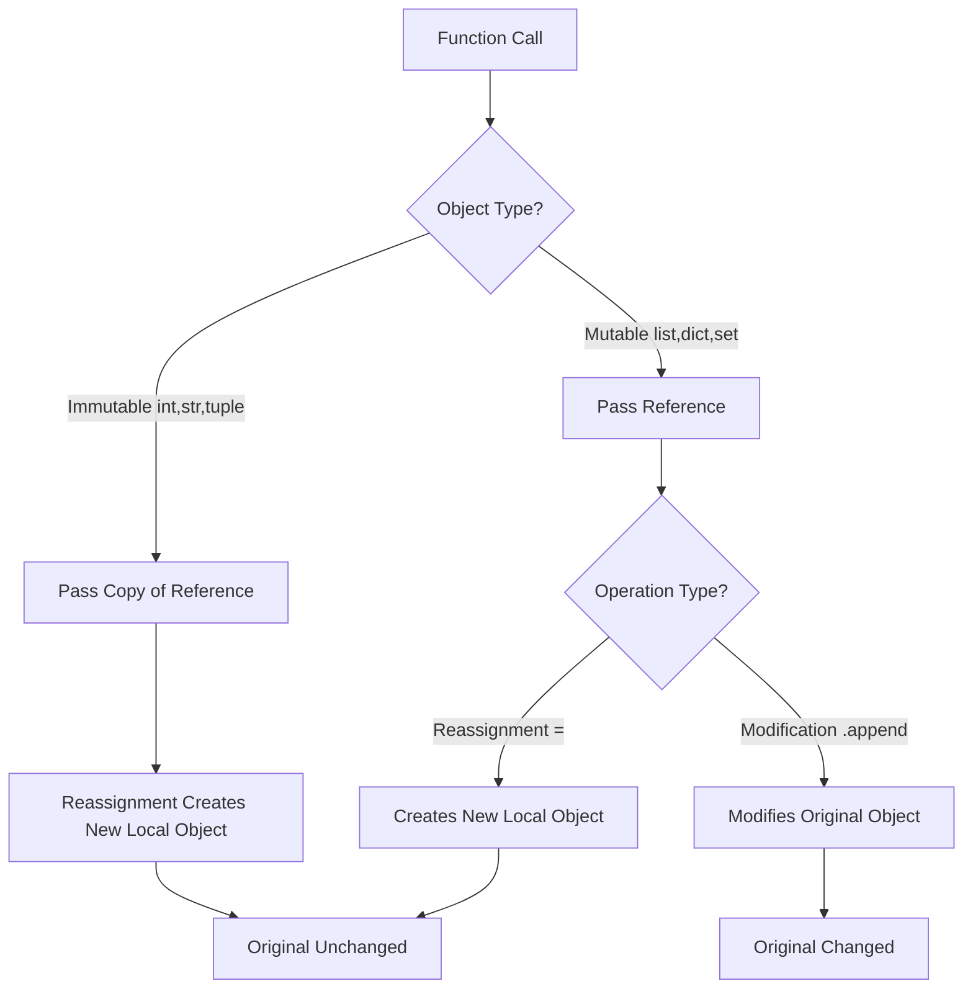

# Python Fundamentals - 2 Coding Guide

## Overview
This notebook covers intermediate Python data structures: tuples, sets, dictionaries, and advanced string/file operations. Each section builds on Week 1 fundamentals.

---

## Step-by-Step Code Analysis

### Step 1: Tuples - Immutable Sequences

#### Creating Tuples
```python
tuple_1 = ("Max", 28, "New York")
print(tuple_1)
print(type(tuple_1))  # <class 'tuple'>
```

**Purpose**: Create an immutable, ordered collection.

**Key Points**:
- Parentheses `()` are optional but recommended
- Can contain mixed types
- Immutable - cannot be changed after creation

```python
# Parentheses optional
tuple_2 = "Linda", 25, "Miami"
print(type(tuple_2))  # <class 'tuple'>
```

#### Immutability Demonstration
```python
tuple_1[2] = "Boston"  # TypeError: 'tuple' object does not support item assignment
```

**Key Point**: Unlike lists, tuples cannot be modified.

```python
# Lists ARE mutable
list_1 = ["Max", 28, "New York"]
list_1[2] = "Boston"  # Works fine
print(list_1)  # ['Max', 28, 'Boston']
```

#### Tuple Unpacking
```python
person = ("Alice", 25, "New York")
name, age, city = person

print(name)  # Alice
print(age)   # 25
print(city)  # New York
```

**Purpose**: Extract multiple values in one line.

**Use Case**: Function returns, swapping variables.

#### Single Element Tuples
```python
# NOT a tuple (just an integer)
tuple_1 = (5)
print(type(tuple_1))  # <class 'int'>

# IS a tuple (note the comma)
tuple_2 = (5,)
print(type(tuple_2))  # <class 'tuple'>
```

**Critical Point**: Comma is required for single-element tuples!

#### Iterating Tuples
```python
tuple_1 = ("Max", 28, "New York")

# By element
for item in tuple_1:
    print(item, end="  ")

# By index
for i in range(len(tuple_1)):
    print(i, tuple_1[i])

# With enumerate
for idx, val in enumerate(tuple_1):
    print(idx, val)
```

#### Tuple Methods
```python
my_tuple = ('a', 'p', 'p', 'l', 'e')

len(my_tuple)        # 5 - number of elements
my_tuple.count('p')  # 2 - count occurrences
my_tuple.index('l')  # 3 - find first index
```

**Available Methods**: Only `count()` and `index()` (immutable = fewer methods).

#### Tuple Operations
```python
# Concatenation
myTuple = (1, 2)
myTuple = myTuple + (3,)  # (1, 2, 3)

# Repetition
print(('a', 'p', 'p', 'l', 'e') * 2)
# ('a', 'p', 'p', 'l', 'e', 'a', 'p', 'p', 'l', 'e')
```

#### Type Conversions
```python
# List to tuple
my_list = [1, 2, 3]
tuple_4 = tuple(my_list)

# Tuple to list
my_tuple = (1, 2, 3)
tuple_to_list = list(my_tuple)

# String to tuple
my_str = 'Hello'
str_to_tuple = tuple(my_str)  # ('H', 'e', 'l', 'l', 'o')
```

#### Memory Efficiency
```python
import sys

my_list = [0, 1, 2, 5, 10]
my_tuple = (0, 1, 2, 5, 10)

print(sys.getsizeof(my_list), "bytes")   # 104 bytes
print(sys.getsizeof(my_tuple), "bytes")  # 80 bytes
```

**Key Point**: Tuples use less memory than lists.

#### Returning Multiple Values
```python
def divide(a, b):
    quotient = a // b
    remainder = a % b
    return quotient, remainder  # Returns tuple

# Unpack return values
quotient, remainder = divide(10, 3)
print(quotient, remainder)  # 3 1
```

**Purpose**: Return multiple values from a function elegantly.

---

### Step 2: Sets - Unique Collections

#### Creating Sets
```python
set1 = {1, 5, 10, 4, 6, 9, 19}
print("Our set:", set1)
print("length:", len(set1))
print("Maximum:", max(set1))
```

**Key Points**:
- Curly braces `{}`
- Unordered (no indexing)
- Unique elements only

```python
# Empty set (must use set())
empty_set = set()
print(type(empty_set))  # <class 'set'>

# {} creates a dictionary!
empty_dict = {}
print(type(empty_dict))  # <class 'dict'>
```

**Critical**: `{}` creates a dictionary, not a set!

#### Sets Are Not Indexed
```python
set1 = {1, 5, 10, 4, 6, 9, 19}
set1[2]  # TypeError: 'set' object is not subscriptable
```

**Key Point**: Cannot access elements by index.

#### Automatic Duplicate Removal
```python
numbers = {2, 4, 6, 6, 2, 8, 6, 6, 6, 6}
print(numbers)  # {8, 2, 4, 6}
```

**Purpose**: Automatically removes duplicates.

#### Adding Elements
```python
fruits = {"apple", "banana", "cherry"}
fruits.add("orange")
print(fruits)  # {'cherry', 'orange', 'banana', 'apple'}
```

**Method**: `add()` for single element.

#### Removing Elements
```python
# remove() - raises error if not found
fruits.remove("cherry")

# discard() - no error if not found
fruits.discard("watermelon")  # No error

# clear() - remove all
fruits.clear()
```

**Key Difference**:
- `remove()`: Raises KeyError if element not found
- `discard()`: Silent if element not found

#### Set Operations

**Union** (all elements from both)
```python
fruits = {"apple", "banana", "orange"}
more_fruits = {"orange", "strawberry", "kiwi"}

all_fruits = fruits.union(more_fruits)
# or: all_fruits = fruits | more_fruits
```

**Intersection** (common elements)
```python
common_fruits = fruits.intersection(more_fruits)
# or: common_fruits = fruits & more_fruits
# Result: {'orange'}
```

**Difference** (in first but not second)
```python
different_fruits = all_fruits.difference(common_fruits)
# or: different_fruits = all_fruits - common_fruits
```

**Update** (add elements from another set)
```python
fruits.update(more_fruits)  # Modifies fruits in-place
```

#### Membership Testing
```python
tuple_1 = ("Max", 28, "New York")

result1 = "New York" in tuple_1      # True
result2 = "Chicago" in tuple_1       # False
result3 = "Boston" not in tuple_1    # True
```

---

### Step 3: Dictionaries - Key-Value Pairs

#### Creating Dictionaries
```python
person = {
    "name": "John",
    "age": 30,
    "city": "New York"
}

# Empty dictionary
empty_dict = {}
# or: empty_dict = dict()
```

**Structure**: `{key: value, key: value, ...}`

#### Accessing Values
```python
# Direct access
print(person["name"])  # John

# Using get() (safer)
print(person.get("name"))           # John
print(person.get("email"))          # None
print(person.get("email", "N/A"))   # N/A (default)
```

**Key Difference**:
- `dict[key]`: Raises KeyError if key doesn't exist
- `dict.get(key)`: Returns None (or default) if key doesn't exist

#### Adding/Updating Values
```python
# Add new key-value
person["email"] = "john@email.com"

# Update existing
person["age"] = 31

# Update multiple
person.update({"phone": "123-456", "age": 32})
```

#### Removing Elements
```python
# Delete key-value pair
del person["phone"]

# Remove and return value
removed = person.pop("email")

# Clear all
person.clear()
```

#### Dictionary Methods
```python
person = {"name": "John", "age": 30, "city": "NYC"}

# Get all keys
keys = person.keys()

# Get all values
values = person.values()

# Get all items (key-value pairs)
items = person.items()
```

#### Iterating Dictionaries
```python
# Iterate keys
for key in person:
    print(key)

# Iterate values
for value in person.values():
    print(value)

# Iterate key-value pairs
for key, value in person.items():
    print(f"{key}: {value}")
```

#### Dictionary Comprehension
```python
# Create dictionary
squares = {x: x**2 for x in range(5)}
# {0: 0, 1: 1, 2: 4, 3: 9, 4: 16}

# Filter dictionary
person = {"name": "John", "age": 30, "city": "NYC"}
filtered = {k: v for k, v in person.items() if isinstance(v, str)}
# {'name': 'John', 'city': 'NYC'}
```

#### Nested Dictionaries
```python
students = {
    "student1": {"name": "John", "grade": 85},
    "student2": {"name": "Jane", "grade": 92}
}

print(students["student1"]["name"])  # John
```

---

### Step 4: Practice Problems

#### Problem 1: Contains Duplicate (Set Solution)
```python
def containsDuplicate(nums):
    checker = set()
    for num in nums:
        if num in checker:
            return True
        checker.add(num)
    return False

# Optimized version
def containsDuplicate(nums):
    return len(nums) != len(set(nums))
```

**Algorithm**:
- Convert list to set (removes duplicates)
- If lengths differ, duplicates existed
- Time: O(n), Space: O(n)

#### Problem 2: Two Sum (Dictionary Solution)
```python
def twoSum(nums, target):
    seen = {}
    for i, num in enumerate(nums):
        complement = target - num
        if complement in seen:
            return [seen[complement], i]
        seen[num] = i
    return []
```

**Algorithm**:
- Store seen numbers with their indices
- For each number, check if complement exists
- Time: O(n), Space: O(n)

#### Problem 3: Character Frequency
```python
def char_frequency(text):
    freq = {}
    for char in text:
        freq[char] = freq.get(char, 0) + 1
    return freq

# Using Counter (from collections)
from collections import Counter
freq = Counter("hello")
```

---

## Key Takeaways

### Tuples
1. **Immutable**: Cannot be changed after creation
2. **Ordered**: Maintains insertion order
3. **Memory efficient**: Uses less memory than lists
4. **Use cases**: Function returns, dictionary keys, data that shouldn't change

### Sets
1. **Unique elements**: Automatically removes duplicates
2. **Unordered**: No indexing or slicing
3. **Fast membership testing**: O(1) average time
4. **Mathematical operations**: Union, intersection, difference

### Dictionaries
1. **Key-value pairs**: Associate keys with values
2. **Fast lookups**: O(1) average time by key
3. **Mutable**: Can add, update, remove items
4. **Keys must be immutable**: Strings, numbers, tuples (not lists)

### Comparison

| Operation | List | Tuple | Set | Dict |
|-----------|------|-------|-----|------|
| Access by index | O(1) | O(1) | N/A | N/A |
| Search | O(n) | O(n) | O(1) | O(1) |
| Insert | O(1)* | N/A | O(1) | O(1) |
| Delete | O(n) | N/A | O(1) | O(1) |
| Memory | High | Low | Medium | High |

*Amortized time

---

## Common Pitfalls

1. **Single element tuple**: `(5,)` not `(5)`
2. **Empty set**: `set()` not `{}`
3. **Tuple modification**: Tuples are immutable
4. **Set ordering**: Sets don't maintain order
5. **Dictionary key types**: Must be immutable
6. **KeyError**: Use `.get()` for safe access

---

### Step 5: Dictionaries - Key-Value Mappings

#### Creating Dictionaries
```python
# Basic dictionary
person = {
    "name": "John",
    "age": 30,
    "city": "New York"
}

# Empty dictionary
empty_dict = {}
# or: empty_dict = dict()
```

**Purpose**: Store data as key-value pairs for fast lookups.

**Key Points**:
- Keys must be immutable (strings, numbers, tuples)
- Values can be any type
- Keys are unique (duplicates overwrite)

#### Accessing Dictionary Values
```python
# Direct access (raises KeyError if key doesn't exist)
print(person["name"])  # John

# Using get() - safer approach
print(person.get("name"))           # John
print(person.get("email"))          # None
print(person.get("email", "N/A"))   # N/A (default value)
```

**Key Difference**:
- `dict[key]`: Fast but raises error if key missing
- `dict.get(key, default)`: Safe, returns None or default if key missing

#### Adding and Updating Values
```python
# Add new key-value pair
person["email"] = "john@email.com"

# Update existing value
person["age"] = 31

# Update multiple at once
person.update({"phone": "123-456", "age": 32})
```

#### Removing Elements
```python
# Delete specific key
del person["phone"]

# Remove and return value
removed_value = person.pop("email")

# Remove all items
person.clear()
```

#### Dictionary Methods
```python
person = {"name": "John", "age": 30, "city": "NYC"}

# Get all keys
keys = person.keys()        # dict_keys(['name', 'age', 'city'])

# Get all values
values = person.values()    # dict_values(['John', 30, 'NYC'])

# Get all key-value pairs
items = person.items()      # dict_items([('name', 'John'), ('age', 30), ('city', 'NYC')])
```

**Purpose**: These methods return view objects that reflect changes to the dictionary.

#### Iterating Through Dictionaries
```python
person = {"name": "John", "age": 30, "city": "NYC"}

# Iterate over keys (default)
for key in person:
    print(key)

# Iterate over values
for value in person.values():
    print(value)

# Iterate over key-value pairs
for key, value in person.items():
    print(f"{key}: {value}")
```

**Best Practice**: Use `.items()` when you need both key and value.

#### Dictionary Comprehension
```python
# Create dictionary from range
squares = {x: x**2 for x in range(5)}
# Result: {0: 0, 1: 1, 2: 4, 3: 9, 4: 16}

# Filter dictionary
person = {"name": "John", "age": 30, "city": "NYC"}
string_values = {k: v for k, v in person.items() if isinstance(v, str)}
# Result: {'name': 'John', 'city': 'NYC'}
```

**Syntax**: `{key_expr: value_expr for item in iterable if condition}`

#### Nested Dictionaries
```python
students = {
    "student1": {"name": "John", "grade": 85},
    "student2": {"name": "Jane", "grade": 92}
}

# Access nested values
print(students["student1"]["name"])  # John

# Iterate nested dictionary
for student_id, info in students.items():
    print(f"{student_id}: {info['name']} - Grade: {info['grade']}")
```

---

### Step 6: Modules - Code Organization

#### What Are Modules?
Modules are Python files containing functions, classes, and variables that can be imported and reused.

#### Built-in Modules
```python
# Import entire module
import math
print(math.sqrt(16))  # 4.0
print(math.pi)        # 3.141592653589793

# Import specific functions
from math import sqrt, pi
print(sqrt(16))  # 4.0
print(pi)        # 3.141592653589793

# Import with alias
import math as m
print(m.sqrt(16))  # 4.0
```

**Common Built-in Modules**:
- `math`: Mathematical functions
- `random`: Random number generation
- `datetime`: Date and time operations
- `os`: Operating system interface
- `sys`: System-specific parameters
- `json`: JSON encoding/decoding

#### from ... import ... Syntax
```python
# Import specific items
from math import sqrt, pi, pow

# Import all (not recommended)
from math import *

# Import with alias
from math import sqrt as square_root
print(square_root(16))  # 4.0
```

**Best Practice**: Import only what you need to avoid namespace pollution.

#### User-Defined Modules
```python
# File: my_module.py
def greet(name):
    return f"Hello, {name}!"

def add(a, b):
    return a + b

# File: main.py
import my_module
print(my_module.greet("Alice"))  # Hello, Alice!
print(my_module.add(5, 3))       # 8
```

**Purpose**: Organize code into reusable components.

---

### Step 7: Functional Programming

#### Lambda Functions - Anonymous Functions
```python
# Regular function
def square(x):
    return x ** 2

# Lambda equivalent
square = lambda x: x ** 2

print(square(5))  # 25
```

**Syntax**: `lambda arguments: expression`

**Key Points**:
- Single expression only (no statements)
- Returns result automatically
- Useful for short, simple functions
- Often used with map(), filter(), sorted()

**Multiple Arguments**:
```python
# Lambda with multiple arguments
add = lambda x, y: x + y
print(add(3, 5))  # 8

# Lambda with default arguments
greet = lambda name="Guest": f"Hello, {name}!"
print(greet())        # Hello, Guest!
print(greet("Alice")) # Hello, Alice!
```

#### map() Function
```python
# Apply function to each element
numbers = [1, 2, 3, 4, 5]

# Using lambda
squared = list(map(lambda x: x**2, numbers))
print(squared)  # [1, 4, 9, 16, 25]

# Using regular function
def double(x):
    return x * 2

doubled = list(map(double, numbers))
print(doubled)  # [2, 4, 6, 8, 10]
```

**Purpose**: Transform each element in an iterable.

**Syntax**: `map(function, iterable)`

**Returns**: Map object (iterator) - convert to list to see results

**Multiple Iterables**:
```python
# map() with multiple lists
list1 = [1, 2, 3]
list2 = [10, 20, 30]

result = list(map(lambda x, y: x + y, list1, list2))
print(result)  # [11, 22, 33]
```

#### filter() Function
```python
# Filter elements based on condition
numbers = [1, 2, 3, 4, 5, 6, 7, 8, 9, 10]

# Get even numbers
evens = list(filter(lambda x: x % 2 == 0, numbers))
print(evens)  # [2, 4, 6, 8, 10]

# Get numbers greater than 5
greater_than_5 = list(filter(lambda x: x > 5, numbers))
print(greater_than_5)  # [6, 7, 8, 9, 10]
```

**Purpose**: Select elements that satisfy a condition.

**Syntax**: `filter(function, iterable)`

**Returns**: Filter object (iterator) - convert to list to see results

**Key Point**: Function must return True/False (boolean)

#### Comparison: map() vs filter()
```python
numbers = [1, 2, 3, 4, 5]

# map() - transforms each element (same length output)
squared = list(map(lambda x: x**2, numbers))
# [1, 4, 9, 16, 25] - 5 elements

# filter() - selects elements (potentially shorter output)
evens = list(filter(lambda x: x % 2 == 0, numbers))
# [2, 4] - 2 elements
```

**Mermaid Diagram**:


#### Combining map() and filter()
```python
numbers = [1, 2, 3, 4, 5, 6, 7, 8, 9, 10]

# Filter even numbers, then square them
result = list(map(lambda x: x**2, filter(lambda x: x % 2 == 0, numbers)))
print(result)  # [4, 16, 36, 64, 100]

# More readable with intermediate variable
evens = filter(lambda x: x % 2 == 0, numbers)
squared_evens = map(lambda x: x**2, evens)
result = list(squared_evens)
```

---

### Step 8: Scope of Variables

#### Local vs Global Scope
```python
# Global variable
global_var = "I'm global"

def my_function():
    # Local variable
    local_var = "I'm local"
    print(global_var)  # Can access global
    print(local_var)   # Can access local

my_function()
print(global_var)  # Works
print(local_var)   # NameError: local_var not defined
```

**Key Points**:
- **Global scope**: Variables defined outside functions
- **Local scope**: Variables defined inside functions
- Local variables are destroyed after function ends
- Functions can read global variables but cannot modify them (without `global` keyword)

#### Modifying Global Variables
```python
counter = 0

def increment():
    global counter  # Declare we want to modify global variable
    counter += 1

increment()
print(counter)  # 1

increment()
print(counter)  # 2
```

**Warning**: Using `global` is generally discouraged - prefer returning values.

#### LEGB Rule (Scope Resolution)
Python searches for variables in this order:
1. **L**ocal - Inside current function
2. **E**nclosing - Inside enclosing functions
3. **G**lobal - Module level
4. **B**uilt-in - Python built-in names

```python
x = "global"

def outer():
    x = "enclosing"
    
    def inner():
        x = "local"
        print(x)  # Prints "local"
    
    inner()
    print(x)  # Prints "enclosing"

outer()
print(x)  # Prints "global"
```

---

### Step 9: Call by Value vs Call by Reference

#### Immutable Objects (Call by Value Behavior)
```python
def modify_number(x):
    x = x + 10
    print(f"Inside function: {x}")

num = 5
modify_number(num)
print(f"Outside function: {num}")

# Output:
# Inside function: 15
# Outside function: 5  (unchanged)
```

**What Happens**:
- Immutable types: int, float, str, tuple
- Function receives a copy of the reference
- Reassignment creates new object locally
- Original variable unchanged

#### Mutable Objects (Call by Reference Behavior)
```python
def modify_list(lst):
    lst.append(4)
    print(f"Inside function: {lst}")

my_list = [1, 2, 3]
modify_list(my_list)
print(f"Outside function: {my_list}")

# Output:
# Inside function: [1, 2, 3, 4]
# Outside function: [1, 2, 3, 4]  (changed!)
```

**What Happens**:
- Mutable types: list, dict, set
- Function receives reference to same object
- Modifications affect original object
- Original variable IS changed

#### Reassignment vs Modification
```python
def reassign_list(lst):
    lst = [10, 20, 30]  # Reassignment - creates new local object
    print(f"Inside: {lst}")

def modify_list(lst):
    lst.append(4)  # Modification - changes original object
    print(f"Inside: {lst}")

my_list = [1, 2, 3]

reassign_list(my_list)
print(f"After reassign: {my_list}")  # [1, 2, 3] - unchanged

modify_list(my_list)
print(f"After modify: {my_list}")    # [1, 2, 3, 4] - changed
```

**Key Distinction**:
- **Reassignment** (`=`): Creates new local reference
- **Modification** (`.append()`, `[i] = x`): Changes original object

#### Avoiding Unintended Modifications
```python
def safe_modify(lst):
    # Create a copy
    local_list = lst.copy()  # or lst[:]
    local_list.append(4)
    return local_list

my_list = [1, 2, 3]
new_list = safe_modify(my_list)

print(f"Original: {my_list}")  # [1, 2, 3] - unchanged
print(f"New: {new_list}")      # [1, 2, 3, 4]
```

**Mermaid Diagram**:


---

### Step 10: Additional LeetCode Problems

#### Problem 4: Intersection of Two Arrays (LeetCode 349)
```python
def intersection(nums1, nums2):
    """
    Find unique common elements between two arrays.
    
    Args:
        nums1: List of integers
        nums2: List of integers
    
    Returns:
        List of unique common elements
    """
    # Convert to sets and find intersection
    set1 = set(nums1)
    set2 = set(nums2)
    return list(set1.intersection(set2))
    
    # Alternative: using & operator
    # return list(set(nums1) & set(nums2))

# Test
print(intersection([1, 2, 2, 1], [2, 2]))  # [2]
print(intersection([4, 9, 5], [9, 4, 9, 8, 4]))  # [9, 4] or [4, 9]
```

**Algorithm**:
1. Convert both arrays to sets (removes duplicates)
2. Find intersection using `.intersection()` or `&`
3. Convert result back to list

**Time Complexity**: O(n + m) where n, m are array lengths
**Space Complexity**: O(n + m) for the sets

#### Problem 5: Majority Element (LeetCode 169)
```python
def majorityElement(nums):
    """
    Find element that appears more than n/2 times.
    
    Args:
        nums: List of integers
    
    Returns:
        The majority element
    """
    # Solution 1: Using dictionary
    counts = {}
    for num in nums:
        counts[num] = counts.get(num, 0) + 1
        if counts[num] > len(nums) // 2:
            return num
    
    # Solution 2: Using Counter
    from collections import Counter
    counts = Counter(nums)
    return counts.most_common(1)[0][0]
    
    # Solution 3: Boyer-Moore Voting Algorithm (optimal)
    candidate = None
    count = 0
    
    for num in nums:
        if count == 0:
            candidate = num
        count += (1 if num == candidate else -1)
    
    return candidate

# Test
print(majorityElement([3, 2, 3]))  # 3
print(majorityElement([2, 2, 1, 1, 1, 2, 2]))  # 2
```

**Boyer-Moore Algorithm Explanation**:
- Maintains a candidate and count
- Increments count if current element matches candidate
- Decrements count if different
- When count reaches 0, switch candidate
- Guaranteed to find majority element (appears > n/2 times)

**Time Complexity**: O(n)
**Space Complexity**: O(1) for Boyer-Moore, O(n) for dictionary

#### Problem 6: Running Sum (LeetCode 1480)
```python
def runningSum(nums):
    """
    Calculate running sum of array.
    
    Args:
        nums: List of integers
    
    Returns:
        List where result[i] = sum(nums[0]...nums[i])
    """
    # Solution 1: Create new list
    result = []
    total = 0
    for num in nums:
        total += num
        result.append(total)
    return result
    
    # Solution 2: Modify in place
    for i in range(1, len(nums)):
        nums[i] += nums[i-1]
    return nums

# Test
print(runningSum([1, 2, 3, 4]))  # [1, 3, 6, 10]
print(runningSum([1, 1, 1, 1, 1]))  # [1, 2, 3, 4, 5]
```

**Algorithm**:
- Keep running total
- Add each element to total
- Store cumulative sum

**Time Complexity**: O(n)
**Space Complexity**: O(1) if modifying in place, O(n) if creating new list

---

## Summary of Advanced Concepts

### Functional Programming
- **Lambda**: Anonymous functions for simple operations
- **map()**: Transform each element in iterable
- **filter()**: Select elements based on condition
- Enables concise, declarative code

### Scope and References
- **LEGB Rule**: Local → Enclosing → Global → Built-in
- **Immutable types**: Behave like call by value
- **Mutable types**: Behave like call by reference
- **Reassignment vs Modification**: Key distinction for mutable objects

### Best Practices
1. Use list comprehensions over map/filter when possible (more Pythonic)
2. Avoid modifying global variables
3. Be careful with mutable default arguments
4. Create copies of mutable objects when needed
5. Use descriptive variable names over lambda when function is complex

This comprehensive coding guide now covers all Python Fundamentals - 2 concepts!