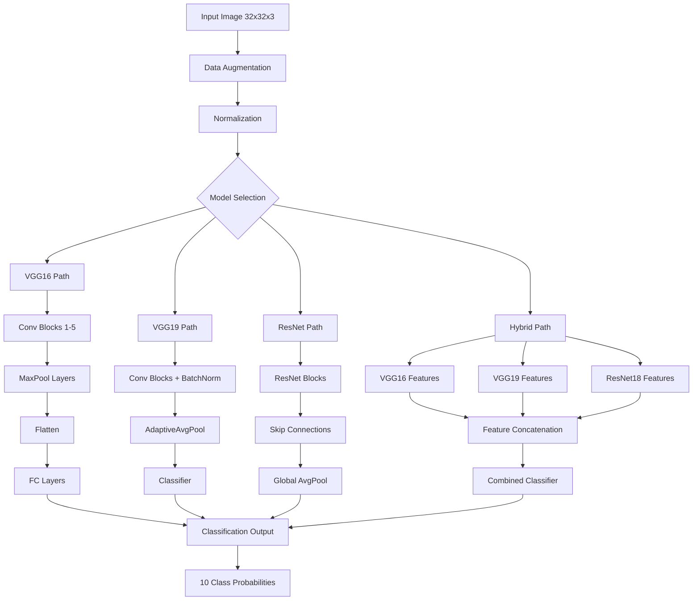

# Computer Vision 2 Part 1 - Assignment Solution Coding Guide

## Overview
This notebook implements CIFAR-10 image classification using multiple CNN architectures (VGG16, VGG19, ResNet-50, and a Hybrid Model). The goal is to compare different deep learning models for image classification tasks.

## Table of Contents
1. [Data Preparation](#data-preparation)
2. [VGG16 Implementation](#vgg16-implementation)
3. [VGG19 Implementation](#vgg19-implementation)
4. [Hybrid Model Implementation](#hybrid-model-implementation)
5. [Training Process](#training-process)
6. [Model Evaluation](#model-evaluation)
7. [Visualization](#visualization)

## Data Preparation

### 1. Import Libraries
```python
import torch
import torchvision
import torchvision.transforms as transforms
import torch.nn as nn
import torch.optim as optim
import torch.nn.functional as F
import numpy as np
import matplotlib.pyplot as plt
```

**Key Libraries Explained:**
- `torch`: Core PyTorch library for tensor operations and neural networks
- `torchvision`: Computer vision utilities including datasets and pre-trained models
- `transforms`: Image preprocessing and data augmentation tools
- `nn`: Neural network modules (layers, loss functions)
- `optim`: Optimization algorithms (SGD, Adam, etc.)
- `F`: Functional API for activation functions and operations

### 2. Data Transformations
```python
# Training transformations (with data augmentation)
transform_train = transforms.Compose([
    transforms.RandomCrop(32, padding=4),  # Random crop with padding
    transforms.RandomHorizontalFlip(),     # Random horizontal flip
    transforms.ToTensor(),                 # Convert to tensor [0,1]
    transforms.Normalize((0.4914, 0.4822, 0.4465), (0.2470, 0.2434, 0.2616))
])

# Test transformations (no augmentation)
transform_test = transforms.Compose([
    transforms.ToTensor(),
    transforms.Normalize((0.4914, 0.4822, 0.4465), (0.2470, 0.2434, 0.2616))
])
```

**Transform Components:**
- `RandomCrop(32, padding=4)`: Randomly crops 32x32 region with 4-pixel padding for spatial invariance
- `RandomHorizontalFlip()`: Randomly flips images horizontally to improve generalization
- `ToTensor()`: Converts PIL Image to PyTorch tensor and scales pixels to [0,1]
- `Normalize()`: Normalizes using CIFAR-10 dataset statistics (mean and std per channel)

### 3. Dataset Loading
```python
# Load CIFAR-10 training dataset
trainset = torchvision.datasets.CIFAR10(
    root='./data',           # Directory to store dataset
    train=True,              # Load training split
    download=True,           # Download if not present
    transform=transform_train # Apply training transformations
)

# Load CIFAR-10 test dataset
testset = torchvision.datasets.CIFAR10(
    root='./data',
    train=False,             # Load test split
    download=True,
    transform=transform_test  # Apply test transformations
)
```

### 4. Data Loaders
```python
# Training data loader
trainloader = torch.utils.data.DataLoader(
    trainset,
    batch_size=128,    # Process 128 images at once
    shuffle=True,      # Shuffle data each epoch
    num_workers=2      # Parallel data loading threads
)

# Test data loader
testloader = torch.utils.data.DataLoader(
    testset,
    batch_size=256,    # Larger batch for evaluation
    shuffle=True,
    num_workers=2
)
```

**DataLoader Parameters:**
- `batch_size`: Number of samples processed simultaneously
- `shuffle`: Randomizes data order to prevent overfitting
- `num_workers`: CPU threads for parallel data loading

## VGG16 Implementation

### VGG16 Architecture
```python
class VGG16(nn.Module):
    def __init__(self, num_classes=10):
        super(VGG16, self).__init__()
        
        # Feature extraction layers
        self.features = nn.Sequential(
            # Block 1: 64 filters
            nn.Conv2d(3, 64, kernel_size=3, padding=1), nn.ReLU(inplace=True),
            nn.Conv2d(64, 64, kernel_size=3, padding=1), nn.ReLU(inplace=True),
            nn.MaxPool2d(kernel_size=2, stride=2),  # 32x32 -> 16x16
            
            # Block 2: 128 filters
            nn.Conv2d(64, 128, kernel_size=3, padding=1), nn.ReLU(inplace=True),
            nn.Conv2d(128, 128, kernel_size=3, padding=1), nn.ReLU(inplace=True),
            nn.MaxPool2d(kernel_size=2, stride=2),  # 16x16 -> 8x8
            
            # Block 3: 256 filters
            nn.Conv2d(128, 256, kernel_size=3, padding=1), nn.ReLU(inplace=True),
            nn.Conv2d(256, 256, kernel_size=3, padding=1), nn.ReLU(inplace=True),
            nn.Conv2d(256, 256, kernel_size=3, padding=1), nn.ReLU(inplace=True),
            
            # Block 4: 512 filters
            nn.Conv2d(256, 512, kernel_size=3, padding=1), nn.ReLU(inplace=True),
            nn.Conv2d(512, 512, kernel_size=3, padding=1), nn.ReLU(inplace=True),
            nn.Conv2d(512, 512, kernel_size=3, padding=1), nn.ReLU(inplace=True),
            
            # Block 5: 512 filters
            nn.Conv2d(512, 512, kernel_size=3, padding=1), nn.ReLU(inplace=True),
            nn.Conv2d(512, 512, kernel_size=3, padding=1), nn.ReLU(inplace=True),
            nn.Conv2d(512, 512, kernel_size=3, padding=1), nn.ReLU(inplace=True),
            nn.MaxPool2d(kernel_size=2, stride=2)  # 8x8 -> 4x4
        )
        
        # Classification layers
        self.classifier = nn.Sequential(
            nn.Linear(512 * 4 * 4, 4096), nn.ReLU(True), nn.Dropout(),
            nn.Linear(4096, 4096), nn.ReLU(True), nn.Dropout(),
            nn.Linear(4096, num_classes)
        )
    
    def forward(self, x):
        x = self.features(x)        # Extract features
        x = x.view(x.size(0), -1)   # Flatten for classifier
        x = self.classifier(x)      # Classification
        return x
```

**Architecture Components:**
- `Conv2d(in_channels, out_channels, kernel_size, padding)`: 2D convolution layer
- `ReLU(inplace=True)`: Rectified Linear Unit activation (saves memory)
- `MaxPool2d(kernel_size, stride)`: Max pooling for downsampling
- `Linear(in_features, out_features)`: Fully connected layer
- `Dropout()`: Regularization to prevent overfitting

## VGG19 Implementation

### VGG19 with Batch Normalization
```python
class VGG19(nn.Module):
    def __init__(self, num_classes=1000):
        super(VGG19, self).__init__()
        
        self.features = nn.Sequential(
            # Block 1
            nn.Conv2d(3, 64, kernel_size=3, padding=1), nn.BatchNorm2d(64), nn.ReLU(inplace=True),
            nn.Conv2d(64, 64, kernel_size=3, padding=1), nn.BatchNorm2d(64), nn.ReLU(inplace=True),
            nn.MaxPool2d(kernel_size=2, stride=2),
            
            # Block 2
            nn.Conv2d(64, 128, kernel_size=3, padding=1), nn.BatchNorm2d(128), nn.ReLU(inplace=True),
            nn.Conv2d(128, 128, kernel_size=3, padding=1), nn.BatchNorm2d(128), nn.ReLU(inplace=True),
            nn.MaxPool2d(kernel_size=2, stride=2),
            
            # Block 3 (4 conv layers)
            nn.Conv2d(128, 256, kernel_size=3, padding=1), nn.BatchNorm2d(256), nn.ReLU(inplace=True),
            nn.Conv2d(256, 256, kernel_size=3, padding=1), nn.BatchNorm2d(256), nn.ReLU(inplace=True),
            nn.Conv2d(256, 256, kernel_size=3, padding=1), nn.BatchNorm2d(256), nn.ReLU(inplace=True),
            nn.Conv2d(256, 256, kernel_size=3, padding=1), nn.BatchNorm2d(256), nn.ReLU(inplace=True),
            nn.MaxPool2d(kernel_size=2, stride=2),
            
            # Block 4 (4 conv layers)
            nn.Conv2d(256, 512, kernel_size=3, padding=1), nn.BatchNorm2d(512), nn.ReLU(inplace=True),
            nn.Conv2d(512, 512, kernel_size=3, padding=1), nn.BatchNorm2d(512), nn.ReLU(inplace=True),
            nn.Conv2d(512, 512, kernel_size=3, padding=1), nn.BatchNorm2d(512), nn.ReLU(inplace=True),
            nn.Conv2d(512, 512, kernel_size=3, padding=1), nn.BatchNorm2d(512), nn.ReLU(inplace=True),
            nn.MaxPool2d(kernel_size=2, stride=2),
            
            # Block 5 (4 conv layers)
            nn.Conv2d(512, 512, kernel_size=3, padding=1), nn.BatchNorm2d(512), nn.ReLU(inplace=True),
            nn.Conv2d(512, 512, kernel_size=3, padding=1), nn.BatchNorm2d(512), nn.ReLU(inplace=True),
            nn.Conv2d(512, 512, kernel_size=3, padding=1), nn.BatchNorm2d(512), nn.ReLU(inplace=True),
            nn.Conv2d(512, 512, kernel_size=3, padding=1), nn.BatchNorm2d(512), nn.ReLU(inplace=True),
            nn.MaxPool2d(kernel_size=2, stride=2),
        )
        
        self.avgpool = nn.AdaptiveAvgPool2d((7, 7))
        
        self.classifier = nn.Sequential(
            nn.Dropout(0.5),
            nn.Linear(512 * 7 * 7, 4096), nn.ReLU(inplace=True), nn.Dropout(0.5),
            nn.Linear(4096, 4096), nn.ReLU(inplace=True), nn.Dropout(0.5),
            nn.Linear(4096, num_classes)
        )
```

**Key Differences from VGG16:**
- `BatchNorm2d()`: Normalizes layer inputs for faster training and better convergence
- `AdaptiveAvgPool2d((7, 7))`: Ensures fixed output size regardless of input dimensions
- More convolutional layers (19 vs 16) for increased model capacity

## Hybrid Model Implementation

### Combining Multiple Architectures
```python
class HybridModel(nn.Module):
    def __init__(self, num_classes=10):
        super(HybridModel, self).__init__()
        
        # Load pre-trained models
        self.vgg19 = models.vgg19(weights=VGG19_Weights.DEFAULT)
        self.vgg16 = models.vgg16(weights=VGG16_Weights.DEFAULT)
        self.resnet18 = models.resnet18(weights=ResNet18_Weights.DEFAULT)
        
        # Adaptive pooling for consistent feature sizes
        self.avgpool = nn.AdaptiveAvgPool2d((1, 1))
        
        # Combined classifier
        self.fc = nn.Linear(512 * 3, num_classes)  # 512 from each model
    
    def forward(self, x):
        # Extract features from VGG16
        x1 = self.vgg16.features(x)    # Shape: (batch, 512, h, w)
        x1 = self.avgpool(x1)          # Shape: (batch, 512, 1, 1)
        x1 = torch.flatten(x1, 1)      # Shape: (batch, 512)
        
        # Extract features from VGG19
        x2 = self.vgg19.features(x)
        x2 = self.avgpool(x2)
        x2 = torch.flatten(x2, 1)
        
        # Extract features from ResNet18
        x3 = self.resnet18.conv1(x)
        x3 = self.resnet18.bn1(x3)
        x3 = self.resnet18.relu(x3)
        x3 = self.resnet18.maxpool(x3)
        x3 = self.resnet18.layer1(x3)
        x3 = self.resnet18.layer2(x3)
        x3 = self.resnet18.layer3(x3)
        x3 = self.resnet18.layer4(x3)   # Shape: (batch, 512, h, w)
        x3 = self.avgpool(x3)
        x3 = torch.flatten(x3, 1)
        
        # Concatenate features
        x = torch.cat((x1, x2, x3), dim=1)  # Shape: (batch, 1536)
        
        # Final classification
        x = self.fc(x)
        return x
```

**Hybrid Model Benefits:**
- Combines strengths of different architectures
- VGG models: Good at learning local features
- ResNet: Handles vanishing gradients with skip connections
- Feature concatenation creates richer representations

## Training Process

### 1. Training Setup
```python
# Model initialization
model = VGG16(num_classes=10)
device = 'cuda' if torch.cuda.is_available() else 'cpu'
model = model.to(device)

# Training hyperparameters
lr = 0.001
criterion = nn.CrossEntropyLoss()
optimizer = optim.SGD(model.parameters(), lr=lr, momentum=0.9, weight_decay=5e-4)
scheduler = torch.optim.lr_scheduler.CosineAnnealingLR(optimizer, T_max=200)
```

**Training Components:**
- `CrossEntropyLoss()`: Standard loss for multi-class classification
- `SGD`: Stochastic Gradient Descent with momentum and weight decay
- `CosineAnnealingLR`: Learning rate scheduler that follows cosine curve

### 2. Training Function
```python
def train_batch(epoch, model, optimizer):
    print("Epoch", epoch)
    model.train()  # Enable training mode
    
    train_loss = 0
    correct = 0
    total = 0
    
    for batch_idx, (inputs, targets) in enumerate(trainloader):
        inputs, targets = inputs.to(device), targets.to(device)
        
        optimizer.zero_grad()    # Clear gradients
        outputs = model(inputs)  # Forward pass
        loss = criterion(outputs, targets)  # Compute loss
        loss.backward()          # Backpropagation
        optimizer.step()         # Update weights
        
        train_loss += loss.item()
        _, predicted = outputs.max(1)
        total += targets.size(0)
        correct += predicted.eq(targets).sum().item()
    
    # Print training statistics
    print(f'Loss: {train_loss/(batch_idx+1):.3f} | Acc: {100.*correct/total:.3f}% ({correct}/{total})')
```

### 3. Validation Function
```python
def validate_batch(epoch, model):
    model.eval()  # Enable evaluation mode
    
    test_loss = 0
    correct = 0
    total = 0
    
    with torch.no_grad():  # Disable gradient computation
        for batch_idx, (inputs, targets) in enumerate(testloader):
            inputs, targets = inputs.to(device), targets.to(device)
            outputs = model(inputs)
            loss = criterion(outputs, targets)
            
            test_loss += loss.item()
            _, predicted = outputs.max(1)
            total += targets.size(0)
            correct += predicted.eq(targets).sum().item()
    
    print(f'Loss: {test_loss/(batch_idx+1):.3f} | Acc: {100.*correct/total:.3f}% ({correct}/{total})')
```

## Model Evaluation

### Comprehensive Evaluation Function
```python
def evaluate(model, data_loader):
    model.eval()
    predictions = []
    true_labels = []
    
    with torch.no_grad():
        for images, labels in data_loader:
            images = images.to(device)
            labels = labels.to(device)
            
            outputs = model(images)
            _, predicted_labels = torch.max(outputs, 1)
            
            predictions.extend(predicted_labels.cpu().numpy())
            true_labels.extend(labels.cpu().numpy())
    
    # Calculate metrics
    accuracy = accuracy_score(y_true=true_labels, y_pred=predictions)
    precision = precision_score(y_true=true_labels, y_pred=predictions, average='weighted')
    recall = recall_score(y_true=true_labels, y_pred=predictions, average='weighted')
    f1 = f1_score(y_true=true_labels, y_pred=predictions, average='weighted')
    cf_matrix = confusion_matrix(y_true=true_labels, y_pred=predictions)
    
    return accuracy, precision, recall, f1, cf_matrix
```

**Evaluation Metrics:**
- `Accuracy`: Overall correctness (correct predictions / total predictions)
- `Precision`: True positives / (True positives + False positives)
- `Recall`: True positives / (True positives + False negatives)
- `F1-Score`: Harmonic mean of precision and recall
- `Confusion Matrix`: Detailed breakdown of predictions vs actual labels

## Architecture Flow Diagram



## Key Learning Points

### 1. Data Preprocessing
- **Normalization**: Essential for stable training with pre-computed dataset statistics
- **Data Augmentation**: Improves generalization by creating variations of training data
- **Batch Processing**: Enables efficient GPU utilization and stable gradient estimates

### 2. Architecture Design
- **VGG**: Simple, deep architecture with small 3x3 filters
- **Batch Normalization**: Accelerates training and improves convergence
- **Adaptive Pooling**: Ensures consistent feature map sizes
- **Hybrid Models**: Combine strengths of different architectures

### 3. Training Strategies
- **Learning Rate Scheduling**: Cosine annealing for better convergence
- **Regularization**: Dropout and weight decay prevent overfitting
- **Gradient Management**: Proper gradient clearing and backpropagation

### 4. Evaluation Best Practices
- **Multiple Metrics**: Accuracy, precision, recall, F1-score for comprehensive assessment
- **Confusion Matrix**: Detailed class-wise performance analysis
- **Model Comparison**: Systematic evaluation across different architectures

This coding guide provides a comprehensive understanding of implementing and training CNN models for image classification, covering data preparation, model architecture, training procedures, and evaluation metrics essential for computer vision tasks.