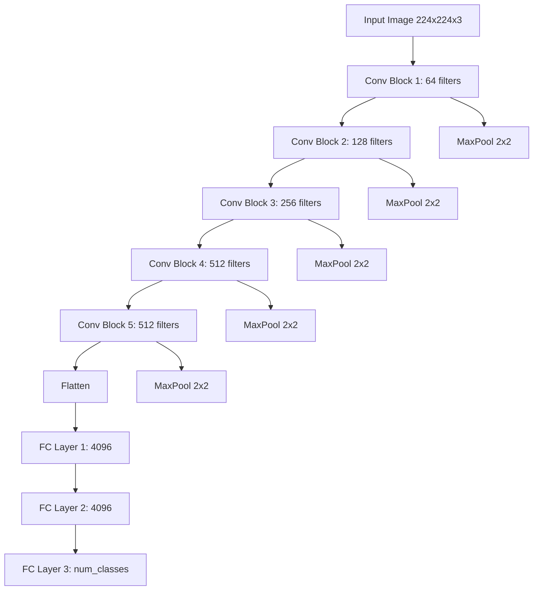
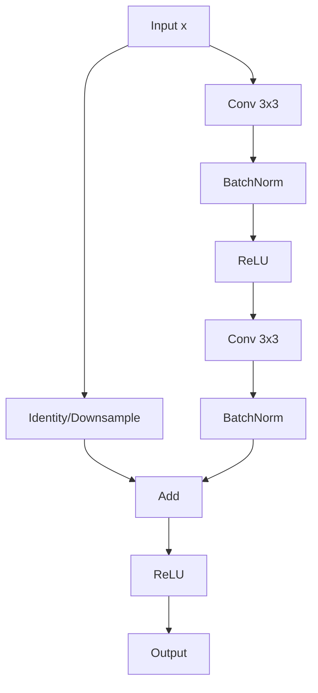
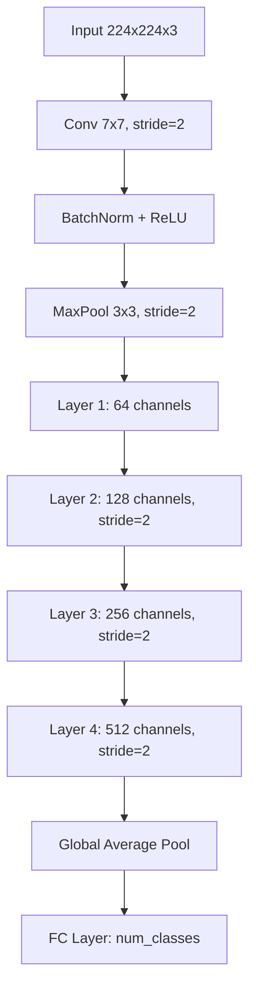

# Computer Vision 2_Part - 1 - Coding Guide

## Overview
This notebook demonstrates the implementation of two important deep learning architectures for computer vision: **VGG (Visual Geometry Group)** and **ResNet (Residual Networks)**. These are foundational CNN architectures that have significantly influenced modern computer vision.

## Table of Contents
1. [Environment Setup](#environment-setup)
2. [VGG Architecture Implementation](#vgg-architecture-implementation)
3. [ResNet Architecture Implementation](#resnet-architecture-implementation)
4. [Key Concepts and Learning Points](#key-concepts-and-learning-points)

---

## Environment Setup

### Asset Directory Mounting
```python
import os

local_assets_b = False

if local_assets_b:
  assets_dir = "/content/assets/P2/"
  
  if not os.path.isdir(assets_dir):
    assert os.path.isfile("assets.zip")
    os.system("unzip assets.zip")
else:
  from google.colab import drive
  drive.mount('/content/drive')
  assets_dir = '/content/drive/MyDrive/IK/CV1/assets'
```

**Purpose**: Sets up the environment to access datasets and resources
- `local_assets_b`: Boolean flag to choose between local assets or Google Drive
- `os.path.isdir()`: Checks if directory exists
- `os.system("unzip assets.zip")`: Extracts assets if running locally
- `drive.mount()`: Mounts Google Drive for accessing cloud-stored datasets

---

## VGG Architecture Implementation

### Core Imports
```python
import torch
import torch.nn as nn
```

**Why these imports?**
- `torch`: Core PyTorch library for tensor operations and neural networks
- `torch.nn`: Contains neural network modules, layers, and functions

### VGG16 Class Implementation

```python
class VGG16(nn.Module):
    def __init__(self, num_classes=1000):
        super(VGG16, self).__init__()
```

**Key Arguments:**
- `num_classes=1000`: Number of output classes (default for ImageNet dataset)
- `super(VGG16, self).__init__()`: Inherits from PyTorch's nn.Module base class

### Feature Extraction Layers

```python
self.features = nn.Sequential(
    # Block 1: Extract low-level features (edges, textures)
    nn.Conv2d(3, 64, kernel_size=3, padding=1), nn.ReLU(inplace=True),
    nn.Conv2d(64, 64, kernel_size=3, padding=1), nn.ReLU(inplace=True),
    nn.MaxPool2d(kernel_size=2, stride=2),
    # ... more blocks
)
```

**Architecture Breakdown:**

#### Block 1 (Low-level Features)
- **Input**: 3 channels (RGB image)
- **Output**: 64 feature maps
- **Purpose**: Detects edges, textures, basic patterns
- **MaxPool2d**: Reduces spatial dimensions by half

#### Block 2 (Mid-level Features)  
- **Input**: 64 channels
- **Output**: 128 feature maps
- **Purpose**: Learns shapes, simple object parts

#### Block 3 (Complex Patterns)
- **Input**: 128 channels  
- **Output**: 256 feature maps
- **Layers**: 3 convolutional layers (deeper processing)
- **Purpose**: Detects complex shapes and object parts

#### Block 4 & 5 (High-level Features)
- **Channels**: 256 → 512 → 512
- **Purpose**: Abstract object representations and complex features

**Key Parameters Explained:**
- `kernel_size=3`: 3×3 convolution filter (standard for feature extraction)
- `padding=1`: Maintains spatial dimensions after convolution
- `stride=2` (in MaxPool): Downsamples by factor of 2
- `inplace=True`: Memory-efficient ReLU operation

### Classification Layers

```python
self.classifier = nn.Sequential(
    nn.Linear(512 * 7 * 7, 4096), nn.ReLU(True), nn.Dropout(),
    nn.Linear(4096, 4096), nn.ReLU(True), nn.Dropout(),
    nn.Linear(4096, num_classes)
)
```

**Layer Breakdown:**
- **FC1**: `512 * 7 * 7 → 4096` (flattened feature maps to dense layer)
- **FC2**: `4096 → 4096` (further abstraction)
- **FC3**: `4096 → num_classes` (final classification)
- **Dropout()**: Prevents overfitting by randomly setting neurons to zero during training

### Forward Pass Implementation

```python
def forward(self, x):
    layer_outputs = []
    
    for layer in self.features:
        x = layer(x)
        layer_outputs.append(x)
    
    x = x.view(x.size(0), -1)  # Flatten
    
    for layer in self.classifier:
        x = layer(x)
        layer_outputs.append(x)
    
    return x, layer_outputs
```

**Key Operations:**
- `layer_outputs.append(x)`: Stores intermediate outputs for analysis
- `x.view(x.size(0), -1)`: Flattens 3D feature maps to 1D vector
- Returns both final output and all intermediate layer outputs

### Model Analysis

```python
total_params = sum(p.numel() for p in vgg_model.parameters())
print(f"Total Parameters: {total_params}")
print(f'Total Model size in MB: {total_params * 4 / (1024 * 1024)}')
```

**Parameter Calculation:**
- `p.numel()`: Returns number of elements in each parameter tensor
- `sum(...)`: Totals all parameters (weights + biases)
- `* 4`: Each float32 parameter uses 4 bytes
- `/ (1024 * 1024)`: Converts bytes to megabytes

---

## ResNet Architecture Implementation

### Residual Layer (Building Block)

```python
class ResidualLayer(nn.Module):
    def __init__(self, inp_c, out_c, stride=1, downsample=None):
```

**Key Arguments:**
- `inp_c`: Input channels
- `out_c`: Output channels  
- `stride=1`: Controls spatial downsampling
- `downsample=None`: Optional layer to match dimensions

### Residual Block Structure

```python
# First convolution
self.conv1 = nn.Conv2d(inp_c, out_c, kernel_size=3, stride=stride, padding=1, bias=False)
self.bn1 = nn.BatchNorm2d(out_c)
self.relu = nn.ReLU(inplace=True)

# Second convolution  
self.conv2 = nn.Conv2d(out_c, out_c, kernel_size=3, stride=1, padding=1, bias=False)
self.bn2 = nn.BatchNorm2d(out_c)
```

**Why BatchNorm?**
- Normalizes layer inputs to have zero mean and unit variance
- Stabilizes training and allows higher learning rates
- Reduces internal covariate shift

**Why bias=False?**
- BatchNorm includes its own bias term, making conv bias redundant

### Skip Connection (Residual Connection)

```python
def forward(self, x):
    identity = x  # Store original input
    
    # Process through conv layers
    out = self.conv1(x)
    out = self.bn1(out)
    out = self.relu(out)
    
    out = self.conv2(out)
    out = self.bn2(out)
    
    # Apply downsampling if needed
    if self.downsample is not None:
        identity = self.downsample(identity)
    
    # Add skip connection
    out += identity
    out = self.relu(out)
    
    return out
```

**Skip Connection Benefits:**
- **Gradient Flow**: Helps gradients flow directly to earlier layers
- **Identity Mapping**: Allows network to learn identity function if needed
- **Deeper Networks**: Enables training of very deep networks (50+ layers)

### Block Creation Function

```python
def make_block(residual_layer, inp_c, out_c, num_residual_layers_in_block, stride=1):
```

**Purpose**: Creates a sequence of residual layers
**Parameters:**
- `residual_layer`: The ResidualLayer class
- `inp_c, out_c`: Input/output channels
- `num_residual_layers_in_block`: How many residual layers to stack
- `stride`: Downsampling factor for first layer

### Downsampling Logic

```python
if stride != 1 or out_c != inp_c:
    downsample = nn.Sequential(
        nn.Conv2d(inp_c, out_c, kernel_size=1, stride=stride, bias=False),
        nn.BatchNorm2d(out_c)
    )
```

**When Downsampling is Needed:**
- `stride != 1`: Spatial dimensions change
- `out_c != inp_c`: Channel dimensions change
- Uses 1×1 convolution to adjust dimensions

### Complete ResNet Model

```python
class ResNet(nn.Module):
    def __init__(self, residual_layer, layers, num_classes=10):
```

**Architecture Components:**

#### Initial Layers
```python
self.conv1 = nn.Conv2d(3, 64, kernel_size=7, stride=2, padding=3, bias=False)
self.bn1 = nn.BatchNorm2d(64)
self.relu = nn.ReLU(inplace=True)
self.maxpool = nn.MaxPool2d(kernel_size=3, stride=2, padding=1)
```

- **7×7 conv**: Larger receptive field for initial feature extraction
- **stride=2**: Reduces input size (224×224 → 112×112)
- **MaxPool**: Further reduction (112×112 → 56×56)

#### Residual Blocks
```python
self.layer1 = self.__make_block(residual_layer, 64, layers[0])      # 56×56
self.layer2 = self.__make_block(residual_layer, 128, layers[1], stride=2)  # 28×28  
self.layer3 = self.__make_block(residual_layer, 256, layers[2], stride=2)  # 14×14
self.layer4 = self.__make_block(residual_layer, 512, layers[3], stride=2)  # 7×7
```

**Progressive Feature Learning:**
- Each layer doubles channels and halves spatial dimensions
- Learns increasingly abstract features

#### Global Average Pooling
```python
self.avgpool = nn.AdaptiveAvgPool2d((1, 1))
```

**Benefits over Flatten:**
- Reduces overfitting
- Works with any input size
- Fewer parameters than fully connected layers

---

## Key Concepts and Learning Points

### 1. **Architecture Evolution**
- **VGG**: Simple, deep architecture with small filters
- **ResNet**: Introduces skip connections for very deep networks

### 2. **Skip Connections**
- Enable gradient flow in deep networks
- Allow learning of identity mappings
- Prevent vanishing gradient problem

### 3. **Batch Normalization**
- Normalizes layer inputs
- Stabilizes training
- Allows higher learning rates

### 4. **Progressive Feature Learning**
- Early layers: Low-level features (edges, textures)
- Middle layers: Mid-level features (shapes, patterns)  
- Later layers: High-level features (objects, concepts)

### 5. **Memory and Parameter Efficiency**
- `inplace=True`: Saves memory in ReLU operations
- `bias=False`: Reduces parameters when using BatchNorm
- Global Average Pooling: Fewer parameters than FC layers

### 6. **Model Analysis**
- Parameter counting helps understand model complexity
- Memory calculation important for deployment
- Layer output shapes help debug architecture

---

## Architecture Flow Diagrams

### VGG16 Architecture Flow


### ResNet Residual Block Flow


### ResNet Overall Architecture


---

## Testing and Usage Examples

### Model Instantiation
```python
# VGG16 for 10 classes
vgg_model = VGG16(num_classes=10)

# ResNet-18 
layers = [2, 2, 2, 2]  # Number of blocks in each layer
resnet_model = ResNet(ResidualLayer, layers, num_classes=10)
```

### Forward Pass
```python
input_tensor = torch.rand(1, 3, 224, 224)  # Batch size 1, RGB, 224x224
output, layer_outputs = model(input_tensor)

# Analyze layer outputs
for i, output in enumerate(layer_outputs):
    print(f"Layer {i+1} output shape: {output.shape}")
```

This coding guide provides a comprehensive understanding of both VGG and ResNet architectures, explaining the reasoning behind design choices and implementation details that are crucial for understanding modern computer vision models.