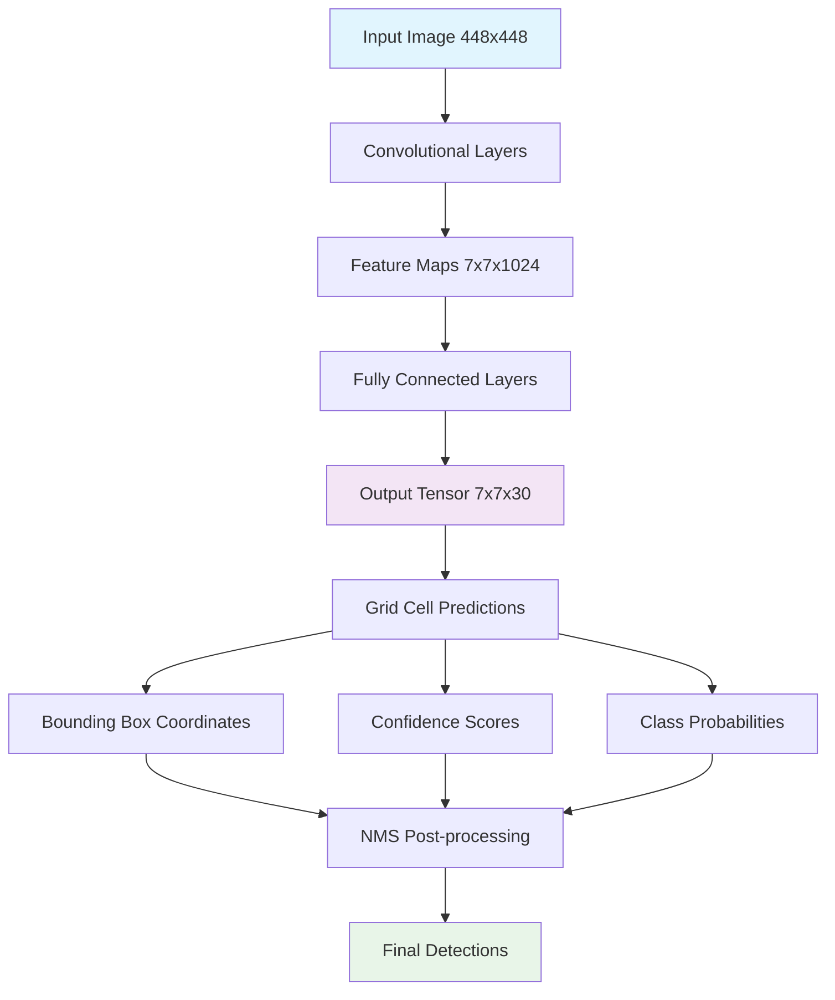
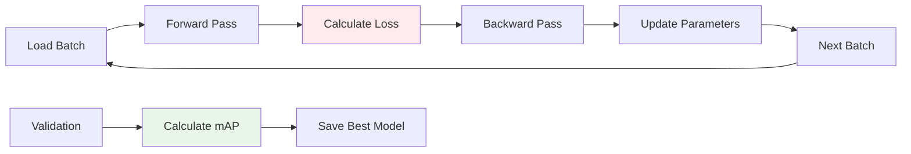

# CV_2_part_2_assignment_solution - Coding Guide

## Overview
This coding guide explains the YOLOv1 (You Only Look Once v1) object detection implementation for a smart traffic monitoring system. The code demonstrates how to build, train, and evaluate a deep learning model for real-time object detection using PyTorch.

## Table of Contents
1. [Environment Setup and Data Preparation](#environment-setup)
2. [Data Preprocessing and Loading](#data-preprocessing)
3. [YOLOv1 Model Architecture](#yolov1-model)
4. [Loss Function Implementation](#loss-function)
5. [Training Pipeline](#training-pipeline)
6. [Evaluation Metrics](#evaluation-metrics)
7. [Visualization and Results](#visualization)

---

## Environment Setup and Data Preparation {#environment-setup}

### Code Cell 3: Asset Directory Setup
```python
import os  # Importing the OS module for file operations

# Flag to determine whether assets are stored locally or in Google Drive
local_assets_b = False

if local_assets_b:
    # Define the local assets directory path
    assets_dir = "/content/assets/"
else:
    # Mount Google Drive to access assets stored in the cloud
    from google.colab import drive
    drive.mount('/content/drive')
    assets_dir = "/content/drive/MyDrive/assets/"
```

**Key Learning Points:**
- **`os` module**: Used for operating system interface operations like file path handling
- **Conditional logic**: The code uses a boolean flag to switch between local and cloud storage
- **Google Colab integration**: `drive.mount()` connects Google Drive to the Colab environment
- **Path management**: Proper directory structure setup is crucial for data access

### Code Cell 5: Core Library Imports
```python
import torch  # Import PyTorch for deep learning tasks
from PIL import Image  # Import PIL (Pillow) for image processing
from torch.utils.data import Dataset, DataLoader  # Import dataset utilities
```

**Key Learning Points:**
- **PyTorch**: The main deep learning framework used for tensor operations and neural networks
- **PIL (Python Imaging Library)**: Essential for image loading, processing, and manipulation
- **Dataset & DataLoader**: PyTorch utilities for efficient data loading and batching during training

### Code Cell 7: Dataset Extraction
```python
# Define the source path of the PascalVOC dataset ZIP file
source_path = assets_dir + "PascalVOC.zip"

# Define the destination directory where the dataset will be extracted
destination_dir = "/content/"

# Extract the ZIP file to the destination directory
with zipfile.ZipFile(source_path, 'r') as zip_ref:
    zip_ref.extractall(destination_dir)
```

**Key Learning Points:**
- **File path concatenation**: Using `+` to join directory paths
- **zipfile module**: Python's built-in library for handling ZIP archives
- **Context manager**: `with` statement ensures proper file handling and automatic cleanup
- **`extractall()`**: Extracts all contents of the ZIP file to the specified directory

---

## Data Preprocessing and Loading {#data-preprocessing}

### Code Cell 9: Essential Libraries for Data Processing
```python
import numpy as np  # Numerical computing with arrays
import pandas as pd  # Handling structured datasets
from tqdm import tqdm  # Progress bars for loops
import zipfile  # For handling ZIP files
```

**Key Learning Points:**
- **NumPy**: Fundamental package for numerical computing, essential for array operations
- **Pandas**: Data manipulation and analysis library, useful for handling CSV files and structured data
- **tqdm**: Creates progress bars to monitor long-running operations
- **zipfile**: Built-in Python module for working with ZIP archives

### Code Cell 12: Custom Transformation Pipeline
```python
class Compose(object):
    """
    Custom transformation pipeline to apply multiple transformations sequentially.
    """
    def __init__(self, transforms):
        """
        Initialize with a list of transformations.
        
        Args:
            transforms (list): List of transformation functions to apply
        """
        self.transforms = transforms

    def __call__(self, img, bboxes):
        """
        Apply all transformations to the image and bounding boxes.
        
        Args:
            img: Input image
            bboxes: Bounding box coordinates
            
        Returns:
            Transformed image and bounding boxes
        """
        for t in self.transforms:
            img, bboxes = t(img, bboxes)
        return img, bboxes
```

**Key Learning Points:**
- **Class definition**: Creating a custom class to encapsulate functionality
- **`__init__` method**: Constructor that initializes the object with a list of transformations
- **`__call__` method**: Makes the object callable like a function
- **Sequential processing**: Applies transformations one after another
- **Docstrings**: Proper documentation explaining the purpose and parameters

### Code Cell 15: Custom Dataset Class
```python
class VOCDataset(torch.utils.data.Dataset):
    """
    Custom PyTorch dataset class for loading images and annotations from Pascal VOC format.
    """
    def __init__(self, csv_file, img_dir, label_dir, S=7, B=2, C=20, transform=None):
        """
        Initialize the dataset.
        
        Args:
            csv_file (str): Path to CSV file containing image filenames
            img_dir (str): Directory containing images
            label_dir (str): Directory containing label files
            S (int): Grid size (7x7 grid)
            B (int): Number of bounding boxes per grid cell
            C (int): Number of classes
            transform: Optional transformations to apply
        """
        self.annotations = pd.read_csv(csv_file)
        self.img_dir = img_dir
        self.label_dir = label_dir
        self.transform = transform
        self.S = S  # Grid size
        self.B = B  # Bounding boxes per cell
        self.C = C  # Number of classes

    def __len__(self):
        """Return the total number of samples in the dataset."""
        return len(self.annotations)

    def __getitem__(self, index):
        """
        Get a single sample from the dataset.
        
        Args:
            index (int): Index of the sample to retrieve
            
        Returns:
            tuple: (image_tensor, label_tensor)
        """
        # Implementation details for loading and processing images and labels
        # ...
```

**Key Learning Points:**
- **Inheritance**: `VOCDataset` inherits from `torch.utils.data.Dataset`
- **Required methods**: `__len__` and `__getitem__` must be implemented for PyTorch datasets
- **YOLO parameters**: S (grid size), B (boxes per cell), C (number of classes)
- **Data loading**: Uses pandas to read CSV files containing image metadata
- **Flexible design**: Accepts optional transformations for data augmentation

---

## YOLOv1 Model Architecture {#yolov1-model}

### Code Cell 26: YOLOv1 Neural Network Implementation
```python
import torch
import torch.nn as nn  # Import PyTorch's neural network module

class YOLOv1(nn.Module):
    """
    YOLOv1 (You Only Look Once v1) implementation for object detection.
    """
    def __init__(self, split_size=7, num_boxes=2, num_classes=20):
        """
        Initialize YOLOv1 model.
        
        Args:
            split_size (int): Grid size (7x7)
            num_boxes (int): Number of bounding boxes per grid cell
            num_classes (int): Number of object classes
        """
        super(YOLOv1, self).__init__()
        self.split_size = split_size
        self.num_boxes = num_boxes
        self.num_classes = num_classes
        
        # Feature extraction layers (convolutional backbone)
        self.features = self._make_conv_layers()
        
        # Fully connected layers for final predictions
        self.classifier = nn.Sequential(
            nn.Flatten(),
            nn.Linear(1024 * self.split_size * self.split_size, 4096),
            nn.Dropout(0.5),
            nn.LeakyReLU(0.1),
            nn.Linear(4096, self.split_size * self.split_size * (self.num_classes + self.num_boxes * 5))
        )

    def _make_conv_layers(self):
        """Create the convolutional feature extraction layers."""
        # Implementation of convolutional layers
        # ...

    def forward(self, x):
        """
        Forward pass through the network.
        
        Args:
            x (torch.Tensor): Input image tensor
            
        Returns:
            torch.Tensor: Predictions tensor
        """
        x = self.features(x)
        x = self.classifier(x)
        return x.reshape(-1, self.split_size, self.split_size, self.num_classes + self.num_boxes * 5)
```

**Key Learning Points:**
- **nn.Module inheritance**: Base class for all neural network modules in PyTorch
- **`super().__init__()`**: Calls the parent class constructor
- **Model architecture**: Combines convolutional feature extraction with fully connected layers
- **Dropout**: Regularization technique to prevent overfitting (0.5 = 50% dropout rate)
- **LeakyReLU**: Activation function that allows small negative values (0.1 slope)
- **Reshape operation**: Converts flat output to grid format (S×S×(C+B×5))
- **YOLO output format**: Each grid cell predicts class probabilities + bounding box coordinates

---

## Loss Function Implementation {#loss-function}

### Code Cell 32: YOLOv1 Loss Function
```python
class YoloLoss(nn.Module):
    """
    Custom YOLOv1 loss function.
    Implements loss calculation for object detection including:
    - Bounding box coordinate loss
    - Confidence score loss  
    - Classification loss
    """
    def __init__(self, S=7, B=2, C=20):
        """
        Initialize loss function.
        
        Args:
            S (int): Grid size
            B (int): Number of bounding boxes per cell
            C (int): Number of classes
        """
        super(YoloLoss, self).__init__()
        self.mse = nn.MSELoss(reduction="sum")  # Mean Squared Error loss
        self.S = S
        self.B = B
        self.C = C
        
        # Loss weights (from YOLO paper)
        self.lambda_noobj = 0.5  # Weight for no-object confidence loss
        self.lambda_coord = 5    # Weight for coordinate loss

    def forward(self, predictions, target):
        """
        Calculate the total YOLO loss.
        
        Args:
            predictions (torch.Tensor): Model predictions
            target (torch.Tensor): Ground truth labels
            
        Returns:
            torch.Tensor: Total loss value
        """
        # Reshape predictions to match target format
        predictions = predictions.reshape(-1, self.S, self.S, self.C + self.B * 5)
        
        # Calculate individual loss components
        # 1. Bounding box coordinate loss
        # 2. Confidence score loss (object and no-object)
        # 3. Classification loss
        
        # Implementation details...
        return total_loss
```

**Key Learning Points:**
- **Multi-component loss**: YOLO loss combines coordinate, confidence, and classification losses
- **MSE Loss**: Mean Squared Error used for regression tasks (coordinates, confidence)
- **Loss weights**: `lambda_coord` and `lambda_noobj` balance different loss components
- **Reduction parameter**: "sum" means losses are summed rather than averaged
- **Complex loss calculation**: Handles both object detection and classification simultaneously

---

## Training Pipeline {#training-pipeline}

### Code Cell 35: Device Selection and Model Setup
```python
# Select device (use GPU if available)
device = torch.device('cuda' if torch.cuda.is_available() else 'cpu')
print(f"Using device: {device}")

# Initialize model and move to device
yolo_model = YOLOv1(split_size=7, num_boxes=2, num_classes=20)
yolo_model = yolo_model.to(device)

# Initialize loss function
yolo_loss = YoloLoss()
```

**Key Learning Points:**
- **Device selection**: Automatically chooses GPU if available, otherwise CPU
- **Model transfer**: `.to(device)` moves model parameters to the selected device
- **Memory efficiency**: GPU computation is much faster for deep learning tasks

### Code Cell 37: Optimizer Setup
```python
yolo_optimizer = torch.optim.Adam(yolo_model.parameters(), lr=2e-5, weight_decay=0)
```

**Key Learning Points:**
- **Adam optimizer**: Adaptive learning rate optimization algorithm
- **Learning rate**: 2e-5 (0.00002) is a small learning rate for stable training
- **Weight decay**: Set to 0 (no L2 regularization in this case)
- **Model parameters**: `model.parameters()` returns all trainable parameters

### Code Cell 50: Training Function
```python
from tqdm import tqdm  # Progress bar for monitoring training

def train_batch(epoch, model, optim, loss_fn, train_loader, device):
    """
    Train the YOLOv1 model for one epoch.
    
    Args:
        epoch (int): Current epoch number
        model: YOLOv1 model
        optim: Optimizer
        loss_fn: Loss function
        train_loader: Training data loader
        device: Computing device (CPU/GPU)
        
    Returns:
        float: Average loss for the epoch
    """
    model.train()  # Set model to training mode
    loop = tqdm(train_loader, leave=True)  # Create progress bar
    mean_loss = []
    
    for batch_idx, (x, y) in enumerate(loop):
        x, y = x.to(device), y.to(device)  # Move data to device
        
        # Forward pass
        predictions = model(x)
        loss = loss_fn(predictions, y)
        
        # Backward pass
        optim.zero_grad()  # Clear gradients
        loss.backward()    # Compute gradients
        optim.step()       # Update parameters
        
        # Track loss
        mean_loss.append(loss.item())
        loop.set_postfix(loss=loss.item())  # Update progress bar
    
    return sum(mean_loss) / len(mean_loss)
```

**Key Learning Points:**
- **Training mode**: `model.train()` enables dropout and batch normalization training behavior
- **Gradient management**: `zero_grad()` clears previous gradients, `backward()` computes new ones
- **Optimization step**: `step()` updates model parameters based on computed gradients
- **Loss tracking**: `.item()` extracts scalar value from tensor for logging
- **Progress monitoring**: tqdm provides visual feedback during training

---

## Evaluation Metrics {#evaluation-metrics}

### Code Cell 40: Intersection over Union (IoU)
```python
import torch  # PyTorch for tensor computations
import numpy as np  # NumPy for numerical operations

def intersection_over_union(boxes_preds, boxes_labels, box_format="midpoint"):
    """
    Calculate Intersection over Union (IoU) for bounding boxes.
    
    Args:
        boxes_preds (torch.Tensor): Predicted bounding boxes
        boxes_labels (torch.Tensor): Ground truth bounding boxes  
        box_format (str): Format of boxes ("midpoint" or "corners")
        
    Returns:
        torch.Tensor: IoU values
    """
    # Convert midpoint format to corner format if needed
    if box_format == "midpoint":
        # Convert (x_center, y_center, width, height) to (x1, y1, x2, y2)
        box1_x1 = boxes_preds[..., 0:1] - boxes_preds[..., 2:3] / 2
        box1_y1 = boxes_preds[..., 1:2] - boxes_preds[..., 3:4] / 2
        box1_x2 = boxes_preds[..., 0:1] + boxes_preds[..., 2:3] / 2
        box1_y2 = boxes_preds[..., 1:2] + boxes_preds[..., 3:4] / 2
        
        box2_x1 = boxes_labels[..., 0:1] - boxes_labels[..., 2:3] / 2
        box2_y1 = boxes_labels[..., 1:2] - boxes_labels[..., 3:4] / 2
        box2_x2 = boxes_labels[..., 0:1] + boxes_labels[..., 2:3] / 2
        box2_y2 = boxes_labels[..., 1:2] + boxes_labels[..., 3:4] / 2
    
    # Calculate intersection area
    x1 = torch.max(box1_x1, box2_x1)
    y1 = torch.max(box1_y1, box2_y1)
    x2 = torch.min(box1_x2, box2_x2)
    y2 = torch.min(box1_y2, box2_y2)
    
    # Calculate intersection area (clamp to 0 for non-overlapping boxes)
    intersection = (x2 - x1).clamp(0) * (y2 - y1).clamp(0)
    
    # Calculate union area
    box1_area = abs((box1_x2 - box1_x1) * (box1_y2 - box1_y1))
    box2_area = abs((box2_x2 - box2_x1) * (box2_y2 - box2_y1))
    union = box1_area + box2_area - intersection
    
    return intersection / (union + 1e-6)  # Add small epsilon to avoid division by zero
```

**Key Learning Points:**
- **IoU metric**: Measures overlap between predicted and ground truth bounding boxes
- **Coordinate conversion**: Transforms between midpoint and corner representations
- **Tensor operations**: Uses PyTorch tensor operations for efficient computation
- **Clamp function**: Ensures non-negative intersection areas
- **Numerical stability**: Small epsilon (1e-6) prevents division by zero

### Code Cell 43: Non-Maximum Suppression (NMS)
```python
def non_max_suppression(bboxes, iou_threshold, threshold, box_format="corners"):
    """
    Perform Non-Maximum Suppression to remove duplicate detections.
    
    Args:
        bboxes (list): List of bounding boxes [class_pred, prob_score, x1, y1, x2, y2]
        iou_threshold (float): IoU threshold for suppression
        threshold (float): Probability threshold for filtering
        box_format (str): Format of bounding box coordinates
        
    Returns:
        list: Filtered bounding boxes after NMS
    """
    # Filter out low-confidence predictions
    bboxes = [box for box in bboxes if box[1] > threshold]
    
    # Sort by confidence score (descending)
    bboxes = sorted(bboxes, key=lambda x: x[1], reverse=True)
    
    bboxes_after_nms = []
    
    while bboxes:
        chosen_box = bboxes.pop(0)  # Take highest confidence box
        
        # Remove boxes with high IoU with chosen box (same class only)
        bboxes = [
            box for box in bboxes
            if box[0] != chosen_box[0]  # Different class
            or intersection_over_union(
                torch.tensor(chosen_box[2:]),
                torch.tensor(box[2:]),
                box_format=box_format,
            ) < iou_threshold  # Low IoU
        ]
        
        bboxes_after_nms.append(chosen_box)
    
    return bboxes_after_nms
```

**Key Learning Points:**
- **NMS purpose**: Removes duplicate detections of the same object
- **Confidence filtering**: Removes low-confidence predictions first
- **Sorting**: Processes boxes in order of decreasing confidence
- **IoU-based suppression**: Removes boxes with high overlap (same class)
- **Greedy algorithm**: Iteratively selects best box and removes similar ones

---

## Visualization and Results {#visualization}

### Code Cell 67: Bounding Box Visualization
```python
import numpy as np
import matplotlib.pyplot as plt
import matplotlib.patches as patches

def plot_image(image, boxes):
    """
    Plot an image and overlay predicted and ground truth bounding boxes.
    
    Args:
        image (numpy.ndarray): Input image
        boxes (list): List of bounding boxes to draw
    """
    # Create figure and axis
    fig, ax = plt.subplots(1, figsize=(12, 8))
    
    # Display the image
    ax.imshow(image)
    
    # Define colors for different box types
    colors = ['red', 'blue', 'green', 'yellow', 'purple']
    
    # Draw each bounding box
    for i, box in enumerate(boxes):
        # Extract box coordinates and class
        class_pred, prob, x1, y1, x2, y2 = box
        
        # Create rectangle patch
        rect = patches.Rectangle(
            (x1, y1), x2 - x1, y2 - y1,
            linewidth=2,
            edgecolor=colors[int(class_pred) % len(colors)],
            facecolor='none'
        )
        
        # Add rectangle to plot
        ax.add_patch(rect)
        
        # Add class label and confidence score
        ax.text(
            x1, y1 - 5,
            f'Class: {int(class_pred)}, Conf: {prob:.2f}',
            color=colors[int(class_pred) % len(colors)],
            fontsize=10,
            weight='bold'
        )
    
    # Remove axis ticks and labels
    ax.set_xticks([])
    ax.set_yticks([])
    
    plt.tight_layout()
    plt.show()
```

**Key Learning Points:**
- **Matplotlib visualization**: Uses pyplot for image display and annotation
- **Rectangle patches**: Creates bounding box overlays on images
- **Color coding**: Different colors for different object classes
- **Text annotations**: Displays class predictions and confidence scores
- **Layout management**: `tight_layout()` optimizes spacing

---

## Key Concepts and Architecture Flow



## Training Process Flow



## Summary

This YOLOv1 implementation demonstrates:

1. **End-to-end object detection pipeline** from data loading to visualization
2. **Custom PyTorch dataset and model classes** for flexible deep learning
3. **Complex loss function** handling multiple objectives simultaneously  
4. **Evaluation metrics** (IoU, NMS, mAP) essential for object detection
5. **Training best practices** including device management and progress monitoring
6. **Visualization techniques** for interpreting model predictions

The code provides a solid foundation for understanding modern object detection systems and can be extended for other computer vision tasks.