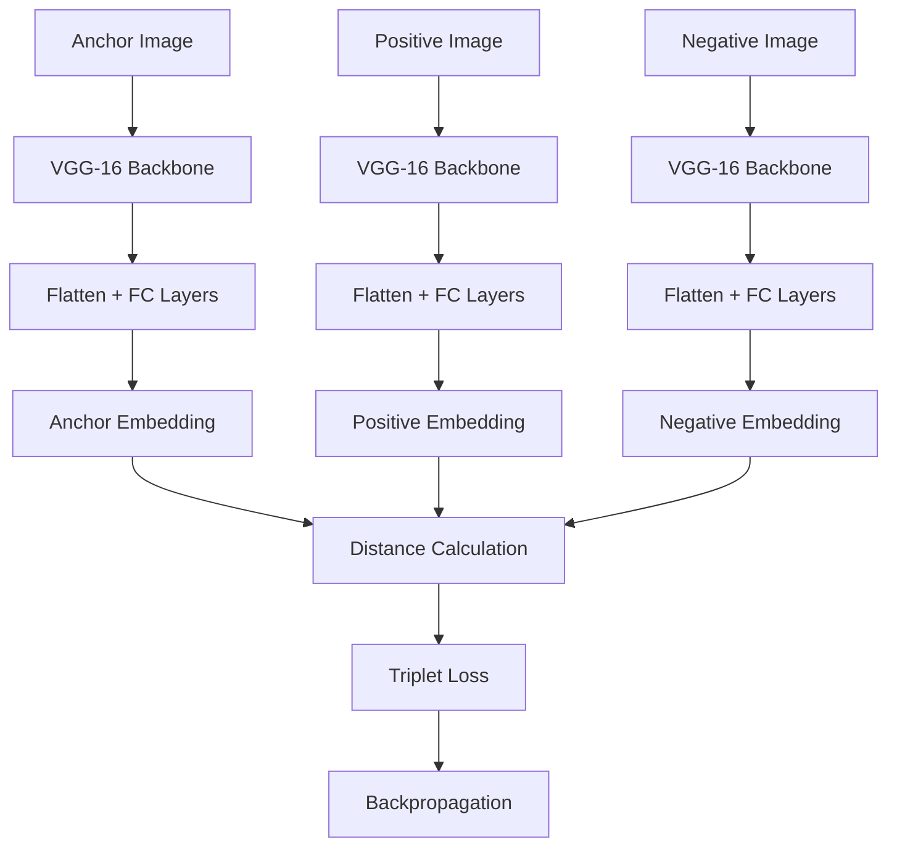

# CV_3 Assignment Question - Siamese Network with Triplet Loss Coding Guide

## Overview
This assignment focuses on implementing a **Siamese Network with VGG backbone** using **Triplet Loss** instead of Contrastive Loss for image similarity tasks. The goal is to find top-k similar images using **Cosine Similarity** on the AT&T face dataset.

## Key Concepts
- **Triplet Loss**: Uses anchor, positive, and negative samples to learn embeddings
- **Siamese Networks**: Twin networks with shared weights for similarity comparison
- **VGG-16 Backbone**: Pre-trained feature extractor with custom fully connected layers
- **Cosine Similarity**: Measures similarity based on vector angles rather than distances
- **Top-K Similarity**: Finding the most similar images for each query image

---

## Step-by-Step Code Analysis

### Step 1: Essential Library Imports

```python
import torch                          # Core PyTorch framework
import torch.nn as nn                 # Neural network modules
import torch.optim as optim           # Optimization algorithms
from torchvision.transforms import ToTensor  # Image preprocessing
from torch.utils.data import DataLoader, Dataset  # Data handling utilities
from torchvision.models import vgg16  # Pre-trained VGG-16 model
from torchvision.datasets import ImageFolder  # Dataset loader for folder structure
import numpy as np                    # Numerical computations
import random                         # Random number generation
import torchvision.transforms as transforms  # Image transformations
import torch.nn.functional as F       # Functional API for neural networks
```

**Why These Libraries**:
- **torch**: Core deep learning framework for tensor operations and neural networks
- **torchvision**: Computer vision utilities including pre-trained models and transforms
- **numpy**: Efficient numerical operations and array manipulations
- **random**: Generating random samples for triplet creation

### Step 2: Google Drive Integration

```python
from google.colab import drive
drive.mount('/content/drive', force_remount=True)
assets_dir = '/content/drive/MyDrive/CV-3/MCQs and Assignment/assets/'
```

**Purpose**:
- **drive.mount()**: Connects Google Drive to Colab environment for persistent storage
- **force_remount=True**: Ensures fresh connection even if previously mounted
- **assets_dir**: Path to dataset location in Google Drive

### Step 3: Dataset Extraction

```python
import zipfile

zip_file_path = assets_dir + "AT&T.zip"
target_folder = "/content/dataset"

with zipfile.ZipFile(zip_file_path, 'r') as zip_ref:
    zip_ref.extractall(target_folder)

assert os.path.isdir(target_folder + '/AT&T'), "The unzipped folder cannot be found"
```

**Key Components**:
- **zipfile module**: Python's built-in ZIP archive handling
- **Context manager**: Ensures proper file closure after extraction
- **extractall()**: Extracts all contents to target directory
- **assert statement**: Validates successful extraction

### Step 4: Dataset Directory Setup

```python
training_dir = "/content/dataset/AT&T/train/"
testing_dir = "/content/dataset/AT&T/test/"
```

**Purpose**: Define paths for organized access to training and testing data.

### Step 5: Siamese Network Architecture (TO BE COMPLETED)

```python
class SiameseNetwork(nn.Module):
    def __init__(self):
        super(SiameseNetwork, self).__init__()
        vgg = vgg16(pretrained=True)
        layers = list(vgg.children())
        layers = layers[:-1]  # Remove final classification layer
        
        self.backbone = torch.nn.Sequential(*layers)  # VGG backbone
        self.fc1 = ## TODO - write your solution here
        self.bn1 = ## TODO - write your solution here  
        self.bn2 = ## TODO - write your solution here

    def forward_on_single_image(self, x):
        x = self.fc0(x)  # Should be self.backbone(x)
        x = x.view(x.size()[0], -1)  # Flatten features
        x = self.bn1(x)
        x = self.fc1(x)
        x = self.bn2(x)
        return x

    def forward(self, input1, input2, input3):
        output1 = self.forward_on_single_image(input1)  # Anchor
        output2 = self.forward_on_single_image(input2)  # Positive
        output3 = self.forward_on_single_image(input3)  # Negative
        return output1, output2, output3
```

**Assignment Tasks**:
1. **Complete fc1**: Add fully connected layers with dropout and batch normalization
2. **Add bn1, bn2**: Implement batch normalization layers
3. **Fix forward_on_single_image**: Change self.fc0 to self.backbone

**Expected Solution Structure**:
```python
# Example solution (students need to implement):
self.fc1 = nn.Sequential(
    nn.Linear(25088, 2048),      # First FC layer
    nn.ReLU(inplace=True),       # Activation
    nn.Dropout(0.5),             # Regularization
    nn.Linear(2048, 512),        # Second FC layer
    nn.ReLU(inplace=True),       # Activation
    nn.Linear(512, 128)          # Final embedding layer
)
self.bn1 = nn.BatchNorm1d(25088)  # Batch norm after flattening
self.bn2 = nn.BatchNorm1d(128)    # Batch norm after final FC
```

### Step 6: Triplet Dataset Class (TO BE COMPLETED)

```python
class SiameseNetworkDataset(Dataset):
    def __init__(self, dataset):
        self.dataset = dataset
        self.labels = torch.arange(len(dataset))

    def __getitem__(self, index):
        ## TODO - write your solution here
        # return anchor, positive, negative

    def __len__(self):
        return len(self.dataset)
```

**Assignment Task**: Implement triplet sampling logic

**Expected Solution Logic**:
```python
def __getitem__(self, index):
    # Get anchor image
    anchor_img, anchor_label = self.dataset[index]
    
    # Find positive sample (same class as anchor)
    while True:
        pos_idx = torch.randint(0, len(self.dataset), (1,))
        pos_img, pos_label = self.dataset[pos_idx]
        if pos_label == anchor_label and pos_idx != index:
            break
    
    # Find negative sample (different class from anchor)
    while True:
        neg_idx = torch.randint(0, len(self.dataset), (1,))
        neg_img, neg_label = self.dataset[neg_idx]
        if neg_label != anchor_label:
            break
    
    return anchor_img, pos_img, neg_img
```

### Step 7: Image Transformations

```python
transform = transforms.Compose([
    transforms.Resize((100, 100)),  # Standardize image size
    transforms.ToTensor()           # Convert to tensor and normalize
])
```

**Purpose**:
- **Resize**: Ensures uniform input dimensions for the network
- **ToTensor**: Converts PIL images to PyTorch tensors and normalizes to [0,1]

### Step 8: Dataset Loading

```python
train_dataset = ImageFolder(training_dir, transform=transform)
test_dataset = ImageFolder(testing_dir, transform=transform)

print(len(train_dataset), len(test_dataset))  # Should print: 370 30

train_siamese_dataset = SiameseNetworkDataset(train_dataset)
test_siamese_dataset = SiameseNetworkDataset(test_dataset)
```

**Key Points**:
- **ImageFolder**: Automatically organizes images by folder structure (each folder = one class)
- **Dataset sizes**: 370 training images, 30 test images from AT&T dataset
- **Siamese wrapper**: Converts regular dataset to triplet format

### Step 9: Data Loaders

```python
batch_size = 64
test_batch_size = 1

train_loader = DataLoader(train_siamese_dataset, batch_size=batch_size, 
                         shuffle=True, num_workers=8)
test_loader = DataLoader(test_siamese_dataset, batch_size=test_batch_size, 
                        shuffle=False)
```

**Configuration**:
- **Training**: Batch size 64 with shuffling for better generalization
- **Testing**: Batch size 1 for individual image evaluation
- **num_workers=8**: Parallel data loading (may need adjustment based on system)

### Step 10: Triplet Loss Implementation (TO BE COMPLETED)

```python
class TripletLoss(nn.Module):
    def __init__(self, margin=1.0):
        super(TripletLoss, self).__init__()
        self.margin = margin

    def forward(self, anchor, positive, negative):
        ## TODO - write your solution here
        # return loss
```

**Assignment Task**: Implement triplet loss calculation

**Expected Solution**:
```python
def forward(self, anchor, positive, negative):
    # Calculate distances
    pos_distance = F.pairwise_distance(anchor, positive, p=2)
    neg_distance = F.pairwise_distance(anchor, negative, p=2)
    
    # Triplet loss formula: max(d(a,p) - d(a,n) + margin, 0)
    loss = F.relu(pos_distance - neg_distance + self.margin)
    
    return loss.mean()
```

**Mathematical Formula**:
```
L(A, P, N) = max(||f(A) - f(P)||² - ||f(A) - f(N)||² + margin, 0)
```

### Step 11: Model and Optimizer Setup

```python
device = torch.device("cuda" if torch.cuda.is_available() else "cpu")
model = SiameseNetwork().to(device)
triplet_loss = TripletLoss()
optimizer = optim.Adam(model.parameters(), lr=0.0005)
```

**Configuration**:
- **Device**: Automatically selects GPU if available
- **Learning rate**: 0.0005 (lower than typical to preserve pre-trained features)
- **Adam optimizer**: Adaptive learning rate for stable training

### Step 12: Training Function

```python
def train_batch(epoch, model, optimizer, loss_history):
    print("epoch ", epoch)
    model.train()
    train_loss = 0

    for batch_idx, batch in enumerate(train_loader):
        anchor, positive, negative = batch
        anchor = anchor.to(device)
        positive = positive.to(device)
        negative = negative.to(device)

        optimizer.zero_grad()
        output_anchor, output_pos, output_neg = model(anchor, positive, negative)
        loss = triplet_loss(output_anchor, output_pos, output_neg)
        loss.backward()
        optimizer.step()

        train_loss += loss.item()

    print('Train Loss: %.3f' % (train_loss/(batch_idx+1)))
    loss_history.append(train_loss)
```

**Training Steps**:
1. **model.train()**: Enable training mode (dropout, batch norm updates)
2. **Move to device**: Transfer tensors to GPU/CPU
3. **Zero gradients**: Clear previous iteration's gradients
4. **Forward pass**: Get embeddings for all three images
5. **Loss calculation**: Compute triplet loss
6. **Backpropagation**: Calculate gradients
7. **Parameter update**: Apply optimizer step

### Step 13: Validation Function

```python
def validate_batch(epoch, model, loss_history):
    model.eval()
    test_loss = 0
    
    with torch.no_grad():
        for batch_idx, batch in enumerate(test_loader):
            anchor, positive, negative = batch
            anchor = anchor.to(device)
            positive = positive.to(device)
            negative = negative.to(device)

            output_anchor, output_pos, output_neg = model(anchor, positive, negative)
            loss = triplet_loss(output_anchor, output_pos, output_neg)
            test_loss += loss.item()

    print('Val Loss: %.3f' % (test_loss/(batch_idx+1)))
    loss_history.append(test_loss)
```

**Validation Features**:
- **model.eval()**: Disable training-specific operations
- **torch.no_grad()**: Prevent gradient computation for efficiency
- **No parameter updates**: Only evaluate model performance

### Step 14: Training Loop

```python
train_loss_history = []
val_loss_history = []
num_epochs = 100

for epoch in range(num_epochs):
    train_batch(epoch, model, optimizer, train_loss_history)
    validate_batch(epoch, model, val_loss_history)
```

**Training Configuration**:
- **100 epochs**: Extended training for convergence
- **Loss tracking**: Monitor training progress over time

### Step 15: Loss Visualization

```python
import matplotlib.pyplot as plt

epochs = list(range(1, len(train_loss_history) + 1))
plt.figure(figsize=(8, 6))
plt.plot(epochs, train_loss_history, label='Train Loss')
plt.plot(epochs, val_loss_history, label='Validation Loss')
plt.xlabel('Epochs')
plt.ylabel('Loss')
plt.legend()
plt.title('Training and Validation Loss')
plt.show()
```

**Purpose**: Monitor training progress and detect overfitting patterns.

### Step 16: Model Evaluation with Euclidean Distance

```python
model.eval()

with torch.no_grad():
    for i, batch in enumerate(test_loader):
        if i == 0:
            x0, _, _ = batch
            image1 = x0
            x0 = x0.to(device)
            continue

        if i == 10:  # Limit to 10 comparisons
            break

        _, x1, _ = batch
        image2 = x1
        x1 = x1.to(device)
        
        # Concatenate images for visualization
        concatenated = torch.cat((image1, image2), 0)
        
        # Get feature embeddings
        output1 = model.forward_on_single_image(x0)
        output2 = model.forward_on_single_image(x1)
        
        # Calculate Euclidean distance
        euclidean_distance = F.pairwise_distance(output1, output2)
        
        # Visualize results
        concatenated_img = torchvision.utils.make_grid(concatenated)
        # ... (visualization code)
```

**Evaluation Process**:
- **Reference image**: First test image used as comparison baseline
- **Pairwise comparison**: Compare reference against other test images
- **Distance calculation**: Measure similarity using Euclidean distance
- **Visualization**: Display image pairs with similarity scores

---

## Triplet Loss Architecture Flow



## Triplet Loss Formula

```mermaid
graph LR
    A[Anchor] --> B[d(A,P)]
    P[Positive] --> B
    A --> C[d(A,N)]
    N[Negative] --> C
    B --> D[Loss = max(d(A,P) - d(A,N) + margin, 0)]
    C --> D
```

## Key Learning Points

1. **Triplet Loss vs Contrastive Loss**: Triplet loss uses three samples instead of two
2. **Margin Parameter**: Controls minimum separation between positive and negative pairs
3. **Hard Negative Mining**: Important for effective triplet selection in practice
4. **Batch Normalization**: Helps stabilize training with pre-trained backbones
5. **Cosine vs Euclidean Similarity**: Different metrics for measuring similarity
6. **Top-K Retrieval**: Finding most similar images for each query

## Assignment Completion Checklist

- [ ] Complete SiameseNetwork architecture (fc1, bn1, bn2)
- [ ] Fix forward_on_single_image method (self.fc0 → self.backbone)
- [ ] Implement triplet sampling in SiameseNetworkDataset.__getitem__()
- [ ] Implement TripletLoss.forward() method
- [ ] Add cosine similarity evaluation (bonus task)
- [ ] Implement top-K similar image retrieval

This assignment combines theoretical understanding of triplet loss with practical implementation skills for image similarity tasks.