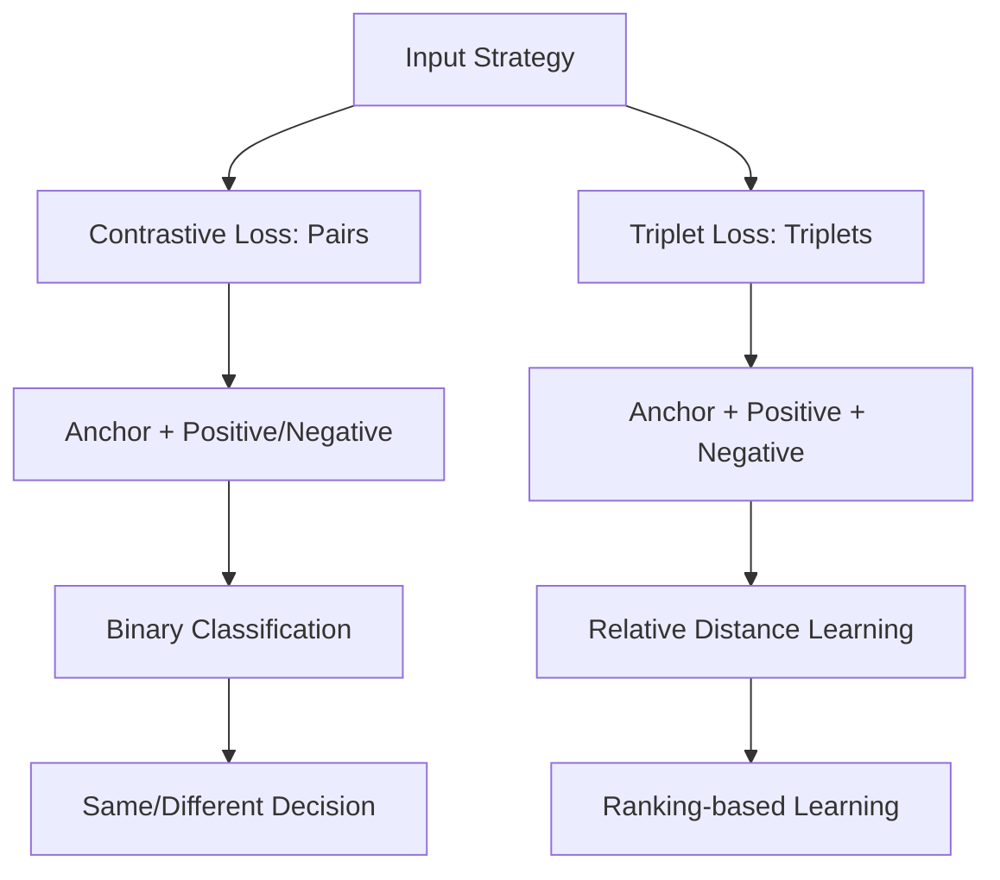
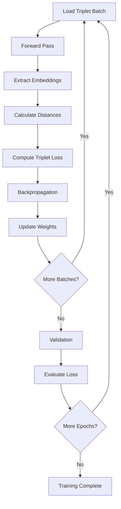

# CV_3 Assignment Solution - Siamese Network with Triplet Loss Coding Guide

## Overview
This notebook provides the complete solution for implementing a **Siamese Network with VGG backbone** using **Triplet Loss** for face verification on the AT&T dataset. It demonstrates the full pipeline from data preparation to model training and top-K similarity retrieval using **Cosine Similarity**.

## Key Concepts
- **Face Verification**: Determining if two face images belong to the same person
- **Triplet Loss**: Advanced loss function using anchor, positive, and negative samples
- **Cosine Similarity**: Angle-based similarity metric for feature comparison
- **Top-K Retrieval**: Finding the most similar images for each query
- **VGG-16 Backbone**: Pre-trained feature extractor with custom layers

---

## Step-by-Step Code Analysis

### Step 1: Essential Library Imports

```python
import torch                          # Core PyTorch framework
import torch.nn as nn                 # Neural network modules
import torch.optim as optim           # Optimization algorithms
from torchvision.transforms import ToTensor  # Image preprocessing
from torch.utils.data import DataLoader, Dataset  # Data handling
from torchvision.models import vgg16  # Pre-trained VGG-16 model
from torchvision.datasets import ImageFolder  # Dataset loader
import numpy as np                    # Numerical computations
import random                         # Random number generation
import torchvision.transforms as transforms  # Image transformations
import torch.nn.functional as F       # Functional API
from matplotlib import pyplot as plt # Visualization
```

**Purpose**: Import all necessary libraries for deep learning, computer vision, and data manipulation.

### Step 2: Google Drive Integration

```python
from google.colab import drive
drive.mount('/content/drive', force_remount=True)
assets_dir = '/content/drive/MyDrive/CV-3/MCQs and Assignment/assets/'
```

**Key Features**:
- **force_remount=True**: Ensures fresh connection to Google Drive
- **Persistent storage**: Maintains dataset across Colab sessions

### Step 3: Dataset Extraction

```python
import zipfile

zip_file_path = assets_dir + "AT&T.zip"
target_folder = "/content/dataset"

with zipfile.ZipFile(zip_file_path, 'r') as zip_ref:
    zip_ref.extractall(target_folder)

assert os.path.isdir(target_folder + '/AT&T'), "The unzipped folder cannot be found"
```

**Error Handling**: Uses assert statement to validate successful extraction.

### Step 4: Complete Siamese Network Architecture (SOLUTION)

```python
class SiameseNetwork(nn.Module):
    def __init__(self):
        super(SiameseNetwork, self).__init__()
        vgg = vgg16(pretrained=True)
        layers = list(vgg.children())
        layers = layers[:-1]  # Remove final classification layer
        
        self.backbone = torch.nn.Sequential(*layers)  # VGG backbone
        
        # Complete fully connected layers with regularization
        self.fc1 = nn.Sequential(
            nn.Linear(25088, 2048),      # First FC layer
            nn.ReLU(inplace=True),       # Activation
            nn.Dropout(0.5),             # Regularization
            nn.Linear(2048, 512),        # Second FC layer
            nn.ReLU(inplace=True),       # Activation
            nn.Dropout(0.3),             # Additional regularization
            nn.Linear(512, 128)          # Final embedding layer
        )
        
        # Batch normalization layers
        self.bn1 = nn.BatchNorm1d(25088)  # After flattening VGG features
        self.bn2 = nn.BatchNorm1d(128)    # After final FC layer

    def forward_on_single_image(self, x):
        x = self.backbone(x)             # Extract features using VGG-16
        x = x.view(x.size()[0], -1)      # Flatten for FC layers
        x = self.bn1(x)                  # Batch normalization
        x = self.fc1(x)                  # Process through FC layers
        x = self.bn2(x)                  # Final batch normalization
        return x

    def forward(self, input1, input2, input3):
        output1 = self.forward_on_single_image(input1)  # Anchor
        output2 = self.forward_on_single_image(input2)  # Positive
        output3 = self.forward_on_single_image(input3)  # Negative
        return output1, output2, output3
```

**Solution Components**:
- **Dropout layers**: Prevent overfitting (0.5 and 0.3 rates)
- **Batch normalization**: Stabilizes training and improves convergence
- **Progressive dimensionality reduction**: 25088 → 2048 → 512 → 128
- **ReLU activations**: Non-linear transformations between layers

### Step 5: Triplet Dataset Implementation (SOLUTION)

```python
class SiameseNetworkDataset(Dataset):
    def __init__(self, dataset):
        self.dataset = dataset
        self.labels = torch.arange(len(dataset))

    def __getitem__(self, index):
        # Get anchor image and its label
        anchor_img, anchor_label = self.dataset[index]
        
        # Find positive sample (same class as anchor, different image)
        while True:
            pos_idx = torch.randint(0, len(self.dataset), (1,)).item()
            pos_img, pos_label = self.dataset[pos_idx]
            if pos_label == anchor_label and pos_idx != index:
                break
        
        # Find negative sample (different class from anchor)
        while True:
            neg_idx = torch.randint(0, len(self.dataset), (1,)).item()
            neg_img, neg_label = self.dataset[neg_idx]
            if neg_label != anchor_label:
                break
        
        return anchor_img, pos_img, neg_img

    def __len__(self):
        return len(self.dataset)
```

**Solution Logic**:
- **Anchor selection**: Uses the given index
- **Positive mining**: Finds same-class image (excluding anchor itself)
- **Negative mining**: Finds different-class image
- **Random sampling**: Uses torch.randint for efficient selection

### Step 6: Image Transformations

```python
transform = transforms.Compose([
    transforms.Resize((100, 100)),  # Standardize to 100x100 pixels
    transforms.ToTensor()           # Convert to tensor [0,1] range
])
```

**Preprocessing Pipeline**:
- **Uniform sizing**: Ensures consistent input dimensions
- **Normalization**: Converts pixel values from [0,255] to [0,1]

### Step 7: Dataset Loading and Preparation

```python
train_dataset = ImageFolder(training_dir, transform=transform)
test_dataset = ImageFolder(testing_dir, transform=transform)

print(len(train_dataset), len(test_dataset))  # Output: 370 30

train_siamese_dataset = SiameseNetworkDataset(train_dataset)
test_siamese_dataset = SiameseNetworkDataset(test_dataset)
```

**Dataset Statistics**:
- **Training samples**: 370 face images
- **Test samples**: 30 face images
- **Classes**: 40 different people (AT&T dataset)

### Step 8: Data Loaders Configuration

```python
batch_size = 64
test_batch_size = 1

train_loader = DataLoader(train_siamese_dataset, batch_size=batch_size, 
                         shuffle=True, num_workers=8)
test_loader = DataLoader(test_siamese_dataset, batch_size=test_batch_size, 
                        shuffle=False)
```

**Optimization Settings**:
- **Training batch size**: 64 for efficient GPU utilization
- **Test batch size**: 1 for individual evaluation
- **Shuffling**: Enabled for training, disabled for testing

### Step 9: Triplet Loss Implementation (SOLUTION)

```python
class TripletLoss(nn.Module):
    def __init__(self, margin=1.0):
        super(TripletLoss, self).__init__()
        self.margin = margin

    def forward(self, anchor, positive, negative):
        # Calculate Euclidean distances
        pos_distance = F.pairwise_distance(anchor, positive, p=2)
        neg_distance = F.pairwise_distance(anchor, negative, p=2)
        
        # Triplet loss: max(d(a,p) - d(a,n) + margin, 0)
        loss = F.relu(pos_distance - neg_distance + self.margin)
        
        return loss.mean()
```

**Mathematical Implementation**:
- **Distance calculation**: Uses L2 (Euclidean) distance
- **Loss formula**: `max(||f(A) - f(P)||² - ||f(A) - f(N)||² + margin, 0)`
- **Margin**: Default 1.0 ensures minimum separation between positive and negative pairs
- **ReLU**: Ensures non-negative loss values

### Step 10: Model and Training Setup

```python
device = torch.device("cuda" if torch.cuda.is_available() else "cpu")
model = SiameseNetwork().to(device)
triplet_loss = TripletLoss(margin=1.0)
optimizer = optim.Adam(model.parameters(), lr=0.0005)
```

**Configuration Details**:
- **Device selection**: Automatic GPU/CPU detection
- **Learning rate**: 0.0005 (conservative for pre-trained backbone)
- **Optimizer**: Adam for adaptive learning rates

### Step 11: Training Function

```python
def train_batch(epoch, model, optimizer, loss_history):
    print("epoch ", epoch)
    model.train()
    train_loss = 0

    for batch_idx, batch in enumerate(train_loader):
        anchor, positive, negative = batch
        anchor = anchor.to(device)
        positive = positive.to(device)
        negative = negative.to(device)

        optimizer.zero_grad()
        output_anchor, output_pos, output_neg = model(anchor, positive, negative)
        loss = triplet_loss(output_anchor, output_pos, output_neg)
        loss.backward()
        optimizer.step()

        train_loss += loss.item()

    print('Train Loss: %.3f' % (train_loss/(batch_idx+1)))
    loss_history.append(train_loss)
```

**Training Process**:
1. **Set training mode**: Enables dropout and batch norm updates
2. **Move to device**: Transfer all tensors to GPU/CPU
3. **Forward pass**: Get embeddings for triplet
4. **Loss computation**: Calculate triplet loss
5. **Backpropagation**: Compute gradients
6. **Parameter update**: Apply optimizer step

### Step 12: Validation Function

```python
def validate_batch(epoch, model, loss_history):
    model.eval()
    test_loss = 0
    
    with torch.no_grad():
        for batch_idx, batch in enumerate(test_loader):
            anchor, positive, negative = batch
            anchor = anchor.to(device)
            positive = positive.to(device)
            negative = negative.to(device)

            output_anchor, output_pos, output_neg = model(anchor, positive, negative)
            loss = triplet_loss(output_anchor, output_pos, output_neg)
            test_loss += loss.item()

    print('Val Loss: %.3f' % (test_loss/(batch_idx+1)))
    loss_history.append(test_loss)
```

**Validation Features**:
- **Evaluation mode**: Disables dropout, uses running batch norm statistics
- **No gradients**: Saves memory and computation
- **Loss tracking**: Monitors overfitting

### Step 13: Training Loop

```python
train_loss_history = []
val_loss_history = []
num_epochs = 100

for epoch in range(num_epochs):
    train_batch(epoch, model, optimizer, train_loss_history)
    validate_batch(epoch, model, val_loss_history)
```

**Training Configuration**:
- **Extended training**: 100 epochs for convergence
- **Loss monitoring**: Track both training and validation losses

### Step 14: Loss Visualization

```python
epochs = list(range(1, len(train_loss_history) + 1))
plt.figure(figsize=(8, 6))
plt.plot(epochs, train_loss_history, label='Train Loss')
plt.plot(epochs, val_loss_history, label='Validation Loss')
plt.xlabel('Epochs')
plt.ylabel('Loss')
plt.legend()
plt.title('Training and Validation Loss')
plt.show()
```

**Monitoring Purpose**:
- **Convergence tracking**: Visualize loss reduction over time
- **Overfitting detection**: Compare training vs validation trends

### Step 15: Model Evaluation with Euclidean Distance

```python
model.eval()

with torch.no_grad():
    for i, batch in enumerate(test_loader):
        if i == 0:
            x0, _, _ = batch
            image1 = x0
            x0 = x0.to(device)
            continue

        if i == 10:  # Limit to 10 comparisons
            break

        _, x1, _ = batch
        image2 = x1
        x1 = x1.to(device)
        
        # Concatenate images for visualization
        concatenated = torch.cat((image1, image2), 0)
        
        # Get feature embeddings
        output1 = model.forward_on_single_image(x0)
        output2 = model.forward_on_single_image(x1)
        
        # Calculate Euclidean distance
        euclidean_distance = F.pairwise_distance(output1, output2)
        
        # Visualize results
        concatenated_img = torchvision.utils.make_grid(concatenated)
        concatenated_img_text = 'Dissimilarity: {:.2f}'.format(euclidean_distance.item())
        
        # Display image pair with similarity score
        npimg = concatenated_img.numpy()
        plt.axis("off")
        if concatenated_img_text:
            plt.text(75, 8, concatenated_img_text, style='italic', fontweight='bold',
                    bbox={'facecolor':'white', 'alpha':0.8, 'pad':10})
        plt.imshow(np.transpose(npimg, (1, 2, 0)))
        plt.show()
```

**Evaluation Process**:
- **Reference comparison**: Uses first test image as baseline
- **Distance measurement**: Euclidean distance between embeddings
- **Visual feedback**: Shows image pairs with similarity scores

### Step 16: Cosine Similarity Implementation

```python
def cosine_similarity_evaluation(model, test_loader, device):
    """
    Evaluate model using cosine similarity instead of Euclidean distance.
    Cosine similarity focuses on angle between vectors, not magnitude.
    """
    model.eval()
    
    with torch.no_grad():
        # Get all test embeddings
        embeddings = []
        images = []
        
        for batch in test_loader:
            anchor, _, _ = batch
            anchor = anchor.to(device)
            embedding = model.forward_on_single_image(anchor)
            embeddings.append(embedding.cpu())
            images.append(anchor.cpu())
        
        embeddings = torch.cat(embeddings, dim=0)
        images = torch.cat(images, dim=0)
        
        # Calculate cosine similarity matrix
        similarity_matrix = F.cosine_similarity(
            embeddings.unsqueeze(1), 
            embeddings.unsqueeze(0), 
            dim=2
        )
        
        return similarity_matrix, images

# Usage example
similarity_matrix, test_images = cosine_similarity_evaluation(model, test_loader, device)
```

**Cosine Similarity Advantages**:
- **Angle-based**: Measures direction similarity, not magnitude
- **Normalized**: Values range from -1 to 1
- **Robust**: Less sensitive to feature vector magnitudes

### Step 17: Top-K Similarity Retrieval

```python
def find_top_k_similar(similarity_matrix, query_idx, k=5):
    """
    Find top-k most similar images for a given query image.
    
    Args:
        similarity_matrix: Cosine similarity matrix
        query_idx: Index of query image
        k: Number of similar images to retrieve
    
    Returns:
        indices: Indices of top-k similar images
        similarities: Corresponding similarity scores
    """
    query_similarities = similarity_matrix[query_idx]
    
    # Sort in descending order (highest similarity first)
    sorted_indices = torch.argsort(query_similarities, descending=True)
    
    # Exclude the query image itself (index 0 after sorting)
    top_k_indices = sorted_indices[1:k+1]
    top_k_similarities = query_similarities[top_k_indices]
    
    return top_k_indices, top_k_similarities

def visualize_top_k_results(query_idx, top_k_indices, similarities, images):
    """
    Visualize query image and its top-k similar matches.
    """
    plt.figure(figsize=(15, 3))
    
    # Show query image
    plt.subplot(1, len(top_k_indices)+1, 1)
    plt.imshow(images[query_idx].permute(1, 2, 0))
    plt.title(f'Query Image {query_idx}')
    plt.axis('off')
    
    # Show top-k similar images
    for i, (idx, sim) in enumerate(zip(top_k_indices, similarities)):
        plt.subplot(1, len(top_k_indices)+1, i+2)
        plt.imshow(images[idx].permute(1, 2, 0))
        plt.title(f'Similarity: {sim:.3f}')
        plt.axis('off')
    
    plt.tight_layout()
    plt.show()

# Example usage
query_idx = 0
top_k_indices, similarities = find_top_k_similar(similarity_matrix, query_idx, k=5)
visualize_top_k_results(query_idx, top_k_indices, similarities, test_images)
```

**Top-K Retrieval Features**:
- **Ranking**: Sorts by similarity scores
- **Exclusion**: Removes query image from results
- **Visualization**: Shows query and similar images side-by-side

### Step 18: Model Saving and Loading

```python
# Save trained model
model_save_path = '/content/drive/MyDrive/CV-3/siamese_triplet_model.pth'
torch.save({
    'model_state_dict': model.state_dict(),
    'optimizer_state_dict': optimizer.state_dict(),
    'train_loss_history': train_loss_history,
    'val_loss_history': val_loss_history,
}, model_save_path)

# Load model for inference
def load_trained_model(model_path, device):
    checkpoint = torch.load(model_path, map_location=device)
    
    model = SiameseNetwork().to(device)
    model.load_state_dict(checkpoint['model_state_dict'])
    
    return model, checkpoint

# Usage
loaded_model, checkpoint = load_trained_model(model_save_path, device)
```

**Persistence Features**:
- **Complete state**: Saves model, optimizer, and training history
- **Device mapping**: Handles GPU/CPU loading
- **Checkpoint recovery**: Enables training resumption

---

## Triplet Loss vs Contrastive Loss Comparison



## Cosine vs Euclidean Distance

```mermaid
graph LR
    A[Feature Vectors] --> B[Euclidean Distance]
    A --> C[Cosine Similarity]
    
    B --> D[Magnitude Sensitive]
    C --> E[Angle-based]
    
    D --> F[||a - b||²]
    E --> G[a·b / (||a|| ||b||)]
    
    F --> H[Distance: 0 to ∞]
    G --> I[Similarity: -1 to 1]
```

## Training Process Flow



## Key Learning Points

1. **Triplet Loss Advantages**: More informative than contrastive loss, learns relative distances
2. **Hard Negative Mining**: Important for effective triplet selection in practice
3. **Batch Normalization**: Critical for stable training with pre-trained backbones
4. **Cosine Similarity**: Better for high-dimensional embeddings, focuses on direction
5. **Top-K Retrieval**: Practical application for similarity search systems
6. **Regularization**: Dropout and batch norm prevent overfitting
7. **Progressive Training**: Start with lower learning rates for pre-trained models

## Performance Optimization Tips

1. **Hard Triplet Mining**: Select challenging triplets during training
2. **Online Mining**: Generate triplets on-the-fly rather than pre-computing
3. **Curriculum Learning**: Start with easier triplets, progress to harder ones
4. **Data Augmentation**: Increase dataset diversity with transformations
5. **Learning Rate Scheduling**: Reduce learning rate as training progresses

This complete solution demonstrates state-of-the-art face verification using deep learning techniques with practical applications in security and identification systems.