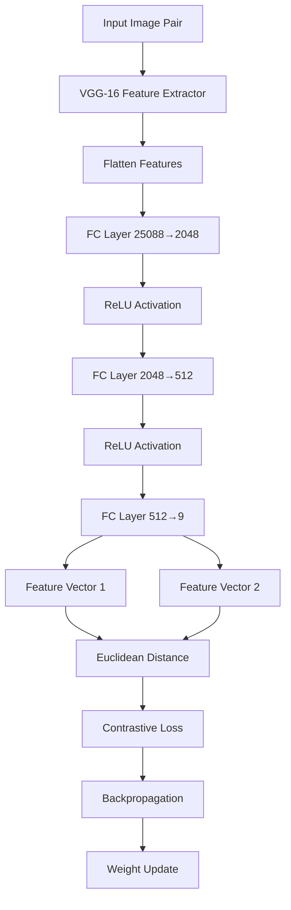
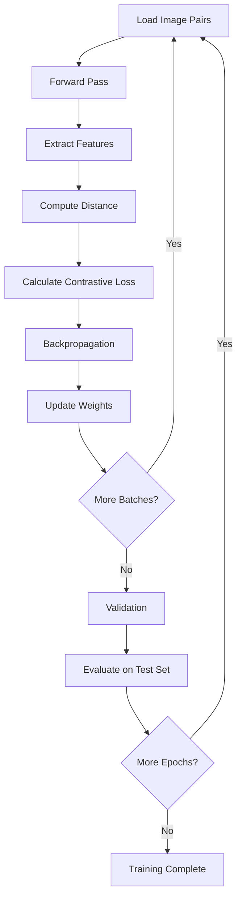

# Computer Vision 3 - Image Similarity Coding Guide

## Overview
This notebook demonstrates how to build a **Siamese Network** for image similarity comparison using PyTorch. Siamese Networks are neural networks that learn to compare two inputs and determine their similarity, commonly used for face verification, signature verification, and image matching tasks.

## Key Concepts
- **Siamese Networks**: Twin neural networks with shared weights that process two inputs simultaneously
- **Contrastive Loss**: A loss function that pulls similar pairs closer and pushes dissimilar pairs apart
- **VGG-16 Backbone**: Pre-trained convolutional neural network used as feature extractor
- **AT&T Face Dataset**: Grayscale face images from 40 subjects with 10 images per subject

---

## Step-by-Step Code Analysis

### Step 1: Dataset Setup and Google Drive Integration

```python
import os  # File system operations

local_assets_b = False  # Flag for asset location

if local_assets_b:
    assets_dir = "/content/assets/P3/"
    if not os.path.isdir(assets_dir):
        assert os.path.isfile("assets.zip")
        os.system("unzip assets.zip")
else:
    from google.colab import drive  # Google Colab drive mounting
    drive.mount('/content/drive')
    assets_dir = '/content/drive/MyDrive/CV-3/assets/P3/'
```

**Purpose**: 
- **os module**: Handles file system operations like checking directories and extracting files
- **google.colab.drive**: Allows mounting Google Drive in Colab environment for persistent storage
- **Conditional logic**: Switches between local storage and Google Drive based on the flag

**Key Arguments**:
- `local_assets_b`: Boolean flag determining storage location
- `assets_dir`: String path to the dataset directory

### Step 2: Dataset Extraction

```python
import zipfile

zip_file_path = assets_dir + "AT&T.zip"
target_folder = "/content/drive/MyDrive/CV-3/assets/P3/dataset"

with zipfile.ZipFile(zip_file_path, 'r') as zip_ref:
    zip_ref.extractall(target_folder)
```

**Purpose**:
- **zipfile module**: Python's built-in module for handling ZIP archives
- **Context manager (`with`)**: Ensures proper file handling and automatic cleanup
- **extractall()**: Extracts all contents of the ZIP file to the target directory

### Step 3: Essential Library Imports

```python
import torch                          # Core PyTorch library
import torch.nn as nn                 # Neural network modules
import torch.optim as optim           # Optimization algorithms
from torchvision.transforms import ToTensor  # Image preprocessing
from torch.utils.data import DataLoader, Dataset  # Data handling
from torchvision.models import vgg16  # Pre-trained VGG-16 model
from torchvision.datasets import ImageFolder  # Dataset loader for image folders
import numpy as np                    # Numerical computations
import random                         # Random number generation
import torchvision.transforms as transforms  # Image transformations
import torch.nn.functional as F       # Functional API for neural networks
from matplotlib import pyplot as plt # Plotting and visualization
```

**Why These Libraries**:
- **torch**: Core deep learning framework
- **torch.nn**: Provides neural network layers and modules
- **torch.optim**: Contains optimization algorithms like Adam, SGD
- **torchvision**: Computer vision utilities and pre-trained models
- **numpy**: Efficient numerical operations and array handling
- **matplotlib**: Creating plots and visualizing results

### Step 4: Visualization Functions

```python
def imshow(img, text=None, should_save=False):
    """Display an image with optional text overlay"""
    npimg = img.numpy()  # Convert tensor to numpy array
    plt.axis("off")      # Remove axes for cleaner display
    
    if text:
        plt.text(75, 8, text, style='italic', fontweight='bold',
                 bbox={'facecolor': 'white', 'alpha': 0.8, 'pad': 10})
    
    plt.imshow(np.transpose(npimg, (1, 2, 0)))  # Reorder channels for display
    plt.show()

def show_plot(iteration, loss):
    """Plot loss values over training iterations"""
    plt.plot(iteration, loss)
    plt.xlabel('Iterations')
    plt.ylabel('Loss')
    plt.title('Loss over Iterations')
    plt.show()
```

**Key Functions**:
- **imshow()**: Displays PyTorch tensors as images
  - `img.numpy()`: Converts PyTorch tensor to NumPy array
  - `np.transpose()`: Changes channel order from (C,H,W) to (H,W,C) for matplotlib
  - `plt.text()`: Adds text overlay with styling options
- **show_plot()**: Creates loss curves for monitoring training progress

### Step 5: Dataset Directory Configuration

```python
training_dir = "/content/drive/MyDrive/CV-3/assets/P3/dataset/AT&T/train"
testing_dir = "/content/drive/MyDrive/CV-3/assets/P3/dataset/AT&T/test/"
```

**Purpose**: Define paths to training and testing datasets for organized data access.

### Step 6: Image Preprocessing and Device Setup

```python
device = torch.device("cuda" if torch.cuda.is_available() else "cpu")

transform = transforms.Compose([
    transforms.Resize((100, 100)),  # Standardize image size
    transforms.ToTensor()           # Convert to tensor and normalize [0,1]
])
```

**Key Components**:
- **Device selection**: Automatically uses GPU if available, otherwise CPU
- **transforms.Compose()**: Chains multiple transformations together
- **transforms.Resize()**: Ensures all images have uniform dimensions (100x100)
- **transforms.ToTensor()**: Converts PIL images to PyTorch tensors and normalizes pixel values from [0,255] to [0,1]

### Step 7: Custom Siamese Dataset Class

```python
class SiameseNetworkDataset(Dataset):
    def __init__(self, dataset):
        self.dataset = dataset
        self.labels = torch.arange(len(dataset))

    def __getitem__(self, index):
        should_get_same_class = random.randint(0, 1)
        
        if should_get_same_class:
            img1, label1 = self.dataset[index]
            # Find another image with same label
            while True:
                index2 = torch.randint(0, len(self.dataset), (1,))
                img2, label2 = self.dataset[index2]
                if label2 == label1:
                    break
            return img1, img2, torch.tensor(np.array([int(1)], dtype=np.float32))
        else:
            img1, label1 = self.dataset[index]
            # Find image with different label
            while True:
                index2 = torch.randint(0, len(self.dataset), (1,))
                img2, label2 = self.dataset[index2]
                if label2 != label1:
                    break
            return img1, img2, torch.tensor(np.array([int(0)], dtype=np.float32))

    def __len__(self):
        return len(self.dataset)
```

**Purpose**: Creates pairs of images for Siamese Network training
**Key Methods**:
- **`__init__()`**: Initializes the dataset wrapper
- **`__getitem__()`**: Returns image pairs with similarity labels
  - `random.randint(0, 1)`: Randomly decides whether to create same-class or different-class pairs
  - `torch.randint()`: Generates random indices for second image selection
  - Returns tuple: (image1, image2, label) where label is 1 for same class, 0 for different
- **`__len__()`**: Returns dataset size

### Step 8: Dataset Loading and Preparation

```python
train_dataset = ImageFolder(training_dir, transform=transform)
test_dataset = ImageFolder(testing_dir, transform=transform)

train_siamese_dataset = SiameseNetworkDataset(train_dataset)
test_siamese_dataset = SiameseNetworkDataset(test_dataset)
```

**Purpose**:
- **ImageFolder**: PyTorch utility that automatically loads images from folder structure
- Applies transformations to each image during loading
- Wraps datasets in Siamese format for pair-wise comparison

### Step 9: Data Loaders Creation

```python
train_batch_size = 64
test_batch_size = 1

train_loader = DataLoader(train_siamese_dataset, batch_size=train_batch_size, 
                         shuffle=True, num_workers=8)
test_loader = DataLoader(test_siamese_dataset, batch_size=test_batch_size, 
                        shuffle=False)
```

**Key Parameters**:
- **batch_size**: Number of samples processed together (64 for training, 1 for testing)
- **shuffle**: Randomizes data order during training to prevent overfitting
- **num_workers**: Number of parallel processes for data loading (speeds up training)

### Step 10: Siamese Network Architecture

```python
class SiameseNetwork(nn.Module):
    def __init__(self):
        super(SiameseNetwork, self).__init__()
        
        vgg = vgg16(pretrained=True)  # Load pre-trained VGG-16
        layers = list(vgg.children())
        layers = layers[:-1]  # Remove final classification layer
        
        self.fc0 = torch.nn.Sequential(*layers)  # Feature extractor
        
        self.fc1 = nn.Sequential(
            nn.Linear(25088, 2048),  # Reduce dimensionality
            nn.ReLU(inplace=True),   # Non-linear activation
            nn.Linear(2048, 512),    # Further reduction
            nn.ReLU(inplace=True),
            nn.Linear(512, 9)        # Final feature vector
        )

    def forward_on_single_batch(self, x):
        x = self.fc0(x)              # Extract features using VGG-16
        x = x.view(x.size()[0], -1)  # Flatten for fully connected layers
        x = self.fc1(x)              # Process through FC layers
        return x

    def forward(self, input1, input2):
        output1 = self.forward_on_single_batch(input1)
        output2 = self.forward_on_single_batch(input2)
        return output1, output2
```

**Architecture Components**:
- **VGG-16 Backbone**: Pre-trained feature extractor (removes final classification layer)
- **Fully Connected Layers**: Process extracted features
  - `nn.Linear(25088, 2048)`: First FC layer (25088 is VGG-16 output size)
  - `nn.ReLU()`: Rectified Linear Unit activation function
  - `inplace=True`: Memory optimization by modifying tensors in-place
- **Shared Weights**: Both images pass through the same network architecture

### Step 11: Optimizer Configuration

```python
lr = 0.001  # Learning rate
optimizer = optim.Adam(model.parameters(), lr=lr)
```

**Purpose**:
- **Learning Rate**: Controls step size during weight updates (0.001 is a common starting point)
- **Adam Optimizer**: Adaptive learning rate algorithm that combines momentum and RMSprop
  - Automatically adjusts learning rates for each parameter
  - Generally converges faster than standard SGD

### Step 12: Contrastive Loss Function

```python
class ContrastiveLoss(torch.nn.Module):
    def __init__(self, margin=2.0):
        super(ContrastiveLoss, self).__init__()
        self.margin = margin

    def forward(self, output1, output2, label):
        euclidean_distance = F.pairwise_distance(output1, output2)
        
        loss_contrastive = torch.mean(
            (label) * torch.pow(euclidean_distance, 2) +
            (1 - label) * torch.pow(torch.clamp(self.margin - euclidean_distance, min=0.0), 2)
        )
        return loss_contrastive
```

**Key Components**:
- **Margin**: Minimum distance enforced between dissimilar pairs (default 2.0)
- **Euclidean Distance**: Measures similarity between feature vectors
- **Loss Calculation**:
  - Similar pairs (label=1): Minimize distance squared
  - Dissimilar pairs (label=0): Ensure distance is at least margin
- **torch.clamp()**: Ensures values don't go below minimum threshold

### Step 13: Training Function

```python
def train_batch(epoch, model, optimizer, loss_history):
    model.train()  # Enable training mode
    train_loss = 0
    
    for batch_idx, batch in enumerate(train_loader):
        img1, img2, labels = batch
        img1, img2, labels = img1.to(device), img2.to(device), labels.to(device)
        
        optimizer.zero_grad()  # Clear previous gradients
        output1, output2 = model(img1, img2)  # Forward pass
        loss = contrastive_loss(output1, output2, labels)  # Compute loss
        
        loss.backward()  # Backpropagation
        optimizer.step()  # Update weights
        
        train_loss += loss.item()
    
    print('Train Loss: %.3f' % (train_loss / (batch_idx + 1)))
    loss_history.append(train_loss)
```

**Training Steps**:
1. **model.train()**: Sets model to training mode (enables dropout, batch norm updates)
2. **optimizer.zero_grad()**: Clears gradients from previous iteration
3. **Forward pass**: Processes image pairs through network
4. **Loss computation**: Calculates contrastive loss
5. **loss.backward()**: Computes gradients via backpropagation
6. **optimizer.step()**: Updates model parameters

### Step 14: Validation Function

```python
def validate_batch(epoch, model, loss_history):
    model.eval()  # Set to evaluation mode
    test_loss = 0
    
    with torch.no_grad():  # Disable gradient computation
        for batch_idx, batch in enumerate(test_loader):
            img1, img2, labels = batch
            img1, img2, labels = img1.to(device), img2.to(device), labels.to(device)
            
            output1, output2 = model(img1, img2)
            loss = contrastive_loss(output1, output2, labels)
            test_loss += loss.item()
    
    print('Val Loss: %.3f' % (test_loss / (batch_idx + 1)))
    loss_history.append(test_loss)
```

**Validation Features**:
- **model.eval()**: Disables training-specific operations (dropout, batch norm updates)
- **torch.no_grad()**: Prevents gradient computation to save memory and speed up inference
- **No weight updates**: Only evaluates model performance without changing parameters

### Step 15: Training Loop

```python
from tqdm import tqdm
import time

train_loss_history = []
val_loss_history = []
num_epochs = 40

for epoch in tqdm(range(num_epochs), desc="Training epochs"):
    start_time = time.time()
    train_batch(epoch, model, optimizer, train_loss_history)
    validate_batch(epoch, model, val_loss_history)
    end_time = time.time()
    iteration_time = end_time - start_time
    tqdm.write(f"Epoch {epoch} took {iteration_time:.2f} seconds.")
```

**Training Loop Components**:
- **tqdm**: Progress bar library for tracking training progress
- **time module**: Measures execution time per epoch
- **num_epochs**: Number of complete passes through the dataset
- **Loss tracking**: Stores training and validation losses for analysis

### Step 16: Loss Visualization

```python
epochs = list(range(1, len(train_loss_history) + 1))
plt.figure(figsize=(8, 6))

plt.plot(epochs, train_loss_history, label='Train Loss')
plt.plot(epochs, val_loss_history, label='Validation Loss')
plt.xlabel('Epochs')
plt.ylabel('Loss')
plt.legend()
plt.title('Training and Validation Loss')
plt.show()
```

**Visualization Purpose**:
- Monitor training progress and detect overfitting
- Compare training vs validation loss trends
- Identify optimal stopping point for training

### Step 17: Model Saving and Loading

```python
# Save model
state_dict = model.state_dict()
torch.save(state_dict, assets_dir + "siamese_model_state_dict.pt")

# Load model
file_path = assets_dir + 'siamese_model_state_dict.pt'
loaded_model = SiameseNetwork()
loaded_model.load_state_dict(torch.load(file_path))
loaded_model = loaded_model.to(device)
```

**Model Persistence**:
- **state_dict()**: Contains all learnable parameters
- **torch.save()**: Serializes model parameters to disk
- **load_state_dict()**: Restores saved parameters to model

### Step 18: Model Testing and Inference

```python
loaded_model.eval()

with torch.no_grad():
    dataiter = iter(test_loader)
    x0, _, _ = next(dataiter)  # Get first test image
    image1 = x0
    x0 = x0.to(device)
    
    for i in range(10):
        _, x1, label2 = next(dataiter)
        image2 = x1
        x1 = x1.to(device)
        
        concatenated = torch.cat((image1, image2), 0)  # Combine images for display
        output1, output2 = loaded_model(x0, x1)  # Extract features
        euclidean_distance = F.pairwise_distance(output1, output2)  # Compute similarity
        
        imshow(torchvision.utils.make_grid(concatenated),
               'Dissimilarity: {:.2f}'.format(euclidean_distance.item()))
```

**Inference Process**:
- **torch.cat()**: Concatenates tensors for side-by-side image display
- **F.pairwise_distance()**: Computes Euclidean distance between feature vectors
- **torchvision.utils.make_grid()**: Arranges multiple images in a grid for visualization
- **Lower distance values**: Indicate higher similarity between images

---

## Network Architecture Flow



## Training Process Flow



## Key Learning Points

1. **Siamese Networks**: Learn similarity functions rather than classification
2. **Contrastive Loss**: Pulls similar pairs together, pushes dissimilar pairs apart
3. **Pre-trained Backbones**: VGG-16 provides powerful feature extraction
4. **Pair Generation**: Dynamic pairing creates balanced training data
5. **Distance Metrics**: Euclidean distance measures feature similarity
6. **Transfer Learning**: Pre-trained models accelerate training and improve performance

This implementation demonstrates a complete pipeline for image similarity learning using deep learning techniques.