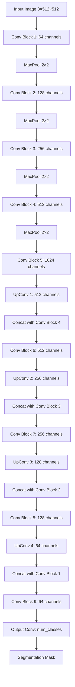
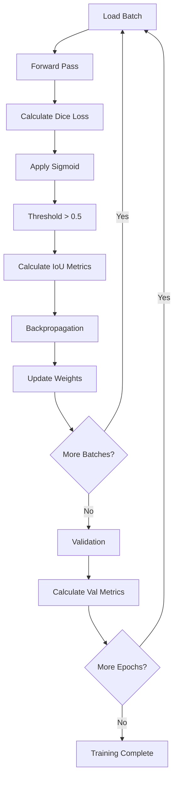

# Computer Vision 3 - UNet Image Segmentation Coding Guide

## Overview
This notebook demonstrates how to build and train a **UNet architecture** for semantic image segmentation using PyTorch. The implementation covers both a custom UNet from scratch and using the segmentation-models-pytorch library for practical applications on the Oxford Pet Dataset.

## Key Concepts
- **Image Segmentation**: Pixel-wise classification to identify different regions in an image
- **UNet Architecture**: Encoder-decoder network with skip connections for detailed segmentation
- **Semantic Segmentation**: Assigning class labels to each pixel in an image
- **Binary Segmentation**: Separating foreground (object) from background
- **Skip Connections**: Preserving fine details by connecting encoder and decoder layers

---

## Step-by-Step Code Analysis

### Step 1: Double Convolution Building Block

```python
import torch
import torch.nn as nn

def double_convolution(in_channels, out_channels):
    """
    Creates a block of two consecutive convolutional layers with ReLU activation.
    This is the fundamental building block used throughout UNet architecture.
    """
    conv_op = nn.Sequential(
        nn.Conv2d(in_channels, out_channels, kernel_size=3, padding=1),
        nn.ReLU(inplace=True),
        nn.Conv2d(out_channels, out_channels, kernel_size=3, padding=1),
        nn.ReLU(inplace=True)
    )
    return conv_op
```

**Purpose**: 
- **Modular Design**: Avoids code repetition since UNet uses this pattern extensively
- **Feature Extraction**: Two consecutive convolutions capture more complex patterns
- **Spatial Preservation**: `padding=1` maintains input dimensions after convolution

**Key Arguments**:
- `in_channels`: Number of input feature channels
- `out_channels`: Number of output feature channels
- `kernel_size=3`: 3x3 convolution filters for local pattern detection
- `padding=1`: Adds border pixels to maintain spatial dimensions
- `inplace=True`: Memory optimization by modifying tensors in-place

**Why This Design**:
- **Consistent Architecture**: Used in both encoder and decoder paths
- **Non-linearity**: ReLU activation enables learning complex patterns
- **Efficiency**: Sequential container groups operations for cleaner code

### Step 2: Complete UNet Architecture

```python
class UNet(nn.Module):
    def __init__(self, num_classes):
        super(UNet, self).__init__()
        
        # Shared pooling layer for downsampling
        self.max_pool2d = nn.MaxPool2d(kernel_size=2, stride=2)
        
        # Encoder (Contracting Path)
        self.down_convolution_1 = double_convolution(3, 64)
        self.down_convolution_2 = double_convolution(64, 128)
        self.down_convolution_3 = double_convolution(128, 256)
        self.down_convolution_4 = double_convolution(256, 512)
        self.down_convolution_5 = double_convolution(512, 1024)
        
        # Decoder (Expanding Path)
        self.up_transpose_1 = nn.ConvTranspose2d(1024, 512, kernel_size=2, stride=2)
        self.up_convolution_1 = double_convolution(1024, 512)
        
        self.up_transpose_2 = nn.ConvTranspose2d(512, 256, kernel_size=2, stride=2)
        self.up_convolution_2 = double_convolution(512, 256)
        
        self.up_transpose_3 = nn.ConvTranspose2d(256, 128, kernel_size=2, stride=2)
        self.up_convolution_3 = double_convolution(256, 128)
        
        self.up_transpose_4 = nn.ConvTranspose2d(128, 64, kernel_size=2, stride=2)
        self.up_convolution_4 = double_convolution(128, 64)
        
        # Final classification layer
        self.out = nn.Conv2d(64, num_classes, kernel_size=1)
```

**Architecture Components**:

**Encoder (Downsampling Path)**:
- **MaxPool2d**: Reduces spatial dimensions by half while preserving important features
- **Progressive Channel Increase**: 3→64→128→256→512→1024 channels
- **Feature Extraction**: Each level captures features at different scales

**Decoder (Upsampling Path)**:
- **ConvTranspose2d**: Upsamples feature maps to restore spatial resolution
- **Skip Connections**: Concatenates encoder features with decoder features
- **Channel Doubling**: Input channels double due to concatenation (e.g., 512+512=1024)

**Key Parameters**:
- `kernel_size=2, stride=2`: Doubles spatial dimensions during upsampling
- `kernel_size=1`: Final layer preserves spatial dimensions while changing channels

### Step 3: Forward Pass Implementation

```python
def forward(self, x):
    layer_outputs = []  # Track intermediate sizes for debugging
    
    # Encoder Path
    down_1 = self.down_convolution_1(x)
    layer_outputs.append(down_1.size())
    
    down_2 = self.max_pool2d(down_1)
    down_3 = self.down_convolution_2(down_2)
    layer_outputs.append(down_3.size())
    
    # ... (similar pattern for remaining encoder layers)
    
    # Decoder Path with Skip Connections
    up_1 = self.up_transpose_1(down_9)
    x = self.up_convolution_1(torch.cat([down_7, up_1], 1))  # Skip connection
    layer_outputs.append(x.size())
    
    # ... (similar pattern for remaining decoder layers)
    
    out = self.out(x)  # Final segmentation mask
    return out, layer_outputs
```

**Forward Pass Flow**:
1. **Encoder**: Progressively reduces spatial size while increasing feature depth
2. **Bottleneck**: Smallest spatial size with highest feature representation
3. **Decoder**: Restores spatial resolution while incorporating skip connections
4. **Skip Connections**: `torch.cat([encoder_features, decoder_features], 1)` concatenates along channel dimension

### Step 4: Model Testing and Parameter Analysis

```python
input_image = torch.rand((1, 3, 512, 512))  # Random test image
model = UNet(num_classes=10)

# Parameter counting
total_params = sum(p.numel() for p in model.parameters())
total_trainable_params = sum(p.numel() for p in model.parameters() if p.requires_grad)

output, layer_sizes = model(input_image)
```

**Parameter Analysis**:
- **p.numel()**: Returns number of elements in each parameter tensor
- **p.requires_grad**: Identifies trainable parameters (excludes frozen layers)
- **Layer size tracking**: Helps verify architecture correctness and debug dimension mismatches

### Step 5: Library Installation and Setup

```python
!pip install segmentation-models-pytorch
!pip install pytorch-lightning

import segmentation_models_pytorch as smp
import pytorch_lightning as pl
```

**Why These Libraries**:
- **segmentation-models-pytorch**: Provides pre-trained segmentation models and utilities
- **pytorch-lightning**: Simplifies training loops and model management
- **Pre-trained encoders**: Leverage ImageNet-trained backbones for better performance

### Step 6: Dataset Loading and Preparation

```python
from segmentation_models_pytorch.datasets import SimpleOxfordPetDataset

# Download and prepare dataset
root = "."
SimpleOxfordPetDataset.download(root)

# Create dataset splits
train_dataset = SimpleOxfordPetDataset(root, "train")
valid_dataset = SimpleOxfordPetDataset(root, "valid")
test_dataset = SimpleOxfordPetDataset(root, "test")
```

**Dataset Features**:
- **Oxford Pet Dataset**: Contains pet images with corresponding segmentation masks
- **Automatic Download**: Handles dataset downloading and extraction
- **Pre-split Data**: Provides train/validation/test splits for proper evaluation

### Step 7: Data Loader Configuration

```python
n_cpu = os.cpu_count()  # Get available CPU cores

train_dataloader = DataLoader(train_dataset, batch_size=16, shuffle=True, num_workers=n_cpu)
valid_dataloader = DataLoader(valid_dataset, batch_size=16, shuffle=False, num_workers=n_cpu)
test_dataloader = DataLoader(test_dataset, batch_size=16, shuffle=False, num_workers=n_cpu)
```

**DataLoader Parameters**:
- **batch_size=16**: Process 16 images simultaneously for efficient GPU utilization
- **shuffle=True**: Randomize training data order to prevent overfitting
- **num_workers**: Parallel data loading using multiple CPU cores
- **shuffle=False**: Keep validation/test order consistent for reproducible results

### Step 8: Data Visualization

```python
sample = train_dataset[0]
plt.subplot(1,2,1)
plt.imshow(sample["image"].transpose(1, 2, 0))  # Convert CHW to HWC
plt.subplot(1,2,2)
plt.imshow(sample["mask"].squeeze())  # Remove extra dimensions
plt.show()
```

**Visualization Purpose**:
- **Data Inspection**: Verify dataset loading and preprocessing
- **Format Understanding**: Images in CHW format, masks may have extra dimensions
- **Quality Check**: Ensure masks align properly with images

### Step 9: Advanced Model Definition with Pre-trained Encoder

```python
class PetModel(nn.Module):
    def __init__(self, arch, encoder_name, in_channels, out_classes, **kwargs):
        super().__init__()
        
        # Create segmentation model with pre-trained encoder
        self.model = smp.create_model(
            arch, encoder_name=encoder_name,
            in_channels=in_channels, classes=out_classes, **kwargs
        )
        
        # Get preprocessing parameters for the encoder
        params = smp.encoders.get_preprocessing_params(encoder_name)
        self.std = torch.tensor(params["std"]).view(1,3,1,1).to(device)
        self.mean = torch.tensor(params["mean"]).view(1,3,1,1).to(device)
        
        # Define loss function for segmentation
        self.loss_fn = smp.losses.DiceLoss(smp.losses.BINARY_MODE, from_logits=True)

    def forward(self, image):
        # Normalize input using encoder-specific statistics
        image = (image - self.mean) / self.std
        mask = self.model(image)
        return mask
```

**Advanced Features**:
- **Pre-trained Encoders**: Use ImageNet-trained backbones (ResNet, EfficientNet, etc.)
- **Automatic Preprocessing**: Encoder-specific normalization parameters
- **Dice Loss**: Specialized loss function for segmentation tasks
- **Transfer Learning**: Leverages pre-trained features for better performance

**Key Arguments**:
- `arch`: Architecture type (UNet, DeepLabV3, FPN, etc.)
- `encoder_name`: Pre-trained encoder (resnet34, efficientnet-b0, etc.)
- `in_channels`: Input image channels (3 for RGB)
- `out_classes`: Number of segmentation classes

### Step 10: Model Instantiation and Setup

```python
model = PetModel("Unet", "resnet34", in_channels=3, out_classes=1)
model = model.to(device)

# Loss function and optimizer
loss_fn = smp.losses.DiceLoss(smp.losses.BINARY_MODE, from_logits=True)
lr = 0.0001
optimizer = torch.optim.Adam(model.parameters(), lr=lr)
```

**Configuration Choices**:
- **UNet + ResNet34**: Proven combination for segmentation tasks
- **Binary Segmentation**: Single output class (pet vs background)
- **Dice Loss**: Handles class imbalance better than cross-entropy
- **Adam Optimizer**: Adaptive learning rate for stable training
- **Low Learning Rate**: Prevents disrupting pre-trained features

### Step 11: Metrics Calculation Function

```python
def calculate_metrics(metrics, stage="train"):
    # Aggregate confusion matrix components
    tp = torch.cat([x["tp"] for x in metrics])  # True Positives
    fp = torch.cat([x["fp"] for x in metrics])  # False Positives
    fn = torch.cat([x["fn"] for x in metrics])  # False Negatives
    tn = torch.cat([x["tn"] for x in metrics])  # True Negatives
    
    # Calculate IoU (Intersection over Union)
    per_image_iou = smp.metrics.iou_score(tp, fp, fn, tn, reduction="micro-imagewise")
    dataset_iou = smp.metrics.iou_score(tp, fp, fn, tn, reduction="micro")
    
    return {
        f"{stage}_per_image_iou": per_image_iou.cpu().item(),
        f"{stage}_dataset_iou": dataset_iou.cpu().item()
    }
```

**Metrics Explanation**:
- **IoU (Intersection over Union)**: Measures overlap between predicted and ground truth masks
- **True/False Positives/Negatives**: Confusion matrix components for binary classification
- **Per-image vs Dataset IoU**: Different aggregation methods for comprehensive evaluation
- **Micro-averaging**: Treats all pixels equally across the dataset

### Step 12: Training Function

```python
def train_batch(epoch, model, optimizer, loss_history, metric_history):
    model.train()  # Enable training mode
    train_loss = 0
    step_metrics = []
    
    for batch_idx, batch in enumerate(train_dataloader):
        image, mask = batch["image"].to(device), batch["mask"].to(device)
        
        # Forward pass
        logits_mask = model(image)
        loss = loss_fn(logits_mask, mask)
        
        # Convert logits to predictions
        prob_mask = logits_mask.sigmoid()
        pred_mask = (prob_mask > 0.5).float()
        
        # Backpropagation
        optimizer.zero_grad()
        loss.backward()
        optimizer.step()
        
        train_loss += loss.item()
        
        # Calculate metrics
        tp, fp, fn, tn = smp.metrics.get_stats(pred_mask.long(), mask.long(), mode='binary')
        step_metrics.append({"tp": tp, "fp": fp, "fn": fn, "tn": tn})
    
    # Aggregate and store metrics
    metrics = calculate_metrics(step_metrics)
    metric_history.append(metrics)
    loss_history.append(train_loss)
```

**Training Process**:
1. **model.train()**: Enables dropout and batch normalization updates
2. **Forward Pass**: Get model predictions (logits)
3. **Loss Calculation**: Dice loss between predictions and ground truth
4. **Sigmoid + Thresholding**: Convert logits to binary predictions
5. **Backpropagation**: Update model weights
6. **Metrics Tracking**: Calculate IoU and confusion matrix components

### Step 13: Validation Function

```python
def validate_batch(epoch, model, loss_history, metric_history):
    model.eval()  # Disable training-specific operations
    val_loss = 0
    step_metrics = []
    
    with torch.no_grad():  # Disable gradient computation
        for batch_idx, batch in enumerate(valid_dataloader):
            image, mask = batch["image"].to(device), batch["mask"].to(device)
            
            logits_mask = model(image)
            loss = loss_fn(logits_mask, mask)
            
            prob_mask = logits_mask.sigmoid()
            pred_mask = (prob_mask > 0.5).float()
            
            val_loss += loss.item()
            
            tp, fp, fn, tn = smp.metrics.get_stats(pred_mask.long(), mask.long(), mode='binary')
            step_metrics.append({"tp": tp, "fp": fp, "fn": fn, "tn": tn})
    
    metrics = calculate_metrics(step_metrics, "val")
    metric_history.append(metrics)
    loss_history.append(val_loss)
```

**Validation Features**:
- **model.eval()**: Disables dropout and uses running statistics for batch norm
- **torch.no_grad()**: Saves memory by not computing gradients
- **Same Metrics**: Consistent evaluation between training and validation

### Step 14: Training Loop

```python
train_loss_history = []
val_loss_history = []
train_metric_history = []
val_metric_history = []

for epoch in range(15):  # Train for 15 epochs
    train_batch(epoch, model, optimizer, train_loss_history, train_metric_history)
    validate_batch(epoch, model, val_loss_history, val_metric_history)
```

**Training Management**:
- **History Tracking**: Store loss and metrics for each epoch
- **Epoch Loop**: Complete training and validation for each epoch
- **Progress Monitoring**: Track model improvement over time

### Step 15: Results Visualization

```python
# Loss plotting
epochs = list(range(1, len(train_loss_history) + 1))
plt.figure(figsize=(8, 6))
plt.plot(epochs, train_loss_history, label='Train Loss')
plt.plot(epochs, val_loss_history, label='Validation Loss')
plt.xlabel('Epochs')
plt.ylabel('Loss')
plt.legend()
plt.title('Training and Validation Loss')
plt.show()

# IoU plotting
train_dataset_iou = [metric['train_dataset_iou'] for metric in train_metric_history]
val_dataset_iou = [metric['val_dataset_iou'] for metric in val_metric_history]

plt.figure(figsize=(8, 6))
plt.plot(epochs, train_dataset_iou, label='Train Dataset IOU')
plt.plot(epochs, val_dataset_iou, label='Validation Dataset IOU')
plt.xlabel('Epochs')
plt.ylabel('Dataset IOU')
plt.legend()
plt.title('Training and Validation Dataset IOU')
plt.show()
```

**Visualization Purpose**:
- **Loss Curves**: Monitor training progress and detect overfitting
- **IoU Trends**: Track segmentation quality improvement
- **Comparison**: Evaluate training vs validation performance

### Step 16: Model Inference and Results Display

```python
batch = next(iter(test_dataloader))

with torch.no_grad():
    model.eval()
    image = batch["image"].to(device)
    logits = model(image)
    pr_masks = logits.sigmoid()  # Convert to probabilities

# Visualize results
for image, gt_mask, pr_mask in zip(batch["image"], batch["mask"], pr_masks):
    plt.figure(figsize=(10, 5))
    
    plt.subplot(1, 3, 1)
    plt.imshow(image.numpy().transpose(1, 2, 0))  # Original image
    plt.title("Image")
    plt.axis("off")
    
    plt.subplot(1, 3, 2)
    plt.imshow(gt_mask.numpy().squeeze())  # Ground truth mask
    plt.title("Ground Truth")
    plt.axis("off")
    
    plt.subplot(1, 3, 3)
    plt.imshow(pr_mask.cpu().numpy().squeeze())  # Predicted mask
    plt.title("Prediction")
    plt.axis("off")
    
    plt.show()
```

**Inference Process**:
- **model.eval()**: Set to evaluation mode
- **torch.no_grad()**: Disable gradient computation for efficiency
- **Sigmoid Activation**: Convert logits to probability maps
- **Side-by-side Comparison**: Visual evaluation of model performance

---

## UNet Architecture Flow



## Training Process Flow



## Key Learning Points

1. **UNet Architecture**: Encoder-decoder with skip connections preserves fine details
2. **Double Convolution**: Fundamental building block for feature extraction
3. **Skip Connections**: Concatenate encoder features with decoder for better segmentation
4. **Dice Loss**: Specialized loss function for segmentation tasks
5. **IoU Metrics**: Standard evaluation metric for segmentation quality
6. **Pre-trained Encoders**: Transfer learning improves performance significantly
7. **Binary Segmentation**: Separating foreground objects from background
8. **Data Preprocessing**: Proper normalization crucial for pre-trained models

This implementation demonstrates both theoretical understanding (custom UNet) and practical application (using segmentation-models-pytorch) for real-world image segmentation tasks.