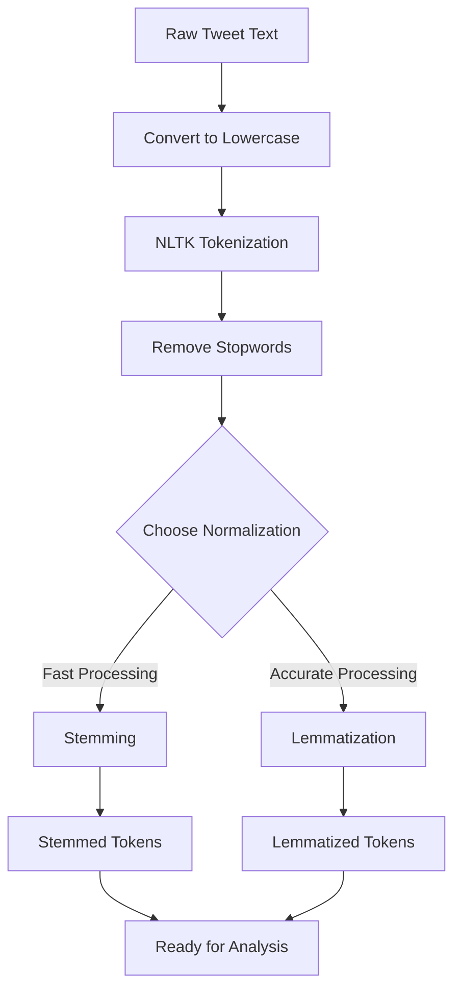

# NLP1 Intro: Tokenization, Stemming, and Lemmatization - Coding Guide

## Overview
This notebook introduces fundamental Natural Language Processing (NLP) concepts using a Twitter dataset containing airline customer feedback. The main focus is on text preprocessing techniques: tokenization, stemming, and lemmatization.

## Dataset Context
- **Source**: Kaggle Tweets dataset
- **Content**: US customer tweets about air travel experiences
- **Purpose**: Sentiment analysis of airline customer feedback

## Library Imports and Setup

### 1. Warning Management
```python
import warnings
warnings.filterwarnings("ignore")
```
**Purpose**: Suppresses warning messages during execution to keep output clean.

### 2. NLTK (Natural Language Toolkit)
```python
import nltk
```
**Purpose**: Primary NLP library for text processing tasks.
- **NLTK**: Comprehensive library for natural language processing
- **Key Features**: Tokenization, stemming, lemmatization, stopword removal

### 3. Data Manipulation Libraries
```python
import pandas as pd
import numpy as np
import csv
```
**Purpose**: 
- **pandas**: Data manipulation and analysis (DataFrames)
- **numpy**: Numerical operations and array handling
- **csv**: Reading/writing CSV files

### 4. NLTK Data Downloads
```python
nltk.download('punkt')          # Tokenizer models
nltk.download('stopwords')      # Common stopwords
nltk.download('wordnet')        # WordNet lexical database
nltk.download('averaged_perceptron_tagger')  # POS tagger
nltk.download('tagsets')        # Tag set help
```
**Purpose**: Downloads required NLTK datasets for text processing.

## Data Loading and Exploration

### 1. File Upload (Google Colab)
```python
from google.colab import files
uploaded = files.upload()
```
**Purpose**: Enables file upload in Google Colab environment.

### 2. Data Loading
```python
df = pd.read_csv('Tweets.csv')
```
**Purpose**: Loads the Twitter dataset into a pandas DataFrame.

### 3. Data Exploration
```python
df.head(2)  # Display first 2 rows
```
**Key Columns**:
- `text`: The actual tweet content
- `airline_sentiment`: Sentiment classification (positive/negative/neutral)
- `airline`: Airline company name
- `tweet_created`: Timestamp of tweet

### 4. Random Sample Display
```python
np.random.choice(df['text'], 5)
```
**Purpose**: Shows 5 random tweets to understand data variety.
**Arguments**:
- `df['text']`: Source array (tweet text column)
- `5`: Number of samples to select

## Text Preprocessing Pipeline

### 1. Basic Tokenization (Naive Approach)

#### Simple Split Method
```python
df.loc[:5,'text'].str.split(' ')
```
**Purpose**: Splits text by spaces (basic word separation).
**Issues**: 
- Doesn't handle punctuation properly
- Case sensitivity problems
- Special characters remain attached

#### Case Normalization
```python
df.loc[:5,'text'].str.lower().str.split(' ')
```
**Purpose**: Converts to lowercase before splitting.
**Method Chain**:
- `.str.lower()`: Converts all text to lowercase
- `.str.split(' ')`: Splits by space character

#### Manual Character Removal
```python
df.loc[:5,'text'].str.replace('@','').str.lower().str.split(' ')
```
**Purpose**: Removes @ symbols manually.
**Problems**: 
- Only handles one character type
- Many other special characters remain
- Punctuation still attached to words

### 2. NLTK Word Tokenization (Proper Approach)

#### Using word_tokenize()
```python
for each in df.loc[:5,'text'].str.lower():
    print(nltk.word_tokenize(each))
```
**Purpose**: Professional tokenization handling multiple edge cases.
**Advantages**:
- Separates punctuation from words
- Handles contractions (e.g., "didn't" → ["did", "n't"])
- Manages special characters properly
- Recognizes sentence boundaries

**Function Details**:
- `nltk.word_tokenize(text)`: Splits text into individual tokens
- **Input**: String of text
- **Output**: List of tokens (words and punctuation)

## Stopword Removal

### 1. Loading Stopwords
```python
from nltk.corpus import stopwords
sw_list = set(stopwords.words('english'))
```
**Purpose**: Loads predefined English stopwords.
**Stopwords**: Common words with little semantic meaning (e.g., "the", "is", "and").

### 2. Extending Stopword List
```python
sw_list.update(['@',"'",'.',"\"",'/','!',','"'ve","...","n't","'s"])
```
**Purpose**: Adds custom stopwords specific to social media text.
**Method**: `set.update()` adds multiple elements to the set.

### 3. Tokenization with Stopword Removal
```python
tokenized_data = []
for each in df.loc[:2,'text'].str.lower():
    tokenized_data.append(nltk.word_tokenize(each))
```
**Purpose**: Creates tokenized version of text data.
**Process**:
1. Convert text to lowercase
2. Apply NLTK tokenization
3. Store results in list

### 4. Filtering Stopwords
```python
filtered_data = []
for each_tweet in tokenized_data:
    filtered_data.append([word for word in each_tweet if word not in sw_list])
```
**Purpose**: Removes stopwords from tokenized text.
**List Comprehension**: `[word for word in each_tweet if word not in sw_list]`
- Iterates through each word in tweet
- Keeps only words not in stopword set
- Creates new filtered list

## Text Normalization Techniques

### 1. Stemming

#### Porter Stemmer
```python
from nltk.stem import PorterStemmer
ps = PorterStemmer()
```
**Purpose**: Reduces words to their root form using Porter algorithm.
**Example**: "running", "runs", "ran" → "run"

#### Stemming Application
```python
stemmed_data = []
for each_tweet in filtered_data:
    stemmed_data.append([ps.stem(word) for word in each_tweet])
```
**Process**:
- `ps.stem(word)`: Applies stemming to individual word
- **Note**: May produce non-dictionary words (e.g., "studies" → "studi")

### 2. Lemmatization

#### WordNet Lemmatizer
```python
from nltk.stem import WordNetLemmatizer
lemmatizer = WordNetLemmatizer()
```
**Purpose**: Reduces words to their dictionary base form.
**Advantage**: Always produces valid dictionary words.

#### Lemmatization Application
```python
lemmatized_data = []
for each_tweet in filtered_data:
    lemmatized_data.append([lemmatizer.lemmatize(word) for word in each_tweet])
```
**Process**:
- `lemmatizer.lemmatize(word)`: Converts word to base form
- **Example**: "better" → "good", "running" → "run"

## Key Differences: Stemming vs Lemmatization

| Aspect | Stemming | Lemmatization |
|--------|----------|---------------|
| **Speed** | Faster | Slower |
| **Accuracy** | Less accurate | More accurate |
| **Output** | May not be real words | Always real words |
| **Method** | Rule-based chopping | Dictionary lookup |
| **Example** | "studies" → "studi" | "studies" → "study" |

## Process Flow Diagram



## Best Practices

### 1. Text Preprocessing Order
1. **Case normalization** (lowercase conversion)
2. **Tokenization** (word separation)
3. **Stopword removal** (filter common words)
4. **Normalization** (stemming or lemmatization)

### 2. When to Use Each Technique
- **Stemming**: When speed is priority and slight accuracy loss is acceptable
- **Lemmatization**: When accuracy is crucial and processing time is less critical

### 3. Social Media Specific Considerations
- Handle @ mentions and hashtags
- Consider emoticons and special characters
- Account for informal language and abbreviations

## Common Pitfalls to Avoid

1. **Tokenizing before case conversion**: May miss case variations
2. **Not handling contractions**: "don't" should become ["do", "n't"]
3. **Over-aggressive stopword removal**: May lose important context
4. **Ignoring domain-specific terms**: Social media has unique vocabulary

## Next Steps
After preprocessing, the cleaned text is ready for:
- Feature extraction (Bag of Words, TF-IDF)
- Sentiment analysis
- Machine learning model training
- Text classification tasks

This preprocessing pipeline forms the foundation for all subsequent NLP tasks and significantly impacts model performance.