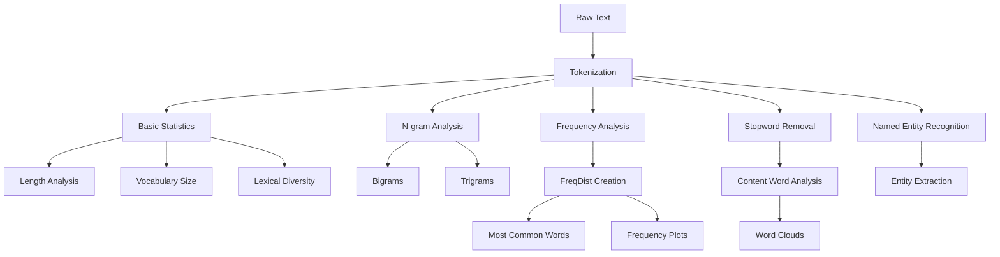

# NLP1 Basic EDA (Exploratory Data Analysis) - Coding Guide

## Overview
This notebook demonstrates fundamental Exploratory Data Analysis (EDA) techniques for text data using NLTK's built-in text corpora. The focus is on understanding text structure, word frequencies, and basic text statistics using Herman Melville's "Moby Dick" as the primary example.

## Library Setup and Data Downloads

### 1. NLTK Import
```python
import nltk
```
**Purpose**: Imports the Natural Language Toolkit for text processing.

### 2. NLTK Corpus Downloads
```python
nltk.download('gutenberg')      # Classic literature texts
nltk.download('genesis')        # Biblical texts
nltk.download('inaugural')      # US Presidential inaugural addresses
nltk.download('nps_chat')       # Chat room conversations
nltk.download('webtext')        # Web-based text samples
nltk.download('treebank')       # Parsed sentence structures
nltk.download('stopwords')      # Common stopwords
nltk.download('averaged_perceptron_tagger')  # POS tagger
nltk.download('punkt')          # Sentence tokenizer
nltk.download('maxent_ne_chunker')  # Named entity recognizer
nltk.download('words')          # English word list
```
**Purpose**: Downloads various text corpora and linguistic resources.
**Key Corpora**:
- **Gutenberg**: Classic literature (Moby Dick, Alice in Wonderland, etc.)
- **Inaugural**: Political speeches for sentiment analysis
- **Webtext**: Modern informal text samples

### 3. Loading NLTK Book Collection
```python
from nltk.book import *
```
**Purpose**: Imports pre-loaded text collections for immediate analysis.
**Available Texts**:
- `text1`: Moby Dick by Herman Melville
- `text2`: Sense and Sensibility by Jane Austen
- `text3`: The Book of Genesis
- `text4`: Inaugural Address Corpus
- And more...

## Working with Text Objects

### 1. Text Selection
```python
text1  # Moby Dick by Herman Melville 1851
```
**Purpose**: Selects the primary text for analysis.
**Output**: `<Text: Moby Dick by Herman Melville 1851>`

### 2. Viewing Raw Tokens
```python
text1.tokens[:50]  # First 50 tokens
```
**Purpose**: Displays the tokenized version of the text.
**Token Structure**: Each word and punctuation mark is a separate token.

## Basic Text Statistics

### 1. Text Length Analysis
```python
len(tokens)  # Total number of words/tokens in the book
```
**Purpose**: Counts total tokens in the text.
**Use Case**: Understanding text size for processing decisions.

### 2. Unique Vocabulary Size
```python
len(set(tokens))  # Number of unique words
```
**Purpose**: Measures vocabulary diversity.
**Calculation**: Uses `set()` to remove duplicates, then counts unique items.

### 3. Lexical Diversity
```python
lexical_diversity = len(set(tokens)) / len(tokens)
```
**Purpose**: Measures text complexity (unique words / total words).
**Interpretation**: Higher values indicate more diverse vocabulary.

## N-gram Analysis

### 1. Importing N-gram Utilities
```python
from nltk.util import ngrams
```
**Purpose**: Enables creation of word sequences (bigrams, trigrams, etc.).

### 2. Bigram Creation
```python
bigrams = ngrams(tokens, 2)
```
**Purpose**: Creates pairs of consecutive words.
**Arguments**:
- `tokens`: Input word list
- `2`: N-gram size (2 for bigrams)
**Example Output**: [('Moby', 'Dick'), ('Dick', 'by'), ('by', 'Herman')]

### 3. Trigram Creation
```python
trigrams = ngrams(tokens, 3)
```
**Purpose**: Creates triplets of consecutive words.
**Use Case**: Identifying common three-word phrases.
**Example**: ('the', 'white', 'whale')

### 4. N-gram Pattern Extraction
```python
# Extract common phrases of length 3
# Pattern: ('Determiner', 'Adjective', 'Noun')
trigrams = ngrams(tokens, 3)
cnt = 0
for trigram in trigrams:
    if cnt < 10:  # Show first 10 trigrams
        print(trigram)
        cnt += 1
```
**Purpose**: Finds linguistic patterns in text structure.

## Frequency Analysis

### 1. Frequency Distribution Creation
```python
from nltk import FreqDist
freq_dist = FreqDist(text1.tokens)
```
**Purpose**: Counts occurrence frequency of each token.
**FreqDist Object**: Dictionary-like structure storing word counts.

### 2. Most Common Words
```python
FreqDist(text1.tokens).most_common(10)
```
**Purpose**: Returns top 10 most frequent words with their counts.
**Output Format**: [('word', count), ('the', 13721), (',', 18713), ...]

### 3. Frequency Visualization
```python
FreqDist.plot(FreqDist(text1.tokens), 10)
```
**Purpose**: Creates histogram of word frequencies.
**Arguments**:
- `FreqDist(text1.tokens)`: Frequency distribution object
- `10`: Number of most frequent words to display

## Stopword Removal and Analysis

### 1. Stopword Filtering
```python
from nltk.corpus import stopwords
stop_words = set(stopwords.words('english'))
tokens_after_sw = [word for word in tokens if word.lower() not in stop_words]
```
**Purpose**: Removes common words to focus on meaningful content.
**Process**:
1. Load English stopwords
2. Convert to set for faster lookup
3. Filter tokens not in stopword set

### 2. Post-Stopword Frequency Analysis
```python
FreqDist(tokens_after_sw).plot(10)
```
**Purpose**: Visualizes content words after removing stopwords.
**Benefit**: Reveals topic-specific vocabulary.

## Advanced Text Visualization

### 1. Word Cloud Generation
```python
from wordcloud import WordCloud
from matplotlib import pyplot as plt

wordcloud = WordCloud(
    width=800, 
    height=400, 
    max_words=100, 
    background_color='white'
).generate(raw)

plt.figure(figsize=(10, 5))
plt.imshow(wordcloud, interpolation='bilinear')
plt.axis('off')
plt.show()
```
**Purpose**: Creates visual representation of word frequencies.
**Parameters**:
- `width/height`: Image dimensions
- `max_words`: Maximum words to display
- `background_color`: Background color
- `interpolation='bilinear'`: Smooth image rendering

### 2. Matplotlib Integration
```python
from matplotlib import pyplot as plt
plt.figure(figsize=(10, 5))
```
**Purpose**: Controls plot size and appearance.
**figsize**: Tuple specifying (width, height) in inches.

## Web Text Processing

### 1. URL Text Extraction
```python
import urllib.request
response = urllib.request.urlopen('http://example.com/text.txt')
raw = response.read().decode('utf8')
```
**Purpose**: Downloads and processes text from web sources.
**Process**:
1. `urlopen()`: Opens URL connection
2. `read()`: Downloads content as bytes
3. `decode('utf8')`: Converts bytes to string

### 2. Web Text Analysis
```python
print(type(raw))        # Data type verification
print(len(raw))         # Character count
print(raw[:75])         # Preview first 75 characters
```
**Purpose**: Validates and explores downloaded text data.

## Named Entity Recognition (NER)

### 1. NER Setup
```python
from nltk import word_tokenize, ne_chunk
from matplotlib import pyplot as plt
```
**Purpose**: Identifies and classifies named entities (people, places, organizations).

### 2. Entity Extraction Process
```python
# Tokenize text
tokens = word_tokenize(text)
# POS tagging (automatic in ne_chunk)
# Named entity chunking
entities = ne_chunk(pos_tag(tokens))
```
**Purpose**: Extracts meaningful entities from text.
**Process Flow**:
1. Tokenization → Individual words
2. POS Tagging → Grammatical roles
3. NE Chunking → Entity identification

## Text Analysis Workflow



## Key Functions and Their Arguments

### 1. FreqDist Functions
```python
FreqDist(tokens)                    # Create frequency distribution
freq_dist.most_common(n)            # Get top n frequent items
freq_dist.plot(n)                   # Plot top n frequencies
```

### 2. N-gram Functions
```python
ngrams(tokens, n)                   # Create n-grams
# n=2: bigrams, n=3: trigrams, etc.
```

### 3. Visualization Functions
```python
WordCloud(width, height, max_words, background_color)
plt.figure(figsize=(width, height))
plt.imshow(image, interpolation='bilinear')
plt.axis('off')                     # Remove axes
```

## Best Practices for Text EDA

### 1. Data Exploration Sequence
1. **Basic Statistics**: Length, vocabulary size, diversity
2. **Frequency Analysis**: Most common words and patterns
3. **Stopword Analysis**: Content vs. function words
4. **Visualization**: Plots and word clouds
5. **Advanced Analysis**: N-grams and entities

### 2. Performance Considerations
- Use `set()` for faster stopword lookup
- Limit visualization to top N items for clarity
- Consider text size when choosing analysis methods

### 3. Interpretation Guidelines
- High lexical diversity → Complex/varied vocabulary
- Common bigrams/trigrams → Recurring themes
- Entity patterns → Key topics and subjects

## Common Pitfalls to Avoid

1. **Not handling case sensitivity** in stopword removal
2. **Ignoring punctuation** in frequency analysis
3. **Over-interpreting** high-frequency function words
4. **Forgetting to filter** meaningless tokens
5. **Not considering text domain** when interpreting results

## Applications and Next Steps

### Immediate Applications
- **Content Analysis**: Understanding text themes
- **Preprocessing Decisions**: Choosing appropriate cleaning steps
- **Feature Engineering**: Selecting relevant n-grams
- **Quality Assessment**: Identifying text characteristics

### Advanced Techniques
- **Sentiment Analysis**: Using frequency patterns
- **Topic Modeling**: Based on word distributions
- **Text Classification**: Using n-gram features
- **Similarity Analysis**: Comparing frequency distributions

This EDA foundation enables informed decisions about subsequent NLP processing steps and provides insights into text structure and content patterns.