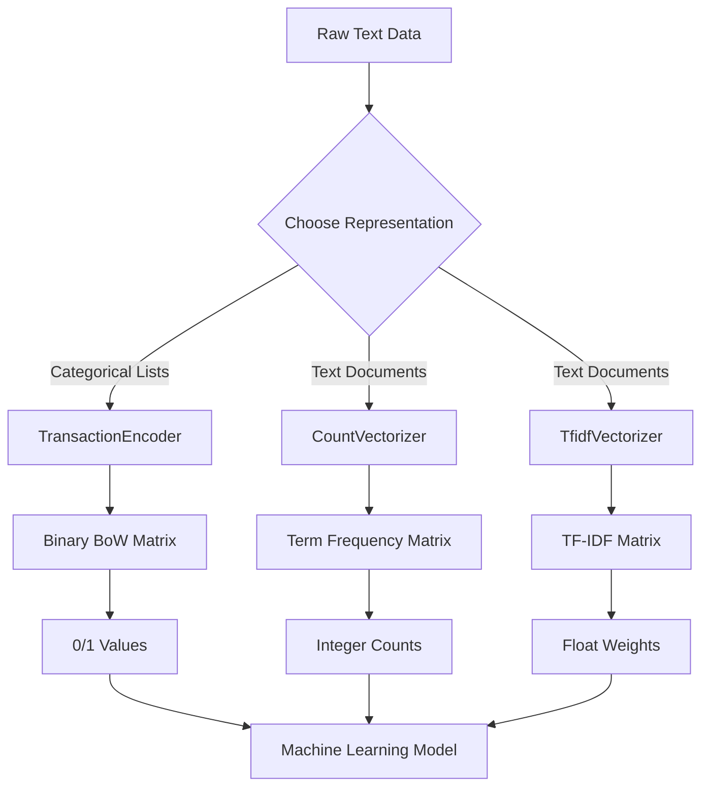

# NLP1 Text Representation: Bag of Words, TF, and TF-IDF - Coding Guide

## Overview
This notebook demonstrates three fundamental text representation techniques used in Natural Language Processing: Bag of Words (BoW), Term Frequency (TF), and Term Frequency-Inverse Document Frequency (TF-IDF). The examples use an IMDB movie dataset to show how to convert text data into numerical features for machine learning.

## Dataset Context
- **Source**: IMDB Movie Data (1000 movies)
- **Key Columns**: Title, Genre, Description, Director, Actors, Rating
- **Focus**: Converting categorical and text data into numerical representations

## Library Imports and Setup

### 1. Core Data Libraries
```python
import pandas as pd
import numpy as np
```
**Purpose**: 
- **pandas**: Data manipulation and DataFrame operations
- **numpy**: Numerical operations and array handling

### 2. Data Loading
```python
df = pd.read_csv('IMDB-Movie-Data.csv')
df.head()
```
**Purpose**: Loads movie dataset and displays first 5 rows for exploration.

### 3. Dataset Exploration
```python
df.shape  # Returns (1000, 12) - 1000 movies, 12 features
type(df.loc[0, 'Genre'])  # Returns 'str' - string data type
```
**Purpose**: Understanding data structure and types before processing.

## Bag of Words (BoW) Implementation

### 1. Data Preprocessing for BoW

#### Genre Column Analysis
```python
df.loc[0:5, 'Genre'].str.split(',')
```
**Purpose**: Splits comma-separated genre strings into lists.
**Example Output**: 
- `'Action,Adventure,Sci-Fi'` → `['Action', 'Adventure', 'Sci-Fi']`

#### Preparing Data for TransactionEncoder
```python
data = df['Genre'].str.split(',')  # Input for mlxtend.TransactionEncoder
```
**Purpose**: Creates list of lists format required by TransactionEncoder.
**Data Structure**: Each row becomes a list of genre categories.

### 2. TransactionEncoder Implementation

#### Import and Setup
```python
from mlxtend.preprocessing import TransactionEncoder
te = TransactionEncoder()
```
**Purpose**: 
- **mlxtend**: Machine Learning Extensions library
- **TransactionEncoder**: Converts categorical lists to binary matrix

#### Boolean Matrix Creation
```python
te.fit(data).transform(data)  # Returns boolean table
```
**Purpose**: Creates binary matrix where True/False indicates presence/absence.
**Process**:
1. `fit(data)`: Learns all unique categories
2. `transform(data)`: Converts to binary matrix
3. **Output**: Boolean array (True/False values)

#### Integer Conversion
```python
te.fit(data).transform(data).astype(int)
```
**Purpose**: Converts boolean values to integers (0/1) for ML compatibility.

#### Feature Names Extraction
```python
te.columns_  # Returns array of all unique genres
```
**Purpose**: Gets column names (feature names) for the binary matrix.
**Example**: `['Action', 'Adventure', 'Animation', 'Biography', 'Comedy', ...]`

### 3. Complete BoW DataFrame Creation
```python
bow_df = pd.DataFrame(
    te.fit_transform(data).astype(int), 
    columns=te.columns_
)
```
**Purpose**: Creates structured DataFrame with genre columns as binary features.

## Term Frequency (TF) with CountVectorizer

### 1. CountVectorizer Setup

#### Import and Understanding
```python
from sklearn.feature_extraction.text import CountVectorizer
```
**Purpose**: 
- **sklearn**: Scikit-learn machine learning library
- **CountVectorizer**: Creates term frequency matrix from text

#### Input Requirements
```python
df.loc[:5,'Description'].head()  # Input for CountVectorizer()
```
**Purpose**: CountVectorizer expects list/array of strings (not lists of words).

### 2. CountVectorizer Implementation

#### Basic Usage
```python
cv = CountVectorizer()
cv.fit(df.loc[:5,'Description'].values)
cv.transform(df.loc[:5,'Description'].values)  # Returns sparse matrix
```
**Purpose**: 
- `fit()`: Learns vocabulary from text corpus
- `transform()`: Converts text to term frequency matrix
- **Output**: Sparse matrix (memory efficient for large datasets)

#### Dense Matrix Conversion
```python
cv.transform(df['Description'].values).todense()
```
**Purpose**: Converts sparse matrix to dense format for easier viewing.
**Arguments**:
- `.todense()`: Method to convert sparse to dense matrix

#### Vocabulary Access
```python
cv.vocabulary_  # Dictionary mapping words to column indices
sorted(cv.vocabulary_)  # Alphabetically sorted word list
```
**Purpose**: 
- `vocabulary_`: Dictionary with word→index mapping
- `sorted()`: Orders words alphabetically for consistent column ordering

### 3. Complete TF DataFrame
```python
tf_df = pd.DataFrame(
    cv.transform(df['Description'].values).todense(), 
    columns=sorted(cv.vocabulary_)
)
```
**Purpose**: Creates DataFrame where each column is a word and values are frequencies.

## TF-IDF (Term Frequency-Inverse Document Frequency)

### 1. TF-IDF Concept
```python
# CountVectorizer: Simple word counts
# TfidfVectorizer: Considers word importance across entire corpus
```
**Key Difference**: TF-IDF weights words by their rarity across documents.

### 2. TfidfVectorizer Implementation

#### Import and Setup
```python
from sklearn.feature_extraction.text import TfidfVectorizer
tfidf = TfidfVectorizer()
```
**Purpose**: Creates TF-IDF vectorizer for weighted term representation.

#### Basic Usage
```python
tfidf.fit(df.loc[:5,'Description'].values)
tfidf.transform(df.loc[:5,'Description'].values).todense()
```
**Purpose**: 
- Learns vocabulary and document frequencies
- Transforms text to TF-IDF weighted matrix
- **Output**: Float values representing term importance

#### Complete TF-IDF DataFrame
```python
tfidf_df = pd.DataFrame(
    tfidf.transform(df['Description'].values).todense(), 
    columns=sorted(tfidf.vocabulary_)
)
```
**Purpose**: Creates DataFrame with TF-IDF weighted features.

## Key Differences Between Methods

| Method | Purpose | Output Values | Use Case |
|--------|---------|---------------|----------|
| **BoW (TransactionEncoder)** | Binary presence/absence | 0 or 1 | Categorical features, genre classification |
| **TF (CountVectorizer)** | Word frequency counts | Integer counts | Basic text analysis, simple features |
| **TF-IDF (TfidfVectorizer)** | Weighted term importance | Float weights | Advanced text analysis, document similarity |

## Method Comparison Workflow



## Advanced Parameters and Customization

### 1. CountVectorizer Parameters
```python
cv = CountVectorizer(
    max_features=1000,      # Limit vocabulary size
    min_df=2,               # Ignore words appearing in < 2 documents
    max_df=0.8,             # Ignore words appearing in > 80% of documents
    stop_words='english',   # Remove English stopwords
    ngram_range=(1, 2)      # Include unigrams and bigrams
)
```
**Parameters Explained**:
- `max_features`: Limits vocabulary to top N most frequent words
- `min_df`: Minimum document frequency (removes rare words)
- `max_df`: Maximum document frequency (removes common words)
- `stop_words`: Automatically removes common words
- `ngram_range`: Includes word combinations (1,1)=unigrams, (1,2)=unigrams+bigrams

### 2. TfidfVectorizer Parameters
```python
tfidf = TfidfVectorizer(
    max_features=5000,
    min_df=3,
    max_df=0.7,
    stop_words='english',
    lowercase=True,
    use_idf=True,
    smooth_idf=True
)
```
**Additional Parameters**:
- `lowercase`: Convert all text to lowercase
- `use_idf`: Apply inverse document frequency weighting
- `smooth_idf`: Add smoothing to IDF calculation

## Sparse vs Dense Matrices

### 1. Sparse Matrix Benefits
```python
sparse_matrix = cv.transform(texts)  # Memory efficient
print(f"Sparse matrix shape: {sparse_matrix.shape}")
print(f"Non-zero elements: {sparse_matrix.nnz}")
```
**Advantages**:
- **Memory Efficient**: Only stores non-zero values
- **Faster Operations**: Optimized for sparse data
- **Scalable**: Handles large vocabularies

### 2. Dense Matrix Usage
```python
dense_matrix = sparse_matrix.todense()  # Full matrix
```
**When to Use**:
- **Small datasets**: When memory isn't a concern
- **Visualization**: For displaying/debugging
- **Certain algorithms**: Some ML algorithms require dense input

## Best Practices and Guidelines

### 1. Method Selection
- **BoW (TransactionEncoder)**: Use for categorical data (genres, tags)
- **TF (CountVectorizer)**: Use for simple text analysis, small datasets
- **TF-IDF**: Use for document similarity, text classification, large corpora

### 2. Preprocessing Considerations
```python
# Always check data format before processing
print(f"Data type: {type(text_data)}")
print(f"Sample: {text_data[:3]}")

# Handle missing values
text_data = text_data.fillna('')  # Replace NaN with empty string
```

### 3. Performance Optimization
- Use sparse matrices for large datasets
- Set appropriate `max_features` to limit vocabulary
- Use `min_df` and `max_df` to filter noise
- Consider memory usage with `.todense()`

## Common Pitfalls to Avoid

1. **Wrong Input Format**: TransactionEncoder needs lists, CountVectorizer needs strings
2. **Memory Issues**: Using `.todense()` on large sparse matrices
3. **Inconsistent Vocabulary**: Not using same fitted vectorizer for train/test
4. **Ignoring Preprocessing**: Not handling case, punctuation, stopwords
5. **Feature Explosion**: Not limiting vocabulary size with `max_features`

## Mathematical Foundations

### 1. Term Frequency (TF)
```
TF(word, document) = count(word in document) / total_words_in_document
```

### 2. Inverse Document Frequency (IDF)
```
IDF(word, corpus) = log(total_documents / documents_containing_word)
```

### 3. TF-IDF Score
```
TF-IDF(word, document, corpus) = TF(word, document) × IDF(word, corpus)
```

## Practical Applications

### 1. Text Classification
- Convert documents to TF-IDF vectors
- Train classifier on numerical features
- Predict categories for new documents

### 2. Document Similarity
- Calculate cosine similarity between TF-IDF vectors
- Find similar documents or recommendations
- Cluster documents by content

### 3. Feature Engineering
- Create numerical features from text
- Combine with other features for ML models
- Reduce dimensionality with feature selection

This comprehensive approach to text representation forms the foundation for most NLP machine learning tasks, enabling the conversion of unstructured text into structured numerical data suitable for algorithmic processing.