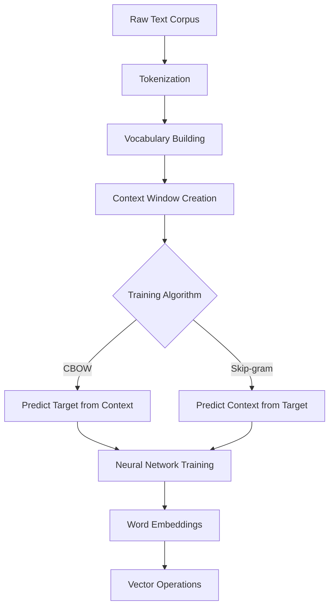
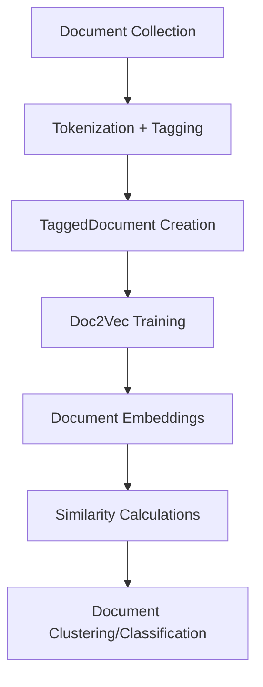

# NLP1 Word and Sentence Embeddings - Coding Guide

## Overview
This notebook introduces word and sentence embeddings using Word2Vec and Doc2Vec models from the Gensim library. These techniques convert words and documents into dense numerical vectors that capture semantic meaning, enabling mathematical operations on text data.

## Key Learning Objectives
- Understanding word embeddings and their advantages over traditional methods
- Implementing Word2Vec for word-level representations
- Using pre-trained embeddings for better performance
- Creating document/sentence embeddings with Doc2Vec
- Computing similarity between text using vector operations

## Library Imports and Their Purpose

### 1. Warning Management
```python
import warnings
warnings.filterwarnings('ignore')
```
**Purpose**: Suppresses warning messages to keep output clean during model training.

### 2. Gensim Library Components
```python
from gensim.test.utils import common_texts
from gensim.models import Word2Vec
from gensim.models.doc2vec import Doc2Vec, TaggedDocument
from gensim.models import KeyedVectors
import gensim.downloader
```
**Purpose**:
- `gensim` - Library for topic modeling and document similarity
- `common_texts` - Sample dataset for testing
- `Word2Vec` - Word embedding model implementation
- `Doc2Vec` - Document embedding model
- `TaggedDocument` - Data structure for Doc2Vec training
- `KeyedVectors` - Storage and operations for word vectors
- `gensim.downloader` - Access to pre-trained models

### 3. Additional Libraries
```python
import numpy as np
from sklearn.metrics.pairwise import cosine_similarity
```
**Purpose**:
- `numpy` - Numerical operations on embedding vectors
- `cosine_similarity` - Measuring similarity between vectors

## Word2Vec Implementation

### 1. Understanding the Sample Data
```python
print(common_texts)
```
**Output**: List of tokenized sentences
```
[['human', 'interface', 'computer'], 
 ['survey', 'user', 'computer', 'system', 'response', 'time'], 
 ['eps', 'user', 'interface', 'system'], 
 ...]
```
**Data Structure**: Each sentence is a list of words (already tokenized).

### 2. Word2Vec Model Creation
```python
model = Word2Vec(sentences=common_texts, vector_size=10, window=5, min_count=1, workers=4)
```

**Key Parameters Explained**:

#### vector_size (int, default=100)
- **Purpose**: Dimensionality of word vectors
- **Example**: `vector_size=10` creates 10-dimensional embeddings
- **Trade-off**: Larger vectors capture more information but require more memory
- **Typical Range**: 50-300 for most applications

#### window (int, default=5)
- **Purpose**: Maximum distance between current and predicted word
- **Example**: `window=5` considers 5 words before and after target word
- **Context**: "The quick brown fox jumps" - for "brown", window=2 includes ["The", "quick", "fox", "jumps"]

#### min_count (int, default=5)
- **Purpose**: Ignores words with frequency below this threshold
- **Example**: `min_count=1` includes all words (good for small datasets)
- **Typical Values**: 5-100 depending on corpus size
- **Benefit**: Removes rare words that don't have enough training data

#### workers (int, default=3)
- **Purpose**: Number of CPU cores to use for training
- **Example**: `workers=4` uses 4 CPU cores for parallel processing
- **Performance**: More workers = faster training (up to available cores)

#### sg (int, default=0)
- **Purpose**: Training algorithm selection
- **Values**: 
  - `sg=0` - CBOW (Continuous Bag of Words)
  - `sg=1` - Skip-gram
- **CBOW**: Predicts target word from context
- **Skip-gram**: Predicts context from target word

### 3. Model Persistence
```python
model.save("word2vec.model")
model = Word2Vec.load("word2vec.model")
```
**Purpose**: 
- `save()` - Stores trained model to disk
- `load()` - Retrieves saved model for continued use
- **Benefit**: Avoid retraining for future use

### 4. Accessing Word Vectors
```python
embedding = model.wv['human']
print(embedding)
print(len(embedding))
```
**Output**:
```
[-0.00410223 -0.08368949 -0.05600012  0.07104538  0.0335254   0.0722567
  0.06800248  0.07530741 -0.03789154 -0.00561806]
10
```
**Explanation**:
- `model.wv` - KeyedVectors object containing word embeddings
- `model.wv['word']` - Returns numpy array of word's embedding
- Each dimension captures different semantic aspects

### 5. Finding Similar Words
```python
similar_words = model.wv.most_similar('human', topn=3)
print(similar_words)
```
**Output**:
```
[('graph', 0.3586882948875427), ('system', 0.22743132710456848), ('time', 0.1153423935174942)]
```
**Function Details**:
- `most_similar(word, topn=N)` - Finds N most similar words
- **Returns**: List of tuples (word, similarity_score)
- **Similarity Score**: Cosine similarity between word vectors (0-1 range)

### 6. Vector Storage and Loading
```python
word_vectors = model.wv
word_vectors.save("word2vec.wordvectors")

# Memory-mapped loading (read-only, shared across processes)
wv = KeyedVectors.load("word2vec.wordvectors", mmap='r')
embedding = wv['computer']
```
**Benefits**:
- **Memory Mapping**: Efficient memory usage for large models
- **Shared Access**: Multiple processes can access same vectors
- **Read-only**: Prevents accidental modifications

## Pre-trained Word Embeddings

### 1. Available Models
```python
print(list(gensim.downloader.info()['models'].keys()))
```
**Popular Models**:
- `word2vec-google-news-300` - Google News corpus, 300 dimensions
- `glove-wiki-gigaword-300` - Wikipedia + Gigaword, 300 dimensions
- `glove-twitter-25` - Twitter data, 25 dimensions
- `fasttext-wiki-news-subwords-300` - FastText with subword information

### 2. Downloading Pre-trained Models
```python
glove_vectors = gensim.downloader.load('glove-twitter-25')
```
**Advantages of Pre-trained Models**:
- **Large Training Data**: Trained on billions of words
- **Better Quality**: More robust representations
- **Time Saving**: No need to train from scratch
- **Domain Specific**: Models trained on specific domains (Twitter, news, etc.)

### 3. Using Pre-trained Embeddings
```python
similar_words = glove_vectors.most_similar('twitter')
queen_vector = glove_vectors['queen']
```
**Output for 'twitter'**:
```
[('facebook', 0.948005199432373),
 ('tweet', 0.9403423070907593),
 ('fb', 0.9342358708381653),
 ('instagram', 0.9104824066162109)]
```

## Document/Sentence Embeddings with Doc2Vec

### 1. Data Preparation for Doc2Vec
```python
sentences = ["this is the first sentence", "this is the second sentence", 
             "yet another sentence", "one more sentence", "and the final sentence"]

tagged_data = [TaggedDocument(words=sentence.split(), tags=[str(i)]) 
               for i, sentence in enumerate(sentences)]
```
**TaggedDocument Structure**:
- `words` - List of words in the document
- `tags` - Unique identifier(s) for the document
- **Purpose**: Doc2Vec needs document labels for training

### 2. Doc2Vec Model Training
```python
model = Doc2Vec(tagged_data, vector_size=10, window=2, min_count=1, workers=4)
```
**Parameters Similar to Word2Vec**:
- `vector_size` - Dimensionality of document vectors
- `window` - Context window size
- `min_count` - Minimum word frequency
- `workers` - Number of CPU cores

### 3. Generating Document Embeddings
```python
sentence_vectors = [model.infer_vector(sentence.split()) for sentence in sentences]
```
**Function Details**:
- `infer_vector(words)` - Generates embedding for new document
- **Input**: List of words (tokenized sentence)
- **Output**: Numpy array representing document embedding
- **Use Case**: Getting embeddings for documents not in training set

### 4. Document Similarity Analysis
```python
from sklearn.metrics.pairwise import cosine_similarity

# Similarity between two specific documents
similarity = cosine_similarity(sentence_vectors[1].reshape(1,-1), 
                              sentence_vectors[2].reshape(1,-1))[0][0]

# Similarity matrix for all documents
similarity_matrix = cosine_similarity(sentence_vectors)
```

**Cosine Similarity Explanation**:
- **Range**: -1 to 1 (1 = identical, 0 = orthogonal, -1 = opposite)
- **Formula**: cos(θ) = (A·B) / (|A||B|)
- **Interpretation**: Measures angle between vectors in high-dimensional space

### 5. Finding Most Similar Documents
```python
def find_most_similar_document(target_index, sentence_vectors, sentences):
    max_similarity = -1
    most_similar_index = -1
    
    for i in range(len(sentence_vectors)):
        if i != target_index:
            similarity = cosine_similarity(
                sentence_vectors[i].reshape(1,-1),
                sentence_vectors[target_index].reshape(1,-1)
            )[0][0]
            
            if similarity > max_similarity:
                max_similarity = similarity
                most_similar_index = i
    
    return most_similar_index, max_similarity
```

## Embedding Workflow Diagrams

### Word2Vec Training Process


### Doc2Vec Training Process


## Key Concepts and Mathematical Foundations

### 1. Vector Space Model
- **Concept**: Words/documents represented as points in high-dimensional space
- **Semantic Similarity**: Closer points = more similar meaning
- **Operations**: Addition, subtraction, similarity calculations

### 2. Cosine Similarity Formula
```
cosine_similarity(A, B) = (A · B) / (||A|| × ||B||)
```
- **A · B**: Dot product of vectors
- **||A||**: Magnitude (length) of vector A
- **Result**: Normalized similarity score (0-1 for positive vectors)

### 3. Word Analogies
```python
# Famous example: king - man + woman ≈ queen
result = model.wv.most_similar(positive=['king', 'woman'], negative=['man'])
```
**Concept**: Vector arithmetic captures semantic relationships

## Best Practices and Guidelines

### 1. Choosing Vector Dimensions
- **Small datasets**: 50-100 dimensions
- **Medium datasets**: 100-200 dimensions
- **Large datasets**: 200-300 dimensions
- **Trade-off**: More dimensions = more information but slower processing

### 2. Training Data Requirements
- **Minimum**: 1000+ sentences for basic results
- **Good**: 10,000+ sentences for quality embeddings
- **Excellent**: 100,000+ sentences for production use

### 3. Hyperparameter Tuning
```python
# For small datasets
model = Word2Vec(sentences, vector_size=50, window=3, min_count=1, sg=1)

# For large datasets
model = Word2Vec(sentences, vector_size=300, window=10, min_count=5, sg=0)
```

### 4. Evaluation Methods
- **Intrinsic**: Word similarity tasks, analogies
- **Extrinsic**: Performance on downstream tasks (classification, clustering)
- **Manual**: Inspect similar words for semantic coherence

## Common Applications

### 1. Text Classification
```python
# Use document embeddings as features
X = sentence_vectors  # Document embeddings
y = labels           # Document categories
# Train classifier on X, y
```

### 2. Document Similarity
```python
# Find similar documents
similarity_scores = cosine_similarity([query_vector], document_vectors)
most_similar_docs = np.argsort(similarity_scores[0])[::-1][:5]
```

### 3. Clustering
```python
from sklearn.cluster import KMeans
kmeans = KMeans(n_clusters=5)
clusters = kmeans.fit_predict(sentence_vectors)
```

### 4. Information Retrieval
```python
def search_documents(query, model, documents):
    query_vector = model.infer_vector(query.split())
    similarities = cosine_similarity([query_vector], document_vectors)
    return np.argsort(similarities[0])[::-1]
```

## Performance Considerations

### 1. Memory Usage
- **Word2Vec**: Vocabulary_size × vector_size × 4 bytes
- **Doc2Vec**: (Vocabulary_size + Document_count) × vector_size × 4 bytes
- **Optimization**: Use smaller vector sizes for memory-constrained environments

### 2. Training Time
- **Factors**: Corpus size, vector dimensions, window size, iterations
- **Optimization**: Use more workers, reduce vector size, limit vocabulary

### 3. Inference Speed
- **Word2Vec**: O(1) lookup time
- **Doc2Vec**: O(vector_size × iterations) for new documents
- **Optimization**: Pre-compute embeddings when possible

## Troubleshooting Common Issues

### 1. KeyError for Unknown Words
```python
# Check if word exists before accessing
if 'word' in model.wv:
    embedding = model.wv['word']
else:
    print("Word not in vocabulary")
```

### 2. Poor Quality Embeddings
- **Solution**: Increase training data size
- **Solution**: Adjust hyperparameters (vector_size, window, min_count)
- **Solution**: Use pre-trained models

### 3. Memory Issues
- **Solution**: Use memory mapping for large models
- **Solution**: Reduce vector dimensions
- **Solution**: Process data in batches

This comprehensive guide provides the foundation for understanding and implementing word and document embeddings, enabling advanced text analysis and machine learning applications.