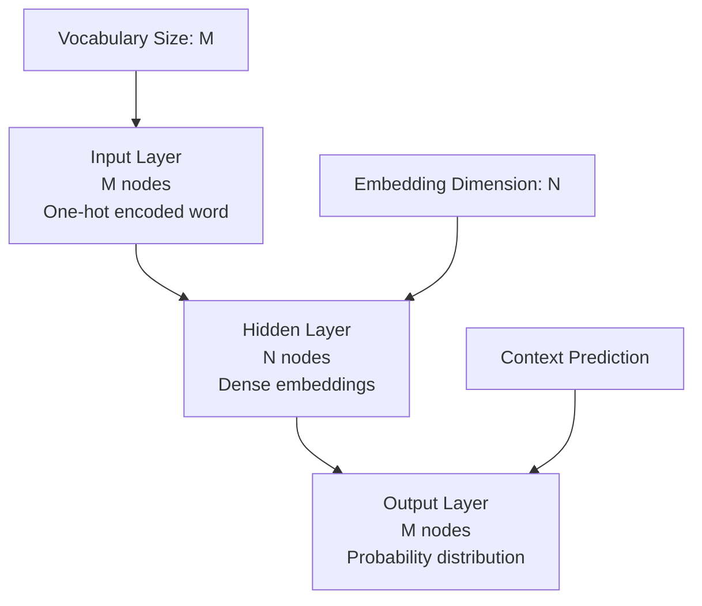

# Word2Vec Embeddings - NLP1 Part 1 - Coding Guide

## Overview
This notebook introduces Word2Vec, a groundbreaking neural network-based approach for creating word embeddings. Word2Vec was developed by Mikolov et al. in 2013 and revolutionized how we represent words in numerical form for machine learning applications.

## Historical Context and Research Background

### 1. Research Papers
- **Paper 1**: "Efficient Estimation of Word Representations in Vector Space" (2013)
  - **URL**: https://arxiv.org/abs/1301.3781
  - **Contribution**: Introduced Skip-gram and CBOW architectures

- **Paper 2**: "Distributed Representations of Words and Phrases and their Compositionality" (2013)
  - **URL**: https://arxiv.org/abs/1310.4546
  - **Contribution**: Improved training techniques and phrase representations

### 2. Key Innovation
The fundamental insight behind Word2Vec is the **distributional hypothesis**: words that appear in similar contexts tend to have similar meanings. This is captured by analyzing the words that occur near a target word across the entire corpus.

## Neural Network Architecture

### 1. Basic Structure
Word2Vec uses a simple feed-forward neural network with the following architecture:

```
Input Layer:    M nodes (vocabulary size)
Hidden Layer:   N nodes (embedding dimension, where N < M)
Output Layer:   M nodes (vocabulary size)
```

### 2. Architecture Diagram
The network architecture can be visualized as:



### 3. Key Parameters
- **M**: Vocabulary size (number of unique words)
- **N**: Embedding dimension (typically 100-300)
- **Context Window**: Number of surrounding words to consider

## Two Main Architectures

### 1. Skip-gram Model
**Purpose**: Predicts context words given a target word.

**Process**:
1. Input: Target word (one-hot encoded)
2. Hidden Layer: Generates word embedding
3. Output: Probability distribution over context words

**Mathematical Representation**:
```
P(context|target) = softmax(W_out × h)
```
Where:
- `h` = hidden layer activation (word embedding)
- `W_out` = output weight matrix

### 2. Continuous Bag of Words (CBOW)
**Purpose**: Predicts target word given context words.

**Process**:
1. Input: Context words (averaged or summed)
2. Hidden Layer: Generates combined representation
3. Output: Probability distribution over target words

**Mathematical Representation**:
```
P(target|context) = softmax(W_out × mean(context_embeddings))
```

## Implementation Components

### 1. Data Preprocessing
```python
# Typical preprocessing steps for Word2Vec
import nltk
from nltk.tokenize import word_tokenize
from nltk.corpus import stopwords

def preprocess_text(text):
    # Convert to lowercase
    text = text.lower()
    
    # Tokenize
    tokens = word_tokenize(text)
    
    # Remove stopwords (optional)
    stop_words = set(stopwords.words('english'))
    tokens = [word for word in tokens if word not in stop_words]
    
    # Remove punctuation and short words
    tokens = [word for word in tokens if word.isalpha() and len(word) > 2]
    
    return tokens
```

### 2. Gensim Implementation
```python
from gensim.models import Word2Vec

# Training Word2Vec model
model = Word2Vec(
    sentences=tokenized_sentences,  # List of tokenized sentences
    vector_size=100,               # Embedding dimension
    window=5,                      # Context window size
    min_count=1,                   # Minimum word frequency
    workers=4,                     # Number of CPU cores
    sg=0                          # 0=CBOW, 1=Skip-gram
)
```

### 3. Key Parameters Explained

#### vector_size (Embedding Dimension)
```python
vector_size=100  # Creates 100-dimensional word vectors
```
**Purpose**: Determines the size of the dense vector representation.
**Trade-offs**:
- **Larger**: More expressive, captures more nuanced relationships
- **Smaller**: Faster training, less memory, may lose information

#### window (Context Window)
```python
window=5  # Considers 5 words before and after target word
```
**Purpose**: Defines how many surrounding words to consider as context.
**Impact**:
- **Larger window**: Captures broader semantic relationships
- **Smaller window**: Focuses on syntactic relationships

#### min_count (Minimum Frequency)
```python
min_count=1  # Include words that appear at least once
```
**Purpose**: Filters out rare words to reduce vocabulary size.
**Considerations**:
- **Higher values**: Smaller vocabulary, faster training
- **Lower values**: Preserves rare but potentially important words

#### sg (Architecture Selection)
```python
sg=0  # Use CBOW architecture
sg=1  # Use Skip-gram architecture
```
**When to use**:
- **CBOW (sg=0)**: Faster training, better for frequent words
- **Skip-gram (sg=1)**: Better for rare words, more accurate representations

## Training Process

### 1. Training Loop Concept
```python
# Conceptual training process
for epoch in range(num_epochs):
    for sentence in corpus:
        for target_word_idx in sentence:
            # Get context words
            context = get_context_words(sentence, target_word_idx, window_size)
            
            # Forward pass
            if skip_gram:
                # Predict context given target
                predictions = model.predict_context(target_word)
            else:  # CBOW
                # Predict target given context
                prediction = model.predict_target(context)
            
            # Calculate loss and update weights
            loss = calculate_loss(predictions, actual)
            model.update_weights(loss)
```

### 2. Optimization Techniques

#### Hierarchical Softmax
```python
model = Word2Vec(sentences, hs=1)  # Enable hierarchical softmax
```
**Purpose**: Reduces computational complexity from O(V) to O(log V).
**Benefit**: Faster training for large vocabularies.

#### Negative Sampling
```python
model = Word2Vec(sentences, negative=5)  # Use 5 negative samples
```
**Purpose**: Instead of updating all weights, only update a small sample.
**Benefit**: Significantly faster training while maintaining quality.

## Working with Trained Models

### 1. Accessing Word Vectors
```python
# Get vector for a specific word
vector = model.wv['word']
print(f"Vector shape: {vector.shape}")  # (embedding_dim,)

# Check if word exists in vocabulary
if 'word' in model.wv:
    vector = model.wv['word']
```

### 2. Word Similarity Operations
```python
# Find most similar words
similar_words = model.wv.most_similar('king', topn=10)
print(similar_words)  # [('queen', 0.8), ('prince', 0.7), ...]

# Calculate similarity between two words
similarity = model.wv.similarity('king', 'queen')
print(f"Similarity: {similarity}")  # 0.85

# Word analogies (king - man + woman = queen)
result = model.wv.most_similar(
    positive=['king', 'woman'], 
    negative=['man'], 
    topn=1
)
print(result)  # [('queen', 0.92)]
```

### 3. Vocabulary Operations
```python
# Get vocabulary size
vocab_size = len(model.wv.key_to_index)
print(f"Vocabulary size: {vocab_size}")

# Get all words in vocabulary
words = list(model.wv.key_to_index.keys())

# Get word frequency
word_count = model.wv.get_vecattr('word', 'count')
```

## Advanced Features and Applications

### 1. Phrase Detection
```python
from gensim.models.phrases import Phrases, Phraser

# Detect common phrases
phrases = Phrases(tokenized_sentences, min_count=5, threshold=100)
phraser = Phraser(phrases)

# Transform sentences to include phrases
phrased_sentences = [phraser[sentence] for sentence in tokenized_sentences]
```

### 2. Model Persistence
```python
# Save model
model.save('word2vec_model.bin')

# Load model
loaded_model = Word2Vec.load('word2vec_model.bin')

# Save only word vectors (smaller file)
model.wv.save('word_vectors.kv')
from gensim.models import KeyedVectors
vectors = KeyedVectors.load('word_vectors.kv')
```

### 3. Evaluation Metrics
```python
# Evaluate on word similarity datasets
from gensim.test.utils import datapath

# Load evaluation dataset
similarity_file = datapath('wordsim353.tsv')
correlation = model.wv.evaluate_word_pairs(similarity_file)
print(f"Correlation: {correlation}")

# Evaluate on analogy tasks
analogy_file = datapath('questions-words.txt')
accuracy = model.wv.evaluate_word_analogies(analogy_file)
print(f"Accuracy: {accuracy}")
```

## Mathematical Foundations

### 1. Objective Function (Skip-gram)
```
J = -1/T * Σ(t=1 to T) Σ(-c≤j≤c, j≠0) log P(w[t+j] | w[t])
```
Where:
- T = total number of words
- c = context window size
- w[t] = target word at position t
- w[t+j] = context word at relative position j

### 2. Softmax Probability
```
P(w_o | w_i) = exp(v'[w_o]^T * v[w_i]) / Σ(w=1 to W) exp(v'[w]^T * v[w_i])
```
Where:
- v[w_i] = input vector of word w_i
- v'[w_o] = output vector of word w_o

### 3. Negative Sampling Objective
```
log σ(v'[w_o]^T * v[w_i]) + Σ(i=1 to k) E[w_i ~ P_n(w)] [log σ(-v'[w_i]^T * v[w_i])]
```
Where:
- σ = sigmoid function
- k = number of negative samples
- P_n(w) = noise distribution

## Best Practices and Guidelines

### 1. Hyperparameter Tuning
```python
# Recommended starting parameters
model = Word2Vec(
    sentences=corpus,
    vector_size=300,        # Good balance of expressiveness and efficiency
    window=5,               # Captures local context well
    min_count=5,            # Filters noise while preserving information
    workers=4,              # Utilize multiple CPU cores
    sg=1,                   # Skip-gram often performs better
    negative=10,            # Good balance for negative sampling
    epochs=10               # Sufficient training iterations
)
```

### 2. Data Preprocessing Guidelines
- **Text Cleaning**: Remove or handle special characters appropriately
- **Tokenization**: Use consistent tokenization strategy
- **Case Handling**: Usually convert to lowercase unless case matters
- **Stopwords**: Consider domain-specific stopword removal
- **Minimum Sentence Length**: Filter very short sentences

### 3. Model Evaluation
```python
# Intrinsic evaluation
def evaluate_model(model):
    # Test word similarities
    test_pairs = [('king', 'queen'), ('man', 'woman'), ('car', 'automobile')]
    for w1, w2 in test_pairs:
        if w1 in model.wv and w2 in model.wv:
            sim = model.wv.similarity(w1, w2)
            print(f"{w1} - {w2}: {sim:.3f}")
    
    # Test analogies
    analogies = [
        (['king', 'woman'], ['man'], 'queen'),
        (['paris', 'germany'], ['france'], 'berlin')
    ]
    
    for positive, negative, expected in analogies:
        try:
            result = model.wv.most_similar(positive=positive, negative=negative, topn=1)
            print(f"{positive} - {negative} = {result[0][0]} (expected: {expected})")
        except KeyError as e:
            print(f"Word not in vocabulary: {e}")
```

## Common Issues and Solutions

### 1. Memory Management
```python
# For large corpora, use memory-efficient training
model = Word2Vec(
    corpus_file='large_corpus.txt',  # Read from file instead of memory
    vector_size=100,                 # Reduce dimension if needed
    workers=1,                       # Reduce workers if memory constrained
    compute_loss=False               # Disable loss computation to save memory
)
```

### 2. Handling Out-of-Vocabulary Words
```python
def get_word_vector(model, word, default_vector=None):
    """Safely get word vector with fallback."""
    if word in model.wv:
        return model.wv[word]
    elif default_vector is not None:
        return default_vector
    else:
        # Return zero vector or random vector
        return np.zeros(model.wv.vector_size)
```

### 3. Domain Adaptation
```python
# Continue training on domain-specific data
base_model = Word2Vec.load('general_model.bin')

# Update vocabulary with new domain terms
base_model.build_vocab(domain_sentences, update=True)

# Continue training
base_model.train(domain_sentences, total_examples=len(domain_sentences), epochs=5)
```

## Applications and Use Cases

### 1. Document Similarity
```python
def document_similarity(doc1_tokens, doc2_tokens, model):
    """Calculate similarity between documents using word vectors."""
    # Get vectors for words in both documents
    vec1 = np.mean([model.wv[word] for word in doc1_tokens if word in model.wv], axis=0)
    vec2 = np.mean([model.wv[word] for word in doc2_tokens if word in model.wv], axis=0)
    
    # Calculate cosine similarity
    from sklearn.metrics.pairwise import cosine_similarity
    return cosine_similarity([vec1], [vec2])[0][0]
```

### 2. Text Classification Features
```python
def text_to_vector(tokens, model):
    """Convert text to fixed-size vector using Word2Vec."""
    vectors = [model.wv[word] for word in tokens if word in model.wv]
    if vectors:
        return np.mean(vectors, axis=0)
    else:
        return np.zeros(model.wv.vector_size)

# Use in classification pipeline
X_train = [text_to_vector(tokens, model) for tokens in train_texts]
X_test = [text_to_vector(tokens, model) for tokens in test_texts]
```

### 3. Recommendation Systems
```python
def find_similar_items(item_descriptions, target_item, model, top_k=5):
    """Find similar items based on description similarity."""
    target_vector = text_to_vector(target_item, model)
    
    similarities = []
    for i, desc in enumerate(item_descriptions):
        desc_vector = text_to_vector(desc, model)
        sim = cosine_similarity([target_vector], [desc_vector])[0][0]
        similarities.append((i, sim))
    
    # Return top-k most similar items
    return sorted(similarities, key=lambda x: x[1], reverse=True)[:top_k]
```

This comprehensive guide covers the theoretical foundations, practical implementation, and real-world applications of Word2Vec embeddings, providing a solid foundation for understanding and using this fundamental NLP technique.