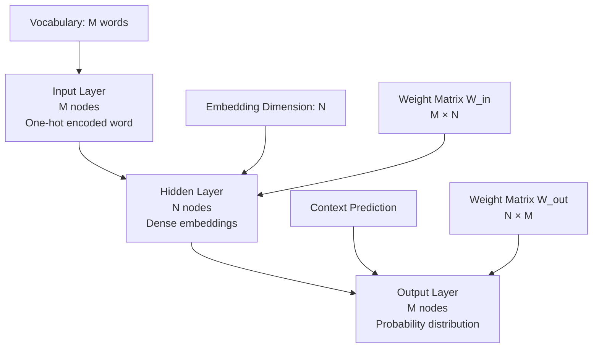
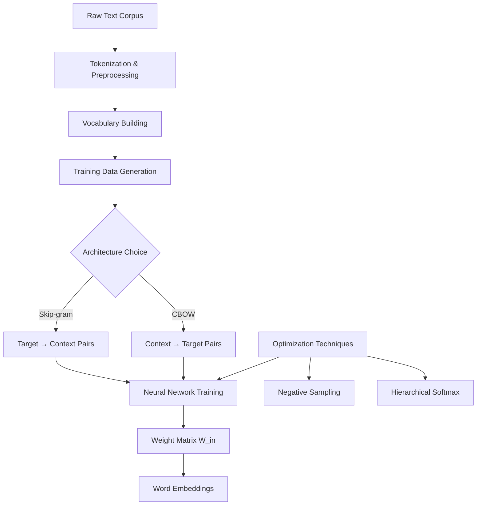

# Word2Vec Embeddings - NLP1 Part 1 (Instructor Version) - Coding Guide

## Overview
This notebook provides a comprehensive introduction to Word2Vec, the groundbreaking neural network-based approach for creating word embeddings developed by Mikolov et al. in 2013. It covers the theoretical foundations, neural network architecture, and practical implementation of Word2Vec models.

## Historical Context and Research Foundation

### 1. Foundational Research Papers
- **Paper 1**: "Efficient Estimation of Word Representations in Vector Space" (2013)
  - **URL**: https://arxiv.org/abs/1301.3781
  - **Key Contribution**: Introduced Skip-gram and CBOW architectures
  - **Innovation**: Demonstrated that word vectors can capture semantic relationships

- **Paper 2**: "Distributed Representations of Words and Phrases and their Compositionality" (2013)
  - **URL**: https://arxiv.org/abs/1310.4546
  - **Key Contribution**: Improved training techniques and phrase representations
  - **Enhancement**: Introduced negative sampling and hierarchical softmax

### 2. Core Concept: Distributional Hypothesis
**Fundamental Principle**: "Words that appear in similar contexts tend to have similar meanings"

**Example**:
- "The cat sat on the mat"
- "The dog sat on the mat"
- Words "cat" and "dog" appear in similar contexts → likely to have similar embeddings

## Neural Network Architecture Deep Dive

### 1. Basic Architecture Components

#### Network Structure
```
Input Layer:    M nodes (vocabulary size)
Hidden Layer:   N nodes (embedding dimension, where N < M)  
Output Layer:   M nodes (vocabulary size)
```

#### Mathematical Representation
- **M**: Total vocabulary size (number of unique words)
- **N**: Embedding dimension (typically 100-300)
- **Weight Matrices**:
  - **W_in**: Input-to-hidden weights (M × N)
  - **W_out**: Hidden-to-output weights (N × M)

### 2. Architecture Visualization



### 3. Key Design Principles
- **Dimensionality Reduction**: N << M (embeddings are much smaller than vocabulary)
- **Dense Representation**: Unlike one-hot vectors, embeddings are dense
- **Learned Features**: Network learns meaningful semantic relationships

## Two Main Architectures Explained

### 1. Skip-gram Model

#### Purpose and Process
**Objective**: Predict context words given a target word

**Training Process**:
1. **Input**: Target word (one-hot encoded vector)
2. **Hidden Layer**: Generates word embedding (lookup in W_in)
3. **Output**: Probability distribution over all possible context words

#### Mathematical Formulation
```
P(context_word | target_word) = softmax(W_out × embedding_target)
```

**Objective Function**:
```
J = -1/T × Σ(t=1 to T) Σ(j∈context) log P(w_j | w_t)
```
Where:
- T = total number of words in corpus
- w_t = target word at position t
- w_j = context word

#### Skip-gram Advantages
- **Better for rare words**: More training examples per word
- **Captures fine-grained relationships**: Good for word analogies
- **Scalable**: Works well with large vocabularies

### 2. Continuous Bag of Words (CBOW)

#### Purpose and Process
**Objective**: Predict target word given context words

**Training Process**:
1. **Input**: Context words (averaged or summed embeddings)
2. **Hidden Layer**: Combined context representation
3. **Output**: Probability distribution over target words

#### Mathematical Formulation
```
P(target | context) = softmax(W_out × mean(context_embeddings))
```

**Context Averaging**:
```
h = (1/C) × Σ(i=1 to C) W_in[context_word_i]
```
Where C = number of context words

#### CBOW Advantages
- **Faster training**: Fewer parameters to update per example
- **Better for frequent words**: Smooths over context variations
- **Stable**: Less sensitive to individual context words

## Implementation Architecture Workflow



## Training Process Details

### 1. Data Preparation
```python
# Conceptual training data generation
def generate_training_pairs(sentence, window_size, architecture):
    pairs = []
    for i, target_word in enumerate(sentence):
        # Define context window
        start = max(0, i - window_size)
        end = min(len(sentence), i + window_size + 1)
        
        context_words = sentence[start:end]
        context_words.remove(target_word)  # Remove target from context
        
        if architecture == "skip-gram":
            # Target predicts each context word
            for context_word in context_words:
                pairs.append((target_word, context_word))
        
        elif architecture == "cbow":
            # Context predicts target
            pairs.append((context_words, target_word))
    
    return pairs
```

### 2. Forward Pass Implementation

#### Skip-gram Forward Pass
```python
def skip_gram_forward(target_word_idx, vocab_size, embedding_dim):
    # 1. One-hot encode target word
    target_onehot = np.zeros(vocab_size)
    target_onehot[target_word_idx] = 1
    
    # 2. Get embedding (hidden layer activation)
    embedding = np.dot(target_onehot, W_in)  # Shape: (embedding_dim,)
    
    # 3. Compute output scores
    scores = np.dot(embedding, W_out)  # Shape: (vocab_size,)
    
    # 4. Apply softmax
    probabilities = softmax(scores)
    
    return embedding, probabilities
```

#### CBOW Forward Pass
```python
def cbow_forward(context_word_indices, vocab_size, embedding_dim):
    # 1. Get embeddings for all context words
    context_embeddings = []
    for word_idx in context_word_indices:
        context_onehot = np.zeros(vocab_size)
        context_onehot[word_idx] = 1
        embedding = np.dot(context_onehot, W_in)
        context_embeddings.append(embedding)
    
    # 2. Average context embeddings
    avg_embedding = np.mean(context_embeddings, axis=0)
    
    # 3. Compute output scores and probabilities
    scores = np.dot(avg_embedding, W_out)
    probabilities = softmax(scores)
    
    return avg_embedding, probabilities
```

## Optimization Techniques

### 1. Hierarchical Softmax
**Problem**: Standard softmax is computationally expensive for large vocabularies
**Solution**: Use binary tree structure to reduce complexity

#### Implementation Concept
```python
class HierarchicalSoftmax:
    def __init__(self, vocab_size):
        # Build binary tree with vocab_size leaves
        self.tree_depth = int(np.log2(vocab_size)) + 1
        
    def compute_probability(self, word_idx, embedding):
        # Navigate tree path to word
        path = self.get_path_to_word(word_idx)
        probability = 1.0
        
        for node in path:
            # Binary classification at each node
            prob_left = sigmoid(np.dot(embedding, node.weight))
            if node.direction == "left":
                probability *= prob_left
            else:
                probability *= (1 - prob_left)
        
        return probability
```

**Complexity Reduction**: O(V) → O(log V) where V is vocabulary size

### 2. Negative Sampling
**Problem**: Need to update all output weights for each training example
**Solution**: Only update weights for target word + small sample of "negative" words

#### Implementation
```python
def negative_sampling_loss(target_word, context_word, negative_samples, embeddings):
    # Positive example (actual context word)
    positive_score = np.dot(embeddings[target_word], embeddings[context_word])
    positive_loss = -np.log(sigmoid(positive_score))
    
    # Negative examples (randomly sampled words)
    negative_loss = 0
    for neg_word in negative_samples:
        negative_score = np.dot(embeddings[target_word], embeddings[neg_word])
        negative_loss += -np.log(sigmoid(-negative_score))
    
    return positive_loss + negative_loss
```

**Benefits**:
- **Speed**: Much faster than full softmax
- **Quality**: Maintains embedding quality
- **Scalability**: Works well with large vocabularies

## Hyperparameter Analysis

### 1. Vector Size (Embedding Dimension)
```python
# Common configurations
small_model = Word2Vec(vector_size=50)    # Fast, basic relationships
medium_model = Word2Vec(vector_size=100)  # Balanced performance
large_model = Word2Vec(vector_size=300)   # Rich representations
```

**Trade-offs**:
- **Smaller dimensions**: Faster training, less memory, may lose nuanced relationships
- **Larger dimensions**: More expressive, captures complex relationships, requires more data

### 2. Window Size Impact
```python
# Different window sizes capture different relationships
syntactic_model = Word2Vec(window=2)    # Captures syntactic relationships
semantic_model = Word2Vec(window=10)    # Captures broader semantic relationships
```

**Examples**:
- **Small window (2-3)**: "quick brown" → syntactic/grammatical relationships
- **Large window (8-10)**: "dog ... park ... walk" → semantic/topical relationships

### 3. Training Algorithm Selection
```python
# Architecture comparison
cbow_model = Word2Vec(sg=0)  # Faster, better for frequent words
skipgram_model = Word2Vec(sg=1)  # Better for rare words, more accurate
```

## Advanced Features and Techniques

### 1. Subword Information (FastText Extension)
```python
# Conceptual subword handling
def get_subword_embeddings(word, min_n=3, max_n=6):
    subwords = []
    # Add character n-grams
    for n in range(min_n, max_n + 1):
        for i in range(len(word) - n + 1):
            subwords.append(word[i:i+n])
    
    # Add full word
    subwords.append(word)
    return subwords
```

### 2. Phrase Detection and Handling
```python
# Detecting common phrases
def detect_phrases(sentences, min_count=5, threshold=100):
    # Count word pairs
    pair_counts = {}
    word_counts = {}
    
    for sentence in sentences:
        for i in range(len(sentence) - 1):
            pair = (sentence[i], sentence[i+1])
            pair_counts[pair] = pair_counts.get(pair, 0) + 1
            word_counts[sentence[i]] = word_counts.get(sentence[i], 0) + 1
    
    # Calculate phrase scores
    phrases = []
    for (word1, word2), pair_count in pair_counts.items():
        if pair_count >= min_count:
            score = (pair_count - min_count) / (word_counts[word1] * word_counts[word2])
            if score > threshold:
                phrases.append(f"{word1}_{word2}")
    
    return phrases
```

## Evaluation and Quality Assessment

### 1. Intrinsic Evaluation Methods
```python
def evaluate_word_similarities(model, test_pairs):
    """Evaluate on word similarity datasets"""
    human_scores = []
    model_scores = []
    
    for word1, word2, human_score in test_pairs:
        if word1 in model.wv and word2 in model.wv:
            model_score = model.wv.similarity(word1, word2)
            human_scores.append(human_score)
            model_scores.append(model_score)
    
    # Calculate correlation
    correlation = np.corrcoef(human_scores, model_scores)[0, 1]
    return correlation

def evaluate_analogies(model, analogy_questions):
    """Evaluate on analogy tasks (king - man + woman = queen)"""
    correct = 0
    total = 0
    
    for a, b, c, expected_d in analogy_questions:
        if all(word in model.wv for word in [a, b, c, expected_d]):
            # Find word most similar to (b - a + c)
            result = model.wv.most_similar(positive=[b, c], negative=[a], topn=1)
            if result[0][0] == expected_d:
                correct += 1
            total += 1
    
    accuracy = correct / total if total > 0 else 0
    return accuracy
```

### 2. Visualization Techniques
```python
def visualize_embeddings_2d(model, words, method='tsne'):
    """Reduce embeddings to 2D for visualization"""
    from sklearn.manifold import TSNE
    from sklearn.decomposition import PCA
    
    # Get embeddings for specified words
    embeddings = [model.wv[word] for word in words if word in model.wv]
    valid_words = [word for word in words if word in model.wv]
    
    # Dimensionality reduction
    if method == 'tsne':
        reducer = TSNE(n_components=2, random_state=42)
    else:
        reducer = PCA(n_components=2)
    
    embeddings_2d = reducer.fit_transform(embeddings)
    
    # Plot
    plt.figure(figsize=(12, 8))
    plt.scatter(embeddings_2d[:, 0], embeddings_2d[:, 1])
    
    for i, word in enumerate(valid_words):
        plt.annotate(word, (embeddings_2d[i, 0], embeddings_2d[i, 1]))
    
    plt.title(f'Word Embeddings Visualization ({method.upper()})')
    plt.show()
```

## Practical Applications and Use Cases

### 1. Document Similarity
```python
def document_similarity_word2vec(doc1_tokens, doc2_tokens, model):
    """Calculate document similarity using Word2Vec embeddings"""
    # Get valid embeddings
    doc1_embeddings = [model.wv[word] for word in doc1_tokens if word in model.wv]
    doc2_embeddings = [model.wv[word] for word in doc2_tokens if word in model.wv]
    
    if not doc1_embeddings or not doc2_embeddings:
        return 0.0
    
    # Average word embeddings
    doc1_vector = np.mean(doc1_embeddings, axis=0)
    doc2_vector = np.mean(doc2_embeddings, axis=0)
    
    # Cosine similarity
    similarity = np.dot(doc1_vector, doc2_vector) / (
        np.linalg.norm(doc1_vector) * np.linalg.norm(doc2_vector)
    )
    
    return similarity
```

### 2. Word Analogy Solver
```python
def solve_analogy(model, a, b, c, topn=1):
    """Solve analogies of the form: a is to b as c is to ?"""
    try:
        # Vector arithmetic: b - a + c
        result = model.wv.most_similar(positive=[b, c], negative=[a], topn=topn)
        return result
    except KeyError as e:
        return f"Word not in vocabulary: {e}"

# Examples
# solve_analogy(model, "king", "queen", "man")  # Should return "woman"
# solve_analogy(model, "paris", "france", "london")  # Should return "england"
```

### 3. Semantic Search
```python
def semantic_search(query_words, document_collection, model, top_k=5):
    """Find most relevant documents using semantic similarity"""
    # Create query vector
    query_embeddings = [model.wv[word] for word in query_words if word in model.wv]
    if not query_embeddings:
        return []
    
    query_vector = np.mean(query_embeddings, axis=0)
    
    # Calculate similarities with all documents
    similarities = []
    for i, doc_tokens in enumerate(document_collection):
        doc_similarity = document_similarity_word2vec(query_words, doc_tokens, model)
        similarities.append((i, doc_similarity))
    
    # Return top-k most similar documents
    similarities.sort(key=lambda x: x[1], reverse=True)
    return similarities[:top_k]
```

## Performance Optimization and Best Practices

### 1. Training Optimization
```python
# Optimized training configuration
model = Word2Vec(
    sentences=corpus,
    vector_size=300,        # Rich representations
    window=5,               # Balanced context
    min_count=5,            # Filter rare words
    workers=4,              # Parallel processing
    sg=1,                   # Skip-gram for quality
    negative=10,            # Negative sampling
    epochs=10,              # Sufficient training
    alpha=0.025,            # Learning rate
    min_alpha=0.0001,       # Final learning rate
    compute_loss=True       # Monitor training progress
)
```

### 2. Memory Management
```python
# For large corpora
def train_word2vec_streaming(corpus_file, model_file):
    """Train Word2Vec on large corpus without loading all into memory"""
    
    class CorpusStreamer:
        def __init__(self, filename):
            self.filename = filename
        
        def __iter__(self):
            with open(self.filename, 'r') as f:
                for line in f:
                    yield line.strip().split()
    
    # Stream corpus
    sentences = CorpusStreamer(corpus_file)
    
    # Train model
    model = Word2Vec(sentences, vector_size=100, workers=4)
    model.save(model_file)
    
    return model
```

### 3. Model Evaluation Pipeline
```python
def comprehensive_evaluation(model, test_data_path):
    """Complete evaluation pipeline for Word2Vec model"""
    results = {}
    
    # 1. Vocabulary coverage
    results['vocab_size'] = len(model.wv.key_to_index)
    
    # 2. Word similarity evaluation
    if os.path.exists(f"{test_data_path}/wordsim353.txt"):
        similarity_corr = evaluate_word_similarities(model, load_similarity_data())
        results['similarity_correlation'] = similarity_corr
    
    # 3. Analogy evaluation
    if os.path.exists(f"{test_data_path}/questions-words.txt"):
        analogy_acc = evaluate_analogies(model, load_analogy_data())
        results['analogy_accuracy'] = analogy_acc
    
    # 4. Nearest neighbors quality check
    test_words = ['king', 'computer', 'happy', 'run']
    for word in test_words:
        if word in model.wv:
            neighbors = model.wv.most_similar(word, topn=5)
            results[f'{word}_neighbors'] = neighbors
    
    return results
```

## Common Issues and Troubleshooting

### 1. Out-of-Vocabulary (OOV) Words
```python
def handle_oov_words(model, words, default_strategy='zero'):
    """Handle words not in model vocabulary"""
    result_vectors = []
    
    for word in words:
        if word in model.wv:
            result_vectors.append(model.wv[word])
        else:
            if default_strategy == 'zero':
                result_vectors.append(np.zeros(model.wv.vector_size))
            elif default_strategy == 'random':
                result_vectors.append(np.random.normal(0, 0.1, model.wv.vector_size))
            elif default_strategy == 'skip':
                continue  # Skip OOV words
    
    return result_vectors
```

### 2. Model Quality Issues
```python
def diagnose_model_quality(model):
    """Diagnose potential quality issues"""
    issues = []
    
    # Check vocabulary size
    if len(model.wv.key_to_index) < 1000:
        issues.append("Vocabulary too small - consider lowering min_count")
    
    # Check for reasonable similarities
    test_pairs = [('king', 'queen'), ('man', 'woman'), ('car', 'automobile')]
    for w1, w2 in test_pairs:
        if w1 in model.wv and w2 in model.wv:
            sim = model.wv.similarity(w1, w2)
            if sim < 0.3:
                issues.append(f"Low similarity for {w1}-{w2}: {sim:.3f}")
    
    # Check training parameters
    if model.epochs < 5:
        issues.append("Too few training epochs")
    
    return issues
```

This comprehensive guide covers the theoretical foundations, practical implementation, and real-world applications of Word2Vec, providing a complete understanding of this fundamental NLP technique that revolutionized how we represent and work with text data.