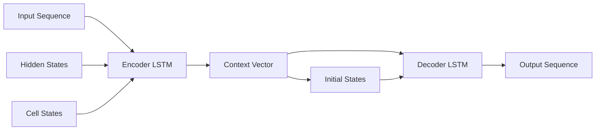
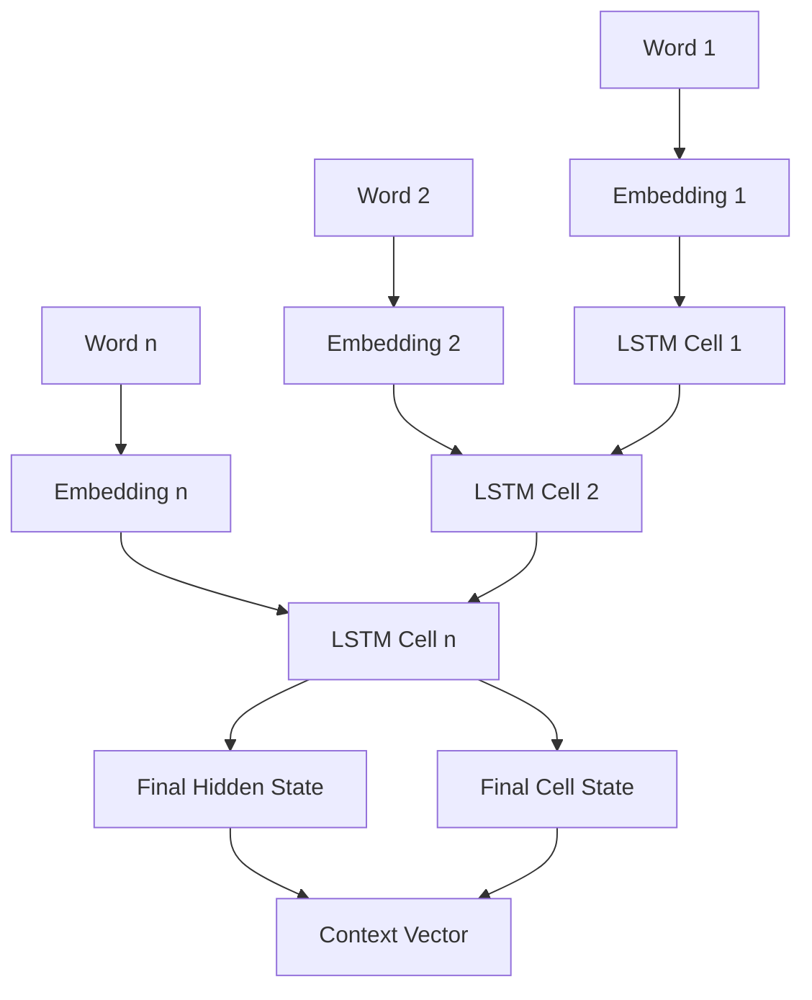
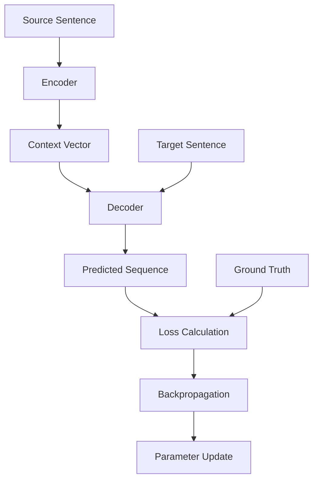

# NLP1 Part 2 - Optional Additional Material - Coding Guide

## Overview
This notebook introduces advanced NLP concepts including Sequence-to-Sequence (Seq2Seq) models, encoder-decoder architectures, and their applications in machine translation, question answering, chatbots, and text summarization. This material provides a foundation for understanding modern neural language models.

## Key Learning Objectives
- Understanding Seq2Seq model architecture and components
- Learning encoder-decoder frameworks for NLP tasks
- Exploring applications in machine translation and text generation
- Understanding attention mechanisms and their importance
- Introduction to modern transformer architectures

## Sequence-to-Sequence (Seq2Seq) Models

### 1. What are Seq2Seq Models?
**Definition**: Seq2Seq models are a special class of Recurrent Neural Networks designed to solve complex language problems where:
- **Input**: Variable-length sequence (e.g., sentence in one language)
- **Output**: Variable-length sequence (e.g., sentence in another language)

**Key Applications**:
- Machine Translation (English → French)
- Text Summarization (Long text → Summary)
- Question Answering (Question → Answer)
- Chatbots (User input → Bot response)
- Code Generation (Description → Code)

### 2. Architecture Components

#### Encoder-Decoder Framework


## Encoder Component

### 1. Purpose and Function
**Role**: The encoder reads the input sequence and summarizes all information into internal state vectors (context vector).

**Key Characteristics**:
- **Input Processing**: Processes input sequence word by word
- **State Accumulation**: Builds up understanding through hidden states
- **Information Compression**: Encapsulates entire input into fixed-size context vector
- **Output Discarding**: Only internal states are preserved, outputs are discarded

### 2. Mathematical Representation
```python
# Conceptual encoder implementation
class Encoder:
    def __init__(self, vocab_size, embedding_dim, hidden_dim):
        self.embedding = Embedding(vocab_size, embedding_dim)
        self.lstm = LSTM(embedding_dim, hidden_dim)
    
    def forward(self, input_sequence):
        # Convert words to embeddings
        embeddings = self.embedding(input_sequence)
        
        # Process through LSTM
        outputs, (hidden_state, cell_state) = self.lstm(embeddings)
        
        # Return final states as context vector
        context_vector = (hidden_state, cell_state)
        return context_vector
```

### 3. Information Flow


## Decoder Component

### 1. Purpose and Function
**Role**: The decoder generates the output sequence using the context vector from the encoder.

**Key Characteristics**:
- **Initialization**: Initial states set to encoder's final states (context vector)
- **Sequential Generation**: Generates output one word at a time
- **Autoregressive**: Each output becomes input for next step
- **Termination**: Continues until special end token is generated

### 2. Mathematical Representation
```python
# Conceptual decoder implementation
class Decoder:
    def __init__(self, vocab_size, embedding_dim, hidden_dim):
        self.embedding = Embedding(vocab_size, embedding_dim)
        self.lstm = LSTM(embedding_dim, hidden_dim)
        self.output_projection = Linear(hidden_dim, vocab_size)
    
    def forward(self, context_vector, target_sequence=None):
        hidden_state, cell_state = context_vector
        outputs = []
        
        # Start with special start token
        current_input = START_TOKEN
        
        for step in range(max_length):
            # Embed current input
            embedded = self.embedding(current_input)
            
            # LSTM forward pass
            output, (hidden_state, cell_state) = self.lstm(
                embedded, (hidden_state, cell_state)
            )
            
            # Project to vocabulary
            logits = self.output_projection(output)
            predicted_word = argmax(logits)
            
            outputs.append(predicted_word)
            
            # Use prediction as next input (inference)
            # Or use ground truth (training)
            current_input = predicted_word if target_sequence is None else target_sequence[step]
            
            if predicted_word == END_TOKEN:
                break
        
        return outputs
```

### 3. Training vs Inference

#### Training Mode (Teacher Forcing)
```python
def train_step(encoder_input, decoder_target):
    # Encoder forward pass
    context_vector = encoder(encoder_input)
    
    # Decoder with teacher forcing
    decoder_input = [START_TOKEN] + decoder_target[:-1]
    decoder_output = decoder(context_vector, decoder_input)
    
    # Calculate loss
    loss = cross_entropy(decoder_output, decoder_target)
    return loss
```

#### Inference Mode (Autoregressive)
```python
def inference(encoder_input):
    # Encoder forward pass
    context_vector = encoder(encoder_input)
    
    # Decoder autoregressive generation
    generated_sequence = decoder(context_vector, target_sequence=None)
    return generated_sequence
```

## Complete Seq2Seq Architecture

### 1. Full Model Implementation
```python
class Seq2SeqModel:
    def __init__(self, src_vocab_size, tgt_vocab_size, embedding_dim, hidden_dim):
        self.encoder = Encoder(src_vocab_size, embedding_dim, hidden_dim)
        self.decoder = Decoder(tgt_vocab_size, embedding_dim, hidden_dim)
    
    def forward(self, src_sequence, tgt_sequence=None):
        # Encode input sequence
        context_vector = self.encoder(src_sequence)
        
        # Decode to output sequence
        output_sequence = self.decoder(context_vector, tgt_sequence)
        
        return output_sequence
```

### 2. Training Process


## Practical Applications

### 1. Machine Translation
```python
# Example: English to French translation
english_sentence = ["I", "love", "machine", "learning"]
french_translation = seq2seq_model.translate(english_sentence)
# Output: ["Je", "aime", "l'apprentissage", "automatique"]
```

### 2. Text Summarization
```python
# Example: Document summarization
long_document = ["Very", "long", "document", "with", "many", "details", "..."]
summary = seq2seq_model.summarize(long_document)
# Output: ["Short", "summary", "of", "key", "points"]
```

### 3. Question Answering
```python
# Example: QA system
question = ["What", "is", "the", "capital", "of", "France"]
answer = seq2seq_model.answer(question)
# Output: ["Paris"]
```

## Limitations of Basic Seq2Seq

### 1. Information Bottleneck
**Problem**: All input information must be compressed into fixed-size context vector
**Impact**: 
- Long sequences lose information
- Important details from beginning of sequence may be forgotten
- Performance degrades with sequence length

### 2. No Alignment Information
**Problem**: Decoder doesn't know which input words are relevant for current output
**Impact**:
- Difficulty handling word order differences
- Poor performance on long sequences
- No explicit alignment between input and output

### 3. Vanishing Gradient Problem
**Problem**: Standard RNNs suffer from vanishing gradients in long sequences
**Partial Solutions**:
- LSTM/GRU cells help but don't completely solve the problem
- Gradient clipping
- Better initialization strategies

## Attention Mechanism (Advanced Concept)

### 1. Motivation
**Problem Solved**: Instead of using only final encoder state, allow decoder to "attend" to all encoder states.

### 2. Basic Attention Concept
```python
def attention_mechanism(decoder_hidden, encoder_outputs):
    # Calculate attention scores
    attention_scores = []
    for encoder_output in encoder_outputs:
        score = dot_product(decoder_hidden, encoder_output)
        attention_scores.append(score)
    
    # Normalize to probabilities
    attention_weights = softmax(attention_scores)
    
    # Weighted sum of encoder outputs
    context_vector = weighted_sum(encoder_outputs, attention_weights)
    
    return context_vector, attention_weights
```

### 3. Attention Benefits
- **Better Long Sequences**: No information bottleneck
- **Interpretability**: Attention weights show which input words are important
- **Alignment**: Explicit connection between input and output positions
- **Performance**: Significant improvements on translation tasks

## Modern Developments

### 1. Transformer Architecture
**Key Innovation**: Replace RNNs with self-attention mechanisms
**Advantages**:
- Parallelizable training
- Better handling of long sequences
- State-of-the-art performance

### 2. BERT and GPT Models
**BERT**: Bidirectional encoder representations
**GPT**: Generative pre-trained transformer
**Impact**: Revolutionary improvements in NLP tasks

## Implementation Considerations

### 1. Data Preprocessing
```python
def preprocess_data(source_sentences, target_sentences):
    # Tokenization
    source_tokens = [tokenize(sent) for sent in source_sentences]
    target_tokens = [tokenize(sent) for sent in target_sentences]
    
    # Add special tokens
    target_tokens = [["<START>"] + tokens + ["<END>"] for tokens in target_tokens]
    
    # Convert to indices
    source_indices = [tokens_to_indices(tokens, source_vocab) for tokens in source_tokens]
    target_indices = [tokens_to_indices(tokens, target_vocab) for tokens in target_tokens]
    
    return source_indices, target_indices
```

### 2. Training Loop
```python
def train_seq2seq(model, train_data, epochs):
    optimizer = Adam(model.parameters())
    
    for epoch in range(epochs):
        total_loss = 0
        
        for batch in train_data:
            source_batch, target_batch = batch
            
            # Forward pass
            predictions = model(source_batch, target_batch[:-1])  # Teacher forcing
            
            # Calculate loss
            loss = cross_entropy_loss(predictions, target_batch[1:])  # Shift targets
            
            # Backward pass
            optimizer.zero_grad()
            loss.backward()
            optimizer.step()
            
            total_loss += loss.item()
        
        print(f"Epoch {epoch}, Average Loss: {total_loss / len(train_data)}")
```

### 3. Evaluation Metrics
```python
def evaluate_translation(model, test_data):
    bleu_scores = []
    
    for source, target in test_data:
        # Generate translation
        predicted = model.translate(source)
        
        # Calculate BLEU score
        bleu = calculate_bleu(predicted, target)
        bleu_scores.append(bleu)
    
    return np.mean(bleu_scores)
```

## Common Challenges and Solutions

### 1. Exposure Bias
**Problem**: Training uses ground truth, inference uses model predictions
**Solutions**:
- Scheduled sampling
- Reinforcement learning approaches
- Minimum risk training

### 2. Unknown Words
**Problem**: Handling words not seen during training
**Solutions**:
- Subword tokenization (BPE, SentencePiece)
- Character-level models
- Copy mechanisms

### 3. Computational Efficiency
**Problem**: Sequential nature of RNNs limits parallelization
**Solutions**:
- Transformer architectures
- Convolutional sequence-to-sequence models
- Efficient attention mechanisms

## Seq2Seq Model Variants

### 1. Bidirectional Encoder
```python
class BidirectionalEncoder:
    def __init__(self, vocab_size, embedding_dim, hidden_dim):
        self.embedding = Embedding(vocab_size, embedding_dim)
        self.forward_lstm = LSTM(embedding_dim, hidden_dim)
        self.backward_lstm = LSTM(embedding_dim, hidden_dim)
    
    def forward(self, input_sequence):
        embeddings = self.embedding(input_sequence)
        
        # Forward pass
        forward_outputs, forward_states = self.forward_lstm(embeddings)
        
        # Backward pass (reverse sequence)
        backward_outputs, backward_states = self.backward_lstm(embeddings.reverse())
        
        # Combine states
        combined_hidden = concatenate([forward_states[0], backward_states[0]])
        combined_cell = concatenate([forward_states[1], backward_states[1]])
        
        return (combined_hidden, combined_cell)
```

### 2. Multi-layer Architecture
```python
class MultiLayerSeq2Seq:
    def __init__(self, src_vocab, tgt_vocab, embedding_dim, hidden_dim, num_layers):
        self.encoder = MultiLayerLSTM(src_vocab, embedding_dim, hidden_dim, num_layers)
        self.decoder = MultiLayerLSTM(tgt_vocab, embedding_dim, hidden_dim, num_layers)
    
    def forward(self, src_sequence, tgt_sequence=None):
        # Multi-layer encoding
        context_vectors = self.encoder(src_sequence)  # Returns states for all layers
        
        # Multi-layer decoding
        output_sequence = self.decoder(context_vectors, tgt_sequence)
        
        return output_sequence
```

## Real-World Applications and Examples

### 1. Google Translate
- Uses advanced Seq2Seq with attention
- Supports 100+ languages
- Handles various text types and domains

### 2. Chatbots and Virtual Assistants
- Seq2Seq for response generation
- Context-aware conversation modeling
- Personality and style transfer

### 3. Code Generation
- Natural language to code translation
- Documentation generation
- Code summarization and explanation

### 4. Creative Writing
- Story generation
- Poetry creation
- Style transfer between authors

This comprehensive introduction to Seq2Seq models provides the foundation for understanding modern NLP architectures and their applications in solving complex language tasks. The encoder-decoder framework remains a fundamental concept in current state-of-the-art models, even as attention mechanisms and transformer architectures have largely replaced the RNN components.