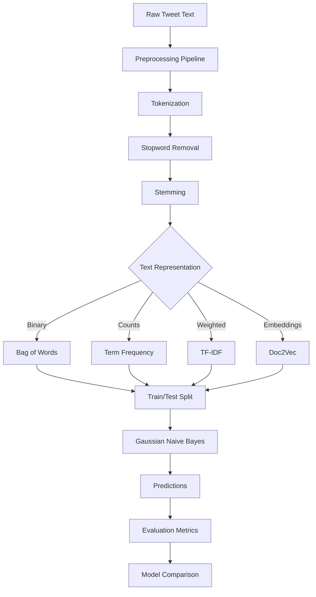

# Sentiment Analysis - NLP1 Part 2 - Coding Guide

## Overview
This notebook demonstrates a complete sentiment analysis pipeline using various text representation techniques and machine learning models. It uses the Twitter US Airline Sentiment dataset to classify tweets as positive, negative, or neutral, comparing different approaches including Bag of Words, Term Frequency, TF-IDF, and sentence embeddings.

## Key Learning Objectives
- Understanding sentiment analysis as a classification problem
- Implementing complete NLP preprocessing pipelines
- Comparing different text representation methods
- Using machine learning models for text classification
- Evaluating model performance with appropriate metrics
- Exploring automated model comparison tools

## Dataset Context
- **Source**: Twitter US Airline Sentiment Dataset
- **Content**: Customer tweets about airline experiences
- **Target Variable**: `airline_sentiment` (positive, negative, neutral)
- **Features**: Tweet text, airline names, timestamps
- **Size**: ~14,000 tweets

## Library Imports and Their Purpose

### 1. Core Libraries
```python
import pandas as pd
import numpy as np
import nltk
```
**Purpose**:
- `pandas` - Data manipulation and analysis
- `numpy` - Numerical operations and array handling
- `nltk` - Natural language processing toolkit

### 2. Machine Learning Libraries
```python
from sklearn.naive_bayes import GaussianNB
from sklearn.metrics import accuracy_score, ConfusionMatrixDisplay, confusion_matrix
from sklearn.model_selection import train_test_split
from sklearn.feature_extraction.text import CountVectorizer, TfidfVectorizer
```
**Purpose**:
- `GaussianNB` - Naive Bayes classifier for continuous features
- `accuracy_score` - Classification accuracy calculation
- `ConfusionMatrixDisplay` - Visualization of classification results
- `train_test_split` - Data splitting for training/testing
- `CountVectorizer` - Term frequency matrix creation
- `TfidfVectorizer` - TF-IDF matrix creation

### 3. Visualization and Advanced Tools
```python
from matplotlib import pyplot as plt
from pycaret.classification import setup, compare_models
```
**Purpose**:
- `matplotlib` - Plotting and visualization
- `pycaret` - Automated machine learning comparison tool

### 4. NLTK Components
```python
from nltk import word_tokenize, TweetTokenizer
from nltk.corpus import stopwords
from nltk.stem import SnowballStemmer
```
**Purpose**:
- `word_tokenize` - General text tokenization
- `TweetTokenizer` - Twitter-specific tokenization
- `stopwords` - Common word filtering
- `SnowballStemmer` - Advanced stemming algorithm

## Data Loading and Exploration

### 1. Dataset Loading
```python
df = pd.read_csv('sample_data/Tweets.csv')
df.head(8)
```
**Purpose**: Load and examine the structure of the Twitter sentiment dataset.

### 2. Class Distribution Analysis
```python
df.airline_sentiment.value_counts(normalize=True)
```
**Purpose**: Understanding the balance of sentiment classes.
**Expected Output**:
```
negative    0.627
neutral     0.211
positive    0.162
```
**Insight**: Dataset is imbalanced with more negative sentiments.

### 3. Data Sampling
```python
indexes = list(range(df.shape[0]))
l = np.random.choice(indexes, df.shape[0])  # Using full dataset
X = df.loc[l, 'text']  # Tweet text
Y = df.loc[l, 'airline_sentiment']  # Sentiment labels
```
**Purpose**: 
- Creates reproducible random sampling
- Separates features (X) from target variable (Y)
- Allows for subset selection if needed for computational efficiency

## Text Preprocessing Pipeline

### 1. Tokenization
```python
tokenized_tweets = []
for each in X.str.lower():
    tokenized_tweets.append(nltk.word_tokenize(each))
```

**Step-by-Step Process**:
1. **Lowercase Conversion**: `X.str.lower()` - Normalizes case
2. **Tokenization**: `word_tokenize()` - Splits text into individual tokens
3. **Storage**: Appends tokenized tweets to list

**Alternative: Twitter-Specific Tokenization**
```python
tokenized_tweets = []
for each in X.str.lower():
    tokenized_tweets.append(TweetTokenizer().tokenize(each))
```
**TweetTokenizer Benefits**:
- Handles emoticons better (e.g., `:-)` stays as one token)
- Preserves hashtags and mentions
- Better handling of contractions and informal text

### 2. Stopword Removal
```python
from nltk.corpus import stopwords
sw_list = stopwords.words('english')
sw_list.extend(['@', "'", '.', '"', '/', '!', ',', "'ve", "...", "n't", "'s"])
```

**Extended Stopwords Explanation**:
- **Punctuation**: `@`, `.`, `!`, `,` - Common punctuation marks
- **Contractions**: `"'ve"`, `"n't"`, `"'s"` - Parts of contractions
- **Social Media**: `@` - Twitter mentions symbol
- **Purpose**: Remove noise while preserving meaningful content

**Filtering Process**:
```python
tweets_after_removing_SW = []
for each in tokenized_tweets:
    line = []
    for word in each:
        if word not in sw_list:
            line.append(word)
    tweets_after_removing_SW.append(line)
```

### 3. Stemming
```python
from nltk.stem import SnowballStemmer
s_stemmer = SnowballStemmer('english')

s_stemmed_list = []
for each_list in tweets_after_removing_SW:
    line = []
    for word in each_list:
        line.append(s_stemmer.stem(word))
    s_stemmed_list.append(line)
```

**SnowballStemmer Advantages**:
- More accurate than Porter Stemmer
- Handles multiple languages
- Better performance on irregular words
- **Example**: "running" → "run", "better" → "better"

## Text Representation Methods

### 1. Bag of Words (BoW) with TransactionEncoder

#### Implementation
```python
from mlxtend.preprocessing import TransactionEncoder
te = TransactionEncoder()
inp = pd.DataFrame(
    te.fit(s_stemmed_list).transform(s_stemmed_list).astype(int), 
    columns=te.columns_
)
```

**Process Breakdown**:
1. **Fit**: `te.fit(s_stemmed_list)` - Learns vocabulary from all documents
2. **Transform**: `te.transform()` - Creates binary matrix (0/1 for absence/presence)
3. **Type Conversion**: `.astype(int)` - Converts boolean to integer
4. **DataFrame Creation**: Structured format with word columns

**Output Structure**:
- **Rows**: Documents (tweets)
- **Columns**: Unique words in vocabulary
- **Values**: 1 if word present, 0 if absent

### 2. Term Frequency (TF) with CountVectorizer

#### Data Preparation
```python
str_data = list(map(' '.join, s_stemmed_list))
```
**Purpose**: Converts list of word lists back to strings (required by CountVectorizer).

#### Implementation
```python
from sklearn.feature_extraction.text import CountVectorizer
cv = CountVectorizer()
cv.fit(str_data)
str_df = pd.DataFrame(
    cv.transform(str_data).todense(), 
    columns=sorted(cv.vocabulary_)
)
```

**Key Differences from BoW**:
- **Values**: Word counts instead of binary presence
- **Sparse Matrix**: `.todense()` converts to full matrix for DataFrame
- **Vocabulary**: `cv.vocabulary_` provides word-to-index mapping

### 3. TF-IDF (Term Frequency-Inverse Document Frequency)

#### Implementation
```python
from sklearn.feature_extraction.text import TfidfVectorizer
tfidf = TfidfVectorizer()
tfidf.fit(str_data)
tfidf_df = pd.DataFrame(
    tfidf.transform(str_data).todense(), 
    columns=sorted(tfidf.vocabulary_)
)
```

**TF-IDF Formula**:
```
TF-IDF(word, document) = TF(word, document) × IDF(word, corpus)
```
Where:
- **TF**: Term frequency in document
- **IDF**: log(total_documents / documents_containing_word)

**Benefits**:
- Reduces importance of common words
- Emphasizes distinctive words
- Better for document classification

## Machine Learning Pipeline

### 1. Data Splitting
```python
x_train, x_test, y_train, y_test = train_test_split(
    features, Y, test_size=0.3, random_state=2
)
```
**Parameters**:
- `test_size=0.3` - 30% for testing, 70% for training
- `random_state=2` - Ensures reproducible splits

### 2. Model Training
```python
from sklearn.naive_bayes import GaussianNB
model = GaussianNB()
model.fit(x_train, y_train)
```

**Why Gaussian Naive Bayes?**
- **Assumption**: Features are continuous and normally distributed
- **Speed**: Fast training and prediction
- **Performance**: Good baseline for text classification
- **Simplicity**: Easy to interpret and implement

### 3. Prediction and Evaluation
```python
y_hat = model.predict(x_test)
accuracy = accuracy_score(y_test, y_hat)
```

**Accuracy Formula**:
```
Accuracy = (TP + TN) / (TP + TN + FP + FN)
```
Where:
- **TP**: True Positives
- **TN**: True Negatives  
- **FP**: False Positives
- **FN**: False Negatives

### 4. Confusion Matrix Visualization
```python
disp = ConfusionMatrixDisplay(
    confusion_matrix(y_test, y_hat), 
    display_labels=list(np.unique(Y))
)
disp.plot()
plt.show()
```

**Confusion Matrix Benefits**:
- Shows per-class performance
- Identifies which classes are confused
- Helps understand model weaknesses

## Advanced Techniques

### 1. Automated Model Comparison with PyCaret

#### Setup
```python
from pycaret.classification import setup, compare_models

# Add target column to features
tfidf_df['Y'] = Y.values

# Initialize experiment
experiment = setup(tfidf_df.loc[:500, :], target='Y')

# Compare multiple models
best_model = compare_models()
```

**PyCaret Benefits**:
- **Automated**: Tests multiple algorithms simultaneously
- **Comprehensive**: Includes preprocessing and evaluation
- **Comparison**: Side-by-side performance metrics
- **Time-Saving**: Reduces manual model testing

### 2. Document Embeddings with Doc2Vec

#### Model Training
```python
from gensim.models.doc2vec import Doc2Vec, TaggedDocument

sentences = str_data[:3000]  # Subset for training
tagged_data = [
    TaggedDocument(words=sentence.split(), tags=[str(i)]) 
    for i, sentence in enumerate(sentences)
]

model = Doc2Vec(
    tagged_data, 
    vector_size=5, 
    window=2, 
    min_count=3, 
    workers=4, 
    epochs=100
)
```

#### Generating Embeddings
```python
sentence_vectors = [
    model.infer_vector(sentence.split()) 
    for sentence in str_data
]
```

**Doc2Vec Advantages**:
- **Semantic Understanding**: Captures document-level meaning
- **Fixed Size**: All documents get same-sized vectors
- **Context Aware**: Considers word order and context

## Performance Comparison Workflow



## Expected Performance Results

### Typical Accuracy Ranges
- **Bag of Words**: 60-70%
- **Term Frequency**: 65-75%
- **TF-IDF**: 70-80%
- **Doc2Vec**: 65-75%

### Factors Affecting Performance
1. **Data Quality**: Clean, relevant tweets perform better
2. **Preprocessing**: Proper tokenization and stemming improve results
3. **Feature Selection**: Removing noise words helps
4. **Model Choice**: Different algorithms suit different representations
5. **Class Imbalance**: Uneven sentiment distribution affects accuracy

## Best Practices and Optimization

### 1. Preprocessing Optimization
```python
# Comprehensive preprocessing function
def preprocess_tweet(text):
    # Convert to lowercase
    text = text.lower()
    
    # Remove URLs, mentions, hashtags if needed
    import re
    text = re.sub(r'http\S+', '', text)  # Remove URLs
    text = re.sub(r'@\w+', '', text)     # Remove mentions
    
    # Tokenize
    tokens = word_tokenize(text)
    
    # Remove stopwords and stem
    tokens = [s_stemmer.stem(word) for word in tokens 
              if word not in sw_list and word.isalpha()]
    
    return tokens
```

### 2. Feature Engineering
```python
# TF-IDF with custom parameters
tfidf = TfidfVectorizer(
    max_features=5000,      # Limit vocabulary size
    min_df=2,               # Ignore rare words
    max_df=0.8,             # Ignore very common words
    ngram_range=(1, 2)      # Include bigrams
)
```

### 3. Model Selection Guidelines
- **Naive Bayes**: Good baseline, fast training
- **Logistic Regression**: Better for TF-IDF features
- **SVM**: Excellent for high-dimensional text data
- **Random Forest**: Good for handling noise
- **Neural Networks**: Best for large datasets with embeddings

## Common Issues and Solutions

### 1. Memory Issues
```python
# Use sparse matrices for large datasets
sparse_matrix = cv.transform(str_data)  # Don't use .todense()
```

### 2. Class Imbalance
```python
from sklearn.utils.class_weight import compute_class_weight
class_weights = compute_class_weight('balanced', classes=np.unique(Y), y=Y)
```

### 3. Overfitting
```python
# Use cross-validation
from sklearn.model_selection import cross_val_score
scores = cross_val_score(model, X, Y, cv=5)
```

## Evaluation Metrics for Sentiment Analysis

### 1. Classification Report
```python
from sklearn.metrics import classification_report
print(classification_report(y_test, y_hat))
```

### 2. Per-Class Metrics
- **Precision**: TP / (TP + FP) - Accuracy of positive predictions
- **Recall**: TP / (TP + FN) - Coverage of actual positives
- **F1-Score**: 2 × (Precision × Recall) / (Precision + Recall)

### 3. Macro vs Micro Averaging
- **Macro**: Average metrics across classes (treats all classes equally)
- **Micro**: Global metrics (weighted by class frequency)

## Real-World Applications

### 1. Business Intelligence
- Monitor brand sentiment on social media
- Track customer satisfaction trends
- Identify emerging issues or complaints

### 2. Content Moderation
- Automatically flag negative content
- Prioritize customer service responses
- Filter inappropriate comments

### 3. Market Research
- Analyze product reception
- Compare competitor sentiment
- Guide marketing strategies

This comprehensive sentiment analysis pipeline demonstrates the complete workflow from raw text to actionable insights, providing a solid foundation for real-world text classification applications.