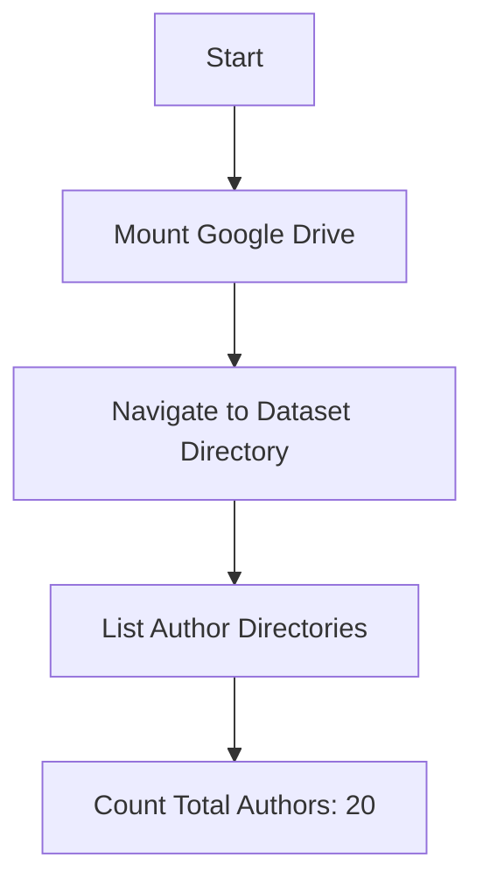
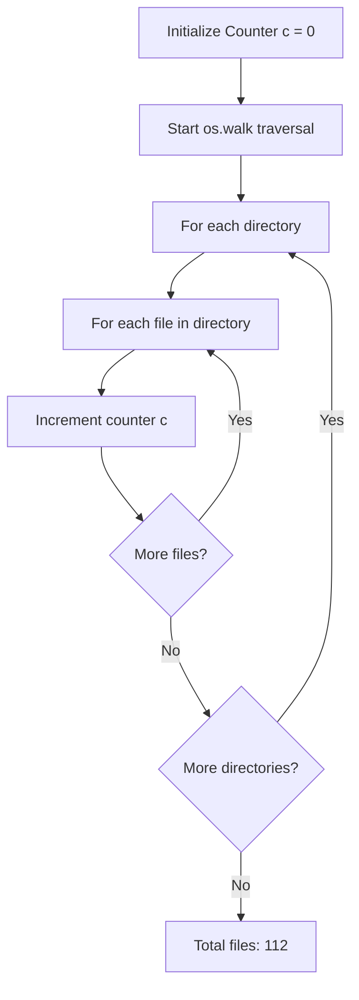

# Step-1 PDFs Parsing - Coding Guide

## Overview
This notebook demonstrates how to extract text from PDF files using Python libraries. It's designed for processing research papers stored in a structured directory format and extracting their textual content for further NLP processing.

## Key Learning Objectives
- Understanding PDF text extraction using Apache Tika
- File system navigation and directory traversal
- Google Colab integration for cloud-based processing
- Batch processing of multiple PDF files

## Library Imports and Their Purpose

### 1. Google Colab Integration
```python
from google.colab import drive
drive.mount('/content/drive')
```
**Purpose**: 
- `google.colab.drive` - Provides access to Google Drive from Colab environment
- `drive.mount()` - Mounts Google Drive to access files stored in the cloud
- Essential for accessing datasets stored in Google Drive

### 2. Operating System Operations
```python
import os
```
**Purpose**:
- `os` - Built-in Python module for operating system interface
- Used for file and directory operations like listing files, walking through directories
- Essential for navigating file systems and counting files

### 3. PDF Text Extraction
```python
import tika
from tika import parser
```
**Purpose**:
- `tika` - Python wrapper for Apache Tika, a content analysis toolkit
- `parser` - Specific module for parsing various document formats including PDFs
- Apache Tika can extract text from PDFs, Word docs, PowerPoint, and many other formats
- More robust than simple PDF libraries as it handles complex PDF structures

## Key Functions and Their Arguments

### 1. Directory Listing and File Counting
```python
len(os.listdir('/content/drive/MyDrive/IK/Dataset-IK/'))
```
**Function**: `os.listdir(path)`
**Arguments**:
- `path` (string) - Directory path to list contents
**Returns**: List of files and directories in the specified path
**Purpose**: Count number of authors (directories) in the dataset

### 2. Recursive Directory Walking
```python
for root, dirs, files in os.walk('/content/drive/MyDrive/IK/Dataset-IK/'):
    for file in files:
        c = c + 1
```
**Function**: `os.walk(path)`
**Arguments**:
- `path` (string) - Starting directory path
**Returns**: Generator yielding 3-tuple (dirpath, dirnames, filenames)
- `root` - Current directory path being processed
- `dirs` - List of subdirectories in current directory
- `files` - List of files in current directory
**Purpose**: Recursively traverse all subdirectories to count total PDF files

### 3. Tika Initialization
```python
tika.initVM()
```
**Function**: `tika.initVM()`
**Purpose**: 
- Initializes the Java Virtual Machine required by Apache Tika
- Must be called before using Tika parsing functions
- Sets up the underlying Java environment for PDF processing

### 4. PDF Text Extraction Function
```python
def extract_text(filename):
    parsed = parser.from_file(filename)
    text = parsed["content"]
    return text
```
**Function**: `parser.from_file(filename)`
**Arguments**:
- `filename` (string) - Full path to the PDF file
**Returns**: Dictionary containing parsed metadata and content
- `parsed["content"]` - Extracted text content from the PDF
- `parsed["metadata"]` - File metadata (not used in this example)

## Code Flow and Logic

### Step 1: Environment Setup


### Step 2: File Discovery and Counting


### Step 3: PDF Processing Setup
```mermaid
graph TD
    A[Install Tika Library] --> B[Import tika and parser]
    B --> C[Initialize JVM with tika.initVM()]
    C --> D[Define extract_text function]
    D --> E[Ready for PDF processing]
```

## Important Coding Concepts

### 1. Package Installation in Colab
```python
!pip install tika
```
- The `!` prefix runs shell commands in Jupyter/Colab
- `pip install` downloads and installs Python packages
- Tika requires Java, which is pre-installed in Colab

### 2. Error Handling Considerations
The current code doesn't include error handling, but in production you should add:
```python
def extract_text_safe(filename):
    try:
        parsed = parser.from_file(filename)
        return parsed["content"] if parsed["content"] else ""
    except Exception as e:
        print(f"Error processing {filename}: {e}")
        return ""
```

### 3. Memory Management
- Tika loads entire PDF into memory
- For large files, consider processing in chunks
- Monitor memory usage when processing many files

### 4. File Path Handling
```python
os.path.join(root, file)  # Properly constructs file paths
```
- Always use `os.path.join()` for cross-platform compatibility
- Handles different path separators (/ vs \) automatically

## Data Flow Diagram


## Best Practices Demonstrated

1. **Modular Function Design**: The `extract_text()` function is reusable
2. **Resource Initialization**: Proper Tika JVM setup before use
3. **Systematic File Processing**: Using `os.walk()` for comprehensive directory traversal
4. **Cloud Integration**: Leveraging Google Colab for scalable processing

## Next Steps
After text extraction, the extracted text would typically be:
1. Cleaned and preprocessed
2. Tokenized into words/sentences
3. Used for NLP tasks like classification, clustering, or analysis

This notebook establishes the foundation for any NLP pipeline by converting unstructured PDF documents into processable text format.