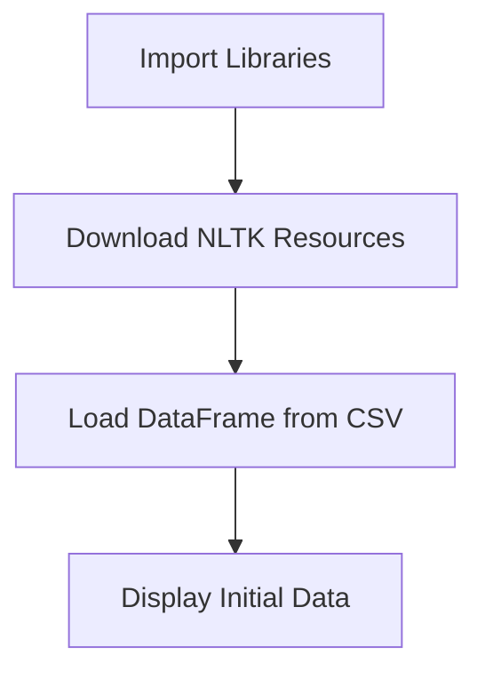
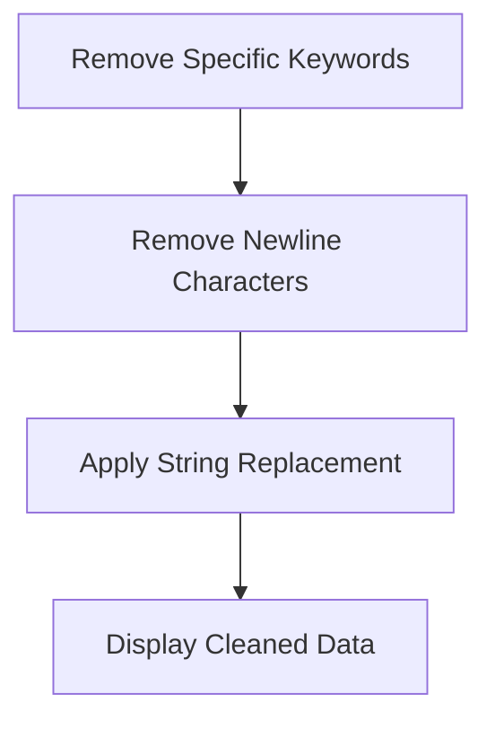
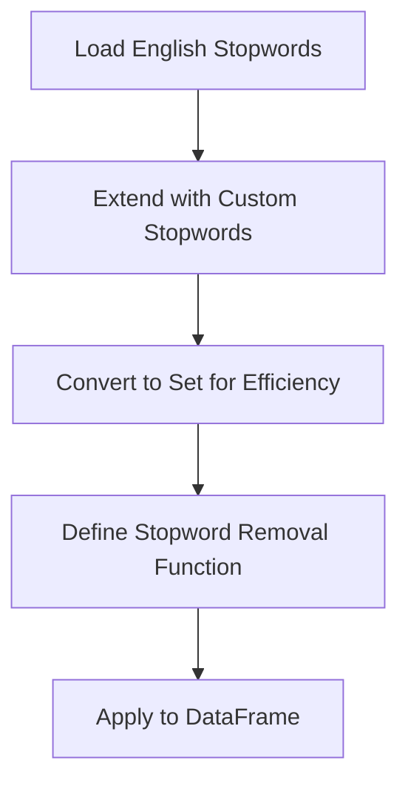
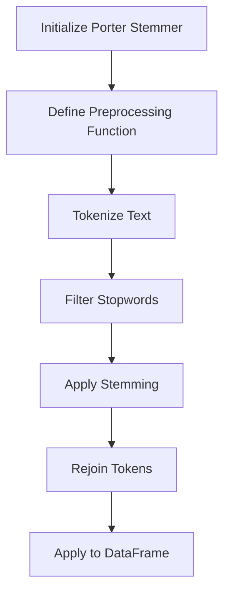
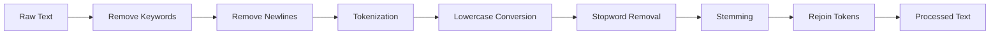

# Step-2 Text Preprocessing - Coding Guide

## Overview
This notebook demonstrates essential text preprocessing techniques for Natural Language Processing (NLP). It covers the fundamental steps needed to clean and prepare text data for analysis, including stopword removal, stemming, and basic text cleaning operations.

## Key Learning Objectives
- Understanding NLTK library and its components
- Text cleaning and normalization techniques
- Stopword removal and its importance
- Stemming algorithms and their applications
- Working with pandas DataFrames for text processing

## Library Imports and Their Purpose

### 1. NLTK (Natural Language Toolkit)
```python
import nltk
nltk.download('stopwords')
nltk.download('punkt')
nltk.download('wordnet')
```
**Purpose**:
- `nltk` - Comprehensive natural language processing library
- `stopwords` - Collection of common words (the, is, at, etc.) that don't carry significant meaning
- `punkt` - Pre-trained tokenizer for splitting text into sentences and words
- `wordnet` - Lexical database for English, used for lemmatization

### 2. NLTK Components
```python
from nltk.corpus import stopwords
from nltk.tokenize import word_tokenize
from nltk.stem import PorterStemmer
```
**Purpose**:
- `stopwords` - Access to predefined stopword lists in multiple languages
- `word_tokenize` - Function to split text into individual words/tokens
- `PorterStemmer` - Algorithm to reduce words to their root form

### 3. Data Manipulation
```python
import pandas as pd
```
**Purpose**:
- `pandas` - Data manipulation library for working with structured data
- Essential for handling CSV files and DataFrame operations

## Key Functions and Their Arguments

### 1. NLTK Downloads
```python
nltk.download('stopwords')
nltk.download('punkt')
nltk.download('wordnet')
```
**Function**: `nltk.download(resource_name)`
**Arguments**:
- `resource_name` (string) - Name of the NLTK resource to download
**Purpose**: Downloads required language models and datasets for text processing

### 2. Loading Stopwords
```python
stop_words = stopwords.words('english')
stop_words.extend(['@', "'", '.', '"', '/', '!', ',', "'ve", "...", "n't"])
stop_words = set(stop_words)
```
**Function**: `stopwords.words(language)`
**Arguments**:
- `language` (string) - Language code (e.g., 'english', 'spanish', 'french')
**Purpose**: 
- Loads predefined stopwords for the specified language
- `extend()` adds custom stopwords (punctuation, contractions)
- Converting to `set()` improves lookup performance

### 3. Word Tokenization
```python
tokens = word_tokenize(text)
```
**Function**: `word_tokenize(text)`
**Arguments**:
- `text` (string) - Input text to be tokenized
**Returns**: List of individual words/tokens
**Purpose**: Splits text into individual words while handling punctuation correctly

### 4. Porter Stemmer
```python
stemmer = PorterStemmer()
stemmed_word = stemmer.stem(word.lower())
```
**Function**: `stemmer.stem(word)`
**Arguments**:
- `word` (string) - Individual word to be stemmed
**Returns**: Root form of the word
**Purpose**: Reduces words to their base form (e.g., "running" → "run", "better" → "better")

### 5. Text Preprocessing Function
```python
def preprocess_text(text):
    if isinstance(text, str):
        tokens = word_tokenize(text)
        filtered_tokens = [stemmer.stem(word.lower()) for word in tokens if word.lower() not in stop_words]
        return ' '.join(filtered_tokens)
    return text
```
**Function Components**:
- `isinstance(text, str)` - Checks if input is a string to avoid errors
- List comprehension with multiple operations:
  - `word.lower()` - Converts to lowercase
  - `word.lower() not in stop_words` - Filters out stopwords
  - `stemmer.stem(word.lower())` - Applies stemming
- `' '.join(filtered_tokens)` - Reconstructs text from processed tokens

## Code Flow and Logic

### Step 1: Environment Setup and Data Loading


### Step 2: Basic Text Cleaning


### Step 3: Stopword Removal Process


### Step 4: Stemming Process


## Important Coding Concepts

### 1. String Methods in Pandas
```python
df['Text'] = df['Text'].str.replace(_keyword, '')
df['Text'] = df['Text'].str.replace(_newline_keyword, '')
```
**Concept**: Pandas string accessor (`.str`) allows vectorized string operations
**Purpose**: Apply string methods to entire DataFrame columns efficiently

### 2. List Comprehension with Conditions
```python
filtered_tokens = [stemmer.stem(word.lower()) for word in tokens if word.lower() not in stop_words]
```
**Components**:
- `for word in tokens` - Iterate through each token
- `if word.lower() not in stop_words` - Conditional filtering
- `stemmer.stem(word.lower())` - Transformation applied to each valid token

### 3. Type Checking for Robustness
```python
if isinstance(text, str):
    # Process text
else:
    return text
```
**Purpose**: Prevents errors when DataFrame contains non-string values (NaN, None, etc.)

### 4. Set Operations for Performance
```python
stop_words = set(stop_words)
if word.lower() not in stop_words:
```
**Concept**: Set lookup is O(1) vs list lookup O(n)
**Impact**: Significant performance improvement for large stopword lists

## Text Preprocessing Pipeline



## Before and After Example

### Before Preprocessing:
```
"The researchers are studying the effects of climate change on biodiversity."
```

### After Preprocessing:
```
"research studi effect climat chang biodivers"
```

**Changes Applied**:
1. Removed stopwords: "The", "are", "the", "of", "on"
2. Converted to lowercase: all words
3. Applied stemming: "researchers" → "research", "studying" → "studi", "effects" → "effect"

## Performance Considerations

### 1. DataFrame Apply vs Vectorized Operations
```python
# Slower - applies function to each row
df['Text'] = df['Text'].apply(preprocess_text)

# Faster - vectorized string operations where possible
df['Text'] = df['Text'].str.replace('pattern', 'replacement')
```

### 2. Memory Management
- Text preprocessing can be memory-intensive for large datasets
- Consider processing in chunks for very large files
- Use generators for streaming processing when possible

## Best Practices Demonstrated

1. **Modular Function Design**: Separate functions for different preprocessing steps
2. **Error Handling**: Type checking to prevent runtime errors
3. **Performance Optimization**: Using sets for fast lookups
4. **Extensibility**: Easy to add custom stopwords or modify preprocessing steps
5. **Documentation**: Clear variable names and logical flow

## Common Stemming Results
- running, runs, ran → run
- better, good, best → (varies - stemming isn't perfect)
- studies, studying, studied → studi
- organizations, organize, organized → organ

## Next Steps
After preprocessing, the cleaned text is ready for:
1. Feature extraction (TF-IDF, Bag of Words)
2. Text vectorization
3. Machine learning model training
4. Text analysis and mining

This preprocessing step is crucial as it standardizes the text format and reduces noise, leading to better performance in downstream NLP tasks.