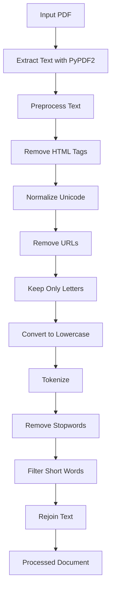
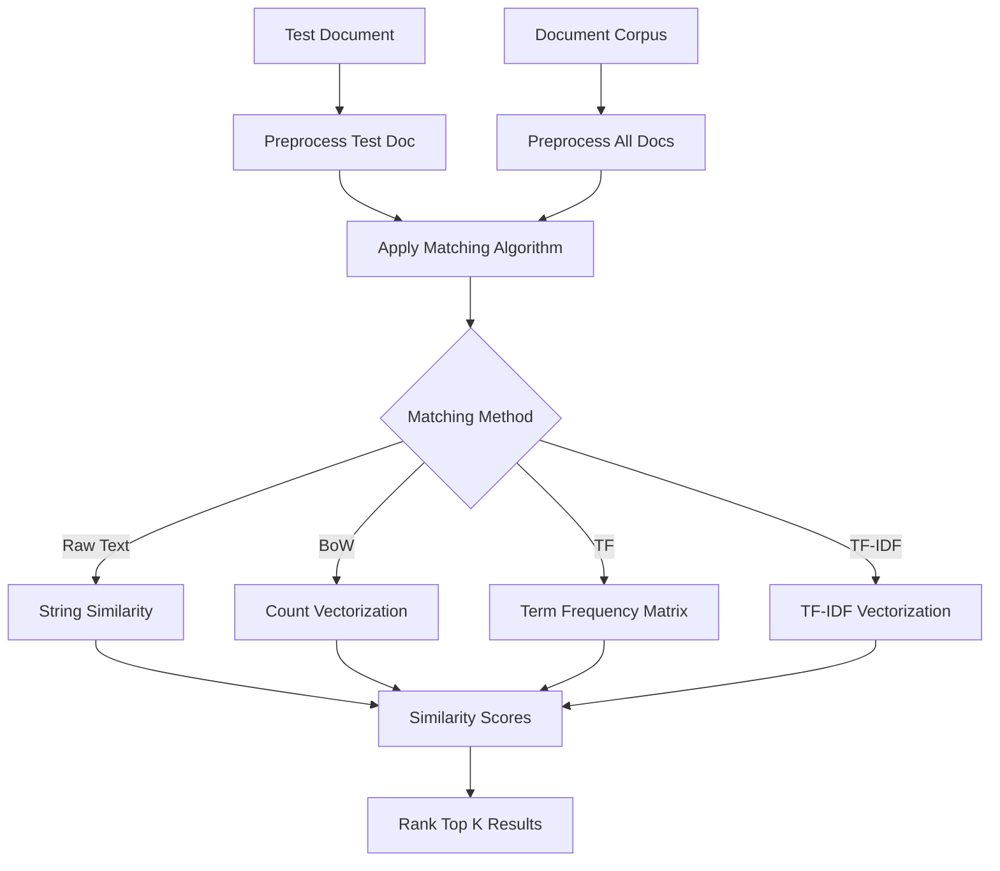

# Step-3 Solution: Text Matching, BoW, TF, TF-IDF - Coding Guide

## Overview
This notebook demonstrates advanced text analysis techniques including raw text matching, Bag of Words (BoW), Term Frequency (TF), and Term Frequency-Inverse Document Frequency (TF-IDF). These are fundamental techniques for document similarity, information retrieval, and text classification in NLP.

## Key Learning Objectives
- Understanding different text representation methods
- Implementing document similarity algorithms
- Working with PDF text extraction using PyPDF2
- Creating text vectorization pipelines
- Comparing effectiveness of different text matching approaches

## Library Imports and Their Purpose

### 1. PDF Processing
```python
import PyPDF2
```
**Purpose**:
- `PyPDF2` - Pure Python library for PDF manipulation and text extraction
- Alternative to Apache Tika, lighter weight but less robust
- Good for simple PDF text extraction tasks

### 2. Text Processing Libraries
```python
import nltk
from nltk.corpus import stopwords
import pandas as pd
import numpy as np
import unicodedata
import re
```
**Purpose**:
- `nltk` - Natural Language Toolkit for text processing
- `stopwords` - Common words filtering
- `pandas` - Data manipulation and analysis
- `numpy` - Numerical computing for vector operations
- `unicodedata` - Unicode character handling and normalization
- `re` - Regular expressions for pattern matching and text cleaning

## Key Functions and Their Arguments

### 1. PDF Text Extraction
```python
def extract_text_from_pdf(pdf_path):
    with open(pdf_path, 'rb') as pdf_file:
        pdf_reader = PyPDF2.PdfReader(pdf_file)
        pdf_text = ''
        for page_num in range(len(pdf_reader.pages)):
            page = pdf_reader.pages[page_num]
            pdf_text += page.extract_text()
    return pdf_text
```
**Function Components**:
- `open(pdf_path, 'rb')` - Opens PDF file in binary read mode
- `PyPDF2.PdfReader(pdf_file)` - Creates PDF reader object
- `len(pdf_reader.pages)` - Gets total number of pages
- `pdf_reader.pages[page_num]` - Accesses specific page
- `page.extract_text()` - Extracts text from individual page

### 2. Advanced Text Preprocessing
```python
def preprocess_text(text):
    if not isinstance(text, str):
        return ''
    text = text.replace('\\n', ' ').replace('\\r', ' ')
    text = re.sub('<[^>]*>', '', text)
    text = unicodedata.normalize('NFKD', text).encode('ascii', 'ignore').decode('utf-8', 'ignore')
    text = re.sub('http[s]?://\\S+', '', text)
    text = re.sub('[^a-zA-Z]', ' ', text)
    text = text.lower()
    text = text.split()
    text = [word for word in text if word not in stop_words]
    text = [word for word in text if len(word) > 2]
    text = ' '.join(text)
    return text
```

**Step-by-Step Breakdown**:

#### Step 1: Input Validation
```python
if not isinstance(text, str):
    return ''
```
**Purpose**: Ensures input is a string, returns empty string for invalid inputs

#### Step 2: Newline and Carriage Return Removal
```python
text = text.replace('\\n', ' ').replace('\\r', ' ')
```
**Purpose**: Replaces line breaks with spaces to maintain word separation

#### Step 3: HTML Tag Removal
```python
text = re.sub('<[^>]*>', '', text)
```
**Regex Pattern**: `<[^>]*>`
- `<` - Matches opening angle bracket
- `[^>]*` - Matches any character except `>`, zero or more times
- `>` - Matches closing angle bracket
**Purpose**: Removes HTML/XML tags from text

#### Step 4: Unicode Normalization
```python
text = unicodedata.normalize('NFKD', text).encode('ascii', 'ignore').decode('utf-8', 'ignore')
```
**Components**:
- `unicodedata.normalize('NFKD', text)` - Normalizes Unicode characters
- `.encode('ascii', 'ignore')` - Converts to ASCII, ignoring non-ASCII characters
- `.decode('utf-8', 'ignore')` - Converts back to string
**Purpose**: Handles special characters, accents, and encoding issues

#### Step 5: URL Removal
```python
text = re.sub('http[s]?://\\S+', '', text)
```
**Regex Pattern**: `http[s]?://\\S+`
- `http` - Matches literal "http"
- `[s]?` - Optionally matches "s" (for https)
- `://` - Matches literal "://"
- `\\S+` - Matches one or more non-whitespace characters
**Purpose**: Removes web URLs from text

#### Step 6: Keep Only Alphabetic Characters
```python
text = re.sub('[^a-zA-Z]', ' ', text)
```
**Regex Pattern**: `[^a-zA-Z]`
- `[^...]` - Negated character class (matches anything NOT in the brackets)
- `a-zA-Z` - All lowercase and uppercase letters
**Purpose**: Replaces all non-alphabetic characters with spaces

#### Step 7: Case Normalization
```python
text = text.lower()
```
**Purpose**: Converts all text to lowercase for consistent comparison

#### Step 8: Tokenization and Filtering
```python
text = text.split()
text = [word for word in text if word not in stop_words]
text = [word for word in text if len(word) > 2]
text = ' '.join(text)
```
**Steps**:
1. `split()` - Splits text into individual words
2. First list comprehension - Removes stopwords
3. Second list comprehension - Removes words shorter than 3 characters
4. `join()` - Reconstructs text from filtered words

### 3. Test Document Processing
```python
def preprocess_test_document(pdf_path):
    test_document_text = extract_text_from_pdf(pdf_path)
    preprocessed_text = preprocess_text(test_document_text)
    return preprocessed_text
```
**Purpose**: Combines PDF extraction and preprocessing into single function

### 4. CSV Data Processing
```python
def preprocess_csv_file(csv_path, text_column):
    data = pd.read_csv(csv_path)
    csv_text_data = data[text_column].tolist()
    preprocessed_texts = [preprocess_text(text) for text in csv_text_data]
    return preprocessed_texts
```
**Purpose**: Processes entire CSV file of documents for comparison

## Text Representation Methods

### 1. Raw Text Matching
**Concept**: Direct string comparison between documents
**Advantages**: Simple, exact matching
**Disadvantages**: Sensitive to word order, synonyms not handled

### 2. Bag of Words (BoW)
**Concept**: Represents text as collection of words, ignoring order
**Implementation**:
```python
from sklearn.feature_extraction.text import CountVectorizer
vectorizer = CountVectorizer()
bow_matrix = vectorizer.fit_transform(documents)
```

### 3. Term Frequency (TF)
**Formula**: TF(t,d) = (Number of times term t appears in document d) / (Total number of terms in document d)
**Purpose**: Measures how frequently a term appears in a document

### 4. TF-IDF (Term Frequency-Inverse Document Frequency)
**Formula**: TF-IDF(t,d,D) = TF(t,d) × IDF(t,D)
**Where**: IDF(t,D) = log(N / |{d ∈ D : t ∈ d}|)
**Purpose**: Balances term frequency with rarity across the corpus

## Code Flow and Logic

### Document Processing Pipeline


### Text Matching Workflow


## Advanced Preprocessing Techniques

### 1. Unicode Normalization
```python
unicodedata.normalize('NFKD', text)
```
**NFKD**: Normalization Form Compatibility Decomposition
- Decomposes characters into base + combining characters
- Handles accented characters, special symbols
- Essential for multilingual text processing

### 2. Regular Expression Patterns

#### HTML Tag Removal
```python
re.sub('<[^>]*>', '', text)
```
**Pattern Explanation**:
- `<` - Literal less-than sign
- `[^>]*` - Any character except `>`, repeated 0+ times
- `>` - Literal greater-than sign

#### URL Detection
```python
re.sub('http[s]?://\\S+', '', text)
```
**Pattern Explanation**:
- `http` - Literal "http"
- `[s]?` - Optional "s" character
- `://` - Literal "://"
- `\\S+` - One or more non-whitespace characters

#### Non-alphabetic Character Removal
```python
re.sub('[^a-zA-Z]', ' ', text)
```
**Pattern Explanation**:
- `[^a-zA-Z]` - Negated character class matching anything except letters

### 3. Error Handling
```python
try:
    with open(pdf_path, 'rb') as pdf_file:
        # PDF processing
except KeyError as e:
    print(f"Error processing file '{pdf_path}': {e}")
    return ''
```
**Purpose**: Gracefully handles PDF parsing errors

## Performance Considerations

### 1. Memory Management
- Large document collections can consume significant memory
- Consider processing documents in batches
- Use generators for streaming processing

### 2. Computational Complexity
- Raw text matching: O(n×m) where n,m are document lengths
- BoW/TF-IDF: O(n×v) where v is vocabulary size
- Consider using sparse matrices for large vocabularies

### 3. Preprocessing Optimization
```python
# Compile regex patterns once for reuse
html_pattern = re.compile('<[^>]*>')
url_pattern = re.compile('http[s]?://\\S+')
non_alpha_pattern = re.compile('[^a-zA-Z]')
```

## Similarity Metrics

### 1. Cosine Similarity
```python
from sklearn.metrics.pairwise import cosine_similarity
similarity = cosine_similarity(doc1_vector, doc2_vector)
```

### 2. Euclidean Distance
```python
from scipy.spatial.distance import euclidean
distance = euclidean(doc1_vector, doc2_vector)
```

### 3. Jaccard Similarity
```python
def jaccard_similarity(set1, set2):
    intersection = len(set1.intersection(set2))
    union = len(set1.union(set2))
    return intersection / union
```

## Best Practices Demonstrated

1. **Robust Error Handling**: Try-catch blocks for file operations
2. **Modular Design**: Separate functions for different processing steps
3. **Input Validation**: Type checking before processing
4. **Comprehensive Cleaning**: Multiple preprocessing steps for clean text
5. **Configurable Parameters**: Easy to modify stopwords, filtering criteria
6. **Memory Efficiency**: Processing documents individually rather than loading all at once

## Common Use Cases

1. **Document Similarity**: Finding similar research papers
2. **Plagiarism Detection**: Comparing documents for copied content
3. **Information Retrieval**: Searching relevant documents
4. **Content Recommendation**: Suggesting similar articles
5. **Duplicate Detection**: Identifying duplicate documents

## Next Steps
After implementing these text representation methods, you can:
1. Compare effectiveness of different approaches
2. Implement more advanced techniques like Word2Vec or BERT
3. Build document classification systems
4. Create recommendation engines
5. Develop search and retrieval systems

This notebook provides the foundation for understanding how text can be converted into numerical representations suitable for machine learning algorithms.