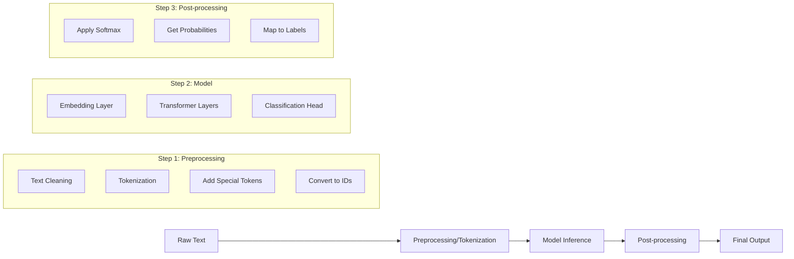

# Behind the Hugging Face Transformers Pipeline (PyTorch) - Coding Guide

## Overview
This notebook demonstrates how to use Hugging Face Transformers library for sentiment analysis and explores what happens behind the scenes in a transformer pipeline. It's designed to help beginners understand the step-by-step process of using pre-trained models for NLP tasks.

## Learning Objectives
- Understand how to install and use Hugging Face Transformers
- Learn about sentiment analysis pipelines
- Explore the internal workings of transformer models
- Understand tokenization, model inference, and post-processing

## Key Concepts Covered

### 1. Library Installation and Setup

#### Code Section: Package Installation
```python
!pip install datasets evaluate transformers[sentencepiece] --quiet
```

**What this does:**
- **datasets**: Hugging Face library for loading and processing datasets
- **evaluate**: Library for model evaluation metrics
- **transformers[sentencepiece]**: Main transformers library with SentencePiece tokenizer support
- **--quiet**: Suppresses verbose installation output
- **sentencepiece**: A tokenization library that handles subword tokenization (important for many modern NLP models)

**Why these libraries:**
- `transformers` is the core library for using pre-trained transformer models
- `datasets` provides easy access to thousands of NLP datasets
- `evaluate` offers standardized evaluation metrics
- `sentencepiece` enables advanced tokenization needed by many models

### 2. Basic Pipeline Usage

#### Code Section: Simple Sentiment Analysis
```python
from transformers import pipeline

classifier = pipeline("sentiment-analysis")
classifier([
    "This would make a great breakfast. Add some figs to it and it will be the best ever.",
    "I hate this so much!",
])
```

**Key Components Explained:**

**`pipeline()` function:**
- **Purpose**: Creates a high-level interface for common NLP tasks
- **Arguments**: 
  - `"sentiment-analysis"`: Specifies the task type
  - No model specified = uses default model (distilbert-base-uncased-finetuned-sst-2-english)
- **Returns**: A callable pipeline object

**Default Model Selection:**
- When no model is specified, Hugging Face automatically selects a suitable pre-trained model
- For sentiment analysis: DistilBERT fine-tuned on Stanford Sentiment Treebank (SST-2)
- This model classifies text as POSITIVE or NEGATIVE

**Input Format:**
- Accepts single strings or lists of strings
- Each string is processed independently
- Returns confidence scores for each prediction

**Output Format:**
```python
[
    {'label': 'POSITIVE', 'score': 0.9998351335525513},
    {'label': 'NEGATIVE', 'score': 0.9994558691978455}
]
```
- **label**: Predicted class (POSITIVE/NEGATIVE)
- **score**: Confidence score (0-1, higher = more confident)

### 3. Pipeline Architecture

The pipeline consists of three main steps:



### 4. Understanding Model Components

#### Tokenization Process:
1. **Text Normalization**: Convert to lowercase, handle special characters
2. **Subword Tokenization**: Break words into smaller units (using SentencePiece or similar)
3. **Special Tokens**: Add [CLS] (classification) and [SEP] (separator) tokens
4. **ID Conversion**: Convert tokens to numerical IDs the model understands

#### Model Architecture (DistilBERT):
- **Embedding Layer**: Converts token IDs to dense vectors
- **Transformer Layers**: Self-attention mechanisms that understand context
- **Classification Head**: Final layer that outputs class probabilities

#### Post-processing:
- **Softmax**: Converts raw scores to probabilities (sum to 1)
- **Label Mapping**: Maps probability indices to human-readable labels
- **Confidence Scoring**: Provides confidence scores for predictions

## Important Notes for Beginners

### 1. Model Loading Behavior
- First run downloads the model (can be large, ~268MB for DistilBERT)
- Subsequent runs use cached model (faster)
- Models are stored in `~/.cache/huggingface/`

### 2. Hardware Considerations
- Default: Models run on CPU
- For faster inference: specify GPU with `device=0` parameter
- GPU usage requires CUDA-compatible hardware and drivers

### 3. Authentication (Optional)
- Hugging Face Hub token enables access to private models
- Not required for public models
- Can be set up in Google Colab secrets or environment variables

### 4. Model Selection Best Practices
- Always specify model name in production code
- Default models may change over time
- Consider model size vs. accuracy trade-offs

## Common Use Cases

### 1. Batch Processing
```python
# Process multiple texts efficiently
texts = ["Text 1", "Text 2", "Text 3"]
results = classifier(texts)
```

### 2. Custom Model Usage
```python
# Use specific model instead of default
classifier = pipeline("sentiment-analysis", 
                     model="cardiffnlp/twitter-roberta-base-sentiment-latest")
```

### 3. Different Tasks
```python
# Other available tasks
summarizer = pipeline("summarization")
translator = pipeline("translation_en_to_fr")
qa_pipeline = pipeline("question-answering")
```

## Performance Considerations

### Memory Usage:
- Each model loads into memory (~268MB for DistilBERT)
- Batch processing is more memory-efficient than individual predictions
- Consider model size for deployment constraints

### Speed Optimization:
- Use GPU when available
- Batch multiple inputs together
- Consider smaller models (DistilBERT vs BERT) for speed

### Accuracy vs Speed Trade-offs:
- Larger models (BERT, RoBERTa) = higher accuracy, slower inference
- Smaller models (DistilBERT, MobileBERT) = faster inference, slightly lower accuracy

## Next Steps
This notebook introduces the high-level pipeline interface. Advanced topics include:
- Manual tokenization and model inference
- Fine-tuning models on custom data
- Understanding attention mechanisms
- Building custom classification heads

## Troubleshooting Common Issues

1. **Installation Problems**: Ensure Python 3.7+ and sufficient disk space
2. **Memory Errors**: Use smaller batch sizes or smaller models
3. **Slow Performance**: Consider GPU usage or model optimization
4. **Network Issues**: Models download from internet; check connectivity

This guide provides the foundation for understanding transformer-based NLP pipelines and prepares you for more advanced transformer concepts covered in subsequent notebooks.