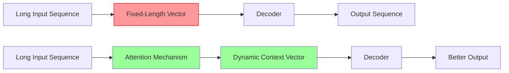
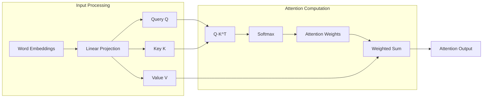
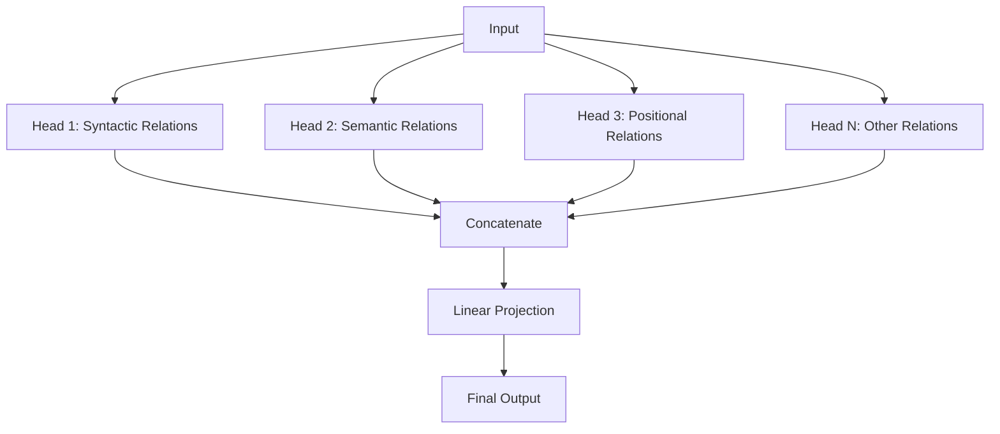
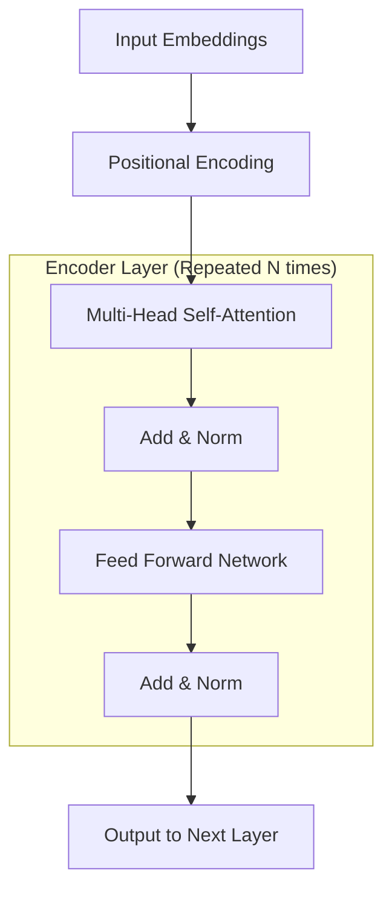

# Student Version - Attention Mechanism - Encoder Construction - Coding Guide

## Overview
This notebook provides a comprehensive introduction to attention mechanisms and transformer architecture. It's designed to help students understand the theoretical foundations and practical implementation of attention mechanisms that revolutionized natural language processing.

## Learning Objectives
- Understand the motivation behind attention mechanisms
- Learn the mathematical foundations of attention
- Explore the general attention mechanism (Query, Key, Value)
- Understand transformer architecture components
- Implement attention mechanisms from scratch

## Key Concepts Covered

### 1. Introduction to Attention Mechanism

#### Historical Context
The attention mechanism was introduced by **Bahdanau et al. (2014)** to solve a critical problem in sequence-to-sequence models:

**The Bottleneck Problem:**
- Traditional encoder-decoder models used a fixed-length encoding vector
- This created a bottleneck where all input information had to be compressed into a single vector
- Performance degraded significantly for long or complex sequences
- The decoder had limited access to the full input information

#### Why Attention Matters


### 2. Bahdanau Attention Mechanism

#### Step-by-Step Process

**Step 1: Alignment Scores**
```
e_{t,i} = a(s_{t-1}, h_i)
```
- **e_{t,i}**: Alignment score between decoder state and encoder hidden state
- **s_{t-1}**: Previous decoder output (query)
- **h_i**: Encoder hidden state at position i
- **a(.)**: Alignment function (typically a feedforward neural network)

**What this means:**
- Measures how well input position i aligns with current output position t
- Higher scores indicate more relevant input positions

**Step 2: Attention Weights**
```
α_{t,i} = softmax(e_{t,i})
```
- **α_{t,i}**: Normalized attention weights
- **softmax**: Ensures weights sum to 1 across all input positions

**Why softmax:**
- Converts raw scores to probabilities
- Allows model to focus on most relevant parts while considering all inputs
- Differentiable for backpropagation

**Step 3: Context Vector**
```
c_t = Σ(i=1 to T) α_{t,i} * h_i
```
- **c_t**: Context vector for time step t
- Weighted sum of all encoder hidden states
- Dynamically focuses on relevant input parts

#### Implementation Flow
```mermaid
graph TD
    A[Encoder Hidden States h_1...h_T] --> B[Alignment Function]
    C[Previous Decoder State s_{t-1}] --> B
    B --> D[Alignment Scores e_{t,i}]
    D --> E[Softmax Normalization]
    E --> F[Attention Weights α_{t,i}]
    F --> G[Weighted Sum]
    A --> G
    G --> H[Context Vector c_t]
    H --> I[Decoder Input]
```

### 3. General Attention Mechanism (Query-Key-Value)

#### Core Components

**Query (Q):**
- Represents "what we're looking for"
- In machine translation: current decoder state
- Determines what information to focus on

**Key (K):**
- Represents "what's available"
- In machine translation: encoder hidden states
- Used to compute attention scores with queries

**Value (V):**
- Represents "the actual information"
- Often same as keys in basic attention
- Contains the information to be retrieved

#### Mathematical Formulation

**Step 1: Score Computation**
```
e_{q,k_i} = q · k_i
```
- **Dot product**: Measures similarity between query and each key
- Higher dot product = higher relevance

**Step 2: Weight Computation**
```
α_{q,k_i} = softmax(e_{q,k_i})
```
- Normalizes scores to create probability distribution

**Step 3: Attention Output**
```
attention(q, K, V) = Σ_i α_{q,k_i} * v_{k_i}
```
- Weighted combination of values based on attention weights

#### Attention Mechanism Visualization


### 4. Practical Understanding

#### Word-Level Attention Example
When processing the sentence "The cat sat on the mat":

1. **Query**: Current word being processed (e.g., "sat")
2. **Keys**: All words in the sentence
3. **Values**: Semantic representations of all words

**Attention Process:**
- Query "sat" computes similarity with all keys
- High attention to "cat" (subject) and "mat" (object)
- Lower attention to articles "the"
- Creates context-aware representation of "sat"

#### Multi-Head Attention Concept


### 5. Transformer Architecture Overview

#### Key Innovation
- **Self-Attention**: Each position attends to all positions in the same sequence
- **Parallel Processing**: Unlike RNNs, all positions processed simultaneously
- **Positional Encoding**: Adds position information since attention is permutation-invariant

#### Encoder Structure


#### Self-Attention Benefits
1. **Long-Range Dependencies**: Direct connections between distant positions
2. **Parallelization**: All positions processed simultaneously
3. **Interpretability**: Attention weights show what the model focuses on
4. **Flexibility**: Same mechanism handles various sequence lengths

### 6. Implementation Considerations

#### Attention Score Computation Methods

**1. Dot-Product Attention (Scaled)**
```
Attention(Q,K,V) = softmax(QK^T / √d_k)V
```
- **√d_k**: Scaling factor to prevent vanishing gradients
- **d_k**: Dimension of key vectors
- Most commonly used in transformers

**2. Additive Attention (Bahdanau)**
```
e_i = v^T tanh(W_q q + W_k k_i)
```
- Uses learned parameters W_q, W_k, v
- More computationally expensive but sometimes more expressive

**3. Multiplicative Attention**
```
e_i = q^T W k_i
```
- Uses learned weight matrix W
- Balance between dot-product and additive

#### Computational Complexity
- **Self-Attention**: O(n²d) where n = sequence length, d = model dimension
- **Memory**: O(n²) for attention matrix
- **Trade-off**: Better modeling vs. computational cost for long sequences

### 7. Practical Applications

#### Machine Translation
- **Encoder**: Processes source language sentence
- **Decoder**: Generates target language with attention to source
- **Cross-Attention**: Decoder attends to encoder outputs

#### Text Summarization
- **Self-Attention**: Identifies important sentences/phrases
- **Context Understanding**: Maintains coherence across document
- **Information Compression**: Focuses on salient content

#### Question Answering
- **Query Encoding**: Question representation
- **Context Attention**: Focus on relevant passage parts
- **Answer Extraction**: Attend to answer-containing spans

### 8. Advanced Concepts

#### Positional Encoding
```python
# Sinusoidal positional encoding
PE(pos, 2i) = sin(pos / 10000^(2i/d_model))
PE(pos, 2i+1) = cos(pos / 10000^(2i/d_model))
```
- **Purpose**: Inject position information into embeddings
- **Sinusoidal**: Allows model to learn relative positions
- **Learnable Alternative**: Trainable position embeddings

#### Layer Normalization
```python
# Applied before each sub-layer (Pre-LN) or after (Post-LN)
output = LayerNorm(x + Sublayer(x))
```
- **Residual Connections**: Help with gradient flow
- **Normalization**: Stabilizes training
- **Pre-LN vs Post-LN**: Different normalization placement strategies

### 9. Training Considerations

#### Attention Dropout
- Applied to attention weights to prevent overfitting
- Randomly sets some attention weights to zero during training
- Encourages model to use diverse attention patterns

#### Gradient Flow
- **Residual Connections**: Enable training of very deep networks
- **Attention Gradients**: Flow directly through attention mechanism
- **Vanishing Gradient Problem**: Largely solved by attention architecture

### 10. Evaluation and Interpretation

#### Attention Visualization
- **Heat Maps**: Show which inputs the model focuses on
- **Attention Heads**: Different heads learn different patterns
- **Layer Analysis**: Attention patterns change across layers

#### Common Attention Patterns
1. **Syntactic Attention**: Focuses on grammatically related words
2. **Semantic Attention**: Attends to semantically similar concepts
3. **Positional Attention**: Focuses on nearby or distant positions
4. **Task-Specific Attention**: Learns patterns relevant to specific tasks

## Summary

The attention mechanism represents a fundamental shift in how neural networks process sequential data:

1. **Problem Solved**: Overcame the bottleneck of fixed-length representations
2. **Key Innovation**: Dynamic, learnable focus on relevant input parts
3. **Mathematical Foundation**: Query-Key-Value framework with softmax normalization
4. **Architectural Impact**: Enabled the transformer revolution in NLP
5. **Practical Benefits**: Better performance, interpretability, and parallelization

This foundation enables understanding of modern transformer models like BERT, GPT, and T5 that have revolutionized natural language processing and beyond.

## Next Steps
- Implement basic attention mechanism from scratch
- Explore multi-head attention
- Study transformer encoder/decoder architecture
- Experiment with different attention variants
- Apply attention to specific NLP tasks