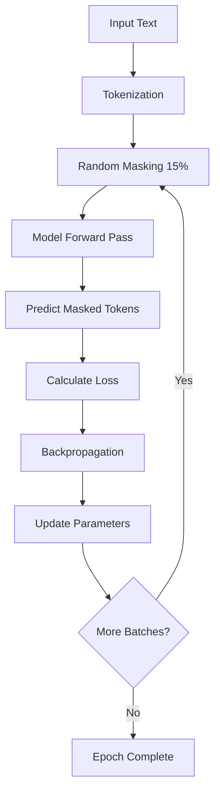

# Natural Language Processing 3: RoBERTa Training - Coding Guide

## Overview
This notebook demonstrates how to fine-tune and retrain RoBERTa (Robustly Optimized BERT Pretraining Approach) models using custom datasets. It covers the complete pipeline from loading pretrained models to training on domain-specific data and comparing performance between base and retrained models. The focus is on Masked Language Modeling (MLM) using hate speech detection data from TweetEval.

## Learning Objectives
- Understand RoBERTa architecture and improvements over BERT
- Learn how to set up training pipelines with Hugging Face Transformers
- Implement Masked Language Modeling (MLM) training
- Use data collators for dynamic masking
- Compare base vs. fine-tuned model performance
- Master the Trainer API for model training

## Key Concepts: RoBERTa vs BERT

### RoBERTa Improvements Over BERT

| Aspect | BERT | RoBERTa |
|--------|------|---------|
| **Training Duration** | 100K iterations | 300K-500K iterations |
| **Vocabulary** | 30K character-level BPE | 50K byte-level BPE |
| **Masking Strategy** | Static masking | Dynamic masking |
| **Next Sentence Prediction** | Included | Removed (NSP) |
| **Batch Size** | Smaller | Larger |
| **Learning Rate** | Standard | Higher |
| **Token Type IDs** | Used | Not used |

### Dynamic vs Static Masking
- **Static Masking (BERT)**: Masks are determined once during preprocessing
- **Dynamic Masking (RoBERTa)**: New masks generated each time sequence is fed to model
- **Benefit**: Prevents overfitting to specific mask patterns

## Key Libraries and Their Purpose

### 1. **Transformers** - Hugging Face Transformers Library
```python
from transformers import (
    pipeline, RobertaTokenizer, RobertaForMaskedLM,
    LineByLineTextDataset, DataCollatorForLanguageModeling,
    Trainer, TrainingArguments
)
```
- **Purpose**: Complete ecosystem for transformer model training and inference
- **Key Components**:
  - Model architectures (RoBERTa, BERT, etc.)
  - Tokenizers for text preprocessing
  - Training utilities (Trainer, TrainingArguments)
  - Data handling (datasets, collators)

### 2. **Accelerate** - Distributed Training Library
```bash
!pip install accelerate -U
```
- **Purpose**: Enables same PyTorch code across different distributed configurations
- **Benefits**: Automatic handling of multi-GPU, TPU, and mixed precision training
- **Integration**: Seamlessly works with Hugging Face Trainer

### 3. **PyTorch** - Deep Learning Framework
```python
import torch
```
- **Purpose**: Underlying tensor operations and neural network computations
- **Role**: Backend for Transformers library operations

## Code Analysis by Section

### Section 1: Environment Setup and Data Preparation

#### Cell 5-7: Installation and Data Acquisition
```bash
# Installing the required libraries
!pip install transformers[torch]

# Accelerate for distributed training
!pip install accelerate -U

# Cloning the dataset tweeteval repo
!git clone https://github.com/cardiffnlp/tweeteval /tmp/tweeteval
```

**Setup Components**:

1. **transformers[torch]**: Installs transformers with PyTorch backend
2. **accelerate**: Enables efficient distributed training
3. **TweetEval Dataset**: 
   - **Source**: Cardiff NLP research group
   - **Content**: Twitter data for various NLP tasks
   - **Focus**: Hate speech detection dataset
   - **Format**: Line-by-line text files

### Section 2: Base Model Exploration

#### Cell 8: Loading Base RoBERTa Model
```python
#1. defining the roberta base model here
from transformers import pipeline

roberta_base_model = pipeline(
    "fill-mask",  # MLM task
    model="roberta-base",
    tokenizer="roberta-base"  # BBPE-based
)
```

**Pipeline Configuration**:

1. **Task Type**: `"fill-mask"` for Masked Language Modeling
2. **Model**: `"roberta-base"` - 125M parameter model
3. **Tokenizer**: Byte-level BPE (Byte Pair Encoding) tokenizer
4. **Automatic Loading**: Pipeline handles model and tokenizer initialization

#### Cell 11-13: Mask Prediction Function and Testing
```python
#2. function to predict masked token in sentence
def predict_mask_token(model, sentence):
    predictions = model(sentence)
    for prediction in predictions:
        print(prediction['sequence'].strip('<s>').strip('</s>'), end='\t--- ')
        print(f"{round(100*prediction['score'],2)}% confidence")

#3. function call with parameters
predict_mask_token(roberta_base_model, "Send these <mask> back!")
predict_mask_token(roberta_base_model, "Elon Musk is the founder of <mask>")
```

**Function Breakdown**:

1. **Input Processing**:
   - Takes model and sentence with `<mask>` token
   - Model returns top-k predictions for masked position

2. **Output Processing**:
   - `prediction['sequence']`: Complete sentence with predicted token
   - `prediction['score']`: Confidence probability (0-1)
   - **Cleaning**: Removes special tokens `<s>` and `</s>`

3. **Example Outputs**:
   ```
   Send these people back!    --- 56.2% confidence
   Send these Mexicans back!  --- 31.0% confidence
   Send these Indians back!   --- 5.4% confidence
   ```

### Section 3: Model Training Setup

#### Cell 18: Model and Tokenizer Initialization
```python
#5.
from transformers import RobertaTokenizer, RobertaForMaskedLM

# constructs a RoBERTa BPE tokenizer
tokenizer = RobertaTokenizer.from_pretrained('roberta-base')

# configuring the model and loading the model weights
model = RobertaForMaskedLM.from_pretrained('roberta-base')
```

**Component Details**:

1. **RobertaTokenizer**:
   - **Byte-level BPE**: Handles any Unicode character
   - **Vocabulary Size**: 50,257 tokens
   - **Special Tokens**: `<s>`, `</s>`, `<pad>`, `<mask>`, `<unk>`

2. **RobertaForMaskedLM**:
   - **Architecture**: RoBERTa with MLM head
   - **Output**: Logits over vocabulary for each token position
   - **Training Objective**: Predict masked tokens

#### Cell 19: Dataset Preparation
```python
#6.
from transformers import LineByLineTextDataset

# Preparing the dataset for training model
dataset = LineByLineTextDataset(
    tokenizer=tokenizer,  # for converting train data into tokens
    file_path="/tmp/tweeteval/datasets/hate/train_text.txt",  # path where train data file exists
    block_size=512,
)
```

**Dataset Configuration**:

1. **LineByLineTextDataset**:
   - **Purpose**: Processes text files line by line
   - **Input Format**: One sample per line
   - **Output**: Tokenized sequences

2. **Parameters**:
   - **tokenizer**: Converts text to token IDs
   - **file_path**: Path to training data
   - **block_size**: Maximum sequence length (512 tokens)

3. **Data Processing Flow**:
   ```mermaid
   flowchart TD
       A[Raw Text File] --> B[Line-by-Line Reading]
       B --> C[Tokenization]
       C --> D[Truncation/Padding to 512]
       D --> E[Token ID Sequences]
   ```

#### Cell 21: Data Collator Setup
```python
#7.
from transformers import DataCollatorForLanguageModeling

# For Mask Language Modelling(MLM) task
data_collator = DataCollatorForLanguageModeling(
    tokenizer=tokenizer, 
    mlm=True, 
    mlm_probability=0.15  # for masking randomly 15% of the tokens for MLM task
)
```

**Data Collator Functionality**:

1. **Purpose**: 
   - Forms batches from dataset elements
   - Applies dynamic masking for MLM training
   - Handles padding for variable-length sequences

2. **Parameters**:
   - **tokenizer**: Used for special token handling
   - **mlm=True**: Enables masked language modeling
   - **mlm_probability=0.15**: 15% of tokens randomly masked

3. **Masking Strategy**:
   - **80%**: Replace with `<mask>` token
   - **10%**: Replace with random token
   - **10%**: Keep original token (for robustness)

4. **Label Generation**:
   - **Masked tokens**: Original token ID (for prediction)
   - **Non-masked tokens**: -100 (ignored in loss calculation)

### Section 4: Model Training

#### Cell 23: Training Configuration
```python
#8.
from transformers import Trainer, TrainingArguments

# initializing the training arguments
training_args = TrainingArguments(
    output_dir="./roberta-retrained",  # path where roberta retrained model will be saved
    overwrite_output_dir=True,  # permission for overwriting the output directory
    num_train_epochs=1,  # number of training epochs
    per_device_train_batch_size=48,  # batch size per GPU/TPU core/CPU
    seed=1  # random seed for initialization
)

# Trainer setup
trainer = Trainer(
    model=model,
    args=training_args,
    data_collator=data_collator,
    train_dataset=dataset
)
```

**Training Arguments Explained**:

1. **output_dir**: Directory for saving model checkpoints and logs
2. **overwrite_output_dir**: Allows overwriting existing output directory
3. **num_train_epochs**: Number of complete passes through dataset
4. **per_device_train_batch_size**: Batch size per device (GPU/CPU)
5. **seed**: Ensures reproducible results

**Trainer Components**:
- **model**: The RoBERTa model to train
- **args**: Training configuration
- **data_collator**: Handles batching and masking
- **train_dataset**: Tokenized training data

#### Cell 24: Training Execution and Model Saving
```python
#9.
# model is getting trained here
trainer.train()

# saving the model
trainer.save_model("roberta-retrained/model")
```

**Training Process**:

1. **trainer.train()**:
   - Executes training loop
   - Handles forward/backward passes
   - Updates model parameters
   - Logs training metrics

2. **trainer.save_model()**:
   - Saves model weights
   - Saves tokenizer configuration
   - Creates model configuration files

### Section 5: Model Comparison and Evaluation

#### Cell 25: Loading Retrained Model
```python
#10.
# loading the trained model
roberta_retrained_model = pipeline(
    "fill-mask",
    model="roberta-retrained/model",
    tokenizer="roberta-base"
)
```

**Model Loading**:
- **model**: Path to saved retrained model
- **tokenizer**: Uses original RoBERTa tokenizer
- **Pipeline**: Wraps model for easy inference

#### Cell 26-32: Performance Comparison
```python
#11. Comparing predictions between base and retrained models
predict_mask_token(roberta_retrained_model, "Send these <mask> back!")
predict_mask_token(roberta_base_model, "Send these <mask> back!")

predict_mask_token(roberta_retrained_model, "I hate watching <mask> sports")
predict_mask_token(roberta_base_model, "I hate watching <mask> sports")
```

**Comparison Analysis**:

1. **Domain Adaptation**: Retrained model should show better understanding of Twitter/social media language
2. **Bias Mitigation**: Training on hate speech data may reduce harmful predictions
3. **Context Awareness**: Model learns domain-specific patterns and vocabulary

## Training Process Deep Dive

### Masked Language Modeling (MLM) Training



### Loss Calculation
```python
# Simplified MLM loss calculation
def mlm_loss(predictions, labels, ignore_index=-100):
    """
    predictions: [batch_size, seq_len, vocab_size]
    labels: [batch_size, seq_len] with -100 for non-masked tokens
    """
    # Only calculate loss for masked tokens (labels != -100)
    active_loss = labels.view(-1) != ignore_index
    active_logits = predictions.view(-1, predictions.size(-1))[active_loss]
    active_labels = labels.view(-1)[active_loss]
    
    loss = CrossEntropyLoss()(active_logits, active_labels)
    return loss
```

## Advanced Training Techniques

### 1. **Learning Rate Scheduling**
```python
from transformers import get_linear_schedule_with_warmup

training_args = TrainingArguments(
    # ... other args
    learning_rate=5e-5,
    warmup_steps=500,
    lr_scheduler_type="linear",
    weight_decay=0.01,
)
```

### 2. **Mixed Precision Training**
```python
training_args = TrainingArguments(
    # ... other args
    fp16=True,  # Enable mixed precision
    dataloader_pin_memory=True,
    gradient_accumulation_steps=2,
)
```

### 3. **Custom Data Collator**
```python
class CustomDataCollatorForMLM(DataCollatorForLanguageModeling):
    def __init__(self, tokenizer, mlm_probability=0.15, **kwargs):
        super().__init__(tokenizer=tokenizer, mlm=True, mlm_probability=mlm_probability)
    
    def torch_mask_tokens(self, inputs, special_tokens_mask=None):
        # Custom masking logic
        labels = inputs.clone()
        probability_matrix = torch.full(labels.shape, self.mlm_probability)
        
        # Don't mask special tokens
        if special_tokens_mask is not None:
            probability_matrix.masked_fill_(special_tokens_mask, value=0.0)
        
        masked_indices = torch.bernoulli(probability_matrix).bool()
        labels[~masked_indices] = -100
        
        # 80% mask, 10% random, 10% original
        indices_replaced = torch.bernoulli(torch.full(labels.shape, 0.8)).bool() & masked_indices
        inputs[indices_replaced] = self.tokenizer.convert_tokens_to_ids(self.tokenizer.mask_token)
        
        indices_random = torch.bernoulli(torch.full(labels.shape, 0.5)).bool() & masked_indices & ~indices_replaced
        random_words = torch.randint(len(self.tokenizer), labels.shape, dtype=torch.long)
        inputs[indices_random] = random_words[indices_random]
        
        return inputs, labels
```

### 4. **Evaluation Metrics**
```python
def compute_metrics(eval_pred):
    predictions, labels = eval_pred
    predictions = np.argmax(predictions, axis=-1)
    
    # Calculate perplexity
    loss = eval_pred.predictions[0]  # Assuming loss is returned
    perplexity = np.exp(loss)
    
    # Calculate accuracy for masked tokens only
    mask = labels != -100
    accuracy = (predictions[mask] == labels[mask]).mean()
    
    return {
        'perplexity': perplexity,
        'accuracy': accuracy
    }

trainer = Trainer(
    # ... other args
    compute_metrics=compute_metrics,
    eval_dataset=eval_dataset,
)
```

## Performance Optimization

### 1. **Memory Optimization**
```python
# Gradient checkpointing to save memory
training_args = TrainingArguments(
    # ... other args
    gradient_checkpointing=True,
    dataloader_num_workers=4,
    remove_unused_columns=False,
)
```

### 2. **Batch Size Optimization**
```python
# Find optimal batch size
def find_optimal_batch_size(model, dataset, tokenizer):
    for batch_size in [8, 16, 32, 48, 64]:
        try:
            training_args = TrainingArguments(
                output_dir="./test",
                per_device_train_batch_size=batch_size,
                max_steps=10,
            )
            trainer = Trainer(model=model, args=training_args, train_dataset=dataset)
            trainer.train()
            print(f"Batch size {batch_size}: Success")
        except RuntimeError as e:
            if "out of memory" in str(e):
                print(f"Batch size {batch_size}: OOM")
                break
```

### 3. **Multi-GPU Training**
```python
# Automatic multi-GPU training with Trainer
training_args = TrainingArguments(
    # ... other args
    per_device_train_batch_size=16,  # Per GPU batch size
    # Total effective batch size = per_device_batch_size * num_gpus * gradient_accumulation_steps
)

# Manual multi-GPU setup
if torch.cuda.device_count() > 1:
    model = torch.nn.DataParallel(model)
```

## Common Issues and Solutions

### 1. **Memory Issues**
```python
# Solution: Reduce batch size and use gradient accumulation
training_args = TrainingArguments(
    per_device_train_batch_size=8,  # Smaller batch size
    gradient_accumulation_steps=6,  # Effective batch size = 8 * 6 = 48
    fp16=True,  # Mixed precision
)
```

### 2. **Slow Training**
```python
# Solution: Optimize data loading and use multiple workers
training_args = TrainingArguments(
    dataloader_num_workers=4,
    dataloader_pin_memory=True,
    remove_unused_columns=True,
)
```

### 3. **Overfitting**
```python
# Solution: Add regularization and validation
training_args = TrainingArguments(
    weight_decay=0.01,
    eval_steps=500,
    evaluation_strategy="steps",
    save_strategy="steps",
    load_best_model_at_end=True,
    metric_for_best_model="eval_loss",
)
```

## Model Evaluation and Analysis

### 1. **Qualitative Analysis**
```python
def analyze_model_predictions(model, test_sentences):
    """Compare predictions between base and fine-tuned models"""
    results = []
    for sentence in test_sentences:
        base_pred = roberta_base_model(sentence)
        retrained_pred = model(sentence)
        
        results.append({
            'sentence': sentence,
            'base_top_pred': base_pred[0]['token_str'],
            'base_confidence': base_pred[0]['score'],
            'retrained_top_pred': retrained_pred[0]['token_str'],
            'retrained_confidence': retrained_pred[0]['score']
        })
    
    return results
```

### 2. **Quantitative Metrics**
```python
def calculate_perplexity(model, tokenizer, text_data):
    """Calculate perplexity on test data"""
    model.eval()
    total_loss = 0
    total_tokens = 0
    
    with torch.no_grad():
        for text in text_data:
            inputs = tokenizer(text, return_tensors="pt", truncation=True, max_length=512)
            outputs = model(**inputs, labels=inputs["input_ids"])
            loss = outputs.loss
            
            total_loss += loss.item() * inputs["input_ids"].size(1)
            total_tokens += inputs["input_ids"].size(1)
    
    perplexity = torch.exp(torch.tensor(total_loss / total_tokens))
    return perplexity.item()
```

## Extension Opportunities

### 1. **Domain-Specific Fine-tuning**
```python
# Fine-tune for specific domains
domains = ['medical', 'legal', 'financial', 'scientific']
for domain in domains:
    dataset = load_domain_dataset(domain)
    model = train_domain_model(base_model, dataset)
    save_model(model, f"roberta-{domain}")
```

### 2. **Multi-task Learning**
```python
class MultiTaskRoBERTa(nn.Module):
    def __init__(self, base_model):
        super().__init__()
        self.roberta = base_model.roberta
        self.mlm_head = base_model.lm_head
        self.classification_head = nn.Linear(768, num_classes)
    
    def forward(self, input_ids, attention_mask, task_type="mlm"):
        outputs = self.roberta(input_ids, attention_mask)
        
        if task_type == "mlm":
            return self.mlm_head(outputs.last_hidden_state)
        elif task_type == "classification":
            return self.classification_head(outputs.pooler_output)
```

### 3. **Continual Learning**
```python
def continual_learning_pipeline(base_model, datasets):
    """Train model on multiple datasets sequentially"""
    current_model = base_model
    
    for i, dataset in enumerate(datasets):
        print(f"Training on dataset {i+1}")
        
        # Add regularization to prevent catastrophic forgetting
        trainer = Trainer(
            model=current_model,
            train_dataset=dataset,
            # Add EWC or other continual learning techniques
        )
        
        trainer.train()
        current_model = trainer.model
    
    return current_model
```

This notebook provides a comprehensive guide to fine-tuning RoBERTa models, demonstrating the complete pipeline from data preparation to model evaluation and comparison. The techniques shown here are applicable to various domain adaptation tasks and can be extended for more complex NLP applications.