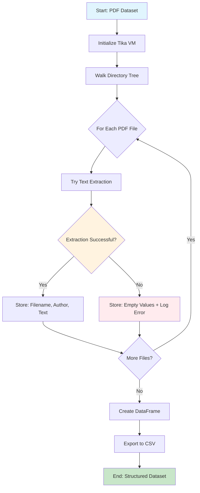

# Step-1: Data (PDFs) Preprocessing - Coding Guide

## Overview
This notebook demonstrates how to extract and preprocess text data from PDF research papers. It covers multiple approaches for text extraction, specific content extraction (abstracts, introductions), and Named Entity Recognition (NER) for author identification.

## Learning Objectives
- Understand different PDF text extraction libraries and their use cases
- Learn how to extract specific sections from research papers
- Implement Named Entity Recognition for author extraction
- Process multiple PDF files in batch operations
- Create structured datasets from unstructured PDF content

## Key Libraries and Their Purpose

### 1. **os** - Operating System Interface
```python
import os
```
- **Purpose**: File and directory operations, path manipulation
- **Key Functions Used**:
  - `os.listdir()`: Lists files in a directory
  - `os.walk()`: Recursively traverses directory trees
  - `os.path.join()`: Safely joins file paths across different operating systems

### 2. **tika** - Apache Tika PDF Text Extractor
```python
import tika
from tika import parser
```
- **Purpose**: Robust PDF text extraction using Apache Tika server
- **Why Use Tika**: 
  - Handles complex PDF layouts better than basic extractors
  - Supports multiple document formats
  - More reliable for academic papers with complex formatting
- **Key Functions**:
  - `tika.initVM()`: Initializes the Tika Java Virtual Machine
  - `parser.from_file()`: Extracts text and metadata from PDF files

### 3. **PyPDF2** - Alternative PDF Processing
```python
import PyPDF2
```
- **Purpose**: Backup PDF text extraction when Tika fails
- **Use Case**: Lighter weight, good for simple PDFs
- **Key Functions**:
  - `PdfReader()`: Creates a PDF reader object
  - `pages[0].extract_text()`: Extracts text from specific pages

### 4. **spaCy** - Natural Language Processing
```python
import spacy
```
- **Purpose**: Advanced NLP tasks including Named Entity Recognition (NER)
- **Why spaCy**: Industry-standard NLP library with pre-trained models
- **Key Features Used**:
  - NER for person name extraction
  - Pre-trained English language model (`en_core_web_sm`)

### 5. **pandas & numpy** - Data Manipulation
```python
import pandas as pd
import numpy as np
```
- **Purpose**: Creating structured datasets from extracted text
- **pandas**: DataFrame creation and CSV export
- **numpy**: Numerical operations support

## Code Analysis by Section

### Section 1: Directory Exploration and File Counting

#### Cell 2: Basic Directory Listing
```bash
!ls /home/mec/Downloads/Dataset-IK/
```
- **Purpose**: Quick directory overview using shell command
- **Note**: The `!` prefix executes shell commands in Jupyter notebooks

#### Cell 3: Counting Authors (Directories)
```python
import os
len(os.listdir('/home/mec/Downloads/Dataset-IK/')) #No. of authors
```
- **Function**: `os.listdir(path)`
- **Returns**: List of all items in the specified directory
- **Use Case**: Each subdirectory represents a different author's papers

#### Cell 4: Recursive File Counting
```python
c = 0 #No. of files
for root, dirs, files in os.walk('/home/mec/Downloads/Dataset-IK/'):
    for file in files:
        c = c + 1
        #print(os.path.join(root, file))

print('Total No. of PDF files (research papers):',c)
```
- **Function**: `os.walk(path)`
- **Returns**: Tuple of (root, directories, files) for each directory level
- **Parameters**:
  - `root`: Current directory path being processed
  - `dirs`: List of subdirectories in current directory
  - `files`: List of files in current directory
- **Purpose**: Counts all PDF files across all author subdirectories

### Section 2: Basic Text Extraction

#### Cell 7: Core Text Extraction Function
```python
import tika #PDF Text Extractor
from tika import parser

# Set up tika
tika.initVM()

# Function to extract text from PDF
def extract_text(filename):
    # Parse PDF file
    parsed = parser.from_file(filename)
    
    # Extract text from parsed data
    text = parsed["content"]
    
    return text
```

**Key Components Explained**:

1. **`tika.initVM()`**:
   - Initializes the Java Virtual Machine required by Tika
   - Must be called before using Tika functions
   - Only needs to be called once per session

2. **`parser.from_file(filename)`**:
   - **Input**: File path to PDF document
   - **Returns**: Dictionary containing extracted content and metadata
   - **Key Fields**: 
     - `"content"`: The extracted text
     - `"metadata"`: Document properties (author, title, etc.)

3. **Function Design Pattern**:
   - Single responsibility: extract raw text only
   - Error handling should be added in production code
   - Returns clean text string for further processing

### Section 3: Targeted Content Extraction

#### Cell 10: Abstract Extraction Function
```python
def extract_abstract(filename):
    # Parse PDF file
    parsed = parser.from_file(filename)
    
    # Extract text from parsed data
    text = parsed["content"]
    
    # Find introduction section by looking for keywords
    abstract_start = text.find("Abstract")
    abstract_end_options = [text.find("\n1 ", abstract_start), 
                           text.find("\ni ", abstract_start), 
                           text.find("\nI ", abstract_start)]
    abstract_end = min(pos for pos in abstract_end_options if pos != -1)
    
    # Extract introduction section
    abstract = text[abstract_start:abstract_end]
    
    return abstract
```

**Algorithm Breakdown**:

1. **Start Point Detection**:
   - `text.find("Abstract")`: Locates the beginning of abstract section
   - Returns index position of first occurrence

2. **End Point Detection Strategy**:
   - Looks for multiple possible section headers that follow abstracts
   - `"\n1 "`: Numbered section (e.g., "1 Introduction")
   - `"\ni "`: Roman numeral lowercase (e.g., "i Introduction") 
   - `"\nI "`: Roman numeral uppercase (e.g., "I Introduction")

3. **Robust End Point Selection**:
   - `min(pos for pos in abstract_end_options if pos != -1)`
   - Filters out -1 values (not found)
   - Selects the earliest valid section header

4. **Text Slicing**:
   - `text[abstract_start:abstract_end]`: Extracts substring between start and end positions

#### Cell 12: Introduction Extraction Function
```python
def extract_intro(filename):
    # Parse PDF file
    parsed = parser.from_file(filename)
    
    # Extract text from parsed data
    text = parsed["content"]
    
    # Find introduction section by looking for the "1 Introduction" heading
    intro_start = text.find("Introduction")
    
    # Find the next heading that starts with "2 ", "ii ", or "II "
    intro_end_options = [text.find("\n2 ", intro_start), 
                        text.find("\nii ", intro_start), 
                        text.find("\nII ", intro_start)]
    intro_end = min(pos for pos in intro_end_options if pos != -1)
    
    # Extract the introduction section
    intro = text[intro_start:intro_end]
    
    return intro
```

**Similar Pattern with Different Markers**:
- Start: Looks for "Introduction" keyword
- End: Searches for section 2 markers in various formats
- Same robust selection logic as abstract extraction

### Section 4: Named Entity Recognition for Author Extraction

#### Cell 17: Author Name Extraction Using spaCy NER
```python
import PyPDF2 #Another text extractor. You can use it when tika doesn't work.
import spacy

def extract_author_names(filename):
    
    # Load the spaCy NER model
    nlp = spacy.load('en_core_web_sm')
    
    # Open the PDF file
    pdf_file = open(filename, 'rb')
    
    # Create a PDF reader object
    pdf_reader = PyPDF2.PdfReader(pdf_file)
    
    # Extract the text from the first page
    first_page = pdf_reader.pages[0]
    first_page_text = first_page.extract_text()
    
    # Close the PDF file
    pdf_file.close()
    
    # Apply the spaCy NER model to the text
    doc = nlp(first_page_text)
    author_names = []
    for entity in doc.ents:
        if entity.label_ == 'PERSON':
            author_names.append(entity.text)
    
    # Return the list of author names
    return author_names
```

**Detailed Component Analysis**:

1. **Model Loading**:
   - `spacy.load('en_core_web_sm')`: Loads pre-trained English NER model
   - Model must be downloaded first: `python -m spacy download en_core_web_sm`

2. **Alternative PDF Reading**:
   - Uses PyPDF2 instead of Tika for this specific task
   - `open(filename, 'rb')`: Opens file in binary read mode
   - `PdfReader(pdf_file)`: Creates reader object

3. **First Page Focus**:
   - `pdf_reader.pages[0]`: Accesses first page (0-indexed)
   - Author names typically appear on the first page of research papers
   - `extract_text()`: Extracts text from the specific page

4. **Named Entity Recognition Process**:
   - `nlp(first_page_text)`: Processes text through spaCy pipeline
   - Returns `Doc` object with linguistic annotations
   - `doc.ents`: Contains all detected entities

5. **Entity Filtering**:
   - `entity.label_ == 'PERSON'`: Filters for person entities only
   - Other entity types: ORG (organizations), GPE (geopolitical entities), etc.
   - `entity.text`: The actual text of the detected entity

### Section 5: Batch Processing and Data Structure Creation

#### Cell 24: Complete Batch Processing Pipeline
```python
import os
import tika
from tika import parser

# Set up Tika
tika.initVM()

folder_names = []
texts = []
filenames = []
introduction_vector = []
abstract_vector = []
author_names_vector = []

c = 0 # For printing indexes of the PDF files on which tika couldn't extract the text successfully

for root, dirs, files in os.walk('/home/mec/Downloads/Dataset-IK/'):
    for file in files:
        c = c + 1
        
        try:
            # Extract the introduction from the PDF file
            text = extract_text(os.path.join(root, file))
            
            folder_names.append(root.split('/')[-1])
            texts.append(text)
            filenames.append(file)
            
        except:
            print("Index for the failed files:", c)
            texts.append([])
            filenames.append([])
            folder_names.append([])
```

**Batch Processing Strategy**:

1. **Data Structure Initialization**:
   - Multiple lists to store different types of extracted data
   - Parallel arrays approach: same index corresponds to same document

2. **Error Handling with Try-Catch**:
   - `try` block: Attempts text extraction
   - `except` block: Handles extraction failures gracefully
   - Appends empty lists for failed extractions to maintain array alignment

3. **Path Processing**:
   - `root.split('/')[-1]`: Extracts author name from directory path
   - `os.path.join(root, file)`: Creates full file path safely

4. **Progress Tracking**:
   - Counter `c` tracks processing progress
   - Prints index of failed files for debugging

#### Cell 25-29: DataFrame Creation and Export
```python
import pandas as pd
import numpy as np
df = pd.DataFrame(filenames, columns = ['FileName'])
df['Author'] = folder_names
df['Text'] = texts

# Display operations
df.shape  # Shows dimensions
df.head()  # Shows first 5 rows
df.loc[0,'Text']  # Shows text content of first document

# Export to CSV
df.to_csv('IK_rr_DataFrame.csv', index = False)
```

**Data Structure Creation**:

1. **DataFrame Construction**:
   - `pd.DataFrame(filenames, columns = ['FileName'])`: Creates base DataFrame
   - Additional columns added using assignment

2. **Data Exploration**:
   - `df.shape`: Returns (rows, columns) tuple
   - `df.head()`: Quick data preview
   - `df.loc[0,'Text']`: Specific cell access using label-based indexing

3. **Data Export**:
   - `to_csv()`: Exports DataFrame to CSV format
   - `index = False`: Excludes row indices from export

## Process Flow Diagram



## Error Handling and Best Practices

### 1. **Robust File Processing**
- Always use try-catch blocks for file operations
- Maintain data structure alignment even when operations fail
- Log failed operations for debugging

### 2. **Path Handling**
- Use `os.path.join()` for cross-platform compatibility
- Handle different directory structures gracefully

### 3. **Memory Management**
- Process files one at a time to avoid memory issues
- Consider using generators for very large datasets

### 4. **Text Extraction Reliability**
- Have backup extraction methods (Tika + PyPDF2)
- Validate extracted text quality before processing

## Common Issues and Solutions

### 1. **Tika Installation Issues**
```bash
# If Tika fails to install or initialize
pip install tika
# Ensure Java is installed on system
```

### 2. **spaCy Model Download**
```bash
# Download required language model
python -m spacy download en_core_web_sm
```

### 3. **PDF Extraction Failures**
- Some PDFs may be scanned images (require OCR)
- Encrypted PDFs may need password handling
- Complex layouts may result in garbled text

### 4. **Memory Issues with Large Datasets**
- Process files in batches
- Use generators instead of loading all data into memory
- Consider using database storage for very large datasets

## Extension Opportunities

1. **Add OCR Support**: For scanned PDFs using libraries like `pytesseract`
2. **Improve Section Detection**: Use regex patterns for more robust section identification
3. **Add Metadata Extraction**: Extract publication dates, journals, citations
4. **Implement Text Cleaning**: Remove formatting artifacts, normalize text
5. **Add Progress Bars**: Use `tqdm` for better user experience during batch processing

This notebook provides a solid foundation for PDF text extraction and preprocessing, essential for building NLP datasets from academic literature.