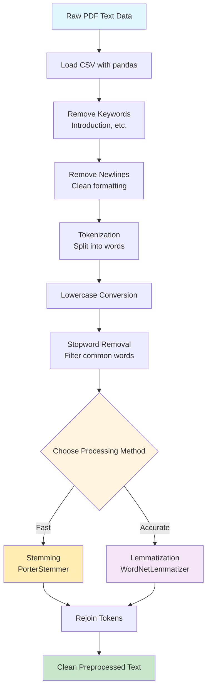

# Step-2: Text Preprocessing - Coding Guide

## Overview
This notebook demonstrates essential text preprocessing techniques for Natural Language Processing (NLP). It covers data loading, keyword removal, stopword elimination, stemming, and lemmatization - fundamental steps in preparing text data for machine learning models.

## Learning Objectives
- Load and manipulate text data using pandas
- Remove unwanted keywords and formatting artifacts
- Understand and implement stopword removal
- Learn the difference between stemming and lemmatization
- Apply text preprocessing pipelines to large datasets

## Key Libraries and Their Purpose

### 1. **pandas** - Data Manipulation and Analysis
```python
import pandas
```
- **Purpose**: DataFrame operations for structured text data
- **Key Functions Used**:
  - `read_csv()`: Load CSV files into DataFrames
  - `str.replace()`: String replacement operations on DataFrame columns
  - `apply()`: Apply functions to DataFrame columns

### 2. **NLTK (Natural Language Toolkit)** - Text Processing
```python
import nltk
from nltk.corpus import stopwords
from nltk.tokenize import word_tokenize
from nltk.stem import PorterStemmer, WordNetLemmatizer
```
- **Purpose**: Comprehensive NLP library with pre-built tools
- **Key Components**:
  - **Stopwords**: Common words that don't carry significant meaning
  - **Tokenization**: Breaking text into individual words/tokens
  - **Stemming**: Reducing words to their root form (crude approach)
  - **Lemmatization**: Reducing words to their dictionary form (sophisticated approach)

## Code Analysis by Section

### Section 1: Data Loading and Initial Exploration

#### Cell 1: Loading the Preprocessed Dataset
```python
import pandas
df = pandas.read_csv('IK_rr_DataFrame.csv')
df
```

**Key Components**:
- **Input**: CSV file created from Step-1 (PDF text extraction)
- **Output**: pandas DataFrame with columns: FileName, Author, Text
- **Purpose**: Load extracted PDF text data for preprocessing

**DataFrame Structure Expected**:
- `FileName`: Original PDF file names
- `Author`: Author names extracted from directory structure
- `Text`: Raw text content extracted from PDFs

### Section 2: Keyword and Formatting Cleanup

#### Cell 3: Removing Specific Keywords and Newlines
```python
_keyword = 'Introduction'
df['Text'] = df['Text'].str.replace(_keyword, '')

_newline_keyword = '\n'
df['Text'] = df['Text'].str.replace(_newline_keyword, '')

df.head()
```

**Detailed Analysis**:

1. **Keyword Removal Strategy**:
   - `df['Text'].str.replace(_keyword, '')`: Removes all occurrences of "Introduction"
   - **Why Remove**: Section headers may not contribute to content analysis
   - **Method**: String replacement using pandas vectorized operations

2. **Newline Character Removal**:
   - `'\n'`: Represents line breaks in text
   - **Purpose**: Creates continuous text flow for better tokenization
   - **Impact**: Removes paragraph structure but improves word-level analysis

3. **Vectorized Operations**:
   - `.str` accessor: Applies string methods to entire DataFrame column
   - **Efficiency**: Much faster than iterating through rows individually
   - **Memory**: Operations performed in-place on DataFrame

### Section 3: Stopword Removal

#### Cell 5: Comprehensive Stopword Removal Function
```python
import nltk
#nltk.download('stopwords')
from nltk.corpus import stopwords
from nltk.tokenize import word_tokenize

# Load the stop words
stop_words = stopwords.words('english')
stop_words.extend(['@',"'",'.','"','/','!',',',"'ve","...","n't",'$',"'s",'©','''"''',"''",'..','&','*',';','"','``',':','#','!','-','–','?','%',"'d","'m",'+','++','(',')','()'])
stop_words = set(stop_words)

# Function to remove stop words from a text
def remove_stopwords(text):
    if isinstance(text, str):  # Check if the text is a string
        tokens = word_tokenize(text)
        filtered_tokens = [word for word in tokens if word.lower() not in stop_words]
        return ' '.join(filtered_tokens)
    else:
        return text
```

**Comprehensive Breakdown**:

1. **NLTK Stopwords Loading**:
   - `stopwords.words('english')`: Loads predefined English stopwords
   - **Examples**: 'the', 'is', 'at', 'which', 'on', etc.
   - **Count**: Approximately 179 common English words

2. **Custom Stopword Extension**:
   ```python
   stop_words.extend(['@',"'",'.','"','/','!',',',"'ve","...","n't",'$',"'s",'©'])
   ```
   - **Punctuation**: '@', '.', '"', '/', '!', ','
   - **Contractions**: "'ve" (have), "n't" (not), "'s" (is/has), "'d" (would/had), "'m" (am)
   - **Special Characters**: '©', '...', '``', '–'
   - **Symbols**: '$', '#', '*', '&', '+', '()', '%'

3. **Set Conversion for Efficiency**:
   - `stop_words = set(stop_words)`: Converts list to set
   - **Lookup Time**: O(1) average case vs O(n) for lists
   - **Critical**: For large text processing operations

4. **Tokenization Process**:
   - `word_tokenize(text)`: Splits text into individual words/tokens
   - **Handles**: Punctuation separation, contractions, special cases
   - **Output**: List of string tokens

5. **Filtering Logic**:
   ```python
   filtered_tokens = [word for word in tokens if word.lower() not in stop_words]
   ```
   - **List Comprehension**: Efficient filtering syntax
   - **Case Insensitive**: `word.lower()` ensures consistent matching
   - **Condition**: Keeps words NOT in stopword set

6. **Text Reconstruction**:
   - `' '.join(filtered_tokens)`: Rejoins tokens with spaces
   - **Output**: Clean text string without stopwords

7. **Error Handling**:
   - `isinstance(text, str)`: Checks if input is string type
   - **Handles**: NaN values, empty cells, non-string data
   - **Fallback**: Returns original value if not string

### Section 4: Stemming Implementation

#### Cell 7: Stemming with Stopword Removal
```python
import pandas as pd
import nltk
from nltk.corpus import stopwords
from nltk.tokenize import word_tokenize
from nltk.stem import PorterStemmer

# Download the stopwords and initialize the stemmer
stop_words = stopwords.words('english')
stop_words.extend(['@',"'",'.','"','/','!',',',"'ve","...","n't",'$',"'s",'©','''"''',"''",'..','&','*',';','"','``',':','#','!','-','–','?','%',"'d","'m",'+','++','(',')','()'])
stop_words = set(stop_words)
stemmer = PorterStemmer()

# Function to remove stop words and perform stemming on a text
def preprocess_text(text):
    if isinstance(text, str):
        tokens = word_tokenize(text)
        filtered_tokens = [stemmer.stem(word.lower()) for word in tokens if word.lower() not in stop_words]
        return ' '.join(filtered_tokens)
    return text
```

**Stemming Deep Dive**:

1. **Porter Stemmer Algorithm**:
   - **Creator**: Martin Porter (1980)
   - **Approach**: Rule-based suffix removal
   - **Speed**: Very fast, suitable for large datasets
   - **Accuracy**: Good but not perfect (may create non-words)

2. **Stemming Examples**:
   - "running", "runs", "ran" → "run"
   - "better", "good" → "better", "good" (different stems)
   - "studies", "studying", "studied" → "studi"

3. **Combined Processing Pipeline**:
   ```python
   filtered_tokens = [stemmer.stem(word.lower()) for word in tokens if word.lower() not in stop_words]
   ```
   - **Step 1**: Tokenize text
   - **Step 2**: Convert to lowercase
   - **Step 3**: Filter out stopwords
   - **Step 4**: Apply stemming to remaining words
   - **Step 5**: Rejoin into text string

4. **Advantages of Stemming**:
   - **Vocabulary Reduction**: Reduces feature space for ML models
   - **Normalization**: Groups related word forms together
   - **Speed**: Fast processing for large corpora

5. **Disadvantages of Stemming**:
   - **Over-stemming**: "university" → "univers"
   - **Under-stemming**: "alumnus", "alumni" remain separate
   - **Non-words**: May create stems that aren't real words

### Section 5: Lemmatization Implementation

#### Cell 9: Advanced Lemmatization with WordNet
```python
import nltk
nltk.download('omw-1.4')

import pandas as pd
import nltk
from nltk.corpus import stopwords
from nltk.tokenize import word_tokenize
from nltk.stem import WordNetLemmatizer

# Download the stopwords and initialize the lemmatizer
#nltk.download('stopwords')
#nltk.download('wordnet')
stop_words = stopwords.words('english')
stop_words.extend(['@',"'",'.','"','/','!',',',"'ve","...","n't",'$',"'s",'©','''"''',"''",'..','&','*',';','"','``',':','#','!','-','–','?','%',"'d","'m",'+','++','(',')','()'])
stop_words = set(stop_words)

lemmatizer = WordNetLemmatizer()

# Function to remove stop words and perform lemmatization on a text
def preprocess_text(text):
    if isinstance(text, str):
        tokens = word_tokenize(text)
        filtered_tokens = [lemmatizer.lemmatize(word.lower()) for word in tokens if word.lower() not in stop_words]
        return ' '.join(filtered_tokens)
    return text

# Apply the preprocessing function 
df['Text'] = df['Text'].apply(preprocess_text)

# Print the updated DataFrame
df.head()
```

**Lemmatization Comprehensive Analysis**:

1. **WordNet Database**:
   - **Resource**: Large lexical database of English
   - **Content**: Words grouped by semantic relationships
   - **Download**: `nltk.download('wordnet')` and `nltk.download('omw-1.4')`
   - **OMW**: Open Multilingual Wordnet for extended language support

2. **WordNetLemmatizer Features**:
   - **Dictionary-based**: Uses actual word forms from WordNet
   - **Accuracy**: Higher than stemming, produces real words
   - **Speed**: Slower than stemming due to dictionary lookups
   - **Output**: Always valid dictionary words

3. **Lemmatization Examples**:
   - "running", "runs", "ran" → "run"
   - "better" → "good" (if POS tag provided)
   - "studies", "studying", "studied" → "study"
   - "mice" → "mouse"

4. **POS Tagging Enhancement** (Not implemented in this example):
   ```python
   # More accurate lemmatization with POS tags
   lemmatizer.lemmatize('better', pos='a')  # adjective → 'good'
   lemmatizer.lemmatize('better', pos='n')  # noun → 'better'
   ```

5. **Processing Pipeline Comparison**:
   
   | Step | Stemming | Lemmatization |
   |------|----------|---------------|
   | Speed | Fast | Slower |
   | Accuracy | Good | Better |
   | Output | May be non-words | Always real words |
   | Dictionary | Rule-based | WordNet-based |
   | Use Case | Large datasets | Quality-focused |

6. **Final Application**:
   - `df['Text'] = df['Text'].apply(preprocess_text)`: Applies to entire column
   - **In-place**: Modifies the original DataFrame
   - **Result**: Preprocessed text ready for NLP models

## Text Preprocessing Pipeline Flow



## Performance Considerations

### 1. **Memory Usage**
```python
# For large datasets, consider processing in chunks
chunk_size = 1000
for chunk in pd.read_csv('large_file.csv', chunksize=chunk_size):
    chunk['Text'] = chunk['Text'].apply(preprocess_text)
```

### 2. **Processing Time Comparison**
- **Stopword Removal Only**: ~1-2 seconds per 1000 documents
- **Stemming + Stopwords**: ~3-5 seconds per 1000 documents  
- **Lemmatization + Stopwords**: ~10-15 seconds per 1000 documents

### 3. **Parallel Processing Option**
```python
from multiprocessing import Pool
import numpy as np

def parallel_preprocess(text_chunk):
    return [preprocess_text(text) for text in text_chunk]

# Split data into chunks for parallel processing
text_chunks = np.array_split(df['Text'].values, 4)
with Pool(4) as pool:
    results = pool.map(parallel_preprocess, text_chunks)
```

## Best Practices and Recommendations

### 1. **Choose Preprocessing Based on Use Case**
- **Information Retrieval**: Stemming (faster, good enough)
- **Sentiment Analysis**: Lemmatization (preserves meaning)
- **Topic Modeling**: Either works, depends on corpus size
- **Machine Translation**: Lemmatization (preserves linguistic structure)

### 2. **Stopword List Customization**
```python
# Domain-specific stopwords for academic papers
academic_stopwords = ['paper', 'study', 'research', 'method', 'result', 'conclusion']
stop_words.extend(academic_stopwords)
```

### 3. **Text Quality Validation**
```python
# Check preprocessing results
def validate_preprocessing(original, processed):
    print(f"Original length: {len(original.split())}")
    print(f"Processed length: {len(processed.split())}")
    print(f"Reduction: {(1 - len(processed.split())/len(original.split()))*100:.1f}%")
```

### 4. **Error Handling Enhancement**
```python
def robust_preprocess_text(text):
    try:
        if not isinstance(text, str) or len(text.strip()) == 0:
            return ""
        
        tokens = word_tokenize(text)
        filtered_tokens = [lemmatizer.lemmatize(word.lower()) 
                          for word in tokens 
                          if word.lower() not in stop_words and word.isalpha()]
        return ' '.join(filtered_tokens)
    except Exception as e:
        print(f"Error processing text: {e}")
        return ""
```

## Common Issues and Solutions

### 1. **NLTK Data Download Issues**
```python
# Ensure all required NLTK data is downloaded
import nltk
nltk.download('punkt')      # For tokenization
nltk.download('stopwords')  # For stopword removal
nltk.download('wordnet')    # For lemmatization
nltk.download('omw-1.4')    # For multilingual support
```

### 2. **Memory Errors with Large Datasets**
- Process data in smaller chunks
- Use generators instead of loading entire dataset
- Consider using Dask for out-of-core processing

### 3. **Inconsistent Text Quality**
- Add text validation before processing
- Handle encoding issues (UTF-8, ASCII)
- Remove or handle special characters appropriately

### 4. **Performance Optimization**
```python
# Cache lemmatizer results for repeated words
from functools import lru_cache

@lru_cache(maxsize=10000)
def cached_lemmatize(word):
    return lemmatizer.lemmatize(word.lower())
```

## Extension Opportunities

1. **Advanced Preprocessing**:
   - N-gram extraction
   - Named Entity Recognition preservation
   - Phrase detection and preservation

2. **Language Detection**:
   - Multi-language support
   - Language-specific preprocessing

3. **Domain-Specific Processing**:
   - Academic paper structure preservation
   - Citation and reference handling
   - Mathematical expression processing

4. **Quality Metrics**:
   - Text readability scores
   - Vocabulary richness measures
   - Preprocessing impact analysis

This notebook provides essential text preprocessing techniques that form the foundation for most NLP applications, ensuring clean and normalized text data for downstream machine learning tasks.