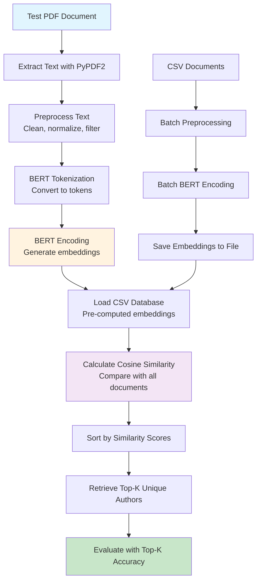

# Step-3: Sample Solution via BERT - Coding Guide

## Overview
This notebook demonstrates a complete BERT-based document similarity and authorship attribution system. It covers BERT model implementation, document embedding generation, similarity calculation, and evaluation metrics for author identification tasks.

## Learning Objectives
- Understand BERT (Bidirectional Encoder Representations from Transformers) architecture and usage
- Learn how to generate document embeddings using pre-trained BERT models
- Implement cosine similarity for document comparison
- Build an authorship attribution system
- Evaluate model performance using top-k accuracy metrics

## Key Libraries and Their Purpose

### 1. **Transformers** - Hugging Face Transformers Library
```python
from transformers import BertTokenizer, BertModel
```
- **Purpose**: Access to pre-trained BERT models and tokenizers
- **Why Transformers**: Industry-standard library for transformer models
- **Key Components**:
  - `BertTokenizer`: Converts text to BERT-compatible tokens
  - `BertModel`: Pre-trained BERT model for generating embeddings

### 2. **PyTorch** - Deep Learning Framework
```python
import torch
```
- **Purpose**: Tensor operations and neural network computations
- **Key Functions**:
  - `torch.no_grad()`: Disables gradient computation for inference
  - `torch.cosine_similarity()`: Calculates cosine similarity between vectors
  - `torch.from_numpy()`: Converts NumPy arrays to PyTorch tensors

### 3. **NumPy** - Numerical Computing
```python
import numpy as np
```
- **Purpose**: Efficient numerical operations and array handling
- **Use Cases**: Saving/loading embeddings, array manipulations

### 4. **Additional Libraries**
```python
import PyPDF2          # PDF text extraction
import re              # Regular expressions for text cleaning
import unicodedata     # Unicode normalization
import pandas as pd    # Data manipulation
from nltk.corpus import stopwords  # Stopword removal
```

## Code Analysis by Section

### Section 1: Environment Setup and Model Loading

#### Cell 2-5: Installation and Downloads
```bash
!pip install transformers
!pip install PyPDF2
!pip install nltk
```
```python
import nltk
nltk.download('stopwords')
```

**Installation Requirements**:
- **transformers**: Hugging Face library for BERT models
- **PyPDF2**: PDF text extraction capabilities
- **nltk**: Natural language processing toolkit
- **stopwords**: Common English stopwords for text preprocessing

#### Cell 7: Model Initialization and Configuration
```python
from transformers import BertTokenizer, BertModel
import PyPDF2
import re
import unicodedata
from nltk.corpus import stopwords
import pandas as pd
import torch
import numpy as np

tokenizer = BertTokenizer.from_pretrained('bert-base-uncased')
model = BertModel.from_pretrained('bert-base-uncased')

#Test pdf for evaluation
pdf_path = "Supervised Heterogeneous Domain Adaptation via Random Forests.pdf"

csv_path = "Lemmatized_Final_Dataset.csv"
text_column = "PDF"
k = 5

stop_words = set(stopwords.words('english'))
```

**Key Components Explained**:

1. **BERT Model Selection**:
   - `'bert-base-uncased'`: 12-layer, 768-hidden, 12-heads, 110M parameters
   - **Uncased**: Doesn't distinguish between uppercase and lowercase
   - **Alternative**: `bert-large-uncased` (24-layer, 1024-hidden, 16-heads, 340M parameters)

2. **Tokenizer Functionality**:
   - **Subword Tokenization**: Handles out-of-vocabulary words
   - **Special Tokens**: [CLS], [SEP], [PAD], [UNK]
   - **Vocabulary Size**: 30,522 tokens for bert-base-uncased

3. **Configuration Parameters**:
   - `pdf_path`: Test document for similarity comparison
   - `csv_path`: Database of documents with known authors
   - `text_column`: Column name containing document text
   - `k`: Number of top similar authors to retrieve

### Section 2: Text Preprocessing Functions

#### Cell 12: Comprehensive Preprocessing Pipeline
```python
def preprocess_text(text):
    if not isinstance(text, str):
        return ''
    text = text.replace('\n', ' ').replace('\r', ' ')
    text = re.sub('<[^>]*>', '', text)
    text = unicodedata.normalize('NFKD', text).encode('ascii', 'ignore').decode('utf-8', 'ignore')
    text = re.sub('http[s]?://\S+', '', text)
    text = re.sub('[^a-zA-Z]', ' ', text)
    text = text.lower()
    text = text.split()
    text = [word for word in text if word not in stop_words]
    text = [word for word in text if len(word) > 2]
    text = ' '.join(text)
    return text
```

**Step-by-Step Preprocessing Analysis**:

1. **Input Validation**:
   ```python
   if not isinstance(text, str):
       return ''
   ```
   - Handles non-string inputs (NaN, None, numbers)
   - Returns empty string for invalid inputs

2. **Whitespace Normalization**:
   ```python
   text = text.replace('\n', ' ').replace('\r', ' ')
   ```
   - Converts newlines and carriage returns to spaces
   - Creates continuous text flow

3. **HTML Tag Removal**:
   ```python
   text = re.sub('<[^>]*>', '', text)
   ```
   - **Regex Pattern**: `<[^>]*>` matches any HTML tag
   - Removes markup from web-scraped content

4. **Unicode Normalization**:
   ```python
   text = unicodedata.normalize('NFKD', text).encode('ascii', 'ignore').decode('utf-8', 'ignore')
   ```
   - **NFKD**: Canonical decomposition with compatibility mapping
   - **Purpose**: Converts accented characters to ASCII equivalents
   - **Example**: "café" → "cafe"

5. **URL Removal**:
   ```python
   text = re.sub('http[s]?://\S+', '', text)
   ```
   - **Pattern**: Matches HTTP and HTTPS URLs
   - **\S+**: Matches non-whitespace characters (URL content)

6. **Character Filtering**:
   ```python
   text = re.sub('[^a-zA-Z]', ' ', text)
   ```
   - Keeps only alphabetic characters
   - Replaces numbers, punctuation, symbols with spaces

7. **Case Normalization**:
   ```python
   text = text.lower()
   ```
   - Converts all text to lowercase for consistency

8. **Tokenization and Filtering**:
   ```python
   text = text.split()
   text = [word for word in text if word not in stop_words]
   text = [word for word in text if len(word) > 2]
   ```
   - Splits text into individual words
   - Removes common stopwords
   - Filters out very short words (≤2 characters)

9. **Text Reconstruction**:
   ```python
   text = ' '.join(text)
   ```
   - Rejoins filtered words with spaces

#### PDF Text Extraction Function
```python
def extract_text_from_pdf(pdf_path):
    try:
        with open(pdf_path, 'rb') as pdf_file:
            pdf_reader = PyPDF2.PdfReader(pdf_file)
            pdf_text = ''
            for page_num in range(len(pdf_reader.pages)):
                page = pdf_reader.pages[page_num]
                pdf_text += page.extract_text()
    except KeyError as e:
        print(f"Error processing file '{pdf_path}': {e}")
        return ''
    return pdf_text
```

**PDF Processing Details**:

1. **File Handling**:
   - `'rb'`: Opens file in binary read mode (required for PDFs)
   - `with` statement: Ensures proper file closure

2. **Page Iteration**:
   - `len(pdf_reader.pages)`: Gets total number of pages
   - Extracts text from each page sequentially

3. **Error Handling**:
   - Catches `KeyError` exceptions (common with corrupted PDFs)
   - Returns empty string on failure with error message

### Section 3: BERT Encoding and Embedding Generation

#### Document Encoding Function
```python
def encode_documents(documents):
    encoded_texts = tokenizer(documents, padding=True, truncation=True, return_tensors='pt')
    return encoded_texts
```

**Tokenization Parameters**:

1. **`padding=True`**:
   - Pads shorter sequences to match the longest in the batch
   - Uses [PAD] tokens for padding
   - Ensures uniform tensor dimensions

2. **`truncation=True`**:
   - Truncates sequences longer than model's maximum length (512 tokens for BERT)
   - Prevents memory errors with very long documents

3. **`return_tensors='pt'`**:
   - Returns PyTorch tensors instead of lists
   - Required for model input

#### Embedding Generation Function
```python
def generate_embeddings(encoded_texts):
    with torch.no_grad():
        model.eval()
        input_ids = encoded_texts['input_ids']
        attention_mask = encoded_texts['attention_mask']
        output = model(input_ids=input_ids, attention_mask=attention_mask)
        embeddings = output.last_hidden_state[:, 0, :]
    return embeddings
```

**BERT Inference Process**:

1. **Gradient Disabling**:
   ```python
   with torch.no_grad():
   ```
   - Disables gradient computation for faster inference
   - Reduces memory usage during evaluation

2. **Model Evaluation Mode**:
   ```python
   model.eval()
   ```
   - Sets model to evaluation mode
   - Disables dropout and batch normalization updates

3. **Input Preparation**:
   - `input_ids`: Token IDs for each word/subword
   - `attention_mask`: Indicates which tokens are real vs. padding

4. **Model Forward Pass**:
   ```python
   output = model(input_ids=input_ids, attention_mask=attention_mask)
   ```
   - Passes inputs through BERT model
   - Returns hidden states for all layers

5. **[CLS] Token Extraction**:
   ```python
   embeddings = output.last_hidden_state[:, 0, :]
   ```
   - **`[:, 0, :]`**: Selects [CLS] token (first token) from last layer
   - **[CLS] Token**: Special token representing entire sequence
   - **Dimensions**: [batch_size, hidden_size] where hidden_size=768

### Section 4: Similarity Calculation and Retrieval

#### Cosine Similarity Calculation
```python
def calculate_similarity(test_embedding, csv_embeddings):
    similarity_scores = []
    indices = []
    for i, csv_embedding in enumerate(csv_embeddings):
        similarity = torch.cosine_similarity(test_embedding, csv_embedding)
        similarity_scores.append(similarity.item())
        indices.append(i)
    return csv_embeddings, similarity_scores, indices
```

**Cosine Similarity Mathematics**:

1. **Formula**:
   ```
   cosine_similarity(A, B) = (A · B) / (||A|| × ||B||)
   ```
   - **A · B**: Dot product of vectors A and B
   - **||A||**: L2 norm (magnitude) of vector A
   - **Range**: [-1, 1] where 1 = identical, 0 = orthogonal, -1 = opposite

2. **PyTorch Implementation**:
   - `torch.cosine_similarity()`: Efficient vectorized computation
   - `.item()`: Converts single-element tensor to Python scalar

#### Top-K Author Retrieval
```python
def retrieve_top_k_unique_authors(csv_data, similarity_scores, indices, k):
    # Sort scores and corresponding indices
    sorted_scores_indices = sorted(zip(similarity_scores, indices), key=lambda x: x[0], reverse=True)
    unique_authors = []

    # Loop over sorted scores and indices
    for _, idx in sorted_scores_indices:
        # Get author corresponding to index
        author = csv_data.iloc[idx]['AUTHOR']
        # Append author to unique_authors list if it's not there yet
        if author not in unique_authors:
            unique_authors.append(author)
            # Break the loop if we have found k unique authors
            if len(unique_authors) == k:
                break

    return unique_authors
```

**Algorithm Breakdown**:

1. **Score Sorting**:
   - `sorted(zip(similarity_scores, indices), key=lambda x: x[0], reverse=True)`
   - Pairs scores with document indices
   - Sorts by similarity score in descending order

2. **Unique Author Selection**:
   - Iterates through sorted results
   - Adds authors to list only if not already present
   - Ensures diversity in top-k results

3. **Early Termination**:
   - Stops when k unique authors are found
   - Prevents unnecessary computation

### Section 5: Model Evaluation and Metrics

#### Top-K Accuracy Implementation
```python
def top_k_accuracy(y_true, y_pred, k=1):
    """
    Compute the top-k accuracy based on word presence in predictions.

    Parameters:
    y_true (str): True label (actual author).
    y_pred (list): List of predicted authors for the test PDFs.
                   The shape of y_pred should be (num_PDFs, k).
    k (int): The value of k for top-k accuracy. Default is 1 (top-1 accuracy).

    Returns:
    top_k_acc (float): The top-k accuracy value.
    """
    if k <= 0 or not isinstance(k, int):
        raise ValueError("k must be a positive integer.")

    num_samples = len(y_pred)
    num_correct = 0

    for i in range(num_samples):
        if y_true in y_pred[i][:k]:
            num_correct += 1

    top_k_acc = num_correct / num_samples
    return top_k_acc
```

**Evaluation Metrics Explained**:

1. **Top-1 Accuracy**:
   - Percentage of correct predictions when considering only the top prediction
   - Most strict evaluation metric

2. **Top-K Accuracy**:
   - Percentage of correct predictions when considering top k predictions
   - More lenient, useful for recommendation systems

3. **Implementation Details**:
   - `y_pred[i][:k]`: Takes first k predictions for sample i
   - `y_true in y_pred[i][:k]`: Checks if true label is in top-k predictions
   - Returns accuracy as a float between 0 and 1

#### Example Usage
```python
# Top-3 accuracy with an example
top_k_accuracy('Sanatan',[['Sanatan','Arash','Abhinav'],['Arash','Abhinav','Vartika'],['Arash','Sanatan','Abhinav']],3)

# Top-1 accuracy (Matching with the first prediction only)
top_k_accuracy('Sanatan',[['Sanatan','Arash','Abhinav'],['Arash','Abhinav','Vartika'],['Arash','Sanatan','Abhinav']],1)
```

**Example Analysis**:
- **Test Cases**: 3 predictions for author 'Sanatan'
- **Case 1**: 'Sanatan' is 1st → Correct for both top-1 and top-3
- **Case 2**: 'Sanatan' not in top-3 → Incorrect for both
- **Case 3**: 'Sanatan' is 2nd → Incorrect for top-1, correct for top-3

## Complete Pipeline Flow



## Performance Considerations and Optimization

### 1. **Memory Management**
```python
# For large datasets, process in batches
batch_size = 32
for i in range(0, len(documents), batch_size):
    batch = documents[i:i+batch_size]
    encoded_batch = encode_documents(batch)
    embeddings_batch = generate_embeddings(encoded_batch)
```

### 2. **GPU Acceleration**
```python
# Check for GPU availability
device = torch.device('cuda' if torch.cuda.is_available() else 'cpu')
model = model.to(device)

# Move tensors to GPU
encoded_texts = {k: v.to(device) for k, v in encoded_texts.items()}
```

### 3. **Embedding Caching**
```python
# Save embeddings to avoid recomputation
np.save("document_embeddings.npy", embeddings.numpy())

# Load pre-computed embeddings
embeddings = torch.from_numpy(np.load("document_embeddings.npy"))
```

## Advanced Techniques and Extensions

### 1. **Fine-tuning BERT for Domain-Specific Tasks**
```python
from transformers import BertForSequenceClassification, AdamW

# Load model for classification
model = BertForSequenceClassification.from_pretrained('bert-base-uncased', num_labels=num_authors)

# Set up optimizer
optimizer = AdamW(model.parameters(), lr=2e-5)
```

### 2. **Ensemble Methods**
```python
# Combine multiple similarity metrics
def ensemble_similarity(emb1, emb2):
    cosine_sim = torch.cosine_similarity(emb1, emb2)
    euclidean_sim = 1 / (1 + torch.norm(emb1 - emb2))
    return 0.7 * cosine_sim + 0.3 * euclidean_sim
```

### 3. **Document Chunking for Long Texts**
```python
def chunk_document(text, max_length=512):
    tokens = tokenizer.tokenize(text)
    chunks = []
    for i in range(0, len(tokens), max_length-2):  # -2 for [CLS] and [SEP]
        chunk = tokens[i:i+max_length-2]
        chunks.append(tokenizer.convert_tokens_to_string(chunk))
    return chunks
```

## Common Issues and Solutions

### 1. **CUDA Out of Memory**
```python
# Reduce batch size
batch_size = 8  # Instead of 32

# Use gradient checkpointing
model.gradient_checkpointing_enable()

# Clear cache
torch.cuda.empty_cache()
```

### 2. **Tokenization Length Issues**
```python
# Check token length before processing
def safe_tokenize(text, max_length=512):
    tokens = tokenizer.tokenize(text)
    if len(tokens) > max_length - 2:
        tokens = tokens[:max_length-2]
    return tokenizer.convert_tokens_to_string(tokens)
```

### 3. **Model Loading Issues**
```python
# Handle network issues with local caching
from transformers import BertModel, BertTokenizer

try:
    model = BertModel.from_pretrained('bert-base-uncased')
    tokenizer = BertTokenizer.from_pretrained('bert-base-uncased')
except Exception as e:
    print(f"Error loading model: {e}")
    # Use local cached version or alternative model
```

## Evaluation Best Practices

### 1. **Cross-Validation Setup**
```python
from sklearn.model_selection import train_test_split

# Split data ensuring each author has samples in both sets
def stratified_split(df, test_size=0.2):
    train_data = []
    test_data = []
    
    for author in df['AUTHOR'].unique():
        author_docs = df[df['AUTHOR'] == author]
        if len(author_docs) > 1:
            train, test = train_test_split(author_docs, test_size=test_size, random_state=42)
            train_data.append(train)
            test_data.append(test)
    
    return pd.concat(train_data), pd.concat(test_data)
```

### 2. **Multiple Evaluation Metrics**
```python
def comprehensive_evaluation(y_true, y_pred_list):
    results = {}
    for k in [1, 3, 5, 10]:
        results[f'top_{k}_accuracy'] = top_k_accuracy(y_true, y_pred_list, k)
    
    # Mean Reciprocal Rank
    mrr = mean_reciprocal_rank(y_true, y_pred_list)
    results['mrr'] = mrr
    
    return results
```

### 3. **Statistical Significance Testing**
```python
from scipy import stats

def compare_models(model1_scores, model2_scores):
    t_stat, p_value = stats.ttest_rel(model1_scores, model2_scores)
    return t_stat, p_value
```

This notebook demonstrates a complete BERT-based authorship attribution system, showcasing modern NLP techniques for document similarity and classification tasks. The implementation provides a solid foundation for building production-ready document analysis systems.