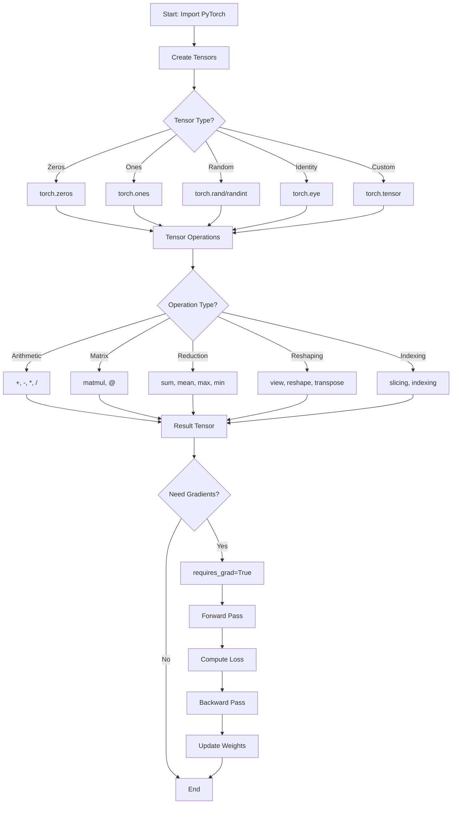
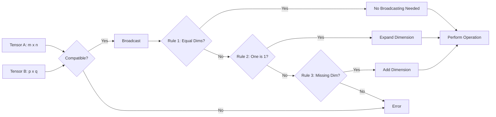
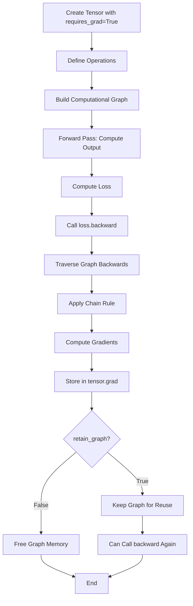
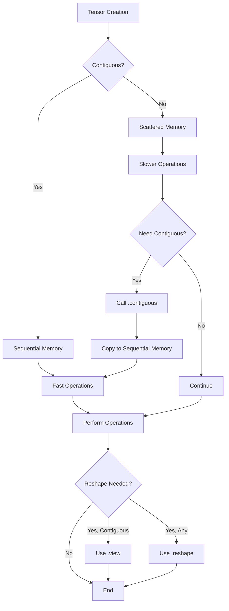
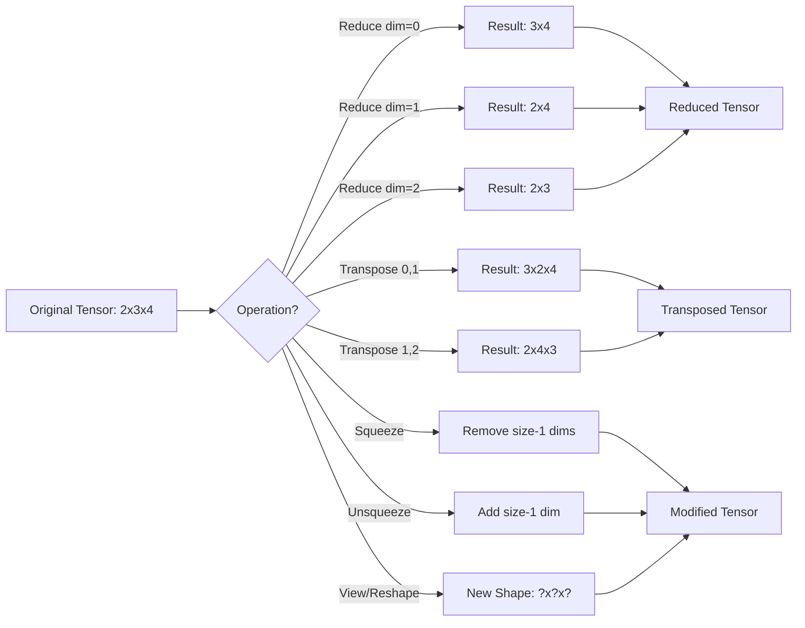
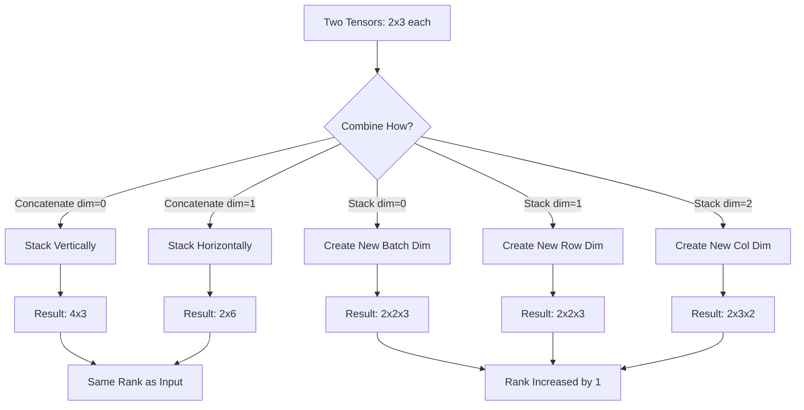
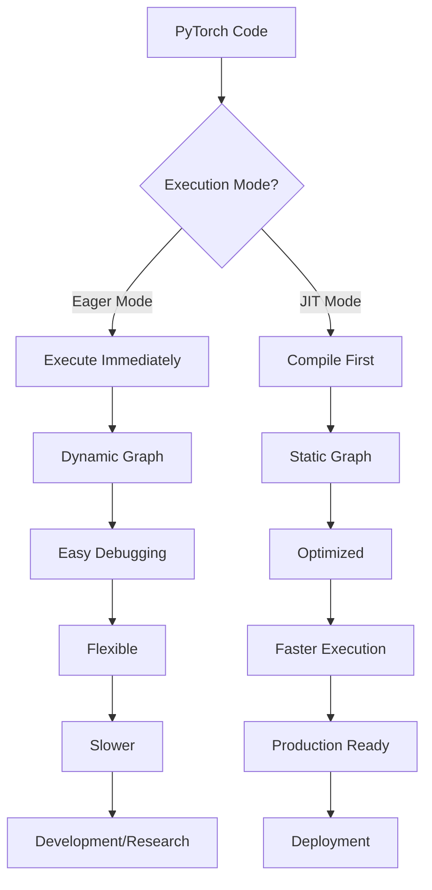

# Coding Guide: M16 - Deep Learning Data Structures & Frameworks

## Overview
This comprehensive coding guide explains all major operations in the PyTorch tensor manipulation notebook. It covers tensor creation, operations, indexing, broadcasting, reduction, reshaping, and gradient computation.

---

## 1. Library Import and Setup

### Code Block 1: Installing and Importing PyTorch
```python
# !pip install torch
import torch
```

**Purpose:** Import the PyTorch library for tensor operations and deep learning.

**Key Points:**
- `torch` is the main PyTorch module
- The commented `!pip install torch` line is used to install PyTorch if not already installed
- PyTorch provides GPU acceleration for deep learning operations

**Why Import This:**
- PyTorch is the primary framework for tensor manipulation and neural network operations
- It provides automatic differentiation (autograd) for backpropagation
- Offers both CPU and GPU computation capabilities

---

## 2. Creating Tensors

### Code Block 2: Check PyTorch Version
```python
torch.__version__
```

**Purpose:** Verify the installed PyTorch version.

**Output:** Returns version string (e.g., '2.3.0')

**Why This Matters:** Different PyTorch versions may have different features or APIs.

---

### Code Block 3: Creating Zero Tensors
```python
torch.zeros(5,5)
```

**Purpose:** Create a 5×5 tensor filled with zeros.

**Function:** `torch.zeros(rows, columns)`
- **Arguments:**
  - `rows` (int): Number of rows
  - `columns` (int): Number of columns
- **Returns:** Tensor of shape (5, 5) with all values = 0.0
- **Data Type:** Default is float32

**Use Cases:**
- Initialize weight matrices
- Create placeholder tensors
- Reset gradients

---

### Code Block 4: Creating Random Tensors
```python
y = torch.rand(2,3,4)
print(y)
```

**Purpose:** Create a 3D tensor with random values from uniform distribution [0, 1).

**Function:** `torch.rand(*sizes)`
- **Arguments:**
  - `*sizes` (tuple): Dimensions of the tensor
  - Here: (2, 3, 4) = 2 batches, 3 rows, 4 columns
- **Returns:** Tensor with random float values between 0 and 1
- **Distribution:** Uniform distribution

**Shape Interpretation:**
- Dimension 0 (2): Batch size
- Dimension 1 (3): Height/Rows
- Dimension 2 (4): Width/Columns

---

### Code Block 5: Creating Random Integer Tensors
```python
y = torch.randint(0,10,(2,3,4))
y
```

**Purpose:** Create a 3D tensor with random integers.

**Function:** `torch.randint(low, high, size)`
- **Arguments:**
  - `low` (int): Minimum value (inclusive)
  - `high` (int): Maximum value (exclusive)
  - `size` (tuple): Shape of the tensor
- **Returns:** Tensor with random integers in range [0, 10)
- **Values:** 0, 1, 2, ..., 9 (10 is excluded)

**Use Cases:**
- Generate random labels for testing
- Create random indices
- Simulate discrete data

---

## 3. Tensor Properties and Operations

### Code Block 6: Tensor Shape
```python
x.shape
```

**Purpose:** Get the dimensions of a tensor.

**Returns:** `torch.Size` object (similar to tuple)
- Example: `torch.Size([3, 4])` means 3 rows, 4 columns

**Why Important:** Essential for debugging and ensuring dimension compatibility.

---

### Code Block 7: Max Function with Dimensions
```python
x = torch.tensor([[3, 7, 2, 5],
                  [1, 6, 4, 8],
                  [9, 0, 2, 4]])

result = torch.max(x, dim=1)
print(result)
```

**Purpose:** Find maximum values along a specific dimension.

**Function:** `torch.max(input, dim)`
- **Arguments:**
  - `input` (Tensor): Input tensor
  - `dim` (int): Dimension along which to find max
    - `dim=0`: Max down columns (across rows)
    - `dim=1`: Max across columns (across each row)
    - `dim=-1`: Max along last dimension
- **Returns:** Named tuple with:
  - `values`: Maximum values
  - `indices`: Positions of maximum values

**Example Output:**
```
torch.return_types.max(
values=tensor([7, 8, 9]),
indices=tensor([1, 3, 0]))
```
- Row 0: max=7 at index 1
- Row 1: max=8 at index 3
- Row 2: max=9 at index 0

---


## 4. Tensor Concatenation

### Code Block 8: Concatenating Tensors
```python
A = torch.tensor([[1, 2, 3],
                  [4, 5, 6]])

B = torch.tensor([[7, 8, 9],
                  [10, 11, 12]])

C = torch.tensor([[13, 14, 15],
                  [16, 17, 18]])

result = torch.cat((A, B, C), dim=1)
print(result)
```

**Purpose:** Combine multiple tensors along a specified dimension.

**Function:** `torch.cat(tensors, dim)`
- **Arguments:**
  - `tensors` (tuple/list): Sequence of tensors to concatenate
  - `dim` (int): Dimension along which to concatenate
    - `dim=0`: Stack vertically (add rows)
    - `dim=1`: Stack horizontally (add columns)
- **Returns:** Single concatenated tensor

**Example with dim=1:**
- Input: 3 tensors of shape (2, 3)
- Output: tensor of shape (2, 9)
- Result: `[[1,2,3,7,8,9,13,14,15], [4,5,6,10,11,12,16,17,18]]`

**Example with dim=0:**
- Input: 3 tensors of shape (2, 3)
- Output: tensor of shape (6, 3)
- Stacks tensors vertically

**Use Cases:**
- Combining feature vectors
- Batch processing
- Building larger datasets

---

## 5. Gradient Computation (Autograd)

### Code Block 9: Basic Gradient Calculation
```python
import torch

x = torch.tensor([1.0, 2.0, 3.0], requires_grad=True)
L = x.sum()

L.backward()
print(x.grad)
```

**Purpose:** Demonstrate automatic differentiation for backpropagation.

**Key Concepts:**

**`requires_grad=True`:**
- Tells PyTorch to track operations on this tensor
- Enables gradient computation
- Essential for training neural networks

**`L.sum()`:**
- Computes: L = x[0] + x[1] + x[2] = 1 + 2 + 3 = 6
- Creates a computational graph

**`L.backward()`:**
- Computes gradients using chain rule
- Calculates dL/dx for each element
- Stores gradients in `x.grad`

**Mathematical Explanation:**
- L = x₁ + x₂ + x₃
- dL/dx₁ = 1
- dL/dx₂ = 1
- dL/dx₃ = 1
- Result: `x.grad = [1.0, 1.0, 1.0]`

**Why All Ones:**
Each element contributes equally to the sum, so each gradient is 1.

---

## 6. Broadcasting

### Code Block 10: Broadcasting Basics
```python
tensor1 = torch.tensor([[1, 2, 3],[4, 5, 6]])
tensor2 = torch.tensor([10,20,30])

print("Tensor 1: \n", tensor1)
print("Tensor 2: \n", tensor2)
print()
print('Tensor Shapes')
print(tensor1.shape)  # torch.Size([2, 3])
print(tensor2.shape)  # torch.Size([3])
print()
print("Broadcast addition: ")
result = tensor1 + tensor2
print(result)
print(result.shape)
```

**Purpose:** Demonstrate how PyTorch automatically expands tensors for operations.

**Broadcasting Rules:**
1. Compare dimensions from right to left
2. Dimensions are compatible if:
   - They are equal, OR
   - One of them is 1, OR
   - One doesn't exist

**Example Breakdown:**
- `tensor1`: shape (2, 3)
- `tensor2`: shape (3,) → treated as (1, 3)
- Broadcasting: (1, 3) → (2, 3) by copying the row
- Result: shape (2, 3)

**Operation:**
```
[[1, 2, 3],     [10, 20, 30]     [[11, 22, 33],
 [4, 5, 6]]  +  [10, 20, 30]  =   [14, 25, 36]]
```

**Use Cases:**
- Adding bias to neural network layers
- Normalizing data
- Scaling features

---

### Code Block 11: Scalar Broadcasting
```python
tensor3 = torch.tensor(3)
tensor1 * tensor3
```

**Purpose:** Multiply entire tensor by a scalar.

**Function:** Element-wise multiplication with broadcasting
- **Input:** tensor1 (2, 3), tensor3 (scalar)
- **Broadcasting:** Scalar expands to match tensor1's shape
- **Result:** Each element multiplied by 3

**Output:**
```
tensor([[ 3,  6,  9],
        [12, 15, 18]])
```

---

### Code Block 12: Column Broadcasting
```python
tensor1 = torch.tensor([[1, 2, 3],[4, 5, 6]])
tensor2 = torch.tensor([[10],[20]])

print("Tensor 1: \n", tensor1)  # Shape: (2, 3)
print("Tensor 2: \n", tensor2)  # Shape: (2, 1)

result = tensor1 * tensor2
print("Broadcast Multiplication: ")
print(result)
print(result.shape)
```

**Purpose:** Demonstrate broadcasting with column vectors.

**Broadcasting Process:**
- `tensor1`: (2, 3)
- `tensor2`: (2, 1)
- Broadcasting: (2, 1) → (2, 3) by copying across columns
- Result: (2, 3)

**Operation:**
```
[[1, 2, 3],     [[10],      [[10, 20, 30],
 [4, 5, 6]]  *   [20]]   =   [80, 100, 120]]
```

**Explanation:**
- Row 0: [1,2,3] * 10 = [10, 20, 30]
- Row 1: [4,5,6] * 20 = [80, 100, 120]

---

### Code Block 13: Multi-Dimensional Broadcasting
```python
tensor1= torch.rand(256, 256, 3)
tensor2 = torch.rand(3)

result = tensor1 * tensor2

print("Tensor 1 Shape:", tensor1.shape)  # (256, 256, 3)
print("Tensor 2 Shape:", tensor2.shape)  # (3,)
print("Result Shape:", result.shape)     # (256, 256, 3)
```

**Purpose:** Show broadcasting with image-like tensors (RGB images).

**Interpretation:**
- `tensor1`: 256×256 RGB image (height, width, channels)
- `tensor2`: 3 values (one per color channel)
- Broadcasting: Each pixel's RGB values multiplied by corresponding channel weight

**Use Case:** Color channel normalization in image processing
- Example: Normalize R, G, B channels differently
- `tensor2 = [0.299, 0.587, 0.114]` (grayscale conversion weights)

---

### Code Block 14: Complex Broadcasting
```python
tensor1= torch.rand(8,1,6,1)
tensor2 = torch.rand(7,1,5)

result = tensor1 * tensor2

print("Tensor 1 Shape:", tensor1.shape)  # (8, 1, 6, 1)
print("Tensor 2 Shape:", tensor2.shape)  # (7, 1, 5)
print("Result Shape:", result.shape)     # (8, 7, 6, 5)
```

**Purpose:** Demonstrate complex multi-dimensional broadcasting.

**Broadcasting Analysis:**
```
Dimension:  3    2   1   0
tensor1:   [8,   1,  6,  1]
tensor2:        [7,  1,  5]
Result:    [8,   7,  6,  5]
```

**Rules Applied:**
- Dim 0: 1 broadcasts to 5
- Dim 1: 6 stays 6 (1 broadcasts to 6)
- Dim 2: 1 broadcasts to 7
- Dim 3: 8 stays 8 (missing dim broadcasts to 8)

**Result:** (8, 7, 6, 5) tensor

**Use Cases:**
- Attention mechanisms in transformers
- Complex neural network operations
- Multi-head attention computations

---


## 7. Identity Matrix Creation

### Code Block 15: Identity Matrix Using torch.diag
```python
def identity_matrix_with_diag(n):
    tensor_ones = torch.ones(n, n)
    return torch.diag(torch.diag(tensor_ones))
```

**Purpose:** Create an identity matrix using diagonal operations.

**Function Breakdown:**

**`torch.ones(n, n)`:**
- Creates n×n matrix filled with 1s
- Example for n=3: `[[1,1,1], [1,1,1], [1,1,1]]`

**`torch.diag(tensor)` - First Call:**
- When input is 2D: Extracts main diagonal as 1D vector
- Example: `[[1,1,1], [1,1,1], [1,1,1]]` → `[1, 1, 1]`

**`torch.diag(vector)` - Second Call:**
- When input is 1D: Creates 2D matrix with vector on diagonal
- Example: `[1, 1, 1]` → `[[1,0,0], [0,1,0], [0,0,1]]`

**Result:** Identity matrix with 1s on diagonal, 0s elsewhere

---

### Code Block 16: Identity Matrix Using Addition
```python
def identity_matrix_with_sum(n):
    zeros_tensor = torch.zeros(n, n)
    identity_tensor = torch.diag(torch.ones(n))
    identity_matrix = zeros_tensor + identity_tensor
    return identity_matrix
```

**Purpose:** Create identity matrix by adding zeros and diagonal.

**Step-by-Step:**
1. Create n×n zero matrix
2. Create 1D vector of ones: `[1, 1, ..., 1]`
3. Convert to diagonal matrix: `[[1,0,0], [0,1,0], [0,0,1]]`
4. Add zeros + diagonal = identity matrix

**Why This Works:** Adding zeros doesn't change values, just demonstrates element-wise addition.

---

### Code Block 17: Built-in Identity Matrix
```python
torch.eye(5)
```

**Purpose:** Create identity matrix using PyTorch's built-in function.

**Function:** `torch.eye(n, m=None)`
- **Arguments:**
  - `n` (int): Number of rows
  - `m` (int, optional): Number of columns (default: n)
- **Returns:** Identity matrix of shape (n, m)
- **Diagonal:** min(n, m) ones on diagonal

**Examples:**
- `torch.eye(5)` → 5×5 identity
- `torch.eye(4, 5)` → 4×5 matrix with 4 ones on diagonal
- `torch.eye(5, 4)` → 5×4 matrix with 4 ones on diagonal

**Use Cases:**
- Initialize weight matrices
- Create transformation matrices
- Identity operations in linear algebra

---

## 8. Mathematical Operations

### Code Block 18: Basic Arithmetic Operations
```python
base_tensor = torch.tensor([[1, 2], [3,4]])
second_tensor = torch.tensor([[2, 2], [1,1]])

# Addition
addition_tensor = base_tensor + second_tensor

# Subtraction
subtraction_tensor = base_tensor - second_tensor

# Multiplication (element-wise)
multiplication_tensor = base_tensor * second_tensor

# Division
division_tensor = base_tensor / second_tensor
```

**Purpose:** Demonstrate element-wise arithmetic operations.

**Operations:**

**Addition:** `[[1,2],[3,4]] + [[2,2],[1,1]] = [[3,4],[4,5]]`

**Subtraction:** `[[1,2],[3,4]] - [[2,2],[1,1]] = [[-1,0],[2,3]]`

**Multiplication (Element-wise):** `[[1,2],[3,4]] * [[2,2],[1,1]] = [[2,4],[3,4]]`

**Division:** `[[1,2],[3,4]] / [[2,2],[1,1]] = [[0.5,1.0],[3.0,4.0]]`

**Important:** These are all element-wise operations, NOT matrix operations.

---

### Code Block 19: Matrix Multiplication
```python
torch.matmul(base_tensor, second_tensor)
# OR
base_tensor @ second_tensor
```

**Purpose:** Perform true matrix multiplication.

**Function:** `torch.matmul(A, B)` or `A @ B`
- **Requirements:** A's columns must equal B's rows
- **Operation:** Standard matrix multiplication (dot product)

**Example:**
```
[[1, 2],     [[2, 2],     [[1*2+2*1, 1*2+2*1],     [[4,  4],
 [3, 4]]  @   [1, 1]]  =   [3*2+4*1, 3*2+4*1]]  =   [10, 10]]
```

**Difference from Element-wise:**
- Element-wise: `*` operator, same shapes
- Matrix multiplication: `@` or `matmul`, inner dimensions must match

---

## 9. Tensor Indexing and Slicing

### Code Block 20: Creating Sample Tensor
```python
tensor = torch.tensor([
    [[1, 2, 3], [4, 5, 6], [7, 8, 9]],
    [[10, 11, 12], [13, 14, 15],[16, 17,18]]
])
print("Original Tensor:")
print(tensor)
print("\nTensor Shape:", tensor.shape)  # torch.Size([2, 3, 3])
```

**Purpose:** Create a 3D tensor for slicing demonstrations.

**Shape Interpretation:**
- Dimension 0 (2): Number of 2D matrices (batches)
- Dimension 1 (3): Rows in each matrix
- Dimension 2 (3): Columns in each matrix

**Visualization:**
```
Batch 0:          Batch 1:
[1  2  3]         [10 11 12]
[4  5  6]         [13 14 15]
[7  8  9]         [16 17 18]
```

---

### Code Block 21: Row Slicing
```python
row_slice = tensor[:, 2, 0]
print("\nRow Slice:")
print(row_slice)
print("Row Slice Shape:", row_slice.shape)
```

**Purpose:** Extract specific elements across all batches.

**Indexing Breakdown:**
- `:` → All batches (both 0 and 1)
- `2` → Third row (index 2)
- `0` → First column (index 0)

**Result:** `[7, 16]`
- From batch 0, row 2, column 0: 7
- From batch 1, row 2, column 0: 16

**Shape:** (2,) - 1D tensor with 2 elements

---

### Code Block 22: Column Slicing
```python
column_slice = tensor[:,:, 2]
print("\nColumn Slice:")
print(column_slice)
print("Column Slice Shape:", column_slice.shape)
```

**Purpose:** Extract all elements from a specific column.

**Indexing Breakdown:**
- `:` → All batches
- `:` → All rows
- `2` → Third column (index 2)

**Result:**
```
[[ 3,  6,  9],
 [12, 15, 18]]
```

**Shape:** (2, 3) - 2 batches, 3 rows

**Interpretation:**
- Batch 0: [3, 6, 9] (third column of first matrix)
- Batch 1: [12, 15, 18] (third column of second matrix)

---

### Code Block 23: Mixed Slicing
```python
mixed_slice = tensor[:, 0:2, 1:3]
print("\nMixed Slice:")
print(mixed_slice)
print("Mixed Slice Shape:", mixed_slice.shape)
```

**Purpose:** Demonstrate range-based slicing across multiple dimensions.

**Indexing Breakdown:**
- `:` → All batches (0 and 1)
- `0:2` → Rows 0 and 1 (excludes row 2)
- `1:3` → Columns 1 and 2 (excludes column 3)

**Result:**
```
[[[ 2,  3],
  [ 5,  6]],

 [[11, 12],
  [14, 15]]]
```

**Shape:** (2, 2, 2)

**Interpretation:**
- Batch 0: `[[2,3], [5,6]]` (top-left 2×2 submatrix, excluding first column)
- Batch 1: `[[11,12], [14,15]]` (same region from second batch)

---

### Code Block 24: Cumulative Slicing
```python
print(tensor[:, 1:, :])
```

**Purpose:** Extract all rows starting from a specific index.

**Indexing Breakdown:**
- `:` → All batches
- `1:` → From row 1 to end (rows 1 and 2)
- `:` → All columns

**Result:**
```
[[[ 4,  5,  6],
  [ 7,  8,  9]],

 [[13, 14, 15],
  [16, 17, 18]]]
```

**Use Case:** Skip first row (often used to exclude headers or initial states)

---


## 10. Tensor Reduction Operations

### Code Block 25: Comprehensive Reduction Example
```python
tensor = torch.tensor([[1, 2, 3],
                       [4, 5, 6],
                       [7, 8, 9]], dtype=torch.float64)

# Along Dimension 0 (down columns)
sum_result = torch.sum(tensor, dim=0)      # [12, 15, 18]
mean_result = torch.mean(tensor, dim=0)    # [4, 5, 6]
max_result = torch.max(tensor, dim=0)      # values=[7,8,9], indices=[2,2,2]
min_result = torch.min(tensor, dim=0)      # values=[1,2,3], indices=[0,0,0]
argmax_result = torch.argmax(tensor, dim=0) # [2, 2, 2]
argmin_result = torch.argmin(tensor, dim=0) # [0, 0, 0]

# Along Dimension 1 (across columns)
sum_result = torch.sum(tensor, dim=1)      # [6, 15, 24]
mean_result = torch.mean(tensor, dim=1)    # [2, 5, 8]
max_result = torch.max(tensor, dim=1)      # values=[3,6,9], indices=[2,2,2]
min_result = torch.min(tensor, dim=1)      # values=[1,4,7], indices=[0,0,0]
argmax_result = torch.argmax(tensor, dim=1) # [2, 2, 2]
argmin_result = torch.argmin(tensor, dim=1) # [0, 0, 0]

# No dimension (entire tensor)
sum_result = torch.sum(tensor)      # 45
mean_result = torch.mean(tensor)    # 5.0
max_result = torch.max(tensor)      # 9
min_result = torch.min(tensor)      # 1
argmax_result = torch.argmax(tensor) # 8 (flattened index)
argmin_result = torch.argmin(tensor) # 0 (flattened index)
```

**Purpose:** Demonstrate all reduction operations across different dimensions.

**Key Functions:**

**`torch.sum(tensor, dim)`:**
- Adds all values along specified dimension
- dim=0: Sum down columns → [12, 15, 18]
- dim=1: Sum across rows → [6, 15, 24]
- No dim: Sum all elements → 45

**`torch.mean(tensor, dim)`:**
- Calculates average along specified dimension
- dim=0: [4, 5, 6] (average of each column)
- dim=1: [2, 5, 8] (average of each row)

**`torch.max(tensor, dim)` / `torch.min(tensor, dim)`:**
- Returns named tuple: (values, indices)
- values: Maximum/minimum values
- indices: Positions of max/min values

**`torch.argmax(tensor, dim)` / `torch.argmin(tensor, dim)`:**
- Returns only indices (not values)
- Useful when you only need positions

**Dimension Understanding:**
- dim=0: Operates "down" (reduces rows, keeps columns)
- dim=1: Operates "across" (reduces columns, keeps rows)
- No dim: Operates on entire tensor (returns scalar)

---

## 11. Contiguous Memory and Storage

### Code Block 26: Understanding Contiguous Tensors
```python
x = torch.arange(12).view(4, 3)
print('Tensor:', x)
print('Stride:', x.stride())  # (3, 1)
print(x.is_contiguous())      # True
```

**Purpose:** Understand how tensors are stored in memory.

**Key Concepts:**

**`torch.arange(12)`:**
- Creates 1D tensor: [0, 1, 2, 3, 4, 5, 6, 7, 8, 9, 10, 11]

**`.view(4, 3)`:**
- Reshapes to 4×3 matrix
- Only works if tensor is contiguous

**`.stride()`:**
- Returns tuple showing memory jumps between elements
- (3, 1) means:
  - Jump 3 positions to next row
  - Jump 1 position to next column

**`.is_contiguous()`:**
- Returns True if elements are stored sequentially in memory
- Important for performance and certain operations

**Memory Layout:**
```
Memory: [0, 1, 2, 3, 4, 5, 6, 7, 8, 9, 10, 11]
Tensor: [[0, 1, 2],
         [3, 4, 5],
         [6, 7, 8],
         [9, 10, 11]]
```

---

### Code Block 27: Non-Contiguous Tensors
```python
y = x.t()  # Transpose
print('Tensor:', y)
print('Stride:', y.stride())  # (1, 3)
print(y.is_contiguous())      # False
```

**Purpose:** Show how transpose creates non-contiguous tensors.

**What Happens:**
- `.t()` transposes the matrix (swaps rows and columns)
- Memory layout doesn't change, only the view changes
- Stride changes from (3, 1) to (1, 3)
- Tensor becomes non-contiguous

**Original vs Transposed:**
```
Original (4×3):        Transposed (3×4):
[[0, 1, 2],            [[0, 3, 6, 9],
 [3, 4, 5],             [1, 4, 7, 10],
 [6, 7, 8],             [2, 5, 8, 11]]
 [9, 10, 11]]
```

**Memory Still:** [0, 1, 2, 3, 4, 5, 6, 7, 8, 9, 10, 11]

**Why Non-Contiguous:**
- To access row 0 of transposed: need elements at positions 0, 3, 6, 9
- These are not sequential in memory

---

### Code Block 28: View vs Reshape
```python
# This will fail:
# y.view(4, 3)  # RuntimeError: view size is not compatible

# This works:
y.reshape(4, 3)
```

**Purpose:** Demonstrate difference between view and reshape.

**`view()`:**
- Requires contiguous tensor
- Returns view of same data (no copy)
- Fails if tensor is non-contiguous
- Faster but more restrictive

**`reshape()`:**
- Works on any tensor
- Returns view if possible, copy if necessary
- Always succeeds
- Slightly slower but more flexible

**When to Use:**
- Use `view()` when you know tensor is contiguous (faster)
- Use `reshape()` when unsure or after operations like transpose

---

### Code Block 29: Making Tensors Contiguous
```python
X1 = torch.tensor([[1, 2, 3, 4, 5, 6], [11, 12, 13, 14, 15, 16]])
print(X1.is_contiguous())  # True

sliced = X1[:,::2]  # Every other column
print(sliced)  # [[1, 3, 5], [11, 13, 15]]
print(sliced.is_contiguous())  # False

# Make it contiguous
sliced_contiguous = sliced.clone()
print(sliced_contiguous.is_contiguous())  # True
```

**Purpose:** Show how to make non-contiguous tensors contiguous.

**Why Slicing Creates Non-Contiguous:**
- `X1[:,::2]` selects every other column
- Memory: [1, 2, 3, 4, 5, 6, 11, 12, 13, 14, 15, 16]
- Selected: [1, _, 3, _, 5, _, 11, _, 13, _, 15, _]
- Elements are not sequential

**`.clone()`:**
- Creates a new tensor with copied data
- New tensor is contiguous in memory
- Alternative: `.contiguous()` method

**When This Matters:**
- Some operations require contiguous tensors
- Performance: Contiguous tensors are faster to process
- GPU operations often require contiguity

---

## 12. Tensor Reshaping Operations

### Code Block 30: Basic View Operation
```python
tensor = torch.tensor([[1, 2, 3, 4],
                       [5, 6, 7, 8]])

reshaped_tensor = tensor.view(4, 2)
print("Original Tensor:")
print(tensor)  # Shape: (2, 4)
print("\nReshaped Tensor:")
print(reshaped_tensor)  # Shape: (4, 2)
```

**Purpose:** Reshape tensor while maintaining total elements.

**Function:** `tensor.view(*shape)`
- **Requirements:** 
  - Tensor must be contiguous
  - Total elements must remain same
- **Returns:** New view of same data (no copy)

**Example:**
```
Original (2×4):        Reshaped (4×2):
[[1, 2, 3, 4],         [[1, 2],
 [5, 6, 7, 8]]          [3, 4],
                        [5, 6],
                        [7, 8]]
```

**Memory:** [1, 2, 3, 4, 5, 6, 7, 8] (unchanged)

---

### Code Block 31: The -1 Trick in View
```python
tensor = torch.tensor([[1, 2, 3, 4],
                       [5, 6, 7, 8]])

reshaped_tensor = tensor.view(-1, 2)
print("Reshaped Tensor:")
print(reshaped_tensor)
```

**Purpose:** Let PyTorch automatically calculate one dimension.

**The -1 Trick:**
- `-1` means "infer this dimension"
- PyTorch calculates: total_elements / other_dimensions
- Example: 8 elements / 2 columns = 4 rows

**Examples:**
- `tensor.view(-1, 2)` → (4, 2)
- `tensor.view(2, -1)` → (2, 4)
- `tensor.view(-1)` → (8,) flattened

**Use Cases:**
- Flattening: `x.view(-1)` or `x.view(batch_size, -1)`
- Flexible reshaping when one dimension is known
- Batch processing with variable sizes

---

### Code Block 32: Multi-Dimensional View
```python
a = torch.ones(2,3,4)
b = a.view(1,4,-1)
print(b.shape)  # torch.Size([1, 4, 6])
```

**Purpose:** Demonstrate complex reshaping with -1.

**Calculation:**
- Original: (2, 3, 4) = 24 elements
- Target: (1, 4, ?)
- Calculation: 24 / (1 × 4) = 6
- Result: (1, 4, 6)

**Interpretation:**
- Batch size: 1
- Rows: 4
- Columns: 6 (automatically calculated)

---

### Code Block 33: Squeeze and Unsqueeze
```python
x = torch.arange(20).view(1, 10, 1, 2)
print(x.shape)  # torch.Size([1, 10, 1, 2])

# Remove dimensions of size 1
print(x.squeeze(0).shape)  # torch.Size([10, 1, 2])
print(x.squeeze().shape)   # torch.Size([10, 2])
```

**Purpose:** Add or remove dimensions of size 1.

**`squeeze(dim)`:**
- Removes dimensions of size 1
- `squeeze()`: Remove all size-1 dimensions
- `squeeze(dim)`: Remove specific dimension if size is 1

**`unsqueeze(dim)`:**
- Adds dimension of size 1 at specified position
- Example: `x.unsqueeze(1)` adds dimension at position 1

**Use Cases:**
- Preparing tensors for broadcasting
- Matching dimensions for operations
- Batch processing (add/remove batch dimension)

---


## 13. Transpose Operations

### Code Block 34: Basic Transpose
```python
x = torch.tensor([[1, 2, 3], [4, 5, 6]])
print("Original tensor:")
print(x)  # Shape: (2, 3)
print("Shape of original tensor:", x.shape)

y = torch.transpose(x, 0, 1)
print("Transposed tensor:")
print(y)  # Shape: (3, 2)
print("Shape of transposed tensor:", y.shape)
```

**Purpose:** Swap two dimensions of a tensor.

**Function:** `torch.transpose(input, dim0, dim1)`
- **Arguments:**
  - `input` (Tensor): Input tensor
  - `dim0` (int): First dimension to swap
  - `dim1` (int): Second dimension to swap
- **Returns:** Transposed tensor (view, not copy)

**Example:**
```
Original (2×3):        Transposed (3×2):
[[1, 2, 3],            [[1, 4],
 [4, 5, 6]]             [2, 5],
                        [3, 6]]
```

**Shortcut for 2D:** `x.T` or `x.t()` (equivalent to `transpose(0, 1)`)

---

### Code Block 35: Multi-Dimensional Transpose
```python
x = torch.arange(24).view(2, 3, 4)
print(x)  # Shape: (2, 3, 4)
print(x.shape)

y = torch.transpose(x, 1, 2)
print(y)  # Shape: (2, 4, 3)
```

**Purpose:** Transpose specific dimensions in multi-dimensional tensors.

**Dimension Swapping:**
- Original: (2, 3, 4) = 2 batches, 3 rows, 4 columns
- `transpose(1, 2)`: Swap dimensions 1 and 2
- Result: (2, 4, 3) = 2 batches, 4 rows, 3 columns

**What Happens:**
- Dimension 0 (batches): Unchanged
- Dimension 1 (rows) ↔ Dimension 2 (columns): Swapped

**Use Cases:**
- Preparing data for different operations
- Changing data layout (e.g., channels-first to channels-last)
- Matrix operations requiring specific dimension orders

---

## 14. Concatenation and Stacking

### Code Block 36: Concatenation
```python
tensor1 = torch.tensor([[1, 2, 3],
                        [4, 5, 6],
                        [7, 8, 9]])

tensor2 = torch.tensor([[10, 11, 12],
                        [13, 14, 15],
                        [16, 17, 18]])

# Concatenate along dimension 0 (rows)
concatenated_tensor = torch.cat((tensor1, tensor2), dim=0)
print("Concatenated Tensor:")
print(concatenated_tensor)  # Shape: (6, 3)
```

**Purpose:** Combine tensors along existing dimension.

**Function:** `torch.cat(tensors, dim)`
- **Arguments:**
  - `tensors` (sequence): Tuple or list of tensors
  - `dim` (int): Dimension along which to concatenate
- **Requirements:** All dimensions except `dim` must match
- **Returns:** Single concatenated tensor

**Example with dim=0:**
```
tensor1 (3×3)     tensor2 (3×3)     Result (6×3)
[[1, 2, 3],       [[10, 11, 12],    [[1, 2, 3],
 [4, 5, 6],   +    [13, 14, 15],  =  [4, 5, 6],
 [7, 8, 9]]        [16, 17, 18]]     [7, 8, 9],
                                      [10, 11, 12],
                                      [13, 14, 15],
                                      [16, 17, 18]]
```

**Example with dim=1:**
```
Result (3×6):
[[1, 2, 3, 10, 11, 12],
 [4, 5, 6, 13, 14, 15],
 [7, 8, 9, 16, 17, 18]]
```

---

### Code Block 37: Stacking
```python
tensor1 = torch.tensor([[1, 2, 3],
                        [4, 5, 6],
                        [7, 8, 9]])

tensor2 = torch.tensor([[10, 11, 12],
                        [13, 14, 15],
                        [16, 17, 18]])

# Stack tensors along a new dimension
stacked_tensor = torch.stack((tensor1, tensor2), dim=-1)
print("Stacked Tensor:")
print(stacked_tensor)  # Shape: (3, 3, 2)
```

**Purpose:** Combine tensors by creating a new dimension.

**Function:** `torch.stack(tensors, dim)`
- **Arguments:**
  - `tensors` (sequence): Tuple or list of tensors
  - `dim` (int): Position of new dimension
- **Requirements:** All tensors must have same shape
- **Returns:** Tensor with one additional dimension

**Difference from Cat:**
- `cat`: Combines along existing dimension (no new dimension)
- `stack`: Creates new dimension for combination

**Example with dim=0:**
```
Input: Two (3×3) tensors
Output: (2, 3, 3) tensor
```

**Example with dim=-1 (last dimension):**
```
Input: Two (3×3) tensors
Output: (3, 3, 2) tensor

Result[i,j,:] = [tensor1[i,j], tensor2[i,j]]
```

**Use Cases:**
- Creating batches from individual samples
- Combining features from different sources
- Building multi-channel data (e.g., RGB images)

---

## 15. Splitting Tensors

### Code Block 38: Split Operation
```python
tensor = torch.tensor([[1, 2, 3],
                       [4, 5, 6],
                       [7, 8, 9],
                       [10, 11, 12]])

# Split into chunks of size 2
split_tensors = torch.split(tensor, split_size_or_sections=2, dim=0)

print("Original Tensor:")
print(tensor)  # Shape: (4, 3)

print("\nSplit Tensors:")
for j, split_tensor in enumerate(split_tensors):
    print(f"Tensor split {j+1}", split_tensor)
```

**Purpose:** Divide tensor into multiple smaller tensors.

**Function:** `torch.split(tensor, split_size_or_sections, dim)`
- **Arguments:**
  - `tensor` (Tensor): Input tensor
  - `split_size_or_sections` (int or list):
    - int: Size of each chunk
    - list: Sizes of each chunk (can be different)
  - `dim` (int): Dimension along which to split
- **Returns:** Tuple of tensors

**Example with split_size=2:**
```
Original (4×3):        Split into 2 tensors:
[[1, 2, 3],            Tensor 1 (2×3):    Tensor 2 (2×3):
 [4, 5, 6],            [[1, 2, 3],        [[7, 8, 9],
 [7, 8, 9],             [4, 5, 6]]         [10, 11, 12]]
 [10, 11, 12]]
```

**Example with list of sizes:**
```python
split_tensors = torch.split(tensor, [1, 2, 1], dim=0)
# Creates 3 tensors with sizes (1,3), (2,3), (1,3)
```

**Use Cases:**
- Splitting batches for distributed processing
- Dividing data for parallel computation
- Creating train/validation splits

---

## 16. Advanced Gradient Operations

### Code Block 39: Gradient with Retain Graph
```python
x = torch.tensor([2.0], requires_grad=True)
y = torch.tensor([3.0], requires_grad=True)
z = x ** 2 + y ** 3

z.backward(retain_graph=True)
print(x.grad)  # 4.0
print(y.grad)  # 27.0

z.backward(retain_graph=True)
print(x.grad)  # 8.0 (accumulated)
print(y.grad)  # 54.0 (accumulated)

z.backward()
print(x.grad)  # 12.0 (accumulated again)
print(y.grad)  # 81.0 (accumulated again)
```

**Purpose:** Demonstrate gradient accumulation and graph retention.

**Key Concepts:**

**`retain_graph=True`:**
- Keeps computational graph after backward pass
- Allows multiple backward passes
- Necessary for computing higher-order derivatives

**Gradient Accumulation:**
- Gradients are added to existing `.grad` values
- Not replaced (unless you manually zero them)
- Useful for: Gradient accumulation across batches, computing multiple derivatives

**Mathematical Explanation:**
- z = x² + y³
- dz/dx = 2x = 2(2) = 4
- dz/dy = 3y² = 3(3²) = 27

**After First Backward:**
- x.grad = 4
- y.grad = 27

**After Second Backward:**
- x.grad = 4 + 4 = 8
- y.grad = 27 + 27 = 54

**After Third Backward:**
- x.grad = 8 + 4 = 12
- y.grad = 54 + 27 = 81

**To Reset Gradients:**
```python
x.grad.zero_()
y.grad.zero_()
```

---

### Code Block 40: Hessian Matrix Computation
```python
import torch
from torch.autograd.functional import hessian

x = torch.tensor([[1.0, 2.0, 3.0], [2.5, 3.5, 4.5]], requires_grad=True)

def scalar_function(x):
    return (x ** 3).sum()

hessian_matrix = hessian(scalar_function, x)
print(hessian_matrix)
```

**Purpose:** Compute second-order derivatives (Hessian matrix).

**Key Concepts:**

**Hessian Matrix:**
- Matrix of second partial derivatives
- H[i,j] = ∂²f/∂x_i∂x_j
- Measures curvature of function

**Function:** `torch.autograd.functional.hessian(func, inputs)`
- **Arguments:**
  - `func`: Function that returns scalar
  - `inputs`: Input tensor
- **Returns:** Hessian matrix

**Mathematical Explanation:**
- f(x) = Σ(x³) = x₁³ + x₂³ + ... + x₆³
- First derivative: df/dx_i = 3x_i²
- Second derivative: d²f/dx_i² = 6x_i
- Cross derivatives: d²f/dx_i∂x_j = 0 (i ≠ j)

**Result Shape:**
- Input: (2, 3)
- Output: (2, 3, 2, 3) - Hessian for each element pair

**Use Cases:**
- Optimization algorithms (Newton's method)
- Analyzing function curvature
- Second-order optimization

---

## 17. Execution Modes

### Code Block 41: Eager Mode Example
```python
import torch

a = torch.tensor(15.0, requires_grad=True)
b = torch.tensor(20.0, requires_grad=True)

torch.set_grad_enabled(True)

c = a * b
c.backward()

derivative_out_a = a.grad  # 20.0
derivative_out_b = b.grad  # 15.0

print(f'a = {a}')
print(f'b = {b}')
print(f'c = {c}')
print(f'Derivative of c with respect to a = {derivative_out_a}')
print(f'Derivative of c with respect to b = {derivative_out_b}')
```

**Purpose:** Demonstrate PyTorch's default eager execution mode.

**Eager Mode:**
- Operations execute immediately
- Results available right away
- Easy to debug (can print intermediate values)
- Default mode in PyTorch

**Mathematical Explanation:**
- c = a × b = 15 × 20 = 300
- dc/da = b = 20
- dc/db = a = 15

**Advantages:**
- Intuitive and Pythonic
- Easy debugging
- Dynamic computation graphs

**Disadvantages:**
- Slower than graph mode
- Less optimization opportunities

---

### Code Block 42: JIT (Just-In-Time) Compilation
```python
import torch
import torch.nn as nn

class MultiplyModel(nn.Module):
    def __init__(self):
        super(MultiplyModel, self).__init__()
        self.linear = nn.Linear(1, 1)
    
    def forward(self, x):
        return self.linear(x)

model = MultiplyModel()
a = torch.tensor([15.0])
b = torch.tensor([20.0])

# Compile model to static graph
model = torch.jit.trace(model, a)

# Execute
c = model(a * b)
print(f'c = {c}')
```

**Purpose:** Demonstrate JIT compilation for performance optimization.

**JIT Compilation:**
- Converts dynamic graph to static graph
- Optimizes execution
- Can be deployed without Python

**Function:** `torch.jit.trace(model, example_inputs)`
- **Arguments:**
  - `model`: PyTorch model
  - `example_inputs`: Sample input for tracing
- **Returns:** Compiled TorchScript model

**Advantages:**
- Faster execution
- Can run without Python
- Better for production deployment
- Optimizations applied

**Disadvantages:**
- Less flexible (static graph)
- Harder to debug
- May not work with all Python features

**When to Use:**
- Production deployment
- Performance-critical applications
- Mobile/embedded devices
- When model structure is fixed

---

## 18. Debugging Tools

### Code Block 43: Storage Inspection
```python
X = torch.tensor([[1., 2.], [3., 4.], [5., 6.]])
X.storage()
```

**Purpose:** Inspect underlying memory storage of tensor.

**Function:** `tensor.storage()`
- **Returns:** Underlying storage object
- **Shows:** How data is actually stored in memory

**Output:**
```
 1.0
 2.0
 3.0
 4.0
 5.0
 6.0
[torch.storage.TypedStorage(dtype=torch.float32, device=cpu) of size 6]
```

**Key Insights:**
- All elements stored sequentially
- Total size: 6 elements
- Data type: float32
- Device: CPU

**Use Cases:**
- Understanding memory layout
- Debugging contiguity issues
- Verifying data sharing between tensors

---

### Code Block 44: Contiguity Check
```python
X.is_contiguous()  # True
```

**Purpose:** Check if tensor elements are stored contiguously in memory.

**Returns:** Boolean
- `True`: Elements are sequential in memory
- `False`: Elements are scattered (e.g., after transpose)

**Why It Matters:**
- Contiguous tensors are faster to process
- Some operations require contiguity
- Affects memory access patterns

---

## Summary and Best Practices

### Key Takeaways

1. **Tensor Creation:**
   - Use `torch.zeros()`, `torch.ones()`, `torch.rand()` for initialization
   - Use `torch.tensor()` for explicit values
   - Use `torch.eye()` for identity matrices

2. **Broadcasting:**
   - Automatic dimension expansion for operations
   - Dimensions must be compatible (equal, 1, or missing)
   - Powerful for efficient computations

3. **Indexing:**
   - Use `:` for all elements
   - Use ranges like `0:2` for slicing
   - Negative indices count from end

4. **Reduction:**
   - `dim=0`: Reduce rows (operate down columns)
   - `dim=1`: Reduce columns (operate across rows)
   - No dim: Reduce entire tensor

5. **Reshaping:**
   - `view()`: Fast but requires contiguous tensor
   - `reshape()`: Always works, may copy data
   - Use `-1` to infer dimension

6. **Memory:**
   - Check contiguity with `.is_contiguous()`
   - Use `.contiguous()` or `.clone()` to fix
   - Transpose creates non-contiguous tensors

7. **Gradients:**
   - Set `requires_grad=True` for trainable tensors
   - Call `.backward()` to compute gradients
   - Use `retain_graph=True` for multiple backward passes

### Common Pitfalls

1. **Dimension Mismatch:**
   - Always check shapes before operations
   - Use `.shape` to verify dimensions

2. **Non-Contiguous Tensors:**
   - Some operations fail on non-contiguous tensors
   - Use `.contiguous()` when needed

3. **Gradient Accumulation:**
   - Gradients accumulate by default
   - Zero gradients with `.zero_()` when needed

4. **View vs Reshape:**
   - `view()` fails on non-contiguous tensors
   - Use `reshape()` for safety

### Performance Tips

1. **Use In-Place Operations:**
   - Operations ending with `_` modify tensor in-place
   - Example: `tensor.add_(1)` instead of `tensor = tensor + 1`

2. **Batch Operations:**
   - Process multiple samples together
   - Leverage GPU parallelism

3. **Avoid Loops:**
   - Use vectorized operations
   - Broadcasting is faster than loops

4. **GPU Acceleration:**
   - Move tensors to GPU with `.cuda()` or `.to('cuda')`
   - Keep data on GPU to avoid transfer overhead

---

## Conclusion

This coding guide covers all major PyTorch tensor operations from the M16 notebook. Understanding these fundamentals is essential for:
- Building neural networks
- Implementing custom layers
- Debugging model issues
- Optimizing performance

Practice these operations to build intuition for tensor manipulation, which is the foundation of deep learning with PyTorch.


---

## Appendix: Visual Diagrams

### Diagram 1: PyTorch Tensor Operations Flow



### Diagram 2: Broadcasting Rules



### Diagram 3: Gradient Computation Flow



### Diagram 4: Tensor Memory Layout



### Diagram 5: Tensor Dimension Operations



### Diagram 6: Concatenation vs Stacking



### Diagram 7: Execution Modes



---

## Quick Reference Tables

### Table 1: Common Tensor Creation Functions

| Function | Purpose | Example | Output Shape |
|----------|---------|---------|--------------|
| `torch.zeros(m, n)` | Create zeros | `torch.zeros(2, 3)` | (2, 3) |
| `torch.ones(m, n)` | Create ones | `torch.ones(2, 3)` | (2, 3) |
| `torch.rand(m, n)` | Random [0,1) | `torch.rand(2, 3)` | (2, 3) |
| `torch.randn(m, n)` | Normal dist | `torch.randn(2, 3)` | (2, 3) |
| `torch.randint(low, high, size)` | Random ints | `torch.randint(0, 10, (2,3))` | (2, 3) |
| `torch.eye(n)` | Identity | `torch.eye(3)` | (3, 3) |
| `torch.arange(start, end, step)` | Range | `torch.arange(0, 10, 2)` | (5,) |
| `torch.linspace(start, end, steps)` | Linear space | `torch.linspace(0, 1, 5)` | (5,) |

### Table 2: Tensor Operations by Category

| Category | Operations | Description |
|----------|-----------|-------------|
| **Arithmetic** | `+, -, *, /, **` | Element-wise operations |
| **Matrix** | `@, matmul, mm` | Matrix multiplication |
| **Reduction** | `sum, mean, max, min, argmax, argmin` | Reduce dimensions |
| **Comparison** | `==, !=, <, >, <=, >=` | Element-wise comparison |
| **Logical** | `&, \|, ~, logical_and, logical_or, logical_not` | Boolean operations |
| **Reshaping** | `view, reshape, transpose, permute` | Change shape |
| **Indexing** | `[], :, ...` | Access elements |
| **Concatenation** | `cat, stack, split` | Combine/split tensors |

### Table 3: Dimension Operations

| Operation | Effect | Example Input | Example Output |
|-----------|--------|---------------|----------------|
| `sum(dim=0)` | Reduce rows | (3, 4) | (4,) |
| `sum(dim=1)` | Reduce columns | (3, 4) | (3,) |
| `transpose(0, 1)` | Swap dims | (3, 4) | (4, 3) |
| `squeeze()` | Remove size-1 | (1, 3, 1, 4) | (3, 4) |
| `unsqueeze(0)` | Add dim at 0 | (3, 4) | (1, 3, 4) |
| `view(-1)` | Flatten | (3, 4) | (12,) |
| `view(2, -1)` | Reshape | (3, 4) | (2, 6) |

### Table 4: Broadcasting Compatibility

| Tensor A | Tensor B | Compatible? | Result Shape | Reason |
|----------|----------|-------------|--------------|--------|
| (3, 4) | (3, 4) | ✅ Yes | (3, 4) | Same shape |
| (3, 4) | (4,) | ✅ Yes | (3, 4) | B broadcasts to (1, 4) then (3, 4) |
| (3, 4) | (3, 1) | ✅ Yes | (3, 4) | B broadcasts to (3, 4) |
| (3, 4) | (1, 4) | ✅ Yes | (3, 4) | B broadcasts to (3, 4) |
| (3, 4) | (2, 4) | ❌ No | Error | 3 ≠ 2 and neither is 1 |
| (8, 1, 6, 1) | (7, 1, 5) | ✅ Yes | (8, 7, 6, 5) | Complex broadcasting |

### Table 5: Gradient Operations

| Operation | Purpose | When to Use |
|-----------|---------|-------------|
| `requires_grad=True` | Enable gradient tracking | Creating trainable parameters |
| `.backward()` | Compute gradients | After forward pass and loss computation |
| `.grad` | Access gradients | After backward pass |
| `.zero_()` | Reset gradients | Before each training iteration |
| `retain_graph=True` | Keep computation graph | Multiple backward passes needed |
| `torch.no_grad()` | Disable gradient tracking | Inference/evaluation mode |
| `.detach()` | Detach from graph | Stop gradient flow |

---

## Common Patterns and Idioms

### Pattern 1: Batch Processing
```python
# Process data in batches
batch_size = 32
for i in range(0, len(data), batch_size):
    batch = data[i:i+batch_size]
    output = model(batch)
    loss = criterion(output, labels[i:i+batch_size])
    loss.backward()
    optimizer.step()
    optimizer.zero_grad()
```

### Pattern 2: Dimension Manipulation
```python
# Common dimension operations
x = torch.rand(32, 3, 224, 224)  # Batch of images

# Flatten spatial dimensions
x_flat = x.view(32, 3, -1)  # (32, 3, 50176)

# Flatten all except batch
x_flat = x.view(32, -1)  # (32, 150528)

# Add channel dimension
x = x.unsqueeze(1)  # (32, 1, 3, 224, 224)

# Remove channel dimension
x = x.squeeze(1)  # (32, 3, 224, 224)
```

### Pattern 3: Gradient Accumulation
```python
# Accumulate gradients over multiple batches
accumulation_steps = 4
optimizer.zero_grad()

for i, (data, target) in enumerate(dataloader):
    output = model(data)
    loss = criterion(output, target) / accumulation_steps
    loss.backward()
    
    if (i + 1) % accumulation_steps == 0:
        optimizer.step()
        optimizer.zero_grad()
```

### Pattern 4: Mixed Precision Training
```python
# Use automatic mixed precision for faster training
from torch.cuda.amp import autocast, GradScaler

scaler = GradScaler()

for data, target in dataloader:
    optimizer.zero_grad()
    
    with autocast():
        output = model(data)
        loss = criterion(output, target)
    
    scaler.scale(loss).backward()
    scaler.step(optimizer)
    scaler.update()
```

---

## Troubleshooting Guide

### Issue 1: RuntimeError: view size is not compatible
**Cause:** Tensor is not contiguous or total elements don't match.
**Solution:**
```python
# Option 1: Use reshape instead
x = x.reshape(new_shape)

# Option 2: Make contiguous first
x = x.contiguous().view(new_shape)
```

### Issue 2: RuntimeError: mat1 and mat2 shapes cannot be multiplied
**Cause:** Matrix dimensions incompatible for multiplication.
**Solution:**
```python
# Check shapes
print(f"A: {A.shape}, B: {B.shape}")

# Transpose if needed
result = A @ B.T

# Or reshape
B = B.view(compatible_shape)
```

### Issue 3: RuntimeError: Trying to backward through the graph a second time
**Cause:** Computational graph was freed after first backward.
**Solution:**
```python
# Use retain_graph=True
loss.backward(retain_graph=True)

# Or clone the tensor
x_copy = x.clone()
```

### Issue 4: CUDA out of memory
**Cause:** Batch size too large or model too big for GPU.
**Solution:**
```python
# Reduce batch size
batch_size = 16  # Instead of 32

# Use gradient accumulation
# (shown in Pattern 3 above)

# Clear cache
torch.cuda.empty_cache()

# Use mixed precision
# (shown in Pattern 4 above)
```

### Issue 5: Gradients are None
**Cause:** Tensor doesn't have requires_grad=True or detached.
**Solution:**
```python
# Enable gradient tracking
x = torch.tensor([1.0], requires_grad=True)

# Check if gradients are enabled
print(x.requires_grad)  # Should be True

# Don't detach tensors you need gradients for
# x = x.detach()  # This breaks gradient flow
```

---

## Additional Resources

### Official Documentation
- PyTorch Documentation: https://pytorch.org/docs/
- PyTorch Tutorials: https://pytorch.org/tutorials/
- PyTorch Forums: https://discuss.pytorch.org/

### Recommended Reading
- "Deep Learning with PyTorch" by Eli Stevens
- "Programming PyTorch for Deep Learning" by Ian Pointer
- PyTorch official examples: https://github.com/pytorch/examples

### Practice Exercises
1. Create a 3D tensor and practice all slicing operations
2. Implement matrix multiplication from scratch using element-wise operations
3. Build a simple neural network layer using only tensor operations
4. Practice broadcasting with different tensor shapes
5. Implement gradient descent manually using autograd

---

**End of Coding Guide**

*This guide covers all major PyTorch tensor operations from the M16 notebook. Practice these concepts to build strong foundations for deep learning with PyTorch.*

