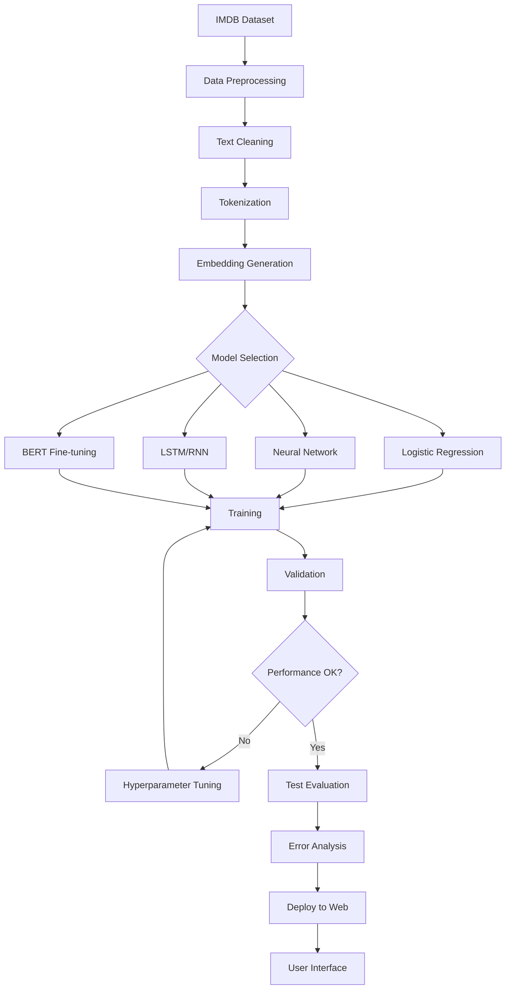
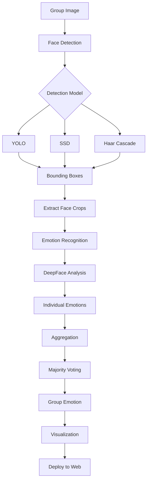
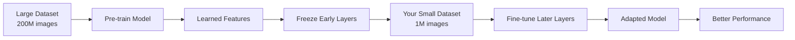
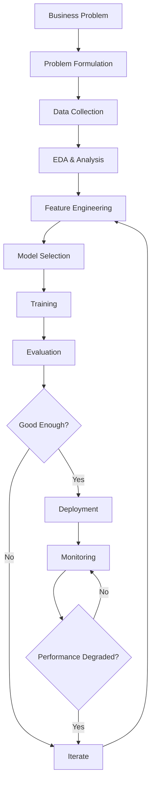
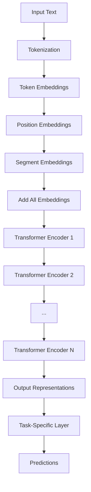
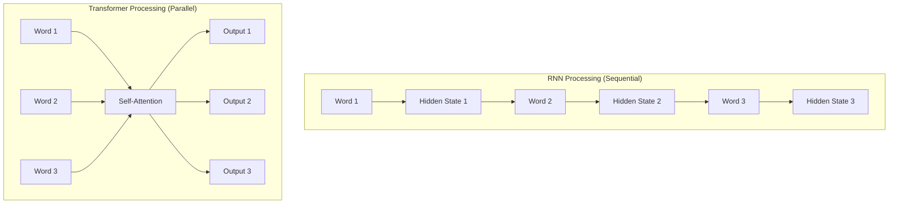
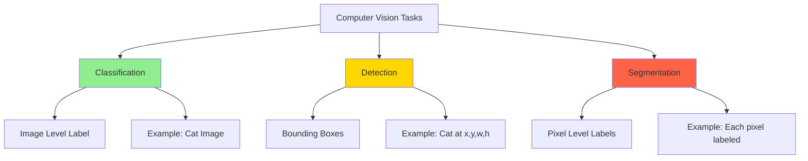
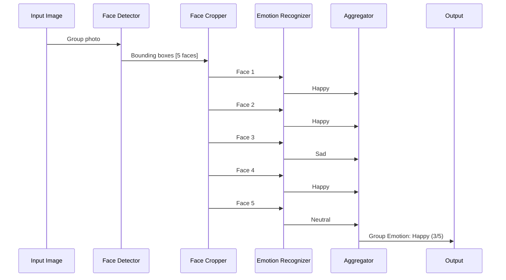
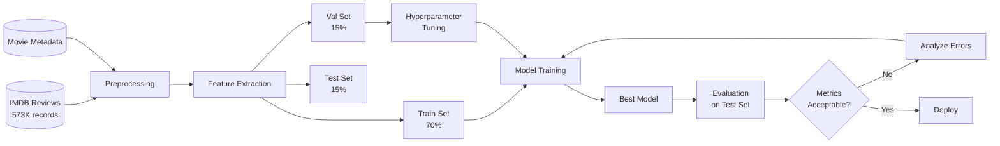
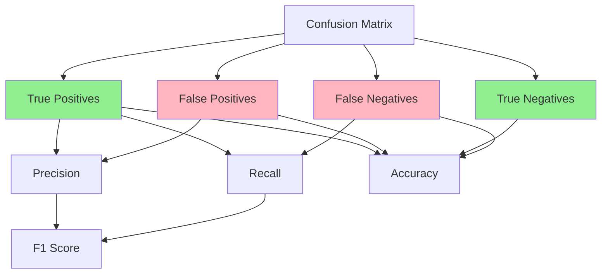

# Week 28 - Deep Learning Mini Projects - Comprehensive Study Guide

## 📚 Overview
This week focuses on two end-to-end deep learning projects that combine concepts from Computer Vision and Natural Language Processing. These projects simulate real-world ML workflows from data analysis to deployment.

---

## 🎯 Learning Objectives
- Implement end-to-end ML pipelines (data cleaning → model training → deployment)
- Apply transfer learning and pre-trained models
- Work with both Computer Vision and NLP domains
- Create production-ready solutions with UI interfaces
- Understand business problem to ML problem conversion

---

## 🌟 Simple Concepts (Like Explaining to a 12-Year-Old)

### What is Artificial Intelligence?
Think of AI like teaching a computer to think like a human brain:
- **Sensory Neurons**: Just like your eyes see things and ears hear sounds, computers use cameras and microphones
- **Brain Processing**: Your brain processes what you see/hear. Computers use algorithms (step-by-step instructions)
- **Motor Neurons**: Your brain tells your hands to move. Computers can control robots or make decisions

**Example**: When you touch a hot cup:
1. Your hand feels heat (sensor)
2. Your brain says "Ouch! Too hot!" (processing)
3. Your hand pulls away (action)

Computers do the same: Camera sees → AI processes → Takes action

### Two Main AI Domains

#### 1. Computer Vision (Teaching Computers to "See")
Imagine teaching a computer to understand pictures like you do:


**Classification**: "This picture has a cat in it" (one label for whole image)
**Detection**: "The cat is HERE" (drawing a box around it)
**Segmentation**: "These exact pixels are the cat" (coloring every pixel)
**Recognition**: "This is Fluffy, my cat" (identifying specific individuals)

#### 2. Natural Language Processing (Teaching Computers to "Read")
Teaching computers to understand text like you read a book:

**Question & Answer**: Ask "What's the capital of France?" → Get "Paris"
**Translation**: "Hello" → "Hola" (English to Spanish)
**Sentiment Analysis**: "I love this movie!" → Computer knows you're happy
**Summarization**: Long book → Short summary
**Text Generation**: Computer writes stories or answers

---

## 🔬 Technical Concepts

### 1. Computer Vision Tasks (Detailed)

#### Image Classification
- **Definition**: Assigning one label to an entire image
- **Formula**: One Image → One Label
- **Example**: Image with cat, car, clouds → Label: "Car"
- **Key Point**: Doesn't tell WHERE the object is, just that it EXISTS

#### Object Detection
- **Definition**: Finding objects and drawing bounding boxes around them
- **Formula**: One Image → Multiple Boxes + Labels
- **Components**:
  - Bounding Box: Rectangle coordinates (x, y, width, height)
  - Class Label: What's inside the box
- **More specific than classification**


#### Segmentation
- **Definition**: Labeling every single pixel in an image
- **Formula**: One Image → Pixel-level masks
- **Most specific**: Exact contours of objects
- **Example**: Every pixel of the cat is labeled "cat", every pixel of sky is labeled "sky"

#### Recognition vs Detection
- **Recognition**: Identifying WHO (e.g., "This is John")
- **Detection**: Finding WHERE + WHAT (e.g., "A person is here")
- **Use Cases**: Face recognition in phones, airports, surveillance

### 2. NLP Tasks (Detailed)

#### Text Classification
- **Definition**: Categorizing text into predefined classes
- **Example**: Email → Spam or Not Spam
- **Binary Classification**: Two classes (Yes/No, Spoiler/Not Spoiler)
- **Multi-class**: Multiple categories

#### Sentiment Analysis
- **Definition**: Determining emotional tone of text
- **Classes**: Positive, Negative, Neutral
- **Applications**: Product reviews, social media monitoring, customer feedback

#### Question Answering (Q&A)
- **Types**:
  1. **Open Domain**: Answer from general knowledge
  2. **Closed Domain**: Answer from provided context/document
- **Example**: Give document → Ask questions → Get answers from that document


### 3. Deep Learning Architectures

#### Recurrent Neural Networks (RNN)
- **Purpose**: Process sequential data (text, time series)
- **Key Feature**: Has memory - remembers previous inputs
- **Structure**: 
  - Hidden state carries information forward
  - Each step uses: Current input + Previous hidden state
- **Problem Solved**: Vanishing/Exploding gradients in long sequences
- **Limitation**: Cannot parallelize (must process sequentially)

```
Input 1 → [RNN Cell] → Hidden State 1 →
Input 2 → [RNN Cell] → Hidden State 2 →
Input 3 → [RNN Cell] → Hidden State 3 → Output
```

#### Transformers
- **Advantage over RNN**: Can process in parallel
- **Components**:
  - **Encoder**: Understands input with context
  - **Decoder**: Generates output
- **Types**:
  1. **Encoder-only**: BERT (understanding tasks)
  2. **Decoder-only**: GPT, ChatGPT (generation tasks)
  3. **Encoder-Decoder**: Translation models

#### BERT (Bidirectional Encoder Representations from Transformers)
- **Type**: Encoder-only model
- **Key Feature**: Reads text bidirectionally (left-to-right AND right-to-left)
- **Trained on**: Large corpus of text
- **Advantages**:
  - High accuracy
  - Multilingual (100+ languages)
  - Pre-trained (can fine-tune for specific tasks)


**BERT Variants**:
- **RoBERTa**: High accuracy, larger model
- **ALBERT**: Lightweight, low memory
- **ELECTRA**: Fast, medium-sized

### 4. Transfer Learning

#### Concept
Instead of training from scratch, use a pre-trained model and adapt it:

**Traditional ML**:
```
Task A → Train Model A → Model A
Task B → Train Model B → Model B
(Two separate models, both trained from scratch)
```

**Transfer Learning**:
```
Task A → Train Model → Extract Knowledge →
Task B → Fine-tune Model → Adapted Model
(One model, reused and adapted)
```

#### Benefits
1. **Less Data Required**: Don't need millions of examples for Task B
2. **Faster Training**: Start with learned features
3. **Better Performance**: Leverage knowledge from large datasets
4. **Cost Effective**: Don't need massive compute resources

#### Example
- Pre-train on 200 million images
- Fine-tune on your 1 million images
- Get better results than training from scratch on 1 million

---

## 📊 Important Concepts

### Premise vs Hypothesis (Natural Language Inference)


**Premise**: The truth/fact given to you
**Hypothesis**: Statement to test against the premise

**Three Possible Relationships**:

1. **Entailment**: Hypothesis is TRUE because premise is true
   - Premise: "Multiple males playing soccer"
   - Hypothesis: "Some men are playing a sport"
   - Result: ✅ Entailment (soccer is a sport, multiple males = some men)

2. **Neutral**: Cannot determine if hypothesis is true
   - Premise: "An older and younger man smiling"
   - Hypothesis: "Two men smiling and laughing at cats playing"
   - Result: ⚪ Neutral (cats not mentioned in premise)

3. **Contradiction**: Hypothesis contradicts the premise
   - Premise: "A man inspects a uniform"
   - Hypothesis: "The man is sleeping"
   - Result: ❌ Contradiction (can't inspect while sleeping)

---

## 🎯 Project 1: Spoiler Shield

### Business Problem
**Goal**: Protect users from movie/book spoilers in reviews

**Why Important?**:
- Users want to read reviews without plot reveals
- Spoilers ruin the viewing/reading experience
- Need automatic detection (can't manually check all reviews)

### Converting to ML Problem

**Business Problem** → **ML Problem**:
- Business: "Don't spoil movies for users"
- ML: "Binary text classification - Spoiler or Not Spoiler"


**Business Metrics** → **ML Metrics**:
- Business: Save X million dollars, increase user satisfaction
- ML: Accuracy, Precision, Recall, F1-Score, AUC

### Dataset

**Two Files Provided**:

1. **IMDB Reviews** (573,000 records):
   - `review_date`: When review was written
   - `movie_id`: Unique movie identifier
   - `user_id`: Who wrote the review
   - `is_spoiler`: **TARGET LABEL** (0 or 1)
   - `review_text`: The actual review content
   - `rating`: User's rating
   - `review_summary`: Short summary

2. **Movie Metadata**:
   - `movie_id`: Links to reviews
   - `plot_summary`: Non-spoiler plot description
   - `duration`: Movie length
   - `genre`: Action, Thriller, etc.
   - `rating`: Overall rating
   - `release_date`: When released
   - `plot_synopsis`: Detailed plot (contains spoilers)

### Approach

**Step 1: Data Preprocessing**
- Tokenization: Break text into words/subwords
- Padding: Make all reviews same length
- Cleaning: Remove special characters, lowercase, etc.


**Step 2: Feature Engineering**
- Use embeddings (Word2Vec, GloVe, or BERT)
- Convert text to numerical vectors
- Capture semantic meaning

**Step 3: Model Selection**
Try multiple approaches:
1. Simple: Logistic Regression
2. Medium: Feed-forward Neural Network
3. Advanced: LSTM/RNN
4. State-of-art: BERT fine-tuning

**Step 4: Training**
- Split data: Train/Validation/Test
- Use transfer learning (don't train from scratch)
- Fine-tune pre-trained models
- Hyperparameter tuning

**Step 5: Evaluation**
- Accuracy: Overall correctness
- Precision: Of predicted spoilers, how many are actually spoilers?
- Recall: Of actual spoilers, how many did we catch?
- F1-Score: Balance between precision and recall

### Key Insights from Discussion

**Comparison Approach**:
- Compare review text with plot synopsis
- If review is too similar to synopsis → Likely spoiler
- Use semantic similarity (embeddings)

**Classification Approach**:
- Train classifier on labeled data
- Learn patterns of spoiler language
- Predict on new reviews


### Implementation Tips

1. **Start Small**: Test on 1,000 reviews first, then scale up
2. **Use Kaggle**: 35 hours/week of free GPU compute
3. **Try Multiple Models**: At least 3 different algorithms
4. **Document Everything**: EDA, model choices, results
5. **Analyze Failures**: What reviews did model get wrong? Why?

### Deliverables

**Jupyter Notebook Must Include**:
- ETL (Extract, Transform, Load) details
- EDA with 6-8 visualizations
- Statistical analysis
- Model training (3+ algorithms)
- Hyperparameter tuning
- Model evaluation with multiple metrics
- Result analysis
- Future work suggestions

---

## 🎯 Project 2: EmoSense (Group Emotion Recognition)

### Business Problem
**Goal**: Understand group emotions by analyzing individual faces

**Real-World Applications**:
1. **Corporate**: Employee satisfaction in meetings
2. **Education**: Student engagement in lectures
3. **Events**: Attendee experience at festivals
4. **Retail**: Customer reactions in showrooms
5. **Political**: Crowd sentiment at rallies
6. **Food Industry**: Customer satisfaction at food fairs


### Problem Breakdown

**Two-Stage Process**:

**Stage 1: Face Detection**
- Input: Group image with multiple people
- Output: Bounding boxes around each face
- Tools: YOLO, SSD, Haar Cascade

**Stage 2: Emotion Recognition**
- Input: Individual face crops
- Output: Emotion label for each face
- Tools: DeepFace library

**Stage 3: Aggregation**
- Input: All individual emotions
- Output: Overall group emotion
- Method: Majority voting

### Face Detection Models

#### 1. Haar Cascade
- **Type**: Traditional (non-ML) algorithm
- **Pros**: Fast, lightweight
- **Cons**: Lower accuracy
- **Best for**: Simple scenarios, resource-constrained

#### 2. YOLO (You Only Look Once)
- **Type**: Deep learning (state-of-art)
- **Versions**: YOLOv5, YOLOv7, YOLOv8
- **Pros**: High accuracy, real-time speed
- **Cons**: Requires more compute
- **Best for**: Production systems

#### 3. SSD (Single Shot MultiBox Detector)
- **Type**: Deep learning
- **Balance**: Between speed and accuracy
- **Use**: Alternative to YOLO


### Emotion Recognition

**DeepFace Library**:
- Pre-trained models for emotion detection
- No training required (use off-the-shelf)
- Supports multiple backends

**Emotion Categories**:
- Happy
- Sad
- Angry
- Surprised
- Fearful
- Disgusted
- Neutral

### Evaluation Metric: IoU (Intersection over Union)

**Formula**:
```
IoU = Area of Overlap / Area of Union
```

**Example**:
- Predicted Box: Where model thinks face is
- Ground Truth Box: Where face actually is
- IoU = How much they overlap / Total area covered

**Interpretation**:
- IoU = 1.0: Perfect match
- IoU > 0.5: Generally considered good
- IoU < 0.3: Poor detection

### Dataset & Labeling

**Provided**: ~3,000 group images from internet

**Your Task**: Manual labeling
- Label faces with bounding boxes
- Label emotions for each face
- Use Label Studio tool


**Labeling Strategy**:
1. Don't need to label all 3,000 (sample 50-100)
2. Ensure diversity:
   - Different emotions (happy, sad, angry, etc.)
   - Different settings (office, festival, classroom)
   - Different lighting conditions
3. Maintain consistent labeling order (e.g., top-left to bottom-right)

**Purpose of Labels**: Testing/Validation (NOT training)
- Models are pre-trained
- Labels verify how well pipeline works

### Image Quality Enhancement

**Problem**: Some images may be low quality (blurry, low resolution)

**Solution**: Super Resolution Techniques
- Upscale image quality
- Use bicubic interpolation
- Apply CNN-based enhancement
- Better input → Better output

### Aggregation: Majority Voting

**Example**:
- Image has 5 people
- 3 are happy
- 2 are neutral
- **Group Emotion**: Happy (majority)

**Alternative Approaches**:
- Weighted voting (give more weight to prominent faces)
- Average emotion scores
- Consider spatial distribution


### Innovation Opportunities

Since you're using pre-trained models, add innovation:

1. **Multimodal Fusion**:
   - Add audio analysis (voice tone)
   - Add text analysis (captions, comments)
   - Combine multiple signals

2. **Temporal Analysis**:
   - Analyze video sequences
   - Track emotion changes over time

3. **Context Awareness**:
   - Consider event type
   - Adjust interpretation based on setting

4. **Latency Optimization**:
   - Batch processing
   - Model quantization
   - Parallel processing

### Deliverables

**PDF Document**:
- Implementation process description
- How solution differentiates individual emotions
- Step-by-step workflow explanation
- Technology integration details
- Preliminary results on labeled data
- Qualitative and quantitative analysis
- Comparisons with existing methods
- Challenges faced and solutions
- Future improvements
- Ethical considerations

**Jupyter Notebook**:
- Well-documented code
- Clear section labels
- Instructions for running
- Visualizations and diagrams
- Intermediate results


---

## 🎓 Key Takeaways from Class Discussion

### General ML Project Workflow

1. **Business Problem** → Understand stakeholder needs
2. **Problem Formulation** → Convert to ML problem
3. **Data Collection** → Gather relevant data
4. **Data Analysis** → EDA, understand patterns
5. **Feature Engineering** → Extract meaningful features
6. **Model Selection** → Choose appropriate algorithms
7. **Training** → Train/fine-tune models
8. **Evaluation** → Measure performance
9. **Deployment** → Create UI, make accessible
10. **Monitoring** → Track performance over time

### Important Principles

**Start Small**:
- Test on small dataset first
- Verify pipeline works
- Then scale up
- Saves time and compute

**Don't Reinvent the Wheel**:
- Use pre-trained models
- Leverage transfer learning
- Fine-tune instead of training from scratch
- Focus on problem-solving, not model training

**Documentation Matters**:
- Clear code comments
- Explain decisions
- Show intermediate results
- Discuss failures and learnings


**End-to-End Implementation**:
- Not just model training
- Include data pipeline
- Add UI for interaction
- Make it production-ready

---

## 📝 Interview Questions & Detailed Answers

### Q1: What is the difference between classification, detection, and segmentation?

**Answer**:
- **Classification**: Assigns one label to entire image. Example: "This image contains a dog." No location information.
  
- **Detection**: Identifies objects and their locations using bounding boxes. Example: "There's a dog at coordinates (x, y) with width w and height h."
  
- **Segmentation**: Labels every pixel in the image. Example: "Pixels 1-500 belong to dog, pixels 501-1000 belong to background." Most precise but computationally expensive.

**Hierarchy**: Classification (general) → Detection (more specific) → Segmentation (most specific)

### Q2: Explain transfer learning and why it's beneficial.

**Answer**:
Transfer learning uses a model pre-trained on large dataset and adapts it for a new task.

**Benefits**:
1. **Data Efficiency**: Need fewer training examples (1M vs 200M)
2. **Time Savings**: Don't train from scratch
3. **Better Performance**: Leverage learned features
4. **Cost Effective**: Less compute required


**Example**: ImageNet pre-trained model → Fine-tune for medical images

**Process**:
1. Take pre-trained model (trained on millions of images)
2. Freeze early layers (general features)
3. Fine-tune later layers (task-specific features)
4. Train on your smaller dataset

### Q3: What problems do RNNs and LSTMs solve?

**Answer**:
RNNs solve the problem of processing sequential data where order matters (text, time series).

**Key Problems Addressed**:
1. **Vanishing Gradient**: In deep networks, gradients become too small, preventing learning
2. **Exploding Gradient**: Gradients become too large, causing instability
3. **Long-term Dependencies**: Remembering information from many steps ago

**How LSTMs Help**:
- Special gates (forget, input, output) control information flow
- Cell state acts as "memory highway"
- Can remember important information for long sequences

**Limitation**: Sequential processing (can't parallelize)

### Q4: How do Transformers differ from RNNs?

**Answer**:

**RNNs**:
- Process sequentially (one word at a time)
- Cannot parallelize
- Struggle with long sequences
- Hidden state carries information


**Transformers**:
- Process in parallel (all words simultaneously)
- Can parallelize (faster training)
- Handle long sequences better
- Use attention mechanism

**Key Innovation**: Self-attention allows model to focus on relevant parts of input regardless of distance.

### Q5: Explain the concept of premise and hypothesis in NLI.

**Answer**:
Natural Language Inference (NLI) determines relationship between two sentences.

**Premise**: Given fact/truth
**Hypothesis**: Statement to verify

**Three Relationships**:

1. **Entailment**: Hypothesis must be true if premise is true
   - Premise: "John is eating pizza"
   - Hypothesis: "John is eating food"
   - Pizza is food → Entailment

2. **Contradiction**: Hypothesis contradicts premise
   - Premise: "John is eating pizza"
   - Hypothesis: "John is sleeping"
   - Can't eat and sleep simultaneously → Contradiction

3. **Neutral**: Cannot determine truth
   - Premise: "John is eating pizza"
   - Hypothesis: "John likes pizza"
   - Eating doesn't mean liking → Neutral

### Q6: How would you convert the spoiler detection business problem into an ML problem?

**Answer**:


**Business Problem**:
- Users don't want movie plots revealed in reviews
- Need to identify spoiler reviews automatically
- Improve user experience and platform loyalty

**ML Problem Formulation**:
- **Task Type**: Binary text classification
- **Input**: Review text
- **Output**: Spoiler (1) or Not Spoiler (0)
- **Features**: Text embeddings from review
- **Labels**: is_spoiler column

**Metrics Translation**:
- Business: User satisfaction, engagement, retention
- ML: Accuracy, Precision, Recall, F1-Score, AUC-ROC

**Approach**:
1. Text preprocessing (tokenization, padding)
2. Feature extraction (embeddings)
3. Model training (classification)
4. Evaluation and iteration

### Q7: What is IoU and why is it used in object detection?

**Answer**:
IoU (Intersection over Union) measures overlap between predicted and actual bounding boxes.

**Formula**:
```
IoU = (Area of Overlap) / (Area of Union)
```

**Visual Example**:
```
Predicted Box: [----]
Ground Truth:    [----]
Overlap:         [-]
Union:       [-------]
```


**Why Important**:
- Measures detection accuracy
- Standard metric in object detection
- Threshold for determining correct detection (usually IoU > 0.5)

**Interpretation**:
- IoU = 1.0: Perfect detection
- IoU = 0.7: Good detection
- IoU = 0.5: Acceptable (common threshold)
- IoU < 0.3: Poor detection

### Q8: Compare BERT variants (RoBERTa, ALBERT, ELECTRA).

**Answer**:

| Feature | RoBERTa | ALBERT | ELECTRA |
|---------|---------|--------|---------|
| **Size** | Large | Small/Light | Medium |
| **Accuracy** | Highest | Good | Good |
| **Speed** | Slower | Faster | Fastest |
| **Memory** | High | Low | Medium |
| **Best For** | High accuracy needs | Resource-constrained | Balance speed/accuracy |

**RoBERTa** (Robustly Optimized BERT):
- Trained longer with more data
- Removed next sentence prediction
- Best accuracy but resource-intensive

**ALBERT** (A Lite BERT):
- Parameter sharing across layers
- Factorized embeddings
- Much smaller model size

**ELECTRA** (Efficiently Learning an Encoder):
- Different training approach (replaced token detection)
- More efficient than BERT
- Good balance


### Q9: Explain the group emotion recognition pipeline.

**Answer**:

**Complete Pipeline**:

```
Input: Group Image
    ↓
[Face Detection] (YOLO/Haar Cascade)
    ↓
Individual Face Crops
    ↓
[Emotion Recognition] (DeepFace)
    ↓
Individual Emotions: [Happy, Happy, Sad, Happy, Neutral]
    ↓
[Aggregation] (Majority Voting)
    ↓
Output: Group Emotion = Happy
```

**Stage 1: Face Detection**
- Input: RGB image with multiple people
- Process: Run YOLO/SSD/Haar Cascade
- Output: Bounding boxes [(x1,y1,w1,h1), (x2,y2,w2,h2), ...]

**Stage 2: Face Cropping**
- Extract individual faces using bounding boxes
- Resize to standard size (e.g., 224x224)
- Normalize pixel values

**Stage 3: Emotion Recognition**
- Input: Individual face crops
- Process: Run DeepFace emotion classifier
- Output: Emotion labels [Happy, Sad, Angry, ...]

**Stage 4: Aggregation**
- Count emotion frequencies
- Apply majority voting
- Return dominant emotion


### Q10: What are the key differences between training from scratch vs using pre-trained models?

**Answer**:

**Training from Scratch**:
- **Pros**:
  - Full control over architecture
  - Optimized for specific task
  - No dependency on external models
  
- **Cons**:
  - Requires massive dataset (millions of examples)
  - Needs significant compute (GPUs for weeks/months)
  - Expensive ($$$)
  - Time-consuming
  - May not perform better

**Using Pre-trained Models**:
- **Pros**:
  - Requires small dataset (thousands vs millions)
  - Fast training (hours vs weeks)
  - Cost-effective
  - Often better performance (learned from diverse data)
  - Proven architectures
  
- **Cons**:
  - Less flexibility
  - May have unnecessary features
  - Dependency on external models

**When to Use Each**:
- **From Scratch**: Novel task, unique data, research setting
- **Pre-trained**: Most practical applications, limited resources, proven domains

---

## 🔧 Practical Implementation Tips

### For Spoiler Shield Project


**1. Data Exploration**:
```python
# Check class distribution
spoiler_counts = df['is_spoiler'].value_counts()
# Visualize review lengths
review_lengths = df['review_text'].str.len()
# Check for missing values
missing_data = df.isnull().sum()
```

**2. Text Preprocessing**:
```python
# Tokenization
from transformers import BertTokenizer
tokenizer = BertTokenizer.from_pretrained('bert-base-uncased')

# Padding and truncation
encoded = tokenizer(
    texts,
    padding=True,
    truncation=True,
    max_length=512,
    return_tensors='pt'
)
```

**3. Model Training**:
```python
# Try multiple models
models = [
    'LogisticRegression',
    'SimpleNN',
    'LSTM',
    'BERT'
]

# Compare performance
for model in models:
    train_and_evaluate(model)
```

**4. Evaluation**:
```python
from sklearn.metrics import classification_report, confusion_matrix

# Get predictions
y_pred = model.predict(X_test)

# Detailed metrics
print(classification_report(y_test, y_pred))
print(confusion_matrix(y_test, y_pred))
```


### For EmoSense Project

**1. Face Detection**:
```python
# Using YOLO
from ultralytics import YOLO
model = YOLO('yolov8n.pt')
results = model(image)

# Extract bounding boxes
for box in results[0].boxes:
    x1, y1, x2, y2 = box.xyxy[0]
    face_crop = image[y1:y2, x1:x2]
```

**2. Emotion Recognition**:
```python
# Using DeepFace
from deepface import DeepFace

# Analyze emotion
result = DeepFace.analyze(
    face_crop,
    actions=['emotion'],
    enforce_detection=False
)

emotion = result[0]['dominant_emotion']
```

**3. Aggregation**:
```python
from collections import Counter

# Collect all emotions
emotions = ['happy', 'happy', 'sad', 'happy', 'neutral']

# Majority voting
emotion_counts = Counter(emotions)
group_emotion = emotion_counts.most_common(1)[0][0]
```

**4. Evaluation**:
```python
def calculate_iou(box1, box2):
    # Calculate intersection
    x1 = max(box1[0], box2[0])
    y1 = max(box1[1], box2[1])
    x2 = min(box1[2], box2[2])
    y2 = min(box1[3], box2[3])
    
    intersection = max(0, x2-x1) * max(0, y2-y1)
    
    # Calculate union
    area1 = (box1[2]-box1[0]) * (box1[3]-box1[1])
    area2 = (box2[2]-box2[0]) * (box2[3]-box2[1])
    union = area1 + area2 - intersection
    
    return intersection / union
```


---

## 🎨 Deployment & Portfolio Tips

### Creating Web Interface

**For Spoiler Shield**:
```python
# Using Streamlit
import streamlit as st

st.title("Spoiler Shield")

# Input
movie_plot = st.text_area("Enter movie plot")
review = st.text_area("Enter review")

# Predict
if st.button("Check for Spoilers"):
    prediction = model.predict(review)
    if prediction == 1:
        st.error("⚠️ This review contains spoilers!")
    else:
        st.success("✅ This review is spoiler-free!")
```

**For EmoSense**:
```python
# Using Streamlit
import streamlit as st
from PIL import Image

st.title("EmoSense - Group Emotion Recognition")

# Upload image
uploaded_file = st.file_uploader("Upload group image")

if uploaded_file:
    image = Image.open(uploaded_file)
    st.image(image)
    
    # Process
    emotions = process_image(image)
    group_emotion = aggregate_emotions(emotions)
    
    st.write(f"Group Emotion: {group_emotion}")
    st.write(f"Individual Emotions: {emotions}")
```

### Deployment Options

1. **Hugging Face Spaces**: Free, easy, Python-based
2. **Streamlit Cloud**: Free tier, simple deployment
3. **Heroku**: Free tier available
4. **AWS/GCP**: More control, may cost money


### Portfolio Best Practices

**What Recruiters Want to See**:
1. **Live Demo**: Working web interface
2. **Clear Documentation**: README with setup instructions
3. **Code Quality**: Clean, commented, organized
4. **Results**: Metrics, visualizations, analysis
5. **Problem-Solving**: Challenges faced and solutions

**GitHub Repository Structure**:
```
project-name/
├── README.md              # Project overview
├── requirements.txt       # Dependencies
├── notebooks/
│   ├── EDA.ipynb         # Exploratory analysis
│   ├── modeling.ipynb    # Model training
│   └── evaluation.ipynb  # Results analysis
├── src/
│   ├── preprocessing.py  # Data processing
│   ├── model.py          # Model definitions
│   └── utils.py          # Helper functions
├── app/
│   └── app.py            # Web interface
├── models/
│   └── best_model.pkl    # Saved model
└── docs/
    └── report.pdf        # Detailed report
```

---

## 📊 Grading Rubrics Summary

### Spoiler Shield Rubric

**Excellent Performance**:
- Clear understanding of objectives
- 6-8 comprehensive EDA visualizations
- 3+ algorithms tested
- Exhaustive hyperparameter tuning
- Multiple evaluation metrics (Precision, Recall, F1, AUC)
- Cross-validation implemented
- Thorough result analysis
- Future work scoped


### EmoSense Rubric

**Excellent Performance**:
- Highly accurate face detection (YOLO/SSD)
- Successful emotion prediction per individual
- Thorough manual labeling and evaluation
- Appropriate metrics (IoU, accuracy, precision, recall)
- Highly innovative approach
- Multimodal considerations
- Clear, well-organized documentation
- Intermediate results shown
- Challenges and solutions documented
- Latency analysis included

---

## 🔍 Common Pitfalls to Avoid

### Data-Related
1. **Imbalanced Classes**: Check class distribution, use stratified sampling
2. **Data Leakage**: Ensure test data never seen during training
3. **Insufficient EDA**: Don't skip exploratory analysis
4. **Poor Preprocessing**: Inconsistent tokenization, padding issues

### Model-Related
1. **Overfitting**: Use regularization, dropout, early stopping
2. **Underfitting**: Try more complex models, more features
3. **Single Model**: Always try multiple approaches
4. **No Baseline**: Start with simple model as baseline

### Evaluation-Related
1. **Single Metric**: Use multiple metrics (accuracy alone insufficient)
2. **No Error Analysis**: Analyze what model gets wrong
3. **Ignoring Edge Cases**: Test on difficult examples
4. **No Validation Set**: Always have train/val/test split


### Documentation-Related
1. **Poor Comments**: Code without explanations
2. **No Visualizations**: Results without plots
3. **Missing Rationale**: Don't explain why choices made
4. **Incomplete README**: Missing setup instructions

---

## 🚀 Advanced Topics & Future Directions

### For Spoiler Shield

**Advanced Techniques**:
1. **Ensemble Methods**: Combine multiple models
2. **Attention Mechanisms**: Identify which words indicate spoilers
3. **Multi-task Learning**: Predict spoiler + sentiment simultaneously
4. **Active Learning**: Iteratively label most uncertain examples

**Future Enhancements**:
1. **Severity Scoring**: Not just binary, but how much spoiler
2. **Contextual Spoilers**: Consider movie release date
3. **User Preferences**: Personalized spoiler tolerance
4. **Real-time Processing**: Stream processing for new reviews

### For EmoSense

**Advanced Techniques**:
1. **Temporal Analysis**: Track emotion changes in videos
2. **Attention Weighting**: Weight prominent faces more
3. **Context Integration**: Consider event type, location
4. **Multi-modal Fusion**: Combine face + voice + text

**Future Enhancements**:
1. **Micro-expressions**: Detect subtle emotions
2. **Group Dynamics**: Analyze interactions between people
3. **Cultural Adaptation**: Account for cultural differences
4. **Privacy Preservation**: Anonymize faces while detecting emotions


---

## 🎯 Project Timeline & Milestones

### Week 1: Setup & EDA
- [ ] Set up environment (Kaggle/Colab)
- [ ] Download datasets
- [ ] Exploratory Data Analysis
- [ ] Data preprocessing pipeline
- [ ] Baseline model

### Week 2: Model Development
- [ ] Implement 3+ models
- [ ] Hyperparameter tuning
- [ ] Model evaluation
- [ ] Error analysis
- [ ] Select best model

### Week 3: Enhancement & Documentation
- [ ] Improve best model
- [ ] Create visualizations
- [ ] Write documentation
- [ ] Build web interface
- [ ] Final testing

### Week 4: Deployment & Submission
- [ ] Deploy to web
- [ ] Create demo video
- [ ] Final report
- [ ] Code cleanup
- [ ] Submit deliverables

---

## 📚 Recommended Resources

### Libraries & Tools
- **Transformers**: Hugging Face library for BERT, GPT
- **DeepFace**: Face analysis library
- **Ultralytics**: YOLO implementation
- **Label Studio**: Data labeling tool
- **Streamlit**: Web app framework
- **Kaggle**: Free GPU compute


### Documentation
- BERT Paper: "Attention is All You Need"
- YOLO Paper: "You Only Look Once"
- DeepFace Documentation
- Kaggle Notebooks: Search for similar projects

### Tutorials
- Hugging Face Course (free)
- Fast.ai Practical Deep Learning
- Kaggle Learn: NLP & Computer Vision
- YouTube: Sentdex, StatQuest

---

## 🎓 Ethical Considerations

### For Spoiler Shield
- **Privacy**: Don't store user reviews without consent
- **Bias**: Ensure model works across genres, languages
- **Transparency**: Explain why review flagged as spoiler
- **False Positives**: Balance between catching spoilers and false alarms

### For EmoSense
- **Privacy**: Face data is sensitive - handle carefully
- **Consent**: Only use images with permission
- **Bias**: Test across different demographics
- **Misuse**: Consider surveillance concerns
- **Data Security**: Encrypt and protect face data
- **Transparency**: Explain how emotions detected

---

## 💡 Key Insights from Instructor

### From Sarfaraz Hussein (Applied Scientist, Amazon)

**On ML Projects**:
- "Start small, see if pipeline works, then scale up"
- "You're not expected to train state-of-art models"
- "Leverage and reuse whatever is available"


**On Learning**:
- "Focus on understanding basics and underlying concepts"
- "Once you understand, you can always build upon it"
- "Don't worry about others using off-shelf models - focus on understanding"

**On Portfolio**:
- "Make sure you have UI where people can interact"
- "Showing code in GitHub is good, but web interface is better"
- "Recruiters want to see working demos"

**On Deployment**:
- "You don't need to show API keys when deploying"
- "Use Hugging Face for simple deployment"
- "Make it accessible and interactive"

---

## 📝 Summary & Action Items

### What You Learned
1. End-to-end ML project workflow
2. Computer Vision and NLP fundamentals
3. Transfer learning and pre-trained models
4. Two complete project implementations
5. Deployment and portfolio building

### What You Need to Do
1. **Choose Project**: Start with one (Spoiler Shield or EmoSense)
2. **Set Up Environment**: Kaggle or Colab with GPU
3. **Follow Workflow**: EDA → Modeling → Evaluation → Deployment
4. **Document Everything**: Code, decisions, results, learnings
5. **Create Demo**: Web interface for portfolio
6. **Submit**: Notebook + PDF + Code

### Success Criteria
- ✅ Working end-to-end pipeline
- ✅ Multiple models tested (3+)
- ✅ Comprehensive evaluation
- ✅ Clear documentation
- ✅ Deployed web interface
- ✅ Analysis of results and future work


---

## 🔗 Quick Reference Links

### Datasets
- IMDB Spoiler Dataset: [Link provided in class materials]
- Group Images Dataset: ~3,000 images [Link provided in class materials]

### Tools & Libraries
- Kaggle: https://www.kaggle.com
- Hugging Face: https://huggingface.co
- DeepFace: https://github.com/serengil/deepface
- Ultralytics YOLO: https://github.com/ultralytics/ultralytics
- Label Studio: https://labelstud.io
- Streamlit: https://streamlit.io

### Documentation
- BERT: https://arxiv.org/abs/1810.04805
- Transformers: https://arxiv.org/abs/1706.03762
- YOLO: https://arxiv.org/abs/1506.02640

### Support
- Review Sessions: November 19 & 26 at 6 PM Pacific
- Office Hours: Check with IK team
- Discussion Forum: Use class platform

---

## 📞 Getting Help

### When Stuck
1. **Check Documentation**: Read library docs first
2. **Search Similar Issues**: GitHub issues, Stack Overflow
3. **Ask Specific Questions**: In review sessions
4. **Debug Systematically**: Print intermediate outputs
5. **Start Simple**: Test on small data first

### Common Questions
- "Model not training?": Check data format, batch size, learning rate
- "Low accuracy?": Try different model, more data, better features
- "Out of memory?": Reduce batch size, use smaller model
- "Slow training?": Use GPU, reduce data size, optimize code

---

## 🎉 Final Motivation

Remember:
- These projects simulate real-world ML workflows
- Focus on learning, not just grades
- Document your journey - it's valuable for interviews
- Build something you're proud to show
- Have fun with it!

**Good luck with your projects! 🚀**

---

*Study Guide Created: Week 28 - DL Mini Projects*
*Based on: Live class session with Sarfaraz Hussein (Applied Scientist, Amazon)*
*Topics: Spoiler Shield (NLP) & EmoSense (Computer Vision)*


---

## 📊 Visual Workflow Diagrams

### Spoiler Shield Project Workflow



### EmoSense Project Workflow




### Transfer Learning Process



### ML Project Lifecycle



### BERT Architecture Overview




### RNN vs Transformer Comparison



### Computer Vision Task Hierarchy



### Emotion Recognition Pipeline Detail




### Data Flow in Spoiler Detection



### Evaluation Metrics Relationship



---

*End of Comprehensive Study Guide*
