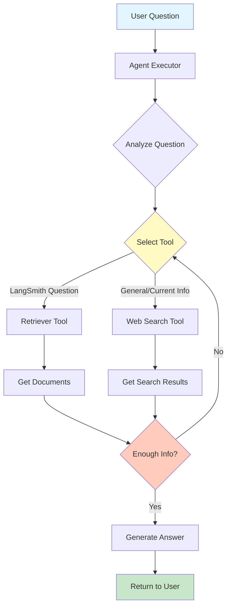

# LangChain-agent.ipynb - Comprehensive Coding Guide

## 📋 Overview
This notebook demonstrates **LangChain Agents** - autonomous systems that can use tools to accomplish tasks. It builds upon basic LangChain concepts to create an intelligent agent that can search the web, query documents, and interact through a chat interface.

**Target Audience**: Python programmers familiar with basic LangChain concepts

**Key Concepts Covered**:
- Agent architecture and reasoning
- Tool creation and integration
- Retriever tools for document search
- Web search tools (Tavily)
- Agent executors and planning
- Building interactive UIs with Gradio

---

## 🎯 What is an Agent?

### Simple Explanation
An **agent** is like a smart assistant that can:
1. **Understand** what you want
2. **Decide** which tools to use
3. **Execute** actions using those tools
4. **Reason** about the results
5. **Respond** with an answer

**Analogy:**
Think of an agent like a personal assistant:
- You ask: "What's the weather in San Francisco?"
- Assistant thinks: "I need to use a weather tool"
- Assistant uses the weather tool
- Assistant responds: "It's 65°F and sunny"

### Agent vs Chain
- **Chain**: Fixed sequence of steps (A → B → C)
- **Agent**: Dynamically decides which tools to use and in what order

---

## 🔧 Setup and Installation

### Cell 1: Installing Required Libraries

```python
!pip install langchainhub
!pip install langchain-openai
!pip install langchain
!pip install beautifulsoup4
!pip install langchain-community
!pip install faiss-cpu
!pip install -U langchain-community tavily-python
!pip gradio_client==0.2.10
!pip install gradio==3.38.0
```

**New Libraries (compared to previous notebook):**

1. **`langchainhub`**: Hub for sharing prompts and chains
   - Access community-created prompts
   - Share your own prompts
   - Version control for prompts

2. **`tavily-python`**: Tavily search API client
   - Web search optimized for LLMs
   - Returns clean, relevant results
   - Better than raw Google search for AI applications

3. **`gradio`**: Build web UIs for ML models
   - Create chat interfaces quickly
   - Share demos with a public link
   - No frontend coding required

4. **`gradio_client`**: Client for Gradio apps
   - Interact with Gradio apps programmatically
   - Specific version (0.2.10) for compatibility

**Why These Tools?**
- **LangChainHub**: Reuse proven prompts instead of creating from scratch
- **Tavily**: Provides real-time web information to agents
- **Gradio**: Quickly create shareable demos and prototypes

---

### Cell 2-4: Environment Setup

```python
import getpass
import os
from langchain_core.prompts import ChatPromptTemplate
from langchain_core.output_parsers import StrOutputParser
from langchain_openai import ChatOpenAI
from langchain.chains import create_retrieval_chain

os.environ["OPENAI_API_KEY"] = getpass.getpass()
os.environ["TAVILY_API_KEY"] = getpass.getpass()
```

**New API Key: TAVILY_API_KEY**
- **Purpose**: Authenticate with Tavily search API
- **Get it**: Sign up at https://tavily.com
- **Free tier**: Available for testing
- **Use case**: Enable web search capability for agents

**Import Breakdown:**
- All imports from previous notebook
- Ready to build retrieval chains
- Will add agent-specific imports later

---

## 🔍 Setting Up the Retriever (Cells 6-10)

This section is identical to the previous notebook - creating a RAG system:

1. **Load documents** from web
2. **Create embeddings** with OpenAI
3. **Build vector store** with FAISS
4. **Create document chain** for Q&A
5. **Set up retrieval chain**

**Why Repeat This?**
- Agents need tools to work with
- The retriever becomes one of the agent's tools
- Allows agent to search documentation when needed

---

## 🛠️ Creating Agent Tools

### Cell 12: Retriever Tool

```python
from langchain.tools.retriever import create_retriever_tool

retriever_tool = create_retriever_tool(
    retriever,
    "langsmith_search",
    "Search for information about LangSmith. For any questions about LangSmith, you must use this tool!",
)
```

**`create_retriever_tool` Function:**
- **Purpose**: Convert a retriever into an agent tool
- **Makes retriever usable by agents**

**Arguments Explained:**

1. **`retriever`** (first argument):
   - The retriever object created earlier
   - Performs the actual document search
   - Returns relevant documents

2. **`"langsmith_search"`** (tool name):
   - **Unique identifier** for the tool
   - Agent uses this name to reference the tool
   - Should be descriptive and lowercase with underscores
   - **Best practice**: Use verb_noun format (e.g., search_docs, calculate_price)

3. **Description** (third argument):
   - **Critical for agent decision-making**
   - Tells the agent WHEN to use this tool
   - Should be clear and specific
   - **Good description**: "Search for information about LangSmith. For any questions about LangSmith, you must use this tool!"
   - **Bad description**: "Search stuff" (too vague)

**Why Description Matters:**
The agent reads descriptions to decide which tool to use. A good description:
- Explains what the tool does
- Specifies when to use it
- Includes keywords the agent should look for
- Can include constraints ("you must use this tool")

**Example Decision Process:**
```
User: "How does LangSmith help with testing?"
Agent thinks: "This is about LangSmith... the langsmith_search tool says 
              'For any questions about LangSmith, you must use this tool!'
              I should use langsmith_search."
```

---

### Cell 13: Web Search Tool

```python
from langchain_community.tools.tavily_search import TavilySearchResults

search = TavilySearchResults()
```

**`TavilySearchResults`:**
- **Purpose**: Search the web for current information
- **Returns**: List of relevant web search results
- **Optimized for LLMs**: Clean, structured results

**Default Behavior:**
```python
search = TavilySearchResults(
    max_results=5,              # Number of results to return
    search_depth="basic",       # "basic" or "advanced"
    include_answer=False,       # Include direct answer
    include_raw_content=False,  # Include full page content
    include_images=False        # Include image URLs
)
```

**When Agent Uses This:**
- Questions about current events
- Real-time information (weather, news, stocks)
- Information not in the document retriever
- General knowledge queries

**Example Queries:**
- "What's the weather in San Francisco?"
- "Latest news about AI"
- "Current price of Bitcoin"

---

### Cell 14: Combining Tools

```python
tools = [retriever_tool, search]
```

**Tools List:**
- **Simple list** of all available tools
- Agent can use any tool in this list
- Order doesn't matter (agent decides based on descriptions)

**Tool Selection Process:**
1. Agent receives user question
2. Agent reads all tool descriptions
3. Agent decides which tool(s) to use
4. Agent executes tool(s)
5. Agent formulates response

**Multiple Tools Example:**
```
User: "Compare LangSmith features with current AI trends"
Agent might:
1. Use langsmith_search for LangSmith features
2. Use web search for current AI trends
3. Combine information to answer
```

---

## 🤖 Creating the Agent

### Cell 15: Agent Setup

```python
from langchain_openai import ChatOpenAI
from langchain import hub
from langchain.agents import create_openai_functions_agent
from langchain.agents import AgentExecutor

# Get the prompt to use - you can modify this!
prompt = hub.pull("hwchase17/openai-functions-agent")

llm = ChatOpenAI(model="gpt-3.5-turbo", temperature=0)
agent = create_openai_functions_agent(llm, tools, prompt)
agent_executor = AgentExecutor(agent=agent, tools=tools, verbose=True)
```

**Component Breakdown:**

### 1. LangChain Hub

```python
prompt = hub.pull("hwchase17/openai-functions-agent")
```

**What is LangChain Hub?**
- Repository of prompts and chains
- Community-contributed and official prompts
- Version controlled

**`hub.pull()`:**
- **Downloads a prompt** from the hub
- **Format**: "username/prompt-name"
- **This prompt**: Official OpenAI functions agent prompt
- **Contains**: Instructions for agent reasoning

**What's in the Prompt?**
The prompt tells the agent:
- How to think about problems
- How to use tools
- How to format responses
- When to stop and answer

**You can modify it:**
```python
# View the prompt
print(prompt.messages)

# Or create your own
from langchain_core.prompts import ChatPromptTemplate
custom_prompt = ChatPromptTemplate.from_messages([
    ("system", "You are a helpful assistant with access to tools..."),
    ("user", "{input}"),
    ("assistant", "{agent_scratchpad}")
])
```

### 2. LLM Configuration

```python
llm = ChatOpenAI(model="gpt-3.5-turbo", temperature=0)
```

**Parameters:**
- **`model="gpt-3.5-turbo"`**: Fast and cost-effective
  - Good for most agent tasks
  - Can upgrade to "gpt-4" for better reasoning
  
- **`temperature=0`**: Deterministic responses
  - Same input → same output
  - Good for agents (consistent behavior)
  - Higher temperature = more creative but less predictable

**Why Temperature=0 for Agents?**
- Agents need to make reliable decisions
- Tool selection should be consistent
- Reduces random behavior
- Better for production systems

### 3. Agent Creation

```python
agent = create_openai_functions_agent(llm, tools, prompt)
```

**`create_openai_functions_agent`:**
- **Creates an agent** that uses OpenAI's function calling
- **Function calling**: Special API feature for tool use
- **More reliable** than prompt-based tool selection

**Arguments:**
1. **`llm`**: The language model to use
2. **`tools`**: List of available tools
3. **`prompt`**: Instructions for the agent

**What is Function Calling?**
- OpenAI API feature
- LLM can request to call functions
- Returns structured tool calls
- More reliable than parsing text

**Example Function Call:**
```json
{
  "name": "langsmith_search",
  "arguments": {
    "query": "testing features"
  }
}
```

### 4. Agent Executor

```python
agent_executor = AgentExecutor(agent=agent, tools=tools, verbose=True)
```

**`AgentExecutor`:**
- **Runs the agent** in a loop
- **Handles tool execution**
- **Manages agent reasoning**

**Arguments:**
1. **`agent`**: The agent to execute
2. **`tools`**: Tools the agent can use (must match agent's tools)
3. **`verbose=True`**: Print agent's thinking process
   - Shows which tools are used
   - Displays intermediate steps
   - Helpful for debugging

**Additional Parameters (not shown):**
```python
agent_executor = AgentExecutor(
    agent=agent,
    tools=tools,
    verbose=True,
    max_iterations=15,          # Max reasoning steps
    max_execution_time=60,      # Timeout in seconds
    early_stopping_method="generate",  # How to stop
    handle_parsing_errors=True  # Gracefully handle errors
)
```

**Agent Execution Loop:**
```
1. Receive user input
2. Agent thinks: "What should I do?"
3. Agent decides to use a tool
4. Execute tool
5. Agent sees tool result
6. Agent thinks: "Do I have enough info?"
   - If yes: Generate final answer
   - If no: Use another tool (go to step 3)
7. Return final answer
```

---

## 🎬 Using the Agent

### Cell 16-17: LangSmith Query

```python
result = agent_executor.invoke({"input": "how can langsmith help with testing?"})
result["output"]
```

**What Happens:**

1. **Agent receives question** about LangSmith
2. **Agent thinks**: "This is about LangSmith, I should use langsmith_search"
3. **Executes retriever tool** to search documentation
4. **Receives relevant documents**
5. **Formulates answer** based on retrieved information
6. **Returns response**

**With `verbose=True`, you'll see:**
```
> Entering new AgentExecutor chain...

Invoking: `langsmith_search` with `{'query': 'testing features'}`

[Document results...]

LangSmith can help with testing by providing features such as...

> Finished chain.
```

**Result Structure:**
```python
{
    "input": "how can langsmith help with testing?",
    "output": "LangSmith can help with testing by...",
    "intermediate_steps": [...]  # Tool calls and results
}
```

---

### Cell 18-19: Web Search Query

```python
result = agent_executor.invoke({"input": "what is the weather in SF?"})
print(result["output"])
```

**What Happens:**

1. **Agent receives question** about weather
2. **Agent thinks**: "This is about current weather, not in documents"
3. **Decides to use web search** (TavilySearchResults)
4. **Searches the web** for San Francisco weather
5. **Receives search results**
6. **Formulates answer** from search results
7. **Returns response**

**Why Different Tool?**
- Weather is real-time information
- Not in LangSmith documentation
- Agent intelligently chooses web search
- Demonstrates agent's reasoning capability

**Agent's Decision Process:**
```
Question: "What is the weather in SF?"
Agent analyzes:
- Not about LangSmith → don't use langsmith_search
- About current information → use web search
- Executes: TavilySearchResults
```

---

## 🎨 Building a Chat Interface with Gradio

### Cell 21-23: Gradio Interface

```python
import gradio as gr

def predict(message, _):
  result = agent_executor.invoke({"input": message})
  return result["output"]

gr.ChatInterface(predict,
    chatbot=gr.Chatbot(height=300),
    textbox=gr.Textbox(placeholder="Hi I am your virtual assistant, how can I help you today?", container=False, scale=7),
    title="DocumentQABot",
    theme="soft",
    examples=["What is the weather like in SF?", "What is LangSmith?"],
    retry_btn=None,
    undo_btn="Delete Previous",
    clear_btn="Clear",).launch(share=True)
```

**Component Breakdown:**

### 1. Predict Function

```python
def predict(message, _):
  result = agent_executor.invoke({"input": message})
  return result["output"]
```

**Purpose**: Bridge between Gradio and agent

**Arguments:**
- **`message`**: User's input text
- **`_`**: Chat history (unused in this simple version)

**Returns**: Agent's response string

**Why Simple?**
- Gradio handles UI
- Function just calls agent
- Returns text for display

### 2. ChatInterface

```python
gr.ChatInterface(predict, ...)
```

**`ChatInterface`**: Pre-built chat UI component
- Handles message history
- Manages user input
- Displays responses
- No HTML/CSS/JavaScript needed!

### 3. Configuration Parameters

**`chatbot=gr.Chatbot(height=300)`:**
- **Purpose**: Configure chat display area
- **`height=300`**: Set height in pixels
- **Displays**: Conversation history

**`textbox=gr.Textbox(...)`:**
- **Purpose**: User input field
- **`placeholder`**: Hint text when empty
- **`container=False`**: Remove border
- **`scale=7`**: Relative width (larger = wider)

**`title="DocumentQABot"`:**
- **Purpose**: Display name at top
- **Visible**: In browser tab and interface

**`theme="soft"`:**
- **Purpose**: Visual styling
- **Options**: "default", "soft", "glass", "monochrome"
- **Customizable**: Can create custom themes

**`examples=[...]`:**
- **Purpose**: Clickable example queries
- **Helps users**: Understand what to ask
- **Best practice**: Include diverse examples

**`retry_btn=None`:**
- **Purpose**: Disable retry button
- **Why**: Agent responses are deterministic (temperature=0)
- **Alternative**: Set to "Retry" to enable

**`undo_btn="Delete Previous"`:**
- **Purpose**: Remove last message
- **Label**: Button text
- **Useful**: Fix mistakes

**`clear_btn="Clear"`:**
- **Purpose**: Clear entire conversation
- **Label**: Button text
- **Useful**: Start fresh

### 4. Launch

```python
.launch(share=True)
```

**`launch()` Method:**
- **Starts web server**
- **Opens in browser**
- **Returns URL**

**`share=True`:**
- **Creates public URL** (e.g., https://abc123.gradio.live)
- **Accessible anywhere** (for 72 hours)
- **Great for demos** and sharing
- **Security note**: Anyone with link can access

**Alternative Launch Options:**
```python
.launch(
    share=False,           # Local only
    server_name="0.0.0.0", # Allow external connections
    server_port=7860,      # Custom port
    auth=("user", "pass"), # Add authentication
    debug=True             # Show detailed errors
)
```

---

## 🎯 Agent Architecture Deep Dive

### Agent Reasoning Loop

```
┌─────────────────────────────────────┐
│         User Input                  │
└──────────────┬──────────────────────┘
               │
               ▼
┌─────────────────────────────────────┐
│    Agent Receives Input             │
│    - Reads user question            │
│    - Loads available tools          │
└──────────────┬──────────────────────┘
               │
               ▼
┌─────────────────────────────────────┐
│    Agent Plans                      │
│    - Analyzes question              │
│    - Reads tool descriptions        │
│    - Decides which tool to use      │
└──────────────┬──────────────────────┘
               │
               ▼
┌─────────────────────────────────────┐
│    Execute Tool                     │
│    - Calls selected tool            │
│    - Passes relevant parameters     │
│    - Receives tool output           │
└──────────────┬──────────────────────┘
               │
               ▼
┌─────────────────────────────────────┐
│    Agent Observes                   │
│    - Reads tool output              │
│    - Decides if more info needed    │
└──────────────┬──────────────────────┘
               │
         ┌─────┴─────┐
         │           │
    Need more?      No
         │           │
        Yes          ▼
         │     ┌──────────────────┐
         │     │  Generate Answer │
         │     └──────────────────┘
         │           │
         └───────────┘
```

### Key Concepts

**1. ReAct Pattern (Reason + Act):**
- **Reason**: Think about what to do
- **Act**: Execute an action (use a tool)
- **Observe**: See the result
- **Repeat**: Until answer is found

**2. Tool Selection:**
- Based on tool descriptions
- LLM decides which tool fits best
- Can use multiple tools in sequence

**3. Stopping Criteria:**
- Agent has enough information
- Max iterations reached
- Timeout exceeded
- Error occurred

---

## 🔍 Comparison: Chain vs Agent

### Chain (Previous Notebook)
```python
chain = prompt | llm | output_parser
result = chain.invoke({"input": "question"})
```

**Characteristics:**
- **Fixed path**: Always same steps
- **Predictable**: Same input → same process
- **Fast**: No decision-making overhead
- **Simple**: Easy to understand and debug

**Use When:**
- Workflow is known
- Steps are always the same
- Speed is critical
- Simplicity is preferred

### Agent (This Notebook)
```python
agent_executor = AgentExecutor(agent=agent, tools=tools)
result = agent_executor.invoke({"input": "question"})
```

**Characteristics:**
- **Dynamic**: Decides which tools to use
- **Flexible**: Adapts to different questions
- **Slower**: Reasoning takes time
- **Complex**: Harder to predict behavior

**Use When:**
- Multiple tools available
- Questions vary widely
- Need intelligent routing
- Flexibility is important

---

## 💡 Best Practices

### 1. Tool Design

**Good Tool Description:**
```python
create_retriever_tool(
    retriever,
    "search_company_docs",
    "Search internal company documentation. Use this for questions about "
    "company policies, procedures, and internal information. "
    "DO NOT use for general knowledge or external information."
)
```

**Bad Tool Description:**
```python
create_retriever_tool(
    retriever,
    "search",
    "Search for stuff"  # Too vague!
)
```

**Tips:**
- Be specific about when to use
- Include keywords agent should look for
- Mention what NOT to use it for
- Use imperative language ("Use this for...")

### 2. Agent Configuration

**For Production:**
```python
agent_executor = AgentExecutor(
    agent=agent,
    tools=tools,
    verbose=False,              # Don't print in production
    max_iterations=10,          # Prevent infinite loops
    max_execution_time=30,      # Timeout after 30 seconds
    handle_parsing_errors=True, # Graceful error handling
    return_intermediate_steps=False  # Don't return tool calls
)
```

**For Development:**
```python
agent_executor = AgentExecutor(
    agent=agent,
    tools=tools,
    verbose=True,               # See agent thinking
    max_iterations=15,          # Allow more exploration
    return_intermediate_steps=True  # Debug tool usage
)
```

### 3. Error Handling

```python
def safe_agent_call(question):
    try:
        result = agent_executor.invoke(
            {"input": question},
            config={"max_execution_time": 30}
        )
        return result["output"]
    except TimeoutError:
        return "Sorry, that took too long. Please try a simpler question."
    except Exception as e:
        logger.error(f"Agent error: {e}")
        return "Sorry, I encountered an error. Please try again."
```

### 4. Cost Management

**Agents can be expensive!**
- Each reasoning step costs tokens
- Multiple tool calls = multiple API calls
- Monitor usage carefully

**Cost Reduction Strategies:**
- Use GPT-3.5 instead of GPT-4
- Set max_iterations low
- Cache common queries
- Use cheaper tools when possible

---

## 🐛 Troubleshooting

### Issue: Agent Uses Wrong Tool

**Problem:**
```
User: "What is LangSmith?"
Agent uses: web_search instead of langsmith_search
```

**Solutions:**
1. Improve tool descriptions
2. Add explicit keywords
3. Use stronger language ("you MUST use this tool")
4. Upgrade to GPT-4 (better reasoning)

### Issue: Agent Loops Forever

**Problem:**
Agent keeps using tools without answering

**Solutions:**
1. Set `max_iterations` lower
2. Improve prompt to encourage stopping
3. Check tool outputs are useful
4. Add timeout with `max_execution_time`

### Issue: Gradio Share Link Doesn't Work

**Problem:**
`share=True` but link not accessible

**Solutions:**
1. Check firewall settings
2. Ensure internet connection
3. Try `share=False` for local testing
4. Check Gradio version compatibility

### Issue: High API Costs

**Problem:**
Agent making too many API calls

**Solutions:**
1. Use GPT-3.5 instead of GPT-4
2. Reduce `max_iterations`
3. Add caching layer
4. Monitor with LangSmith tracing

---

## 🎓 Key Takeaways

### 1. Agents vs Chains
- **Chains**: Fixed workflow, predictable, fast
- **Agents**: Dynamic decisions, flexible, slower

### 2. Tool Design is Critical
- Clear descriptions guide agent decisions
- Specific keywords help tool selection
- Test with various questions

### 3. Agent Components
- **LLM**: The "brain" that reasons
- **Tools**: Actions the agent can take
- **Prompt**: Instructions for reasoning
- **Executor**: Runs the agent loop

### 4. Gradio for Demos
- Quick UI creation
- Share with public links
- No frontend coding needed

### 5. Production Considerations
- Set timeouts and iteration limits
- Handle errors gracefully
- Monitor costs carefully
- Test thoroughly before deploying

---

## 📚 Further Learning

**Next Steps:**
1. Create custom tools for your use case
2. Experiment with different agent types
3. Build multi-agent systems
4. Explore agent memory and conversation history

**Resources:**
- LangChain Agents Documentation
- OpenAI Function Calling Guide
- Gradio Documentation
- Tavily API Documentation

**Practice Projects:**
1. Build a customer support agent
2. Create a research assistant
3. Make a code helper agent
4. Build a data analysis agent

---

## 🎯 Mermaid Diagram: Agent Flow



---

*This guide covers the essential concepts in LangChain-agent.ipynb. Experiment with different tools and questions to understand agent behavior!*
