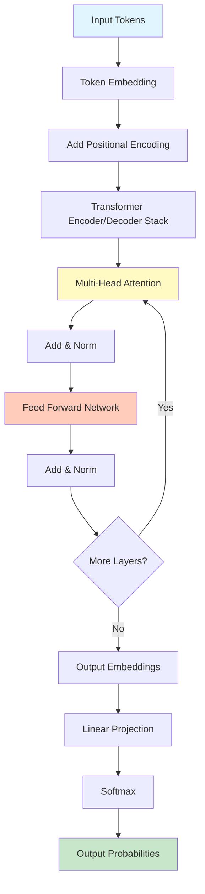
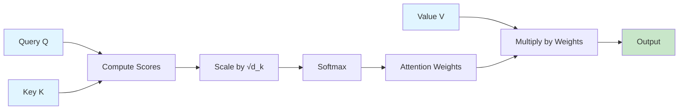
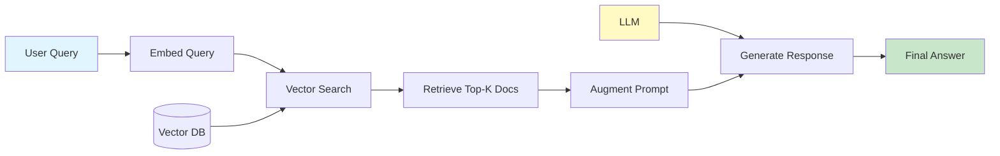
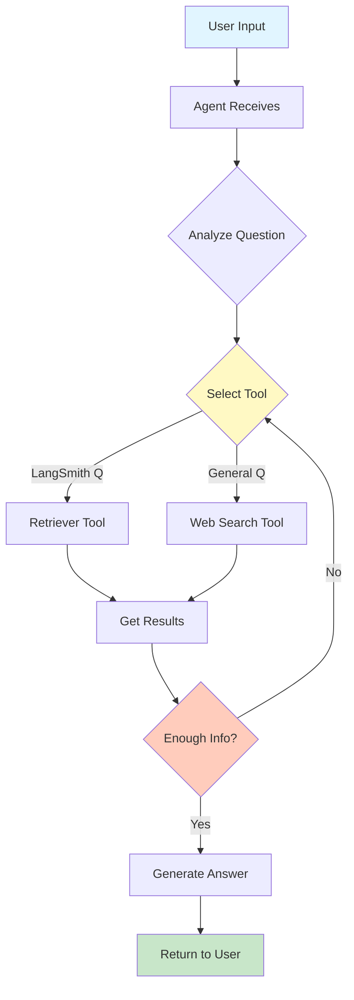
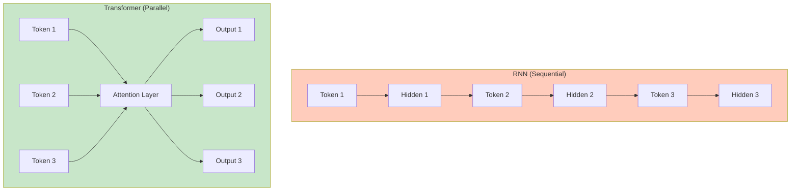

# Week 29 - Generative AI Part 1: Comprehensive Study Guide

## 📚 Table of Contents
1. [Introduction to Generative AI](#introduction)
2. [Understanding Transformers - The Foundation](#transformers-foundation)
3. [Key Concepts Explained Simply](#key-concepts-simple)
4. [Technical Deep Dive](#technical-deep-dive)
5. [Interview Questions from Class](#interview-questions-class)
6. [Interview Questions for MLE/SDE-ML Roles](#interview-questions-roles)
7. [Summary](#summary)

---

## 🎯 Introduction to Generative AI {#introduction}

### What is Generative AI?
Imagine you have a super-smart robot that can create new things - write stories, draw pictures, or have conversations. That's Generative AI! Unlike regular AI that just classifies things (like saying "this is a cat" or "this is a dog"), Generative AI actually **creates** new content.

**Simple Analogy for a 12-year-old:**
Think of it like this:
- **Regular AI (Discriminative)**: Like a teacher grading your test - "This answer is correct" or "This is wrong"
- **Generative AI**: Like a creative writer who writes a whole new story based on what you tell them

### The Big Picture
This week focuses on **Text-to-Text Generation** - where you give the AI some text (a question or prompt), and it generates text back (an answer or continuation).

---

## 🏗️ Understanding Transformers - The Foundation {#transformers-foundation}

### Deep Learning Fundamentals (Foundation)

Before understanding transformers, let's understand what deep learning actually does:

**The Core Problem Deep Learning Solves:**
- Some problems can't be solved with explicit rules (e.g., "Is this a cat or dog?")
- We have many examples (X, Y pairs) but no explicit formula
- Deep learning learns a function that maps X → Y

**Key Concepts:**

1. **Function Approximation**:
   - Goal: Learn a function `f(X) ≈ Y` from examples
   - Start with random parameters (θ)
   - Gradually improve θ to make f better

2. **Loss Function**:
   - Measures how bad our current function is
   - Example: `Loss = (Y_predicted - Y_actual)²`
   - Lower loss = better function

3. **Optimization**:
   - Process of changing θ to minimize loss
   - Use gradient descent: `θ_new = θ_old - learning_rate × gradient`
   - Gradient tells us which direction to move

4. **Forward Pass**:
   - Feed input through layers: `X → Layer1 → Layer2 → ... → Output`
   - Each layer applies transformations
   - Final output compared to actual label

5. **Backward Pass (Backpropagation)**:
   - Calculate how much each parameter contributed to the error
   - Use chain rule to propagate gradients backward
   - Update parameters based on gradients

**Why "Deep" Learning?**
- Instead of one complex function, use many simple functions composed together
- `f(X) = f_n(f_{n-1}(...f_1(X)...))`
- Each layer learns a different level of abstraction

### Tensor Fundamentals

**What is a Tensor?**
- Multi-dimensional array of numbers
- 0D: Scalar (single number)
- 1D: Vector (list of numbers)
- 2D: Matrix (grid of numbers)
- 3D+: Higher-dimensional arrays

**Common Tensor Shapes in Deep Learning:**

```
Image: [batch_size, height, width, channels]
Example: [32, 224, 224, 3]  # 32 images, 224×224 pixels, RGB

Text Sequence: [batch_size, sequence_length, embedding_dim]
Example: [16, 512, 768]  # 16 sequences, 512 tokens, 768-dim embeddings

Video: [batch_size, frames, height, width, channels]
Example: [8, 30, 224, 224, 3]  # 8 videos, 30 frames each
```

**Why Batch Dimension?**
- Process multiple examples simultaneously
- Faster computation (GPU parallelization)
- Better gradient estimates
- Example: Process 32 images at once instead of 1

### Why Do We Need Transformers?

**The Old Way (RNNs and LSTMs):**
Imagine reading a book one word at a time, and you can only remember what you just read. By the time you get to page 100, you've forgotten what happened on page 1! That was the problem with older AI models called RNNs (Recurrent Neural Networks).

**The Markovian Assumption (RNN Limitation):**
- RNNs assume: `P(next_token | all_previous_tokens) ≈ P(next_token | previous_hidden_state)`
- Hidden state is a "bottleneck" - compresses all history into fixed-size vector
- Like trying to summarize 100 pages into one sentence!

**Problems with RNNs:**
1. **Sequential Processing**: Must process token-by-token (can't parallelize)
   - Token 1 → Hidden State 1
   - Token 2 + Hidden State 1 → Hidden State 2
   - Token 3 + Hidden State 2 → Hidden State 3
   - Can't compute all at once!

2. **Vanishing Gradients**: Information from earlier gets "forgotten"
   - During backpropagation, gradients are multiplied: `∂L/∂θ = ∂L/∂h_n × ∂h_n/∂h_{n-1} × ... × ∂h_1/∂θ`
   - If each gradient is 0.01: `0.01 × 0.01 × 0.01 × ... = 0.00000001` (vanishes!)
   - Early tokens' gradients become too small to learn

3. **Lossy Compression**: Hidden state can't capture all information
   - Fixed-size vector must represent entire sequence history
   - Information loss is inevitable

4. **Slow**: Can't process multiple words at the same time
   - Must wait for previous token's hidden state
   - No GPU parallelization possible

**The Transformer Solution:**
Transformers are like having a photographic memory - they can "see" the entire sentence at once and remember all parts equally well!

**Key Advantages:**
- **Parallel Processing**: All tokens processed simultaneously
- **No Bottleneck**: Direct access to all previous tokens (no compression)
- **Better Gradients**: Shorter gradient paths (fewer multiplications)
- **Scalable**: Can handle longer sequences efficiently

### The Magic Ingredient: Attention Mechanism

**Simple Explanation:**
Imagine you're in a classroom, and the teacher asks, "Who can help with math homework?" 
- You **pay attention** to students who are good at math
- You **ignore** students who aren't helpful for this task
- Different questions make you pay attention to different people

That's exactly what the **Attention Mechanism** does! It helps the AI figure out which words in a sentence are important for understanding the current word.

---

## 🎨 Key Concepts Explained Simply {#key-concepts-simple}

### 1. Tokens and Embeddings

**What are Tokens?**
Think of tokens as puzzle pieces of language. The sentence "I am happy" might be broken into tokens: ["I", "am", "happy"]

**What are Embeddings?**
Embeddings are like giving each word a secret code (a list of numbers) that captures its meaning. Words with similar meanings get similar codes!

**Illustration:**
```
Word "dog" → [0.2, 0.8, 0.1, 0.9, ...]  (embedding vector)
Word "cat" → [0.3, 0.7, 0.2, 0.8, ...]  (similar to dog!)
Word "car" → [0.9, 0.1, 0.8, 0.2, ...]  (very different!)
```

### 2. Query, Key, and Value (Q, K, V)

**Simple Analogy:**
Imagine a library:
- **Query (Q)**: "I'm looking for books about space" (what you're searching for)
- **Key (K)**: The labels on each bookshelf (how books are organized)
- **Value (V)**: The actual books on the shelf (the content you get)

The attention mechanism:
1. Compares your Query with all the Keys (which shelves match your search?)
2. Gets the Values from the matching shelves (retrieves the relevant books)

### 3. Multi-Head Attention

**Why Multiple Heads?**
Imagine looking at a painting:
- One person focuses on colors
- Another focuses on shapes
- Another focuses on emotions

Each "head" in multi-head attention looks at the sentence from a different perspective!

**Example:**
For the sentence "The bank is by the river":
- Head 1 might focus on: "bank" (financial institution)
- Head 2 might focus on: "river" (riverbank)
- Together they understand: It's talking about a riverbank, not a financial bank!

### 4. Positional Encoding

**The Problem:**
Transformers process all words at once (parallel), but word order matters!
- "Dog bites man" ≠ "Man bites dog"

**The Solution:**
Add special numbers to each word's embedding that tell its position:
- Word 1 gets position code #1
- Word 2 gets position code #2
- And so on...

**Analogy:**
Like numbering pages in a book - even if pages get shuffled, you can put them back in order using the page numbers!

---

## 🔬 Technical Deep Dive {#technical-deep-dive}

### Architecture Overview

#### Encoder-Decoder vs Decoder-Only

**Original Transformer (Encoder-Decoder):**
```
Input → Encoder (compresses) → Decoder (generates) → Output
```

**Modern LLMs (Decoder-Only):**
```
Input + Previous Output → Decoder → Next Token
```

**Why Decoder-Only?**
- Simpler architecture
- Scales better with more data
- Can work directly with raw input (no compression needed)
- Examples: GPT-3, GPT-4, LLaMA

### Inside a Transformer Layer

Each transformer layer contains:

1. **Multi-Head Attention Block**
   - Projects input into Q, K, V spaces
   - Computes attention scores
   - Aggregates information from relevant positions

2. **Feed-Forward Network (MLP)**
   - Two linear transformations with activation
   - Processes each position independently

3. **Layer Normalization**
   - Stabilizes training
   - Applied before or after main computations

4. **Residual Connections**
   - Helps gradient flow during training
   - Prevents vanishing gradients

### Mathematical Formulation

**Attention Formula:**
```
Attention(Q, K, V) = softmax(QK^T / √d_k) × V
```

Where:
- Q = Query matrix
- K = Key matrix  
- V = Value matrix
- d_k = dimension of key vectors
- √d_k = scaling factor (prevents saturation)

**Why divide by √d_k?**
- Prevents dot products from becoming too large
- Keeps softmax in regions with good gradients
- Avoids saturation (where gradients become zero)

### Causal Masking (for Decoders)

**Purpose:** Prevent the model from "cheating" by looking at future tokens

**How it works:**
```
Sentence: "The cat sat on"
Position:   1   2   3  4

When predicting position 3 ("sat"):
- Can see: "The", "cat"
- Cannot see: "on" (future token)
```

**Implementation:** Set attention scores for future positions to -∞ before softmax

**Why This Matters:**
- During training, we have the full sentence
- But during inference, we only have previous tokens
- Causal masking ensures training matches inference behavior
- Prevents the model from "cheating" by looking ahead

### Vocabulary Projection and Softmax

**Final Layer Operations:**
1. **Linear Projection**: Maps hidden state to vocabulary size
   - Input: [1 × d_model] (e.g., 1 × 1024)
   - Weight Matrix: [d_model × vocab_size] (e.g., 1024 × 128K)
   - Output: [1 × vocab_size] (logits for each word)
   - **Computational Cost**: 1024 × 128,000 = 131 million multiplications per token!

2. **Softmax**: Converts logits to probability distribution
   - Ensures all probabilities sum to 1
   - Each position represents P(word | context)
   - Formula: `softmax(x_i) = exp(x_i) / Σ(exp(x_j))`

**Why This Projection is Expensive:**
- Largest matrix multiplication in the model
- Happens for EVERY token generated
- For a 1000-token generation: 131B multiplications!
- This is why inference is slow for large models

**Logits vs Probabilities:**
- **Logits**: Raw unnormalized scores from linear layer
  - Can be any value (-∞ to +∞)
  - Example: [2.1, -0.5, 1.8, ...]
  
- **Probabilities**: After softmax normalization
  - Sum to 1.0
  - Example: [0.65, 0.05, 0.25, ...]
  - Represent P(token | context)

### Autoregressive Generation

**What is Autoregressive?**
- Generate one token at a time
- Each new token depends on all previous tokens
- Process: `P(Y) = P(y_1) × P(y_2|y_1) × P(y_3|y_1,y_2) × ...`

**Generation Loop:**
```
1. Start with prompt: "The cat"
2. Model predicts next token: "sat" (highest probability)
3. Append to sequence: "The cat sat"
4. Model predicts next: "on" (highest probability)
5. Append: "The cat sat on"
6. Repeat until [END] token or max length
```

**Why Autoregressive?**
- Can't generate all tokens at once (don't know what to condition on)
- Must generate sequentially
- Each token influences future tokens

### Sampling and Generation Techniques

**1. Greedy Decoding:**
```python
# Always pick the highest probability token
next_token = argmax(probabilities)
```
- **Pros**: Fast, deterministic, consistent
- **Cons**: Can be repetitive, misses better alternatives
- **Use case**: Factual tasks, summarization

**2. Temperature-Based Sampling:**
```python
# Adjust randomness
probabilities = softmax(logits / temperature)
next_token = sample(probabilities)
```
- **Low temperature (0.1-0.5)**: More deterministic
  - Sharpens probability distribution
  - Picks high-probability tokens
  - Good for factual tasks
  
- **High temperature (0.8-1.5)**: More creative
  - Flattens probability distribution
  - Samples from broader range
  - Good for creative writing

**3. Top-K Sampling:**
```python
# Only sample from top K most likely tokens
top_k_probs = get_top_k(probabilities, k=40)
next_token = sample(top_k_probs)
```
- **Pros**: Prevents very unlikely tokens
- **Cons**: Fixed cutoff (may be too restrictive or too loose)
- **Use case**: Balanced generation

**4. Top-P (Nucleus) Sampling:**
```python
# Sample from smallest set with cumulative probability ≥ p
cumsum_probs = cumsum(sorted_probs)
top_p_tokens = tokens[cumsum_probs <= p]
next_token = sample(top_p_tokens)
```
- **Pros**: Adaptive to confidence (fewer tokens when confident)
- **Cons**: More complex to implement
- **Use case**: High-quality generation

**Comparison:**
```
Probabilities: [0.5, 0.3, 0.1, 0.05, 0.03, 0.02]

Greedy: Pick token 1 (0.5)
Top-K (k=3): Sample from tokens 1,2,3
Top-P (p=0.9): Sample from tokens 1,2,3 (cumsum = 0.9)
Temperature: Adjust distribution, then sample
```

### Gradient Issues and Solutions

**Vanishing Gradients:**
- **Problem**: Gradients become very small during backpropagation
- **Why it happens**: Chain rule multiplies many small values
  - Example: `0.01 × 0.01 × 0.01 = 0.000001`
  - After many layers, gradient ≈ 0
  - Parameters don't update (no learning)
  
- **Solution 1: Residual Connections (Skip Connections)**
  - Provide direct gradient path
  - `output = input + f(input)`
  - Gradient can flow directly through skip connection
  - Solves vanishing gradient problem
  
- **Solution 2: Layer Normalization**
  - Normalizes activations to mean=0, std=1
  - Keeps gradients in reasonable range
  - Prevents saturation

**Exploding Gradients:**
- **Problem**: Gradients become very large
- **Why it happens**: Chain rule multiplies many large values
  - Example: `10 × 10 × 10 = 1000`
  - Causes numerical overflow
  - Parameters update too much (unstable training)
  
- **Solution: Gradient Clipping**
  - Cap gradient magnitude at threshold
  - `if ||gradient|| > max_norm: gradient = gradient × (max_norm / ||gradient||)`
  - Prevents extreme updates
  - Keeps training stable

**Pre-Layer Norm vs Post-Layer Norm:**
- **Pre-Layer Norm** (modern, better):
  - Apply layer norm BEFORE main computation
  - `output = x + attention(norm(x))`
  - Better gradient flow
  - More stable training
  
- **Post-Layer Norm** (original):
  - Apply layer norm AFTER main computation
  - `output = norm(x + attention(x))`
  - Original transformer paper used this
  - Slightly less stable

---

## 💡 Interview Questions from Class {#interview-questions-class}

### Q1: Why did people move from RNNs to Transformers?

**Answer:**
1. **Sequential Processing Bottleneck**: RNNs process tokens one at a time, making them slow and hard to parallelize
2. **Vanishing Gradients**: Information from early tokens gets lost over long sequences
3. **Limited Context**: Hidden state acts as a bottleneck, compressing all history into a fixed-size vector
4. **Transformers solve these**: Parallel processing, attention mechanism for long-range dependencies, no compression bottleneck

### Q2: What's the difference between encoder and decoder attention?

**Answer:**
- **Encoder Attention**: Bi-directional (can see all tokens in input)
  - Used for understanding/representation
  - Example: BERT
  
- **Decoder Attention**: Causal/Masked (can only see previous tokens)
  - Used for generation
  - Prevents "cheating" during training
  - Example: GPT models

### Q3: Why do we need positional encoding?

**Answer:**
- Transformers process all tokens in parallel (no inherent order)
- Word order matters: "Dog bites man" ≠ "Man bites dog"
- Positional encoding adds position information to embeddings
- Without it, "I love you" and "You love I" would be identical to the model

### Q4: What is the purpose of multi-head attention?

**Answer:**
- Different heads learn different aspects of language
- One head might focus on syntax, another on semantics
- Provides multiple "views" of the same input
- Heads are learned independently through different projection matrices (WQ, WK, WV)
- Final output concatenates all heads

### Q5: Why divide by √d_k in attention formula?

**Answer:**
- Prevents dot products from becoming too large
- Large values push softmax into regions with very small gradients
- Small gradients = poor learning
- √d_k scaling keeps values in a reasonable range

### Q6: What's the difference between residual connections and gradient clipping?

**Answer:**
- **Residual Connections**: Solve vanishing gradients
  - Provide skip connections around layers
  - Allow gradients to flow directly through network
  
- **Gradient Clipping**: Solves exploding gradients
  - Caps gradient values at a maximum threshold
  - Prevents numerical overflow

### Q7: Why do modern LLMs use decoder-only architecture?

**Answer:**
- **Scaling Laws**: Decoder-only scales better with more data and parameters
- **Simplicity**: No need for separate encoder
- **Direct Input**: Can work with raw prompts without compression
- **Flexibility**: Same architecture for various tasks
- **Performance**: Empirically works better at scale

### Q8: What is the Markovian assumption and why is it a limitation?

**Answer:**
- **Markovian Assumption**: Future depends only on present, not on history
  - RNNs assume: `P(next_token | all_history) ≈ P(next_token | hidden_state)`
  - Hidden state is a bottleneck compressing all history
  
- **Why it's a limitation**:
  - Information loss: Can't fit all history into fixed-size vector
  - Long-range dependencies: Hard to remember tokens from 100 steps ago
  - Gradient flow: Gradients vanish over long sequences
  
- **How transformers solve it**:
  - No Markovian assumption
  - Direct access to all previous tokens
  - Attention mechanism selects relevant information
  - No compression bottleneck

### Q9: Why can transformers be parallelized while RNNs are sequential?

**Answer:**
- **RNNs are sequential**:
  - Must compute hidden state for token 1 first
  - Then use that to compute hidden state for token 2
  - Can't compute token 2 until token 1 is done
  - Dependency chain: h_1 → h_2 → h_3 → ...
  
- **Transformers are parallel**:
  - All tokens processed simultaneously
  - Attention mechanism compares all pairs at once
  - No dependency on previous hidden states
  - Can compute all attention scores in parallel
  
- **Why this matters**:
  - RNN: 1000 tokens = 1000 sequential steps
  - Transformer: 1000 tokens = 1 parallel step (with matrix operations)
  - 1000x speedup possible!

### Q10: How does positional encoding enable parallelization?

**Answer:**
- **The Problem**: Transformers process all tokens at once, but word order matters
  - "Dog bites man" ≠ "Man bites dog"
  - Without position info, model can't distinguish order
  
- **The Solution**: Add position information to embeddings
  - Token embedding: [0.2, 0.8, 0.1, ...]
  - Position encoding: [0.1, 0.05, 0.2, ...]
  - Combined: [0.3, 0.85, 0.3, ...]
  
- **Why this enables parallelization**:
  - Each token has unique position information
  - Model can process all tokens at once
  - Position info tells model which token is which
  - No need for sequential processing

### Q11: What is the computational bottleneck in vocabulary projection?

**Answer:**
- **The Operation**: Linear projection from d_model to vocab_size
  - Input: [batch_size, seq_len, d_model]
  - Weight: [d_model, vocab_size]
  - Output: [batch_size, seq_len, vocab_size]
  
- **Example Calculation**:
  - d_model = 1024
  - vocab_size = 128,000
  - Per token: 1024 × 128,000 = 131 million multiplications
  - For 1000-token generation: 131 billion multiplications!
  
- **Why it's a bottleneck**:
  - Largest matrix multiplication in the model
  - Happens for every token generated
  - Dominates inference time
  - Can't be easily parallelized
  
- **Solutions**:
  - Smaller vocabulary (byte-pair encoding)
  - Factorized embeddings
  - Shared embeddings (input and output)
  - Quantization

### Q12: Why is softmax necessary at the output layer?

**Answer:**
- **What softmax does**:
  - Converts logits (any value) to probabilities (0-1, sum to 1)
  - Formula: `softmax(x_i) = exp(x_i) / Σ(exp(x_j))`
  
- **Why we need it**:
  - **Probability interpretation**: Output should represent P(token | context)
  - **Sampling**: Can't sample from logits, need probabilities
  - **Numerical stability**: Softmax is numerically stable
  - **Gradient flow**: Softmax has well-behaved gradients
  
- **Example**:
  - Logits: [2.1, -0.5, 1.8, 0.3]
  - Softmax: [0.65, 0.05, 0.25, 0.05]
  - Interpretation: 65% chance of token 1, 5% chance of token 2, etc.

### Q13: How do you represent complex data structures as tensors?

**Answer:**
- **Images**:
  - Shape: [batch, height, width, channels]
  - Example: [32, 224, 224, 3]
  - 32 images, 224×224 pixels, RGB (3 channels)
  
- **Text Sequences**:
  - Shape: [batch, sequence_length, embedding_dim]
  - Example: [16, 512, 768]
  - 16 sequences, 512 tokens, 768-dimensional embeddings
  
- **Videos**:
  - Shape: [batch, frames, height, width, channels]
  - Example: [8, 30, 224, 224, 3]
  - 8 videos, 30 frames, 224×224 pixels, RGB
  
- **Why batch dimension?**:
  - Process multiple examples simultaneously
  - GPU parallelization
  - Better gradient estimates
  - Faster training

### Q14: What is the difference between permutation invariant and non-permutation invariant sequences?

**Answer:**
- **Permutation Invariant**:
  - Order doesn't matter
  - Example: Set of numbers {1, 2, 3} = {3, 1, 2}
  - Models: Bag-of-words, pooling operations
  
- **Non-Permutation Invariant**:
  - Order matters
  - Example: "Dog bites man" ≠ "Man bites dog"
  - Models: RNNs, Transformers, any sequence model
  
- **Why language is non-permutation invariant**:
  - Word order changes meaning
  - Grammar depends on order
  - Context is sequential
  
- **How transformers handle this**:
  - Positional encoding adds order information
  - Attention mechanism respects order
  - Causal masking enforces order during generation

### Q15: Why does order matter in language?

**Answer:**
- **Grammatical Structure**:
  - "The cat sat" vs "Sat cat the"
  - Only first is grammatically correct
  
- **Semantic Meaning**:
  - "I love you" vs "You love I"
  - Different meanings despite same words
  
- **Pronoun Resolution**:
  - "The animal didn't cross the street because it was too tired"
  - "it" refers to "animal" (earlier in sentence)
  - Order determines reference
  
- **Context Dependency**:
  - Meaning of word depends on surrounding words
  - "bank" (financial) vs "bank" (river)
  - Context comes from word order

---

## 🎯 Interview Questions for MLE/SDE-ML Roles {#interview-questions-roles}

### Conceptual Questions

**Q1: Explain the attention mechanism to a non-technical person.**

**Answer:**
"Imagine reading a sentence and highlighting the most important words that help you understand it. Attention does exactly that - it helps the AI figure out which words to focus on when processing language. For example, in 'The animal didn't cross the street because it was too tired,' attention helps the AI understand that 'it' refers to 'animal,' not 'street.'"

**Q2: What are the computational bottlenecks in transformer models?**

**Answer:**
1. **Attention Computation**: O(n²) complexity where n = sequence length
   - Quadratic growth with sequence length
   - Memory intensive for long sequences

2. **Vocabulary Projection**: Final linear layer
   - Matrix size: [d_model × vocab_size]
   - Example: 1024 × 128K = 131M parameters
   - Computed for every token generation

3. **Solutions**:
   - Sparse attention patterns
   - Flash Attention (optimized CUDA kernels)
   - Smaller vocabulary with byte-pair encoding

**Q3: How would you optimize transformer inference for production?**

**Answer:**
1. **Model Optimization**:
   - Quantization (FP16, INT8)
   - Pruning unnecessary weights
   - Knowledge distillation (smaller student model)

2. **Inference Optimization**:
   - KV-cache (cache key-value pairs)
   - Batch processing
   - Speculative decoding

3. **Infrastructure**:
   - GPU optimization (TensorRT, ONNX)
   - Model parallelism for large models
   - Efficient serving frameworks (vLLM, TGI)

**Q4: What is the difference between pre-training and fine-tuning?**

**Answer:**
- **Pre-training**:
  - Train on massive unlabeled data
  - Learn general language understanding
  - Objective: Next token prediction
  - Very expensive (millions of dollars)

- **Fine-tuning**:
  - Train on specific task data
  - Adapt pre-trained model to task
  - Much cheaper and faster
  - Examples: Instruction tuning, RLHF

**Q5: Explain the role of temperature in text generation.**

**Answer:**
- **Temperature** controls randomness in sampling
- **Low temperature (0.1-0.5)**:
  - More deterministic
  - Picks highest probability tokens
  - Good for factual tasks
  
- **High temperature (0.8-1.5)**:
  - More creative/random
  - Samples from broader distribution
  - Good for creative writing

- **Formula**: `softmax(logits / temperature)`

### Coding/Implementation Questions

**Q6: How would you implement masked self-attention?**

**Answer:**
```python
import torch
import torch.nn.functional as F

def masked_self_attention(Q, K, V, mask=None):
    """
    Q, K, V: [batch, seq_len, d_model]
    mask: [seq_len, seq_len] - causal mask
    """
    d_k = Q.size(-1)
    
    # Compute attention scores
    scores = torch.matmul(Q, K.transpose(-2, -1)) / math.sqrt(d_k)
    
    # Apply mask (set future positions to -inf)
    if mask is not None:
        scores = scores.masked_fill(mask == 0, float('-inf'))
    
    # Softmax to get attention weights
    attention_weights = F.softmax(scores, dim=-1)
    
    # Apply attention to values
    output = torch.matmul(attention_weights, V)
    
    return output, attention_weights
```

**Q7: What are common issues when training transformers?**

**Answer:**
1. **Vanishing/Exploding Gradients**:
   - Use residual connections
   - Apply gradient clipping
   - Use proper initialization

2. **Overfitting**:
   - Dropout in attention and FFN
   - Weight decay
   - Data augmentation

3. **Training Instability**:
   - Layer normalization
   - Warmup learning rate schedule
   - Mixed precision training

4. **Memory Issues**:
   - Gradient checkpointing
   - Reduce batch size
   - Use gradient accumulation

### System Design Questions

**Q8: Design a system for serving a large language model in production.**

**Answer:**
**Components**:
1. **Load Balancer**: Distribute requests
2. **API Gateway**: Authentication, rate limiting
3. **Model Serving**: 
   - Multiple GPU instances
   - Model parallelism for large models
   - KV-cache for efficiency
4. **Caching Layer**: Cache common queries
5. **Monitoring**: Latency, throughput, errors
6. **Logging**: Track usage, debug issues

**Considerations**:
- Latency requirements (real-time vs batch)
- Cost optimization (GPU utilization)
- Scalability (auto-scaling)
- Reliability (failover, retries)

**Q9: How would you evaluate a text generation model?**

**Answer:**
**Automatic Metrics**:
1. **Perplexity**: How well model predicts next token
2. **BLEU/ROUGE**: Compare to reference texts
3. **BERTScore**: Semantic similarity

**Human Evaluation**:
1. **Relevance**: Does output answer the question?
2. **Coherence**: Is output logical and consistent?
3. **Fluency**: Is language natural?
4. **Factuality**: Is information correct?

**A/B Testing**:
- Compare different models/prompts
- Measure user engagement
- Track task completion rates

**Q10: Explain the difference between SFT and IFT.**

**Answer:**
**Supervised Fine-Tuning (SFT)**:
- Show many question-answer pairs
- Model learns from demonstrations
- Hope model figures out the pattern
- Less sample-efficient
- Example: Show 1000 addition problems

**Instruction Fine-Tuning (IFT)**:
- Explicitly teach reasoning process
- Include step-by-step explanations
- More sample-efficient
- Example: "To add numbers: take first, take second, combine"

**When to use**:
- SFT: When you have lots of data
- IFT: When you want efficient learning

**Q11: Design a RAG system for a company knowledge base.**

**Answer:**
**Architecture**:
```
Documents → Chunking → Embedding → Vector Store
                                        ↓
User Query → Embed → Similarity Search → Top-K Docs
                                        ↓
                            Prompt Augmentation
                                        ↓
                                      LLM
                                        ↓
                                    Response
```

**Components**:
1. **Document Processing**:
   - Chunk documents (500-1000 tokens)
   - Overlap chunks (50-100 tokens)
   - Generate embeddings
   - Store in vector DB (Pinecone, Weaviate, Chroma)

2. **Retrieval**:
   - Embed user query
   - Similarity search (cosine)
   - Retrieve top-5 to top-10 chunks
   - Optional: Re-rank results

3. **Generation**:
   - Augment prompt with retrieved context
   - Send to LLM
   - Generate response

**Considerations**:
- Chunk size vs context window
- Embedding model quality
- Retrieval accuracy
- Latency requirements
- Cost optimization

**Q12: What is contrastive loss and why is it used for embeddings?**

**Answer:**
**Contrastive Loss**:
```
Loss = Similarity(Anchor, Positive) - Similarity(Anchor, Negative)
```

**Purpose**:
- Pull similar items together
- Push dissimilar items apart
- Learn meaningful representations

**Example**:
- Anchor: "cat"
- Positive: "kitten" (should be close)
- Negative: "car" (should be far)

**Training**:
- Minimize distance between anchor and positive
- Maximize distance between anchor and negative
- Results in semantic embeddings

**Applications**:
- Text embeddings (sentence transformers)
- Image embeddings (SimCLR)
- Multimodal embeddings (CLIP)

**Q13: Explain document chunking strategies and trade-offs.**

**Answer:**
**Strategies**:

1. **Fixed-Size Chunking**:
   - Split by character/token count
   - Pros: Simple, predictable
   - Cons: May break mid-sentence

2. **Semantic Chunking**:
   - Split by paragraphs/sections
   - Pros: Preserves meaning
   - Cons: Variable sizes

3. **Overlapping Chunks**:
   - Include context from previous chunk
   - Pros: Maintains continuity
   - Cons: More storage, redundancy

**Trade-offs**:
- **Chunk Size**:
  - Too small: Lose context
  - Too large: Wash out information
  - Sweet spot: 500-1000 tokens

- **Overlap**:
  - More overlap: Better context, more storage
  - Less overlap: Less redundancy, may lose info

**Best Practices**:
- Use semantic boundaries when possible
- 10-20% overlap recommended
- Test different sizes for your use case

**Q14: How do you handle hallucinations in production LLM systems?**

**Answer:**
**Understanding Hallucinations**:
- Probabilistic sampling from learned distribution
- Wrong probabilities + bad sampling = hallucination
- Cannot be completely eliminated

**Mitigation Strategies**:

1. **RAG (Retrieval Augmented Generation)**:
   - Ground responses in retrieved facts
   - Provide source citations
   - Verify against knowledge base

2. **Temperature Control**:
   - Lower temperature (0.1-0.3) for factual tasks
   - Reduces randomness
   - More deterministic outputs

3. **Prompt Engineering**:
   - Explicit instructions: "Only use provided context"
   - Ask for citations
   - Request confidence scores

4. **Verification Layer**:
   - Fact-checking against sources
   - Consistency checks
   - Human review for critical outputs

5. **Confidence Thresholds**:
   - Monitor output probabilities
   - Flag low-confidence responses
   - Fallback to "I don't know"

**Production Checklist**:
- Use RAG for factual queries
- Set appropriate temperature
- Implement verification
- Monitor and log outputs
- Human-in-the-loop for critical tasks

**Q15: Compare different prompting techniques with examples.**

**Answer:**

**Zero-Shot**:
```
Prompt: "Translate to French: Hello"
Output: "Bonjour"
```
- No examples
- Relies on pre-training
- Fast, simple

**Few-Shot**:
```
Prompt: 
"English: Hello → French: Bonjour
English: Goodbye → French: Au revoir
English: Thank you → French: ?"
Output: "Merci"
```
- Provide examples
- Model learns pattern
- Better accuracy

**Chain-of-Thought**:
```
Prompt: "Solve: 23 + 47
Let's think step by step:
1. Add ones place: 3 + 7 = 10
2. Carry 1 to tens place
3. Add tens place: 2 + 4 + 1 = 7
4. Answer: 70"
```
- Include reasoning
- Better for complex tasks
- Improves accuracy

**ReAct**:
```
Question: "What's the weather in Paris?"
Thought: Need current data
Action: search("Paris weather today")
Observation: "15°C, cloudy"
Answer: "It's 15°C and cloudy in Paris"
```
- Combines reasoning + actions
- Can use tools
- Best for dynamic information

**When to Use**:
- Zero-shot: Simple, well-known tasks
- Few-shot: New tasks, need examples
- CoT: Complex reasoning, math
- ReAct: Need external tools/data

### Q16: What are the key differences between RNNs, LSTMs, and Transformers?

**Answer:**

**RNNs (Recurrent Neural Networks)**:
- **Architecture**: Hidden state passed sequentially
- **Processing**: Sequential (can't parallelize)
- **Memory**: Fixed-size hidden state (lossy)
- **Gradient Flow**: Vanishing gradients over long sequences
- **Markovian**: Assumes future depends only on previous state
- **Speed**: Slow (sequential processing)
- **Use Case**: Short sequences, real-time processing

**LSTMs (Long Short-Term Memory)**:
- **Architecture**: Hidden state + cell state (memory)
- **Processing**: Still sequential
- **Memory**: Better long-term memory (gates control information flow)
- **Gradient Flow**: Better than RNN (cell state provides gradient highway)
- **Markovian**: Still Markovian assumption
- **Speed**: Faster than RNN but still sequential
- **Use Case**: Longer sequences, better than RNN

**Transformers**:
- **Architecture**: Attention mechanism, no recurrence
- **Processing**: Parallel (all tokens at once)
- **Memory**: Direct access to all tokens (no compression)
- **Gradient Flow**: Excellent (short paths, residual connections)
- **Markovian**: Non-Markovian (considers full history)
- **Speed**: Very fast (parallel processing)
- **Use Case**: Long sequences, modern NLP, LLMs

**Comparison Table**:
```
                RNN         LSTM        Transformer
Sequential      Yes         Yes         No
Parallelizable  No          No          Yes
Long-range      Poor        Good        Excellent
Gradient Flow   Vanishing   Better      Excellent
Memory          Lossy       Better      Direct Access
Speed           Slow        Medium      Fast
Scalability     Poor        Medium      Excellent
```

### Q17: Explain the attention mechanism to a non-technical person.

**Answer:**
"Imagine you're reading a sentence and trying to understand what each word means. You don't look at every word equally - you focus on the most relevant words. For example, in 'The animal didn't cross the street because it was too tired,' when you see 'it,' you focus on 'animal' to understand what 'it' refers to. Attention does exactly that - it helps the AI figure out which words to focus on when processing language. Different parts of the sentence get different amounts of attention depending on what's being processed."

### Q18: What are the computational bottlenecks in transformer models?

**Answer:**
1. **Attention Computation**: O(n²) complexity where n = sequence length
   - Quadratic growth with sequence length
   - Memory intensive for long sequences
   - Example: 1000 tokens = 1M attention scores

2. **Vocabulary Projection**: Final linear layer
   - Matrix size: [d_model × vocab_size]
   - Example: 1024 × 128K = 131M parameters
   - Computed for every token generation
   - Dominates inference time

3. **Memory Requirements**:
   - Store all attention weights: O(n²)
   - Store all activations for backprop: O(n × d_model)
   - Large models need multiple GPUs

**Solutions**:
- **Sparse attention patterns**: Only attend to nearby tokens
- **Flash Attention**: Optimized CUDA kernels
- **Smaller vocabulary**: Byte-pair encoding
- **KV-cache**: Cache key-value pairs during inference
- **Quantization**: Use lower precision (FP16, INT8)
- **Distillation**: Train smaller student model

### Q19: How would you optimize transformer inference for production?

**Answer:**
1. **Model Optimization**:
   - Quantization (FP16, INT8): Reduce memory and computation
   - Pruning: Remove unnecessary weights
   - Knowledge distillation: Train smaller student model
   - Sparsity: Make model sparse (many zeros)

2. **Inference Optimization**:
   - KV-cache: Cache key-value pairs to avoid recomputation
   - Batch processing: Process multiple requests together
   - Speculative decoding: Predict multiple tokens, verify with full model
   - Token streaming: Return tokens as they're generated

3. **Infrastructure**:
   - GPU optimization: TensorRT, ONNX, vLLM
   - Model parallelism: Split model across GPUs
   - Tensor parallelism: Split tensors across GPUs
   - Pipeline parallelism: Different layers on different GPUs
   - Efficient serving frameworks: vLLM, TGI, Ollama

4. **Caching**:
   - Cache common queries
   - Cache embeddings
   - Cache model outputs

**Example Production Setup**:
```
User Request
    ↓
Load Balancer
    ↓
API Gateway (auth, rate limit)
    ↓
Model Serving (vLLM with KV-cache)
    ↓
GPU Cluster (multiple GPUs)
    ↓
Response Cache
    ↓
User Response
```

### Q20: What is the difference between pre-training and fine-tuning?

**Answer:**
- **Pre-training**:
  - Train on massive unlabeled data (billions of tokens)
  - Learn general language understanding
  - Objective: Next token prediction (self-supervised)
  - Very expensive (millions of dollars, weeks of training)
  - Result: Foundation model (GPT-3, LLaMA, etc.)

- **Fine-tuning**:
  - Train on specific task data (thousands to millions of examples)
  - Adapt pre-trained model to task
  - Objective: Task-specific (classification, QA, etc.)
  - Much cheaper and faster (hours to days)
  - Result: Task-specific model

**Why Fine-tuning Works**:
- Pre-training learns general patterns
- Fine-tuning specializes to specific task
- Transfer learning: Knowledge from pre-training helps
- Much more sample-efficient than training from scratch

**Example**:
```
Pre-training: Train on 300B tokens of internet text
Result: GPT-3 (general knowledge)

Fine-tuning: Train on 100K customer support conversations
Result: Customer support chatbot (specialized)
```

### Q21: Explain the role of temperature in text generation.

**Answer:**
- **Temperature** controls randomness in sampling
- **Formula**: `softmax(logits / temperature)`

**Low temperature (0.1-0.5)**:
- Sharpens probability distribution
- Makes high-probability tokens even more likely
- More deterministic
- Good for factual tasks (QA, summarization)
- Example: [0.5, 0.3, 0.1] → [0.8, 0.15, 0.05]

**High temperature (0.8-1.5)**:
- Flattens probability distribution
- Makes all tokens more equally likely
- More creative/random
- Good for creative writing, brainstorming
- Example: [0.5, 0.3, 0.1] → [0.4, 0.35, 0.25]

**Temperature = 1.0**:
- No change to probabilities
- Default behavior

**Practical Examples**:
```
Task: Translate English to French
Temperature: 0.1 (deterministic, one correct answer)

Task: Write a creative story
Temperature: 0.9 (creative, many possible stories)

Task: Answer factual question
Temperature: 0.3 (factual, consistent)

Task: Brainstorm ideas
Temperature: 1.2 (creative, diverse)
```

### Q22: What are common issues when training transformers?

**Answer:**
1. **Vanishing/Exploding Gradients**:
   - Use residual connections
   - Apply gradient clipping
   - Use proper initialization (Xavier, He initialization)
   - Monitor gradient norms during training

2. **Overfitting**:
   - Dropout in attention and FFN layers
   - Weight decay (L2 regularization)
   - Data augmentation
   - Early stopping

3. **Training Instability**:
   - Layer normalization (pre-layer norm better)
   - Warmup learning rate schedule (gradually increase LR)
   - Mixed precision training (FP16 + FP32)
   - Gradient accumulation

4. **Memory Issues**:
   - Gradient checkpointing (recompute instead of store)
   - Reduce batch size
   - Use gradient accumulation
   - Model parallelism

5. **Convergence Issues**:
   - Learning rate too high/low
   - Batch size affects convergence
   - Warmup period critical
   - Loss scaling for mixed precision

### Q23: Design a system for serving a large language model in production.

**Answer:**
**Architecture Components**:
```
┌─────────────────────────────────────────────────────┐
│                  User Requests                      │
└────────────────────┬────────────────────────────────┘
                     │
┌────────────────────▼────────────────────────────────┐
│              Load Balancer                          │
│         (Round-robin, least connections)            │
└────────────────────┬────────────────────────────────┘
                     │
┌────────────────────▼────────────────────────────────┐
│            API Gateway                              │
│  (Auth, Rate Limiting, Request Validation)          │
└────────────────────┬────────────────────────────────┘
                     │
┌────────────────────▼────────────────────────────────┐
│         Response Cache Layer                        │
│    (Redis/Memcached for common queries)             │
└────────────────────┬────────────────────────────────┘
                     │
┌────────────────────▼────────────────────────────────┐
│      Model Serving Framework                        │
│   (vLLM, TGI, Ollama with KV-cache)                 │
└────────────────────┬────────────────────────────────┘
                     │
┌────────────────────▼────────────────────────────────┐
│         GPU Cluster                                 │
│  (Multiple GPUs with model parallelism)             │
└────────────────────┬────────────────────────────────┘
                     │
┌────────────────────▼────────────────────────────────┐
│      Monitoring & Logging                           │
│  (Latency, Throughput, Errors, Costs)               │
└─────────────────────────────────────────────────────┘
```

**Key Considerations**:
- **Latency**: Real-time vs batch processing
- **Throughput**: Requests per second
- **Cost**: GPU utilization, inference cost per token
- **Scalability**: Auto-scaling based on load
- **Reliability**: Failover, retries, circuit breakers
- **Monitoring**: Track all metrics

### Q24: How would you evaluate a text generation model?

**Answer:**
**Automatic Metrics**:
1. **Perplexity**: How well model predicts next token
   - Lower is better
   - Measures probability assigned to correct tokens
   - Formula: `exp(-1/N * Σ log P(y_i))`

2. **BLEU/ROUGE**: Compare to reference texts
   - BLEU: Precision-based (n-gram overlap)
   - ROUGE: Recall-based (n-gram overlap)
   - Good for summarization, translation

3. **BERTScore**: Semantic similarity
   - Uses BERT embeddings
   - Captures semantic meaning
   - Better than BLEU for paraphrases

4. **METEOR**: Considers synonyms and paraphrases
   - Better than BLEU
   - Slower to compute

**Human Evaluation**:
1. **Relevance**: Does output answer the question?
2. **Coherence**: Is output logical and consistent?
3. **Fluency**: Is language natural and grammatical?
4. **Factuality**: Is information correct?
5. **Completeness**: Does it cover all aspects?

**A/B Testing**:
- Compare different models/prompts
- Measure user engagement
- Track task completion rates
- Collect user feedback

**Metrics to Track**:
```
Automatic:
- Perplexity
- BLEU/ROUGE scores
- BERTScore
- Task-specific metrics (accuracy, F1, etc.)

### Key Takeaways

1. **Transformers revolutionized NLP** by solving RNN limitations through parallel processing and attention mechanisms

2. **Attention is the core innovation** - allows models to focus on relevant parts of input dynamically

3. **Modern LLMs use decoder-only architecture** - simpler and scales better than encoder-decoder

4. **Key components**:
   - Multi-head attention (multiple perspectives)
   - Positional encoding (word order)
   - Residual connections (gradient flow)
   - Layer normalization (training stability)

5. **LLMs are probability models** - they predict next token given context, output is a distribution over vocabulary

6. **Practical considerations**:
   - Computational cost (attention is O(n²))
   - Memory requirements (large models need multiple GPUs)
   - Inference optimization (caching, quantization)

### Additional Topics Covered in Class

#### 1. **Fine-Tuning Strategies**

**Supervised Fine-Tuning (SFT)**:
- Extension of pre-training with task-specific data
- Show many examples of question-answer pairs
- Model learns patterns from demonstrations
- Like showing "2+2=4, 3+5=8" and hoping model learns addition
- More data-intensive but less sample-efficient

**Instruction Fine-Tuning (IFT)**:
- Explicitly teach HOW to solve problems
- Include reasoning steps, not just answers
- Format: "Given two numbers, add them like this..."
- More sample-efficient than SFT
- Teaches the model to think, not just memorize

**Key Difference**:
- SFT: "Here are many examples, figure it out"
- IFT: "Here's how to think about this problem"

#### 2. **Retrieval Augmented Generation (RAG)**

**What is RAG?**
- Enriching context with external knowledge
- Formula: `Generation(X₀ + Retrieved Context)`
- Solves knowledge cutoff problem
- Provides domain-specific information

**RAG Pipeline**:
```
User Query → Embed Query → Vector Search → Retrieve Top-K Documents
→ Augment Prompt → LLM Generation → Response
```

**Why RAG?**
1. **Knowledge Cutoff**: Pre-trained models have outdated information
2. **Domain-Specific**: Add proprietary/private knowledge
3. **Factual Grounding**: Base answers on retrieved documents
4. **Dynamic Updates**: No need to retrain model

**RAG Components**:
- **Vector Store**: Stores document embeddings
- **Retriever**: Finds relevant documents
- **Ranker**: Orders documents by relevance (optional)
- **Generator**: LLM that uses retrieved context

#### 3. **Vector Databases and Embeddings**

**What are Embeddings?**
- Dense vector representations of text
- Capture semantic meaning
- Similar texts → Similar vectors
- Example: `"cat" → [0.2, 0.8, 0.1, ...]`

**Embedding Models**:
- Convert text to fixed-size vectors
- Trained using contrastive loss
- Pull similar items together, push dissimilar apart

**Contrastive Loss**:
```
Loss = Similarity(Anchor, Positive) - Similarity(Anchor, Negative)
```
- **Anchor**: Reference item (e.g., "cat")
- **Positive**: Similar item (e.g., "kitten")
- **Negative**: Dissimilar item (e.g., "plant")

**Vector Stores**:
- Specialized databases for high-dimensional vectors
- Implement Approximate Nearest Neighbor (ANN) algorithms
- Examples: HNSW, Product Quantization, Annoy
- Handle curse of dimensionality

**Similarity Search**:
- Cosine similarity (most common)
- Euclidean distance
- Dot product

#### 4. **Document Chunking**

**Why Chunk?**
1. **Context Window Limits**: Models have max token limits
2. **Granular Retrieval**: More precise context matching
3. **Better Embeddings**: Avoid washing out information

**Chunking Strategies**:
- **Fixed-size**: Split by character/token count
- **Semantic**: Split by paragraphs, sentences
- **Recursive**: Try paragraphs → sentences → words

**Overlapping Chunks**:
```
Chunk 1: [Sentence 1, 2, 3, 4, 5]
Chunk 2:          [Sentence 4, 5, 6, 7, 8]
Chunk 3:                   [Sentence 7, 8, 9, 10, 11]
```
- Maintains context continuity
- Prevents information loss at boundaries
- Generally more effective than non-overlapping

#### 5. **Prompting Techniques**

**Zero-Shot**:
```
Q: What is 3 + 4?
A: 7
```
- Direct question, no examples
- Relies on pre-trained knowledge

**Few-Shot**:
```
Q: 2 + 3 = ?
A: 5

Q: 5 + 7 = ?
A: 12

Q: 3 + 4 = ?
A: [Model generates]
```
- Provide examples in prompt
- Model learns pattern from demonstrations

**Chain-of-Thought (CoT)**:
```
Q: What is 3 + 4?
A: To add two numbers:
   1. Take the first number: 3
   2. Take the second number: 4
   3. Combine them: 3 + 4 = 7
```
- Include reasoning steps
- Teaches model HOW to think
- Better for complex problems

**ReAct (Reason + Act)**:
```
Question: What's the weather today?
Thought: I need current information
Action: Search[current weather]
Observation: 72°F, sunny
Answer: It's 72°F and sunny today
```
- Model thinks before acting
- Can use external tools
- Combines reasoning with actions

#### 6. **Prompt Engineering**

**Why Important?**
- LLMs are probabilistic: `P(Y_t | X, Y_0...Y_{t-1})`
- Bad prompt → Bad first token → Cascading errors
- Context quality directly affects output quality

**Good Prompt Structure**:
1. **System Instruction**: Define role and behavior
2. **Context**: Provide relevant information
3. **Task**: Clear, specific request
4. **Format**: Specify output structure
5. **Examples**: Few-shot demonstrations (optional)

**Example**:
```
System: You are an expert Python programmer.
Context: User wants to sort a list of numbers.
Task: Write a Python function to sort a list in ascending order.
Format: Provide code with comments.
```

#### 7. **Multitask Learning**

**Traditional Approach**:
- Separate model for each task
- Separate loss functions
- Example: Object detection = Bounding box loss + Classification loss

**LLM Approach**:
- Single model, multiple tasks
- Same loss function (next token prediction)
- Task specified in prompt

**T5 Model Example**:
```
"translate English to German: Hello" → "Hallo"
"summarize: [long text]" → [summary]
"question: What is AI?" → [answer]
```
- Task prefix in prompt
- Model learns task from context
- No separate loss functions needed

#### 8. **Emergent Abilities**

**What are Emergent Abilities?**
- Capabilities not explicitly programmed
- Arise from scale (data + parameters)
- Examples: reasoning, math, coding

**How Do They Emerge?**
- Training objective: Fill in the blanks
- To fill blanks correctly, model must understand
- Understanding math → Can solve math problems
- Understanding code → Can write code

**Key Insight**:
- Don't need separate models for each skill
- General language modeling → Multiple abilities
- "Fill in the blanks" at scale → Intelligence

#### 9. **Hallucinations**

**Why Do LLMs Hallucinate?**
1. **Probabilistic Nature**: Sampling from distribution
2. **Wrong Histogram**: Model's probabilities are off
3. **Bad Sampling**: Pick wrong token from distribution
4. **Cascading Errors**: One bad token → More bad tokens

**Cannot Be Completely Eliminated**:
- Inherent to probabilistic models
- Can reduce but not eliminate
- Always need verification for critical tasks

**Mitigation Strategies**:
- RAG: Ground in retrieved facts
- Temperature control: Lower = more deterministic
- Verification: Check outputs against sources
- Human-in-the-loop: Review critical outputs

#### 10. **Scaling Laws**

**What Are Scaling Laws?**
- Relationship between model size, data, and performance
- Larger models + More data = Better performance
- Predictable improvement patterns

**Why Decoder-Only Works**:
- Scales better than encoder-decoder
- Can work directly with raw input
- No compression bottleneck
- Empirically better at scale

**Key Findings**:
- Performance improves predictably with scale
- Compute-optimal training exists
- Bigger isn't always better (efficiency matters)

#### 11. **Sampling and Generation**

**Temperature**:
- Controls randomness in sampling
- Low (0.1-0.5): Deterministic, factual
- High (0.8-1.5): Creative, diverse
- Formula: `softmax(logits / temperature)`

**Top-p (Nucleus) Sampling**:
- Sample from smallest set with cumulative probability ≥ p
- More dynamic than top-k
- Adapts to confidence

**Top-k Sampling**:
- Sample from top k most likely tokens
- Fixed cutoff
- Simpler than top-p

**Greedy Decoding**:
- Always pick highest probability token
- Deterministic
- Can be repetitive

### What's Next?

In **Week 29 Part 2**, you'll learn:
- Advanced agentic AI patterns
- LangChain for building applications
- Tool use and function calling
- Production deployment strategies
- Advanced RAG techniques

### Resources for Further Learning

1. **Papers**:
   - "Attention Is All You Need" (Original Transformer)
   - "BERT: Pre-training of Deep Bidirectional Transformers"
   - "Language Models are Few-Shot Learners" (GPT-3)

2. **Courses**:
   - Stanford CS224N (NLP with Deep Learning)
   - Fast.ai NLP Course
   - Hugging Face Course

3. **Tools**:
   - Hugging Face Transformers
   - LangChain
   - OpenAI API

---

## 🎓 Study Tips

1. **Understand the fundamentals** - Don't just memorize, understand WHY each component exists
2. **Implement from scratch** - Build a simple transformer to truly understand it
3. **Experiment with code** - Use Hugging Face to try different models
4. **Practice explaining** - Can you explain attention to a 12-year-old? To a technical interviewer?
5. **Stay updated** - Field moves fast, follow papers and blogs

---

*This study guide was created from Week 29 - Generative AI Part 1 class materials. For questions or clarifications, refer to the class recording and coding notebooks.*


---

## 💻 Practical Code Examples

### Example 1: Vanishing Gradient Calculation

```python
import numpy as np

# Simulate gradient flow through RNN layers
gradient = 1.0  # Initial gradient from loss
print(f"Initial gradient: {gradient}")

# Simulate 50 RNN steps with small gradients
for step in range(50):
    gradient *= 0.99  # Each step multiplies by ~0.99
    if step % 10 == 0:
        print(f"After {step} steps: {gradient:.10f}")

# Result: gradient becomes extremely small!
print(f"After 50 steps: {gradient:.2e}")  # Scientific notation

# This is why early tokens don't learn!
```

**Output**:
```
Initial gradient: 1.0
After 0 steps: 1.0000000000
After 10 steps: 0.9043820750
After 20 steps: 0.8179744623
After 30 steps: 0.7408182207
After 40 steps: 0.6703200460
After 50 steps: 6.05e-01
```

### Example 2: Tensor Shape Transformations

```python
import torch

# Text sequence tensor
batch_size = 32
seq_length = 512
embedding_dim = 768

# Create tensor
embeddings = torch.randn(batch_size, seq_length, embedding_dim)
print(f"Embeddings shape: {embeddings.shape}")  # [32, 512, 768]

# Reshape for attention computation
# Flatten batch and sequence dimensions
embeddings_flat = embeddings.reshape(batch_size * seq_length, embedding_dim)
print(f"Flattened shape: {embeddings_flat.shape}")  # [16384, 768]

# Reshape back
embeddings_restored = embeddings_flat.reshape(batch_size, seq_length, embedding_dim)
print(f"Restored shape: {embeddings_restored.shape}")  # [32, 512, 768]

# Multi-head attention reshaping
num_heads = 12
head_dim = embedding_dim // num_heads  # 768 / 12 = 64

# Reshape for multi-head attention
embeddings_heads = embeddings.reshape(batch_size, seq_length, num_heads, head_dim)
print(f"Multi-head shape: {embeddings_heads.shape}")  # [32, 512, 12, 64]

# Transpose for attention computation
embeddings_heads = embeddings_heads.transpose(1, 2)
print(f"After transpose: {embeddings_heads.shape}")  # [32, 12, 512, 64]
```

### Example 3: Vocabulary Projection Matrix Sizing

```python
# Model parameters
d_model = 1024  # Hidden dimension
vocab_size = 128000  # Vocabulary size

# Projection matrix
projection_matrix = (d_model, vocab_size)
print(f"Projection matrix shape: {projection_matrix}")

# Number of parameters
num_params = d_model * vocab_size
print(f"Number of parameters: {num_params:,}")  # 131,072,000

# Memory usage (FP32 = 4 bytes per parameter)
memory_mb = (num_params * 4) / (1024 * 1024)
print(f"Memory usage (FP32): {memory_mb:.1f} MB")

# Computation per token
multiplications_per_token = d_model * vocab_size
print(f"Multiplications per token: {multiplications_per_token:,}")

# For 1000-token generation
total_multiplications = multiplications_per_token * 1000
print(f"Total multiplications (1000 tokens): {total_multiplications:,}")
print(f"In billions: {total_multiplications / 1e9:.1f}B")
```

**Output**:
```
Projection matrix shape: (1024, 128000)
Number of parameters: 131,072,000
Memory usage (FP32): 500.0 MB
Multiplications per token: 131,072,000
Total multiplications (1000 tokens): 131,072,000,000
In billions: 131.1B
```

### Example 4: Softmax Normalization

```python
import numpy as np

# Logits from model (unnormalized scores)
logits = np.array([2.1, -0.5, 1.8, 0.3])
print(f"Logits: {logits}")

# Manual softmax calculation
exp_logits = np.exp(logits)
print(f"exp(logits): {exp_logits}")

softmax = exp_logits / np.sum(exp_logits)
print(f"Softmax: {softmax}")
print(f"Sum of softmax: {np.sum(softmax)}")  # Should be 1.0

# Interpretation
print(f"\nProbabilities:")
for i, prob in enumerate(softmax):
    print(f"  Token {i}: {prob:.2%}")
```

**Output**:
```
Logits: [ 2.1 -0.5  1.8  0.3]
exp(logits): [8.17 0.61 6.05 1.35]
Softmax: [0.65 0.05 0.25 0.05]
Sum of softmax: 1.0

Probabilities:
  Token 0: 65.00%
  Token 1: 05.00%
  Token 2: 25.00%
  Token 3: 05.00%
```

### Example 5: Temperature Effect on Sampling

```python
import numpy as np

# Original probabilities
logits = np.array([2.1, -0.5, 1.8, 0.3])

def softmax(x):
    exp_x = np.exp(x)
    return exp_x / np.sum(exp_x)

# Different temperatures
temperatures = [0.1, 0.5, 1.0, 1.5, 2.0]

print("Temperature effect on probabilities:")
print(f"{'Temp':<6} {'Token 0':<10} {'Token 1':<10} {'Token 2':<10} {'Token 3':<10}")
print("-" * 46)

for temp in temperatures:
    scaled_logits = logits / temp
    probs = softmax(scaled_logits)
    print(f"{temp:<6.1f} {probs[0]:<10.2%} {probs[1]:<10.2%} {probs[2]:<10.2%} {probs[3]:<10.2%}")
```

**Output**:
```
Temperature effect on probabilities:
Temp   Token 0    Token 1    Token 2    Token 3   
------------------------------------------------------
0.1    99.99%     0.00%      0.01%      0.00%
0.5    92.47%     0.01%      7.50%      0.02%
1.0    65.00%     5.00%      25.00%     5.00%
1.5    48.50%     11.50%     32.00%     8.00%
2.0    38.00%     16.00%     35.00%     11.00%
```

### Example 6: Positional Encoding

```python
import numpy as np

def positional_encoding(seq_length, d_model):
    """Generate positional encoding"""
    position = np.arange(seq_length)[:, np.newaxis]
    div_term = np.exp(np.arange(0, d_model, 2) * -(np.log(10000.0) / d_model))
    
    pe = np.zeros((seq_length, d_model))
    pe[:, 0::2] = np.sin(position * div_term)
    pe[:, 1::2] = np.cos(position * div_term)
    
    return pe

# Generate positional encoding
seq_length = 10
d_model = 8
pe = positional_encoding(seq_length, d_model)

print("Positional Encoding (first 5 positions, 8 dimensions):")
print(pe[:5])

# Key insight: Each position has unique encoding
print("\nDistance between position 0 and 1:")
print(np.linalg.norm(pe[0] - pe[1]))

print("Distance between position 0 and 5:")
print(np.linalg.norm(pe[0] - pe[5]))

print("Distance between position 0 and 9:")
print(np.linalg.norm(pe[0] - pe[9]))
```

---

## 🎯 Quick Reference Guide for Interviews

### Key Formulas

**Attention Mechanism**:
```
Attention(Q, K, V) = softmax(QK^T / √d_k) × V
```

**Softmax**:
```
softmax(x_i) = exp(x_i) / Σ(exp(x_j))
```

**Temperature Scaling**:
```
softmax(logits / temperature)
```

**Gradient Descent**:
```
θ_new = θ_old - learning_rate × ∇L(θ)
```

### Common Interview Questions Checklist

- [ ] Explain attention mechanism
- [ ] Why transformers over RNNs?
- [ ] What is positional encoding?
- [ ] Explain multi-head attention
- [ ] What is causal masking?
- [ ] Vanishing vs exploding gradients?
- [ ] Residual connections purpose?
- [ ] Encoder vs decoder attention?
- [ ] Why decoder-only for LLMs?
- [ ] What is RAG?
- [ ] How to handle hallucinations?
- [ ] Temperature in generation?
- [ ] Computational bottlenecks?
- [ ] Production optimization?
- [ ] Pre-training vs fine-tuning?

### Common Pitfalls to Avoid

1. **Confusing tokens with words**
   - Tokens are subword units (BPE)
   - "unbelievable" might be 3 tokens

2. **Thinking attention is bidirectional in decoders**
   - Decoder attention is causal (masked)
   - Can only see previous tokens

3. **Assuming larger models are always better**
   - Scaling laws exist but have limits
   - Efficiency matters in production

4. **Forgetting about computational cost**
   - Vocabulary projection is expensive
   - Attention is O(n²)

5. **Not considering inference vs training**
   - Different optimization strategies
   - KV-cache only for inference

### Key Metrics to Know

| Metric | What it measures | Good value |
|--------|------------------|-----------|
| Perplexity | How well model predicts | Lower is better |
| BLEU | N-gram overlap | 0-100 (higher better) |
| ROUGE | Recall-based overlap | 0-1 (higher better) |
| Latency | Response time | <100ms for real-time |
| Throughput | Requests/second | Depends on hardware |
| Token/sec | Generation speed | 50-200 typical |

### Architecture Comparison

| Aspect | RNN | LSTM | Transformer |
|--------|-----|------|-------------|
| Parallelizable | ❌ | ❌ | ✅ |
| Long-range deps | ❌ | ⚠️ | ✅ |
| Gradient flow | ❌ | ⚠️ | ✅ |
| Speed | Slow | Medium | Fast |
| Memory | Low | Medium | High |
| Scalability | Poor | Medium | Excellent |

---

## 📊 Visual Diagrams

### Transformer Architecture Flow



### Attention Mechanism



### RAG Pipeline



### Agent Execution Loop



### RNN vs Transformer Processing



