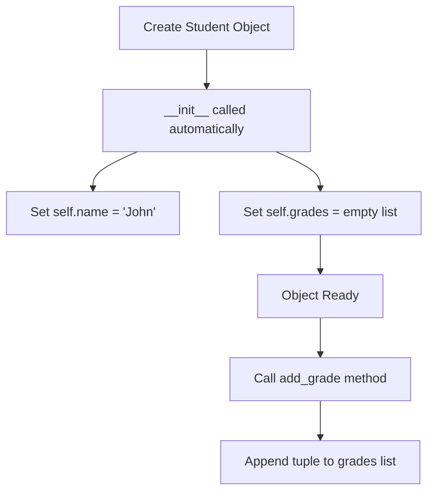
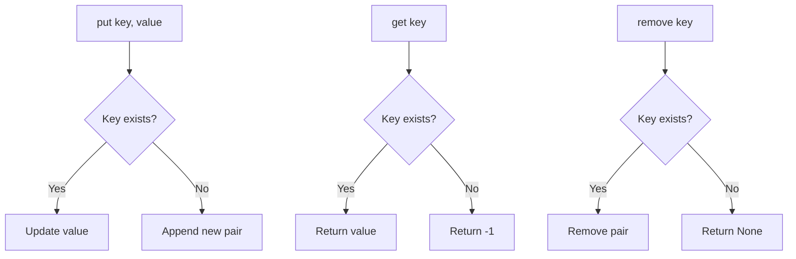
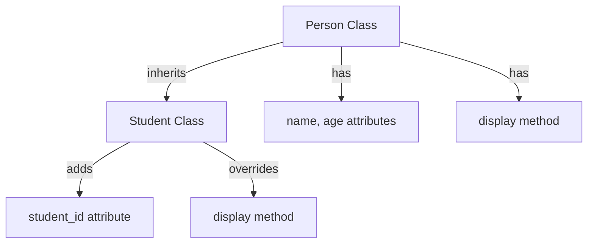
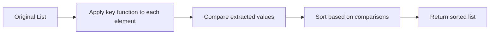
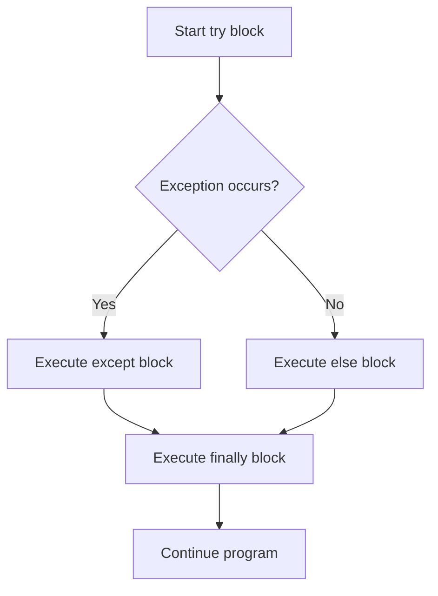
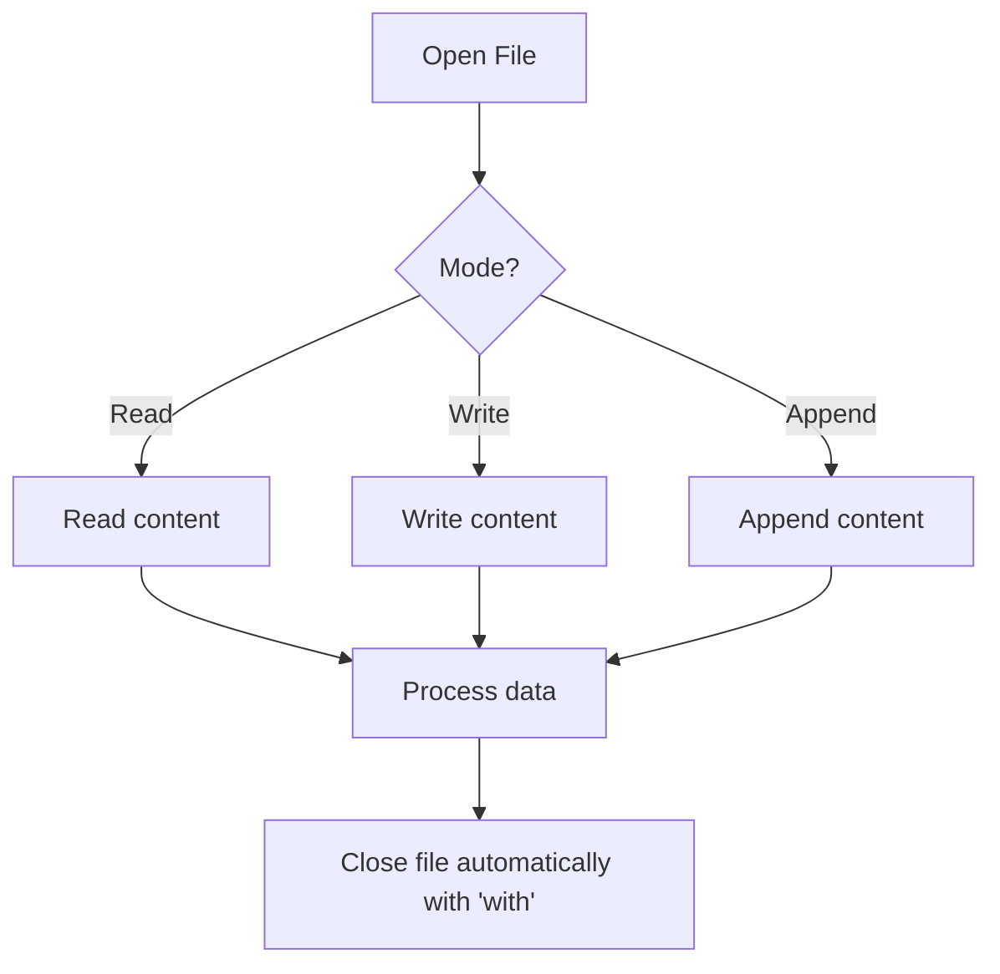
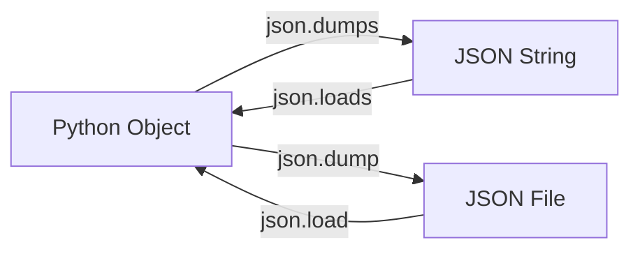

# Coding Guide: Copy_of_Python_Week_3_Notebook.ipynb

## Overview
This notebook covers advanced Python fundamentals including Object-Oriented Programming (OOP), custom sorting, exception handling, file operations, and JSON handling. It's designed for learners who understand basic Python syntax and are ready to explore more advanced concepts.

---

## Table of Contents
1. [OOP Concepts - Part I](#oop-part-1)
2. [OOP Concepts - Part II](#oop-part-2)
3. [Custom Sort Functions](#custom-sort)
4. [Exception Handling](#exception-handling)
5. [File Handling](#file-handling)
6. [JSON Module](#json-module)

---

## <a name="oop-part-1"></a>1. OOP Concepts - Part I

### 1.1 Defining a Class

**What is a Class?**
A class is a blueprint for creating objects. Think of it as a cookie cutter - the class defines the shape, and objects are the actual cookies.

```python
class Student:
    def __init__(self, name):
        self.name = name  # Instance attribute
        print("New student added:", name)
        self.grades = []  # Instance attribute
    
    def add_grade(self, course, grade):
        self.grades.append((course, grade))
        print(f"Grade {grade} added for the course {course}")
```

**Key Components:**

- **`class Student:`** - Declares a new class named Student
- **`__init__(self, name)`** - Constructor method (magic method) that runs automatically when creating a new object
  - `self` - Reference to the current instance (the object being created)
  - `name` - Parameter passed when creating the object
- **`self.name = name`** - Creates an instance attribute (variable that belongs to each object)
- **`self.grades = []`** - Another instance attribute, initialized as empty list
- **`add_grade(self, course, grade)`** - Instance method (function that belongs to the class)
  - Takes `self` (the object), `course`, and `grade` as parameters
  - Appends a tuple `(course, grade)` to the grades list

**Creating and Using Objects:**

```python
student1 = Student("John")  # Creates object, calls __init__
student1.add_grade("Algebra", 87)  # Calls instance method
print(student1.grades)  # Access instance attribute: [('Algebra', 87)]
```

**Flow Diagram:**



---

### 1.2 Instance vs Class Attributes and Methods

**Instance Attributes** - Unique to each object
**Class Attributes** - Shared across all objects of the class

```python
class Student:
    num_of_students = 0  # Class attribute (shared by all instances)
    
    def __init__(self, name):
        self.name = name  # Instance attribute (unique to each object)
        Student.num_of_students += 1  # Increment class attribute
        self.grades = []
    
    def add_grade(self, course, grade):  # Instance method
        self.grades.append((course, grade))
    
    @classmethod
    def class_count(cls):  # Class method
        return cls.num_of_students
```

**Key Differences:**

| Feature | Instance Method | Class Method |
|---------|----------------|--------------|
| Decorator | None | `@classmethod` |
| First Parameter | `self` (instance) | `cls` (class) |
| Access | Via object or class | Via class or object |
| Purpose | Work with instance data | Work with class data |

**Usage:**
```python
student1 = Student("John")  # num_of_students = 1
student2 = Student("Mary")  # num_of_students = 2
print(Student.class_count())  # 2 (called on class)
print(student1.class_count())  # 2 (called on instance, still works)
```

---

### 1.3 Static Methods

**What are Static Methods?**
Methods that don't need access to instance (`self`) or class (`cls`) data. They're utility functions that logically belong to the class.

```python
class Student:
    @staticmethod
    def grade_mapper(score):
        if 85 <= score <= 100:
            return 'A'
        elif 70 <= score < 85:
            return 'B'
        elif 55 <= score < 70:
            return 'C'
        elif 40 <= score < 55:
            return 'D'
        else:
            return 'F'
    
    def add_grade(self, course, num_grade):
        grade = Student.grade_mapper(num_grade)  # Call static method
        self.grades.append((course, grade))
```

**Key Points:**
- **`@staticmethod`** - Decorator that marks method as static
- **No `self` or `cls` parameter** - Doesn't receive instance or class reference
- **Called via class or instance** - `Student.grade_mapper(87)` or `student.grade_mapper(87)`
- **Use case** - Utility functions related to the class but don't need object data

---

### 1.4 Magic Methods (Dunder Methods)

**What are Magic Methods?**
Special methods with double underscores (dunder) that Python calls automatically in specific situations.

```python
class Student:
    def __init__(self, name):  # Constructor
        self.name = name
        self.grades = []
    
    def __repr__(self):  # String representation
        return f"Grades of student {self.name}: {self.grades}"
    
    def __add__(self, other):  # Addition operator
        return f"Student {self.name} & Student {other.name}"
```

**Common Magic Methods:**

| Method | Purpose | Example |
|--------|---------|---------|
| `__init__` | Constructor | `student = Student("John")` |
| `__repr__` | String representation | `print(student)` |
| `__str__` | User-friendly string | `str(student)` |
| `__add__` | Addition operator | `student1 + student2` |
| `__len__` | Length | `len(student)` |
| `__eq__` | Equality | `student1 == student2` |

**Usage:**
```python
student1 = Student("John")
student2 = Student("Mary")
print(student1)  # Calls __repr__: "Grades of student John: []"
print(student1 + student2)  # Calls __add__: "Student John & Student Mary"
```

---

### 1.5 Important Question: Missing 'self' Parameter

**What happens if you forget `self`?**

```python
class Student:
    def hello():  # Missing self!
        print("Hi")
```

**Behavior:**
- **Calling on class works:** `Student.hello()` → "Hi"
- **Calling on instance fails:** `student.hello()` → TypeError
  - Python automatically passes the instance as first argument
  - But `hello()` expects 0 arguments, gets 1 (the instance)

**Lesson:** Always include `self` as the first parameter in instance methods!

---

### 1.6 Class Activity: MyHashMap Implementation

**Problem:** Implement a HashMap (dictionary-like) data structure from scratch.

```python
class MyHashMap:
    def __init__(self):
        self.data = []  # Store key-value pairs as lists
    
    def put(self, key, value):
        # Update existing key or add new pair
        for item in self.data:
            if item[0] == key:
                item[1] = value  # Update value
                return
        self.data.append([key, value])  # Add new pair
    
    def get(self, key):
        # Return value for key, or -1 if not found
        for item in self.data:
            if item[0] == key:
                return item[1]
        return -1
    
    def remove(self, key):
        # Remove key-value pair
        for item in self.data:
            if item[0] == key:
                self.data.remove(item)
                return
```

**Key Concepts:**
- **`self.data = []`** - Internal storage as list of [key, value] pairs
- **`put(key, value)`** - Adds or updates key-value pair
  - Iterates through data to check if key exists
  - Updates value if found, otherwise appends new pair
- **`get(key)`** - Returns value for key, or -1 if not found
- **`remove(key)`** - Removes key-value pair from data

**Usage:**
```python
hashmap = MyHashMap()
hashmap.put(1, 1)      # data = [[1, 1]]
hashmap.put(2, 2)      # data = [[1, 1], [2, 2]]
print(hashmap.get(1))  # 1
hashmap.remove(1)      # data = [[2, 2]]
print(hashmap.get(1))  # -1
```

**Flow Diagram:**



---


## <a name="oop-part-2"></a>2. OOP Concepts - Part II

### 2.1 Inheritance

**What is Inheritance?**
Inheritance allows a class (child) to inherit attributes and methods from another class (parent). It promotes code reuse.

```python
class Person:
    def __init__(self, name, age):
        self.name = name
        self.age = age
    
    def display(self):
        print(f"Name: {self.name}, Age: {self.age}")

class Student(Person):  # Student inherits from Person
    def __init__(self, name, age, student_id):
        super().__init__(name, age)  # Call parent constructor
        self.student_id = student_id
    
    def display(self):  # Override parent method
        super().display()  # Call parent method
        print(f"Student ID: {self.student_id}")
```

**Key Concepts:**
- **`class Student(Person):`** - Student inherits from Person (parent class)
- **`super().__init__(name, age)`** - Calls parent class constructor
  - `super()` returns a reference to the parent class
  - Initializes inherited attributes
- **Method Overriding** - Child class can redefine parent methods
- **`super().display()`** - Calls parent's version of the method

**Usage:**
```python
student = Student("John", 20, "S123")
student.display()
# Output:
# Name: John, Age: 20
# Student ID: S123
```

**Inheritance Hierarchy:**



---

### 2.2 Multiple Inheritance

**What is Multiple Inheritance?**
A class can inherit from multiple parent classes.

```python
class Father:
    def skills(self):
        print("Gardening, Programming")

class Mother:
    def skills(self):
        print("Cooking, Art")

class Child(Father, Mother):  # Inherits from both
    pass
```

**Method Resolution Order (MRO):**
- Python uses **C3 Linearization** algorithm
- Searches for methods left-to-right in parent list
- `Child.skills()` calls `Father.skills()` (Father comes first)
- Check MRO: `print(Child.__mro__)`

**Important:** Be careful with multiple inheritance - can lead to complexity!

---

### 2.3 Encapsulation

**What is Encapsulation?**
Hiding internal details and restricting direct access to some attributes/methods. Protects data integrity.

```python
class BankAccount:
    def __init__(self, balance):
        self.__balance = balance  # Private attribute (double underscore)
    
    def deposit(self, amount):
        if amount > 0:
            self.__balance += amount
    
    def get_balance(self):  # Getter method
        return self.__balance
    
    def __validate(self):  # Private method
        return self.__balance >= 0
```

**Access Levels:**

| Naming | Access Level | Example |
|--------|-------------|---------|
| `name` | Public | Accessible everywhere |
| `_name` | Protected | Convention: internal use only |
| `__name` | Private | Name mangling, harder to access |

**Key Points:**
- **`self.__balance`** - Private attribute (name mangling to `_BankAccount__balance`)
- **Cannot access directly:** `account.__balance` raises AttributeError
- **Use getter/setter methods** - Controlled access to private data
- **`__validate()`** - Private method, only accessible within class

**Usage:**
```python
account = BankAccount(1000)
# account.__balance  # Error! Cannot access
print(account.get_balance())  # 1000 (via getter)
account.deposit(500)
print(account.get_balance())  # 1500
```

---

### 2.4 Polymorphism

**What is Polymorphism?**
"Many forms" - same method name behaves differently based on the object calling it.

```python
class Dog:
    def sound(self):
        return "Woof!"

class Cat:
    def sound(self):
        return "Meow!"

class Cow:
    def sound(self):
        return "Moo!"

def make_sound(animal):  # Polymorphic function
    print(animal.sound())

dog = Dog()
cat = Cat()
make_sound(dog)  # Woof!
make_sound(cat)  # Meow!
```

**Key Concepts:**
- **Same method name** (`sound()`) in different classes
- **Different implementations** - each class defines its own behavior
- **Polymorphic function** - `make_sound()` works with any object that has `sound()` method
- **Duck Typing** - "If it walks like a duck and quacks like a duck, it's a duck"

---

### 2.5 Method Overloading in Python

**Problem:** Python doesn't support traditional method overloading (multiple methods with same name, different parameters).

**Solutions:**

#### Solution 1: Default Arguments
```python
class Calculator:
    def add(self, a, b=0, c=0):  # Default values
        return a + b + c

calc = Calculator()
print(calc.add(5))        # 5 (b=0, c=0)
print(calc.add(5, 10))    # 15 (c=0)
print(calc.add(5, 10, 3)) # 18
```

#### Solution 2: Variable-Length Arguments (*args)
```python
class Calculator:
    def add(self, *args):  # Accept any number of arguments
        return sum(args)

calc = Calculator()
print(calc.add(5))           # 5
print(calc.add(5, 10))       # 15
print(calc.add(5, 10, 3, 7)) # 25
```

**Key Concepts:**
- **`*args`** - Collects all positional arguments into a tuple
- **`sum(args)`** - Adds all numbers in the tuple
- **Flexible** - Works with any number of arguments

#### Solution 3: Type Checking
```python
class Printer:
    def print_data(self, data):
        if isinstance(data, str):
            print(f"String: {data}")
        elif isinstance(data, int):
            print(f"Integer: {data}")
        elif isinstance(data, list):
            print(f"List: {data}")

printer = Printer()
printer.print_data("Hello")  # String: Hello
printer.print_data(42)       # Integer: 42
printer.print_data([1, 2])   # List: [1, 2]
```

---

## <a name="custom-sort"></a>3. Custom Sort Functions

### 3.1 sorted() Function

**What is sorted()?**
Built-in function that returns a NEW sorted list without modifying the original.

```python
numbers = [5, 2, 8, 1, 9]
sorted_numbers = sorted(numbers)
print(sorted_numbers)  # [1, 2, 5, 8, 9]
print(numbers)         # [5, 2, 8, 1, 9] (unchanged)
```

**Key Points:**
- **Returns new list** - Original remains unchanged
- **Works on any iterable** - lists, tuples, strings, etc.
- **Default: ascending order**

---

### 3.2 sort() Method

**What is sort()?**
List method that sorts the list IN-PLACE (modifies original).

```python
numbers = [5, 2, 8, 1, 9]
numbers.sort()
print(numbers)  # [1, 2, 5, 8, 9] (modified)
```

**Key Differences:**

| Feature | sorted() | sort() |
|---------|----------|--------|
| Type | Built-in function | List method |
| Returns | New sorted list | None |
| Original | Unchanged | Modified |
| Works on | Any iterable | Lists only |

---

### 3.3 key and reverse Parameters

**Custom Sorting with key:**

```python
# Sort by string length
words = ["apple", "pie", "banana", "cherry"]
sorted_words = sorted(words, key=len)
print(sorted_words)  # ['pie', 'apple', 'banana', 'cherry']

# Sort by absolute value
numbers = [-5, 2, -8, 1, 9]
sorted_numbers = sorted(numbers, key=abs)
print(sorted_numbers)  # [1, 2, -5, -8, 9]

# Sort tuples by second element
students = [("John", 85), ("Mary", 92), ("Bob", 78)]
sorted_students = sorted(students, key=lambda x: x[1])
print(sorted_students)  # [('Bob', 78), ('John', 85), ('Mary', 92)]
```

**Key Concepts:**
- **`key` parameter** - Function that extracts comparison key from each element
- **`len`** - Built-in function, returns length
- **`abs`** - Built-in function, returns absolute value
- **`lambda x: x[1]`** - Anonymous function, returns second element of tuple
- **`reverse=True`** - Sort in descending order

**Reverse Sorting:**
```python
numbers = [5, 2, 8, 1, 9]
sorted_desc = sorted(numbers, reverse=True)
print(sorted_desc)  # [9, 8, 5, 2, 1]
```

**Sorting Complex Objects:**

```python
class Student:
    def __init__(self, name, grade):
        self.name = name
        self.grade = grade

students = [
    Student("John", 85),
    Student("Mary", 92),
    Student("Bob", 78)
]

# Sort by grade
sorted_students = sorted(students, key=lambda s: s.grade)
for s in sorted_students:
    print(f"{s.name}: {s.grade}")
# Output:
# Bob: 78
# John: 85
# Mary: 92
```

**Sorting Flow:**



---

## <a name="exception-handling"></a>4. Exception Handling

### 4.1 Common Errors

**Types of Errors:**

| Error Type | Cause | Example |
|------------|-------|---------|
| `SyntaxError` | Invalid Python syntax | `if True print("Hi")` |
| `NameError` | Variable not defined | `print(x)` when x doesn't exist |
| `TypeError` | Wrong type operation | `"5" + 5` |
| `ValueError` | Right type, wrong value | `int("abc")` |
| `ZeroDivisionError` | Division by zero | `10 / 0` |
| `IndexError` | Invalid index | `[1, 2][5]` |
| `KeyError` | Key not in dictionary | `{"a": 1}["b"]` |
| `FileNotFoundError` | File doesn't exist | `open("missing.txt")` |

---

### 4.2 try / except

**What is try/except?**
Handles errors gracefully without crashing the program.

```python
try:
    # Code that might raise an error
    number = int(input("Enter a number: "))
    result = 10 / number
    print(f"Result: {result}")
except ZeroDivisionError:
    print("Cannot divide by zero!")
except ValueError:
    print("Invalid input! Please enter a number.")
```

**Key Concepts:**
- **`try` block** - Code that might raise an exception
- **`except` block** - Code that runs if exception occurs
- **Specific exceptions** - Catch specific error types
- **Program continues** - Doesn't crash, handles error gracefully

---

### 4.3 Raising Exceptions

**What is raise?**
Manually trigger an exception.

```python
def check_age(age):
    if age < 0:
        raise ValueError("Age cannot be negative!")
    if age < 18:
        raise Exception("Must be 18 or older!")
    print("Access granted")

try:
    check_age(-5)
except ValueError as e:
    print(f"Error: {e}")  # Error: Age cannot be negative!
```

**Key Concepts:**
- **`raise ValueError("message")`** - Triggers ValueError with custom message
- **`as e`** - Captures exception object in variable `e`
- **`str(e)`** - Gets error message
- **Use case** - Input validation, enforcing business rules

---

### 4.4 Multiple Excepts and Else

```python
try:
    number = int(input("Enter a number: "))
    result = 10 / number
except ZeroDivisionError:
    print("Cannot divide by zero!")
except ValueError:
    print("Invalid input!")
else:
    print(f"Result: {result}")  # Runs if NO exception
```

**Key Concepts:**
- **Multiple except blocks** - Handle different exceptions differently
- **`else` block** - Runs ONLY if no exception occurred
- **Use case** - Code that should run only on success

---

### 4.5 try / except / else / finally

```python
try:
    file = open("data.txt", "r")
    content = file.read()
    print(content)
except FileNotFoundError:
    print("File not found!")
else:
    print("File read successfully!")
finally:
    print("Cleanup: Closing resources")
    # file.close()  # Always runs, even if error
```

**Key Concepts:**
- **`finally` block** - ALWAYS runs, regardless of exception
- **Use case** - Cleanup operations (close files, release resources)
- **Execution order:**
  1. `try` block
  2. `except` block (if error)
  3. `else` block (if no error)
  4. `finally` block (always)

**Exception Handling Flow:**



---

### 4.6 Custom Exceptions

**Creating Custom Exceptions:**

```python
class NegativeAgeError(Exception):
    """Custom exception for negative age"""
    pass

class InvalidAgeError(Exception):
    """Custom exception for invalid age range"""
    def __init__(self, age, message="Age must be between 0 and 150"):
        self.age = age
        self.message = message
        super().__init__(self.message)

def validate_age(age):
    if age < 0:
        raise NegativeAgeError("Age cannot be negative!")
    if age > 150:
        raise InvalidAgeError(age)
    print(f"Valid age: {age}")

try:
    validate_age(-5)
except NegativeAgeError as e:
    print(f"Error: {e}")
except InvalidAgeError as e:
    print(f"Error: {e.message} (got {e.age})")
```

**Key Concepts:**
- **Inherit from `Exception`** - Base class for all exceptions
- **`pass`** - Simple custom exception with no extra functionality
- **Custom `__init__`** - Add custom attributes (age, message)
- **`super().__init__(message)`** - Call parent constructor
- **Use case** - Domain-specific errors, better error messages

---


## <a name="file-handling"></a>5. File Handling

### 5.1 Reading Files - Method 1

**Basic File Reading:**

```python
file = open("data.txt", "r")  # Open file in read mode
content = file.read()          # Read entire file as string
print(content)
file.close()                   # Always close the file!
```

**Key Concepts:**
- **`open(filename, mode)`** - Opens file and returns file object
  - `"r"` - Read mode (default)
  - `"w"` - Write mode (overwrites)
  - `"a"` - Append mode
  - `"r+"` - Read and write
- **`file.read()`** - Reads entire file content as single string
- **`file.close()`** - Closes file, releases resources
- **Important:** Always close files to prevent resource leaks!

---

### 5.2 Reading Files - Method 2 (Context Manager)

**Using 'with' Statement:**

```python
with open("data.txt", "r") as file:
    content = file.read()
    print(content)
# File automatically closed after 'with' block
```

**Key Concepts:**
- **`with` statement** - Context manager, automatically closes file
- **`as file`** - Assigns file object to variable
- **Automatic cleanup** - File closed even if exception occurs
- **Best practice** - Always use `with` for file operations!

**Why use 'with'?**
- Prevents forgetting to close files
- Handles exceptions gracefully
- Cleaner, more readable code

---

### 5.3 readline() Method

**Reading Line by Line:**

```python
with open("data.txt", "r") as file:
    line1 = file.readline()  # Read first line
    line2 = file.readline()  # Read second line
    print(line1)
    print(line2)
```

**Key Concepts:**
- **`readline()`** - Reads one line at a time
- **Returns string** - Includes newline character `\n`
- **Sequential** - Each call reads next line
- **Returns empty string** - When end of file reached

**Use case:** Processing large files line by line (memory efficient)

---

### 5.4 readlines() Method

**Reading All Lines as List:**

```python
with open("data.txt", "r") as file:
    lines = file.readlines()  # Returns list of lines
    print(lines)  # ['Line 1\n', 'Line 2\n', 'Line 3\n']

# Process each line
for line in lines:
    print(line.strip())  # Remove newline characters
```

**Key Concepts:**
- **`readlines()`** - Reads all lines into a list
- **Each element** - One line (string) with `\n`
- **`.strip()`** - Removes leading/trailing whitespace (including `\n`)
- **Memory consideration** - Loads entire file into memory

**Comparison:**

| Method | Returns | Use Case |
|--------|---------|----------|
| `read()` | Single string | Small files, need entire content |
| `readline()` | One line (string) | Large files, process line by line |
| `readlines()` | List of lines | Need all lines as list |

---

### 5.5 Iterating Over File

**Best Practice for Large Files:**

```python
with open("data.txt", "r") as file:
    for line in file:  # Iterate directly over file object
        print(line.strip())
```

**Key Concepts:**
- **File object is iterable** - Can use in for loop
- **Memory efficient** - Reads one line at a time
- **Best practice** - For large files
- **Automatic** - No need to call `readline()` or `readlines()`

---

### 5.6 Writing to Files

**Writing Text:**

```python
with open("output.txt", "w") as file:
    file.write("Hello, World!\n")
    file.write("This is line 2\n")
```

**Key Concepts:**
- **`"w"` mode** - Write mode, creates new file or OVERWRITES existing
- **`file.write(string)`** - Writes string to file
- **No automatic newline** - Must add `\n` manually
- **Returns** - Number of characters written

**Append Mode:**

```python
with open("output.txt", "a") as file:
    file.write("This line is appended\n")
```

**Key Concepts:**
- **`"a"` mode** - Append mode, adds to end of file
- **Doesn't overwrite** - Preserves existing content
- **Creates file** - If file doesn't exist

---

### 5.7 writelines() Method

**Writing Multiple Lines:**

```python
lines = ["Line 1\n", "Line 2\n", "Line 3\n"]

with open("output.txt", "w") as file:
    file.writelines(lines)  # Write list of strings
```

**Key Concepts:**
- **`writelines(iterable)`** - Writes all strings from iterable
- **No automatic newlines** - Must include `\n` in strings
- **Accepts** - List, tuple, or any iterable of strings

---

### 5.8 Handling Large Files

**Problem:** Reading huge files with `read()` or `readlines()` loads entire file into memory.

**Solution:** Process line by line

```python
# Bad: Loads entire file into memory
with open("huge_file.txt", "r") as file:
    content = file.read()  # Could crash if file is too large!

# Good: Processes one line at a time
with open("huge_file.txt", "r") as file:
    for line in file:
        process(line)  # Memory efficient
```

**Key Concepts:**
- **Streaming** - Process data as it's read
- **Memory efficient** - Only one line in memory at a time
- **Scalable** - Works with files of any size

**File Handling Flow:**



---

## <a name="json-module"></a>6. JSON Module

**What is JSON?**
JavaScript Object Notation - lightweight data format for storing and exchanging data. Similar to Python dictionaries.

**Why use JSON?**
- Human-readable
- Language-independent
- Common format for APIs and configuration files
- Easy to parse and generate

### 6.1 Importing JSON Module

```python
import json  # Built-in Python module for JSON operations
```

**Key Concepts:**
- **`json` module** - Built-in, no installation needed
- **Provides functions** - For converting between Python objects and JSON

---

### 6.2 Serialize to JSON String (json.dumps)

**Converting Python to JSON String:**

```python
import json

# Python dictionary
data = {
    "name": "John",
    "age": 30,
    "city": "New York",
    "grades": [85, 90, 78]
}

# Convert to JSON string
json_string = json.dumps(data)
print(json_string)
# Output: {"name": "John", "age": 30, "city": "New York", "grades": [85, 90, 78]}
print(type(json_string))  # <class 'str'>
```

**Key Concepts:**
- **`json.dumps(obj)`** - "dump string" - Converts Python object to JSON string
- **Serialization** - Converting object to string format
- **Returns string** - JSON-formatted string

**Pretty Printing:**

```python
json_string = json.dumps(data, indent=4)
print(json_string)
# Output:
# {
#     "name": "John",
#     "age": 30,
#     "city": "New York",
#     "grades": [85, 90, 78]
# }
```

**Parameters:**
- **`indent=4`** - Adds indentation for readability
- **`sort_keys=True`** - Sorts dictionary keys alphabetically

**Python to JSON Conversion:**

| Python | JSON |
|--------|------|
| dict | object |
| list, tuple | array |
| str | string |
| int, float | number |
| True | true |
| False | false |
| None | null |

---

### 6.3 Serialize to JSON File (json.dump)

**Writing JSON to File:**

```python
import json

data = {
    "name": "John",
    "age": 30,
    "grades": [85, 90, 78]
}

# Write to JSON file
with open("data.json", "w") as file:
    json.dump(data, file, indent=4)
```

**Key Concepts:**
- **`json.dump(obj, file)`** - "dump" - Writes Python object to file as JSON
- **Takes file object** - Not filename
- **Creates/overwrites file** - Use `"w"` mode
- **`indent=4`** - Makes file human-readable

---

### 6.4 Deserialize JSON File (json.load)

**Reading JSON from File:**

```python
import json

# Read from JSON file
with open("data.json", "r") as file:
    data = json.load(file)

print(data)  # Python dictionary
print(type(data))  # <class 'dict'>
print(data["name"])  # John
```

**Key Concepts:**
- **`json.load(file)`** - "load" - Reads JSON from file, returns Python object
- **Deserialization** - Converting JSON string to Python object
- **Returns** - Python dictionary (or list, depending on JSON structure)

---

### 6.5 Deserialize JSON String (json.loads)

**Parsing JSON String:**

```python
import json

json_string = '{"name": "John", "age": 30, "grades": [85, 90, 78]}'

# Convert JSON string to Python object
data = json.loads(json_string)
print(data)  # {'name': 'John', 'age': 30, 'grades': [85, 90, 78]}
print(type(data))  # <class 'dict'>
```

**Key Concepts:**
- **`json.loads(string)`** - "load string" - Parses JSON string to Python object
- **Takes string** - Not file object
- **Returns** - Python dictionary or list

**JSON Functions Summary:**

| Function | Purpose | Input | Output |
|----------|---------|-------|--------|
| `json.dumps()` | Python → JSON string | Python object | JSON string |
| `json.dump()` | Python → JSON file | Python object, file | None (writes to file) |
| `json.loads()` | JSON string → Python | JSON string | Python object |
| `json.load()` | JSON file → Python | File object | Python object |

**Mnemonic:**
- **`s` in `dumps`/`loads`** = **string**
- **No `s` in `dump`/`load`** = **file**

**JSON Workflow:**



---

### 6.6 Working with Complex JSON

**Nested Structures:**

```python
import json

data = {
    "students": [
        {
            "name": "John",
            "age": 20,
            "grades": {"math": 85, "science": 90}
        },
        {
            "name": "Mary",
            "age": 22,
            "grades": {"math": 92, "science": 88}
        }
    ],
    "school": "ABC High School"
}

# Save to file
with open("students.json", "w") as file:
    json.dump(data, file, indent=4)

# Load from file
with open("students.json", "r") as file:
    loaded_data = json.load(file)

# Access nested data
print(loaded_data["students"][0]["name"])  # John
print(loaded_data["students"][0]["grades"]["math"])  # 85
```

**Key Concepts:**
- **Nested dictionaries** - Dictionaries within dictionaries
- **Lists of dictionaries** - Common pattern for collections
- **Access with brackets** - Chain `[]` to access nested data
- **Preserves structure** - JSON maintains nesting

---

## Summary

### Key Takeaways

**OOP Concepts:**
- Classes are blueprints, objects are instances
- `self` refers to the instance, `cls` refers to the class
- Instance methods work with object data, class methods work with class data
- Static methods are utility functions that don't need instance or class data
- Magic methods enable operator overloading and special behaviors
- Inheritance promotes code reuse, encapsulation protects data
- Polymorphism allows same interface, different implementations

**Sorting:**
- `sorted()` returns new list, `sort()` modifies in-place
- Use `key` parameter for custom sorting logic
- Lambda functions are useful for simple key functions

**Exception Handling:**
- Use try/except to handle errors gracefully
- `finally` block always executes (cleanup)
- `else` block runs only if no exception
- Create custom exceptions for domain-specific errors

**File Handling:**
- Always use `with` statement for automatic file closing
- `read()` for entire file, iterate for large files
- `"r"` for reading, `"w"` for writing (overwrites), `"a"` for appending

**JSON:**
- `dumps`/`loads` for strings, `dump`/`load` for files
- JSON is language-independent data format
- Use `indent` parameter for readable output
- Python dicts ↔ JSON objects, Python lists ↔ JSON arrays

---

## Practice Exercises

1. **OOP:** Create a `Library` class with methods to add books, remove books, and search by title
2. **Inheritance:** Create `Vehicle` parent class and `Car`, `Bike` child classes
3. **Sorting:** Sort a list of dictionaries by multiple keys
4. **Exception Handling:** Create a calculator that handles division by zero and invalid input
5. **File Handling:** Read a CSV file and calculate statistics
6. **JSON:** Create a contact management system that saves/loads contacts from JSON file

---

## Additional Resources

- Python Official Documentation: https://docs.python.org/3/
- Real Python OOP Tutorial: https://realpython.com/python3-object-oriented-programming/
- JSON Documentation: https://docs.python.org/3/library/json.html
- File Handling Guide: https://realpython.com/read-write-files-python/

---

**End of Coding Guide**
