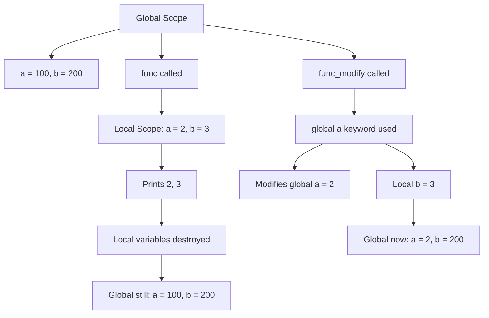
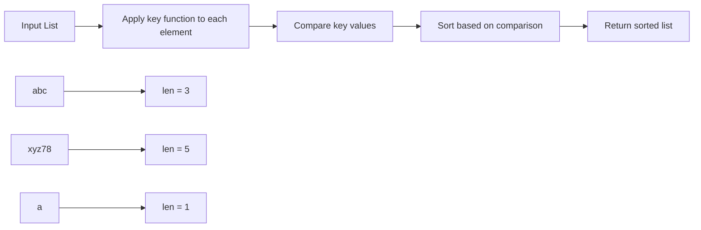
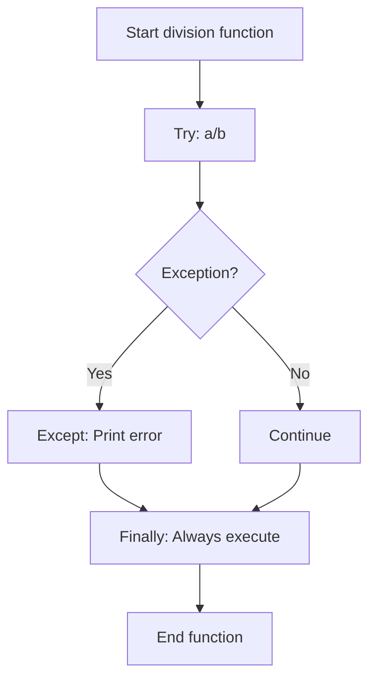
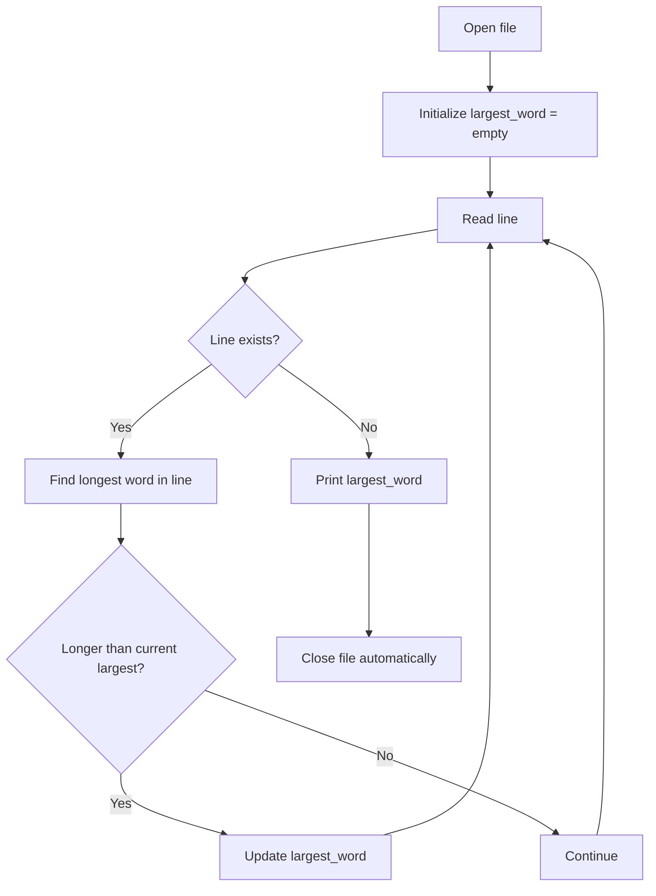
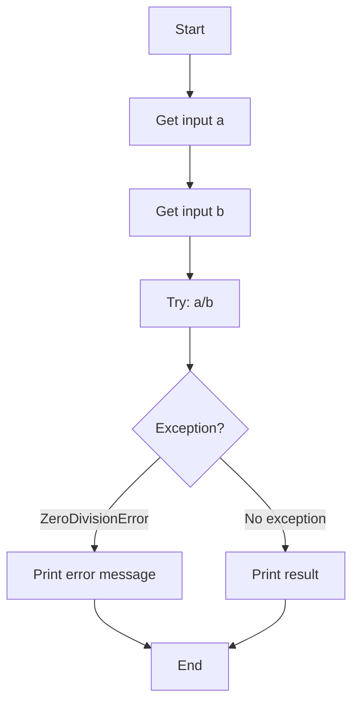

# Coding Guide: IK_Week3.ipynb

## Overview
This notebook contains practical exercises focusing on variable scope, custom sorting, exception handling, file operations, and JSON handling. It demonstrates real-world applications of Python fundamentals through hands-on examples.

---

## Table of Contents
1. [Local and Global Variables](#local-global)
2. [Custom String Sorting](#custom-sort)
3. [Exception Handling with Division](#exception-division)
4. [Finding Longest Word in File](#longest-word)
5. [Interactive Division Program](#interactive-division)
6. [Reading JSON Files](#json-read)

---

## <a name="local-global"></a>1. Local and Global Variables

### 1.1 Understanding Variable Scope

**What is Scope?**
Scope determines where a variable can be accessed in your code. Python has two main scopes:
- **Local scope** - Variables inside functions
- **Global scope** - Variables outside functions

### Example 1: Basic Scope Demonstration

```python
def func():
    a = 2
    b = 3
    print(a, b)

def func_modify():
    global a
    a = 2
    b = 3
    print(a, b)

a = 100
b = 200
print(a, b)        # Output: 100 200
func()             # Output: 2 3
print(a, b)        # Output: 100 200
func_modify()      # Output: 2 3
print(a, b)        # Output: 2 200
```

**Key Concepts:**

- **`a = 100` (outside function)** - Creates global variable `a`
- **`a = 2` (inside `func()`)** - Creates NEW local variable `a` (doesn't affect global)
- **`global a`** - Tells Python to use the global variable, not create a new local one
- **Local variables** - Exist only inside the function, destroyed after function ends
- **Global variables** - Exist throughout the program

**What's Happening:**

1. `a = 100, b = 200` - Global variables created
2. `func()` called:
   - Creates local `a = 2, b = 3`
   - Prints local values: `2 3`
   - Local variables destroyed after function ends
3. Global `a, b` unchanged: `100 200`
4. `func_modify()` called:
   - `global a` - Uses global `a`, not local
   - Modifies global `a` to `2`
   - Creates local `b = 3` (no global keyword)
   - Prints: `2 3`
5. Global `a` changed to `2`, but `b` still `200`

**Scope Visualization:**



---

### Example 2: Detailed Scope Example

```python
def sum():
    a = 300
    b = 400
    return a + b

def sum_global():
    global a
    global b
    a = 300
    b = 400
    return a + b

a = 100
b = 200
print(f"Value of a and b are : {a},{b} before calling sum()")
print(f"Sum is {sum()}")
print(f"Value of a and b are : {a},{b} after calling sum()")

print(f"Value of a and b are : {a},{b} before calling sum_global()")
print(f"Sum is {sum_global()}")
print(f"Value of a and b are : {a},{b} after calling sum_global()")
```

**Output:**
```
Value of a and b are : 100,200 before calling sum()
Sum is 700
Value of a and b are : 100,200 after calling sum()
Value of a and b are : 100,200 before calling sum_global()
Sum is 700
Value of a and b are : 300,400 after calling sum_global()
```

**Key Takeaways:**

| Function | Uses global keyword? | Modifies global variables? |
|----------|---------------------|---------------------------|
| `sum()` | No | No - creates local variables |
| `sum_global()` | Yes | Yes - modifies global variables |

**Best Practices:**
- **Avoid global variables** when possible - makes code harder to debug
- **Use function parameters and return values** instead
- **Use global only when necessary** - like configuration settings or counters

---

## <a name="custom-sort"></a>2. Custom String Sorting

### 2.1 Sorting Strings by Length

**Problem:** Sort a list of strings by their length.

```python
def custom_string_sort_1(list_strings):
    return sorted(list_strings, key=lambda x: (len(x), x))

def custom_string_sort_2(list_strings):
    return sorted(list_strings, key=lambda x: len(x))

input_list = ['abc', 'xyz78', 'a', '1221', '1234567', '345']
print(custom_string_sort_1(input_list))
# Output: ['a', '345', 'abc', '1221', 'xyz78', '1234567']

print(custom_string_sort_2(input_list))
# Output: ['a', 'abc', '345', '1221', 'xyz78', '1234567']
```

**Key Concepts:**

- **`sorted(list, key=function)`** - Sorts list using custom key function
- **`lambda x: len(x)`** - Anonymous function that returns length of string
  - `x` - Each element in the list
  - `len(x)` - Length of that element
- **`lambda x: (len(x), x)`** - Returns tuple for sorting
  - First sorts by length
  - If lengths are equal, sorts alphabetically

**Difference Between Two Functions:**

| Function | Sort Key | Behavior |
|----------|----------|----------|
| `custom_string_sort_1` | `(len(x), x)` | Sort by length, then alphabetically |
| `custom_string_sort_2` | `len(x)` | Sort by length only |

**Example:**
- Input: `['abc', '345']` (both length 3)
- `custom_string_sort_1`: `['345', 'abc']` (alphabetical: '3' < 'a')
- `custom_string_sort_2`: `['abc', '345']` (original order preserved - stable sort)

**Lambda Function Explained:**

```python
# Lambda function
lambda x: len(x)

# Equivalent regular function
def get_length(x):
    return len(x)
```

**Sorting Flow:**



**Use Cases:**
- Sort files by size
- Sort names by length
- Prioritize shorter/longer items

---

## <a name="exception-division"></a>3. Exception Handling with Division

### 3.1 Division with Finally Block

```python
def division(a, b):
    try:
        a / b
    except ZeroDivisionError:
        print("Division by zero error")
    finally:
        print("This will always execute")

division(10, 0)  # Output: Division by zero error
                 #         This will always execute

division(10, 2)  # Output: This will always execute
```

**Key Concepts:**

- **`try` block** - Code that might raise an exception
- **`except ZeroDivisionError`** - Catches specific exception type
- **`finally` block** - ALWAYS executes, regardless of exception
  - Runs even if exception occurs
  - Runs even if no exception occurs
  - Runs even if there's a return statement

**Execution Flow:**

**Case 1: Division by zero (10, 0)**
1. `try` block: `10 / 0` raises `ZeroDivisionError`
2. `except` block: Prints "Division by zero error"
3. `finally` block: Prints "This will always execute"

**Case 2: Normal division (10, 2)**
1. `try` block: `10 / 2 = 5.0` (no exception)
2. `except` block: Skipped (no exception)
3. `finally` block: Prints "This will always execute"

**Use Cases for Finally:**
- Close files
- Release database connections
- Clean up resources
- Log operations

**Flow Diagram:**



---

## <a name="longest-word"></a>4. Finding Longest Word in File

### 4.1 Algorithm to Find Longest Word

**Problem:** Read a text file and find the longest word.

```python
def find_largest_word(current_line):
    largest_word = ''
    current_line_words = current_line.split(' ')
    if len(current_line_words) <= 0:
        return largest_word
    
    for word in current_line_words:
        if len(word) > len(largest_word):
            largest_word = word
    
    return largest_word

with open("test.txt", "r") as file:
    largest_word = ''
    while True:
        current_line = file.readline()
        if current_line:
            current_line_largest = find_largest_word(current_line)
            if len(current_line_largest) > len(largest_word):
                largest_word = current_line_largest
        else:
            break

    print(f"The largest word in the file is {largest_word}")
```

**Output:**
```
The largest word in the file is UnitedStatesOfAmerica
```

**Key Concepts:**

**Function: `find_largest_word(current_line)`**
- **Purpose:** Find longest word in a single line
- **`current_line.split(' ')`** - Splits line into list of words using space as delimiter
  - Example: `"Hello World"` → `["Hello", "World"]`
- **`largest_word = ''`** - Initialize with empty string
- **Loop through words** - Compare each word's length
- **`if len(word) > len(largest_word)`** - Update if current word is longer
- **Returns** - Longest word in that line

**Main Logic:**
- **`with open("test.txt", "r") as file:`** - Opens file in read mode
- **`largest_word = ''`** - Track longest word across all lines
- **`while True:`** - Infinite loop (breaks when file ends)
- **`file.readline()`** - Reads one line at a time
  - Returns line as string
  - Returns empty string `''` when file ends
- **`if current_line:`** - Checks if line is not empty
  - Process line to find longest word
  - Compare with overall longest word
- **`else: break`** - Exit loop when file ends

**Why This Approach?**
- **Memory efficient** - Reads one line at a time (good for large files)
- **Modular** - Separate function for finding longest word in a line
- **Scalable** - Works with files of any size

**Algorithm Flow:**



**Example Walkthrough:**

File content:
```
Hello World
Python Programming
UnitedStatesOfAmerica
```

Execution:
1. Line 1: "Hello World" → Longest: "World" (5 chars)
2. Line 2: "Python Programming" → Longest: "Programming" (11 chars)
3. Line 3: "UnitedStatesOfAmerica" → Longest: "UnitedStatesOfAmerica" (21 chars)
4. File ends → Print: "UnitedStatesOfAmerica"

**Improvements:**
```python
# Handle punctuation
word = word.strip('.,!?;:')

# Case-insensitive comparison
word = word.lower()

# Handle multiple spaces
words = current_line.split()  # Splits on any whitespace
```

---

## <a name="interactive-division"></a>5. Interactive Division Program

### 5.1 User Input with Exception Handling

```python
a = int(input("Enter First No:"))
b = int(input("Enter Second No:"))

try:
    print(f"Division result of a={a}, b={b} is {a/b}")
except ZeroDivisionError:
    print("Zero Division Error")
```

**Key Concepts:**

- **`input(prompt)`** - Displays prompt and waits for user input
  - Returns string
  - Example: `input("Enter name: ")` → User types "John" → Returns `"John"`
- **`int(input(...))`** - Converts input string to integer
  - `int("5")` → `5`
  - `int("abc")` → Raises `ValueError`
- **`f"...{variable}..."`** - f-string (formatted string literal)
  - Embeds variables directly in string
  - `f"Result is {a/b}"` → `"Result is 5.0"`
- **`try/except`** - Handles division by zero gracefully

**Potential Issues:**

1. **Non-numeric input:** User enters "abc" → `ValueError`
2. **Division by zero:** User enters 0 for second number → `ZeroDivisionError`

**Improved Version:**

```python
try:
    a = int(input("Enter First No:"))
    b = int(input("Enter Second No:"))
    print(f"Division result of a={a}, b={b} is {a/b}")
except ValueError:
    print("Invalid input! Please enter numbers only.")
except ZeroDivisionError:
    print("Zero Division Error! Cannot divide by zero.")
```

**Flow Diagram:**



**Use Cases:**
- Calculator programs
- Data processing with user input
- Interactive scripts

---

## <a name="json-read"></a>6. Reading JSON Files

### 6.1 Loading and Printing JSON Data

```python
import json

with open("test.json", "r") as file:
    print(f"The contents of the file are: {json.load(file)}")
```

**Output:**
```
The contents of the file are: [{'name': 'Shubham', 'city': 'Bellevue'}, {'name': 'Sakshi', 'city': 'Bellevue'}]
```

**Key Concepts:**

- **`import json`** - Imports built-in JSON module
  - Provides functions to work with JSON data
- **`with open("test.json", "r") as file:`** - Opens JSON file in read mode
  - Context manager ensures file is closed automatically
- **`json.load(file)`** - Reads JSON from file and converts to Python object
  - JSON array → Python list
  - JSON object → Python dictionary
  - Returns Python data structure
- **f-string** - Formats output with embedded expression

**JSON File Structure (test.json):**
```json
[
  {
    "name": "Shubham",
    "city": "Bellevue"
  },
  {
    "name": "Sakshi",
    "city": "Bellevue"
  }
]
```

**Python Equivalent:**
```python
[
    {"name": "Shubham", "city": "Bellevue"},
    {"name": "Sakshi", "city": "Bellevue"}
]
```

**Accessing Data:**

```python
import json

with open("test.json", "r") as file:
    data = json.load(file)

# data is a list of dictionaries
print(data[0]["name"])  # Shubham
print(data[1]["city"])  # Bellevue

# Iterate through data
for person in data:
    print(f"{person['name']} lives in {person['city']}")
# Output:
# Shubham lives in Bellevue
# Sakshi lives in Bellevue
```

**JSON to Python Conversion:**

| JSON Type | Python Type |
|-----------|-------------|
| object `{}` | dict |
| array `[]` | list |
| string | str |
| number (int) | int |
| number (real) | float |
| true | True |
| false | False |
| null | None |

**Common Operations:**

```python
import json

# Read JSON
with open("data.json", "r") as file:
    data = json.load(file)

# Modify data
data.append({"name": "John", "city": "Seattle"})

# Write back to JSON
with open("data.json", "w") as file:
    json.dump(data, file, indent=4)
```

**Use Cases:**
- Configuration files
- Data storage
- API responses
- Data exchange between programs

---

## Summary

### Key Concepts Covered

**Variable Scope:**
- Local variables exist only inside functions
- Global variables exist throughout the program
- Use `global` keyword to modify global variables from inside functions
- Avoid global variables when possible - use parameters and return values

**Custom Sorting:**
- Use `sorted()` with `key` parameter for custom sorting
- Lambda functions are useful for simple key functions
- Can sort by multiple criteria using tuples

**Exception Handling:**
- `try/except` handles errors gracefully
- `finally` block always executes (cleanup operations)
- Catch specific exceptions for better error handling

**File Operations:**
- Use `with` statement for automatic file closing
- `readline()` reads one line at a time (memory efficient)
- Process large files line by line

**JSON Handling:**
- `json.load(file)` reads JSON from file
- JSON objects become Python dictionaries
- JSON arrays become Python lists
- Use for configuration, data storage, and APIs

---

## Practice Exercises

1. **Scope:** Create a function that uses both local and global variables to count function calls
2. **Sorting:** Sort a list of tuples by the second element, then by the first element
3. **Exception Handling:** Create a calculator that handles multiple types of errors (ValueError, ZeroDivisionError, etc.)
4. **File Processing:** Read a file and count the frequency of each word
5. **JSON:** Create a program that reads a JSON file of students and calculates average grades

---

## Common Pitfalls

1. **Forgetting `global` keyword** - Creates local variable instead of modifying global
2. **Not handling all exceptions** - Program crashes on unexpected input
3. **Not closing files** - Use `with` statement to avoid resource leaks
4. **Incorrect JSON format** - Ensure valid JSON syntax (use online validators)
5. **Modifying global variables** - Makes code harder to debug and maintain

---

**End of Coding Guide**
