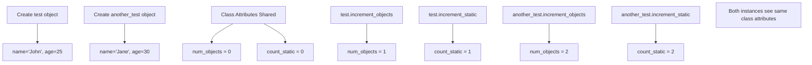

# Coding Guide: test.py

## Overview
This Python file demonstrates the differences between class methods and static methods in Object-Oriented Programming. It shows how class attributes are shared across all instances and how different types of methods interact with class and instance data.

---

## Complete Code

```python
class Test:
    num_objects = 0
    count_static = 0

    def __init__(self, name, age):
        self.name = name
        self.age = age

    @classmethod
    def increment_objects(self):
        self.num_objects += 1

    @classmethod
    def get_objects(self):
        return self.num_objects
    
    @staticmethod
    def increment_static():
        Test.count_static += 1

    @staticmethod
    def get_static():
        return Test.count_static
    
    
test = Test("John", 25)
another_test = Test("Jane", 30)

print(Test.count_static)
print(Test.num_objects)
test.increment_objects()
test.increment_static()
print(Test.num_objects)

another_test.increment_objects()
another_test.increment_static()

print(Test.count_static)
print(test.num_objects)
print(test.get_objects())
print(another_test.get_objects())
print(another_test.get_static())
```

---

## Detailed Explanation

### 1. Class Definition

```python
class Test:
    num_objects = 0      # Class attribute
    count_static = 0     # Class attribute
```

**Key Concepts:**

- **`class Test:`** - Defines a new class named Test
- **Class attributes** - Variables defined at class level (outside methods)
  - `num_objects` - Shared by all instances of the class
  - `count_static` - Another shared counter
- **Shared across all instances** - All objects of this class access the same variables
- **Access via class or instance** - `Test.num_objects` or `test.num_objects`

**Important:** Class attributes are NOT unique to each object - they're shared!

---

### 2. Constructor Method

```python
def __init__(self, name, age):
    self.name = name
    self.age = age
```

**Key Concepts:**

- **`__init__`** - Constructor (magic method), called automatically when creating object
- **`self`** - Reference to the current instance
- **`self.name = name`** - Creates instance attribute (unique to each object)
- **`self.age = age`** - Another instance attribute
- **Instance attributes** - Each object has its own copy

**Difference:**
- **Class attributes** (`num_objects`, `count_static`) - Shared by all objects
- **Instance attributes** (`name`, `age`) - Unique to each object

---

### 3. Class Methods

```python
@classmethod
def increment_objects(self):
    self.num_objects += 1

@classmethod
def get_objects(self):
    return self.num_objects
```

**Key Concepts:**

- **`@classmethod`** - Decorator that marks method as class method
- **First parameter** - Conventionally named `cls` (but here it's `self`)
  - Should be `cls` to avoid confusion, but works with any name
  - Receives the class itself, not an instance
- **`self.num_objects += 1`** - Modifies class attribute
  - Here `self` refers to the class, not instance
  - Better written as `cls.num_objects += 1`
- **Called on class or instance** - `Test.increment_objects()` or `test.increment_objects()`

**Note:** The parameter name `self` is misleading here - it should be `cls` for class methods!

**Better Version:**
```python
@classmethod
def increment_objects(cls):  # Use cls, not self
    cls.num_objects += 1
```

---

### 4. Static Methods

```python
@staticmethod
def increment_static():
    Test.count_static += 1

@staticmethod
def get_static():
    return Test.count_static
```

**Key Concepts:**

- **`@staticmethod`** - Decorator that marks method as static
- **No `self` or `cls` parameter** - Doesn't receive instance or class reference
- **Access class attributes via class name** - `Test.count_static`
- **Utility function** - Logically belongs to class but doesn't need instance/class data
- **Called on class or instance** - `Test.increment_static()` or `test.increment_static()`

**Difference from Class Method:**
- Class method receives class as first parameter (`cls`)
- Static method receives nothing - must use class name explicitly

---

### 5. Creating Objects

```python
test = Test("John", 25)
another_test = Test("Jane", 30)
```

**Key Concepts:**

- **`Test("John", 25)`** - Creates new Test object
  - Calls `__init__` automatically
  - Sets `name="John"`, `age=25`
- **Two separate objects** - Each has its own `name` and `age`
- **Share class attributes** - Both access same `num_objects` and `count_static`

**Memory Layout:**

```
test object:
  - name: "John"
  - age: 25
  - (shares) num_objects: 0
  - (shares) count_static: 0

another_test object:
  - name: "Jane"
  - age: 30
  - (shares) num_objects: 0
  - (shares) count_static: 0
```

---

### 6. Execution Flow and Output

Let's trace through the execution step by step:

```python
print(Test.count_static)  # Output: 0
```
- Accesses class attribute directly via class name
- Initial value: 0

```python
print(Test.num_objects)   # Output: 0
```
- Accesses class attribute directly via class name
- Initial value: 0

```python
test.increment_objects()
```
- Calls class method on `test` instance
- Increments `num_objects` from 0 to 1
- Class attribute now: `num_objects = 1`

```python
test.increment_static()
```
- Calls static method on `test` instance
- Increments `count_static` from 0 to 1
- Class attribute now: `count_static = 1`

```python
print(Test.num_objects)   # Output: 1
```
- Class attribute was modified by class method
- Shows: 1

```python
another_test.increment_objects()
```
- Calls class method on `another_test` instance
- Increments `num_objects` from 1 to 2
- Class attribute now: `num_objects = 2`

```python
another_test.increment_static()
```
- Calls static method on `another_test` instance
- Increments `count_static` from 1 to 2
- Class attribute now: `count_static = 2`

```python
print(Test.count_static)  # Output: 2
```
- Shows current value of class attribute: 2

```python
print(test.num_objects)   # Output: 2
```
- Accesses class attribute via instance
- Both instances share same class attribute
- Shows: 2

```python
print(test.get_objects())  # Output: 2
```
- Calls class method via instance
- Returns `num_objects`: 2

```python
print(another_test.get_objects())  # Output: 2
```
- Calls class method via different instance
- Returns same `num_objects`: 2 (shared!)

```python
print(another_test.get_static())  # Output: 2
```
- Calls static method via instance
- Returns `count_static`: 2

---

## Complete Output

```
0
0
1
2
2
2
2
2
```

---

## Comparison Table

| Feature | Instance Method | Class Method | Static Method |
|---------|----------------|--------------|---------------|
| Decorator | None | `@classmethod` | `@staticmethod` |
| First Parameter | `self` (instance) | `cls` (class) | None |
| Access Instance Data | Yes | No | No |
| Access Class Data | Yes | Yes | Yes (via class name) |
| Called On | Instance only | Class or instance | Class or instance |
| Use Case | Work with instance data | Work with class data | Utility functions |

---

## Visual Flow Diagram



---

## Key Takeaways

1. **Class Attributes are Shared**
   - All instances access the same class attributes
   - Modifying via one instance affects all instances

2. **Class Methods**
   - Receive class as first parameter (should be named `cls`)
   - Can modify class attributes
   - Called on class or instance

3. **Static Methods**
   - Don't receive instance or class parameter
   - Must use class name to access class attributes
   - Utility functions that belong to the class logically

4. **Instance Attributes are Unique**
   - Each object has its own copy
   - Not shared between instances

5. **Naming Convention**
   - Use `self` for instance methods
   - Use `cls` for class methods (not `self`!)
   - No parameter for static methods

---

## Common Mistakes

1. **Using `self` in class methods** - Should use `cls` for clarity
2. **Confusing class and instance attributes** - Class attributes are shared!
3. **Forgetting class name in static methods** - Must use `Test.count_static`, not `self.count_static`
4. **Expecting instance-specific class attributes** - They're shared by all instances!

---

## Improved Version

Here's a corrected version with better naming:

```python
class Test:
    num_objects = 0
    count_static = 0

    def __init__(self, name, age):
        self.name = name
        self.age = age

    @classmethod
    def increment_objects(cls):  # Use cls, not self
        cls.num_objects += 1

    @classmethod
    def get_objects(cls):  # Use cls, not self
        return cls.num_objects
    
    @staticmethod
    def increment_static():
        Test.count_static += 1

    @staticmethod
    def get_static():
        return Test.count_static
```

---

## Practice Exercises

1. Add an instance method that returns the object's name and age
2. Create a class method that resets all counters to zero
3. Add a static method that validates age (must be between 0 and 150)
4. Track the total number of objects created using a class attribute
5. Implement a class method that returns all created objects

---

**End of Coding Guide**
