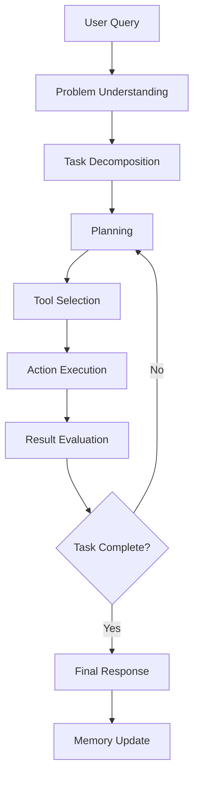

# Agentic AI - Comprehensive Study Guide

## 📚 Introduction: Understanding Agentic AI Like a Smart 12-Year-Old

### What is Agentic AI? 🤖

Imagine you have a super smart robot assistant that can:
- **Think** about problems like a human
- **Plan** step-by-step solutions
- **Use tools** to get information (like searching the internet, using a calculator, or checking a database)
- **Remember** what you talked about before
- **Make decisions** on its own

That's exactly what Agentic AI is! It's like having a digital helper that doesn't just answer questions, but can actually **DO things** for you by using different tools and thinking through problems step by step.

### How is it Different from Regular AI? 🔄

**Regular AI (like ChatGPT):**
- You ask a question → It gives an answer
- It only knows what it learned during training
- It can't use external tools or get new information
- Each conversation is separate

**Agentic AI:**
- You give it a task → It thinks, plans, uses tools, and completes the task
- It can search the internet, use databases, run calculations
- It remembers your conversation
- It can handle complex, multi-step tasks

### Real-Life Example 🌟

**You:** "I want to buy the cheapest flight to Paris and book a hotel near the Eiffel Tower"

**Regular AI:** "I can't help you book flights or hotels, but here's some general advice..."

**Agentic AI:** 
1. **Thinks:** "I need to search for flights and hotels"
2. **Plans:** "First find flights, then find hotels near Eiffel Tower, then compare prices"
3. **Acts:** Uses flight booking tool, hotel search tool
4. **Reports:** "Found 3 flight options, here are the prices. Found 5 hotels, here are the best ones with prices"

---

## 🧠 Technical Concepts Explained

### 1. Core Components of Agentic AI

#### **The Brain (LLM - Large Language Model)**
- This is like the "thinking" part of the agent
- It understands language, reasons through problems, and makes decisions
- Examples: GPT-4, Claude, Llama

#### **Memory System**
- **Short-term memory:** Remembers the current conversation
- **Long-term memory:** Can store information for future use
- Like how you remember what you talked about yesterday

#### **Tools and APIs**
- **Web Search:** Get real-time information from the internet
- **Databases:** Access stored information
- **Calculators:** Perform mathematical operations
- **APIs:** Connect to external services (weather, stocks, etc.)

#### **Planning and Reasoning**
- **Task Decomposition:** Breaking big tasks into smaller steps
- **Decision Making:** Choosing which tool to use when
- **Error Recovery:** What to do when something goes wrong

### 2. Key Technologies

#### **RAG (Retrieval Augmented Generation)**
Think of RAG like having a smart librarian:
1. **Retrieval:** Find relevant books/documents
2. **Augmentation:** Add that information to your question
3. **Generation:** Create an answer using both your question and the found information

**Why is RAG important?**
- LLMs have knowledge cutoffs (they don't know recent events)
- RAG allows them to access up-to-date information
- More accurate and reliable answers

#### **Vector Stores and Embeddings**
- **Embeddings:** Convert text into numbers that computers can understand
- **Vector Store:** A special database that stores these number representations
- **Similarity Search:** Find documents that are most similar to your question

#### **LangChain Framework**
- A toolkit that makes it easy to build AI applications
- Provides pre-built components for common tasks
- Handles the complex orchestration between different parts

### 3. Agent Lifecycle

**Step-by-Step Process:**
1. **Initiation:** Receive and understand the user's request
2. **Planning:** Break down the task into manageable steps
3. **Execution:** Use appropriate tools to gather information
4. **Adaptation:** Adjust plan based on results and feedback
5. **Completion:** Provide final answer and update memory

---

## 💡 Major Points from the Class Notes

### Transformers and Attention Mechanism
- **Transformers** are the building blocks of modern LLMs
- **Attention Mechanism** allows tokens to "pay attention" to other tokens
- **Parallelization** makes training faster and more efficient

### LLM Training Process
- **Pre-training:** Learn language patterns from massive internet data (self-supervised)
- **Fine-tuning:** Adapt to specific tasks with labeled data (supervised)
- **Alignment:** Learn human preferences and avoid harmful outputs

### LLM Limitations
- **Knowledge Cutoff:** Only knows information up to training date
- **Context Window:** Limited memory for long documents
- **Hallucination:** Can generate false information
- **Resource Intensive:** Requires significant computational power

### RAG vs Fine-tuning vs Off-the-shelf
- **Off-the-shelf:** Quick but generic, may lack domain knowledge
- **RAG:** Middle ground, adds external knowledge without retraining
- **Fine-tuning:** Most customized but expensive and time-consuming

### Agent vs Workflow
- **Workflow:** Pre-defined, hard-coded steps with no intelligence
- **Agent:** Dynamic, intelligent decision-making with reasoning capabilities
- **Agentic Workflow:** Combines both - structured process with intelligent agents at each step

---

## 🎯 Interview Questions and Detailed Answers

### For Machine Learning Engineer (MLE) Roles

#### Q1: Explain the difference between RAG and fine-tuning. When would you use each?

**Answer:**
- **RAG (Retrieval Augmented Generation):**
  - Adds external knowledge without changing model parameters
  - Faster to implement and update
  - Better for frequently changing information
  - Lower computational cost
  - Use when: Need up-to-date information, limited training data, or quick deployment

- **Fine-tuning:**
  - Modifies model parameters for specific tasks
  - Better performance for domain-specific tasks
  - Requires labeled training data
  - Higher computational cost
  - Use when: Have sufficient training data, need specialized behavior, or domain has unique jargon

**Industry Hierarchy:** Off-the-shelf → RAG → Fine-tuning → Continued Pre-training

#### Q2: How do you handle the context window limitation in LLMs?

**Answer:**
- **Chunking:** Break documents into smaller, overlapping pieces
- **Summarization:** Create summaries of long documents
- **Hierarchical Processing:** Process in layers (summary → details)
- **Sliding Window:** Process overlapping segments
- **Retrieval:** Only include most relevant parts in context

#### Q3: What are the key components of an AI agent architecture?

**Answer:**
- **LLM Core:** Reasoning and language understanding
- **Memory System:** Short-term (conversation) and long-term (persistent)
- **Tool Registry:** Available external tools and APIs
- **Planning Module:** Task decomposition and step sequencing
- **Execution Engine:** Tool invocation and result processing
- **Feedback Loop:** Error handling and plan adjustment

### For Software Development Engineer (SDE) in ML Roles

#### Q4: How would you design a scalable agentic AI system?

**Answer:**
- **Microservices Architecture:** Separate services for LLM, tools, memory
- **API Gateway:** Route requests and handle authentication
- **Caching Layer:** Store frequent queries and results
- **Load Balancing:** Distribute requests across multiple instances
- **Monitoring:** Track performance, costs, and errors
- **Security:** Input validation, rate limiting, data encryption

#### Q5: What are the challenges in implementing multi-agent systems?

**Answer:**
- **Communication:** How agents share information and coordinate
- **Conflict Resolution:** When agents have different recommendations
- **Resource Management:** Preventing resource conflicts
- **State Synchronization:** Keeping shared state consistent
- **Error Propagation:** Handling failures in agent chains
- **Performance:** Managing latency in multi-agent workflows

#### Q6: How do you ensure reliability and error handling in agentic systems?

**Answer:**
- **Retry Logic:** Automatic retries with exponential backoff
- **Fallback Mechanisms:** Alternative tools when primary fails
- **Circuit Breakers:** Prevent cascade failures
- **Input Validation:** Sanitize and validate all inputs
- **Timeout Handling:** Prevent infinite loops
- **Graceful Degradation:** Partial functionality when components fail

### Advanced Technical Questions

#### Q7: Explain the ReAct (Reasoning + Acting) framework.

**Answer:**
ReAct combines reasoning and acting in a loop:
1. **Thought:** Agent reasons about the current situation
2. **Action:** Agent decides to use a tool or provide an answer
3. **Observation:** Agent observes the result of the action
4. **Repeat:** Continue until task is complete

**Benefits:**
- More interpretable decision-making
- Better error recovery
- Improved planning capabilities

#### Q8: How do you optimize costs in LLM-based applications?

**Answer:**
- **Model Selection:** Use smaller models for simpler tasks
- **Caching:** Store and reuse common responses
- **Prompt Optimization:** Reduce token usage in prompts
- **Batch Processing:** Process multiple requests together
- **Local Models:** Use open-source models for sensitive data
- **Smart Routing:** Route simple queries to cheaper models

---

## 🔧 Practical Implementation Insights

### Building Production-Ready Agents

1. **Start Simple:** Begin with basic RAG, then add complexity
2. **Monitor Everything:** Track costs, latency, accuracy, user satisfaction
3. **Version Control:** Manage prompt versions and model updates
4. **Testing:** Comprehensive testing for edge cases and failures
5. **Security:** Implement proper authentication and data protection

### Common Pitfalls and Solutions

- **Infinite Loops:** Set maximum iteration limits
- **Tool Hallucination:** Validate tool calls before execution
- **Context Overflow:** Implement smart context management
- **Cost Explosion:** Set usage limits and monitoring alerts

### Performance Optimization

- **Parallel Tool Calls:** Execute independent tools simultaneously
- **Smart Caching:** Cache at multiple levels (embeddings, responses, tool results)
- **Model Optimization:** Use quantization and optimization techniques
- **Infrastructure:** Leverage GPUs and specialized hardware

---

## 📈 Future Trends and Considerations

### Emerging Patterns
- **Multi-Modal Agents:** Handling text, images, audio, video
- **Specialized Agents:** Domain-specific agents for different industries
- **Agent Orchestration:** Managing teams of specialized agents
- **Human-in-the-Loop:** Seamless human-AI collaboration

### Ethical and Safety Considerations
- **Bias Mitigation:** Ensuring fair and unbiased responses
- **Privacy Protection:** Handling sensitive user data
- **Transparency:** Making agent decisions interpretable
- **Control Mechanisms:** Maintaining human oversight

---

## 🎓 Key Takeaways

1. **Agentic AI represents the next evolution** from simple Q&A to intelligent task execution
2. **RAG is crucial** for keeping AI systems up-to-date with external knowledge
3. **Proper architecture** is essential for scalable, reliable systems
4. **Cost optimization** and monitoring are critical for production deployment
5. **The field is rapidly evolving** with new tools and frameworks emerging regularly

This comprehensive guide provides both the conceptual understanding and practical knowledge needed to work with Agentic AI systems in professional environments.