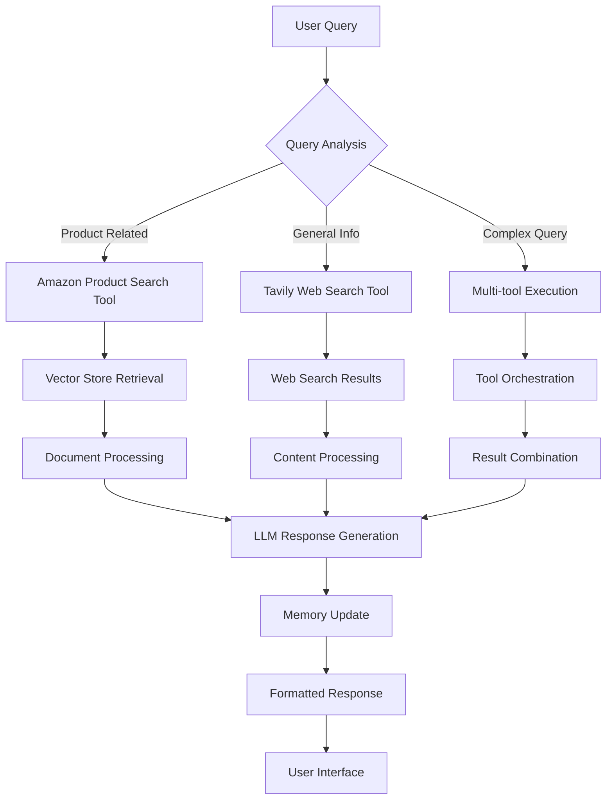

# Agentic AI Workshop - Comprehensive Coding Guide

## 📋 Overview
This coding guide explains the step-by-step implementation of an Agentic AI system using RAG (Retrieval Augmented Generation) and real-time web search capabilities. The workshop builds a product discovery chatbot that can search both internal product databases and external web sources.

---

## 🛠 Setup and Installation

### Required Libraries and Their Purpose

```python
# Core AI and ML libraries
from openai import OpenAI                    # OpenAI API for LLM access
import os                                    # Environment variable management
import getpass                              # Secure password/API key input

# LangChain Framework Components
from langchain.tools import tool             # Decorator for creating custom tools
from langchain.tools.retriever import create_retriever_tool  # Tool creation utility
from langchain_community.tools.tavily_search import TavilySearchResults  # Web search
from langchain_openai import OpenAIEmbeddings, ChatOpenAI  # OpenAI integrations
from langchain_community.vectorstores import FAISS  # Vector database
from langchain.text_splitter import RecursiveCharacterTextSplitter  # Document chunking
from langchain.chains import create_retrieval_chain, create_stuff_documents_chain  # RAG chains
from langchain_core.prompts import ChatPromptTemplate  # Prompt templates
from langchain_core.output_parsers import StrOutputParser  # Output formatting
from langchain.agents import create_react_agent, AgentExecutor  # Agent creation
from langchain_core.runnables.history import RunnableWithMessageHistory  # Memory
from langchain_community.chat_message_histories import ChatMessageHistory  # Chat history
from langchain import hub                    # Pre-built prompt templates

# Data Processing and UI
import pandas as pd                          # Data manipulation
import numpy as np                           # Numerical operations
import gradio as gr                          # Web UI creation
```

**Why these libraries?**
- **OpenAI**: Provides access to powerful language models (GPT-3.5, GPT-4)
- **LangChain**: Framework that simplifies building LLM applications with tools, memory, and chains
- **FAISS**: Facebook's efficient vector similarity search library
- **Gradio**: Creates web interfaces for ML models with minimal code
- **Pandas/NumPy**: Standard data processing libraries

---

## 🔍 Part 1: Understanding LLM Limitations

### 1.1 Basic LLM Query Setup

```python
# Secure API key input - never hardcode API keys!
OPENAI_API_KEY = getpass.getpass("Enter your OpenAI API key: ")

# Initialize OpenAI client
client = OpenAI(api_key=OPENAI_API_KEY)

# Define a query that tests knowledge cutoff
prompt = ''' What was uber's revenue in 2022? '''
```

**Key Concepts:**
- **API Key Security**: Using `getpass` prevents API keys from being visible in code
- **Knowledge Cutoff**: GPT-3.5-turbo was trained up to 2021, so it can't answer 2022 questions

### 1.2 Making API Calls

```python
# Send request to OpenAI API
openai_response = client.chat.completions.create(
    model='gpt-3.5-turbo',  # Older model with 2021 cutoff
    messages=[{'role': 'user', 'content': prompt}]
)

# Extract the response content
response_text = openai_response.choices[0].message.content
```

**Important Details:**
- **Message Structure**: OpenAI expects messages in specific format with 'role' and 'content'
- **Response Structure**: API returns complex object; we extract content from `choices[0].message.content`
- **Model Selection**: Different models have different capabilities and costs

### 1.3 Context Augmentation (Manual RAG)

```python
# Add external context to overcome knowledge limitations
retrieved_context = '''Revenue was $37.3 billion, up 17% year-over-year. 
                       Mobility revenue increased $5.8 billion primarily attributable to an increase in
                       Mobility Gross Bookings of 31% year-over-year.'''

# Augment the prompt with context
prompt = f"What was Uber's revenue in 2022? Check in {retrieved_context}"
```

**Why This Works:**
- **Context Injection**: Provides the LLM with information it didn't have during training
- **Prompt Engineering**: Explicitly tells the model to use the provided context
- **Immediate Solution**: Shows how RAG concept works at basic level

---

## 🗄 Part 2: Building a RAG System

### 2.1 Data Preparation

```python
# Load product dataset
import pandas as pd
df = pd.read_csv('sample_dataset.csv')

# Combine title and description for richer context
product_descriptions = []
for index, row in df.iterrows():
    # Create structured text combining title and description
    combined_text = f"Title\n{row['TITLE']}\nDescription\n{row['DESCRIPTION']}"
    product_descriptions.append(combined_text)
```

**Data Processing Strategy:**
- **Text Combination**: Merging title and description provides richer semantic content
- **Structured Format**: Adding labels ("Title", "Description") helps the LLM understand context
- **Null Handling**: The code handles cases where description might be empty

### 2.2 Document Chunking

```python
# Initialize text splitter for chunking documents
text_splitter = RecursiveCharacterTextSplitter(
    chunk_size=250,        # Maximum characters per chunk
    chunk_overlap=20,      # Overlap between consecutive chunks
    length_function=len    # Function to measure chunk length
)

# Create document objects from text
documents = text_splitter.create_documents(product_descriptions)
```

**Chunking Parameters Explained:**
- **chunk_size=250**: Keeps chunks small enough for efficient processing
- **chunk_overlap=20**: Ensures context isn't lost at chunk boundaries
- **RecursiveCharacterTextSplitter**: Intelligently splits on sentence/paragraph boundaries when possible

**Why Chunking is Necessary:**
- **Context Window Limits**: LLMs have maximum input token limits
- **Retrieval Precision**: Smaller chunks allow more precise matching
- **Processing Efficiency**: Smaller chunks are faster to embed and search

### 2.3 Vector Store Creation

```python
# Create embeddings and vector store in one step
vector_store = FAISS.from_documents(
    documents=documents,                    # Chunked documents
    embedding=OpenAIEmbeddings()           # OpenAI's embedding model
)
```

**What Happens Here:**
1. **Embedding Generation**: Each document chunk is converted to a vector representation
2. **Vector Storage**: FAISS efficiently stores and indexes these vectors
3. **Similarity Search Setup**: Enables fast retrieval of similar documents

**FAISS Advantages:**
- **Speed**: Optimized for fast similarity search
- **Memory Efficiency**: Compressed vector storage
- **Scalability**: Handles millions of vectors efficiently

### 2.4 Building the Retrieval Chain

```python
# Initialize the LLM for generation
llm = ChatOpenAI(
    model="gpt-4o-mini",    # Newer, more capable model
    temperature=0           # Deterministic responses
)

# Create prompt template for RAG
prompt_template = ChatPromptTemplate.from_template("""
Answer the following question based only on the provided context:

Context: {context}

Question: {input}
""")

# Create document processing chain
document_chain = create_stuff_documents_chain(llm, prompt_template)

# Create retriever from vector store
retriever = vector_store.as_retriever()

# Combine retrieval and generation
retrieval_chain = create_retrieval_chain(retriever, document_chain)
```

**Chain Components:**
- **Document Chain**: Processes retrieved documents with LLM
- **Retriever**: Finds relevant documents from vector store
- **Retrieval Chain**: Orchestrates the entire RAG process

**Temperature Setting:**
- **temperature=0**: Produces consistent, factual responses
- **Higher temperatures**: More creative but potentially less accurate

---

## 🔧 Part 3: Creating Custom Tools

### 3.1 Amazon Product Search Tool

```python
from langchain.tools import tool

@tool
def amazon_product_search(query: str):
    """Search for information about Amazon products.
    For any questions related to Amazon products, this tool must be used."""
    
    # Create retriever tool wrapper
    retriever_tool = create_retriever_tool(
        retriever,                          # Our vector store retriever
        name="amazon_search",               # Tool identifier
        description="Search for information about Amazon products."
    )
    
    # Execute the search
    return retriever_tool.invoke(query)
```

**Tool Design Principles:**
- **@tool Decorator**: Automatically creates LangChain-compatible tool
- **Clear Docstring**: Helps the agent understand when to use this tool
- **Descriptive Name**: Makes tool selection more reliable

### 3.2 Web Search Tool with Tavily

```python
@tool
def search_tavily(query: str):
    """
    Executes a web search using the TavilySearchResults tool.
    
    Parameters:
        query (str): The search query entered by the user.
    
    Returns:
        list: A list of search results containing answers, raw content, and images.
    """
    # Configure Tavily search with comprehensive results
    search_tool = TavilySearchResults(
        max_results=5,              # Limit number of results
        include_answer=True,        # Get direct answers when available
        include_raw_content=True,   # Full text content
        include_images=True,        # Include relevant images
    )
    
    return search_tool.invoke(query)
```

**Tavily Configuration:**
- **max_results=5**: Balances comprehensiveness with processing speed
- **include_answer=True**: Provides direct answers for factual queries
- **include_raw_content=True**: Gives full context for complex questions
- **include_images=True**: Enhances responses with visual content

---

## 🤖 Part 4: Agent Creation and Execution

### 4.1 ReAct Agent Setup

```python
# Pull pre-built ReAct prompt from LangChain Hub
prompt = hub.pull("hwchase17/react")

# Define available tools
tools = [search_tavily, amazon_product_search]

# Create ReAct agent
react_agent = create_react_agent(
    llm=llm,           # Language model for reasoning
    tools=tools,       # Available tools
    prompt=prompt      # ReAct-style prompt template
)
```

**ReAct Framework:**
- **Reasoning**: Agent thinks through the problem
- **Acting**: Agent decides which tool to use
- **Observation**: Agent processes tool results
- **Iteration**: Continues until task completion

### 4.2 Agent Executor Configuration

```python
# Create agent executor with safety measures
agent_executor = AgentExecutor(
    agent=react_agent,              # The ReAct agent
    tools=tools,                    # Available tools
    verbose=True,                   # Show reasoning process
    handle_parsing_errors=True,     # Graceful error handling
    max_iterations=5                # Prevent infinite loops
)
```

**Safety and Reliability Features:**
- **verbose=True**: Provides transparency in agent decision-making
- **handle_parsing_errors=True**: Prevents crashes from malformed tool calls
- **max_iterations=5**: Prevents infinite reasoning loops

### 4.3 Agent Execution Examples

```python
# Example 1: Amazon-only query
result = agent_executor.invoke({
    "input": "What is the best shoes I can find on Amazon?"
})

# Example 2: Web search query
result = agent_executor.invoke({
    "input": "What is the current weather in Toronto?"
})

# Example 3: Multi-tool query
result = agent_executor.invoke({
    "input": "How to install Backsplash Wallpaper? Also find some brands on Amazon"
})
```

**Agent Decision Making:**
- Agent analyzes the query to determine which tools are needed
- Can use single tools or combine multiple tools
- Provides reasoning for tool selection

---

## 💾 Part 5: Adding Memory and Multi-turn Capabilities

### 5.1 Chat History Setup

```python
# Pull conversational ReAct prompt
prompt = hub.pull("hwchase17/react-chat")

# Initialize chat message history
memory = ChatMessageHistory(session_id="test-session")
memory.clear()  # Start with clean history
```

**Memory Components:**
- **ChatMessageHistory**: Stores conversation context
- **Session ID**: Enables multiple concurrent conversations
- **Clear Method**: Resets conversation when needed

### 5.2 Agent with Memory

```python
# Create agent with conversation history
agent_with_chat_history = RunnableWithMessageHistory(
    agent_executor,                     # Base agent executor
    lambda session_id: memory,          # Memory retrieval function
    input_messages_key="input",         # Input key in messages
    history_messages_key="chat_history" # History key in context
)
```

**Memory Integration:**
- **RunnableWithMessageHistory**: Wrapper that adds memory to any runnable
- **Session Management**: Handles multiple conversation threads
- **Context Injection**: Automatically includes relevant history in prompts

### 5.3 Multi-turn Conversation Example

```python
# First query - establishes context
response1 = agent_with_chat_history.invoke(
    {"input": "What is the latest fashion trends in 2025?"},
    config={"configurable": {"session_id": "<foo>"}}
)

# Follow-up query - uses previous context
response2 = agent_with_chat_history.invoke(
    {"input": "Can I get these trends from Amazon?"},
    config={"configurable": {"session_id": "<foo>"}}
)
```

**Context Retention:**
- Agent remembers "fashion trends in 2025" from first query
- Second query references "these trends" without repetition
- Maintains coherent conversation flow

---

## 🎨 Part 6: Building User Interface with Gradio

### 6.1 Response Processing Function

```python
def final_response(user_query):
    """
    Process user query and return formatted product recommendations.
    
    Args:
        user_query (str): User's question or request
        
    Returns:
        str: Formatted response with product names
    """
    # Get initial response from retrieval chain
    response = retrieval_chain.invoke({"input": user_query})['answer']
    
    # Create formatting prompt for cleaner output
    format_prompt = f"""Format the responses properly in {response}. 
                       Just return the product names, no other text"""
    
    # Use OpenAI for response formatting
    openai_response = client.chat.completions.create(
        model='gpt-4o-mini',
        messages=[{'role': 'user', 'content': format_prompt}]
    )
    
    return openai_response.choices[0].message.content
```

**Response Processing Strategy:**
- **Two-stage Processing**: First get comprehensive answer, then format it
- **Prompt Engineering**: Specific instructions for clean formatting
- **Model Selection**: Using newer model for better formatting capabilities

### 6.2 Gradio Interface Creation

```python
# Create Gradio web interface
app = gr.Interface(
    fn=final_response,                  # Processing function
    inputs="text",                      # Text input box
    outputs="text",                     # Text output display
    title="Review Genie",               # Application title
    description="Type your question below to get the recommendations",
    theme="Ocean",                      # Visual theme
    allow_flagging="never"              # Disable feedback buttons
)

# Launch the application
app.launch()
```

**UI Configuration:**
- **fn=final_response**: Links UI to processing function
- **inputs/outputs="text"**: Simple text-based interface
- **theme="Ocean"**: Professional appearance
- **allow_flagging="never"**: Cleaner interface without feedback buttons

---

## 🔄 System Architecture Flow



---

## ⚡ Performance Optimization Tips

### 1. Caching Strategies
```python
# Cache embeddings to avoid recomputation
@lru_cache(maxsize=1000)
def get_embedding(text):
    return embedding_model.embed_query(text)

# Cache frequent queries
query_cache = {}
if query in query_cache:
    return query_cache[query]
```

### 2. Batch Processing
```python
# Process multiple documents at once
embeddings = embedding_model.embed_documents(document_batch)
```

### 3. Async Operations
```python
import asyncio

async def async_tool_call(tool, query):
    return await tool.ainvoke(query)

# Run multiple tools concurrently
results = await asyncio.gather(
    async_tool_call(tool1, query),
    async_tool_call(tool2, query)
)
```

---

## 🛡 Error Handling and Best Practices

### 1. Robust Error Handling
```python
try:
    result = agent_executor.invoke({"input": query})
except Exception as e:
    logger.error(f"Agent execution failed: {e}")
    return "I apologize, but I encountered an error processing your request."
```

### 2. Input Validation
```python
def validate_query(query):
    if not query or len(query.strip()) == 0:
        raise ValueError("Query cannot be empty")
    if len(query) > 1000:
        raise ValueError("Query too long")
    return query.strip()
```

### 3. Rate Limiting
```python
from time import sleep
import random

def rate_limited_api_call(func, *args, **kwargs):
    sleep(random.uniform(0.1, 0.5))  # Random delay
    return func(*args, **kwargs)
```

---

## 📊 Monitoring and Debugging

### 1. Logging Setup
```python
import logging

logging.basicConfig(
    level=logging.INFO,
    format='%(asctime)s - %(name)s - %(levelname)s - %(message)s'
)

logger = logging.getLogger(__name__)
```

### 2. Performance Metrics
```python
import time

def measure_performance(func):
    def wrapper(*args, **kwargs):
        start_time = time.time()
        result = func(*args, **kwargs)
        end_time = time.time()
        logger.info(f"{func.__name__} took {end_time - start_time:.2f} seconds")
        return result
    return wrapper
```

### 3. Cost Tracking
```python
def track_token_usage(response):
    usage = response.usage
    logger.info(f"Tokens used - Prompt: {usage.prompt_tokens}, "
                f"Completion: {usage.completion_tokens}, "
                f"Total: {usage.total_tokens}")
```

---

## 🎯 Key Takeaways

1. **Modular Design**: Each component (RAG, tools, memory) can be developed and tested independently
2. **Error Resilience**: Proper error handling prevents system crashes and improves user experience
3. **Performance Optimization**: Caching, batching, and async operations significantly improve response times
4. **User Experience**: Clean interfaces and formatted responses make the system more accessible
5. **Monitoring**: Comprehensive logging and metrics enable continuous improvement

This coding guide provides a complete foundation for building production-ready agentic AI systems with proper architecture, error handling, and optimization strategies.