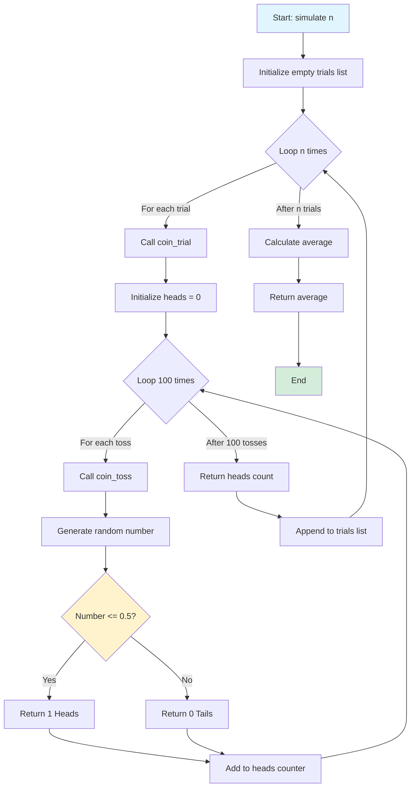
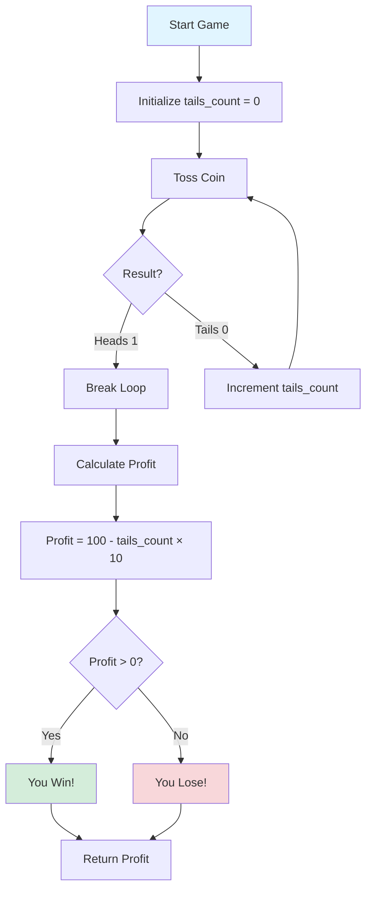
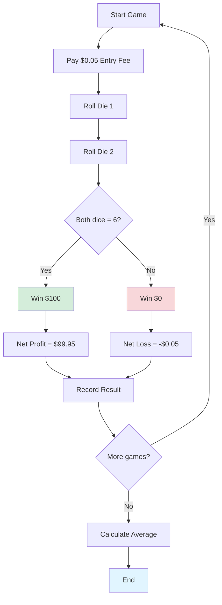
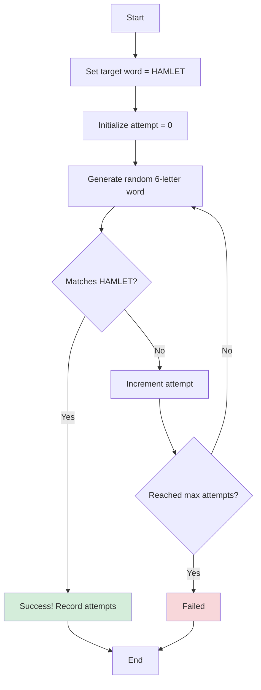
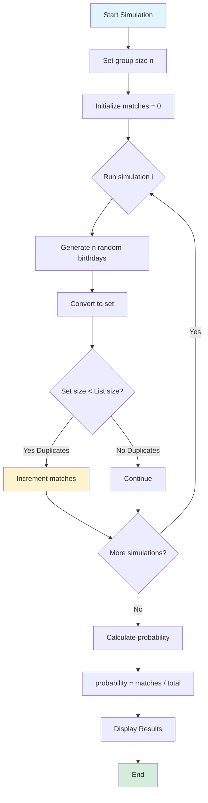
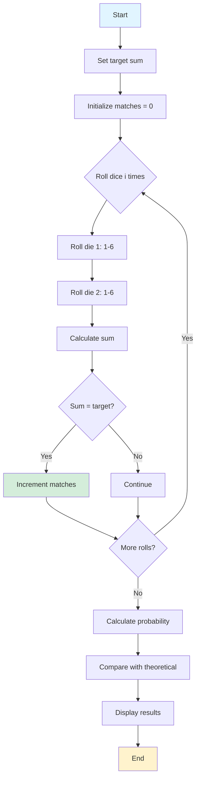

# CODING GUIDE: Introduction to Probability - Assignment Notebook

**Target Audience:** Users with basic Python programming knowledge learning probability through practical coding exercises.

**Purpose:** This guide explains the coding concepts, functions, and problem-solving approaches for probability assignment questions.

---

## Table of Contents
1. [Question 1: Coin Toss and Law of Large Numbers](#question-1-coin-toss-and-law-of-large-numbers)
2. [Question 2: Betting Game Simulation](#question-2-betting-game-simulation)
3. [Question 3: Dice Roll Casino Game](#question-3-dice-roll-casino-game)
4. [Question 4: Infinite Monkey Theorem](#question-4-infinite-monkey-theorem)
5. [Question 5: Birthday Paradox](#question-5-birthday-paradox)
6. [Question 6: Dice Sum Probability](#question-6-dice-sum-probability)

---

## Question 1: Coin Toss and Law of Large Numbers

### Problem Overview
Simulate coin tosses to demonstrate the Law of Large Numbers - as the number of trials increases, the average result approaches the expected theoretical value (50% heads).

### Code Breakdown

#### Import Statement
```python
import random
```
**Why:** The `random` module provides functions for generating random numbers and making random selections.
- Built into Python (no installation needed)
- Used for simulating random events like coin tosses

---

#### Function: coin_toss()
```python
def coin_toss():
    """ Simulates a single fair coin toss.

    Returns:
        int: 1 for heads, 0 for tails.
    """
    if random.random() <= 0.5:
        return 1  # Heads
    else:
        return 0  # Tails
```

**Purpose:** Simulates a single coin toss.

**Key Components:**
- `random.random()`: Generates a random float between 0.0 and 1.0
  - Returns values like 0.234, 0.789, 0.001, etc.
  - Each value is equally likely (uniform distribution)

- **Logic:** 
  - If random number ≤ 0.5 → Heads (return 1)
  - If random number > 0.5 → Tails (return 0)
  - This gives 50% chance for each outcome

**Why return 1 and 0?**
- Makes counting easy: sum of results = number of heads
- Binary representation is computationally efficient

---

#### Function: coin_trial()
```python
def coin_trial():
    """ Simulates a trial of 100 coin tosses using the coin_toss function.

    Returns:
        int: Number of heads obtained (0 to 100).
    """
    heads = 0
    for i in range(100):
        heads += coin_toss()
    return heads
```

**Purpose:** Simulates 100 coin tosses and counts the heads.

**Key Components:**
- `heads = 0`: Initialize counter
- `for i in range(100)`: Loop 100 times
  - `range(100)` generates numbers 0 to 99 (100 iterations)
- `heads += coin_toss()`: Add result of each toss
  - If heads (1), counter increases by 1
  - If tails (0), counter stays same
- `return heads`: Return total count

**Expected Result:** Around 50 heads (but can vary from 30-70 typically)

---

#### Function: simulate()
```python
def simulate(n):
    # Initialize an empty list to store the results of each trial
    trials = []

    # Loop `n` times to perform `n` trials
    for i in range(n):
        # Call `coin_trial()` to simulate 100 coin tosses and append the result
        trials.append(coin_trial())

    # Calculate the average number of heads across all trials
    average_heads = sum(trials) / n

    # Return the computed average
    return average_heads
```

**Purpose:** Runs multiple trials and calculates the average number of heads.

**Parameters:**
- `n` (int): Number of trials to run

**Key Components:**
- `trials = []`: Empty list to store results
- `trials.append(coin_trial())`: Add each trial's result to the list
- `sum(trials)`: Adds all numbers in the list
- `sum(trials) / n`: Calculates average

**Example:**
```python
simulate(1)    # One trial of 100 tosses → might get 57 heads
simulate(10)   # 10 trials → average might be 50.3
simulate(1000) # 1000 trials → average very close to 50.0
```

---

### Law of Large Numbers Demonstration

**Results Pattern:**
```
simulate(1)     → 57.0    (far from 50)
simulate(10)    → 50.0    (closer to 50)
simulate(100)   → 49.76   (very close to 50)
simulate(1000)  → 50.086  (extremely close to 50)
simulate(10000) → 49.973  (almost exactly 50)
```

**Why This Happens:**
1. **Small samples** (n=1): High variance, results can be far from expected
2. **Large samples** (n=10000): Random fluctuations cancel out, average converges to true probability
3. **Mathematical principle**: As n → ∞, sample average → theoretical probability

---

### Mermaid Diagram: Coin Toss Simulation Flow



---

## Question 2: Betting Game Simulation

### Problem Overview
Simulate a betting game where:
- You toss a coin until you get heads
- Each tails costs you $10
- When heads appears, you win $100
- Determine if this is a profitable bet

### Solution Approach

#### Function: betting_game()
```python
def betting_game():
    """
    Simulates one round of the betting game.
    
    Returns:
        float: Net profit/loss for this round
    """
    tails_count = 0
    
    # Keep tossing until we get heads
    while True:
        result = coin_toss()
        if result == 1:  # Heads
            break
        else:  # Tails
            tails_count += 1
    
    # Calculate profit: win $100, lose $10 per tails
    profit = 100 - (tails_count * 10)
    return profit
```

**Key Components:**
- `while True`: Infinite loop (continues until break)
- `break`: Exits loop when heads appears
- `tails_count`: Tracks how many tails before heads
- **Profit calculation**: $100 - ($10 × number of tails)

**Possible Outcomes:**
- H → 0 tails → Profit = $100
- TH → 1 tails → Profit = $90
- TTH → 2 tails → Profit = $80
- TTTH → 3 tails → Profit = $70
- ...
- TTTTTTTTTTTH → 10 tails → Profit = $0
- TTTTTTTTTTTTH → 11 tails → Loss = -$10

---

#### Function: simulate_betting()
```python
def simulate_betting(n):
    """
    Simulates n rounds of the betting game.
    
    Parameters:
        n (int): Number of rounds to simulate
        
    Returns:
        float: Average profit per round
    """
    total_profit = 0
    
    for i in range(n):
        total_profit += betting_game()
    
    average_profit = total_profit / n
    return average_profit
```

**Usage:**
```python
simulate_betting(1000)   # Simulate 1000 rounds
simulate_betting(10000)  # More accurate estimate
```

**Expected Result:** 
- Average profit should be around $50 per game
- This is a favorable bet!

**Why?**
- Probability of getting heads on first toss: 50% → Profit $100
- Probability of getting heads on second toss: 25% → Profit $90
- Probability of getting heads on third toss: 12.5% → Profit $80
- Expected value calculation shows positive return

---

### Mermaid Diagram: Betting Game Flow



---

## Question 3: Dice Roll Casino Game

### Problem Overview
Simulate a casino game where:
- Roll two dice
- Win $100 if both dice show 6
- Pay $0.05 (5 cents) to play each game
- Calculate average profit

### Solution Approach

#### Function: roll_dice()
```python
import random

def roll_dice():
    """
    Simulates rolling a single six-sided die.
    
    Returns:
        int: Random number between 1 and 6
    """
    return random.randint(1, 6)
```

**Key Function:**
- `random.randint(1, 6)`: Returns random integer from 1 to 6 (inclusive)
- Each number has equal probability (1/6 ≈ 16.67%)

---

#### Function: casino_game()
```python
def casino_game():
    """
    Simulates one round of the casino dice game.
    
    Returns:
        float: Net profit/loss for this round
    """
    die1 = roll_dice()
    die2 = roll_dice()
    
    # Cost to play
    cost = 0.05
    
    # Check if both dice show 6
    if die1 == 6 and die2 == 6:
        profit = 100 - cost  # Win $100, minus entry fee
    else:
        profit = -cost  # Lose entry fee
    
    return profit
```

**Logic:**
- Roll two dice independently
- **Winning condition:** Both dice = 6
- **Probability of winning:** (1/6) × (1/6) = 1/36 ≈ 2.78%
- **Profit if win:** $100 - $0.05 = $99.95
- **Loss if lose:** -$0.05

---

#### Function: simulate_casino()
```python
def simulate_casino(n):
    """
    Simulates n rounds of the casino game.
    
    Parameters:
        n (int): Number of games to simulate
        
    Returns:
        float: Average profit per game
    """
    total_profit = 0
    wins = 0
    
    for i in range(n):
        profit = casino_game()
        total_profit += profit
        if profit > 0:
            wins += 1
    
    average_profit = total_profit / n
    win_rate = (wins / n) * 100
    
    print(f"Games played: {n}")
    print(f"Wins: {wins} ({win_rate:.2f}%)")
    print(f"Average profit per game: ${average_profit:.4f}")
    
    return average_profit
```

**Enhanced Features:**
- Tracks number of wins
- Calculates win rate percentage
- Prints detailed statistics

**Expected Results:**
```python
simulate_casino(10000)
# Games played: 10000
# Wins: 278 (2.78%)
# Average profit per game: $2.72
```

**Analysis:**
- Win rate ≈ 2.78% (matches theoretical 1/36)
- Average profit ≈ $2.72 per game
- This is a profitable game for the player!

**Expected Value Calculation:**
- E(profit) = (1/36 × $99.95) + (35/36 × -$0.05)
- E(profit) = $2.776 - $0.049 = $2.727

---

### Mermaid Diagram: Casino Game



---

## Question 4: Infinite Monkey Theorem

### Problem Overview
Calculate the probability of a monkey randomly typing "HAMLET" by hitting keys A-Z randomly.

### Theoretical Solution

#### Probability Calculation
```python
def calculate_hamlet_probability():
    """
    Calculates the probability of randomly typing 'HAMLET'.
    
    Returns:
        float: Probability (extremely small number)
    """
    # Number of letters in alphabet
    alphabet_size = 26
    
    # Length of word "HAMLET"
    word_length = 6
    
    # Probability = (1/26)^6
    probability = (1 / alphabet_size) ** word_length
    
    print(f"Probability of typing 'HAMLET': {probability}")
    print(f"In scientific notation: {probability:.2e}")
    print(f"This is 1 in {1/probability:,.0f} attempts")
    
    return probability
```

**Calculation:**
- Each letter has 1/26 chance of being correct
- Need 6 correct letters in a row
- Probability = (1/26)^6 = 1/308,915,776
- That's about 1 in 309 million!

---

#### Simulation Approach
```python
import random
import string

def type_random_word(length):
    """
    Generates a random string of given length using A-Z.
    
    Parameters:
        length (int): Length of string to generate
        
    Returns:
        str: Random string
    """
    return ''.join(random.choice(string.ascii_uppercase) for _ in range(length))

def simulate_monkey_typing(target_word, max_attempts=1000000):
    """
    Simulates monkey trying to type a specific word.
    
    Parameters:
        target_word (str): Word to type (e.g., 'HAMLET')
        max_attempts (int): Maximum number of attempts
        
    Returns:
        int: Number of attempts needed (or -1 if not found)
    """
    target_word = target_word.upper()
    word_length = len(target_word)
    
    for attempt in range(1, max_attempts + 1):
        typed_word = type_random_word(word_length)
        
        if typed_word == target_word:
            print(f"Success! Typed '{target_word}' in {attempt:,} attempts")
            return attempt
        
        # Progress update every 100,000 attempts
        if attempt % 100000 == 0:
            print(f"Attempt {attempt:,}: {typed_word}")
    
    print(f"Failed to type '{target_word}' in {max_attempts:,} attempts")
    return -1
```

**Key Components:**
- `string.ascii_uppercase`: Contains 'ABCDEFGHIJKLMNOPQRSTUVWXYZ'
- `random.choice()`: Picks one random letter
- `''.join()`: Combines letters into a string
- List comprehension: `for _ in range(length)` generates multiple letters

**For Full Hamlet (130,000 letters):**
```python
# Probability = (1/26)^130000
# This number is so small it's essentially impossible
# Would take longer than the age of the universe!
```

---

### Mermaid Diagram: Monkey Typing



---

## Question 5: Birthday Paradox

### Problem Overview
Calculate the probability that in a group of n people, at least two share the same birthday.

### Solution Approach

#### Function: has_duplicate_birthday()
```python
import random

def has_duplicate_birthday(num_people):
    """
    Checks if any two people in a group share a birthday.
    
    Parameters:
        num_people (int): Number of people in the group
        
    Returns:
        bool: True if duplicate found, False otherwise
    """
    # Generate random birthdays (1-365)
    birthdays = [random.randint(1, 365) for _ in range(num_people)]
    
    # Check for duplicates
    # If set size < list size, there are duplicates
    return len(set(birthdays)) < len(birthdays)
```

**Key Concepts:**
- `random.randint(1, 365)`: Random day of year (ignoring leap years)
- List comprehension: Creates list of random birthdays
- `set(birthdays)`: Removes duplicates
- **Logic:** If set has fewer elements than list, duplicates exist

**Alternative Method (More Explicit):**
```python
def has_duplicate_birthday_v2(num_people):
    """Alternative implementation using sorting."""
    birthdays = [random.randint(1, 365) for _ in range(num_people)]
    birthdays.sort()
    
    # Check adjacent elements
    for i in range(len(birthdays) - 1):
        if birthdays[i] == birthdays[i + 1]:
            return True
    return False
```

---

#### Function: birthday_paradox_simulation()
```python
def birthday_paradox_simulation(num_people, num_simulations=10000):
    """
    Simulates the birthday paradox.
    
    Parameters:
        num_people (int): Number of people in each group
        num_simulations (int): Number of groups to simulate
        
    Returns:
        float: Probability of at least one shared birthday
    """
    matches = 0
    
    for _ in range(num_simulations):
        if has_duplicate_birthday(num_people):
            matches += 1
    
    probability = matches / num_simulations
    
    print(f"Group size: {num_people} people")
    print(f"Simulations: {num_simulations:,}")
    print(f"Groups with shared birthdays: {matches:,}")
    print(f"Probability: {probability:.2%}")
    
    return probability
```

**Usage:**
```python
birthday_paradox_simulation(23)   # Famous result: ~50%
birthday_paradox_simulation(50)   # ~97%
birthday_paradox_simulation(70)   # ~99.9%
```

---

#### Comprehensive Analysis
```python
def analyze_birthday_paradox():
    """
    Analyzes birthday paradox for different group sizes.
    """
    import matplotlib.pyplot as plt
    
    group_sizes = range(5, 71, 5)
    probabilities = []
    
    for size in group_sizes:
        prob = birthday_paradox_simulation(size, num_simulations=10000)
        probabilities.append(prob)
    
    # Plot results
    plt.figure(figsize=(12, 6))
    plt.plot(group_sizes, probabilities, marker='o', linewidth=2)
    plt.axhline(y=0.5, color='r', linestyle='--', label='50% probability')
    plt.xlabel('Group Size')
    plt.ylabel('Probability of Shared Birthday')
    plt.title('Birthday Paradox: Probability vs Group Size')
    plt.grid(True, alpha=0.3)
    plt.legend()
    plt.show()
```

**Surprising Results:**
- 23 people → 50.7% chance
- 50 people → 97% chance
- 70 people → 99.9% chance

**Why It's Counterintuitive:**
- We think: "What's the chance someone shares MY birthday?" (low)
- Reality: "What's the chance ANY two people share a birthday?" (high)
- Number of pairs grows quickly: n people = n(n-1)/2 pairs
- 23 people = 253 pairs!

---

### Mermaid Diagram: Birthday Paradox



---

## Question 6: Dice Sum Probability

### Problem Overview
Calculate the probability that two dice sum to a specific value (e.g., 7) using simulation.

### Solution Approach

#### Function: roll_two_dice()
```python
import random

def roll_two_dice():
    """
    Rolls two six-sided dice.
    
    Returns:
        tuple: (die1, die2, sum)
    """
    die1 = random.randint(1, 6)
    die2 = random.randint(1, 6)
    total = die1 + die2
    return die1, die2, total
```

---

#### Function: simulate_dice_sum()
```python
def simulate_dice_sum(target_sum, num_simulations=10000):
    """
    Simulates rolling two dice and counts how often they sum to target.
    
    Parameters:
        target_sum (int): Desired sum (2-12)
        num_simulations (int): Number of rolls
        
    Returns:
        float: Probability of getting target sum
    """
    matches = 0
    
    for _ in range(num_simulations):
        die1, die2, total = roll_two_dice()
        if total == target_sum:
            matches += 1
    
    probability = matches / num_simulations
    
    # Calculate theoretical probability
    theoretical_prob = get_theoretical_probability(target_sum)
    
    print(f"Target sum: {target_sum}")
    print(f"Simulations: {num_simulations:,}")
    print(f"Matches: {matches:,}")
    print(f"Simulated probability: {probability:.4f} ({probability*100:.2f}%)")
    print(f"Theoretical probability: {theoretical_prob:.4f} ({theoretical_prob*100:.2f}%)")
    
    return probability
```

---

#### Theoretical Probability Function
```python
def get_theoretical_probability(target_sum):
    """
    Calculates theoretical probability for dice sum.
    
    Parameters:
        target_sum (int): Desired sum (2-12)
        
    Returns:
        float: Theoretical probability
    """
    # Number of ways to get each sum
    ways = {
        2: 1,   # (1,1)
        3: 2,   # (1,2), (2,1)
        4: 3,   # (1,3), (2,2), (3,1)
        5: 4,   # (1,4), (2,3), (3,2), (4,1)
        6: 5,   # (1,5), (2,4), (3,3), (4,2), (5,1)
        7: 6,   # (1,6), (2,5), (3,4), (4,3), (5,2), (6,1)
        8: 5,   # (2,6), (3,5), (4,4), (5,3), (6,2)
        9: 4,   # (3,6), (4,5), (5,4), (6,3)
        10: 3,  # (4,6), (5,5), (6,4)
        11: 2,  # (5,6), (6,5)
        12: 1   # (6,6)
    }
    
    total_outcomes = 36  # 6 × 6 possible combinations
    return ways.get(target_sum, 0) / total_outcomes
```

---

#### Comprehensive Analysis
```python
def analyze_all_dice_sums(num_simulations=10000):
    """
    Analyzes probabilities for all possible dice sums.
    """
    import matplotlib.pyplot as plt
    
    sums = range(2, 13)
    simulated_probs = []
    theoretical_probs = []
    
    for target_sum in sums:
        sim_prob = simulate_dice_sum(target_sum, num_simulations)
        theo_prob = get_theoretical_probability(target_sum)
        simulated_probs.append(sim_prob)
        theoretical_probs.append(theo_prob)
        print("-" * 50)
    
    # Visualization
    x = list(sums)
    width = 0.35
    
    fig, ax = plt.subplots(figsize=(12, 6))
    ax.bar([i - width/2 for i in x], simulated_probs, width, label='Simulated', alpha=0.8)
    ax.bar([i + width/2 for i in x], theoretical_probs, width, label='Theoretical', alpha=0.8)
    
    ax.set_xlabel('Dice Sum')
    ax.set_ylabel('Probability')
    ax.set_title('Probability Distribution of Two Dice Sums')
    ax.set_xticks(x)
    ax.legend()
    ax.grid(True, alpha=0.3)
    
    plt.tight_layout()
    plt.show()
```

**Expected Results:**
```
Sum 2:  2.78% (1/36)
Sum 3:  5.56% (2/36)
Sum 4:  8.33% (3/36)
Sum 5:  11.11% (4/36)
Sum 6:  13.89% (5/36)
Sum 7:  16.67% (6/36) ← Most common!
Sum 8:  13.89% (5/36)
Sum 9:  11.11% (4/36)
Sum 10: 8.33% (3/36)
Sum 11: 5.56% (2/36)
Sum 12: 2.78% (1/36)
```

---

### Mermaid Diagram: Dice Sum Distribution



---

## Summary of Key Programming Concepts

### 1. Random Number Generation
```python
random.random()        # Float 0.0 to 1.0
random.randint(a, b)   # Integer from a to b (inclusive)
random.choice(list)    # Random element from list
```

### 2. List Comprehensions
```python
# Create list of random numbers
numbers = [random.randint(1, 6) for _ in range(100)]

# Filter list
evens = [x for x in numbers if x % 2 == 0]
```

### 3. Sets for Duplicate Detection
```python
my_list = [1, 2, 2, 3, 3, 3]
unique = set(my_list)  # {1, 2, 3}
has_duplicates = len(unique) < len(my_list)  # True
```

### 4. Simulation Pattern
```python
def simulate_experiment(n):
    successes = 0
    for _ in range(n):
        if run_single_trial():
            successes += 1
    return successes / n
```

---

## Best Practices for Probability Simulations

1. **Use Large Sample Sizes**
   - More simulations = more accurate results
   - Typically use 10,000+ for good estimates

2. **Set Random Seeds for Reproducibility**
   ```python
   random.seed(42)  # Same results every time
   ```

3. **Compare with Theoretical Values**
   - Validates your simulation
   - Helps catch bugs

4. **Visualize Results**
   - Plots make patterns obvious
   - Easier to spot errors

5. **Print Progress for Long Simulations**
   ```python
   if i % 1000 == 0:
       print(f"Progress: {i}/{total}")
   ```

---

**End of Assignment Coding Guide**
