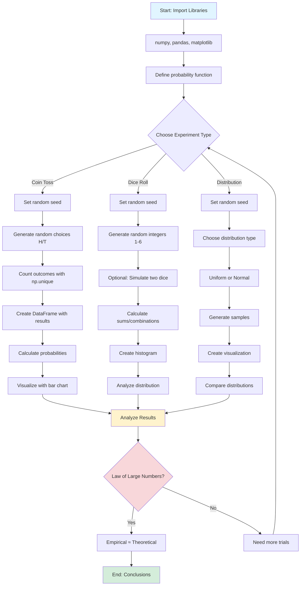
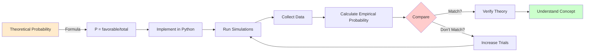
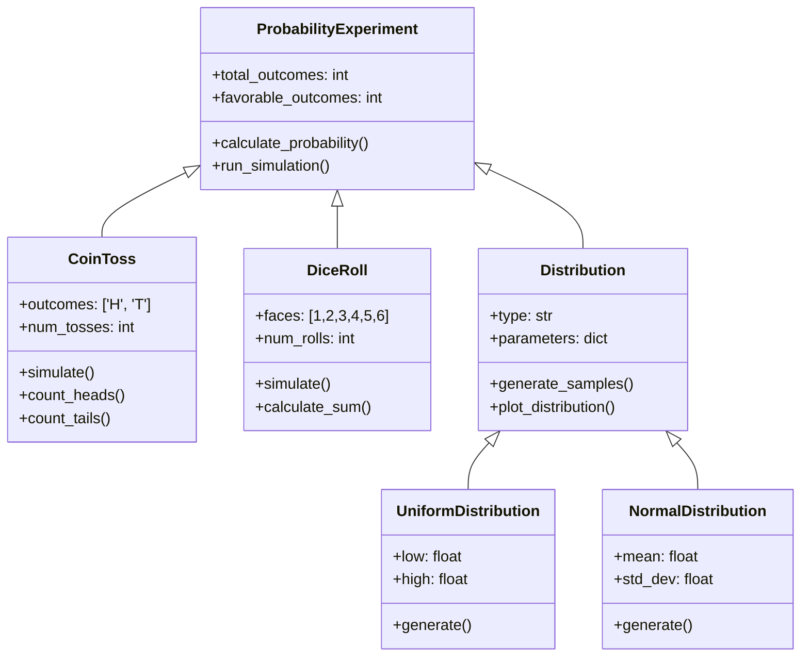
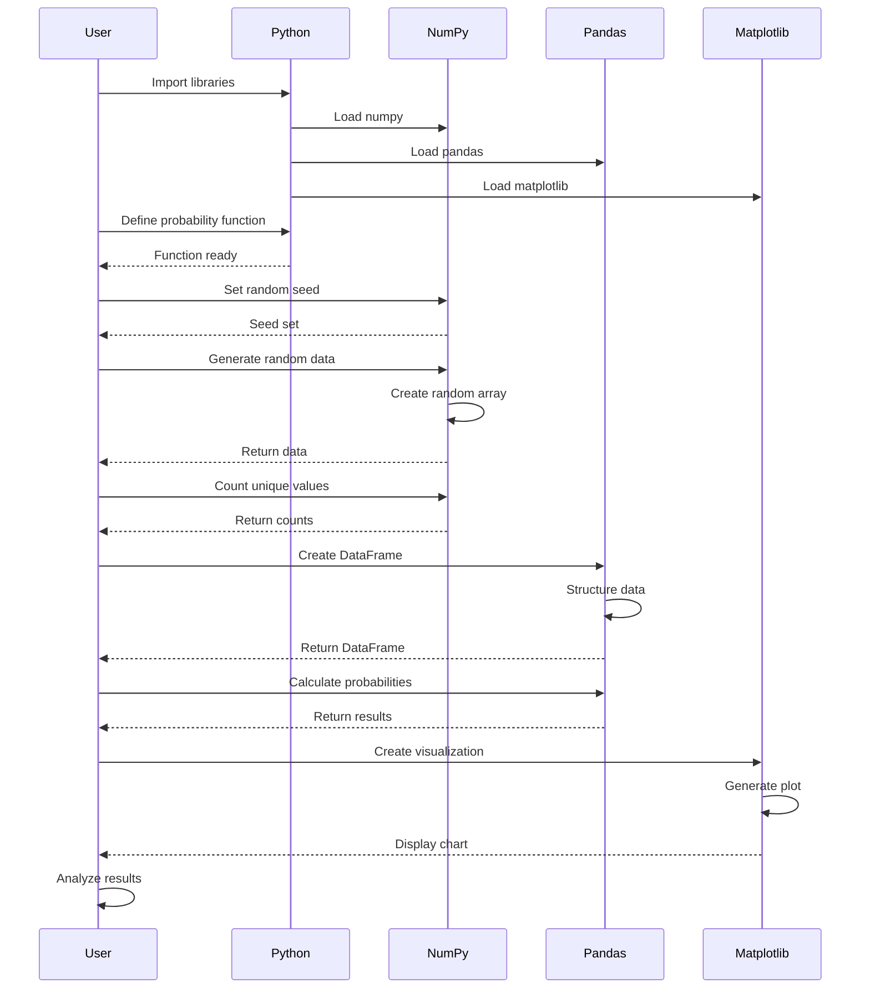
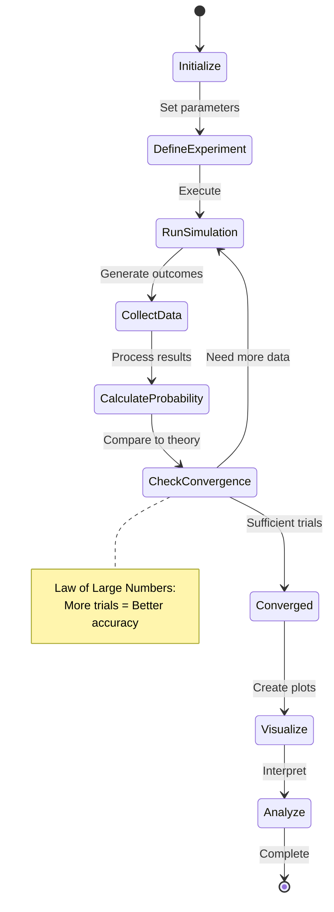
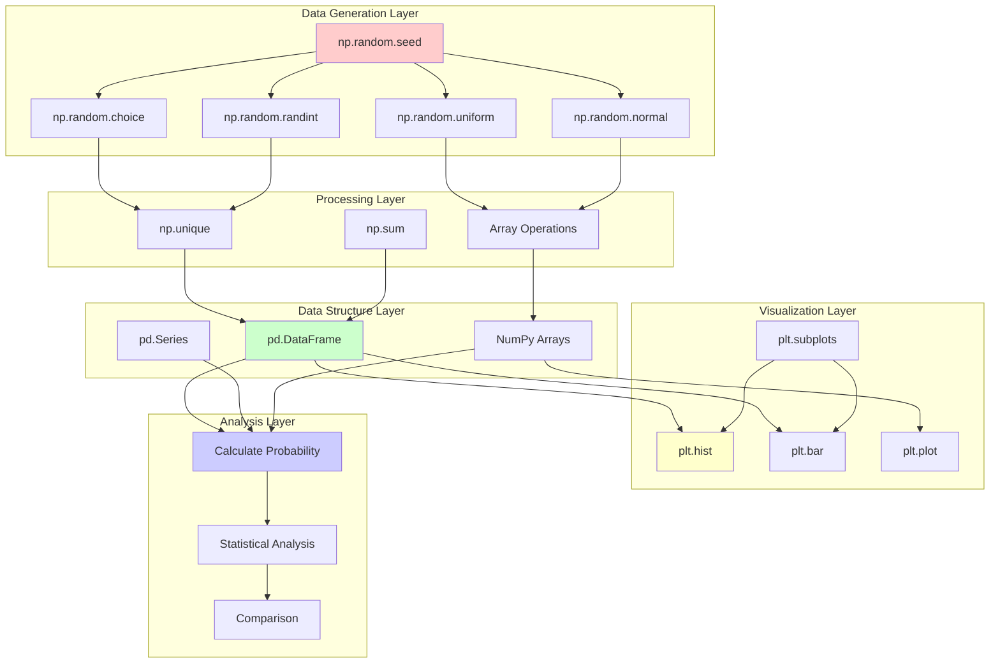

# CODING GUIDE: Introduction to Probability - Live Class Notebook

**Target Audience:** Users with basic Python programming knowledge who are new to probability concepts and data science libraries.

**Purpose:** This guide explains all major coding steps, functions, arguments, and third-party library usage in the probability introduction notebook.

---

## Table of Contents
1. [Library Imports](#library-imports)
2. [Basic Probability Functions](#basic-probability-functions)
3. [Coin Toss Simulations](#coin-toss-simulations)
4. [Dice Roll Simulations](#dice-roll-simulations)
5. [Probability Distributions](#probability-distributions)
6. [Data Analysis with Pandas](#data-analysis-with-pandas)
7. [Visualization Techniques](#visualization-techniques)

---

## Library Imports

### Import: pandas
```python
import pandas as pd
```
**Why:** pandas is a powerful data manipulation library that provides data structures like DataFrames and Series. It's essential for:
- Working with tabular data (like spreadsheets)
- Data cleaning and transformation
- Statistical analysis
- Reading/writing various file formats (CSV, Excel, etc.)

**In this notebook:** Used to organize probability experiment results into structured tables for analysis.

---

### Import: numpy
```python
import numpy as np
```
**Why:** NumPy (Numerical Python) is the fundamental package for scientific computing in Python. It provides:
- Fast array operations
- Mathematical functions (trigonometry, statistics, etc.)
- Random number generation
- Linear algebra operations

**In this notebook:** Used for generating random numbers, performing calculations, and creating arrays for probability simulations.

---

### Import: matplotlib
```python
import matplotlib.pyplot as plt
%matplotlib inline
plt.style.use('default')
```
**Why:** Matplotlib is the primary plotting library in Python for creating visualizations.

**Key components:**
- `matplotlib.pyplot as plt`: The main plotting interface (similar to MATLAB)
- `%matplotlib inline`: Jupyter magic command that displays plots directly in the notebook
- `plt.style.use('default')`: Sets the visual style of plots to the default theme

**In this notebook:** Used to create bar charts, histograms, and other visualizations of probability distributions.

---

## Basic Probability Functions

### Function: probability()
```python
def probability(matching_outcomes, total_outcomes):
    return matching_outcomes/total_outcomes
```

**Purpose:** Calculates the probability of an event occurring.

**Parameters:**
- `matching_outcomes` (int/float): Number of favorable outcomes
- `total_outcomes` (int/float): Total number of possible outcomes

**Returns:** Float between 0 and 1 representing the probability

**Formula:** P(Event) = Favorable Outcomes / Total Outcomes

**Example Usage:**
```python
p_head = probability(1, 2)  # Probability of getting heads in a coin toss = 0.5
```

---

## Coin Toss Simulations

### Single Coin Toss Probability
```python
p_head = probability(1, 2)  # 0.5
p_tail = probability(1, 2)  # 0.5
```

**Concept:** A fair coin has 2 possible outcomes (heads or tails), each equally likely.
- Probability of heads = 1/2 = 0.5
- Probability of tails = 1/2 = 0.5

---

### Simulating Multiple Coin Tosses
```python
np.random.seed(42)  # For reproducibility
tosses = np.random.choice(['H', 'T'], size=1000, p=[0.5, 0.5])
```

**Key Functions:**
- `np.random.seed(42)`: Sets the random number generator seed
  - **Why:** Ensures reproducible results (same "random" numbers each time)
  - **Argument 42:** Any integer works; 42 is commonly used (Hitchhiker's Guide reference)

- `np.random.choice()`: Randomly selects elements from an array
  - **First argument** `['H', 'T']`: Array of possible outcomes
  - **size=1000**: Number of random samples to generate
  - **p=[0.5, 0.5]**: Probability distribution (50% heads, 50% tails)

---

### Counting Outcomes
```python
unique, counts = np.unique(tosses, return_counts=True)
```

**Function:** `np.unique()`
- **Purpose:** Finds unique elements in an array and optionally counts them
- **First argument** `tosses`: The array to analyze
- **return_counts=True**: Also return how many times each unique value appears
- **Returns:** Two arrays - unique values and their counts

---

### Creating a Frequency DataFrame
```python
df = pd.DataFrame({'Outcome': unique, 'Frequency': counts})
df['Probability'] = df['Frequency'] / df['Frequency'].sum()
```

**Steps:**
1. `pd.DataFrame()`: Creates a table with columns 'Outcome' and 'Frequency'
2. `df['Probability']`: Adds a new column
3. `df['Frequency'].sum()`: Sums all frequencies (total tosses)
4. Division calculates empirical probability for each outcome

---

## Dice Roll Simulations

### Single Die Roll
```python
outcomes = [1, 2, 3, 4, 5, 6]
p_any_number = probability(1, 6)  # 1/6 ≈ 0.1667
```

**Concept:** A fair six-sided die has 6 equally likely outcomes.

---

### Simulating Die Rolls
```python
rolls = np.random.randint(1, 7, size=10000)
```

**Function:** `np.random.randint()`
- **Purpose:** Generates random integers
- **First argument (1):** Lower bound (inclusive)
- **Second argument (7):** Upper bound (exclusive) - so generates 1-6
- **size=10000**: Number of random integers to generate

**Why not use choice():** `randint()` is more efficient for generating integers in a range.

---

### Visualizing Die Roll Results
```python
plt.figure(figsize=(10, 6))
plt.hist(rolls, bins=6, edgecolor='black', alpha=0.7)
plt.xlabel('Die Face')
plt.ylabel('Frequency')
plt.title('Distribution of 10,000 Die Rolls')
plt.xticks([1, 2, 3, 4, 5, 6])
plt.show()
```

**Key Functions:**
- `plt.figure(figsize=(10, 6))`: Creates a new figure
  - **figsize:** Tuple (width, height) in inches

- `plt.hist()`: Creates a histogram
  - **rolls**: Data to plot
  - **bins=6**: Number of bins (bars) in the histogram
  - **edgecolor='black'**: Color of bar borders
  - **alpha=0.7**: Transparency (0=transparent, 1=opaque)

- `plt.xlabel()`, `plt.ylabel()`, `plt.title()`: Add labels

- `plt.xticks([1, 2, 3, 4, 5, 6])`: Sets x-axis tick positions

- `plt.show()`: Displays the plot

---

## Compound Events

### Two Dice Rolls
```python
die1 = np.random.randint(1, 7, size=10000)
die2 = np.random.randint(1, 7, size=10000)
sum_dice = die1 + die2
```

**Concept:** When rolling two dice, we can add their values.
- **Possible sums:** 2 through 12
- **Most common sum:** 7 (has the most combinations)

---

### Conditional Probability
```python
# Probability of sum being 7
p_sum_7 = np.sum(sum_dice == 7) / len(sum_dice)
```

**Key Operations:**
- `sum_dice == 7`: Creates boolean array (True where sum is 7)
- `np.sum()`: Counts True values (number of 7s)
- Division by `len(sum_dice)`: Converts count to probability

---

## Probability Distributions

### Uniform Distribution
```python
uniform_data = np.random.uniform(0, 1, size=1000)
```

**Function:** `np.random.uniform()`
- **Purpose:** Generates random numbers from a uniform distribution
- **Arguments:**
  - `0`: Lower bound
  - `1`: Upper bound
  - `size=1000`: Number of samples
- **Result:** All values between 0 and 1 are equally likely

---

### Normal (Gaussian) Distribution
```python
normal_data = np.random.normal(loc=0, scale=1, size=1000)
```

**Function:** `np.random.normal()`
- **Purpose:** Generates random numbers from a normal distribution
- **Parameters:**
  - `loc=0`: Mean (center) of the distribution
  - `scale=1`: Standard deviation (spread)
  - `size=1000`: Number of samples
- **Result:** Bell curve - values near the mean are more common

---

## Advanced Visualization

### Creating Subplots
```python
fig, axes = plt.subplots(1, 2, figsize=(15, 5))
```

**Function:** `plt.subplots()`
- **Purpose:** Creates a figure with multiple subplots
- **Arguments:**
  - `1`: Number of rows
  - `2`: Number of columns
  - `figsize=(15, 5)`: Overall figure size
- **Returns:**
  - `fig`: The figure object
  - `axes`: Array of subplot axes

---

### Plotting on Specific Axes
```python
axes[0].hist(uniform_data, bins=30, edgecolor='black')
axes[0].set_title('Uniform Distribution')
axes[0].set_xlabel('Value')
axes[0].set_ylabel('Frequency')
```

**Key Difference:** When using subplots, use `axes[index].method()` instead of `plt.method()`
- `axes[0]`: First subplot (left)
- `axes[1]`: Second subplot (right)

---

## Data Analysis with Pandas

### Creating DataFrames from Simulations
```python
results_df = pd.DataFrame({
    'Trial': range(1, len(tosses) + 1),
    'Outcome': tosses
})
```

**Purpose:** Organize simulation results in a structured table format.

**Components:**
- Dictionary keys become column names
- `range(1, len(tosses) + 1)`: Creates trial numbers 1, 2, 3, ...
- Values are the arrays/lists for each column

---

### Calculating Cumulative Statistics
```python
results_df['Cumulative_Heads'] = (results_df['Outcome'] == 'H').cumsum()
results_df['Cumulative_Probability'] = results_df['Cumulative_Heads'] / results_df['Trial']
```

**Key Methods:**
- `.cumsum()`: Cumulative sum (running total)
- Boolean indexing: `(results_df['Outcome'] == 'H')` creates True/False column
- Division: Element-wise division to calculate running probability

---

## Key Probability Concepts Demonstrated

### 1. Law of Large Numbers
As the number of trials increases, the empirical probability approaches the theoretical probability.

```python
# After 10 tosses: might see 60% heads
# After 1000 tosses: closer to 50% heads
# After 10000 tosses: very close to 50% heads
```

### 2. Independent Events
Each coin toss or die roll doesn't affect the next one.

### 3. Mutually Exclusive Events
Getting heads and tails on a single coin toss can't both happen.

### 4. Complementary Events
P(Heads) + P(Tails) = 1

---

## Common Patterns and Best Practices

### 1. Setting Random Seeds
```python
np.random.seed(42)
```
**Always do this** when you want reproducible results for testing or sharing code.

### 2. Vectorized Operations
```python
# Good (vectorized)
results = die1 + die2

# Avoid (loop)
results = []
for i in range(len(die1)):
    results.append(die1[i] + die2[i])
```
**Why:** Vectorized operations are much faster in NumPy.

### 3. Descriptive Variable Names
```python
# Good
p_heads = probability(1, 2)

# Avoid
p = probability(1, 2)
```

---

## Summary of Key Functions

| Function | Library | Purpose |
|----------|---------|---------|
| `np.random.seed()` | NumPy | Set random seed for reproducibility |
| `np.random.choice()` | NumPy | Random selection from array |
| `np.random.randint()` | NumPy | Random integers in range |
| `np.random.uniform()` | NumPy | Uniform distribution samples |
| `np.random.normal()` | NumPy | Normal distribution samples |
| `np.unique()` | NumPy | Find unique values and counts |
| `pd.DataFrame()` | Pandas | Create data table |
| `plt.hist()` | Matplotlib | Create histogram |
| `plt.subplots()` | Matplotlib | Create multiple plots |

---

## Practice Exercises

1. **Modify the coin toss simulation** to simulate an unfair coin (70% heads, 30% tails)
2. **Calculate the probability** of rolling a sum greater than 9 with two dice
3. **Create a visualization** comparing uniform and normal distributions side by side
4. **Simulate** drawing cards from a deck and calculate probabilities

---

**End of Coding Guide**


---

## Flow Diagram: Probability Simulation Workflow



---

## Conceptual Flow: Understanding Probability Through Code



---

## Data Flow: From Random Generation to Visualization

```mermaid
flowchart LR
    subgraph Input
        A1[Random Seed]
        A2[Parameters]
        A3[Sample Size]
    end
    
    subgraph Processing
        B1[np.random functions]
        B2[Generate Data]
        B3[NumPy Arrays]
    end
    
    subgraph Analysis
        C1[Count/Calculate]
        C2[Create DataFrame]
        C3[Compute Statistics]
    end
    
    subgraph Output
        D1[Matplotlib Plots]
        D2[Probability Values]
        D3[Insights]
    end
    
    Input --> Processing
    Processing --> Analysis
    Analysis --> Output
    
    style Input fill:#e3f2fd
    style Processing fill:#fff9c4
    style Analysis fill:#f3e5f5
    style Output fill:#c8e6c9
```



---

## Class Hierarchy: Probability Concepts



---

## Sequence Diagram: Simulation Execution



---

## State Diagram: Probability Calculation States



---

## Component Interaction Diagram



---

## End of Diagrams Section
