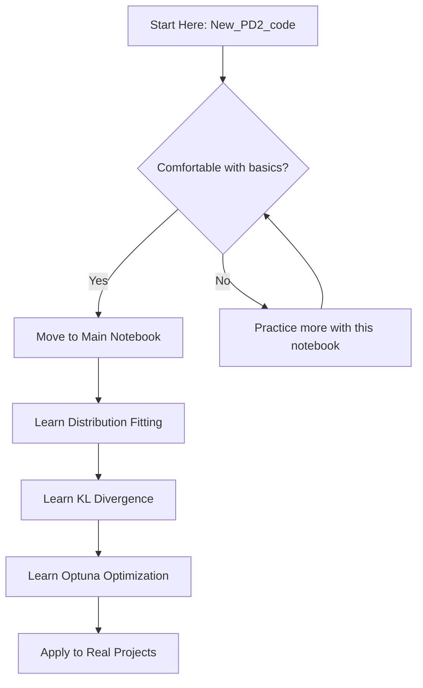

# Coding Guide: New_PD2_code - Simplified Probability Distributions

## Overview
This notebook is a **condensed version** of the main Probability Distribution 2 notebook. It focuses on the core implementations without the advanced fitting techniques.

**Note**: For a comprehensive guide including distribution fitting methods (scipy fit, KL divergence optimization, and Optuna), please refer to `[Mar_16]_Probability_Distribution_2_CODING_GUIDE.md`.

---

## What's Covered in This Notebook

### 1. Uniform Distribution
- Basic random sample generation
- Visualization with histograms
- Statistical analysis (mean, range)

### 2. Beta Distribution
- Generating beta-distributed samples
- Understanding shape parameters (alpha, beta)
- Probability density function (PDF)
- Cumulative distribution function (CDF)
- Percent point function (PPF)

### 3. Normal Distribution
- Gaussian distribution modeling
- Overlaying theoretical PDF on histogram
- Outlier detection using z-scores

### 4. Multivariate Normal Distribution
- Modeling multiple correlated variables
- Understanding covariance matrices
- Extracting individual variables from multivariate samples

### 5. t-Distribution
- Student's t-distribution for small samples
- Comparing with normal distribution
- Degrees of freedom parameter

---

## Key Differences from Main Notebook

| Feature | Main Notebook | This Notebook |
|---------|--------------|---------------|
| **Distribution Fitting** | ✅ Includes 3 methods | ❌ Not included |
| **scipy.stats.fit()** | ✅ Yes | ❌ No |
| **KL Divergence Optimization** | ✅ Yes | ❌ No |
| **Optuna Hyperparameter Tuning** | ✅ Yes | ❌ No |
| **Basic Distributions** | ✅ Yes | ✅ Yes |
| **Visualizations** | ✅ Yes | ✅ Yes |

---

## Quick Code Reference

### Uniform Distribution
```python
from scipy.stats import uniform
import matplotlib.pyplot as plt
import numpy as np

# Generate samples
low, high = 0, 24
samples = uniform.rvs(low, high - low, size=1000)

# Visualize
plt.hist(samples, bins=24, density=True, alpha=0.6, color='b', edgecolor='black')
plt.title('Uniform Distribution')
plt.xlabel('Value')
plt.ylabel('Density')
```

### Beta Distribution
```python
from scipy.stats import beta

# Parameters
a, b = 2, 5

# Generate samples
samples = beta.rvs(a, b, size=1000)

# Calculate probabilities
pdf_value = beta.pdf(0.3, a, b)  # Density at x=0.3
cdf_value = beta.cdf(0.6, a, b)  # P(X ≤ 0.6)
ppf_value = beta.ppf(0.6, a, b)  # Value at 60th percentile
```

### Normal Distribution
```python
from scipy.stats import norm

# Parameters
mean, std = 50, 15

# Generate samples
samples = norm.rvs(mean, std, size=1000)

# Outlier detection
z_scores = (samples - mean) / std
outliers = samples[np.abs(z_scores) > 3]
```

### Multivariate Normal
```python
from scipy.stats import multivariate_normal

# Parameters
mean = [25, 60, 50]  # Temperature, Humidity, PM2.5
cov = [[10, 5, 2],
       [5, 15, 3],
       [2, 3, 20]]

# Generate samples
samples = multivariate_normal.rvs(mean=mean, cov=cov, size=1000)

# Extract variables
temperature = samples[:, 0]
humidity = samples[:, 1]
pm25 = samples[:, 2]
```

### t-Distribution
```python
from scipy.stats import t

# Parameters
df = 10  # Degrees of freedom
loc = 5  # Location (like mean)
scale = 3  # Scale (like std)

# Generate samples
samples = t.rvs(df, loc=loc, scale=scale, size=1000)
```

---

## When to Use This Notebook vs Main Notebook

### Use This Notebook When:
- ✅ You want to quickly understand basic distribution usage
- ✅ You're learning the fundamentals
- ✅ You don't need to fit distributions to real data
- ✅ You want cleaner, simpler code examples

### Use Main Notebook When:
- ✅ You need to fit distributions to real-world data
- ✅ You want to learn optimization techniques
- ✅ You're working on advanced projects
- ✅ You need to compare different fitting methods

---

## Learning Path Recommendation



---

## Practice Exercises

1. **Modify the uniform distribution** to model temperatures between 10°C and 30°C
2. **Change beta parameters** (a, b) and observe how the distribution shape changes
3. **Calculate the probability** that a normally distributed variable with mean=100, std=15 exceeds 130
4. **Create a multivariate distribution** for [Age, Income, Education Years]
5. **Compare** normal and t-distribution with different degrees of freedom

---

## Common Functions Quick Reference

```python
# For any distribution 'dist':
dist.rvs(params, size=n)     # Generate n random samples
dist.pdf(x, params)           # Probability density at x
dist.cdf(x, params)           # Cumulative probability P(X ≤ x)
dist.ppf(q, params)           # Inverse CDF (quantile)

# Histogram for visualization
plt.hist(data, bins=n, density=True, alpha=0.6)
```

---

## Key Takeaways

1. **Uniform Distribution**: All values equally likely in a range
2. **Beta Distribution**: Perfect for modeling proportions (0 to 1)
3. **Normal Distribution**: Most common, bell-shaped, symmetric
4. **Multivariate Normal**: Models multiple related variables together
5. **t-Distribution**: Like normal but with heavier tails, good for small samples

---

## Next Steps

After mastering this notebook:
1. Review the comprehensive guide for the main notebook
2. Learn about distribution fitting techniques
3. Practice with real datasets
4. Explore other distributions (exponential, gamma, etc.)

---

## Additional Resources

- Main Coding Guide: `[Mar_16]_Probability_Distribution_2_CODING_GUIDE.md`
- scipy.stats documentation: https://docs.scipy.org/doc/scipy/reference/stats.html
- Study Guide: `meeting_saved_closed_caption_STUDY_GUIDE.md`

